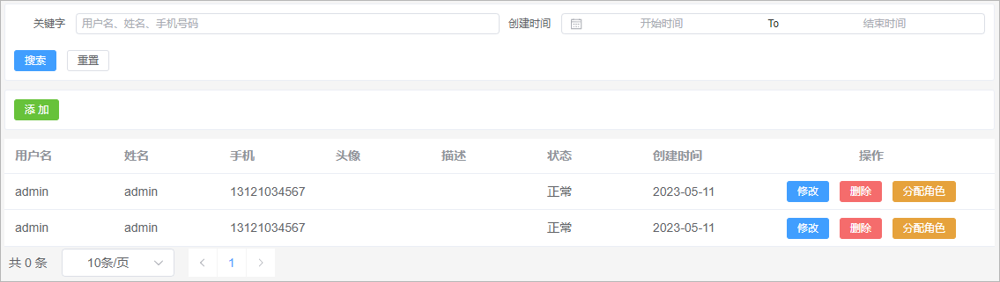
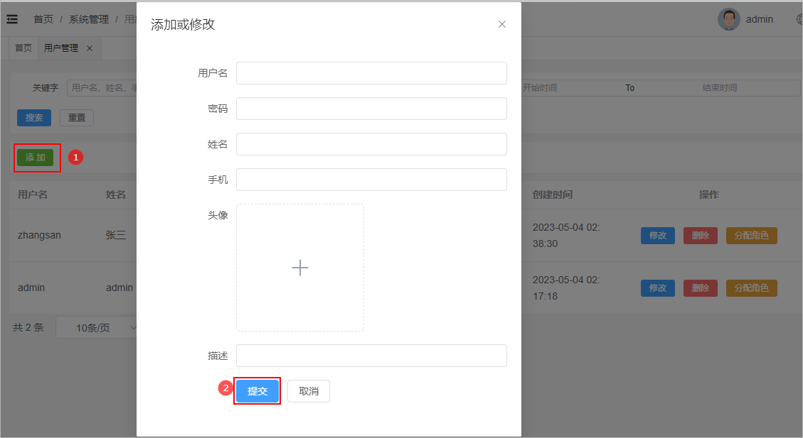
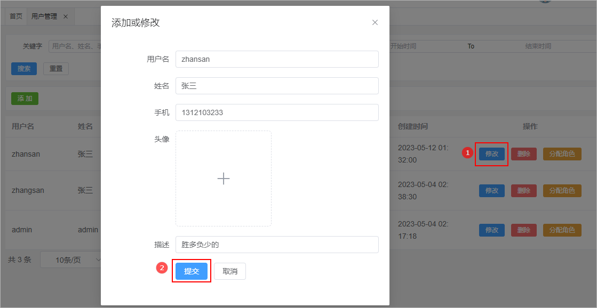
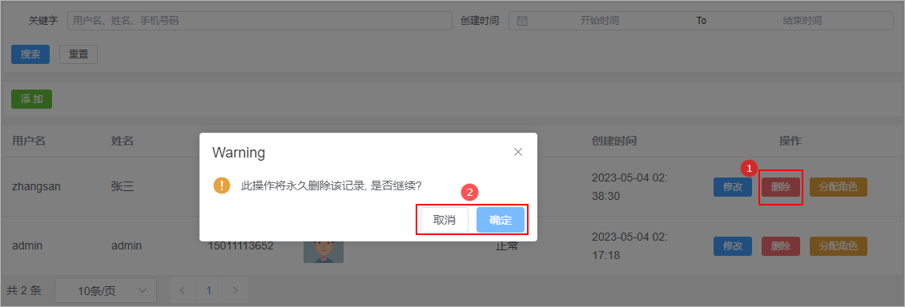
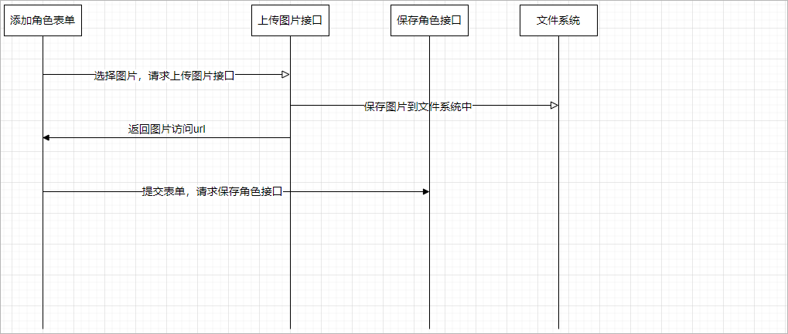
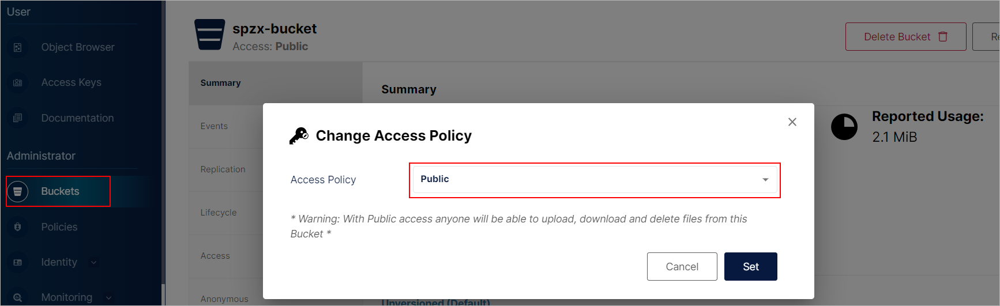
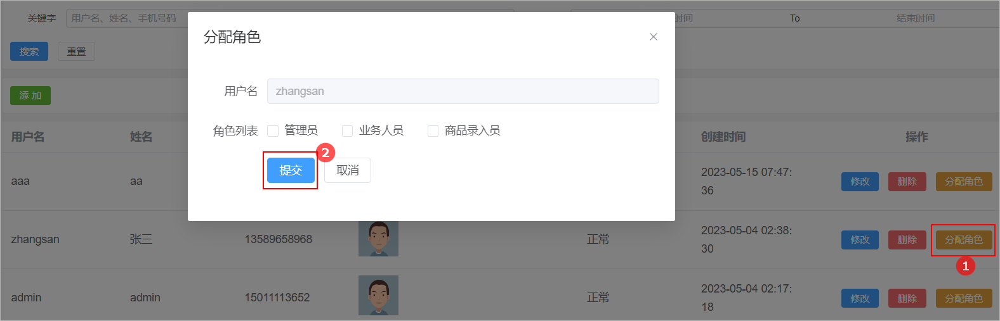

# 1 用户管理

用户管理就是对后台管理系统的使用用户进行维护。

## 1.1 页面制作

对比如下页面结构，使用Element Plus制作出对应的页面，数据可以暂时使用假数据。



该页面可以将其分为4部分：

1、搜索表单

2、添加按钮

3、数据展示表格

4、分页条组件


代码实现如下所示：

```vue
<template>

    <!---搜索表单-->
    <div class="search-div">
        <el-form label-width="70px" size="small">
            <el-row>
                <el-col :span="12">
                <el-form-item label="关键字">
                    <el-input
                    style="width: 100%"
                    placeholder="用户名、姓名、手机号码"
                    ></el-input>
                </el-form-item>
                </el-col>
                <el-col :span="12">
                <el-form-item label="创建时间">
                    <el-date-picker
                    type="daterange"
                    range-separator="To"
                    start-placeholder="开始时间"
                    end-placeholder="结束时间"
                    format="YYYY-MM-DD"
                    value-format="YYYY-MM-DD"
                    />
                </el-form-item>
                </el-col>
            </el-row>
            <el-row style="display:flex">
                <el-button type="primary" size="small">
                搜索
                </el-button>
                <el-button size="small">重置</el-button>
            </el-row>
        </el-form>
    </div>

    <!--添加按钮-->
    <div class="tools-div">
        <el-button type="success" size="small">添 加</el-button>
    </div>

    <!---数据表格-->
    <el-table :data="list" style="width: 100%">
        <el-table-column prop="userName" label="用户名" />
        <el-table-column prop="name" label="姓名" />
        <el-table-column prop="phone" label="手机" />
        <el-table-column prop="avatar" label="头像" #default="scope">
            
        </el-table-column>
        <el-table-column prop="description" label="描述" />
        <el-table-column prop="status" label="状态" #default="scope">
            {{ scope.row.status == 1 ? '正常' : '停用' }}
        </el-table-column>
        <el-table-column prop="createTime" label="创建时间" />
        <el-table-column label="操作" align="center" width="280" >
            <el-button type="primary" size="small">
                修改
            </el-button>
            <el-button type="danger" size="small">
                删除
            </el-button>
            <el-button type="warning" size="small">
                分配角色
            </el-button>
        </el-table-column>
    </el-table>

    <el-pagination
        :page-sizes="[10, 20, 50, 100]"
        layout="total, sizes, prev, pager, next"
        :total="total"
    />

</template>

<script setup>
import { ref } from 'vue'; 

// 表格数据模型
const list = ref([
    {"id":1 , "userName":"admin" , "name": "admin" , "phone":"13121034567" , "status":1 , "createTime": "2023-05-11"} ,
    {"id":2 , "userName":"admin" , "name": "admin" , "phone":"13121034567" , "status":1 , "createTime": "2023-05-11"} 
]);

// 分页条数据模型
const total = ref(0)

</script>

<style scoped>
.search-div {
  margin-bottom: 10px;
  padding: 10px;
  border: 1px solid #ebeef5;
  border-radius: 3px;
  background-color: #fff;
}
.tools-div {
  margin: 10px 0;
  padding: 10px;
  border: 1px solid #ebeef5;
  border-radius: 3px;
  background-color: #fff;
}
</style>
<style scoped>
.avatar-uploader .avatar {
  width: 178px;
  height: 178px;
  display: block;
}
</style>

<style>
.avatar-uploader .el-upload {
  border: 1px dashed var(--el-border-color);
  border-radius: 6px;
  cursor: pointer;
  position: relative;
  overflow: hidden;
  transition: var(--el-transition-duration-fast);
}

.avatar-uploader .el-upload:hover {
  border-color: var(--el-color-primary);
}

.el-icon.avatar-uploader-icon {
  font-size: 28px;
  color: #8c939d;
  width: 178px;
  height: 178px;
  text-align: center;
}
</style>
```

## 1.2 查询用户

### 1.2.1 需求说明

需求说明：

1、如果在搜索表单中输入和查询关键字以及创建的开始时间和结束是时间，那么此时就需要按照查询关键字以及创建的开始时间和结束是时间进行条

件查询

2、查询关键字搜索的字段可以是用户名、姓名、手机号码。在查询的时候需要继续按照这些字段进行模糊查询。

2、搜索的时候需要进行分页搜索

### 1.2.2 后端接口

#### 需求分析

1、前端提交请求参数的时候包含了两部分的参数：搜索条件参数、分页参数。搜索条件参数可以通过?拼接到请求路径后面，分页参数【当前页码、每

页显示的数据条数】可以让前端通过请求路径传递过来

2、后端查询完毕以后需要给前端返回一个分页对象，分页对象中就封装了分页相关的参数(当前页数据、总记录数、总页数...)

3、前端进行参数传递的时候，不一定会传递搜索条件，因此sql语句的编写需要使用到动态sql

#### SysUser

针对当前要操作的数据库表定义一个与之对应的实体类：

```java
// com.atguigu.spzx.model.entity.system
@Data
public class SysUser extends BaseEntity {

	private static final long serialVersionUID = 1L;
	private String userName;
	private String password;
	private String name;
	private String phone;
	private String avatar;
	private String description;
	private Integer status;

}
```

#### SysUserDto

定义一个实体类用来封装前端所传递过来的查询参数，具体定义如下所示：

```java
// com.atguigu.spzx.model.dto.system
@Data
public class SysUserDto {

    private String keyword ;
    private String createTimeBegin ;
    private String createTimeEnd;

}
```

#### SysUserController

表现层代码：

```java
// com.atguigu.spzx.manager.controller
@RestController
@RequestMapping(value = "/admin/system/sysUser")
public class SysUserController {

    @Autowired
    private SysUserService sysUserService ;

    @GetMapping(value = "/findByPage/{pageNum}/{pageSize}")
    public Result<PageInfo<SysRole>> findByPage(SysUserDto sysUserDto ,
                                                @PathVariable(value = "pageNum") Integer pageNum ,
                                                @PathVariable(value = "pageSize") Integer pageSize) {
        PageInfo<SysUser> pageInfo = sysUserService.findByPage(sysUserDto , pageNum , pageSize) ;
        return Result.build(pageInfo , ResultCodeEnum.SUCCESS) ;
    }

}
```

#### SysUserService

业务层代码实现

```java
// com.atguigu.spzx.manager.service.impl
@Override
public PageInfo<SysUser> findByPage(SysUserDto sysUserDto, Integer pageNum, Integer pageSize) {
    PageHelper.startPage(pageNum , pageSize);
    List<SysUser> sysUserList = sysUserMapper.findByPage(sysUserDto) ;
    PageInfo pageInfo = new PageInfo(sysUserList) ;
    return pageInfo;
}
```

#### SysUserMapper

持久层代码实现

```java
@Mapper
public interface SysUserMapper {
    public abstract List<SysUser> findByPage(SysUserDto sysUserDto);
}
```

#### SysUserMapper.xml

在映射文件中定义对应的sql语句

```xml
<sql id="findPageWhere">
    <where>
        <if test="keyword != null and keyword != ''">
            and (username like CONCAT('%',#{keyword},'%') or name like CONCAT('%',#{keyword} , '%') or phone like CONCAT('%',#{keyword} , '%'))
        </if>
        <if test="createTimeBegin != null and createTimeBegin != ''">
            and create_time >= #{createTimeBegin}
        </if>
        <if test="createTimeEnd != null and createTimeEnd != ''">
            and create_time &lt;= #{createTimeEnd}
        </if>
        and is_deleted = 0
    </where>
</sql>

<select id="findByPage" resultType="com.atguigu.spzx.model.entity.system.SysUser" >
    select <include refid="columns" />
    from sys_user
    <include refid="findPageWhere"/>
    order by id desc
</select>
```

### 1.2.3 前端对接

#### 实现思路

如下所示：

1、定义发送请求方法

2、搜索表单绑定对应数据模型

3、onMounted钩子函数发送请求查询数据

4、分页条绑定数据模型以及对应事件

#### sysUser.js

在api目录下创建一个sysUser.js文件，文件的内容如下所示：

```javascript
import request from '@/utils/request'

// 分页查询
export const GetSysUserListByPage = (pageNum , pageSize , queryDto) => {
    return request({
        url: "/admin/system/sysUser/findByPage/" + pageNum + "/" + pageSize,
        method: 'get',
        params: queryDto
    })
}
```

#### sysRole.vue

更改views/system/sysRole.vue文件

```html
<!-- 搜索表单 -->
<!---搜索表单-->
<div class="search-div">
    <el-form label-width="70px" size="small">
        <el-row>
            <el-col :span="12">
                <el-form-item label="关键字">
                    <el-input v-model="queryDto.keyword"
                              style="width: 100%"
                              placeholder="用户名、姓名、手机号码"
                              ></el-input>
                </el-form-item>
            </el-col>
            <el-col :span="12">
                <el-form-item label="创建时间">
                    <el-date-picker v-model="createTimes"
                                    type="daterange"
                                    range-separator="To"
                                    start-placeholder="开始时间"
                                    end-placeholder="结束时间"
                                    format="YYYY-MM-DD"
                                    value-format="YYYY-MM-DD"
                                    />
                </el-form-item>
            </el-col>
        </el-row>
        <el-row style="display:flex">
            <el-button type="primary" size="small" @click="searchSysUser">
                搜索
            </el-button>
            <el-button size="small" @click="resetData">重置</el-button>
        </el-row>
    </el-form>
</div>  

<!---数据表格-->
<el-table :data="list" style="width: 100%">
    <el-table-column prop="userName" label="用户名" />
    <el-table-column prop="name" label="姓名" />
    <el-table-column prop="phone" label="手机" />
    <el-table-column prop="avatar" label="头像" #default="scope">
        
    </el-table-column>
    <el-table-column prop="description" label="描述" />
    <el-table-column prop="status" label="状态" #default="scope">
        {{ scope.row.status == 1 ? '正常' : '停用' }}
    </el-table-column>
    <el-table-column prop="createTime" label="创建时间" />
    <el-table-column label="操作" align="center" width="280" >
        <el-button type="primary" size="small">
            修改
        </el-button>
        <el-button type="danger" size="small">
            删除
        </el-button>
        <el-button type="warning" size="small">
            分配角色
        </el-button>
    </el-table-column>
</el-table>

<el-pagination
               v-model:current-page="pageParams.page"
               v-model:page-size="pageParams.limit"
               :page-sizes="[10, 20, 50, 100]"
               layout="total, sizes, prev, pager, next"
               :total="total"
               />

<script setup>
import { ref , onMounted } from 'vue'; 
import { GetSysUserListByPage } from '@/api/sysUser';

// 表格数据模型
const list = ref([
    {"id":1 , "username":"admin" , "name": "admin" , "phone":"13121034567" , "status":1 , "createTime": "2023-05-11"} ,
    {"id":2 , "username":"admin" , "name": "admin" , "phone":"13121034567" , "status":1 , "createTime": "2023-05-11"} 
]);

// 分页条数据模型
const total = ref(0)

// 定义搜索表单数据模型
const queryDto = ref({
    keyword: "" ,
    createTimeBegin: "",
    createTimeEnd: ""
})
const createTimes = ref([])

//分页数据
const pageParamsForm = {
  page: 1, // 页码
  limit: 10, // 每页记录数
}
const pageParams = ref(pageParamsForm)

// onMounted钩子函数
onMounted(() => {
    fetchData() ;
})

// 搜素按钮点击事件处理函数
const searchSysUser = () => {
    fetchData()
}

// 重置按钮点击事件处理函数
const resetData = () => {
    queryDto.value = {}
    createTimes.value = []
}

// 定义分页查询方法
const fetchData = async () => {
    if (createTimes.value.length == 2) {
        queryDto.value.createTimeBegin = createTimes.value[0]
        queryDto.value.createTimeEnd = createTimes.value[1]
    }
    // 请求后端接口进行分页查询
    const { code , message , data } = await GetSysUserListByPage(pageParams.value.page , pageParams.value.limit , queryDto.value)
    list.value = data.list
    total.value = data.total
}

</script>
```

## 1.3 添加用户

### 1.3.1 需求说明

当用户点击添加按钮的时候，那么此时就弹出对话框，在该对话框中需要展示添加用户表单。当用户在该表单中点击提交按钮的时候那么此时就需要将

表单进行提交，在后端需要提交过来的表单数据保存到数据库中即可。页面效果如下所示：

 

### 1.3.2 页面制作

页面代码如下所示：

```vue
<!--添加按钮-->
<div class="tools-div">
    <el-button type="success" size="small" @click="addShow">添 加</el-button>
</div>

<el-dialog v-model="dialogVisible" title="添加或修改" width="40%">
    <el-form label-width="120px">
        <el-form-item label="用户名">
            <el-input />
        </el-form-item>
        <el-form-item label="密码">
            <el-input />
        </el-form-item>
        <el-form-item label="姓名">
            <el-input />
        </el-form-item>
        <el-form-item label="手机">
            <el-input />
        </el-form-item>
        <el-form-item label="头像">
            <el-upload
                       class="avatar-uploader"
                       action="http://localhost:8501/admin/system/fileUpload"
                       :show-file-list="false"
                       >
                
                <el-icon v-else class="avatar-uploader-icon"><Plus /></el-icon>
            </el-upload>
        </el-form-item>
        <el-form-item label="描述">
            <el-input  />
        </el-form-item>
        <el-form-item>
            <el-button type="primary" >提交</el-button>
            <el-button @click="dialogVisible = false">取消</el-button>
        </el-form-item>
    </el-form>
</el-dialog> 

<script setup>

// 添加表单对话框显示隐藏控制变量
const dialogVisible = ref(false)
const addShow = () => {
    dialogVisible.value = true 
}

// 定义提交表单数据模型
const defaultForm = {
    avatar: ""
}
const sysUser = ref(defaultForm)
</script>
```

### 1.3.3 后端接口

#### SysUserController

表现层代码

```java
// com.atguigu.spzx.manager.controller.SysUserController
@PostMapping(value = "/sysUser")
public Result saveSysUser(@RequestBody SysUser sysUser) {
    sysUserService.saveSysUser(sysUser) ;
    return Result.build(null , ResultCodeEnum.SUCCESS) ;
}
```

#### SysUserService

业务层代码

```java
// com.atguigu.spzx.manager.service.impl.SysUserServiceImpl
@Override
public void saveSysUser(SysUser sysUser) {

    // 根据输入的用户名查询用户
    SysUser dbSysUser = sysUserMapper.findByUserName(sysUser.getUserName()) ;
    if(dbSysUser != null) {
        throw new GuiguException(ResultCodeEnum.USER_NAME_IS_EXISTS) ;
    }

    // 对密码进行加密
    String password = sysUser.getPassword();
    String digestPassword = DigestUtils.md5DigestAsHex(password.getBytes());
    sysUser.setPassword(digestPassword);
    sysUser.setStatus(0);
    sysUserMapper.saveSysUser(sysUser) ;
}
```

#### SysUserMapper

持久层代码

```java
@Mapper
public interface SysUserMapper {
    public abstract SysUser findByUserName(String name);
    public abstract void saveSysUser(SysUser sysUser);
}
```

#### SysUserMapper.xml

在映射文件中定义对应的sql语句

```xml
<select id="findByUserName" resultType="com.atguigu.spzx.model.entity.system.SysUser">
    select <include refid="columns" /> from sys_user where username = #{userName}
</select>

<insert id="saveSysUser">
    insert into sys_user (
        id,
        username,
        password,
        name,
        phone,
        avatar,
        description,
        status
    ) values (
        #{id},
        #{userName},
        #{password},
        #{name},
        #{phone},
        #{avatar},
        #{description},
        #{status}
    )
</insert>
```

### 1.3.4 前端对接

#### 实现思路

1、给表单绑定数据模型

2、给提交按钮绑定点击事件

3、点击按钮请求后端地址

#### sysUser.js

在api目录下创建一个sysUser.js文件，文件的内容如下所示：

```java
// 新增用户的方法
export const SaveSysUser = (data) => {
    return request({
        url: "/admin/system/sysUser/saveSysUser",
        method: "post",
        data
    })
}
```

#### sysRole.vue

更改views/system/sysRole.vue文件，内容如下所示：

```vue
<el-dialog v-model="dialogVisible" title="添加或修改" width="40%">
    <el-form label-width="120px">
        <el-form-item label="用户名">
            <el-input v-model="sysUser.userName"/>
        </el-form-item>
        <el-form-item label="密码">
            <el-input type="password" show-password v-model="sysUser.password"/>
        </el-form-item>
        <el-form-item label="姓名">
            <el-input v-model="sysUser.name"/>
        </el-form-item>
        <el-form-item label="手机">
            <el-input v-model="sysUser.phone"/>
        </el-form-item>
        <el-form-item label="头像">
            <el-upload
                       class="avatar-uploader"
                       action="http://localhost:8501/admin/system/fileUpload"
                       :show-file-list="false"
                       >
                
                <el-icon v-else class="avatar-uploader-icon"><Plus /></el-icon>
            </el-upload>
        </el-form-item>
        <el-form-item label="描述">
            <el-input  v-model="sysUser.description"/>
        </el-form-item>
        <el-form-item>
            <el-button type="primary" @click="submit">提交</el-button>
            <el-button @click="dialogVisible = false">取消</el-button>
        </el-form-item>
    </el-form>
</el-dialog> 

<script setup>
import { GetSysUserListByPage , SaveSysUser } from '@/api/sysUser';
import { ElMessage, ElMessageBox } from 'element-plus'
    
// 定义提交表单数据模型
const defaultForm = {
    userName:"",
    name: "" ,
    phone: "" ,
    password: "" ,
    description:"",
    avatar: ""
}
const sysUser = ref(defaultForm)

// 提交按钮事件处理函数
const submit = async () => {
    const {code , message , data} = await SaveSysUser(sysUser.value) 
    if(code === 200) {
        dialogVisible.value = false
        ElMessage.success('操作成功')
        fetchData()
    }else {
        ElMessage.error(message)
    }
}
</script>
```

## 1.4 修改用户

### 1.4.1 需求说明

当用户点击修改按钮的时候，那么此时就弹出对话框，在该对话框中需要将当前行所对应的用户数据在该表单页面进行展示。当用户在该表单中点击提

交按钮的时候那么此时就需要将表单进行提交，在后端需要提交过来的表单数据修改数据库中的即可。页面效果如下所示：

 

注意：在进行修改的时候密码框不要进行展示，密码不允许进行修改，可以通过v-if进行控制。

### 1.4.2 数据回显

分析：

1、使用添加数据的表单即可

2、要将当前操作行的数据展示在表单中，那么此时需要用到插槽

代码如下所示：

```vue
<el-table-column label="操作" align="center" width="280" #default="scope" >
    <el-button type="primary" size="small" @click="editSysUser(scope.row)">
        修改
    </el-button>
</el-table-column>

<script setup>
    
// 修改按钮点击事件处理函数
const editSysUser = (row) => {
    dialogVisible.value = true 
    sysUser.value = row
}

</script>
```

### 1.4.3 提交修改

#### 后端接口

##### SysUserController

表现层代码

```java
// com.atguigu.spzx.manager.controller.SysUserController
@PutMapping(value = "/updateSysUser")
public Result updateSysUser(@RequestBody SysUser sysUser) {
    sysUserService.updateSysUser(sysUser) ;
    return Result.build(null , ResultCodeEnum.SUCCESS) ;
}
```

##### SysUserService

业务层代码

```java
// com.atguigu.spzx.manager.service.impl.SysUserServiceImpl
@Override
public void updateSysUser(SysUser sysUser) {
    sysUserMapper.updateSysUser(sysUser) ;
}
```

##### SysUserMapper

持久层代码

```java
// com.atguigu.spzx.manager.mapper.SysUserMapper
public abstract void updateSysUser(SysUser sysUser);
```

##### SysUserMapper.xml

映射文件添加如下sql语句：

```xml
<update id="updateSysUser">
    update sys_user set
    <if test="userName != null and userName != ''">
        username = #{userName},
    </if>
    <if test="password != null and password != ''">
        password = #{password},
    </if>
    <if test="name != null and name != ''">
        name = #{name},
    </if>
    <if test="phone != null and phone != ''">
        phone = #{phone},
    </if>
    <if test="description != null and description != ''">
        description = #{description},
    </if>
    <if test="status != null and status != ''">
        status = #{status},
    </if>
    update_time =  now()
    where
    id = #{id}
</update>
```

#### 前端对接

##### sysUser.js

在api目录下创建一个sysUser.js文件，文件的内容如下所示：

```java
// 修改用户数据的方法
export const UpdateSysUser = (sysUser) => {
    return request({
        url: "/admin/system/sysUser/updateSysUser",
        method: "put",
        data: sysUser
    })
}
```

##### sysUser.vue

更改views/system/sysUser.vue文件

```java
<script setup>
import { GetSysUserListByPage , SaveSysUser , UpdateSysUser } from '@/api/sysUser';

// 提交按钮事件处理函数
const submit = async () => {
    if(!sysUser.value.id) {
        const {code , message , data} = await SaveSysUser(sysUser.value) 
        if(code === 200) {
            dialogVisible.value = false
            ElMessage.success('操作成功')
            fetchData()
        }else {
            ElMessage.error(message)
        }

    }else {
        const {code , message , data} = await UpdateSysUser(sysUser.value) 
        if(code === 200) {
            dialogVisible.value = false
            ElMessage.success('操作成功')
            fetchData()
        }else {
            ElMessage.error(message)
        }   
    }
    
}
</script>
```

## 1.5 删除用户

### 1.5.1 需求说明

当点击删除按钮的时候此时需要弹出一个提示框，询问是否需要删除数据？如果用户点击是，那么此时向后端发送请求传递id参数，后端接收id参数进

行逻辑删除。页面效果如下所示：

 

### 1.5.2 后端接口

#### SysRoleController

表现层代码实现

```java
// com.atguigu.spzx.manager.controller.SysUserController
@DeleteMapping(value = "/deleteById/{userId}")
public Result deleteById(@PathVariable(value = "userId") Long userId) {
    sysUserService.deleteById(userId) ;
    return Result.build(null , ResultCodeEnum.SUCCESS) ;
}
```

#### SysRoleService

业务层代码实现

```java
// com.atguigu.spzx.manager.service.impl.SysUserServiceImpl
@Override
public void deleteById(Long userId) {
    sysUserMapper.deleteById(userId) ;
}
```

#### SysRoleMapper

持久层代码实现

```java
// com.atguigu.spzx.manager.mapper.SysUserMapper
public abstract void deleteById(Long userId);
```

#### SysRoleMapper.xml

在映射文件中添加如下的sql语句：

```xml
<delete id="deleteById">
    update sys_user set
    update_time = now() ,
    is_deleted = 1
    where
    id = #{id}
</delete>
```

### 1.5.3 前端对接

#### sysUser.js

在api目录下创建一个sysUser.js文件，文件的内容如下所示：

```java
// 根据id删除用户
export const DeleteSysUserById = (userId) => {
    return request({
        url: "/admin/system/sysUser/deleteById/" + userId,
        method: 'delete'
    })
}
```

#### sysUser.vue

更改views/system/sysRole.vue文件

```vue
<el-table-column label="操作" align="center" width="280" #default="scope" >
    <el-button type="danger" size="small" @click="deleteById(scope.row)">
        删除
    </el-button>
</el-table-column>

<script setup>
import { GetSysUserListByPage , SaveSysUser , UpdateSysUser , DeleteSysUserById} from '@/api/sysUser';
import { ElMessage, ElMessageBox } from 'element-plus'
    
// 删除角色
const deleteById = (row) => {
    ElMessageBox.confirm('此操作将永久删除该记录, 是否继续?', 'Warning', {
        confirmButtonText: '确定',
        cancelButtonText: '取消',
        type: 'warning',
    }).then(async () => {
       const {code } = await DeleteSysUserById(row.id)
       if(code === 200) {
            ElMessage.success('删除成功')
            fetchData()
       }
    }).catch(() => {
        ElMessage.info('取消删除')
    })
}
</script>
```

# 2 用户头像

## 2.1 需求分析

当在进行用户添加的时候，此时可以在添加表单页面点击"+"号，然后选择要上传的用户图像。选择完毕以后，那么此时就会请求后端上传文件接口，

将图片的二进制数据传递到后端。后端需要将数据图片存储起来，然后给前端返回图片的访问地址，然后前端需要将图片的访问地址设置给sysUser数

据模型，当用户点击提交按钮的时候，那么此时就会将表单进行提交，后端将数据保存起来即可。

对应的流程图如下所示：

 

## 2.2 文件存储方案

常见的文件存储方案以及优缺点比较：

|      方案介绍      |                           基本介绍                           |                             优点                             | 缺点                                                         |
| :----------------: | :----------------------------------------------------------: | :----------------------------------------------------------: | ------------------------------------------------------------ |
|    本地文件存储    |              将文件直接存储在服务器本地的硬盘上              | 简单易用，不需要额外的网络设备或服务，可直接读写本地磁盘上的文件。 | 单机存储容量和并发性有限，不具备高可用性和容错能力，可能会影响数据安全和系统稳定性。 |
| **分布式文件系统** |    将文件分散存储在多个服务器上，通过网络进行访问和管理。    | 可横向扩展、高可用性、容错能力强，支持大规模数据存储和访问，并提供数据备份和恢复等功能。 | 部署和维护成本较高，对网络通信和硬件环境要求较高。           |
|    对象存储服务    | 将文件以对象的形式存储在云服务提供商的存储设施中，并采用HTTP REST API等方式进行访问。 | 可通过HTTP REST API进行访问，具有高可用性、容错能力强，数据安全性好，同时也可以根据实际使用情况灵活调整存储空间和计费方式。 | 上传和下载速度可能受到网络带宽和延迟等因素的影响，并且使用时可能需要付费。 |

本次我们选择分布式文件系统来存储我们系统中的图片数据。

## 2.3 Minio使用

### 2.3.1 Minio介绍

官网：https://www.minio.org.cn/

MinIO是一个开源的分布式对象存储服务器，支持S3协议并且可以在多节点上实现数据的高可用和容错。它采用Go语言开发，拥有轻量级、高性能、

易部署等特点，并且可以自由选择底层存储介质。


MinIO的主要特点包括：

1、高性能：MinIO基于GO语言编写，具有高速、轻量级、高并发等性能特点，还支持多线程和缓存等机制进行优化，可以快速地处理大规模数据。

2、可扩展性：MinIO采用分布式存储模式，支持水平扩展，通过增加节点数量来扩展存储容量和性能，支持自动数据迁移和负载均衡。

3、安全性：MinIO提供了多种安全策略，如访问控制列表（ACL）、服务端加密（SSE）、传输层安全性（TLS）等，可以保障数据安全和隐私。

4、兼容性：MinIO兼容AWS S3 API，还支持其他云服务提供商的API，比如GCP、Azure等，可以通过简单的配置实现互操作性。

5、简单易用：MinIO的部署和管理非常简单，只需要运行一个二进制包即可启动服务，同时提供了Web界面和命令行工具等方便的管理工具。


**S3协议**是Amazon Web Services (AWS) 提供的对象存储服务（Simple Storage Service）的API协议。它是一种 RESTful风格的Web服务接口，使

用HTTP/HTTPS协议进行通信，支持多种编程语言和操作系统，并实现了数据的可靠存储、高扩展性以及良好的可用性。

### 2.3.2 Minio安装

官网地址：https://www.minio.org.cn/docs/cn/minio/container/index.html

具体命令：

```java
// 创建数据存储目录
mkdir -p ~/minio/data

// 创建minio
docker run \
   -p 9001:9000 \
   -p 9090:9090 \
   --name minio \
   -v ~/minio/data:/data \
   -e "MINIO_ROOT_USER=admin" \
   -e "MINIO_ROOT_PASSWORD=admin123456" \
   -d \
   quay.io/minio/minio server /data --console-address ":9090"
```

### 2.3.3 Minio入门

本章节会给大家介绍一下如何通过Java客户端操作Minio，可以参考官网地址。

官网地址：https://min.io/docs/minio/linux/developers/java/minio-java.html

具体步骤：

1、加入如下依赖

```xml
<!-- common-util模块中加入如下依赖 -->
<dependency>
    <groupId>io.minio</groupId>
    <artifactId>minio</artifactId>
    <version>8.5.2</version>
</dependency>
```

2、示例代码

```java
public class FileUploadTest {

    public static void main(String[] args) throws Exception {

        // 创建一个Minio的客户端对象
        MinioClient minioClient = MinioClient.builder()
                        .endpoint("http://192.168.136.142:9001")
                        .credentials("admin", "admin123456")
                        .build();

        boolean found = minioClient.bucketExists(BucketExistsArgs.builder().bucket("spzx-bucket").build());

        // 如果不存在，那么此时就创建一个新的桶
        if (!found) {
            minioClient.makeBucket(MakeBucketArgs.builder().bucket("spzx-bucket").build());
        } else {  // 如果存在打印信息
            System.out.println("Bucket 'spzx-bucket' already exists.");
        }

        FileInputStream fis = new FileInputStream("D://images//1.jpg") ;
        PutObjectArgs putObjectArgs = PutObjectArgs.builder()
                .bucket("spzx-bucket")
                .stream(fis, fis.available(), -1)
                .object("1.jpg")
                .build();
        minioClient.putObject(putObjectArgs) ;

        // 构建fileUrl
        String fileUrl = "http://192.168.136.142:9001/spzx-bucket/1.jpg" ;
        System.out.println(fileUrl);

    }

}
```

注意：设置minio的中该桶的访问权限为public，如下所示：

 

## 2.4 上传文件接口

### 2.4.1 FileUploadController

上传文件的表现层代码：

```java
@RestController
@RequestMapping("/admin/system")
public class FileUploadController {

    @Autowired
    private FileUploadService fileUploadService ;

    @PostMapping(value = "/fileUpload")
    public Result<String> fileUploadService(@RequestParam(value = "file") MultipartFile multipartFile) {
        String fileUrl = fileUploadService.fileUpload(multipartFile) ;
        return Result.build(fileUrl , ResultCodeEnum.SUCCESS) ;
    }

}
```

### 2.4.2 FileUploadService

上传文件的业务层代码：

```java
@Service
public class FileUploadServiceImpl implements FileUploadService {

    @Autowired
    private MinioProperties minioProperties ;

    @Override
    public String fileUpload(MultipartFile multipartFile) {

        try {

            // 创建一个Minio的客户端对象
            MinioClient minioClient = MinioClient.builder()
                    .endpoint(minioProperties.getEndpointUrl())
                    .credentials(minioProperties.getAccessKey(), minioProperties.getSecreKey())
                    .build();

            // 判断桶是否存在
            boolean found = minioClient.bucketExists(BucketExistsArgs.builder().bucket(minioProperties.getBucketName()).build());
            if (!found) {       // 如果不存在，那么此时就创建一个新的桶
                minioClient.makeBucket(MakeBucketArgs.builder().bucket(minioProperties.getBucketName()).build());
            } else {  // 如果存在打印信息
                System.out.println("Bucket 'spzx-bucket' already exists.");
            }

            // 设置存储对象名称
            String extFileName = FileNameUtils.getExtension(multipartFile.getOriginalFilename());
            String fileName = new SimpleDateFormat("yyyyMMdd")
                    .format(new Date()) + "/" + UUID.randomUUID().toString().replace("-" , "") + "." + extFileName;

            PutObjectArgs putObjectArgs = PutObjectArgs.builder()
                    .bucket(minioProperties.getBucketName())
                    .stream(multipartFile.getInputStream(), multipartFile.getSize(), -1)
                    .object(fileName)
                    .build();
            minioClient.putObject(putObjectArgs) ;

            return minioProperties.getEndpointUrl() + "/" + minioProperties.getBucketName() + "/" + fileName ;

        } catch (Exception e) {
            throw new RuntimeException(e);
        }

    }
}
```

### 2.4.3 MinioProperties

将构建MinioClient所对应的参数定义到配置文件中，然后通过该实体类封装该配置文件中的内容。

```java
@Data
@ConfigurationProperties(prefix="spzx.minio") //读取节点
public class MinioProperties {

    private String endpointUrl;
    private String accessKey;
    private String secreKey;
    private String bucketName;

}
```

### 2.4.4 配置文件内容

在配置文件中添加Minio的相关配置

```yaml
# 自定义配置
spzx:
  minio:
    endpointUrl: http://192.168.136.142:9001
    accessKey: admin
    secreKey: admin123456
    bucketName: sph
```

通过postman进行测试。

## 2.5 前端对接

修改sysUser.vue上传图片的页面代码，如下所示：

```vue
<el-upload
           class="avatar-uploader"
           action="http://localhost:8503/admin/system/fileUpload"
           :show-file-list="false"
           :on-success="handleAvatarSuccess"
           :headers="headers"
>
    
<script setup>
import { useApp } from '@/pinia/modules/app'

const headers = {
  token: useApp().authorization.token     // 从pinia中获取token，在进行文件上传的时候将token设置到请求头中
}

// 图像上传成功以后的事件处理函数
const handleAvatarSuccess = (response, uploadFile) => {
    sysUser.value.avatar = response.data
}

</script>
```

# 3 分配角色

## 3.1 需求分析

当用户点击"分配角色"按钮的时候，此时就会弹出一个对话框，在该对话框中会展示出来系统中所有的角色信息。用户此时就可以选择对应的角色，选

择完毕以后，点击确定按钮，此时就需要请求后端接口，将选中的角色数据保存保存到sys_user_role表中。

效果图如下所示：

 

## 3.2 页面制作

具体代码如下所示：

```vue
<el-button type="warning" size="small" @click="showAssignRole(scope.row)">
    分配角色
</el-button>

<el-dialog v-model="dialogRoleVisible" title="分配角色" width="40%">
    <el-form label-width="80px">
        <el-form-item label="用户名">
            <el-input disabled :value="sysUser.userName"></el-input>
        </el-form-item>

        <el-form-item label="角色列表">
            <el-checkbox-group v-model="userRoleIds">
                <el-checkbox v-for="role in allRoles" :key="role.id" :label="role.id">
                    {{ role.roleName }}
                </el-checkbox>
            </el-checkbox-group>
        </el-form-item>

        <el-form-item>
            <el-button type="primary">提交</el-button>
            <el-button @click="dialogRoleVisible = false">取消</el-button>
        </el-form-item>
    </el-form>
</el-dialog>

<script setup>
    
// 角色列表
const userRoleIds = ref([])
const allRoles = ref([
    {"id":1 , "roleName":"管理员"},
    {"id":2 , "roleName":"业务人员"},
    {"id":3 , "roleName":"商品录入员"},
])
const dialogRoleVisible = ref(false)
const showAssignRole = async row => {
  sysUser.value = row
  dialogRoleVisible.value = true
}

</script>
```

## 3.3 查询所有角色

首先需要将系统中所有的角色数据都查询出来，在前端给用户展示出来。

### 3.3.1 后端接口

#### SysRoleController

表现层代码实现：

```java
// com.atguigu.spzx.manager.controller.SysRoleController
@GetMapping(value = "/findAllRoles")
public Result<Map<String , Object>> findAllRoles() {
    Map<String, Object> resultMap = sysRoleService.findAllRoles();
    return Result.build(resultMap , ResultCodeEnum.SUCCESS)  ;
}
```

#### SysRoleService

业务层代码实现：

```java
// com.atguigu.spzx.manager.service.impl.SysRoleServiceImpl
@Override
public Map<String, Object> findAllRoles() {
    List<SysRole> sysRoleList = sysRoleMapper.findAllRoles() ;
    Map<String , Object> resultMap = new HashMap<>() ;
    resultMap.put("allRolesList" , sysRoleList) ;
    return resultMap;
}
```

#### SysRoleMapper

持久层代码实现：

```java
@Mapper
public interface SysRoleMapper {
    public abstract List<SysRole> findAllRoles();
}
```

#### SysRoleMapper.xml

在映射文件中添加sql语句：

```xml
<!-- 查询所有的角色数据 -->
<select id="findAllRoles" resultMap="sysRoleMap">
    select <include refid="columns" />
    from sys_role where is_deleted = 0
</select>
```

### 3.3.2 前端对接

#### sysRole.js

在src/api/sysRole.js文件中添加如下的请求方法：

```java
// 查询所有的角色数据
export const GetAllRoleList = () => {
    return request({
        url: '/admin/system/sysRole/findAllRoles',
        method: 'get'
    })
}
```

#### sysUser.vue

更改sysUser.vue的代码，添加查询所有角色数据的方法调用，如下所示：

```javascript
<script setup>
import { GetAllRoleList } from '@/api/sysRole'; 

// 角色列表
const userRoleIds = ref([])
const allRoles = ref([
    {"id":1 , "roleName":"管理员"},
    {"id":2 , "roleName":"业务人员"},
    {"id":3 , "roleName":"商品录入员"},
])
const dialogRoleVisible = ref(false)
const showAssignRole = async row => {
  sysUser.value = row
  dialogRoleVisible.value = true

  // 查询所有的角色数据
  const {code , message , data } = await GetAllRoleList() ;
  allRoles.value = data.allRolesList

}
</script>
```

## 3.4 保存角色数据

### 3.4.1 后端接口

#### AssginRoleDto

创建一个实体类，封装请求参数，如下所示：

```java
@Data
public class AssginRoleDto {

    private Long userId;				// 用户的id
    private List<Long> roleIdList;		// 角色id

}
```

#### SysRoleUser

创建一个与数据库表向对应的实体类，如下所示：

```java
@Data
public class SysRoleUser extends BaseEntity {

    private Long roleId;       // 角色id
    private Long userId;       // 用户id

}
```

#### SysRoleUserController

表现层代码实现：

```java
@RestController
@RequestMapping(value = "/admin/system/sysRoleUser")
public class SysRoleUserController {

    @Autowired
    private SysRoleUserService sysRoleUserService ;

    @PostMapping("/doAssign")
    public Result doAssign(@RequestBody AssginRoleDto assginRoleDto) {
        sysRoleUserService.doAssign(assginRoleDto) ;
        return Result.build(null , ResultCodeEnum.SUCCESS) ;
    }

}
```

#### SysRoleUserService

业务层代码实现：

```java
@Service
public class SysRoleUserServiceImpl implements SysRoleUserService {

    @Autowired
    private SysRoleUserMapper sysRoleUserMapper ;

    @Transactional
    @Override
    public void doAssign(AssginRoleDto assginRoleDto) {

        // 删除之前的所有的用户所对应的角色数据
        sysRoleUserMapper.deleteByUserId(assginRoleDto.getUserId()) ;

        // 分配新的角色数据
        List<Long> roleIdList = assginRoleDto.getRoleIdList();
        if(roleIdList.size() > 0) {
            sysRoleUserMapper.doAssign(assginRoleDto) ;
        }

    }
    
}
```

#### SysRoleUserMapper

持久层代码实现：

```java
@Mapper
public interface SysRoleUserMapper {

    public abstract void doAssign(AssginRoleDto assginRoleDto);		// 添加关联关系
    public abstract void deleteByUserId(Long userId);				// 根据用户的id删除数据

}
```

#### SysRoleUserMapper.xml

在SysRoleUserMapper.xml文件中添加sql语句

```java
<?xml version="1.0" encoding="UTF-8" ?>
<!DOCTYPE mapper PUBLIC "-//mybatis.org//DTD Mapper 3.0//EN" "http://mybatis.org/dtd/mybatis-3-mapper.dtd">
<mapper namespace="com.atguigu.spzx.manager.mapper.SysRoleUserMapper">

    <delete id="deleteByUserId">
        delete from sys_user_role sur where sur.user_id = #{userId}
    </delete>

    <insert id="doAssign">
        insert into sys_user_role(user_id , role_id , create_time , update_time , is_deleted)
        values
        <foreach collection="roleIdList" separator="," item="roleId">
            ( #{userId} , #{roleId} , now() , now() , 0)
        </foreach>
    </insert>

</mapper>
```

### 3.4.2 前端对接

#### sysUser.js

在src/sysUser.js文件中添加如下请求接口方法：

```javascript
// 给用户分配角色请求
export const DoAssignRoleToUser = (assginRoleVo) => {
    return request({
        url: "/admin/system/sysRoleUser/doAssign",
        method: 'post',
        data: assginRoleVo
    })
}
```

#### sysUser.vue

更改sysUser.vue的代码如下所示：

```javascript
// 分配角色表单提交按钮添加doAssign事件处理函数
<el-button type="primary" @click="doAssign">提交</el-button>

<script setup>
import { DoAssignRoleToUser} from '@/api/sysUser'; 

// 角色分配按钮事件处理函数
const doAssign = async () => {
    let assginRoleVo = {
        userId: sysUser.value.id ,
        roleIdList: userRoleIds.value
    }
    const { code , message , data} = await DoAssignRoleToUser(assginRoleVo) ;
    if(code === 200) {
        ElMessage.success('操作成功')
        dialogRoleVisible.value = false 
        fetchData()
    }
}
</script>
```

## 3.5 角色数据回显

当点击分配角色按钮的时候，除了需要将系统中所有的角色数据查询处理以外。还需要将当前登录用户所对应的角色数据查询出来，在进行展示的时候

需要用户所具有的角色数据需要是选中的状态。

### 3.5.1 后端接口

#### SysRoleController

修改查询所有角色接口方法 , 添加查询指定用户的角色数据代码逻辑。

```java
// com.atguigu.spzx.manager.controller.SysRoleController
@GetMapping(value = "/findAllRoles/{userId}")
public Result<Map<String , Object>> findAllRoles(@PathVariable(value = "userId") Long userId) {
    Map<String, Object> resultMap = sysRoleService.findAllRoles(userId);
    return Result.build(resultMap , ResultCodeEnum.SUCCESS)  ;
}
```

#### SysRoleServiceImpl

修改SysRoleServiceImpl中的findAllRoles方法业务逻辑，如下所示：

```java
@Service
public class SysRoleServiceImpl implements SysRoleService {

    @Autowired
    private SysRoleMapper sysRoleMapper ;

    @Autowired
    private SysRoleUserMapper sysRoleUserMapper ;

    @Override
    public Map<String, Object> findAllRoles(Long userId) {

        // 查询所有的角色数据
        List<SysRole> sysRoleList = sysRoleMapper.findAllRoles() ;

        // 查询当前登录用户的角色数据
        List<Long> sysRoles = sysRoleUserMapper.findSysUserRoleByUserId(userId);

        // 构建响应结果数据
        Map<String , Object> resultMap = new HashMap<>() ;
        resultMap.put("allRolesList" , sysRoleList) ;
        resultMap.put("sysUserRoles", sysRoles);

        return resultMap;
    }
}
```

#### SysRoleUserMapper

持久层代码实现：

```java
@Mapper
public interface SysRoleUserMapper {
    public abstract List<Long> findSysUserRoleByUserId(Long userId);
}
```

#### SysRoleUserMapper.xml

在SysRoleUserMapper.xml文件中添加sql语句

```xml
<!-- 查询指定用户所对应的角色数据 -->
<select id="findSysUserRoleByUserId" resultType="long">
    select role_id from sys_user_role sur where sur.user_id = #{userId}
</select>
```

### 3.5.2 前端对接

#### sysRole.js

修改sysRole.js中查询所有用户角色请求方法：

```javascript
// 查询所有的角色数据
export const GetAllRoleList = (userId) => {
    return request({
        url: '/admin/system/sysRole/findAllRoles/' + userId,
        method: 'get'
    })
}
```

#### sysUser.vue

修改sysUser.vue中的代码，如下所示：

```java
<script setup>
// 角色列表
const userRoleIds = ref([])
const allRoles = ref([])
const dialogRoleVisible = ref(false)
const showAssignRole = async row => {
  sysUser.value = row
  dialogRoleVisible.value = true

  // 查询所有的角色数据
  const {code , message , data } = await GetAllRoleList(row.id) ;
  allRoles.value = data.allRolesList

  // 获取当前登录用户的角色数据
  userRoleIds.value = data.sysUserRoles

}
<script>
```

