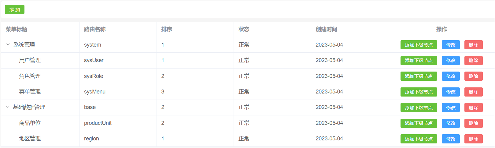
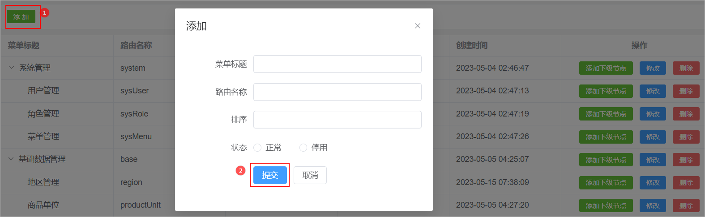
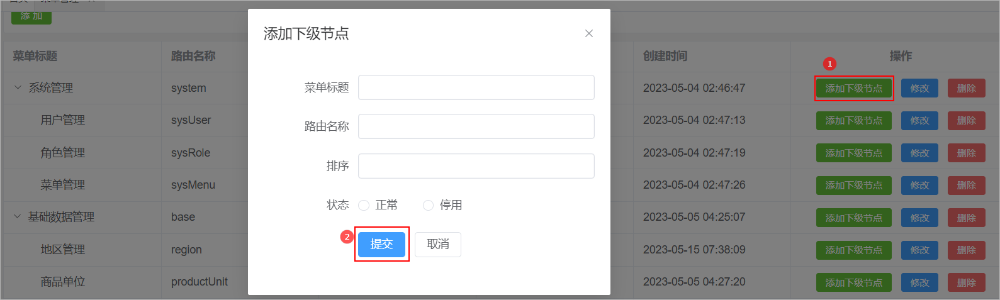
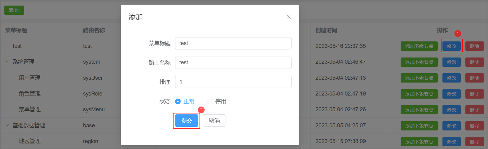
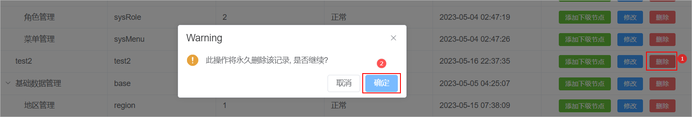
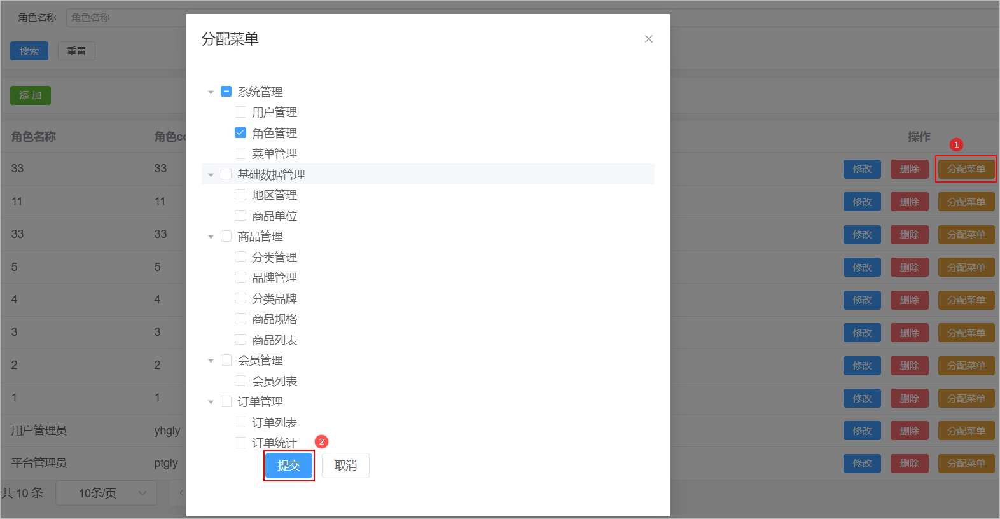
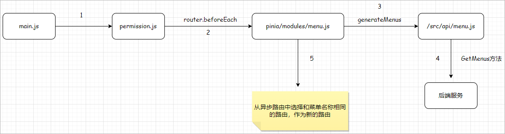

# 1 菜单管理

菜单管理就是对系统中首页中的左侧菜单进行维护。

## 1.1 表结构介绍

菜单表结果如下所示：

```java
CREATE TABLE `sys_menu` (
  `id` bigint NOT NULL AUTO_INCREMENT COMMENT '编号',
  `parent_id` bigint NOT NULL DEFAULT '0' COMMENT '所属上级',
  `title` varchar(20) NOT NULL DEFAULT '' COMMENT '菜单标题',
  `component` varchar(100) DEFAULT NULL COMMENT '组件名称',
  `sort_value` int NOT NULL DEFAULT '1' COMMENT '排序',
  `status` tinyint NOT NULL DEFAULT '1' COMMENT '状态(0:禁止,1:正常)',
  `has_children` tinyint NOT NULL COMMENT '是否存在在子节点',
  `create_time` timestamp NOT NULL DEFAULT CURRENT_TIMESTAMP COMMENT '创建时间',
  `update_time` timestamp NOT NULL DEFAULT CURRENT_TIMESTAMP ON UPDATE CURRENT_TIMESTAMP COMMENT '更新时间',
  `is_deleted` tinyint NOT NULL DEFAULT '0' COMMENT '删除标记（0:不可用 1:可用）',
  PRIMARY KEY (`id`),
  KEY `idx_parent_id` (`parent_id`)
) ENGINE=InnoDB AUTO_INCREMENT=19 DEFAULT CHARSET=utf8mb4 COLLATE=utf8mb4_0900_ai_ci COMMENT='菜单表';
```

## 1.2 查询菜单

### 1.2.1 需求说明

由于菜单表结构是一种树形结构，因此在进行数据展示的时候需要按照树形表格的方式进行数据展示。

效果图如下所示：

   

### 1.2.2 页面制作

具体代码如下所示：

```java
<template>
    <div class="tools-div">
        <el-button type="success" size="small">添 加</el-button>
    </div>

    <el-table
        :data="list"
        style="width: 100%; margin-bottom: 20px"
        row-key="id"
        border
        default-expand-all
    >
    <el-table-column prop="title" label="菜单标题" />
    <el-table-column prop="component" label="路由名称" />
    <el-table-column prop="sortValue" label="排序" />
    <el-table-column prop="status" label="状态" #default="scope">
      {{ scope.row.status == 1 ? '正常' : '停用' }}
    </el-table-column>
    <el-table-column prop="createTime" label="创建时间" />
    <el-table-column label="操作" align="center" width="280" >
      <el-button type="success" size="small" >
        添加下级节点
      </el-button>
      <el-button type="primary" size="small" >
        修改
      </el-button>
      <el-button type="danger" size="small">
        删除
      </el-button>
    </el-table-column>
  </el-table>

</template>

<script setup>
import { ref } from "vue"

// 定义表格数据模型
const list = ref([
    {
        "id": 1,
        "title": "系统管理",
        "component": "system",
        "sortValue": 1,
        "status": 1,
        "createTime": "2023-05-04",
        "children":[
            {"id":2, "title": "用户管理" , "component":"sysUser" , "sortValue":1 ,"status":1 , "createTime":"2023-05-04"},
            {"id":3, "title": "角色管理" , "component":"sysRole" , "sortValue":2 ,"status":1 , "createTime":"2023-05-04"},
            {"id":4, "title": "菜单管理" , "component":"sysMenu" , "sortValue":3 ,"status":1 , "createTime":"2023-05-04"}
        ]
        
    },
    {
        "id": 5,
        "title": "基础数据管理",
        "component": "base",
        "sortValue": 2,
        "status": 1,
        "createTime": "2023-05-04",
        "children":[
            {"id":6, "title": "商品单位" , "component":"productUnit" , "sortValue":2 ,"status":1 , "createTime":"2023-05-04"},
            {"id":7, "title": "地区管理" , "component":"region" , "sortValue":1 ,"status":1 , "createTime":"2023-05-04"}
        ]
    }
])


</script>

<style scoped>
.search-div {
  margin-bottom: 10px;
  padding: 10px;
  border: 1px solid #ebeef5;
  border-radius: 3px;
  background-color: #fff;
}
.tools-div {
  margin: 10px 0;
  padding: 10px;
  border: 1px solid #ebeef5;
  border-radius: 3px;
  background-color: #fff;
}
</style>
```

### 1.2.3 后端接口

#### SysMenu

创建与数据库表相对应的实体类：

```java
// com.atguigu.spzx.model.entity.system
@Data
public class SysMenu extends BaseEntity {

	private Long parentId;
	private String title;
	private String component;
	private Integer sortValue;
	private Integer status;

	// 下级列表
	private List<SysMenu> children;

}
```

#### SysMenuController

表现层代码实现

```java
// com.atguigu.spzx.manager.controller
@RestController
@RequestMapping(value="/admin/system/sysMenu")
public class SysMenuController {
   
   @Autowired
   private SysMenuService sysMenuService;

   @GetMapping("/findNodes")
   public Result<List<SysMenu>> findNodes() {
      List<SysMenu> list = sysMenuService.findNodes();
      return Result.build(list , ResultCodeEnum.SUCCESS) ;
   }

}
```

#### SysMenuService

业务层代码实现

```java
// com.atguigu.spzx.manager.service.impl
@Service
public class SysMenuServiceImpl implements SysMenuService {

    @Autowired
    private SysMenuMapper sysMenuMapper ;

    @Override
    public List<SysMenu> findNodes() {
        List<SysMenu> sysMenuList = sysMenuMapper.selectAll() ;
        if (CollectionUtils.isEmpty(sysMenuList)) return null;
        List<SysMenu> treeList = MenuHelper.buildTree(sysMenuList); //构建树形数据
        return treeList;
    }

}
```

#### MenuHelper

构建树形菜单的工具类：

```java
// com.atguigu.spzx.manager.helper
public class MenuHelper {

    /**
     * 使用递归方法建菜单
     * @param sysMenuList
     * @return
     */
    public static List<SysMenu> buildTree(List<SysMenu> sysMenuList) {
        List<SysMenu> trees = new ArrayList<>();
        for (SysMenu sysMenu : sysMenuList) {
            if (sysMenu.getParentId().longValue() == 0) {
                trees.add(findChildren(sysMenu,sysMenuList));
            }
        }
        return trees;
    }

    /**
     * 递归查找子节点
     * @param treeNodes
     * @return
     */
    public static SysMenu findChildren(SysMenu sysMenu, List<SysMenu> treeNodes) {
        sysMenu.setChildren(new ArrayList<SysMenu>());
        for (SysMenu it : treeNodes) {
            if(sysMenu.getId().longValue() == it.getParentId().longValue()) {
                if (sysMenu.getChildren() == null) {
                    sysMenu.setChildren(new ArrayList<>());
                }
                sysMenu.getChildren().add(findChildren(it,treeNodes));
            }
        }
        return sysMenu;
    }
}
```

#### SysMenuMapper

持久层代码实现：

```java
// com.atguigu.spzx.manager.mapper
@Mapper
public interface SysMenuMapper {
    public abstract List<SysMenu> selectAll();
}
```

#### SysMenuMapper.xml

在映射文件中添加如下sql语句

```xml
<?xml version="1.0" encoding="UTF-8" ?>
<!DOCTYPE mapper PUBLIC "-//mybatis.org//DTD Mapper 3.0//EN" "http://mybatis.org/dtd/mybatis-3-mapper.dtd">

<mapper namespace="com.atguigu.spzx.manager.mapper.SysMenuMapper">

	<resultMap id="sysMenuMap" type="com.atguigu.spzx.model.entity.system.SysMenu" autoMapping="true"></resultMap>
	
	<!-- 用于select查询公用抽取的列 -->
	<sql id="columns">
		id,parent_id,title,component,sort_value,status,create_time,update_time,is_deleted
	</sql>

	<select id="selectAll" resultMap="sysMenuMap">
		select <include refid="columns" />
		from sys_menu
		where
		is_deleted = 0
		order by sort_value
	</select>

</mapper>

```

### 1.2.4 前端对接

#### sysMenu.js

在api文件夹下创建一个sysMenu.js文件，在该文件中添加如下代码：

```java
import request from '@/utils/request'
const api_name = '/admin/system/sysMenu'

// 分页列表
export const FindNodes = () => {
    return request({
        url: `${api_name}/findNodes`,
        method: 'get',
    })
}
```

#### sysMenu.vue

更改sysMenu.vue的代码如下所示：

```java
<script setup>
import { ref , onMounted } from "vue"
import { FindNodes } from '@/api/sysMenu'

// 定义表格数据模型
const list = ref([])

// 加载数据
onMounted(() => {
    fetchData()
})

//分页列表
const fetchData = async () => {
  const { code, data, message } = await FindNodes()
  list.value = data
}


</script>
```

## 1.3 添加菜单

### 1.3.1 需求说明

当用户点击添加按钮的时候，那么此时就弹出对话框，在该对话框中需要展示添加菜单表单。当用户在该表单中点击提交按钮的时候那么此时就需要将

表单进行提交，在后端需要将提交过来的表单数据保存到数据库中即可。页面效果如下所示：

 

### 1.3.3 页面制作

具体代码如下所示：

```vue
<div class="tools-div">
    <el-button type="success" size="small" @click="addShow">添 加</el-button>
</div>

<el-dialog v-model="dialogVisible" :title="dialogTitle" width="30%">
    <el-form label-width="120px">
        <el-form-item label="菜单标题">
            <el-input />
        </el-form-item>
        <el-form-item label="路由名称">
            <el-input />
        </el-form-item>
        <el-form-item label="排序">
            <el-input />
        </el-form-item>
        <el-form-item label="状态">
            <el-radio-group>
                <el-radio :label="1">正常</el-radio>
                <el-radio :label="0">停用</el-radio>
            </el-radio-group>
        </el-form-item>
        <el-form-item>
            <el-button type="primary">提交</el-button>
            <el-button @click="dialogVisible = false">取消</el-button>
        </el-form-item>
    </el-form>
</el-dialog>

<script setup>
    
// 定义添加表单菜单表单相关数据模型
const dialogTitle = ref('添加')
const dialogVisible = ref(false)

//进入添加
const addShow = () => {
  dialogVisible.value = true
  dialogTitle.value = '添加'
}
</script>
```

### 1.3.3 后端接口

#### SysMenuController

表现层代码实现

```java
// com.atguigu.spzx.manager.controller.SysMenuController
@PostMapping("/save")
public Result save(@RequestBody SysMenu sysMenu) {
    sysMenuService.save(sysMenu);
    return Result.build(null , ResultCodeEnum.SUCCESS) ;
}
```

#### SysMenuService

业务层代码实现

```java
// com.atguigu.spzx.manager.service.impl#SysMenuServiceImpl
@Override
public void save(SysMenu sysMenu) {
    sysMenuMapper.insert(sysMenu) ;
}
```

#### SysMenuMapper

持久层代码实现：

```java
// com.atguigu.spzx.manager.mapper#SysMenuMapper
public abstract  void insert(SysMenu sysMenu);
```

#### SysMenuMapper.xml

在映射文件中添加如下sql语句

```xml
<insert id="insert" useGeneratedKeys="true" keyProperty="id">
    insert into sys_menu (
        id,
        parent_id,
        title,
        component,
        sort_value,
        status
    ) values (
        #{id},
        #{parentId},
        #{title},
        #{component},
        #{sortValue},
        #{status}
        )
</insert>
```

### 1.3.4 前端对接

#### 实现思路

1、给表单绑定数据模型

2、给提交按钮绑定点击事件

3、点击按钮请求后端地址

#### sysMenu.js

在api文件夹下创建一个sysMenu.js文件，在该文件中添加如下代码：

```java
// 保存信息
export const save = sysMenu => {
    return request({
        url: `${api_name}/save`,
        method: 'post',
        data: sysMenu,
    })
}
```

#### sysMenu.vue

更改sysMenu.vue的代码如下所示：

```vue
<el-dialog v-model="dialogVisible" :title="dialogTitle" width="30%">
    <el-form label-width="120px">
        <el-form-item label="菜单标题">
            <el-input v-model="sysMenu.title"/>
        </el-form-item>
        <el-form-item label="路由名称">
            <el-input v-model="sysMenu.component"/>
        </el-form-item>
        <el-form-item label="排序" >
            <el-input v-model="sysMenu.sortValue"/>
        </el-form-item>
        <el-form-item label="状态">
            <el-radio-group v-model="sysMenu.status">
                <el-radio :label="1">正常</el-radio>
                <el-radio :label="0">停用</el-radio>
            </el-radio-group>
        </el-form-item>
        <el-form-item>
            <el-button type="primary" @click="saveOrUpdate">提交</el-button>
            <el-button @click="dialogVisible = false">取消</el-button>
        </el-form-item>
    </el-form>
</el-dialog>

<script setup>
import { FindNodes , SaveMenu} from '@/api/sysMenu'
import { ElMessage, ElMessageBox } from 'element-plus'
    
//页面表单数据
const defaultForm = {
    id: '',
    parentId: 0,
    title: '',
    url: '',
    component: '',
    icon: '',
    sortValue: 1,
    status: 1,
}

// 表单响应式数据模型对象
const sysMenu = ref(defaultForm)

//提交保存与修改
const saveOrUpdate = () => {
  if (!sysMenu.value.id) {
    sysMenu.value.parentId = 0
    saveData()
  } 
}

// 新增
const saveData = async () => {
  await SaveMenu(sysMenu.value)
  dialogVisible.value = false
  ElMessage.success('操作成功')
  fetchData()
}
</script>
```

## 1.4 添加子菜单

### 1.4.1 需求说明

当用户点击添加按钮的时候，那么此时就弹出对话框，在该对话框中需要展示添加子菜单表单。当用户在该表单中点击提交按钮的时候那么此时就需要

将表单进行提交，在后端需要将提交过来的表单数据保存到数据库中即可。页面效果如下所示：

  

可以使用添加菜单的表单。

### 1.4.2 代码实现

只需要更改前端代码即可，如下所示：

```vue
<el-table-column label="操作" align="center" width="280" #default="scope" >
    <el-button type="success" size="small" @click="addShow(scope.row)">
        添加下级节点
    </el-button>
</el-table-column>

<script setup>
    
//进入添加
const addShow = (row) => {
  sysMenu.value = {}
  dialogVisible.value = true
  if(!row.id) {
    dialogTitle.value = '添加'
  }else {
    dialogTitle.value = '添加下级节点'
    sysMenu.value.parentId = row.id
  }
}

</script>
```

## 1.5 修改菜单

### 1.5.1 需求说明

当用户点击修改按钮的时候，那么此时就弹出对话框，在该对话框中需要将当前行所对应的菜单数据在该表单页面进行展示。当用户在该表单中点击提

交按钮的时候那么此时就需要将表单进行提交，在后端需要提交过来的表单数据修改数据库中的即可。页面效果如下所示：

 

### 1.5.2 数据回显

分析：

1、使用添加数据的表单即可

2、要将当前操作行的数据展示在表单中，那么此时需要用到插槽

代码如下所示：

```vue
<el-table-column label="操作" align="center" width="280" #default="scope" >
    <el-button type="primary" size="small" @click="editShow(scope.row)">
        修改
    </el-button>
</el-table-column>

<script setup>
    
//进入修改
const editShow = row => {
  sysMenu.value = row
  dialogVisible.value = true
}

</script>
```

### 1.5.3 提交修改

#### 后端接口

##### SysMenuController

表现层代码实现

```java
// com.atguigu.spzx.manager.controller#SysMenuController
@PutMapping("/updateById")
public Result updateById(@RequestBody SysMenu sysMenu) {
    sysMenuService.updateById(sysMenu);
    return Result.build(null , ResultCodeEnum.SUCCESS) ;
}
```

##### SysMenuService

业务层代码实现

```java
// com.atguigu.spzx.manager.service.impl#SysMenuServiceImpl
@Override
public void updateById(SysMenu sysMenu) {
    sysMenuMapper.updateById(sysMenu) ;
}
```

##### SysMenuMapper

持久层代码实现

```java
// com.atguigu.spzx.manager.mapper.SysMenuMapper
public abstract void updateById(SysMenu sysMenu);
```

##### SysMenuMapper.xml

映射文件中添加如下sql语句

```xml
<update id="updateById" >
    update sys_menu set
    <if test="parentId != null and parentId != ''">
        parent_id = #{parentId},
    </if>
    <if test="title != null and title != ''">
        title = #{title},
    </if>
    <if test="component != null and component != ''">
        component = #{component},
    </if>
    <if test="sortValue != null">
        sort_value = #{sortValue},
    </if>
    <if test="status != null">
        status = #{status},
    </if>
    update_time =  now()
    where
    id = #{id}
</update>
```

#### 前端对接

##### sysMenu.js

在api目录下创建一个sysMenu.js文件，文件的内容如下所示：

```javascript
// 修改信息
export const UpdateSysMenuById = sysMenu => {
    return request({
        url: `${api_name}/updateById`,
        method: 'put',
        data: sysMenu,
    })
}
```

##### sysMenu.vue

更改sysMenu.vue的代码如下所示：

```vue
<script setup>
import { FindNodes , SaveMenu , UpdateSysMenuById } from '@/api/sysMenu'
    
//提交保存与修改
const saveOrUpdate = () => {
  if (!sysMenu.value.id) {
    saveData()
  } else {
    updateData()
  }
}

// 修改
const updateData = async () => {
  await UpdateSysMenuById(sysMenu.value)
  dialogVisible.value = false
  ElMessage.success('操作成功')
  fetchData()
}
</script>>
```

## 1.6 删除菜单

### 1.6.1 需求说明

当点击删除按钮的时候此时需要弹出一个提示框，询问是否需要删除数据？如果用户点击是，那么此时向后端发送请求传递id参数，后端接收id参数进

行逻辑删除。页面效果如下所示：

 

### 1.6.2 后端接口

#### SysMenuController

表现层代码实现

```java
// com.atguigu.spzx.manager.controller#SysMenuController
@DeleteMapping("/removeById/{id}")
public Result removeById(@PathVariable Long id) {
    sysMenuService.removeById(id);
    return Result.build(null , ResultCodeEnum.SUCCESS) ;
}
```

#### SysMenuService

业务层代码实现

```java
// com.atguigu.spzx.manager.service.impl#SysMenuServiceImpl
@Override
public void removeById(Long id) {
    int count = sysMenuMapper.countByParentId(id);  // 先查询是否存在子菜单，如果存在不允许进行删除
    if (count > 0) {
        throw new GuiguException(ResultCodeEnum.NODE_ERROR);
    }
    sysMenuMapper.deleteById(id);		// 不存在子菜单直接删除
}
```

#### SysMenuMapper

持久层代码实现

```java
// com.atguigu.spzx.manager.mapper#SysMenuMapper
@Mapper
public interface SysMenuMapper {
    public abstract int countByParentId(Long id);
    public abstract void deleteById(Long id);
}
```

#### SysMenuMapper.xml

映射文件中添加如下sql语句

```xml
<select id="countByParentId" resultType="Integer">
    select count(id)
    from sys_menu
    where
    parent_id = #{parentId}
    and is_deleted = 0
</select>

<update id="deleteById">
    update sys_menu set
    update_time = now() ,
    is_deleted = 1
    where
    id = #{id}
</update>
```

### 1.6.3 前端对接

#### sysMenu.js

在api目录下创建一个sysMenu.js文件，文件的内容如下所示：

```java
// 根据id删除数据
export const RemoveSysMenuById = id => {
    return request({
        url: `${api_name}/removeById/${id}`,
        method: 'delete',
    })
}
```

#### sysMenu.vue

更改sysMenu.vue的代码如下所示：

```vue
 <el-table-column label="操作" align="center" width="280" #default="scope" >
     <el-button type="danger" size="small" @click="remove(scope.row.id)">
         删除
     </el-button>
</el-table-column>

<script setup>
import { RemoveSysMenuById } from '@/api/sysMenu'
    
//删除
const remove = async id => {
  console.log('removeDataById:' + id)
  ElMessageBox.confirm('此操作将永久删除该记录, 是否继续?', 'Warning', {
    confirmButtonText: '确定',
    cancelButtonText: '取消',
    type: 'warning',
  })
    .then(async () => {
      const { code , message } = await RemoveSysMenuById(id)
      if(code === 200) {
        ElMessage.success('删除成功')
        fetchData()
      }else {
        ElMessage.error(message)
      }
      
    })
    .catch(() => {
      ElMessage.info('取消删除')
    })
}
</script>
```

# 2 分配菜单

## 2.1 需求说明

在角色列表页面，当用户点击分配菜单按钮的时候，此时就会弹出一个对话框。在该对话框中会将系统中所涉及到的所有的菜单都展示出来。并且将当

前角色所对应的菜单进行选中。效果如下图所示：

 

用户选择对应的菜单以后，点击提交按钮，此时请求后端接口，后端将选中的菜单数据保存到sys_role_menu表中。

## 2.2 页面制作

页面代码如下所示：

```vue
<el-button type="warning" size="small" @click="showAssignMenu(scope.row)">
    分配菜单
</el-button>

<!-- 分配菜单的对话框  -->
<el-dialog v-model="dialogMenuVisible" title="分配菜单" width="40%">
    <el-form label-width="80px">
        <el-tree
                 :data="sysMenuTreeList"
                 show-checkbox
                 default-expand-all
                 node-key="id"
                 :props="defaultProps" 
                 :check-on-click-node="true"
                 />
        <el-form-item>
            <el-button type="primary">提交</el-button>
            <el-button @click="dialogMenuVisible = false">取消</el-button>
        </el-form-item>
    </el-form>
</el-dialog>

<script setup>
    
//分配菜单
const defaultProps = {
  children: 'children',
  label: 'title',
}
const dialogMenuVisible = ref(false)
const sysMenuTreeList = ref([
    {
        "id": 1,
        "title": "系统管理",
        "children":[
            {"id":2, "title": "用户管理" },
            {"id":3, "title": "角色管理" },
            {"id":4, "title": "菜单管理" }
        ]
        
    },
    {
        "id": 5,
        "title": "数据管理",
        "component": "base",
        "sortValue": 2,
        "status": 1,
        "createTime": "2023-05-04",
        "children":[
            {"id":6, "title": "商品单位" },
            {"id":7, "title": "地区管理" }
        ]
    }
])
const showAssignMenu = async row => { 
  dialogMenuVisible.value = true
}

</script>
```

## 2.3 查询菜单

### 2.3.1 后端接口

需要：根据角色的id查询出其对应的菜单id，并且需要将系统中所有的菜单数据查询出来。

#### SysRoleMenuController

表现层代码实现

```java 
// com.atguigu.spzx.manager.controller
@RestController
@RequestMapping(value = "/admin/system/sysRoleMenu")
public class SysRoleMenuController {

    @Autowired
    private SysRoleMenuService sysRoleMenuService ;

    @GetMapping(value = "/findSysRoleMenuByRoleId/{roleId}")
    public Result<Map<String , Object>> findSysRoleMenuByRoleId(@PathVariable(value = "roleId") Long roleId) {
        Map<String , Object> sysRoleMenuList = sysRoleMenuService.findSysRoleMenuByRoleId(roleId) ;
        return Result.build(sysRoleMenuList , ResultCodeEnum.SUCCESS) ;
    }

}
```

#### SysRoleMenuService

业务层代码实现

```java
// com.atguigu.spzx.manager.service.impl#SysRoleMenuServiceImpl
@Override
public Map<String, Object> findSysRoleMenuByRoleId(Long roleId) {

    // 查询所有的菜单数据
    List<SysMenu> sysMenuList = sysMenuService.findNodes() ;

    // 查询当前角色的菜单数据
    List<Long> roleMenuIds = sysRoleMenuMapper.findSysRoleMenuByRoleId(roleId) ;

    // 将数据存储到Map中进行返回
    Map<String , Object> result = new HashMap<>() ;
    result.put("sysMenuList" , sysMenuList) ;
    result.put("roleMenuIds" , roleMenuIds) ;

    // 返回
    return result;
}
```

#### SysRoleMenuMapper

持久层代码实现

```java
@Mapper
public interface SysRoleMenuMapper {
    public abstract List<Long> findSysRoleMenuByRoleId(Long roleId);
}
```

#### SysRoleMenuMapper.xml

映射文件添加如下sql语句

```xml
<?xml version="1.0" encoding="UTF-8" ?>
<!DOCTYPE mapper PUBLIC "-//mybatis.org//DTD Mapper 3.0//EN" "http://mybatis.org/dtd/mybatis-3-mapper.dtd">
<mapper namespace="com.atguigu.spzx.manager.mapper.SysRoleMenuMapper">

	<select id="findSysRoleMenuByRoleId" resultType="long">
		select menu_id from sys_role_menu where role_id = #{roleId} and is_deleted = 0 and is_half = 0
	</select>

</mapper>
```

### 2.3.2 前端对接

#### sysRole.js

在src/api/sysRole.js文件中添加如下方法：

```java
// 查询指定角色所对应的菜单id
export const GetSysRoleMenuIds = (roleId) => {
    return request({
        url: "/admin/system/sysRoleMenu/findSysRoleMenuByRoleId/"+ roleId,
        method: 'get'
    })
}
```

#### sysRole.vue

修改sysRole.vue文件中的代码，如下所示：

```vue
<el-tree
         :data="sysMenuTreeList"
         ref="tree"   // tree组件添加ref属性，后期方便进行tree组件对象的获取
         show-checkbox
         default-expand-all
         :check-on-click-node="true"
         node-key="id"
         :props="defaultProps"
/>

<script setup>
import { GetSysRoleMenuIds } from '@/api/sysRole';
    
// 树对象变量
const tree = ref() 

// 默认选中的菜单数据集合
const showAssignMenu = async row => { 
  dialogMenuVisible.value = true
  const { data } = await GetSysRoleMenuIds(row.id)   // 请求后端地址获取所有的菜单数据，以及当前角色所对应的菜单数据
  sysMenuTreeList.value = data.sysMenuList
  tree.value.setCheckedKeys(data.roleMenuIds)   // 进行数据回显
}
</script>
```

## 2.4 保存菜单

### 2.4.1 后端接口

思路分析：前端请求后端接口的时候需要将角色的id和用户所选中的菜单id传递到后端。后端需要先根据角色的id从sys_role_menu表中删除其所对应

的菜单数据，然后添加新的菜单数据到sys_role_menu表中。

#### AssginMenuDto

定义一个实体类封装前端所传递过来的两部分数据：

```java
// com.atguigu.spzx.model.dto.system
@Data
public class AssginMenuDto {
    private Long roleId;							// 角色id
    private List<Map<String , Number>> menuIdList;	// 选中的菜单id的集合 , Map中包含了2部分的数据：菜单id，isHalf
}
```

#### SysRoleMenuController

表现层代码实现：

```java
// com.atguigu.spzx.manager.controller
@PostMapping("/doAssign")
public Result doAssign(@RequestBody AssginMenuDto assginMenuDto) {
    sysRoleMenuService.doAssign(assginMenuDto);
    return Result.build(null , ResultCodeEnum.SUCCESS) ;
}
```

#### SysRoleMenuService

业务层代码实现：

```java
// com.atguigu.spzx.manager.service.impl#SysRoleMenuServiceImpl
@Transactional
@Override
public void doAssign(AssginMenuDto assginMenuDto) {

    // 根据角色的id删除其所对应的菜单数据
    sysRoleMenuMapper.deleteByRoleId(assginMenuDto.getRoleId());

    // 获取菜单的id
    List<Map<String, Number>> menuInfo = assginMenuDto.getMenuIdList();
    if(menuInfo != null && menuInfo.size() > 0) {
        sysRoleMenuMapper.doAssign(assginMenuDto) ;
    }

}
```

#### SysRoleMenuMapper

持久层代码实现：

```java
// com.atguigu.spzx.manager.mapper
@Mapper
public interface SysRoleMenuMapper {
    public abstract void deleteByRoleId(Long roleId);
    public abstract void doAssign(AssginMenuDto assginMenuDto);
}
```

#### SysRoleMenuMapper.xml

映射文件中添加如下sql语句：

```xml
<delete id="deleteByRoleId">
    delete from sys_role_menu where role_id = #{roleId}
</delete>

<insert id="doAssign">
    insert into sys_role_menu (
    role_id,
    menu_id,
    create_time , update_time , is_deleted , is_half
    ) values
    <foreach collection="menuIdList" item="menuInfo" separator=",">
        (#{roleId} , #{menuInfo.id} , now() , now() , 0 , #{menuInfo.isHalf})
    </foreach>
</insert>
```

### 2.4.2 前端对接

#### sysRole.js

在src/api/sysRole.js文件中添加如下方法：

```java
// 根据角色分配菜单请求方法
export const DoAssignMenuIdToSysRole = (assignMenuDto) => {
    return request({
        url: "/admin/system/sysRoleMenu/doAssign",
        method: 'post',
        data: assignMenuDto
    })
}
```

#### sysRole.vue

修改sysRole.vue文件中的代码，思路如下：

1、给提交按钮绑定点击事件，并提供对应的事件处理函数

2、在单机事件处理函数中执行的代码逻辑如下所示：

* 获取tree组件对象中选中的节点
* 获取tree组件对象中半选中的节点
* 将两组节点数据进行组合
* 构建请求参数
* 发送请求

具体代码如下所示：

```java
const doAssign = async () => {
    const checkedNodes = tree.value.getCheckedNodes() ; // 获取选中的节点
    const checkedNodesIds = checkedNodes.map(node => {  // 获取选中的节点的id
        return {
            id: node.id,
            isHalf: 0
        }
    })
        
    // 获取半选中的节点数据，当一个节点的子节点被部分选中时，该节点会呈现出半选中的状态
    const halfCheckedNodes = tree.value.getHalfCheckedNodes() ; 
    const halfCheckedNodesIds = halfCheckedNodes.map(node => {   // 获取半选中节点的id
        return {
            id: node.id,
            isHalf: 1
        }
    })
        
    // 将选中的节点id和半选中的节点的id进行合并
    const menuIds = [...checkedNodesIds , ...halfCheckedNodesIds]  
    console.log(menuIds);

    // 构建请求数据
    const assignMenuDto = {
        roleId: roleId,
        menuIdList: menuIds
    }
 
    // 发送请求
    await DoAssignMenuIdToSysRole(assignMenuDto) ;
    ElMessage.success('操作成功')
    dialogMenuVisible.value = false

}   
```

# 3 动态菜单

## 3.1 需求说明

现在首页的左侧菜单是直接写死在前端系统中的，这里很显然是不合适的。不同用户其所对应的权限是不同的，因此关于左侧菜单需要根据当前登录的

用户所对应的角色动态进行获取。

前端所需要的菜单数据结构如下所示：

```json
[
	{
		"title": "系统管理",
		"name": "system",
		"children": [
			{
				"title": "用户管理",
				"name": "sysUser",
				"children": null
			},
			{
				"title": "角色管理",
				"name": "sysRole",
				"children": null
			},
			{
				"title": "菜单管理",
				"name": "sysMenu",
				"children": null
			}
		]
	},
	{
		"title": "数据管理",
		"name": "base",
		"children": [
			{
				"title": "地区管理",
				"name": "region",
				"children": null
			},
			{
				"title": "商品单位",
				"name": "productUnit",
				"children": null
			}
		]
	}
]
```

## 3.2 后端接口

### 3.2.1 SysMenuVo

定义一个实体类，来封装前端所需要的菜单数据。如下所示：

```java
// com.atguigu.spzx.model.vo.system
@Data
public class SysMenuVo {
    
    private String title;
    private String name;
    private List<SysMenuVo> children;

}
```

### 3.2.1 IndexController

表现层代码实现：

```java
// com.atguigu.spzx.system.controller#IndexController
@GetMapping("/menus")
public Result menus() {
    List<SysMenuVo> sysMenuVoList =  sysMenuService.findUserMenuList() ;
    return Result.build(sysMenuVoList , ResultCodeEnum.SUCCESS) ;
}
```

### 3.2.2 SysMenuService

业务层代码实现：

```java
@Override
public List<SysMenuVo> findUserMenuList() {

    SysUser sysUser = AuthContextUtil.get();
    Long userId = sysUser.getId();          // 获取当前登录用户的id

    List<SysMenu> sysMenuList = sysMenuMapper.selectListByUserId(userId) ;

    //构建树形数据
    List<SysMenu> sysMenuTreeList = MenuHelper.buildTree(sysMenuList);
    return this.buildMenus(sysMenuTreeList);
}

// 将List<SysMenu>对象转换成List<SysMenuVo>对象
private List<SysMenuVo> buildMenus(List<SysMenu> menus) {

    List<SysMenuVo> sysMenuVoList = new LinkedList<SysMenuVo>();
    for (SysMenu sysMenu : menus) {
        SysMenuVo sysMenuVo = new SysMenuVo();
        sysMenuVo.setTitle(sysMenu.getTitle());
        sysMenuVo.setName(sysMenu.getComponent());
        List<SysMenu> children = sysMenu.getChildren();
        if (!CollectionUtils.isEmpty(children)) {
            sysMenuVo.setChildren(buildMenus(children));
        }
        sysMenuVoList.add(sysMenuVo);
    }
    return sysMenuVoList;
}
```

### 3.2.3 SysMenuMapper

持久层代码实现：

```java
@Mapper
public interface SysMenuMapper {
    public abstract List<SysMenu> selectListByUserId(Long userId);
}
```

### 3.2.4 SysMenuMapper.xml

在SysMenuMapper.xml文件中添加如下的sql语句

```sql
<select id="selectListByUserId" resultMap="sysMenuMap">
    select * from sys_menu sm where sm.id in (
    select DISTINCT srm.menu_id from sys_role_menu srm where srm.role_id in
    (
    	select sr.id from sys_role sr where sr.id in
    		(select sur.role_id from sys_user_role sur where sur.user_id = #{userId} and is_deleted = 0)
    	and sr.is_deleted = 0
    )
    	and srm.is_deleted = 0
    ) and sm.is_deleted = 0
</select>
```

## 3.3 前端对接

### 3.3.1 前端加载流程

前端加载动态菜单的流程如下图所示：

 

通过源码的查看得出结论：要求在添加菜单的时候，菜单的名称和前端路由的名称保存一致。

### 3.3.2 menu.js

修改/src/api/menu.js中的请求地址，如下所示：

```java
// 获取菜单
export const GetMenus = params => {
  return request({
    url: '/admin/system/index/menus',
    method: 'get',
    params,
  })
}
```

### 3.3.3 index.js

更改src/router/index.js固定参数和异步菜单的路由加载：

```java
// 固定菜单
export const fixedRoutes = [...home]

// 动态菜单
export const asyncRoutes = [...system]
```

### 3.3.4 menu.js

修改pinia/modules/menu.js中的generateMenus方法，注释掉方式一菜单加载，打开方式二菜单加载。

```javascript
const generateMenus = async () => {
    // // 方式一：只有固定菜单
    // const menus = getFilterMenus(fixedRoutes)
    // setMenus(menus)

    // 方式二：有动态菜单
    // 从后台获取菜单
    const { code, data } = await GetMenus()

    if (+code === 200) {
        // 添加路由之前先删除所有动态路由
        asyncRoutes.forEach(item => {
            router.removeRoute(item.name)
        })
        // 过滤出需要添加的动态路由
        const filterRoutes = getFilterRoutes(asyncRoutes, data)
        filterRoutes.forEach(route => router.addRoute(route))

        // 生成菜单
        const menus = getFilterMenus([...fixedRoutes, ...filterRoutes])
        setMenus(menus)
    }
}
```

## 3.4 代码测试

### 3.4.1 测试内容说明

1、给管理员角色分配访问所有的菜单权限，创建新的测试角色进行测试。

2、添加新的菜单测试角色分配菜单数据回显


### 3.4.2 bug解决

测试内容二的时候会存在bug【新添加的子菜单也会被选中】，解决bug。代码如下所示：

#### SysMenuServiceImpl

更改添加菜单方法

```java
// com.atguigu.spzx.manager.service.impl.SysMenuServiceImpl
@Transactional
@Override
public void save(SysMenu sysMenu) {

    // 添加新的节点
    sysMenuMapper.insert(sysMenu) ;

    // 新添加一个菜单，那么此时就需要将该菜单所对应的父级菜单设置为半开
    updateSysRoleMenuIsHalf(sysMenu) ;
}

private void updateSysRoleMenuIsHalf(SysMenu sysMenu) {

    // 查询是否存在父节点
    SysMenu parentMenu = sysMenuMapper.selectById(sysMenu.getParentId());

    if(parentMenu != null) {

        // 将该id的菜单设置为半开
        sysRoleMenuMapper.updateSysRoleMenuIsHalf(parentMenu.getId()) ;

        // 递归调用
        updateSysRoleMenuIsHalf(parentMenu) ;

    }

}
```

#### SysMenuMapper

持久层代码

```java
// com.atguigu.spzx.manager.mapper
@Mapper
public interface SysMenuMapper {
    public abstract SysMenu selectById(Long id) ;
}
```

#### SysMenuMapper.xml

在SysMenuMapper.xml映射文件中添加如下的sql语句

```xml
<select id="selectById" resultMap="sysMenuMap">
    select <include refid="columns" /> from sys_menu where id = #{id}
</select>
```

#### SysRoleMenuMapper

角色菜单持久层代码：

```java
// com.atguigu.spzx.manager.mapper
@Mapper
public interface SysRoleMenuMapper {
    public abstract  void updateSysRoleMenuIsHalf(Long menuId);
}
```

#### SysRoleMenuMapper.xml

在SysRoleMenuMapper.xml映射文件中添加如下的sql语句

```xml
<select id="updateSysRoleMenuIsHalf">
    update sys_role_menu srm set srm.is_half = 1 where menu_id = #{menuId}
</select>
```


