# 1 分类品牌管理

分类品牌管理就是将分类的数据和品牌的数据进行关联，分类数据和品牌数据之间的关系是多对多的关系，因此需要单独使用一张数据表来存储该数

据。

## 1.1 菜单添加

首先在系统中分类品牌管理的菜单，具体步骤如下所示：

1、在后台管理系统中通过系统管理的菜单管理添加分类品牌管理的相关菜单，如下所示：

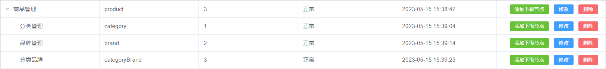  

2、给系统管理员角色分配分类品牌管理菜单访问权限：

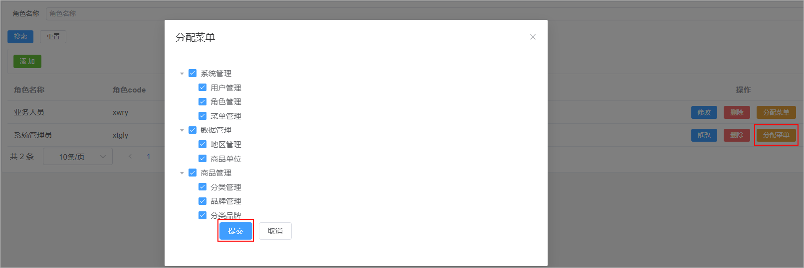  

3、在前端项目中创建对应的页面，以及配置对应的异步路由

在src/views/product的文件夹，在该文件夹中加入分类管理页面文件，如下所示

  

在src/router/modules文件夹下创建product.js路由文件，文件内容如下所示：

```java
const Layout = () => import('@/layout/index.vue')
const category = () => import('@/views/product/category.vue')
const brand = () => import('@/views/product/brand.vue')
const categoryBrand = () => import('@/views/product/categoryBrand.vue')

export default [
  {
    path: '/product',
    component: Layout,
    name: 'product',
    meta: {
      title: '商品管理',
    },
    icon: 'Histogram',
    children: [
      {
        path: '/category',
        name: 'category',
        component: category,
        meta: {
          title: '分类管理',
        },
      },
      {
        path: '/brand',
        name: 'brand',
        component: brand,
        meta: {
          title: '品牌管理',
        },
      },
      {
        path: '/categoryBrand',
        name: 'categoryBrand',
        component: categoryBrand,
        meta: {
          title: '分类品牌',
        },
      },
    ],
  },
]
```

## 1.2 表结构介绍

分类品牌数据所对应的表结构如下所示：

```sql
CREATE TABLE `category_brand` (
  `id` bigint NOT NULL AUTO_INCREMENT COMMENT 'ID',
  `brand_id` bigint DEFAULT NULL COMMENT '品牌ID',
  `category_id` bigint DEFAULT NULL COMMENT '分类ID',
  `create_time` timestamp NOT NULL DEFAULT CURRENT_TIMESTAMP COMMENT '创建时间',
  `update_time` timestamp NOT NULL DEFAULT CURRENT_TIMESTAMP ON UPDATE CURRENT_TIMESTAMP COMMENT '更新时间',
  `is_deleted` tinyint NOT NULL DEFAULT '0' COMMENT '删除标记（0:不可用 1:可用）',
  PRIMARY KEY (`id`)
) ENGINE=InnoDB AUTO_INCREMENT=3 DEFAULT CHARSET=utf8mb4 COLLATE=utf8mb4_0900_ai_ci COMMENT='分类品牌';
```

## 1.3 页面制作

对比如下页面结构，使用Element Plus制作出对应的页面，数据可以暂时使用假数据。

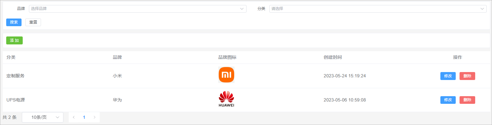 


该页面可以将其分为4部分：

1、搜索表单

2、添加按钮

2、数据表格

3、分页组件


代码实现如下所示：

```vue
<template>
    <div class="search-div">
        <el-form label-width="70px" size="small">
        <el-row>
            <el-col :span="12">
            <el-form-item label="品牌">
                <el-select
                class="m-2"
                placeholder="选择品牌"
                size="small"
                style="width: 100%"
                >
                <el-option
                    v-for="item in brandList"
                    :key="item.id"
                    :label="item.name"
                    :value="item.id"
                />
                </el-select>
            </el-form-item>
            </el-col>
            <el-col :span="12">
            <el-form-item label="分类">
                <el-cascader
                :props="categoryProps"
                style="width: 100%"
                />
            </el-form-item>
            </el-col>
        </el-row>
        <el-row style="display:flex">
            <el-button type="primary" size="small">
            搜索
            </el-button>
            <el-button size="small">重置</el-button>
        </el-row>
        </el-form>
    </div>

    <div class="tools-div">
        <el-button type="success" size="small">添 加</el-button>
    </div>

    <el-table :data="list" style="width: 100%">
        <el-table-column prop="categoryName" label="分类" />
        <el-table-column prop="brandName" label="品牌" />
        <el-table-column prop="logo" label="品牌图标" #default="scope">
            
        </el-table-column>
        <el-table-column prop="createTime" label="创建时间" />
        <el-table-column label="操作" align="center" width="200" >
            <el-button type="primary" size="small" >
                修改
            </el-button>
            <el-button type="danger" size="small">
                删除
            </el-button>
        </el-table-column>
    </el-table>

    <el-pagination
        :page-sizes="[10, 20, 50, 100]"
        layout="total, sizes, prev, pager, next"
        :total="total"
    />

</template>

<script setup>
import { ref } from 'vue'

// ================数据模型定义  start ===============================================


// 定义搜索表单数据模型
const brandList = ref([
    {
        "id": 2,
        "createTime": "2023-05-06 09:31:19",
        "name": "华为",
        "logo": "http://139.198.127.41:9000/sph/20230506/华为.png"
    },
    {
        "id": 1,
        "createTime": "2023-05-06 09:30:27",
        "name": "小米",
        "logo": "http://139.198.127.41:9000/sph/20230506/小米.png"
    }
])

const props = {
  lazy: true,
  value: 'id',
  label: 'name',
  leaf: 'leaf',
  lazyLoad(node, resolve) {   // 加载数据的方法
    const data = [
        {
            "id": 643,
            "createTime": "2023-05-22 15:31:18",
            "name": "玩具乐器",
            "imageUrl": "https://lilishop-oss.oss-cn-beijing.aliyuncs.com/0f423fb60f084b2caade164fae25a9a0.png",
            "parentId": 0,
            "status": 1,
            "orderNum": 10,
            "hasChildren": true,
            "children": null
        },
        {
            "id": 576,
            "createTime": "2023-05-22 15:31:13",
            "name": "汽车用品",
            "imageUrl": "https://lilishop-oss.oss-cn-beijing.aliyuncs.com/665dd952b54e4911b99b5e1eba4b164f.png",
            "parentId": 0,
            "status": 1,
            "orderNum": 10,
            "hasChildren": true,
            "children": null
        },
    ]
    resolve(data)  // 返回数据
  }
};
const categoryProps = ref(props)

// 定义表格数据模型
const list = ref([
  {
    "id": 2,
    "createTime": "2023-05-24 15:19:24",
    "brandId": 1,
    "categoryId": 99,
    "categoryName": "定制服务",
    "brandName": "小米",
    "logo": "http://139.198.127.41:9000/sph/20230506/小米.png"
  },
  {
    "id": 1,
    "createTime": "2023-05-06 10:59:08",
    "brandId": 2,
    "categoryId": 76,
    "categoryName": "UPS电源\t",
    "brandName": "华为",
    "logo": "http://139.198.127.41:9000/sph/20230506/华为.png"
  }
])

// 分页条数据模型
const total = ref(0)

// =========   数据模型定义 end======================================================================


</script>

<style scoped>
.search-div {
  margin-bottom: 10px;
  padding: 10px;
  border: 1px solid #ebeef5;
  border-radius: 3px;
  background-color: #fff;
}
.tools-div {
  margin: 10px 0;
  padding: 10px;
  border: 1px solid #ebeef5;
  border-radius: 3px;
  background-color: #fff;
}
</style>
```

## 1.4 品牌列表加载

需求：当页面加载完毕以后需要请求后端接口查询出系统中所有的品牌数据，将品牌数据在搜索表单的品牌下拉框中进行展示

### 1.4.1 后端接口

#### BrandController

表现层代码实现：

```java
// com.atguigu.spzx.manager.controller
@GetMapping("/findAll")
public Result findAll() {
    List<Brand> list = brandService.findAll();
    return Result.build(list , ResultCodeEnum.SUCCESS) ;
}
```

#### BrandService

业务层代码实现：

```java
// com.atguigu.spzx.manager.service.impl;
@Override
public List<Brand> findAll() {
    return brandMapper.findAll();
}
```

#### BrandMapper

持久层代码实现：

```java
// com.atguigu.spzx.manager.mapper
@Mapper
public interface BrandMapper {
	public abstract List<Brand> findAll();
}
```

#### BrandMapper.xml

在BrandMapper.xml映射文件中添加如下的sql语句：

```xml
<select id="findAll" resultMap="brandMap">
    select <include refid="columns" />
    from brand
    where is_deleted = 0
    order by id desc
</select>
```

### 1.4.2 前端对接

#### brand.js

在src/api目录下添加brand.js文件，内容如下所示：

```javascript
// 查询所有的品牌数据
export const FindAllBrand = () => {
    return request({
      url: `${api_name}/findAll`,
      method: 'get',
    })
}
```

#### categoryBrand.vue

修改categoryBrand.vue文件内容，如下所示：

```vue
<script setup>
import { ref , onMounted } from 'vue'
import { FindAllBrand } from '@/api/brand.js'
    
// onMounted钩子函数
onMounted(() => {
    selectAllBrandList() // 查询所有的品牌数据
})

const selectAllBrandList = async () => {
    const { data } = await FindAllBrand()
    brandList.value = data
}

</script>
```

## 1.5 分类数据加载

需求：当页面加载完毕以后需要查询出系统中所对应的所有的一级分类数据，将一级分类数据在搜索表单的分类下拉框中进行展示，当用户选择某一个

一级分类的时候，需要将该一级分类下所对应的二级分类查询出来...

分析：根据一个分类的id查询该分类下所对应的子分类数据该接口已经编写过了，因此只需要针对前端页面进行修改接口

代码实现：

```vue
<script setup>
import { FindCategoryByParentId } from '@/api/category.js'
    
const props = {
  lazy: true,
  value: 'id',
  label: 'name',
  leaf: 'leaf',
  async lazyLoad(node, resolve) {   // 加载数据的方法
    if (typeof node.value == 'undefined') node.value = 0
    const { data } = await FindCategoryByParentId(node.value)
    data.forEach(function(item) {       //hasChildren判断是否有子节点
      item.leaf = !item.hasChildren
    })
    resolve(data)  // 返回数据  
  }
};

const categoryProps = ref(props)
</script>    
```

## 1.6 列表查询

### 1.6.1 需求说明

需求说明：

1、如果在搜索表单中选择了某一个品牌以及分类，那么此时就需要按照品牌id和分类id进行查询

2、搜索的时候需要进行分页搜索

### 1.6.2 后端接口

#### 需求分析

1、前端提交请求参数的时候包含了两部分的参数：搜索条件参数、分页参数。搜索条件参数可以通过?拼接到请求路径后面，分页参数【当前页码、每页显示的数据条数】可以让前端通过

请求路径传递过来

2、后端查询完毕以后需要给前端返回一个分页对象，分页对象中就封装了分页相关的参数(当前页数据、总记录数、总页数...)

3、前端进行参数传递的时候，不一定会传递搜索条件，因此sql语句的编写需要使用到动态sql

#### CategoryBrandDto

定义一个用来封装搜索条件的实体类：

```java
// com.atguigu.spzx.model.dto.product
@Data
public class CategoryBrandDto {
	private Long brandId;
	private Long categoryId;
}
```

#### CategoryBrand

针对当前要操作的数据库表定义一个与之对应的实体类：

```java
// com.atguigu.spzx.model.entity.product
@Data
public class CategoryBrand extends BaseEntity {
	
	private Long brandId;
	private Long categoryId;
    
    // 扩展的属性用来封装前端所需要的数据
	private String categoryName;
	private String brandName;
	private String logo;
	
}
```

#### CategoryBrandController

表现层代码实现：

```java
// com.atguigu.spzx.manager.controller
@RestController
@RequestMapping(value = "/admin/product/categoryBrand")
public class CategoryBrandController {

    @Autowired
    private CategoryBrandService categoryBrandService ;

    @GetMapping("{/page}/{limit}")
    public Result<PageInfo<CategoryBrand>> findByPage(@PathVariable Integer page, @PathVariable Integer limit, CategoryBrandDto CategoryBrandDto) {
        PageInfo<CategoryBrand> pageInfo = categoryBrandService.findByPage(page, limit, CategoryBrandDto);
        return Result.build(pageInfo , ResultCodeEnum.SUCCESS) ;
    }

}
```

#### CategoryBrandService

业务层代码实现：

```java
// com.atguigu.spzx.manager.service.impl;
@Service
public class CategoryBrandServiceImpl implements CategoryBrandService {

    @Autowired
    private CategoryBrandMapper categoryBrandMapper ;

    @Override
    public PageInfo<CategoryBrand> findByPage(Integer page, Integer limit, CategoryBrandDto CategoryBrandDto) {
        PageHelper.startPage(page , limit) ;
        List<CategoryBrand> categoryBrandList = categoryBrandMapper.findByPage(CategoryBrandDto) ;
        return new PageInfo<>(categoryBrandList);
    }

}
```

#### CategoryBrandMapper

持久层代码实现：

```java
// com.atguigu.spzx.manager.mapper;
@Mapper
public interface CategoryBrandMapper {
    public abstract List<CategoryBrand> findByPage(CategoryBrandDto CategoryBrandDto);
}
```

#### CategoryBrandMapper.xml

在CategoryBrandMapper映射文件中添加如下sql语句：

```xml
<?xml version="1.0" encoding="UTF-8" ?>
<!DOCTYPE mapper PUBLIC "-//mybatis.org//DTD Mapper 3.0//EN" "http://mybatis.org/dtd/mybatis-3-mapper.dtd">
<mapper namespace="com.atguigu.spzx.manager.mapper.CategoryBrandMapper">

	<resultMap id="categoryBrandMap" type="com.atguigu.spzx.model.entity.product.CategoryBrand" autoMapping="true">
	</resultMap>

	<!-- 用于select查询公用抽取的列 -->
	<sql id="columns">
		id,brand_id,category_id,create_time,update_time,is_deleted
	</sql>

	<sql id="findPageWhere">
		<where>
			<if test="brandId != null and brandId != ''">
				and cb.brand_id = #{brandId}
			</if>
			<if test="categoryId != null and categoryId != ''">
				and cb.category_id = #{categoryId}
			</if>
			and cb.is_deleted = 0
		</where>
	</sql>

	<select id="findByPage" resultMap="categoryBrandMap">
		select
		cb.id,cb.brand_id,cb.category_id,cb.create_time,cb.update_time,
		c.name as categoryName,
		b.name as brandName, b.logo
		from category_brand cb
		left join category c on c.id = cb.category_id
		left join brand b  on b.id = cb.brand_id
		<include refid="findPageWhere"/>
		order by cb.id desc
	</select>

</mapper>
```

### 1.6.3 前端对接

#### categoryBrand.js

在src/api文件夹下创建categoryBrand.js文件，如下所示：

```javascript
import request from '@/utils/request'

const api_name = '/admin/product/categoryBrand'

// 分页列表
export const GetCategoryBrandPageList = (page, limit, searchObj) => {
    return request({
        url: `${api_name}/${page}/${limit}`,
        method: 'get',
        params: searchObj,
    })
}
```

#### categoryBrand.vue

修改categoryBrand.vue文件中的内容，如下所示：

```vue
<div class="search-div">
    <el-form label-width="70px" size="small">
        <el-row>
            <el-col :span="12">
                <el-form-item label="品牌">
                    <el-select
                               class="m-2"
                               placeholder="选择品牌"
                               size="small"
                               style="width: 100%"
                               v-model="queryDto.brandId"
                               >
                        <el-option
                                   v-for="item in brandList"
                                   :key="item.id"
                                   :label="item.name"
                                   :value="item.id"
                                   />
                    </el-select>
                </el-form-item>
            </el-col>
            <el-col :span="12">
                <el-form-item label="分类">
                    <el-cascader
                                 :props="categoryProps"
                                 style="width: 100%"
                                 v-model="searchCategoryIdList"
                                 />
                </el-form-item>
            </el-col>
        </el-row>
        <el-row style="display:flex">
            <el-button type="primary" size="small" @click="fetchData()">
                搜索
            </el-button>
            <el-button size="small" @click="resetData">重置</el-button>
        </el-row>
    </el-form>
</div>

<script setup>
import { GetCategoryBrandPageList } from '@/api/categoryBrand.js'
    
// 搜索表单数据模型
const queryDto = ref({ brandId: '', categoryId: '' })
const searchCategoryIdList = ref([])

//分页条数据模型
const pageParamsForm = {
  page: 1,   // 页码
  limit: 10, // 每页记录数
}
const pageParams = ref(pageParamsForm)    
    
// onMounted钩子函数
onMounted(() => {
    selectAllBrandList() // 查询所有的品牌数据
    fetchData()
})
    
    
//重置
const resetData = () => {
  queryDto.value = { brandId: '', categoryId: '' }
  fetchData()
}

//页面变化
const handleSizeChange = size => {
  pageParams.value.limit = size
  fetchData()
}
const handleCurrentChange = number => {
  pageParams.value.page = number
  fetchData()
}

// 分页列表查询
//分页列表
const fetchData = async () => {
  if (searchCategoryIdList.value.length == 3) {
     queryDto.value.categoryId = searchCategoryIdList.value[2]
  }
  const { data } = await GetCategoryBrandPageList( pageParams.value.page, pageParams.value.limit, queryDto.value)
  list.value = data.list
  total.value = data.total
}

</script>
```

## 1.7 添加功能

### 1.7.1 需求说明

当用户点击添加按钮的时候，那么此时就弹出对话框，在该对话框中需要展示添加分类品牌表单。当用户在该表单中点击提交按钮的时候那么此时就需要将表单进行提交，在后端需要将提

交过来的表单数据保存到数据库中即可。

如下所示：

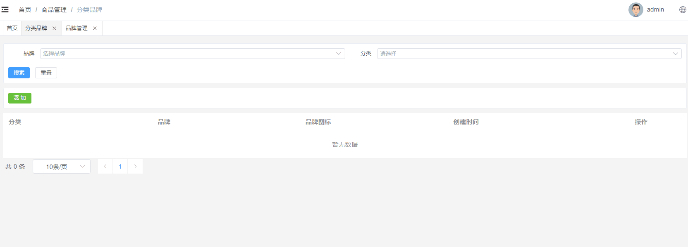

### 1.7.2 页面制作

具体代码如下所示：

```vue
<div class="tools-div">
    <el-button type="success" size="small" @click="addShow">添 加</el-button>
</div>

<el-dialog v-model="dialogVisible" title="添加或修改" width="30%">
    <el-form label-width="120px">
        <el-form-item label="品牌">
            <el-select
                       class="m-2"
                       placeholder="选择品牌"
                       size="small"
                       >
                <el-option
                           v-for="item in brandList"
                           :key="item.id"
                           :label="item.name"
                           :value="item.id"
                           />
            </el-select>
        </el-form-item>
        <el-form-item label="分类">
            <el-cascader
                         :props="categoryProps"
                         />
        </el-form-item>
        <el-form-item>
            <el-button type="primary">提交</el-button>
            <el-button @click="dialogVisible = false">取消</el-button>
        </el-form-item>
    </el-form>
</el-dialog>

<script setup>
    
//进入添加
const addShow = () => {
  dialogVisible.value = true
}

</script>
```

### 1.7.3 后端接口

#### CategoryBrandController

表现层代码实现：

```java
// com.atguigu.spzx.manager.controller
@PostMapping("/save")
public Result save(@RequestBody CategoryBrand categoryBrand) {
    categoryBrandService.save(categoryBrand);
    return Result.build(null , ResultCodeEnum.SUCCESS) ;
}
```

#### CategoryBrandService

业务层代码实现：

```java
// com.atguigu.spzx.manager.service.impl;
@Override
public void save(CategoryBrand categoryBrand) {
    categoryBrandMapper.save(categoryBrand) ;
}
```

#### CategoryBrandMapper

持久层代码实现：

```java
// com.atguigu.spzx.manager.mapper;
@Mapper
public interface CategoryBrandMapper {
    public abstract void save(CategoryBrand categoryBrand);
}
```

#### CategoryBrandMapper.xml

在CategoryBrandMapper映射文件中添加如下sql语句：

```xml
<insert id="save">
    insert into category_brand (
        id,
        brand_id,
        category_id,
        create_time,
        update_time ,
        is_deleted
    ) values (
        #{id},
        #{brandId},
        #{categoryId},
        now(),
        now(),
        0
    )
</insert>
```

### 1.7.4 前端对接

#### 实现思路

1、给表单绑定数据模型

2、给提交按钮绑定点击事件

3、点击按钮请求后端地址

#### categoryBrand.js

在src/api文件夹下创建categoryBrand.js文件，如下所示：

```javascript
// 保存信息
export const SaveCategoryBrand = categoryBrand => {
    return request({
      url: `${api_name}/save`,
      method: 'post',
      data: categoryBrand,
    })
}
```

#### categoryBrand.vue

修改categoryBrand.vue文件中的内容，如下所示：

```vue
<el-dialog v-model="dialogVisible" title="添加或修改" width="30%">
    <el-form label-width="120px">
        <el-form-item label="品牌">
            <el-select
                       class="m-2"
                       placeholder="选择品牌"
                       size="small"
                       v-model="categoryBrand.brandId"
                       >
                <el-option
                           v-for="item in brandList"
                           :key="item.id"
                           :label="item.name"
                           :value="item.id"
                           />
            </el-select>
        </el-form-item>
        <el-form-item label="分类">
            <el-cascader
                         :props="categoryProps"
                         v-model="categoryBrand.categoryId"
                         />
        </el-form-item>
        <el-form-item>
            <el-button type="primary" @click="saveOrUpdate">提交</el-button>
            <el-button @click="dialogVisible = false">取消</el-button>
        </el-form-item>
    </el-form>
</el-dialog>

<script setup>
import { SaveCategoryBrand } from '@/api/categoryBrand.js'
import { ElMessage, ElMessageBox } from 'element-plus'
    
const defaultForm = {       //页面表单数据
  id: '',
  brandId: '',
  categoryId: '',
}
const categoryBrand = ref(defaultForm)    

//提交保存与修改
const saveOrUpdate = () => {
  if (categoryBrand.value.brandId == '') {
    ElMessage.info('品牌信息必须选择')
    return
  }
  //categoryId为数组：[1,2,3]
  if (categoryBrand.value.categoryId.length != 3) {
    ElMessage.info('分类信息必须选择')
    return
  }
  //系统只需要三级分类id
  categoryBrand.value.categoryId = categoryBrand.value.categoryId[2]
  if (!categoryBrand.value.id) {
    saveData()
  } 
}

// 新增
const saveData = async () => {
  await SaveCategoryBrand(categoryBrand.value)
  dialogVisible.value = false
  ElMessage.success('操作成功')
  fetchData()
}
</script>

```

## 1.8 修改功能

### 1.8.1 需求说明

当用户点击修改按钮的时候，那么此时就弹出对话框，在该对话框中需要将当前行所对应的分类品牌数据在该表单页面进行展示。当用户在该表单中点击提交按钮的时候那么此时就需要将

表单进行提交，在后端需要提交过来的表单数据修改数据库中的即可。

效果如下所示：

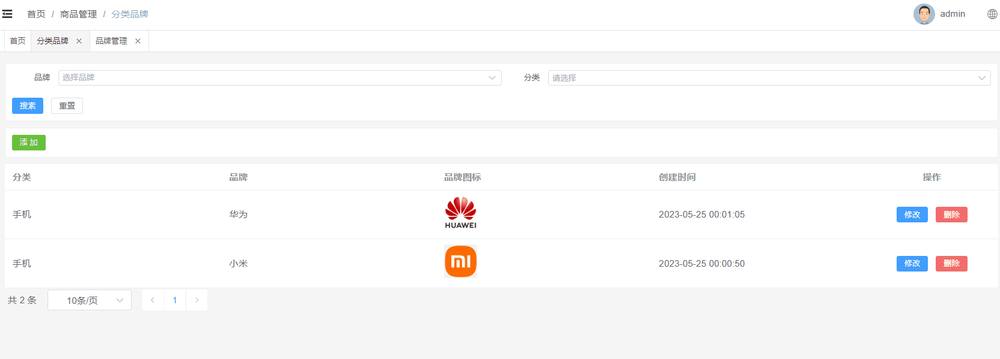

### 1.8.2 数据回显

分析：

1、使用添加数据的表单即可

2、要将当前操作行的数据展示在表单中，那么此时需要用到插槽

代码如下所示：

```vue
<el-table-column label="操作" align="center" width="200" >
    <el-button type="primary" size="small" @click="editShow(scope.row)">
        修改
    </el-button>
</el-table-column>

<script setup>
    
//进入修改
const editShow = row => {
  categoryBrand.value = row
  dialogVisible.value = true
}

</script>
```

### 1.8.3 提交修改

#### 后端接口

##### CategoryBrandController

表现层代码实现：

```java
// com.atguigu.spzx.manager.controller
@PutMapping("updateById")
public Result updateById(@RequestBody CategoryBrand categoryBrand) {
    categoryBrandService.updateById(categoryBrand);
    return Result.build(null , ResultCodeEnum.SUCCESS) ;
}
```

##### CategoryBrandService

业务层代码实现：

```java
// com.atguigu.spzx.manager.service.impl;
@Override
public void updateById(CategoryBrand categoryBrand) {
    categoryBrandMapper.updateById(categoryBrand) ;
}
```

##### CategoryBrandMapper

持久层代码实现：

```java
// com.atguigu.spzx.manager.mapper;
@Mapper
public interface CategoryBrandMapper {
    public abstract void updateById(CategoryBrand categoryBrand);
}
```

##### CategoryBrandMapper.xml

在CategoryBrandMapper映射文件中添加如下sql语句：

```xml
<update id="updateById" >
    update category_brand set
    <if test="brandId != null and brandId != ''">
        brand_id = #{brandId},
    </if>
    <if test="categoryId != null and categoryId != ''">
        category_id = #{categoryId},
    </if>
    update_time =  now()
    where
    id = #{id}
</update>
```

#### 前端对接

##### categoryBrand.js

在src/api文件夹下创建categoryBrand.js文件，如下所示：

```java
// 修改信息
export const UpdateCategoryBrandById = categoryBrand => {
    return request({
        url: `${api_name}/updateById`,
        method: 'put',
        data: categoryBrand,
    })
}
```

##### categoryBrand.vue

修改categoryBrand.vue文件中的内容，如下所示：

```vue
<script setup>
import { UpdateCategoryBrandById } from '@/api/categoryBrand.js'

//提交保存与修改
const saveOrUpdate = () => {
  ...
  //系统只需要三级分类id
  categoryBrand.value.categoryId = categoryBrand.value.categoryId[2]
  if (!categoryBrand.value.id) {
    saveData()
  } else {
    updateData() 
  }
}

// 修改
const updateData = async () => {
  await UpdateCategoryBrandById(categoryBrand.value)
  dialogVisible.value = false
  ElMessage.success('操作成功')
  fetchData() 
}
</script>
```

## 1.9 删除功能

### 1.9.1 需求说明

当点击删除按钮的时候此时需要弹出一个提示框，询问是否需要删除数据？如果用户点击是，那么此时向后端发送请求传递id参数，后端接收id参数进行逻辑删除。

效果如下所示：

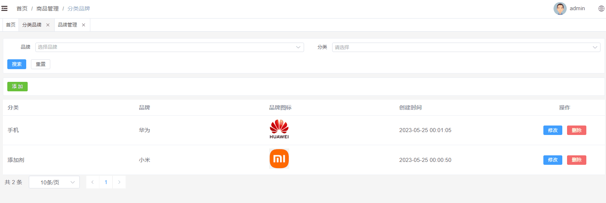 

### 1.9.2 后端接口

#### CategoryBrandController

表现层代码实现：

```java
// com.atguigu.spzx.manager.controller
@DeleteMapping("/deleteById/{id}")
public Result deleteById(@PathVariable Long id) {
    categoryBrandService.deleteById(id);
    return Result.build(null , ResultCodeEnum.SUCCESS) ;
}
```

#### CategoryBrandService

业务层代码实现：

```java
// com.atguigu.spzx.manager.service.impl;
@Override
public void deleteById(Long id) {
    categoryBrandMapper.deleteById(id) ;
}
```

#### CategoryBrandMapper

持久层代码实现：

```java
// com.atguigu.spzx.manager.mapper;
@Mapper
public interface CategoryBrandMapper {
    public abstract void deleteById(Long id);
}
```

#### CategoryBrandMapper.xml

在CategoryBrandMapper映射文件中添加如下sql语句：

```xml
<update id="deleteById">
    update category_brand set
        update_time = now() ,
        is_deleted = 1
    where
    	id = #{id}
</update>
```

### 1.9.3 前端对接

#### categoryBrand.js

在src/api文件夹下创建categoryBrand.js文件，如下所示：

```java
// 根据id删除数据
export const DeleteCategoryBrandById = id => {
    return request({
      url: `${api_name}/deleteById/${id}`,
      method: 'delete',
    })
}
```

#### categoryBrand.vue

修改categoryBrand.vue文件中的内容，如下所示：

```vue
<el-table-column label="操作" align="center" width="200" #default="scope">
    <el-button type="danger" size="small" @click="remove(scope.row.id)">
        删除
    </el-button>
</el-table-column>

<script setup>
import { DeleteCategoryBrandById } from '@/api/categoryBrand.js'
import { ElMessage, ElMessageBox } from 'element-plus'
    
//删除
const remove = async id => {
  ElMessageBox.confirm('此操作将永久删除该记录, 是否继续?', 'Warning', {
    confirmButtonText: '确定',
    cancelButtonText: '取消',
    type: 'warning',
  })
    .then(async () => {
      await DeleteCategoryBrandById(id)
      ElMessage.success('删除成功')
      fetchData()
    })
    .catch(() => {
      ElMessage.info('取消删除')
    })
}
</script>
```

# 2 商品规格管理

## 2.1 商品规格介绍

在电商项目中，商品规格指的是商品属性、型号、尺寸、颜色等具体描述商品特点和属性的标准化信息。

以手机为例子，它的规格可能包括以下几个方面：

1、操作系统：Android、iOS、HarmonyOS 等。

2、屏幕尺寸：5.5 吋、6.7 吋等。

3、分辨率：1920x1080、2960x1440、2532x1170 等。

4、运行内存：6GB、8GB、12GB 等。

5、存储容量：64GB、128GB、256GB 等。

6、摄像头：单摄、双摄、四摄等。

7、电池容量：3500mAh、4500mAh、5000mAh 等。

以T恤衫举例子，它的规格可能包括以下几个方面：

1、颜色：白色

2、尺码：S、M、L、XL等

3、款式：圆领、V领、印花等

## 2.2 菜单添加

首先在系统中添加商品规格管理的菜单，具体步骤如下所示：

1、在后台管理系统中通过系统管理的菜单管理添加商品规格管理的相关菜单，如下所示：

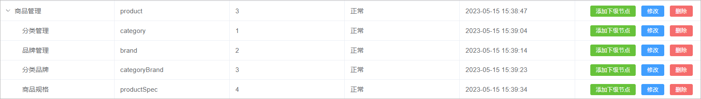 

2、给系统管理员角色分配商品规格管理菜单访问权限：

 

3、在前端项目中创建对应的页面，以及配置对应的异步路由

在src/views/product的文件夹中加入商品规格管理页面文件，如下所示：

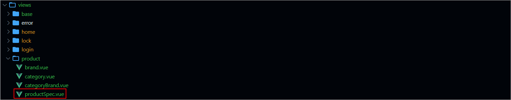 

在src/router/modules文件夹下创建product.js路由文件，文件内容如下所示：

```javascript
const Layout = () => import('@/layout/index.vue')
const category = () => import('@/views/product/category.vue')
const brand = () => import('@/views/product/brand.vue')
const categoryBrand = () => import('@/views/product/categoryBrand.vue')
const productSpec = () => import('@/views/product/productSpec.vue')

export default [
  {
    path: '/product',
    component: Layout,
    name: 'product',
    meta: {
      title: '商品管理',
    },
    icon: 'Histogram',
    children: [
      {
        path: '/category',
        name: 'category',
        component: category,
        meta: {
          title: '分类管理',
        },
      },
      {
        path: '/brand',
        name: 'brand',
        component: brand,
        meta: {
          title: '品牌管理',
        },
      },
      {
        path: '/categoryBrand',
        name: 'categoryBrand',
        component: categoryBrand,
        meta: {
          title: '分类品牌',
        },
      },
      {
        path: '/productSpec',
        name: 'productSpec',
        component: productSpec,
        meta: {
          title: '商品规格',
        },
      },
    ],
  },
]
```

## 2.3 表结构介绍

产品规格数据所对应的表结构如下所示：

```sql
CREATE TABLE `product_spec` (
  `id` bigint NOT NULL AUTO_INCREMENT COMMENT 'ID',
  `spec_name` varchar(100) CHARACTER SET utf8mb3 COLLATE utf8_general_ci DEFAULT NULL COMMENT '规格名称',
  `spec_value` text CHARACTER SET utf8mb3 COLLATE utf8_general_ci COMMENT '规格值："[{"key":"颜色","valueList":["蓝","白","红"]]"',
  `create_time` timestamp NOT NULL DEFAULT CURRENT_TIMESTAMP COMMENT '创建时间',
  `update_time` timestamp NOT NULL DEFAULT CURRENT_TIMESTAMP ON UPDATE CURRENT_TIMESTAMP COMMENT '更新时间',
  `is_deleted` tinyint NOT NULL DEFAULT '0' COMMENT '删除标记（0:不可用 1:可用）',
  PRIMARY KEY (`id`)
) ENGINE=InnoDB AUTO_INCREMENT=4 DEFAULT CHARSET=utf8mb4 COLLATE=utf8mb4_0900_ai_ci COMMENT='商品规格';
```

## 2.4 页面制作

对比如下页面结构，使用Element Plus制作出对应的页面，数据可以暂时使用假数据。

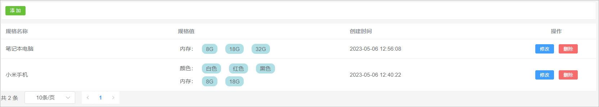 

该页面可以将其分为3部分：

1、添加按钮

2、数据表格

3、分页条


代码实现如下所示：

```vue
<template>
    <div class="tools-div">
        <el-button type="success" size="small">添 加</el-button>
    </div>

    <el-table :data="list" style="width: 100%">
        <el-table-column prop="specName" label="规格名称" />
        <el-table-column label="规格值" #default="scope">
        <div
            v-for="(item1, index1) in scope.row.specValue"
            :key="index1"
            style="padding: 5px; margin: 0;width: 100%;"
        >
            {{ item1.key }}：
            <span
            v-for="(item2, index2) in item1.valueList"
            :key="index2"
            class="div-atrr"
            >
            {{ item2 }}
            </span>
        </div>
        </el-table-column>
        <el-table-column prop="createTime" label="创建时间" />
        <el-table-column label="操作" align="center" width="200">
        <el-button type="primary" size="small" >
            修改
        </el-button>
        <el-button type="danger" size="small">
            删除
        </el-button>
        </el-table-column>
    </el-table>

    <el-pagination
        :page-sizes="[10, 20, 50, 100]"
        layout="total, sizes, prev, pager, next"
        :total="total"
    />

</template>

<script setup>
import { ref } from 'vue'

// 表格数据模型
const list = ref([
    {
        "id": 2,
        "createTime": "2023-05-06 12:56:08",
        "specName": "笔记本电脑",
        "specValue": [{"key":"内存","valueList":["8G","18G","32G"]}]
    },
    {
        "id": 1,
        "createTime": "2023-05-06 12:40:22",
        "specName": "小米手机",
        "specValue": [{"key":"颜色","valueList":["白色","红色","黑色"]},{"key":"内存","valueList":["8G","18G"]}]
    }
])

// 分页条数据模型
const total = ref(0)

</script>

<style scoped>
.tools-div {
  margin: 10px 0;
  padding: 10px;
  border: 1px solid #ebeef5;
  border-radius: 3px;
  background-color: #fff;
}
    
.div-atrr {
  padding: 5px 10px;
  margin: 0 10px;
  background-color: powderblue;
  border-radius: 10px;
}

</style>
```

## 2.5 列表查询

需求说明：当产品规格管理页面加载完毕以后就向后端发送分页查询请求，后端进行分页查询，返回分页结果数据。

### 2.5.1 后端接口

#### ProductSpec

创建一个与数据库表相对应的实体类，如下所示：

```java
// com.atguigu.spzx.model.entity.product
@Data
public class ProductSpec extends BaseEntity {

	private String specName;   // 规格名称
	private String specValue;  // 规格值

}
```

#### ProductSpecController

表现层代码实现：

```java
// com.atguigu.spzx.manager.controller
@RestController
@RequestMapping(value="/admin/product/productSpec")
public class ProductSpecController {

    @Autowired
    private ProductSpecService productSpecService ;

    @GetMapping("/{page}/{limit}")
    public Result<PageInfo<ProductSpec>> findByPage( @PathVariable Integer page, @PathVariable Integer limit) {
        PageInfo<ProductSpec> pageInfo = productSpecService.findByPage(page, limit);
        return Result.build(pageInfo , ResultCodeEnum.SUCCESS) ;
    }

}
```

#### ProductSpecService

业务层代码实现：

```java
// com.atguigu.spzx.manager.service.impl;
@Service
public class ProductSpecServiceImpl implements ProductSpecService {

    @Autowired
    private ProductSpecMapper productSpecMapper ;

    @Override
    public PageInfo<ProductSpec> findByPage(Integer page, Integer limit) {
        PageHelper.startPage(page , limit) ;
        List<ProductSpec> productSpecList = productSpecMapper.findByPage() ;
        return new PageInfo<>(productSpecList);
    }

}
```

#### ProductSpecMapper

持久层代码实现：

```java
// com.atguigu.spzx.manager.mapper
@Mapper
public interface ProductSpecMapper {
    public abstract List<ProductSpec> findByPage();
}
```

#### ProductSpecMapper.xml

在ProductSpecMapper.xml映射文件中添加如下sql语句：

```xml
<?xml version="1.0" encoding="UTF-8" ?>
<!DOCTYPE mapper PUBLIC "-//mybatis.org//DTD Mapper 3.0//EN" "http://mybatis.org/dtd/mybatis-3-mapper.dtd">
<mapper namespace="com.atguigu.spzx.manager.mapper.ProductSpecMapper">

    <resultMap id="productSpecMap" type="com.atguigu.spzx.model.entity.product.ProductSpec" autoMapping="true"></resultMap>

    <!-- 用于select查询公用抽取的列 -->
    <sql id="columns">
        id,spec_name,spec_value,create_time,update_time,is_deleted
    </sql>

    <select id="findByPage" resultMap="productSpecMap">
        select <include refid="columns" />
        from product_spec
        where is_deleted = 0
        order by id desc
    </select>

</mapper>
```

### 2.5.2 前端对接

#### productSpec.js

在src/api目录下添加productSpec.js文件，内容如下所示：

```javascript
import request from '@/utils/request'

const api_name = '/admin/product/productSpec'

// 分页列表
export const GetProductSpecPageList = (page, limit) => {
    return request({
      url: `${api_name}/${page}/${limit}`,
      method: 'get'
    })
}
```

#### productSpec.vue

修改productSpec.vue文件，内容如下所示：

```vue
<el-pagination
               v-model:current-page="pageParams.page"
               v-model:page-size="pageParams.limit"
               :page-sizes="[10, 20, 50, 100]"
               layout="total, sizes, prev, pager, next"
               :total="total"
               @size-change="handleSizeChange"
               @current-change="handleCurrentChange"
/>

<script setup>
import { ref , onMounted } from 'vue'
import { GetProductSpecPageList } from '@/api/productSpec.js'

//分页条数据模型
const pageParamsForm = {
  page: 1, // 页码
  limit: 10, // 每页记录数
}
const pageParams = ref(pageParamsForm)

// 钩子函数
onMounted(()=> {
    fetchData()
})

//页面变化
const handleSizeChange = size => {
  pageParams.value.limit = size
  fetchData()
}
const handleCurrentChange = number => {
  pageParams.value.page = number
  fetchData()
}

// 分页查询
const fetchData = async () => {
   const { data } = await GetProductSpecPageList(pageParams.value.page , pageParams.value.limit) 
   data.list.forEach(item => {
      item.specValue = JSON.parse(item.specValue)       // 将规格字符串转换成规格js对象
   });
   list.value = data.list
   total.value = data.total
}

</script>
```

## 2.6 添加功能

### 2.6.1 需求说明

用户点击添加按钮，此时需要展示一个添加数据的表单对话框，用户填写表单数据，点击提交按钮，请求后端接口完成数据的保存操作。效果如下所示：

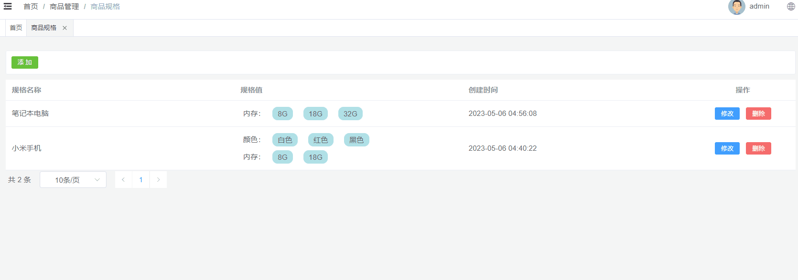

### 2.6.2 页面制作

页面代码如下所示：

```vue
<div class="tools-div">
    <el-button type="success" size="small" @click="addShow">添 加</el-button>
</div>

<el-dialog v-model="dialogVisible" title="添加或修改" width="40%">
    <el-form label-width="120px">
        <el-form-item label="规格名称">
            <el-input />
        </el-form-item>
        <el-form-item>
            <el-button size="default" type="success">
                添加新规格
            </el-button>
        </el-form-item>
        <el-form-item label="" v-for="(item , index) in productSpec.specValue" :key="index">
            <el-row>
                <el-col :span="10">
                    <el-input
                              v-model="item.key"
                              placeholder="规格"
                              style="width: 90%;"
                              />
                </el-col>
                <el-col :span="10">
                    <el-input
                              v-model="item.valueList"
                              placeholder="规格值(如:白色,红色)"
                              style="width: 90%;"
                              />
                </el-col>
                <el-col :span="4">
                    <el-button size="default" type="danger">删除</el-button>
                </el-col>
            </el-row>  
        </el-form-item>
        <el-form-item align="right">
            <el-button type="primary">提交</el-button>
            <el-button @click="dialogVisible = false">取消</el-button>
        </el-form-item>
    </el-form>
</el-dialog>

<script setup>
// 定义数据模型
const dialogVisible = ref(false)

// 添加表单数据模型
const defaultForm = {
  id: '',
  specName: '',
  specValue: [
        {
            "key": "颜色",
            "valueList": [
                "白色",
                "红色",
                "黑色"
            ]
        },
        {
            "key": "内存",
            "valueList": [
                "8G",
                "18G"
            ]
        }
    ]
}
const productSpec = ref(defaultForm)

//进入添加
const addShow = () => {
  dialogVisible.value = true
}

</script>
```

### 2.6.3 后端接口

#### ProductSpecController

表现层代码实现：

```java
// com.atguigu.spzx.manager.controller
@PostMapping("save")
public Result save(@RequestBody ProductSpec productSpec) {
    productSpecService.save(productSpec);
    return Result.build(null , ResultCodeEnum.SUCCESS) ;
}
```

#### ProductSpecService

业务层代码实现：

```java
// com.atguigu.spzx.manager.service.impl;
@Override
public void save(ProductSpec productSpec) {
    productSpecMapper.save(productSpec) ;
}
```

#### ProductSpecMapper

持久层代码实现：

```java
// com.atguigu.spzx.manager.mapper
@Mapper
public interface ProductSpecMapper {
    public abstract void save(ProductSpec productSpec);
}
```

#### ProductSpecMapper.xml

在ProductSpecMapper.xml映射文件中添加如下sql语句：

```xml
<insert id="save">
    insert into product_spec (
        id,
        spec_name,
        spec_value,
        create_time,
        update_time,
        is_deleted
    ) values (
        #{id},
        #{specName},
        #{specValue},
        now(),
        now(),
        0
    )
</insert>
```

### 2.6.4 前端对接

#### 实现思路

1、给表单绑定数据模型

2、给提交按钮绑定点击事件

3、点击按钮请求后端地址

#### productSpec.js

在src/api目录下添加productSpec.js文件，内容如下所示：

```javascript
// 保存信息
export const SaveProductSpec = productSpec => {
    return request({
      url: `${api_name}/save`,
      method: 'post',
      data: productSpec,
    })
}
```

#### productSpec.vue

修改productSpec.vue文件，内容如下所示：

```vue
<el-dialog v-model="dialogVisible" title="添加或修改" width="40%">
    <el-form label-width="120px">
        <el-form-item label="规格名称">
            <el-input v-model="productSpec.specName"/>
        </el-form-item>
        <el-form-item>
            <el-button size="default" type="success" @click="addSpec">
                添加新规格
            </el-button>
        </el-form-item>
        <el-form-item label="" v-for="(item , index) in productSpec.specValue" :key="index">
            <el-row>
                <el-col :span="10">
                    <el-input
                              v-model="item.key"
                              placeholder="规格"
                              style="width: 90%;"
                              />
                </el-col>
                <el-col :span="10">
                    <el-input
                              v-model="item.valueList"
                              placeholder="规格值(如:白色,红色)"
                              style="width: 90%;"
                              />
                </el-col>
                <el-col :span="4">
                    <el-button size="default" type="danger" @click="delSpec(index)">删除</el-button>
                </el-col>
            </el-row>  
        </el-form-item>
        <el-form-item align="right">
            <el-button type="primary" @click="saveOrUpdate">提交</el-button>
            <el-button @click="dialogVisible = false">取消</el-button>
        </el-form-item>
    </el-form>
</el-dialog>

<script setup>
import { SaveProductSpec } from '@/api/productSpec.js'
import { ElMessage, ElMessageBox } from 'element-plus'
    
//进入添加
const addShow = () => {
  dialogVisible.value = true
  productSpec.value = {
    id: '',
    specName: '',
    specValue: []
  }
}

// 页面添加规格操作
const addSpec = () => {
    productSpec.value.specValue.push({})
}

// 页面删除规格元素
const delSpec = (index) => {
    productSpec.value.specValue.splice(index , 1)
} 

// 提交表单
const saveOrUpdate = async () => {
    
    if(!productSpec.value.id)  {
        saveData()
    }

}

// 保存数据
const saveData = async () => {

    // 需要将productSpec.value.specValue转换成json字符串提交到后端，通过clone一个新的对象进行实现
    const productSpecClone = JSON.parse(JSON.stringify(productSpec.value))

    // 将productSpecClone.specValue.valueList转换成数组，因为后端需要的数组格式的数据[{"key":"内存","valueList":["8G","18G","32G"]}]
    // v-model绑定的数据模型为字符串
    productSpecClone.specValue.forEach(item => {     
        item.valueList = item.valueList.split(",")
    })
    productSpecClone.specValue = JSON.stringify(productSpecClone.specValue)
    
    console.log(productSpecClone);

    // 提交表单
    await SaveProductSpec(productSpecClone)
    
    dialogVisible.value = false
    ElMessage.success('操作成功')
    fetchData()

}
</script>
```

## 2.7 修改功能

### 2.7.1 需求说明

当用户点击修改按钮的时候，那么此时就弹出对话框，在该对话框中需要将当前行所对应的产品规格数据在该表单页面进行展示。当用户在该表单中点击提交按钮的时候那么此时就需要将

表单进行提交，在后端需要提交过来的表单数据修改数据库中的即可。

效果如下所示：

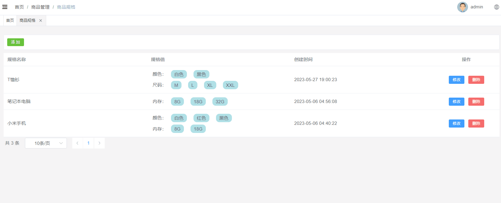

### 2.7.2 数据回显

分析：

1、使用添加数据的表单即可

2、要将当前操作行的数据展示在表单中，那么此时需要用到插槽

代码如下所示：

```vue
<el-table-column label="操作" align="center" width="200" #default="scope">
    <el-button type="primary" size="small" @click="editShow(scope.row)">
        修改
    </el-button>
</el-table-column>

<script setup>
    
//进入修改
const editShow = row => {
    productSpec.value = row 
    dialogVisible.value = true
}

</script>
```

### 2.7.4 后端接口

#### ProductSpecController

表现层代码实现：

```java
// com.atguigu.spzx.manager.controller
@PutMapping("updateById")
public Result updateById(@RequestBody ProductSpec productSpec) {
    productSpecService.updateById(productSpec);
    return Result.build(null , ResultCodeEnum.SUCCESS) ;
}
```

#### ProductSpecService

业务层代码实现：

```java
// com.atguigu.spzx.manager.service.impl;
@Override
public void updateById(ProductSpec productSpec) {
    productSpecMapper.updateById(productSpec);
}
```

#### ProductSpecMapper

持久层代码实现：

```java
// com.atguigu.spzx.manager.mapper
@Mapper
public interface ProductSpecMapper {
    public abstract void updateById(ProductSpec productSpec);
}
```

#### ProductSpecMapper.xml

在ProductSpecMapper.xml映射文件中添加如下sql语句：

```xml
<update id="updateById" >
    update product_spec set
    <if test="specName != null and specName != ''">
        spec_name = #{specName},
    </if>
    <if test="specValue != null and specValue != ''">
        spec_value = #{specValue},
    </if>
    update_time =  now()
    where
    id = #{id}
</update>
```

### 2.7.5 前端对接

#### productSpec.js

在src/api目录下添加productSpec.js文件，内容如下所示：

```javascript
// 修改信息
export const UpdateProductSpecById = productSpec => {
    return request({
        url: `${api_name}/updateById`,
        method: 'put',
        data: productSpec,
    })
}
```

#### productSpec.vue

修改productSpec.vue文件，内容如下所示：

```vue
<script setup>
import { UpdateProductSpecById } from '@/api/productSpec.js'

// 提交表单
const saveOrUpdate = async () => {

    if(!productSpec.value.id)  {
        saveData()
    }else {
        updateData()
    }

}

// 保存修改
const updateData = async () => {

    // 需要将productSpec.value.specValue转换成json字符串提交到后端，通过clone一个新的对象进行实现
    const productSpecClone = JSON.parse(JSON.stringify(productSpec.value))

    // 将productSpecClone.specValue.valueList转换成数组，因为后端需要的数组格式的数据[{"key":"内存","valueList":["8G","18G","32G"]}]
    // v-model绑定的数据模型为字符串
    productSpecClone.specValue.forEach(item => {  
        console.log(typeof item.valueList)
        if(typeof item.valueList === 'string') {   // 针对规格数据修改完毕以后数据类型有可能会变成string，针对string类型的数据将其转换成数组
            item.valueList = item.valueList.split(",")
        }   
    })
    productSpecClone.specValue = JSON.stringify(productSpecClone.specValue)

    // 提交表单
    await UpdateProductSpecById(productSpecClone)

    dialogVisible.value = false
    ElMessage.success('操作成功')
    fetchData()

}
</script>
```

## 2.8 删除功能

### 2.8.1 需求说明

当点击删除按钮的时候此时需要弹出一个提示框，询问是否需要删除数据？如果用户点击是，那么此时向后端发送请求传递id参数，后端接收id参数进行逻辑删除。

效果如下所示：

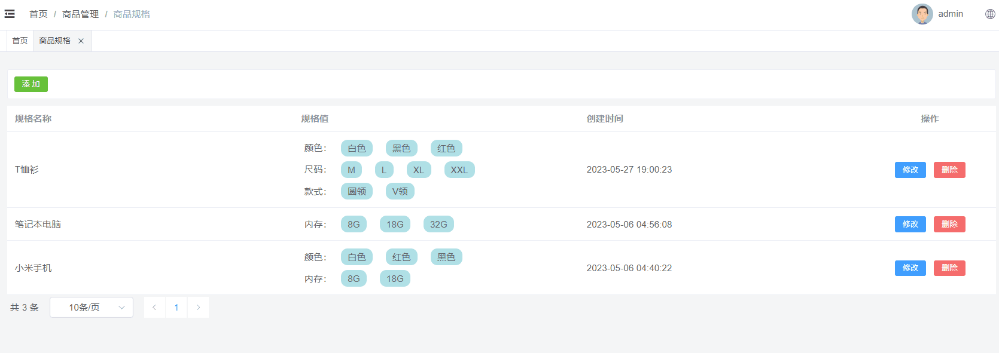 

### 2.8.2 后端接口

#### ProductSpecController

表现层代码实现：

```java
// com.atguigu.spzx.manager.controller
@DeleteMapping("/deleteById/{id}")
public Result removeById(@PathVariable Long id) {
    productSpecService.deleteById(id);
    return Result.build(null , ResultCodeEnum.SUCCESS) ;
}
```

#### ProductSpecService

业务层代码实现：

```java
// com.atguigu.spzx.manager.service.impl;
@Override
public void deleteById(Long id) {
    productSpecMapper.deleteById(id);
}
```

#### ProductSpecMapper

持久层代码实现：

```java
// com.atguigu.spzx.manager.mapper
@Mapper
public interface ProductSpecMapper {
    public abstract void deleteById(Long id);
}
```

#### ProductSpecMapper.xml

在ProductSpecMapper.xml映射文件中添加如下sql语句：

```xml
<update id="deleteById">
    update product_spec set
        update_time = now() ,
        is_deleted = 1
    where
    	id = #{id}
</update>
```

### 2.8.2 前端对接

#### productSpec.js

在src/api目录下添加productSpec.js文件，内容如下所示：

```javascript
// 根据id删除数据
export const DeleteProductSpecById = id => {
    return request({
      url: `${api_name}/deleteById/${id}`,
      method: 'delete',
    })
}
```

#### productSpec.vue

修改productSpec.vue文件，内容如下所示：

```vue
<el-table-column label="操作" align="center" width="200" #default="scope">
    <el-button type="danger" size="small" @click="remove(scope.row.id)">
        删除
    </el-button>
</el-table-column>

<script setup>
import { DeleteProductSpecById } from '@/api/productSpec.js'
    
//删除
const remove = async id => {
  ElMessageBox.confirm('此操作将永久删除该记录, 是否继续?', 'Warning', {
    confirmButtonText: '确定',
    cancelButtonText: '取消',
    type: 'warning',
  })
    .then(async () => {
      await DeleteProductSpecById(id)
      ElMessage.success('删除成功')
      fetchData()
    })
    .catch(() => {
      ElMessage.info('取消删除')
    })
}

</script>
```

# 3 商品管理

商品管理就是对电商项目中所涉及到的商品数据进行维护。

## 3.1 菜单添加

首先在系统中添加商品管理的菜单，具体步骤如下所示：

1、在后台管理系统中通过系统管理的菜单管理添加商品管理的相关菜单，如下所示：

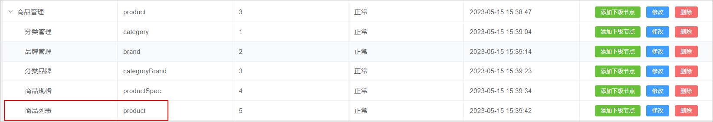 

2、给系统管理员角色分配商品商品管理菜单访问权限：

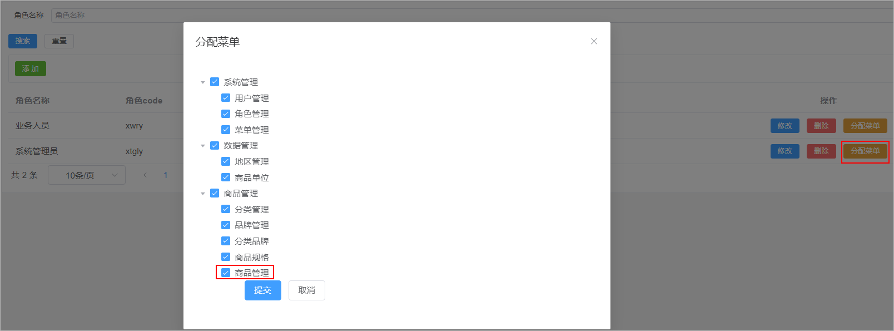 

3、在前端项目中创建对应的页面，以及配置对应的异步路由

在src/views/product的文件夹中加入商品管理页面文件，如下所示：

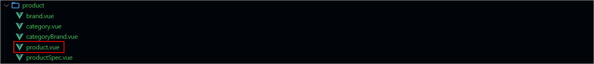 

在src/router/modules文件夹下创建product.js路由文件，文件内容如下所示：

```java
const Layout = () => import('@/layout/index.vue')
const category = () => import('@/views/product/category.vue')
const brand = () => import('@/views/product/brand.vue')
const categoryBrand = () => import('@/views/product/categoryBrand.vue')
const productSpec = () => import('@/views/product/productSpec.vue')
const product = () => import('@/views/product/product.vue')

export default [
  {
    path: '/product',
    component: Layout,
    name: 'product',
    meta: {
      title: '商品管理',
    },
    icon: 'Histogram',
    children: [
      {
        path: '/category',
        name: 'category',
        component: category,
        meta: {
          title: '分类管理',
        },
      },
      {
        path: '/brand',
        name: 'brand',
        component: brand,
        meta: {
          title: '品牌管理',
        },
      },
      {
        path: '/categoryBrand',
        name: 'categoryBrand',
        component: categoryBrand,
        meta: {
          title: '分类品牌',
        },
      },
      {
        path: '/productSpec',
        name: 'productSpec',
        component: productSpec,
        meta: {
          title: '商品规格',
        },
      },
      {
        path: '/product',
        name: 'product',
        component: product,
        meta: {
          title: '商品管理',
        },
      },
    ],
  },
]
```

## 3.2 表结构介绍

商品数据所对应的表结构如下所示：

```sql
CREATE TABLE `product` (
  `id` bigint NOT NULL AUTO_INCREMENT COMMENT 'ID',
  `name` varchar(255) CHARACTER SET utf8mb3 COLLATE utf8_general_ci DEFAULT NULL COMMENT '商品名称',
  `brand_id` bigint DEFAULT NULL COMMENT '品牌ID',
  `category1_id` bigint DEFAULT NULL COMMENT '一级分类id',
  `category2_id` bigint DEFAULT NULL COMMENT '二级分类id',
  `category3_id` bigint DEFAULT NULL COMMENT '三级分类id',
  `unit_name` varchar(50) CHARACTER SET utf8mb3 COLLATE utf8_general_ci DEFAULT NULL COMMENT '计量单位',
  `slider_urls` text COMMENT '轮播图',
  `spec_value` varchar(255) DEFAULT NULL COMMENT '商品规格json',
  `status` tinyint NOT NULL DEFAULT '0' COMMENT '线上状态：0-初始值，1-上架，-1-自主下架',
  `audit_status` tinyint NOT NULL DEFAULT '0' COMMENT '审核状态：0-初始值，1-通过，-1-未通过',
  `audit_message` varchar(255) CHARACTER SET utf8mb3 COLLATE utf8_general_ci DEFAULT NULL COMMENT '审核信息',
  `create_time` timestamp NOT NULL DEFAULT CURRENT_TIMESTAMP COMMENT '创建时间',
  `update_time` timestamp NOT NULL DEFAULT CURRENT_TIMESTAMP ON UPDATE CURRENT_TIMESTAMP COMMENT '更新时间',
  `is_deleted` tinyint NOT NULL DEFAULT '0' COMMENT '删除标记（0:不可用 1:可用）',
  PRIMARY KEY (`id`)
) ENGINE=InnoDB AUTO_INCREMENT=2 DEFAULT CHARSET=utf8mb4 COLLATE=utf8mb4_0900_ai_ci COMMENT='商品';
```

## 3.3 页面制作

直接导入资料中所提供的product.vue页面，以及对应的product.js

## 3.4 列表查询

### 3.4.1 需求说明

需求说明：

1、如果在搜索表单中选择了某一个品牌以及分类，那么此时就需要按照品牌id和分类id进行查询

2、搜索的时候需要进行分页搜索

### 3.4.2 后端接口

#### 需求分析

1、前端提交请求参数的时候包含了两部分的参数：搜索条件参数、分页参数。搜索条件参数可以通过?拼接到请求路径后面，分页参数【当前页码、每

页显示的数据条数】可以让前端通过请求路径传递过来

2、后端查询完毕以后需要给前端返回一个分页对象，分页对象中就封装了分页相关的参数(当前页数据、总记录数、总页数...)

3、前端进行参数传递的时候，不一定会传递搜索条件，因此sql语句的编写需要使用到动态sql

#### ProductDto

定义一个用来封装请求参数的Dto对象，如下所示：

```java
// com.atguigu.spzx.model.dto.product;
@Data
public class ProductDto extends BaseEntity {

    private Long brandId;
    private Long category1Id;
    private Long category2Id;
    private Long category3Id;

}
```

#### Product

针对当前要操作的数据库表定义一个与之对应的实体类：

```java
// com.atguigu.spzx.model.entity.product
@Data
public class Product extends BaseEntity {

	private String name;					// 商品名称
	private Long brandId;					// 品牌ID
	private Long category1Id;				// 一级分类id
	private Long category2Id;				// 二级分类id
	private Long category3Id;				// 三级分类id
	private String unitName;				// 计量单位
	private String sliderUrls;				// 轮播图
	private String specValue;				// 商品规格值json串
	private Integer status;					// 线上状态：0-初始值，1-上架，-1-自主下架
	private Integer auditStatus;			// 审核状态
	private String auditMessage;			// 审核信息

	// 扩展的属性，用来封装响应的数据
	private String brandName;				// 品牌
	private String category1Name;			// 一级分类
	private String category2Name;			// 二级分类
	private String category3Name;			// 三级分类

}
```

#### ProductController

表现层代码实现

```java
// com.atguigu.spzx.manager.controller;
@RestController
@RequestMapping(value="/admin/product/product")
public class ProductController {

    @Autowired
    private ProductService productService ;

    @GetMapping(value = "/{page}/{limit}")
    public Result<PageInfo<Product>> findByPage(@PathVariable Integer page, @PathVariable Integer limit, ProductDto productDto) {
        PageInfo<Product> pageInfo = productService.findByPage(page, limit, productDto);
        return Result.build(pageInfo , ResultCodeEnum.SUCCESS) ;
    }

}
```

#### ProductService

业务层代码实现

```java
//  com.atguigu.spzx.manager.service.impl;
@Service
public class ProductServiceImpl implements ProductService {

    @Autowired
    private ProductMapper productMapper ;

    @Override
    public PageInfo<Product> findByPage(Integer page, Integer limit, ProductDto productDto) {
        PageHelper.startPage(page , limit) ;
        List<Product> productList =  productMapper.findByPage(productDto) ;
        return new PageInfo<>(productList);
    }

}
```

#### ProductMapper

持久层代码实现

```java
@Mapper
public interface ProductMapper {
    public abstract List<Product> findByPage(ProductDto productDto);  
}
```

#### ProductMapper.xml

在ProductMapper.xml映射文件中添加如下的sql语句：

```xml
<?xml version="1.0" encoding="UTF-8" ?>
<!DOCTYPE mapper PUBLIC "-//mybatis.org//DTD Mapper 3.0//EN" "http://mybatis.org/dtd/mybatis-3-mapper.dtd">
<mapper namespace="com.atguigu.spzx.manager.mapper.ProductMapper">

    <resultMap id="productMap" type="com.atguigu.spzx.model.entity.product.Product" autoMapping="true"></resultMap>

    <!-- 用于select查询公用抽取的列 -->
    <sql id="columns">
        id,name,brand_id,category1_id,category2_id,category3_id,unit_name,slider_urls,spec_value,status,audit_status,audit_message,create_time,update_time,is_deleted
    </sql>


    <sql id="findPageWhere">
        <where>
            <if test="brandId != null and brandId != ''">
                and p.brand_id = #{brandId}
            </if>
            <if test="category1Id != null and category1Id != ''">
                and p.category1_id = #{category1Id}
            </if>
            <if test="category2Id != null and category2Id != ''">
                and p.category2_id = #{category2Id}
            </if>
            <if test="category3Id != null and category3Id != ''">
                and p.category3_id = #{category3Id}
            </if>
            and p.is_deleted = 0
        </where>
    </sql>

    <select id="findByPage" resultMap="productMap">
        select
            p.id, p.name , p.brand_id , p.category1_id , p.category2_id , p.category3_id, p.unit_name,
            p.slider_urls , p.spec_value , p.status , p.audit_status , p.audit_message , p.create_time , p.update_time , p.is_deleted ,
            b.name brandName , c1.name category1Name , c2.name category2Name , c2.name category3Name
        from product p
            LEFT JOIN brand b on b.id = p.brand_id
            LEFT JOIN category c1 on c1.id = p.category1_id
            LEFT JOIN category c2 on c2.id = p.category2_id
            LEFT JOIN category c3 on c3.id = p.category2_id
        <include refid="findPageWhere"/>
        order by id desc
    </select>

</mapper>
```

