# Spring Cloud Alibaba

# 1 系统架构演进

随着互联网行业的发展，对服务的要求也越来越高，服务架构也从单体架构逐渐演变为现在流行的微服务架构。

## 1.1 单体架构

早期的软件系统通常是基于单体应用架构设计的，也就是将整个系统作为一个单一的、可执行的应用程序来构建和维护。

如下图所示：

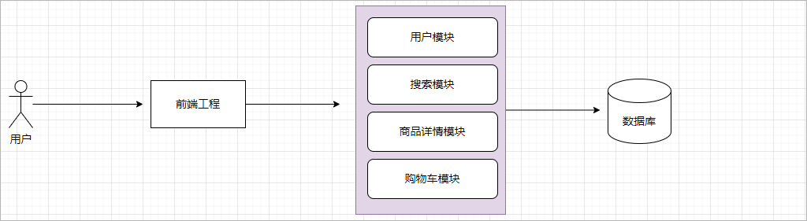 

单体架构具有以下优点：

1、简单：单体架构模式相对于其他复杂的架构来说，其结构简单易用，便于新手学习和应用。

2、易于维护：由于整个应用程序都在一个代码库中，因此很容易对其进行维护和更新。

3、易于部署：单个可执行文件可以在任何支持运行该语言的环境中运行，并且部署也相对轻松。

然而，单体架构也存在一些缺点：

1、扩展性差：单体应用程序所有功能都在一个程序中实现，因此扩展功能时需要新增或修改源代码，并重新部署整个应用程序，这可能会导致系统不

稳定和长时间停机。

2、可靠性低：由于单体应用程序集成了所有的逻辑和组件，因此如果其中有一个非常重要的组件出现故障，则可能导致从整个系统崩溃。

3、风险高：单体应用程序中的错误往往比较难以调试，因为代码复杂度高且耦合度强。 综上所述，单体架构适用于小型、简单的软件系统，但是对于

大型、复杂的系统来说，单体架构面临诸多挑战，需要采用其他更加灵活和可扩展的架构模式。

## 1.2 微服务架构

随着互联网的不断发展，软件系统的架构也是在不断的更新。由原先的单体架构逐渐演变成分布式系统架构，在到目前非常主流的微服务系统架构。

**分布式系统架构**是指将一个软件系统分割成多个独立的服务，并且这些服务可以在不同的计算机或服务器上运行，并通过网络进行通信。

**微服务系统架构**：本质上也属于分布式系统架构，在微服务系统架构中，更加重视的是服务拆分粒度。

如下图所示：

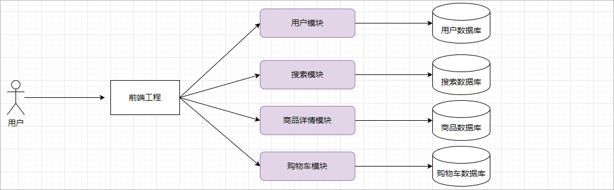 

微服务架构的特点：

1、单一职责：微服务拆分粒度更小，每一个服务都对应唯一的业务能力，做到单一职责

2、自治：团队独立、技术独立、数据独立，独立部署和交付

3、面向服务：服务提供统一标准的接口，与语言和技术无关


微服务系统架构的优点：

1、可扩展性好：由于系统中的不同组件可以独立地进行扩展和升级，从而提高了整个系统的扩展性和可靠性。

2、容错性高：由于系统中的组件可以在不同的计算机或服务器上运行，因此即使某些节点出现故障也不会影响整个系统的运行。

3、高效性强：分布式系统可以将负载和任务分配到不同的节点上，从而提高系统的并发能力和处理速度。

4、灵活性强：分布式系统可以支持多种编程语言和应用程序框架，并且可以利用各种云计算技术，如Docker、Kubernetes等。


微服务系统架构的存在的问题：

1、微服务的管理：这些微服务如果没有进行统一的管理，那么维护性就会极差。

2、服务间的通讯：微服务之间肯定是需要进行通讯，比如购物车微服务需要访问商品微服务。

3、前端访问问题：由于每一个微服务都是部署在独立的一台服务器的，每一个微服务都存在一个对应的端口号，前端在访问指定微服务的时候肯定需

​							 要指定微服务的ip地址和端口号，难道需要在前端维护每一个微服务的ip地址和端口号?

4、配置文件管理：当构建服务集群的时候，如果每一个微服务的配置文件还是和微服务进行绑定，那么维护性就极差。


## 1.3 分布式和集群

分布式：由多台服务器构成的网络环境，在分布式环境下每一台服务器的功能是不一样的。

集群：   由多台服务器构成的网络环境，在集群环境下每一台服务器的功能是一样的。

分布式环境中每一台服务器都可以做集群，如下图所示：

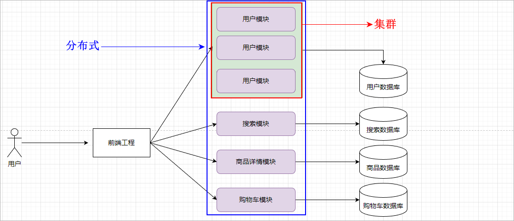 

# 2 Spring Cloud Alibaba概述

针对微服务系统架构所存在的问题，肯定是需要有具体的技术来解决，而所使用到的技术就是Spring Clouad Alibaba。那么想要了解Spring Clouad 

Alibaba，那么就需要先了解一下Spring Cloud。

## 2.1 Spring Cloud简介

1、Spring Cloud 是一系列**框架**的有序**集合**。在Spring Cloud这个项目中包含了很多的组件【子框架】，每一个组件都是用来解决问题系统架构中所遇

到的问题，因此Spring Cloud可以看做是一套微服务的解决方案。

2、Spring Cloud中常见的组件：Eureka(服务注册中心)、Openfeign(服务远程调用)、Gateway(服务网关)、Spring Cloud Config(统一配置中心)等。

3、Spring Cloud项目官方网址：https://spring.io/projects/spring-cloud

4、Spring Cloud依赖于Spring Boot，并且有版本的兼容关系，如下所示：

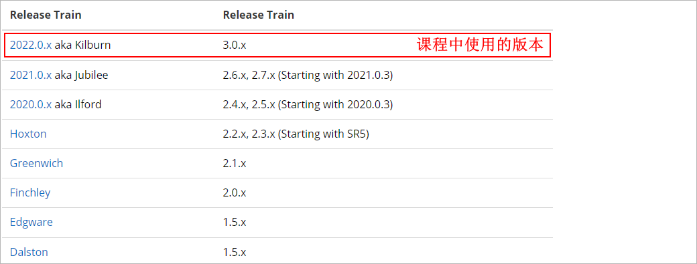 

## 2.2 Spring Cloud Alibaba简介

Spring Cloud Alibaba是阿里针对微服务系统架构所存在的问题给出了一套解决方案，该项目包含了微服务系统架构必须的一些组件。

常见的组件可以参看官网地址：https://spring-cloud-alibaba-group.github.io/github-pages/2021/en-us/index.html

注意：

1、Spring Cloud Alibaba中所提供的组件是遵循Spring Cloud规范的，两套技术所提供的组件是可以搭配使用的。

2、在现在企业开发中往往是两套技术组件搭配进行使用：Nacos(服务注册中心和配置中心)、Openfeign(远程调用)、Ribbon(客户端负载均衡器)、

Gateway(服务网关)、Sentinel(服务保护组件)等。

# 3 微服务环境准备

要想学习Spring Cloud Alibaba，那么此时就需要有一个微服务的系统环境。本章节我们就来使用Spring Boot来搭建两个微服务，分别是用户微服务

和订单微服务。

## 3.1 工程结构说明

在创建微服务工程的时候都需要先提供一个父工程，使用父工程来管理多个微服务所需要的依赖。我们的微服务系统结构如下所示：

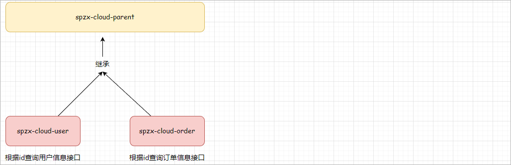 

## 3.2 父工程搭建

具体步骤如下所示：

1、创建一个spzx-cloud-parent的maven项目

2、在pom.xml文件中加入如下依赖

```xml
<!-- 定义属性 -->
<properties>
    <maven.compiler.source>17</maven.compiler.source>
    <maven.compiler.target>17</maven.compiler.target>
    <project.build.sourceEncoding>UTF-8</project.build.sourceEncoding>
    <spring-cloud.version>2022.0.2</spring-cloud.version>
    <spring-cloud-alibaba.version>2022.0.0.0-RC2</spring-cloud-alibaba.version>
    <mybatis-spring-boot.version>3.0.1</mybatis-spring-boot.version>
    <mysql.version>8.0.29</mysql.version>
</properties>

<!-- 指定spring boot父工程 -->
<parent>
    <artifactId>spring-boot-starter-parent</artifactId>
    <groupId>org.springframework.boot</groupId>
    <version>3.0.5</version>
</parent>

<dependencyManagement> <!-- 在dependencyManagement标签中所定义的依赖不会被子工程直接进行继承 -->
    <dependencies>

        <!-- spring cloud的依赖 -->
        <dependency>
            <groupId>org.springframework.cloud</groupId>
            <artifactId>spring-cloud-dependencies</artifactId>
            <version>${spring-cloud.version}</version>
            <type>pom</type>
            <scope>import</scope>
        </dependency>

        <!-- spring cloud alibaba的依赖 -->
        <dependency>
            <groupId>com.alibaba.cloud</groupId>
            <artifactId>spring-cloud-alibaba-dependencies</artifactId>
            <version>${spring-cloud-alibaba.version}</version>
            <type>pom</type>
            <scope>import</scope>
        </dependency>

        <!-- mysql的驱动 -->
        <dependency>
            <groupId>mysql</groupId>
            <artifactId>mysql-connector-java</artifactId>
            <version>${mysql.version}</version>
        </dependency>

        <!-- mybatis和spring boot整合的起步依赖 -->
        <dependency>
            <groupId>org.mybatis.spring.boot</groupId>
            <artifactId>mybatis-spring-boot-starter</artifactId>
            <version>${mybatis-spring-boot.version}</version>
        </dependency>

    </dependencies>

</dependencyManagement>
```

3、删除src目录

## 3.3 用户微服务搭建

### 3.3.1 基础环境搭建

步骤：

1、导入课程资料中所提供的user.sql数据库脚本。

2、在spzx-cloud-parent下面创建一个子模块spzx-cloud-user

3、在pom.xml文件中加入如下依赖

```xml
<properties>
    <maven.compiler.source>17</maven.compiler.source>
    <maven.compiler.target>17</maven.compiler.target>
    <project.build.sourceEncoding>UTF-8</project.build.sourceEncoding>
</properties>

<dependencies>

    <!-- spring boot的web开发所需要的起步依赖 -->
    <dependency>
        <groupId>org.springframework.boot</groupId>
        <artifactId>spring-boot-starter-web</artifactId>
    </dependency>

    <!-- mysql的驱动 -->
    <dependency>
        <groupId>mysql</groupId>
        <artifactId>mysql-connector-java</artifactId>
    </dependency>

    <!-- mybatis和spring boot整合的起步依赖 -->
    <dependency>
        <groupId>org.mybatis.spring.boot</groupId>
        <artifactId>mybatis-spring-boot-starter</artifactId>
    </dependency>
    
    <!-- lombok依赖，快速生成getter和setter方法 -->
    <dependency>
        <groupId>org.projectlombok</groupId>
        <artifactId>lombok</artifactId>
    </dependency>

</dependencies>
```

4、在resources目录下创建一个application.yml文件，文件的内容如下所示：

```yml
# 配置服务端口号
server:
  port: 10100

# 配置数据库的连接信息
spring:
  datasource:
    driver-class-name: com.mysql.cj.jdbc.Driver
    url: jdbc:mysql://192.168.136.142:3306/spzx-cloud-user?characterEncoding=UTF8
    username: root
    password: 1234

# 配置mybatis的相关信息
mybatis:
  configuration:
    log-impl: org.apache.ibatis.logging.stdout.StdOutImpl
  type-aliases-package: com.atguigu.spzx.cloud.user.entity
  mapper-locations: classpath:/mapper/*.xml
```

### 3.3.2 基础代码编写

需求：在user微服务中提供一个根据用户的id查询用户详情的接口

具体步骤：

1、编写启动类

```java
// com.atguigu.spzx.cloud.user
@SpringBootApplication
public class UserApplication {

    public static void main(String[] args) {
        SpringApplication.run(UserApplication.class , args) ;
    }

}
```

2、编写实体类

```java
// com.atguigu.spzx.cloud.user.entity
@Data
public class User {

    private Long id ;
    private String userName ;
    private String address ;
    
}
```

3、编写UserMapper接口

```java
// com.atguigu.spzx.cloud.user.mapper;
@Mapper  // 该注解可以通过在启动类上的@MapperScan注解进行替换
public interface UserMapper {

    // 根据用户的id查询用户详情
    public abstract User findUserByUserId(Long userId) ;

}
```

4、编写UserMapper.xml映射文件

```XML
<?xml version="1.0" encoding="UTF-8" ?>
<!DOCTYPE mapper PUBLIC "-//mybatis.org//DTD Mapper 3.0//EN" "https://mybatis.org/dtd/mybatis-3-mapper.dtd">
<mapper namespace="com.atguigu.spzx.cloud.user.mapper.UserMapper">

    <!-- 根据用户的id查询用户详情 -->
    <select id="findUserByUserId" resultType="com.atguigu.spzx.cloud.user.entity.User">
        SELECT * FROM tb_user WHERE id = #{userId}
    </select>
    
</mapper>
```

5、编写service接口以及实现类

```java
// com.atguigu.spzx.cloud.user.service
public interface UserService {

    // 根据用户的id查询用户详情
    public abstract User findUserByUserId(Long userId) ;

}

// com.atguigu.spzx.cloud.user.service.impl;
@Service
public class UserServiceImpl implements UserService {

    @Autowired
    private UserMapper userMapper ;

    @Override
    public User findUserByUserId(Long userId) {
        return userMapper.findUserByUserId(userId);
    }

}
```

6、编写controller

```java
// com.atguigu.spzx.cloud.user.controller
@RestController
@RequestMapping(value = "/api/user")
public class UserController {

    @Autowired
    private UserService userService ;

    @GetMapping(value = "/findUserByUserId/{userId}")
    public User findUserByUserId(@PathVariable(value = "userId") Long userId) {
        return userService.findUserByUserId(userId) ;
    }

}
```

启动服务进行测试。

## 3.4 订单微服务搭建

### 3.4.1 基础环境搭建

步骤：

1、导入课程资料中所提供的order.sql数据库脚本。

2、在spzx-cloud-parent下面创建一个子模块spzx-cloud-order

3、在pom.xml文件中加入如下依赖

```xml
<properties>
    <maven.compiler.source>17</maven.compiler.source>
    <maven.compiler.target>17</maven.compiler.target>
    <project.build.sourceEncoding>UTF-8</project.build.sourceEncoding>
</properties>

<dependencies>

    <!-- spring boot的web开发所需要的起步依赖 -->
    <dependency>
        <groupId>org.springframework.boot</groupId>
        <artifactId>spring-boot-starter-web</artifactId>
    </dependency>

    <!-- mysql的驱动 -->
    <dependency>
        <groupId>mysql</groupId>
        <artifactId>mysql-connector-java</artifactId>
    </dependency>

    <!-- mybatis和spring boot整合的起步依赖 -->
    <dependency>
        <groupId>org.mybatis.spring.boot</groupId>
        <artifactId>mybatis-spring-boot-starter</artifactId>
    </dependency>
    
    <!-- lombok依赖，快速生成getter和setter方法 -->
    <dependency>
        <groupId>org.projectlombok</groupId>
        <artifactId>lombok</artifactId>
    </dependency>

</dependencies>
```

4、在resources目录下创建一个application.yml文件，文件的内容如下所示：

```yml
# 配置服务端口号
server:
  port: 10200

# 配置数据库的连接信息
spring:
  datasource:
    driver-class-name: com.mysql.cj.jdbc.Driver
    url: jdbc:mysql://192.168.136.142:3306/spzx-cloud-order?characterEncoding=UTF8
    username: root
    password: 1234

# 配置mybatis的相关信息
mybatis:
  configuration:
    log-impl: org.apache.ibatis.logging.stdout.StdOutImpl
  type-aliases-package: com.atguigu.spzx.cloud.order.entity
  mapper-locations: classpath:/mapper/*.xml
```

### 3.4.2 基础代码编写

需求：在order微服务中提供一个根据订单的id查询订单详情的接口

具体步骤：

1、编写启动类

```java
// com.atguigu.spzx.cloud.order
@SpringBootApplication
public class OrderApplication {

    public static void main(String[] args) {
        SpringApplication.run(OrderApplication.class , args) ;
    }

}
```

2、编写实体类

```java
// com.atguigu.spzx.cloud.order.entity
@Data
public class Order {

    private Long id ;
    private Long userId ;
    private String name ;
    private BigDecimal price ;
    private Integer num ;
    
}
```

3、编写OrderMapper接口

```java
// com.atguigu.spzx.cloud.order.mapper;
@Mapper  // 该注解可以通过在启动类上的@MapperScan注解进行替换
public interface OrderMapper {

    // 根据订单的id查询订单数据
    public abstract Order findOrderByOrderId(Long orderId) ;

}
```

4、编写OrderMapper.xml映射文件

```XML
<?xml version="1.0" encoding="UTF-8" ?>
<!DOCTYPE mapper PUBLIC "-//mybatis.org//DTD Mapper 3.0//EN" "https://mybatis.org/dtd/mybatis-3-mapper.dtd">
<mapper namespace="com.atguigu.spzx.cloud.order.mapper.OrderMapper">

    <!-- 定义sql片段 -->
    <sql id="base_field">
        id , user_id userId , name , price , num
    </sql>

    <!-- 根据用户的id查询用户详情 -->
    <select id="findOrderByOrderId" resultType="com.atguigu.spzx.cloud.order.entity.Order">
        SELECT <include refid="base_field"></include> FROM tb_order WHERE id = #{orderId}
    </select>

</mapper>
```

5、编写service接口以及实现类

```java
// com.atguigu.spzx.cloud.order.service
public interface OrderService {

    // 根据订单的id查询订单数据
    public abstract Order findOrderByOrderId(Long orderId) ;

}

// com.atguigu.spzx.cloud.order.service.impl;
@Service
public class OrderServiceImpl implements OrderService {

    @Autowired
    private OrderMapper orderMapper ;

    @Override
    public Order findOrderByOrderId(Long orderId) {
        return orderMapper.findOrderByOrderId(orderId);
    }

}
```

6、编写controller

```java
// com.atguigu.spzx.cloud.order.controller
@RestController
@RequestMapping(value = "/api/order")
public class OrderController {

    @Autowired
    private OrderService orderService ;

    @GetMapping(value = "/findOrderByOrderId/{orderId}")
    public Order findOrderByOrderId(@PathVariable("orderId") Long orderId) {
        return orderService.findOrderByOrderId(orderId) ;
    }

}
```

启动服务进行测试。

# 4 服务远程调用

## 4.1 需求说明

需求：在查询订单时候需要将订单所属用户的信息也一并查询出来。

如下图所示：

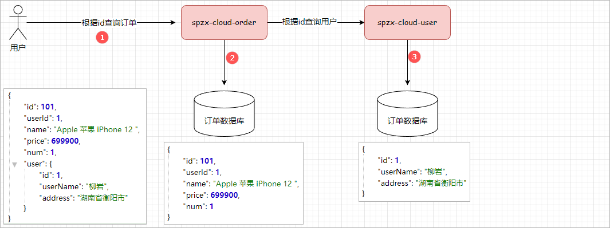 

注意：被调用方法常常也将其称之为服务的提供方，调用方常常将其称之为服务的消费方

## 4.2 传统调用

### 4.2.1 代码实现

要完成上述的需求，我们就需要在order微服务中向user微服务发起一个http的请求，调用

http://localhost:10100/api/user/findUserByUserId/{userId}这个接口。

步骤：

1、在order微服务中定义一个User的实体类，注意包结构需要和user微服务保持一致

2、在order微服务的Spring容器中注册一个**RestTemplate**

```java
// com.atguigu.spzx.cloud.order.config;
@Configuration
public class RestTemplateConfiguration {

    @Bean
    public RestTemplate restTemplate() {
        return new RestTemplate() ;
    }

}
```

3、修改order服务中的OrderService类中的findOrderByOrderId方法，根据Order对象中的userId查询User

```java
@Service
public class OrderServiceImpl implements OrderService {

    @Autowired          // 注入RestTemplate远程调用工具
    private RestTemplate restTemplate ;

    @Autowired
    private OrderMapper orderMapper ;

    @Override
    public Order findOrderByOrderId(Long orderId) {

        // 根据id查询订单数据
        Order order = orderMapper.findOrderByOrderId(orderId);

        // 发起远程调用
        User user = restTemplate.getForObject("http://localhost:10100/api/user/findUserByUserId/" + order.getUserId(), User.class);
        order.setUser(user);

        // 返回订单数据
        return order;
    }

}
```

4、将查询的User填充到Order对象，一起返回

### 4.2.2 问题说明

上述的调用方式存在问题：

1、维护性差：服务提供方的ip地址发生了改变，那么此时服务的消费方就需要更改代码

2、缺少负载均衡机制：负载均衡就是负载【请求】通过多台服务器进行处理

如下图所示：

没有负载均衡机制的调用流程图：

  

用户发送了3次请求，3次请求是通过一个用户微服务进行处理的，在高并发访问的情况下，用户微服务很有可能出现宕机。

有负载均衡机制的调用流程图：

 

用户发送了3次请求，3次请求是通过多个用户微服务进行处理的，在高并发访问的情况下，每一个用户微服务只需要承担一小部分的请求即可。

# 5 Nacos注册中心

要想解决上述远程调用所存在的问题，就需要使用到Spring Cloud Alibaba中的Nacos注册中心。

## 5.1 注册中心简介

通过注册中心可以对服务提供方和服务消费方进行解耦。具体的工作模式如下图所示：

 

工作流程说明：

1、服务提供方在启动的时候，会向注册中心注册自己服务的详情信息(ip、端口号等)。在注册中心中会维护一张服务清单，保存这些注册信息，注册中

心需要以心跳的方式去监测清单中的服务是否可用，如果不可用，需要在服务清单中剔除不可用的服务。

2、服务消费方向服务注册中心咨询服务，并获取所有服务的实例清单，然后按照指定的负载均衡算法从服务清单中选择一个服务实例进行访问。

## 5.2 注册中心产品

本小结主要给大家来介绍一下常见的注册中心的产品。

### 5.2.1 Eureka

Eureka是Netflix开源的一个基于REST的服务治理框架，主要用于实现服务注册、发现和负载均衡。通过Eureka，我们可以将微服务的各个实例注册

到服务中心，并根据需要进行负载均衡和调用，从而实现整个微服务架构的高可用和弹性。

Eureka的架构图如下所示：

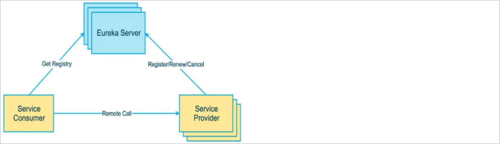 

Eureka包含两个组件：Eureka Server和Eureka Client。

服务提供者在启动时会通过Eureka Client向Eureka Server注册自己的信息（包括IP地址、端口号和服务名等），并且每隔一段时间会发送心跳来告

诉Eureka Server它仍然存活。服务消费者可以通过Eureka Client从Eureka Server获取服务提供者的列表，并对这些服务进行负载均衡和调用。


Eureka的优点包括：

1、简单易用：Eureka框架非常简单易用，便于快速上手和部署。

2、高可用性：Eureka支持多节点部署，并会自动将失效的节点剔除，确保整个系统的高可用性和弹性。

3、动态扩展性：Eureka可以根据实际需求进行扩展，通过添加新的服务提供者可以很容易地增加应用程序的处理能力。

4、易于集成：Eureka可以与Spring Cloud等流行的微服务框架进行无缝集成，从而提供更完善的微服务体系支持。

Eureka的不足之处：

1、Eureka Server 为单点故障问题，虽然可以通过多节点部署来优化和缓解，但是在高并发场景下仍可能成为限制系统扩展的瓶颈。

2、Eureka的服务注册中心本身也需要高可用环境，一旦出现问题，可能影响到整个微服务的正常运行。


官网地址：https://docs.spring.io/spring-cloud-netflix/docs/current/reference/html/


### 5.2.2 Nacos

Nacos官网地址：https://nacos.io/

 

Nacos是 Dynamic Naming and Configuration Service的首字母简称，一个更易于构建云原生应用的动态服务发现、配置管理和服务管理平台。

Nacos 致力于帮助您发现、配置和管理微服务。Nacos 提供了一组简单易用的特性集，帮助您快速实现动态服务发现、服务配置、服务元数据及流量

管理。


Nacos架构图如下所示：

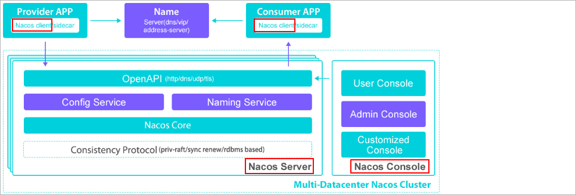  

Nacos Server：服务注册中心，它是服务，其实例及元数据的数据库。服务实例在启动时注册到服务注册表，并在关闭时注销。服务注册中心可能会

调用服务实例的健康检查 API 来验证它是否能够处理请求。Nacos Server需要独立的部署。

Nacos Client: Nacos Client负责和Nacos Server进行通讯完成服务的注册和服务的发现。

Nacos Console：是Nacos的控制模块，Nacos提供了可视化的后台管理系统，可以很容易的实现服务管理操作。


Nacos的优点包括：

1、高可用性：Nacos支持多节点部署，通过选举算法实现了高可用和故障转移能力，在节点宕机或网络异常情况下仍能保证整个系统的稳定运行。

2、动态扩展性：Nacos可以根据实际需求进行快速扩展和缩容，支持集群、多数据中心、地域感知等特性。

3、完备的功能支持：Nacos支持服务注册与发现、配置管理、流量管理、DNS解析、存储KV对等功能，并且提供了Web界面和RESTful API等多种

方式来使用这些功能。

4、易于集成：Nacos提供了多种语言和框架的集成方案，并且支持Spring Cloud等流行的微服务框架。

总的来说，Nacos是一个功能齐全、易于使用和高可用的分布式服务治理平台，可以为分布式系统提供高效、稳定的运行环境。

## 5.3 Nacos入门

### 5.3.1 Nacos安装

本章节主要给搭建演示一下如下使用Docker来部署Nacos Server。Docker部署Nacos的项目命令如下所示：

```shell
# 拉取镜像
docker pull nacos/nacos-server:v2.2.2

# 创建容器
docker run --name nacos -e MODE=standalone -p 8848:8848 -p 9848:9848 -d nacos/nacos-server:v2.2.2

# nacos2.x的版本新增了一个客户端与服务端的gRpc的通讯端口号9848
```

打开浏览器访问nacos的所提供的后端管理界面：http://192.168.136.142:8848/nacos

用户名和密码：nacos/nacos

登录成功以后会进入到nacos的主页面：

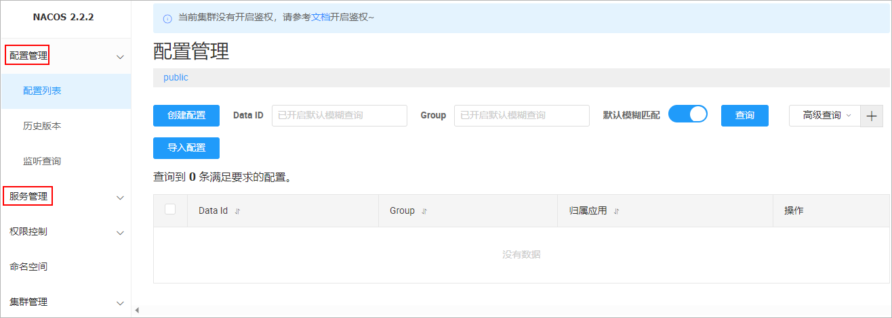  

如果可以看到上述界面，就说明nacos的环境搭建好了。

### 5.3.2 微服务集成naocs

需求：将两个微服务(user、order)注册到nacos中

实现步骤：

1、在两个子工程中引入如下依赖

```xml
<!-- nacos作为注册中心的依赖 -->
<dependency>
    <groupId>com.alibaba.cloud</groupId>
    <artifactId>spring-cloud-starter-alibaba-nacos-discovery</artifactId>
</dependency>
```

2、在application.yml文件中添加如下配置

```yaml
spring:
  # 配置nacos注册中心的地址
  cloud:
    nacos:
      discovery:
        server-addr: 192.168.136.142:8848
  application:
    name: spzx-cloud-user   # 每一个服务注册到nacos注册中心都需要提供一个服务名称,order微服务注册的时候需要更改微服务名称
```

3、启动两个微服务：就可以在nacos的后台管理系统中，看到如下的注册信息：

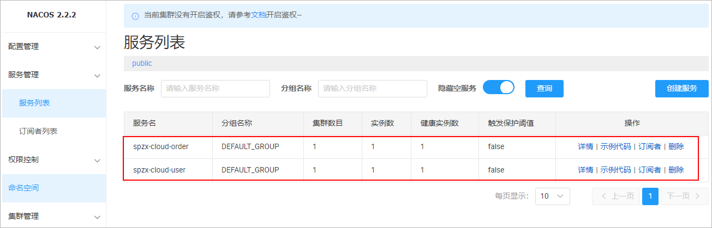 

### 5.3.3 更改远程调用

当我们把微服务都注册到注册中心以后，那么此时就可以根据服务的名称从注册中心获取服务的ip地址和端口号了，进而就可以更改远程调用代码！

#### 方案一

使用到Spring Cloud中所提供的一个服务发现的客户端对象：**DiscoveryClient**。

代码实现：

```java
@Service
public class OrderServiceImpl implements OrderService {

    @Autowired          // 注入RestTemplate远程调用工具
    private RestTemplate restTemplate ;

    @Autowired
    private DiscoveryClient discoveryClient ;

    @Autowired
    private OrderMapper orderMapper ;

    @Override
    public Order findOrderByOrderId(Long orderId) {

        // 根据id查询订单数据
        Order order = orderMapper.findOrderByOrderId(orderId);

        // 根据服务名称从注册中心中获取服务实例列表
        ServiceInstance serviceInstance = chooseServiceInstance("spzx-cloud-user");

        // 发起远程调用
        User user = restTemplate.getForObject("http://" + serviceInstance.getHost() +":" + serviceInstance.getPort() +"/api/user/findUserByUserId/" + order.getUserId(), User.class);
        order.setUser(user);

        // 返回订单数据
        return order;
    }

    // 根据服务的名称从注册中心中获取服务地址信息
    public ServiceInstance chooseServiceInstance(String applicationName) {

        // 获取服务实例列表
        List<ServiceInstance> instances = discoveryClient.getInstances(applicationName);

        // 编写一个简易的随机负载均衡算法
        int size = instances.size();
        Random random = new Random() ;
        int instanceIndex = random.nextInt(size);
        ServiceInstance serviceInstance = instances.get(instanceIndex);

        // 返回服务实例
        return serviceInstance ;
    }

}
```

可以启动多个user微服务实例进行负载均衡的测试。

#### 方案二

使用Spring Cloud中所提供的一个组件：**spring-cloud-loadbalancer**，关于该组件本小结先使用一下，在第6章的时候会重点讲解。

使用步骤：

1、在order微服务中添加依赖

```xml
<!-- spring cloud 所提供的负载均衡器 -->
<dependency>
    <groupId>org.springframework.cloud</groupId>
    <artifactId>spring-cloud-loadbalancer</artifactId>
</dependency>
```

2、在声明RestTemplate的方法上添加**@LoadBalanced**注解

```java
@Bean
@LoadBalanced       // 让RestTemplate具有负载均衡的能力
public RestTemplate restTemplate() {
    return new RestTemplate() ;
}
```

3、更改远程调用代码

```java
// 服务提供方的服务ip地址和端口号可以使用服务提供方的服务名称进行替换
restTemplate.getForObject("http://spzx-cloud-user/api/user/findUserByUserId/" + order.getUserId(), User.class);
```

注意：默认使用的负载均衡算法就是轮询【依次调用对应服务】

## 5.4 高级特性

### 5.4.1 服务集群

#### 集群概述

在实际生产环境中，为了保证每一个服务的高可用，那么此时就需要去构建服务集群，但是并不是说把所有的服务都部署在一个机房里。而是将多个服

务分散的部署到不同的机房中，每一个机房的服务可以看做成是一个集群。如下所示：

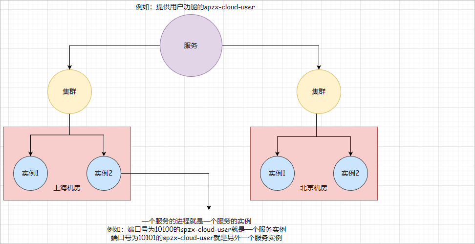 

微服务互相访问时，应该尽可能访问同集群实例，因为本地访问速度更快。当本集群内不可用时，才访问其它集群。例如：

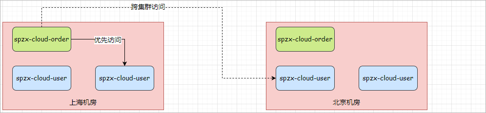 

上海机房内的order微服务应该优先访问同机房的user微服务。

#### 集群配置

修改spzx-cloud-user的application.yml文件，添加集群配置：

```YAML
spring:
  cloud:
    nacos:
      discovery:
        cluster-name: SH		# 配置服务所属集群
```

启动三个服务user微服务实例，实例所属集群分配情况：实例1属于SH，实例2和实例3属于BJ


可以通过添加添加JVM参数更改服务实例所属集群：

```shell
-Dserver.port=10101 -Dspring.cloud.nacos.discovery.cluster-name=BJ
```

 启动三个用户微服务实例，查看实例分配情况：

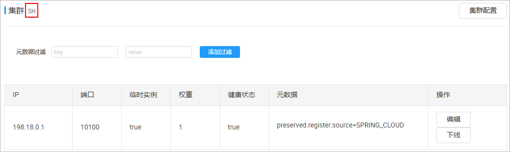 

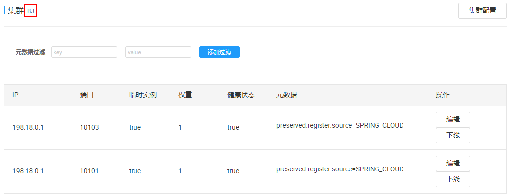 

#### 集群访问

需求：当order服务优先访问SH集群中的user微服务实例，当SH集群中的user微服务实例出现问题以后，在访问BJ集群中的实例。

步骤：

1、给order微服务的application.yml文件，添加集群配置：

```yaml
spring:
  cloud:
    nacos:
      discovery:
        cluster-name: SH		# 配置服务所属集群
```

2、在loadbalancer组件中集成nacos

```yaml
spring:
  # 配置nacos注册中心的地址
  cloud:
    loadbalancer:
      nacos:    # 集成nacos的负载均衡算法
        enabled: true
```

### 5.4.2 权重配置

实际部署中会出现这样的场景：服务器设备性能有差异，部分实例所在机器性能较好，另一些较差，我们希望性能好的机器承担更多的用户请求。

但默认情况下Nacos的负载均衡算法是同集群内随机挑选，不会考虑机器的性能问题。

因此，Nacos提供了权重配置来**控制访问频率**，权重越大则访问频率越高。


在Nacos控制台，找到spzx-cloud-user的实例列表，点击编辑，即可修改权重：

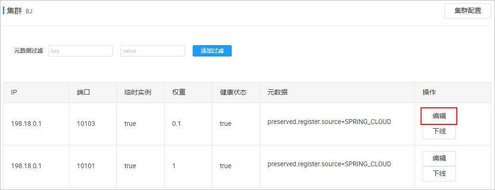 

权重取值范围：0~1


在配置文件中进行权重配置：

```yaml
spring:
  cloud:
    nacos:
      discovery:
        weight: 0.1
```

**注意**：如果权重修改为0，则该实例永远不会被访问

### 5.4.3 环境隔离

#### 环境隔离概述

在实际的开发过程中，可能会存在很多个软件环境：开发环境、测试环境、生产环境。

nacos也是支持多环境隔离配置的，在nacos是通过**namespace**来实现多环境的隔离。

完整的服务注册数据存储结构如下所示：

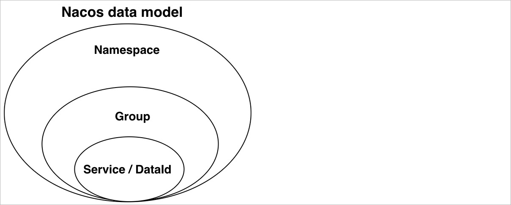 

namespace + group 才可以确定具体的微服务实例。默认情况下，所有service、group都在同一个namespace，名为public。如下所示：

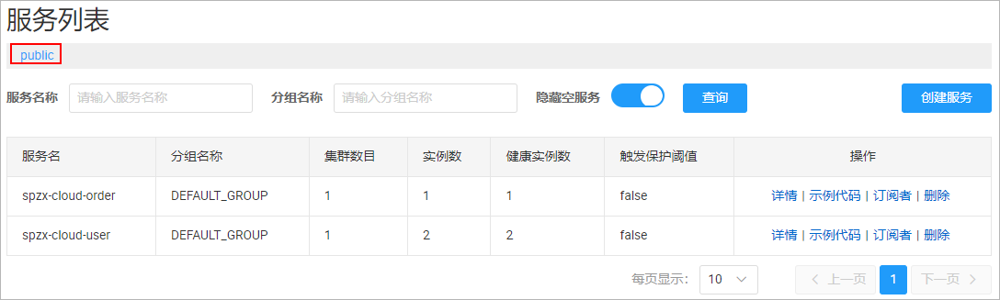 

#### 创建名称空间

我们也可以创建新的名称空间，来将不同的服务隔离到不同的环境下面，如下所示：

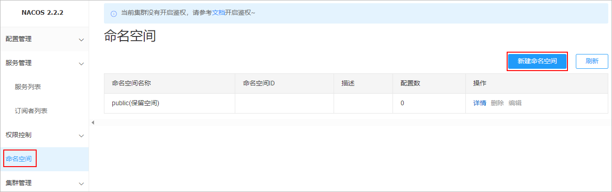 

#### 微服务配置名称空间

给微服务添加名称空间的配置，来指定该微服务所属环境。

例如，修改spzx-cloud-order的application.yml文件：

```yaml
spring:
  # 配置nacos注册中心的地址
  cloud:
    nacos:
      discovery:
        namespace: 4a88035e-acf3-45a9-924f-2421acbff67a  # 配置服务实例所属名称空间
```

此时order微服务所对应的服务实例就属于新的名称空间，user微服务所对应的服务实例属于public的名称空间，那么此时在进行远程调用的时候，就

会出现如下的错误：

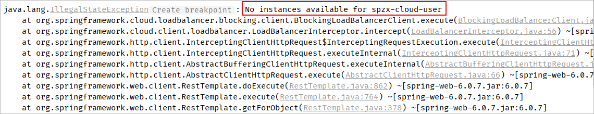 

### 5.4.4 实例类型

Nacos中的服务实例存在两种类型：

1、临时实例：如果实例宕机超过一定时间，会从服务列表剔除，并且实例会定时上报自身的健康状态给Nacos注册中心，默认的类型。

2、非临时实例：如果实例宕机，不会从服务列表剔除，Nacos注册中心会主动询问实例的健康状态，也可以叫永久实例。

配置一个服务实例为永久实例：

```yaml
spring:
  cloud:
    nacos:
      discovery:
        ephemeral: false  # 配置该实例为非临时实例
```

# 6 LoadBalancer

## 6.1 LoadBalancer简介

Spring Cloud LoadBalancer是Spring Cloud中负责客户端负载均衡的模块，其主要原理是通过选择合适的服务实例来实现负载均衡。

客户端负载均衡：就是负载均衡算法由客户端提供

如下图所示：

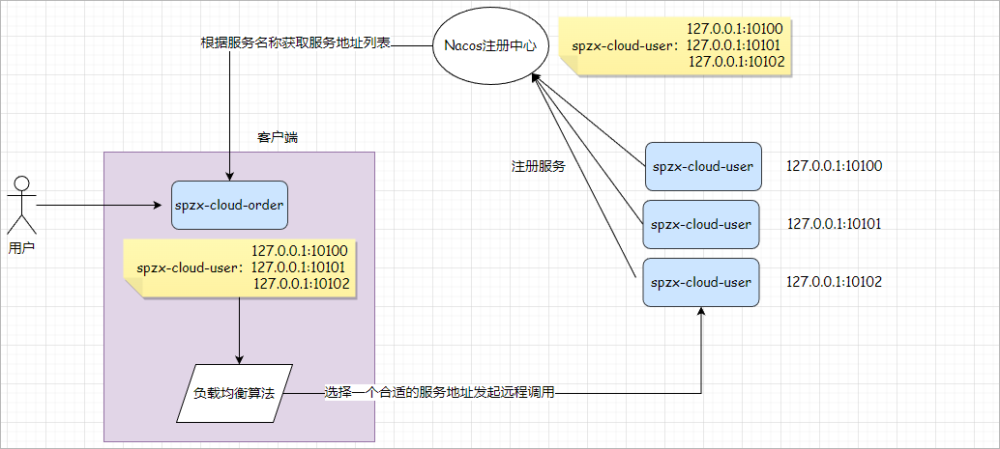 

注意：Spring Cloud LoadBalancer的使用在《5.3.3更改远程调用方案二》中已经讲解过了，本章节主要来介绍一下Spring Cloud LoadBalancer其他的

一些高级知识点。

## 6.2 LoadBalancer原理

Spring Cloud LoadBalancer的底层采用了一个拦截器【LoadBalancerInterceptor】，拦截了RestTemplate发出的请求，对地址做了修改。用一幅图

来总结一下：

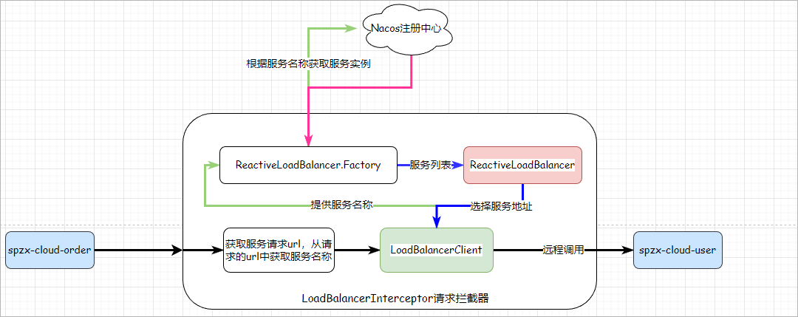 

执行流程说明：

1、通过LoadBalancerInterceptor请求拦截器拦截我们的RestTemplate请求：http://spzx-cloud-user/api/user/findUserByUserId/1

2、获取请求的url，然后从请求的url中获取服务提供方的主机名称

3、然后调用LoadBalancerClient中的execute方法，将服务提供方的名称传递过去

4、在LoadBalancerClient的choose方法中通过ReactiveLoadBalancer.Factory从Nacos注册中心中获取服务列表以及负载均衡算法实例对象

5、通过ReactiveLoadBalancer从服务列表中选择一个服务实例地址，然后发起远程调用

## 6.3 源码跟踪

> LoadBalancerInterceptor

核心源码如下所示：

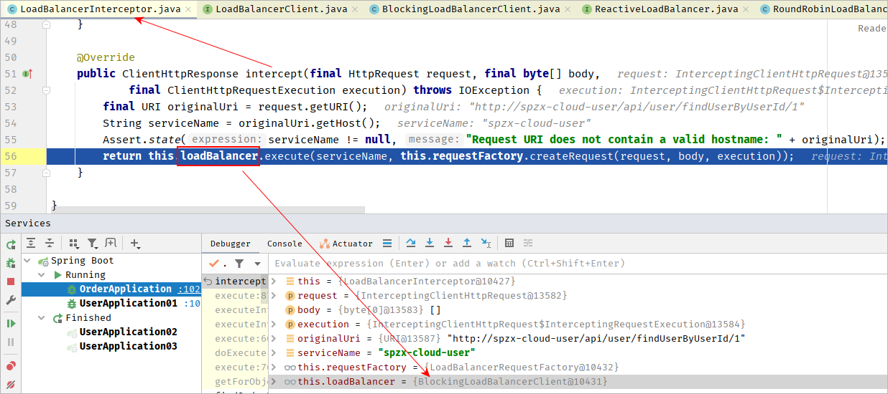 

可以看到这里的intercept方法，拦截了用户的HttpRequest请求，然后做了几件事：

1、`request.getURI()`：获取请求uri，本例中就是 http://spzx-cloud-user/api/user/findUserByUserId/1

2、`originalUri.getHost()`：获取uri路径的主机名，其实就是服务id，`spzx-cloud-user`

3、`this.loadBalancer.execute()`：处理服务id，和用户请求。

这里的`this.loadBalancer`是`BlockingLoadBalancerClient`类型，我们继续跟入。

> BlockingLoadBalancerClient

核心源码如下所示：

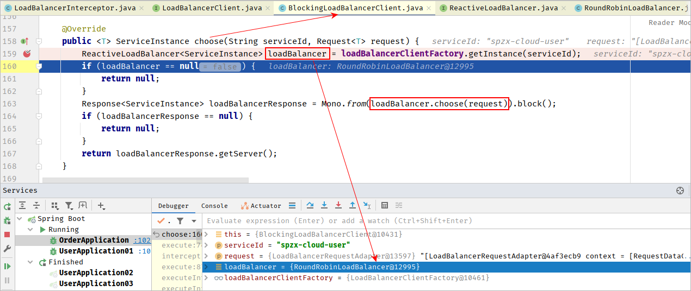  

ReactiveLoadBalancer.Factory的getInstance方法做了两件事情：

1、获取了一个具体的负载均衡算法对象

2、根据服务的id从Nacos注册中心中获取服务地址列表

紧跟着调用了RoundRobinLoadBalancer#choose方法，从服务列表中选择一个服务实例对象。

默认的负载均衡算法：RoundRobinLoadBalancer

## 6.4 更改负载均衡算法

LoadBalancer默认的负载均衡算法是RoundRobinLoadBalancer，如果想更改默认的负载均衡算法，那么此时需要向Spring容器中注册一个Bean，并且

配置负载均衡的使用者。

代码如下所示：

1、在Spring容器中注册一个Bean

```java
public class CustomLoadBalancerConfiguration {

    /**
     * @param environment: 用于获取环境属性配置，其中LoadBalancerClientFactory.PROPERTY_NAME表示该负载均衡器要应用的服务名称。
     * @param loadBalancerClientFactory: 是Spring Cloud中用于创建负载均衡器的工厂类，通过getLazyProvider方法获取ServiceInstanceListSupplier对象，以提供可用的服务列表。
     * ServiceInstanceListSupplier：用于提供ServiceInstance列表的接口，可以从DiscoveryClient或者其他注册中心中获取可用的服务实例列表。
     * @return
     */
    @Bean
    ReactorLoadBalancer<ServiceInstance> randomLoadBalancer(Environment environment, LoadBalancerClientFactory loadBalancerClientFactory) {
        String name = environment.getProperty(LoadBalancerClientFactory.PROPERTY_NAME);
        return new RandomLoadBalancer(loadBalancerClientFactory.getLazyProvider(name, ServiceInstanceListSupplier.class), name);
    }
}
```

2、配置负载均衡算法的使用者

```java
@Configuration
@LoadBalancerClients(value = {
        @LoadBalancerClient(name = "spzx-cloud-user" , configuration = CustomLoadBalancerConfiguration.class)      // 将负载均衡算法应用到指定的服务提供方中
})
public class RestTemplateConfiguration {

    @Bean
    @LoadBalanced       // 让RestTemplate具有负载均衡的能力
    public RestTemplate restTemplate() {
        return new RestTemplate() ;
    }

}
```

# 7 OpenFeign组件

## 7.1 OpenFeign简介

概述：feign是一个声明式的http客户端，官方地址：https://github.com/OpenFeign/feign其作用就是帮助我们优雅的实现http请求的发送。


使用RestTemplate进行远程调用代码回顾： 

 

存在的弊端：参数传递不太方便

## 7.2 OpenFeign入门

OpenFeign的使用步骤如下：

1、我们在spzx-cloud-order服务的pom文件中引入OpenFeign的依赖

```xml
<!-- 加入OpenFeign的依赖 -->
<dependency>
    <groupId>org.springframework.cloud</groupId>
    <artifactId>spring-cloud-starter-openfeign</artifactId>
</dependency>
```

2、在启动类上添加**@EnableFeignClients**开启OpenFeign的功能支持

3、编写OpenFeign的客户端

```java
@FeignClient(value = "spzx-cloud-user")		// 声明当前接口是一个访问user-service的feign的客户端
public interface UserFeignClient {

    @GetMapping("/api/user/findUserByUserId/{userId}")
    public abstract User queryById(@PathVariable("userId") Long userId) ;	// 根据userId查询用户信息的接口方法

}
```

这个客户端主要是基于SpringMVC的注解来声明远程调用的信息，比如：

① 请求方式：GET

② 请求路径：/api/user/findUserByUserId/{userId}

③ 请求参数：Long userId

④ 返回值类型：User

这样，Feign就可以帮助我们发送http请求，无需自己使用RestTemplate来发送了。

4、修改OrderService中的远程调用代码，使用Feign客户端代替RestTemplate：

```java
@Service
public class OrderServiceImpl implements OrderService {

    @Autowired
    private OrderMapper orderMapper ;

    @Autowired
    private UserFeignClient userFeignClient ;

    @Override
    public Order findOrderByOrderId(Long orderId) {
        Order order = orderMapper.findOrderByOrderId(orderId);

		// 远程调用
        User user = userFeignClient.queryById(order.getUserId());
        order.setUser(user);
        return order ;
    }
}
```

## 7.3 OpenFeign自定义配置

### 7.3.1 日志配置

OpenFeign可以支持很多的自定义配置，如下表所示：

| 类型                   | 作用             | 说明                                                   |
| ---------------------- | ---------------- | ------------------------------------------------------ |
| **feign.Logger.Level** | 修改日志级别     | 包含四种不同的级别：NONE、BASIC、HEADERS、FULL         |
| feign.codec.Decoder    | 响应结果的解析器 | http远程调用的结果做解析，例如解析json字符串为java对象 |
| feign.codec.Encoder    | 请求参数编码     | 将请求参数编码，便于通过http请求发送                   |
| feign.Contract         | 支持的注解格式   | 默认是SpringMVC的注解                                  |
| feign.Retryer          | 失败重试机制     | 请求失败的重试机制，默认是没有，不过会使用Ribbon的重试 |

一般情况下，默认值就能满足我们使用，如果要自定义时，只需要创建自定义的@Bean覆盖默认Bean即可。


下面以日志为例来演示如何自定义配置，支持两种方式的配置：

> ##### 基于配置文件的方式

基于配置文件修改feign的日志级别可以针对单个服务：

```yaml
# 将feign包下产生的日志的级别设置为debug
logging:
  level:
    com.atguigu.spzx.cloud.order.feign: debug
    
# openfeign日志级别配置
spring:
  cloud:
    openfeign:
      client:
        config: 
          spzx-cloud-user:  
            loggerLevel: full
```

也可以针对所有服务：

```yaml
# openfeign日志级别配置
spring:
  cloud:
    openfeign:
      client:
        config: 
          default:  # 这里用default就是全局配置，如果是写服务名称，则是针对某个微服务的配置
            loggerLevel: full
```

而日志的级别分为四种：

① NONE：不记录任何日志信息，这是默认值。

② BASIC：仅记录请求的方法，URL以及响应状态码和执行时间

③ HEADERS：在BASIC的基础上，额外记录了请求和响应的头信息

④ FULL：记录所有请求和响应的明细，包括头信息、请求体、元数据。

> ##### Java代码的方式

也可以基于Java代码来修改日志级别，先声明一个类，然后声明一个Logger.Level的对象：

```java
public class DefaultFeignConfiguration  {
    @Bean
    public Logger.Level feignLogLevel(){
        return Logger.Level.BASIC; // 日志级别为BASIC
    }
}
```

如果要**全局生效**，将其放到启动类的@EnableFeignClients这个注解中：

```java
@EnableFeignClients(defaultConfiguration = DefaultFeignConfiguration .class) 
```

如果是**局部生效**，则把它放到对应的@FeignClient这个注解中：

```java
@FeignClient(value = "spzx-cloud-user", configuration = DefaultFeignConfiguration .class) 
```

### 7.3.2 超时配置

**超时机制概述**：Feign 的超时机制是指在使用 Feign 进行服务间的 HTTP 调用时，设置请求的超时时间。当请求超过设定的超时时间后，Feign 将会

中断该请求并抛出相应的异常。

**超时机制的意义**：

1、防止长时间等待：通过设置适当的超时时间，可以避免客户端在请求服务时长时间等待响应而导致的性能问题。如果没有超时机制，客户端可能会

一直等待，从而影响整个系统的吞吐量和响应时间。

2、避免资源浪费：超时机制可以帮助及时释放占用的资源，例如连接、线程等。如果请求一直处于等待状态而不超时，将导致资源的浪费和系统的负

载增加。

3、优化用户体验：超时机制可以防止用户长时间等待无响应的情况发生，提供更好的用户体验。当请求超时时，可以及时给出错误提示或进行相应的

处理，以提醒用户或采取其他措施。


feign默认的超时配置为：

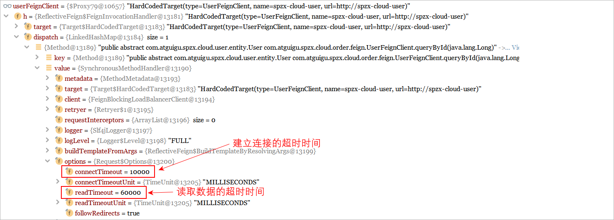 

超时时间越长，资源浪费的时间就越长，系统的稳定性就越差，因此需要设置为一个较为合理的超时时间，设置防止如下所示：

```yaml
spring:
  cloud:
    openfeign:
      client:
        config:
          default:
            loggerLevel: full	
            read-timeout: 2000			# 读取数据的超时时间设置为2s
            connect-timeout: 2000		# 简历连接的超时时间设置为2s
```

### 7.3.2 重试配置

feign一旦请求超时了，那么此时就会直接抛出**SocketTimeoutException**: Read timed out的异常。请求超时的原因有很多种，如网络抖动、服务不

可用等。如果由于网络暂时不可用导致触发了超时机制，那么此时直接返回异常信息就并不是特别的合理，尤其针对查询请求，肯定希望得到一个结

果。合理的做法：**触发超时以后，让feign进行重试**。


具体步骤：

1、自定义重试器

```java
public class FeignClientRetryer implements Retryer {

    // 定义两个成员变量来决定重试次数
    private int start = 1 ;
    private int end = 3 ;

    @Override
    public void continueOrPropagate(RetryableException e) {     // 是否需要进行重试取决于该方法是否抛出异常，如果抛出异常重试结束
        if(start >= end) {
            throw new RuntimeException(e) ;
        }
        start++ ;
    }

    @Override
    public Retryer clone() {    // 框架底层调用该方法得到一个重试器
        return new FeignClientRetryer();
    }
}
```

2、配置重试器

```yaml
spring:
  cloud:
    openfeign:
      client:
        config:
          default:
            loggerLevel: full
            read-timeout: 2000
            connect-timeout: 2000
            retryer: com.atguigu.spzx.cloud.order.feign.FeignClientRetryer		# 配置自定义重试器
```

## 7.4 代码优化

上述代码存在的弊端：每一个服务消费方要调用服务提供方，都是需要去定义一个Feign的接口，不利于后期代码维护

在实际的工作过程中，都是将Feign的接口抽取到一个独立的模块中，并且会将数据库所对应的实体类也抽取到一个独立的模块中，供其他的模块进行

使用。

例如，将UserFeginClient、Feign的默认配置都抽取到一个spzx-feign-api包中，Order、User实体类抽取到一个独立的模块中，其他的微服务引用该

依赖包，即可直接使用。

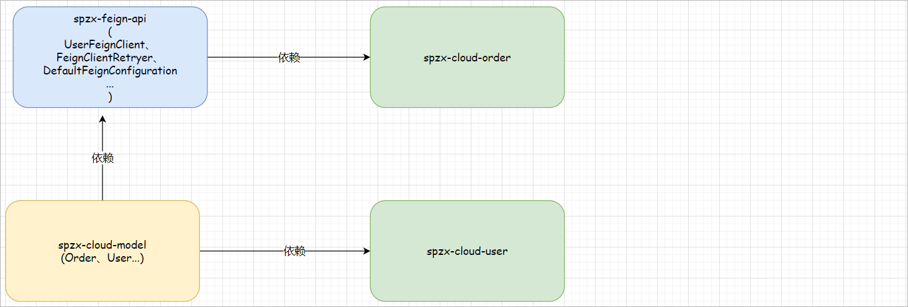 

代码实现：

1、定义一个新的模块spzx-cloud-model，并加入如下的依赖

```xml
<!-- lombok依赖，快速生成getter和setter方法 -->
<dependency>
    <groupId>org.projectlombok</groupId>
    <artifactId>lombok</artifactId>
</dependency>
```

2、将spzx-cloud-order微服务和spzx-cloud-user微服务中所对应的实体类抽取到spzx-cloud-model

3、删除spzx-cloud-order微服务和spzx-cloud-user微服务中所定义的实体类

4、在spzx-cloud-user微服务中加入如下依赖

```xml
<dependency>
    <groupId>com.atguigu.springcloud</groupId>
    <artifactId>spzx-cloud-model</artifactId>
    <version>1.0-SNAPSHOT</version>
</dependency>
```

5、定义一个新的模块spzx-feign-api，加入如下依赖

```xml
<!-- 加入fegin的依赖 -->
<dependency>
    <groupId>org.springframework.cloud</groupId>
    <artifactId>spring-cloud-starter-openfeign</artifactId>
</dependency>

<!-- 实体类所对应的依赖 -->
<dependency>
    <groupId>com.atguigu.springcloud</groupId>
    <artifactId>spzx-cloud-model</artifactId>
    <version>1.0-SNAPSHOT</version>
</dependency>
```

6、将spzx-cloud-order中中编写的UserFeginClient、DefaultFeignConfiguration、DefaultFeignConfiguration都复制到spzx-feign-api项目中

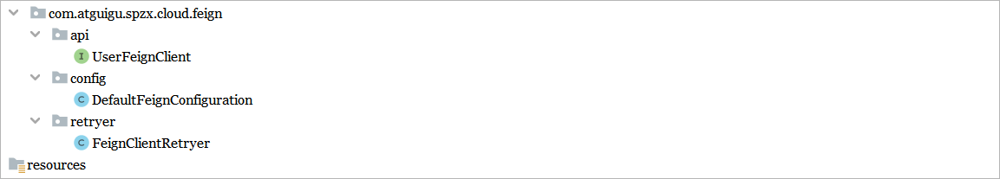 

7、spzx-cloud-order微服务引入spzx-feign-api依赖，并且在启动类上添加feign接口的包扫描路径

```java
@SpringBootApplication
@EnableFeignClients(basePackages = {
        "com.atguigu.spzx.cloud.feign.api"
})
public class OrderApplication {

    public static void main(String[] args) {
        SpringApplication.run(OrderApplication.class , args) ;
    }

}
```

