# 1 Gateway组件

## 1.1 Gateway简介

Gateway服务网关组件是我们服务的守门神，所有微服务的统一入口。

网关的**核心功能特性**：

1、请求路由

2、权限控制

3、流量监控

4、统一日志处理

架构图：

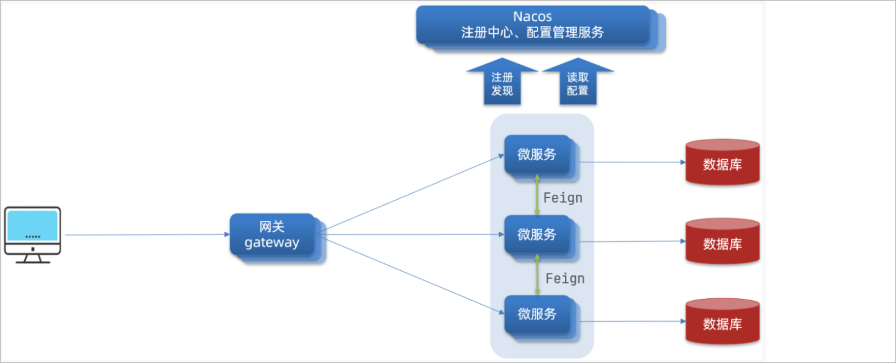 

**权限控制**：网关作为微服务入口，需要校验用户是是否有请求资格，如果没有则进行拦截。

**路由和负载均衡**：一切请求都必须先经过Gateway，但网关不处理业务，而是根据某种规则，把请求转发到某个微服务，这个过程叫做路由。当然路

由的目标服务有多个时，还需要做负载均衡。

**限流**：当请求流量过高时，在网关中按照下流的微服务能够接受的速度来放行请求，避免服务压力过大。


在SpringCloud中网关的实现包括两种：

1、Gateway

2、Zuul

Zuul是基于Servlet的实现，属于阻塞式编程。而Spring Cloud Gateway则是基于Spring5中提供的WebFlux，属于响应式编程的实现，具备更好的性

能。

## 1.2 Gateway入门

下面，我们就演示下网关的基本路由功能。

基本步骤如下：

1、创建一个spring boot项目作为gateway，引入如下依赖

```xml
<!--网关-->
<dependency>
    <groupId>org.springframework.cloud</groupId>
    <artifactId>spring-cloud-starter-gateway</artifactId>
</dependency>

<!--nacos服务发现依赖-->
<dependency>
    <groupId>com.alibaba.cloud</groupId>
    <artifactId>spring-cloud-starter-alibaba-nacos-discovery</artifactId>
</dependency>

<!-- 负载均衡组件 -->
<dependency>
    <groupId>org.springframework.cloud</groupId>
    <artifactId>spring-cloud-loadbalancer</artifactId>
</dependency>
```

2、编写启动类

```java 
// com.atguigu.spzx.cloud.gateway
@SpringBootApplication
public class GatewayApplication {

	public static void main(String[] args) {
		SpringApplication.run(GatewayApplication.class, args);
	}
}
```

3、在application.yml配置文件中编写基础配置和路由规则

```yaml
server:
  port: 80
spring:
  application:
    name: spzx-cloud-gateway
  cloud:
    nacos:
      discovery:
        server-addr: 192.168.136.142:8848
    gateway:
      routes:
        - id: spzx-cloud-user				# 路由id，可以自定义，只要唯一即可
          uri: lb://spzx-cloud-user		    # 路由的目标地址 lb就是负载均衡，后面跟服务名称
          predicates:
            - Path=/api/user/**			    # 这个是按照路径匹配，只要以/user/开头就符合要求
```

4、重启测试

重启网关，访问http://localhost/api/user/findUserByUserId/1时，符合`/api/user/**`规则，

请求转发到uri：http://spzx-cloud-user/api/user/findUserByUserId/1，得到了结果：

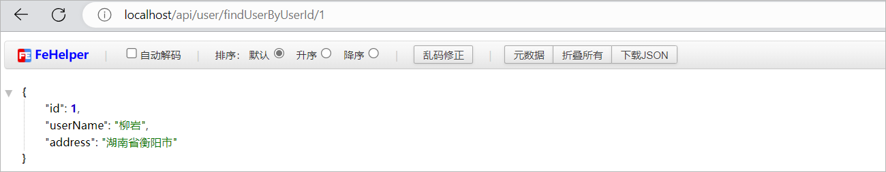 

## 1.3 网关路由流程图

整体访问流程如下所示：

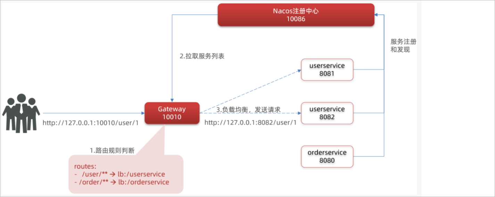 

## 1.4 路由工厂

思考问题：我们在配置文件中只是配置了一个访问路径的规则，怎么就可以实现路由呢?

底层原理：框架底层会自动读取配置文件中的内容，然后通过制定的路由工厂将其转换成对应的判断条件，然后进行判断。

在Gateway中提供了很多的路由工厂如下所示：https://docs.spring.io/spring-cloud-gateway/docs/4.0.6/reference/html/#gateway-request-predicates-factories

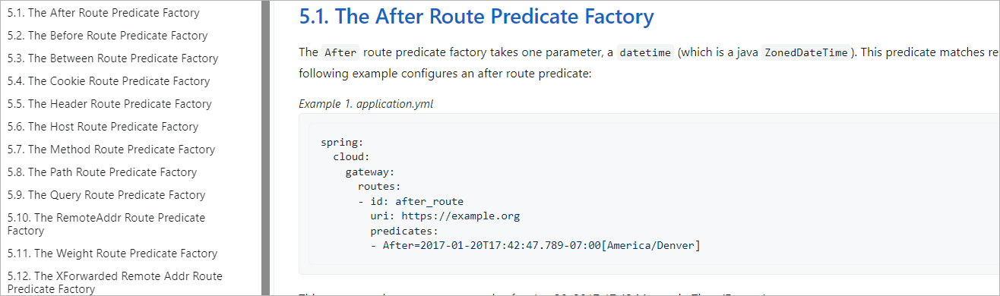 

大致有12个，每一种路由工厂的使用Spring Cloud的官网都给出了具体的示例代码，我们可以参考示例代码进行使用。以After Route Predicate 

Factory路由工厂举例，如下所示：

```yaml
spring:
  cloud:
    gateway:
      routes:
        - id: spzx-cloud-user
          uri: lb://spzx-cloud-user
          predicates:
            - Path=/api/user/**
            - After=2017-01-20T17:42:47.789-07:00[America/Denver]  # 系统时间在2017-01-20之后才可以进行访问
```

## 1.5 过滤器

### 1.5.1 过滤器简介

在gateway中要实现其他的功能：权限控制、流量监控、统一日志处理等。就需要使用到gateway中所提供的过滤器了。过滤器，可以对进入网关的请

求和微服务返回的响应做处理：

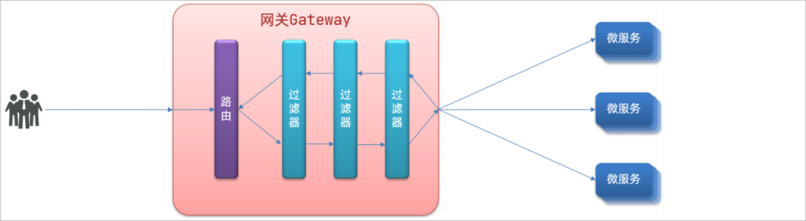 

### 1.5.2 内置过滤器

spring gateway提供了31种不同的过滤器。

官网地址：https://docs.spring.io/spring-cloud-gateway/docs/2.2.9.RELEASE/reference/html/#gatewayfilter-factories

例如：

| **名称**             | **说明**                     |
| -------------------- | ---------------------------- |
| AddRequestHeader     | 给当前请求添加一个请求头     |
| RemoveRequestHeader  | 移除请求中的一个请求头       |
| AddResponseHeader    | 给响应结果中添加一个响应头   |
| RemoveResponseHeader | 从响应结果中移除有一个响应头 |
| RequestRateLimiter   | 限制请求的流量               |

在Gateway中提供了三种级别的类型的过滤器：

1、路由过滤器：只针对当前路由有效

2、默认过滤器：针对所有的路由都有效

3、全局过滤器：针对所有的路由都有效，需要进行自定义

### 1.5.3 路由过滤器

需求：给所有进入spzx-cloud-user的请求添加一个请求头：Truth=atguigu

实现：

1、修改gateway服务的application.yml文件，添加路由过滤

```yaml
spring:
  cloud:
    gateway:
      routes:
        - id: spzx-cloud-user
          uri: lb://spzx-cloud-user
          predicates:
            - Path=/api/user/**
          filters:
            - AddRequestHeader=Truth, atguigu		# 配置路由基本的过滤器，给访问user微服务的所有接口添加Truth请求头
```

当前过滤器写在spzx-cloud-user路由下，因此仅仅对访问spzx-cloud-user的请求有效。

2、在spzx-cloud-user的接口方法中读取请求头数据，进行测试

```java
@GetMapping(value = "/findUserByUserId/{userId}")
public User findUserByUserId(@PathVariable(value = "userId") Long userId , @RequestHeader(name = "Truth")String header) {
    log.info("UserController...findUserByUserId方法执行了... ,header: {} " , header);
    return userService.findUserByUserId(userId) ;
}
```

### 1.5.4 默认过滤器

如果要对所有的路由都生效，则可以将过滤器工厂写到default下。格式如下：

```yml
spring:
  cloud:
    gateway:
      routes:
        - id: spzx-cloud-user
          uri: lb://spzx-cloud-user
          predicates:
            - Path=/api/user/**
            - After=2017-01-20T17:42:47.789-07:00[America/Denver]
      default-filters:
        - AddRequestHeader=Truth, atguigu is good
```

### 1.5.5 全局过滤器

上述的过滤器是gateway中提供的默认的过滤器，每一个过滤器的功能都是固定的。但是如果我们希望拦截请求，做自己的业务逻辑，默认的过滤器就

没办法实现。


此时就需求使用全局过滤器，全局过滤器的作用也是处理一切进入网关的请求和微服务响应，与GatewayFilter的作用一样。区别在于GatewayFilter

通过配置定义，处理逻辑是固定的；而GlobalFilter的逻辑需要自己写代码实现。


需求：定义全局过滤器，拦截请求，判断请求的参数是否满足下面条件：

1、请求参数中是否有authorization

2、authorization参数值是否为admin

如果同时满足则放行，否则拦截


步骤：

1、定义一个类实现GlobalFilter接口

2、重写filter方法

3、将该类纳入到spring容器中

4、实现Ordered接口定义该过滤器的顺序


代码：

```java
@Component
public class AuthorizationFilter implements GlobalFilter , Ordered {

    @Override
    public Mono<Void> filter(ServerWebExchange exchange, GatewayFilterChain chain) {

        // 1、获取请求参数
        MultiValueMap<String, String> params = exchange.getRequest().getQueryParams();

        // 2、判断是否包含authorization
        String authorization = params.getFirst("authorization");
        if(authorization == null || "".equals(authorization)) {
            exchange.getResponse().setStatusCode(HttpStatus.UNAUTHORIZED) ;            // 设置一个响应状态码401
            return exchange.getResponse().setComplete() ;                                 // 结束请求
        }

        // 3、校验请求参数的值是否为admin，如果是放行，如果不是拦截
        if(!"admin".equals(authorization)) {
            exchange.getResponse().setStatusCode(HttpStatus.UNAUTHORIZED) ;            // 设置一个响应状态码401
            return exchange.getResponse().setComplete() ;                                 // 结束请求
        }

        // 放行
        return chain.filter(exchange);
    }
    
    @Override
    public int getOrder() {
        return -1;
    }

}
```

### 1.5.6 过滤器执行顺序

请求进入网关会碰到三类过滤器：当前路由的过滤器、DefaultFilter、GlobalFilter

请求路由后，会将当前路由过滤器和DefaultFilter、GlobalFilter，合并到一个过滤器链（集合）中，排序后依次执行每个过滤器：

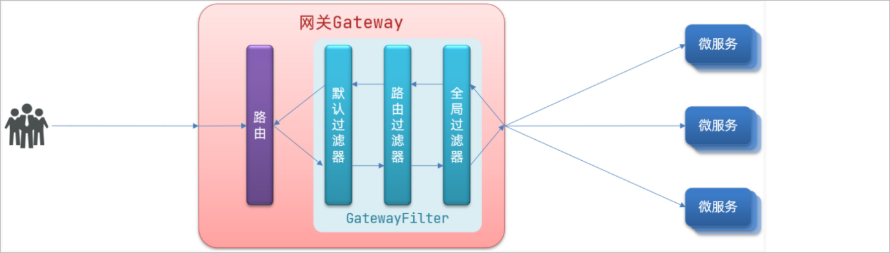 

排序的规则是什么呢？

1、按照order的值进行排序，order的值越小，优先级越高，执行顺序越靠前。

2、路由过滤器和默认过滤器会按照order的值进行排序，这个值由spring进行指定，默认是按照声明顺序从1递增

3、当过滤器的order值一样时，会按照 globalFilter > defaultFilter > 路由过滤器的顺序执行


核心源码分析：org.springframework.cloud.gateway.handler.FilteringWebHandler#handle方法会加载全局过滤器，与前面的过滤器合并后根据

order排序，组织过滤器链

```java
public Mono<Void> handle(ServerWebExchange exchange) {
    Route route = (Route)exchange.getRequiredAttribute(ServerWebExchangeUtils.GATEWAY_ROUTE_ATTR);
    
    // 获取路由级别的过滤器和默认过滤器的集合
    List<GatewayFilter> gatewayFilters = route.getFilters();
    
    // 获取全局过滤器的集合
    List<GatewayFilter> combined = new ArrayList(this.globalFilters);
    
    // 将取路由级别的过滤器和默认过滤器的集合中的元素添加到全局过滤器的集合中
    combined.addAll(gatewayFilters);
    
    // 进行排序
    AnnotationAwareOrderComparator.sort(combined);
    if (logger.isDebugEnabled()) {
        logger.debug("Sorted gatewayFilterFactories: " + combined);
    }

    // 调用过滤器链中的filter方法
    return (new DefaultGatewayFilterChain(combined)).filter(exchange);
}
```

# 2 Nacos配置中心

Nacos除了可以做注册中心，同样可以做配置管理来使用。

## 2.1 统一配置管理

当微服务部署的实例越来越多，达到数十、数百时，逐个修改微服务配置就会让人抓狂，而且很容易出错。我们需要一种统一配置管理方案，可以集中

管理所有实例的配置。

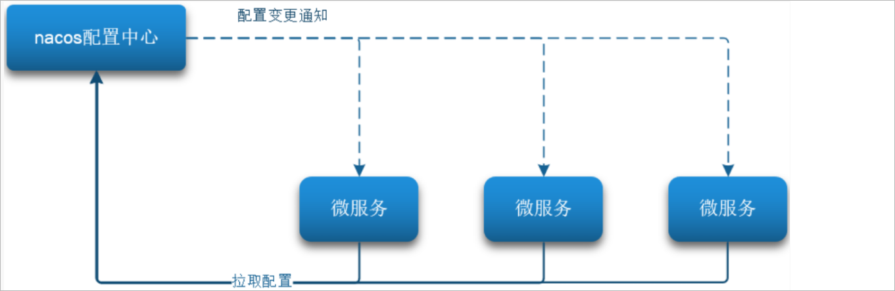 

nacos一方面可以将配置集中管理，另一方可以在配置变更时，及时通知微服务，实现配置的热更新。

## 2.2 Nacos入门

### 2.2.1 Nacos中添加配置

在Nacos服务端创建一个配置，如下所示：

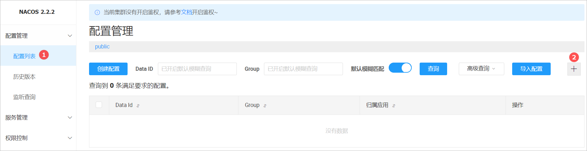 

然后在弹出的表单中，填写配置信息：


### 2.2.2 微服务集成配置中心

微服务需要进行改造，从Nacos配置中心中获取配置信息进行使用。

步骤：

1、在spzx-cloud-user微服务中，引入spring-cloud-starter-alibaba-nacos-config依赖

```xml
<!-- nacos作为配置中心时所对应的依赖 -->
<dependency>
    <groupId>com.alibaba.cloud</groupId>
    <artifactId>spring-cloud-starter-alibaba-nacos-config</artifactId>
</dependency>
```

2、在spzx-cloud-user项目的 /src/main/resources/application.yml 配置文件中配置 Nacos Config 地址并引入服务配置

```yml
# 配置数据库的连接信息
spring:
  cloud:
    nacos:
      config:
        server-addr: 192.168.136.142:8848
  config:
    import:
      - nacos:spzx-cloud-user-dev.yml
```

### 2.2.3 读取自定义配置

#### @Value

通过@Value注解读取自定义配置，如下所示：

```java
@RestController
@RequestMapping(value = "/api/user")
@Slf4j
public class UserController {

    @Autowired
    private UserService userService ;

    @Value("${pattern.dateformat}")
    private String pattern ;

    @GetMapping(value = "/findUserByUserId/{userId}")
    public User findUserByUserId(@PathVariable(value = "userId") Long userId , @RequestHeader(name = "Truth")String header) {
        log.info("UserController...findUserByUserId方法执行了... ,header: {} , dateformat: {} " , header , pattern);
        return userService.findUserByUserId(userId) ;
    }

}
```

#### @ConfigurationProperties

也可以通过实体类，配合@ConfigurationProperties注解读取自定义配置，代码如下所示：

1、定义一个实体类，代码如下所示：

```java
@Data
@ConfigurationProperties(prefix = "pattern")
public class PatternProperties {

    private String dateformat ;

}
```

2、在启动类上添加@EnableConfigurationProperties注解，如下所示：

```java
@SpringBootApplication
@EnableConfigurationProperties(value = { PatternProperties.class })
public class UserApplication {

    public static void main(String[] args) {
        SpringApplication.run(UserApplication.class , args) ;
    }

}
```

3、使用该实体类，代码如下所示：

```java
@RestController
@RequestMapping(value = "/api/user")
@Slf4j
public class UserController {

    @Autowired
    private UserService userService ;

    @Value("${pattern.dateformat}")
    private String pattern ;

    @Autowired   // 注入实体类
    private PatternProperties patternProperties ; 

    @GetMapping(value = "/findUserByUserId/{userId}")
    public User findUserByUserId(@PathVariable(value = "userId") Long userId , @RequestHeader(name = "Truth")String header) {
        log.info("UserController...findUserByUserId方法执行了... ,header: {} , dateformat: {} " , header , patternProperties.getDateformat());
        return userService.findUserByUserId(userId) ;
    }

}
```

## 2.3 配置热更新

我们最终的目的，是修改Nacos中的配置后，微服务中无需重启即可让配置生效，也就是**配置热更新**。实现配置的热更新有两种方式：

> 方式一：在@Value注入的变量所在类上添加注解**@RefreshScope**

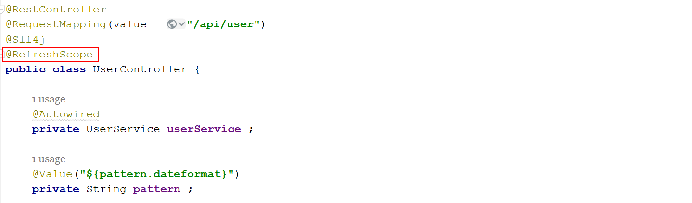 

> 方式二：通过实体类，配合@ConfigurationProperties注解读取配置信息，**自动**支持热更新

## 2.4 配置内容共享

如果多个环境存在相同的配置，那么此时就可以将相同的配置抽取到一个新的配置中，然后在微服务中再次导入新的配置。那么此时就实现了多环境

配置共享。

案例演示：

1、在Nacos上创建一个不带环境的配置

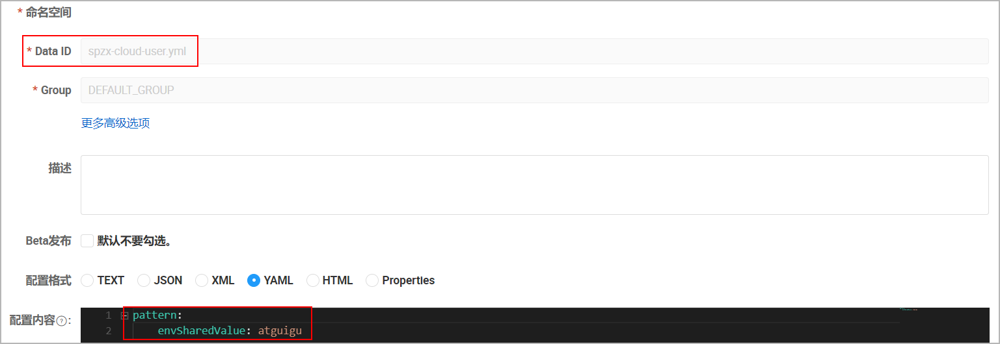 

2、微服务读取共享配置，在实体类中添加对应的属性

```java
@Data
@ConfigurationProperties(prefix = "pattern")
public class PatternProperties {

    private String dateformat ;
    private String envSharedValue ;		// 读取共享配置属性

}
```

3、在微服务的配置文件中，通过spring.config.import导入最新的配置

```yml
spring:
  config:
    import:
      - nacos:spzx-cloud-user-dev.yml
      - nacos:spzx-cloud-user.yml       # 导入共享配置
```

## 2.5 配置优先级

思考问题：如果在application.yml文件中和Nacos配置中心中都定义了相同的配置内容，那么哪一个配置的优先级较高呢?

优先级顺序：Nacos配置中心的配置(后导入的配置 > 先导入的配置) > application.yml

# 3 Sentinel组件

## 3.1 初识sentinel

### 3.1.1 雪崩效应

概述：在微服务系统架构中中，服务间调用关系错综复杂，一个微服务往往依赖于多个其它微服务。一个服务的不可用导致整个系统的不可用的现象就

被称之为雪崩效应。

如下图所示：

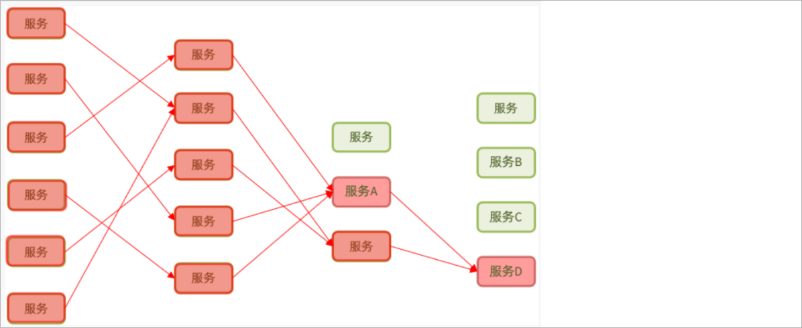 

当服务D出现了问题了以后，调用服务D的服务A的线程就得不到及时的释放，在高并发情况下，随着时间的不断推移服务A的系统资源会被线程耗尽，

最终导致服务A出现了问题，同理就会导致其他的服务也不能进行访问了。

### 3.1.2 解决方案

#### 超时处理

超时处理：设定超时时间，请求超过一定时间没有响应就返回错误信息，不会无休止等待

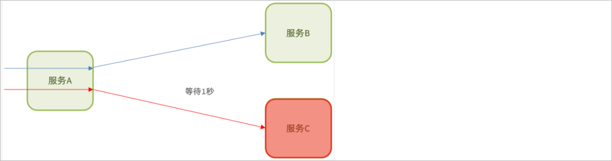 

#### 隔离处理

隔离处理：将错误隔离在可控的范围之内，不要让其影响到其他的程序的运行。

这种设计思想，来源于船舱的设计，如下图所示：

 

船舱都会被隔板分离为多个独立空间，当船体破损时，只会导致部分空间进入，将故障控制在一定范围内，避免整个船体都被淹没。于此类似，我们业

务系统也可以使用这种思想来防止出现雪崩效应，常见的隔离方式：线程隔离

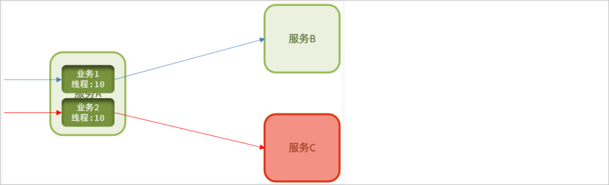 

#### 熔断处理

熔断处理：由**断路器**统计业务执行的异常比例，如果超出阈值则会**熔断**该业务，拦截访问该业务的一切请求。

断路器会统计访问某个服务的请求数量，异常比例如下所示：

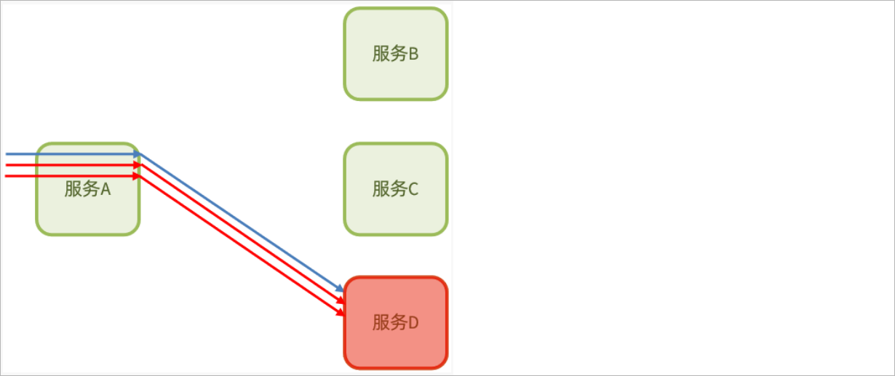 

请求了三次，两次出现异常，一次成功。当发现访问服务D的请求异常比例过高时，认为服务D有导致雪崩的风险，会拦截访问服务D的一切请求，形

成熔断：

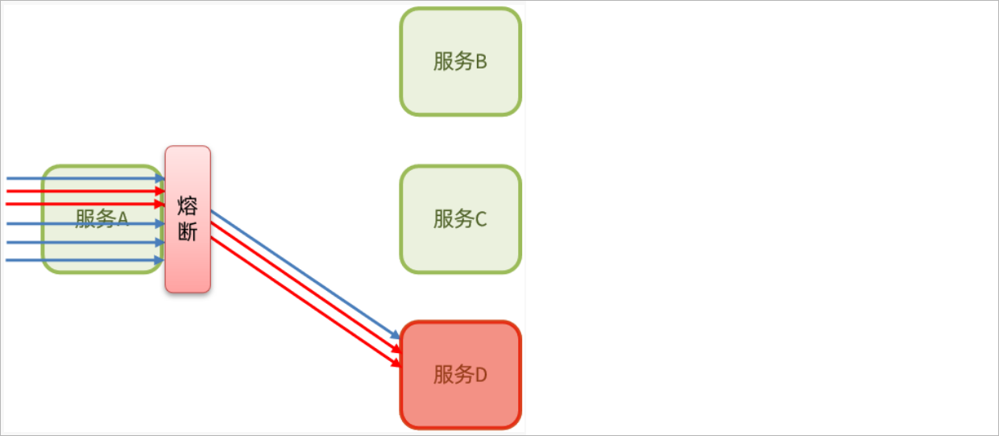 

触发熔断了以后，当在访问服务A的时候，就不会在通过服务A去访问服务D了，立马给用户进行返回，返回的是一种默认值，这种返回就是一种兜底

方案。这种兜底方案也将其称之为降级逻辑。

#### 流量控制

流量控制：限制业务访问的QPS(每秒的请求数)，避免服务因流量的突增而故障。 

 

限流是一种**预防**措施，避免因瞬间高并发流量而导致服务故障，进而避免雪崩。其他的处理方式是一种**补救**措施，在部分服务故障时，将故障控制在

一定范围，避免雪崩。

### 3.1.3 sentinel介绍

官网地址：https://sentinelguard.io/zh-cn/

 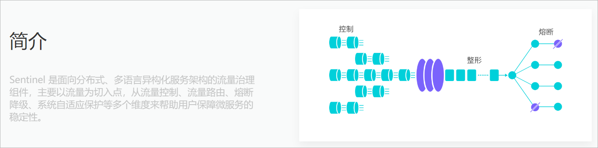 

具有的特征:

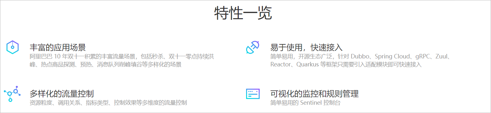 

## 3.2 sentinel入门

### 3.2.1 下载sentinel

sentinel管理后台下载地址：https://github.com/alibaba/Sentinel/releases

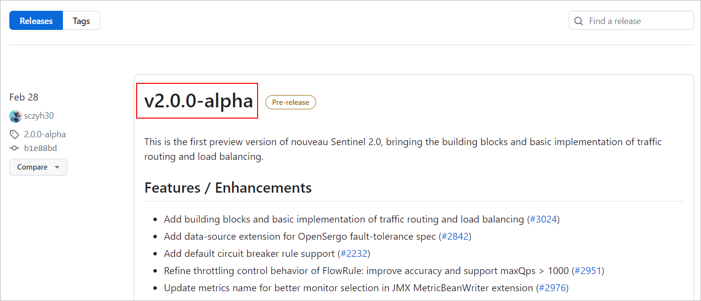 

下载完毕以后就会得到一个jar包

 

### 3.2.2 启动sentinel

将jar包放到任意非中文目录，执行命令：

```java
java -jar sentinel-dashboard-2.0.0-alpha-preview.jar
```

如果要修改Sentinel的默认端口、账户、密码，可以通过下列配置：

| **配置项**                       | **默认值** | **说明**   |
| -------------------------------- | ---------- | ---------- |
| server.port                      | 8080       | 服务端口   |
| sentinel.dashboard.auth.username | sentinel   | 默认用户名 |
| sentinel.dashboard.auth.password | sentinel   | 默认密码   |

例如，修改端口：

```sh
java -Dserver.port=8090 -jar sentinel-dashboard-2.0.0-alpha-preview.jar
```

### 3.2.3 访问sentinel

访问http://localhost:8080页面，就可以看到sentinel的控制台了：

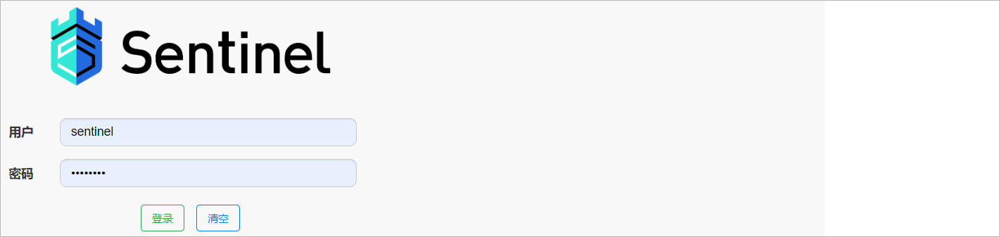 

需要输入账号和密码，默认都是：sentinel

登录后，发现一片空白，什么都没有：

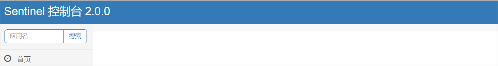 

这是因为我们还没有与微服务整合。

### 3.2.4 整合sentinel

我们在spzx-cloud-user中整合sentinel，并连接sentinel的控制台，步骤如下：

1、引入sentinel依赖

```xml
<!--sentinel-->
<dependency>
    <groupId>com.alibaba.cloud</groupId> 
    <artifactId>spring-cloud-starter-alibaba-sentinel</artifactId>
</dependency>
```

2、配置控制台

修改application.yaml文件，添加下面内容

```yml
spring:
  cloud:
    sentinel:
      transport:
        dashboard: localhost:8080  # 配置sentinel控制台地址
```

3、访问spzx-cloud-user的任意接口

打开浏览器，访问http://localhost:10100/api/user/findUserByUserId/1，这样才能触发sentinel的监控。然后再访问sentinel的控制台，查看效

果：

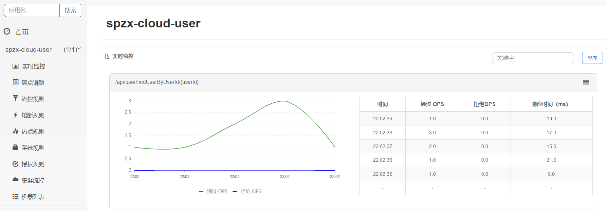 

## 3.3 流量控制

雪崩问题虽然有四种方案，但是限流是避免服务因突发的流量而发生故障，是对微服务雪崩问题的预防。我们先学习这种模式。

### 3.3.1 相关概念

**簇点链路**：当请求进入微服务时，首先会访问DispatcherServlet，然后进入Controller、Service、Mapper，这样的一个调用链就叫做簇点链路。

**资源**：簇点链路中被监控的每一个接口就是一个资源，流控、熔断等都是针对簇点链路中的资源来设置的。

默认情况下sentinel会监控spring mvc的每一个端点（Endpoint，也就是controller中的方法），因此spring mvc的每一个端点就是调用链路中的一个

资源。

例如，我们刚才访问的spzx-cloud-user中的UserController中的端点：/api/user/findUserByUserId/{userId}

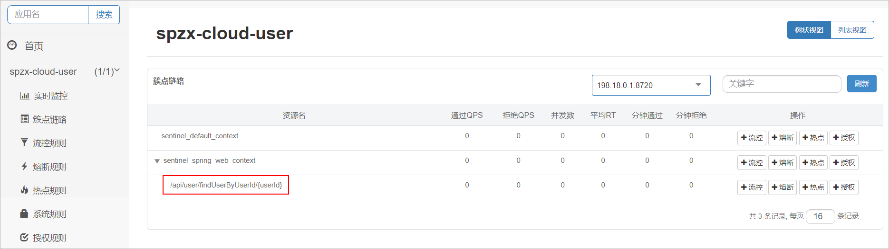 

我们可以点击对应资源后面的按钮来设置规则：

1、流控：流量控制

2、降级：降级熔断

3、热点：热点参数限流，是限流的一种

4、授权：请求的权限控制

### 3.3.2 快速入门

需求：给 /api/user/findUserByUserId/{userId}这个资源设置流控规则，QPS不能超过 5，然后测试。

步骤：

1、首先在sentinel控制台添加限流规则

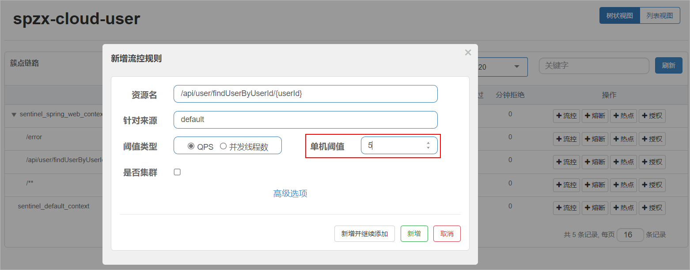 

2、利用jmeter测试(模拟并发请求)

> Apache JMeter 是 Apache 组织基于 Java 开发的压力测试工具，用于对软件做**压力测试**。
>
> 下载地址：https://archive.apache.org/dist/jmeter/binaries/

课前资料提供了编写好的Jmeter测试样例

 

通过如下命令打开jmeter

```shell
java -jar ApacheJMeter.jar
```

导入课前资料提供的测试样例

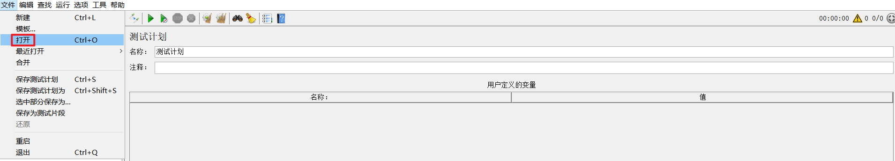

选择流控入门

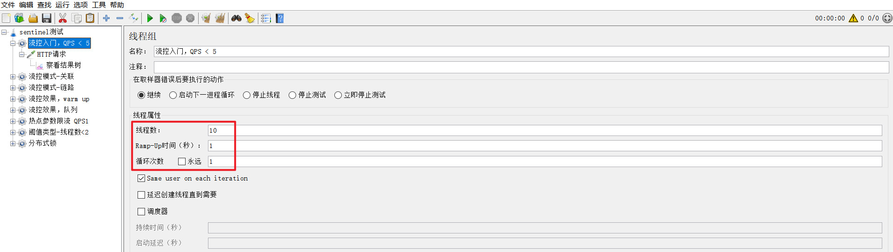

10个线程，1秒内运行完，QPS是10，超过了5。

选中**流控入门，QPS<5**右键运行

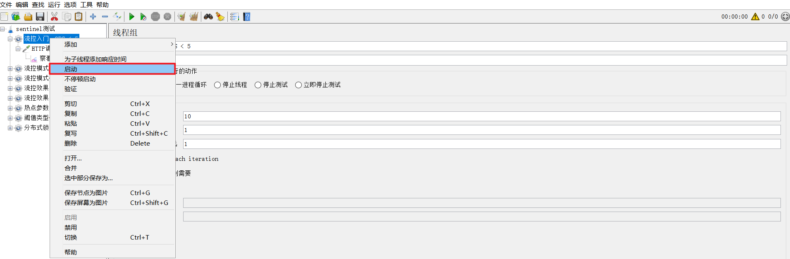

注意：不要点击菜单中的执行按钮来运行。

点击查看结果树，理想的请求执行结果应该如下所示：

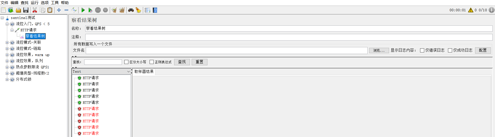

可以看到，成功的请求每次只有5个。

**注意：如果测试结果不是上述情况，那是因为sentinel在统计请求的时候，把一部分的请求统计到了下一秒中导致的。**

### 3.3.3 流控模式

#### 流控模式简介

在添加限流规则时，点击高级选项，可以选择三种**流控模式**：

1、直接：统计当前资源的请求，触发阈值时对当前资源直接限流，也是默认的模式

2、关联：统计与当前资源相关的另一个资源，触发阈值时，对当前资源限流

3、链路：统计从指定链路访问到本资源的请求，触发阈值时，对指定链路限流

如下所示：

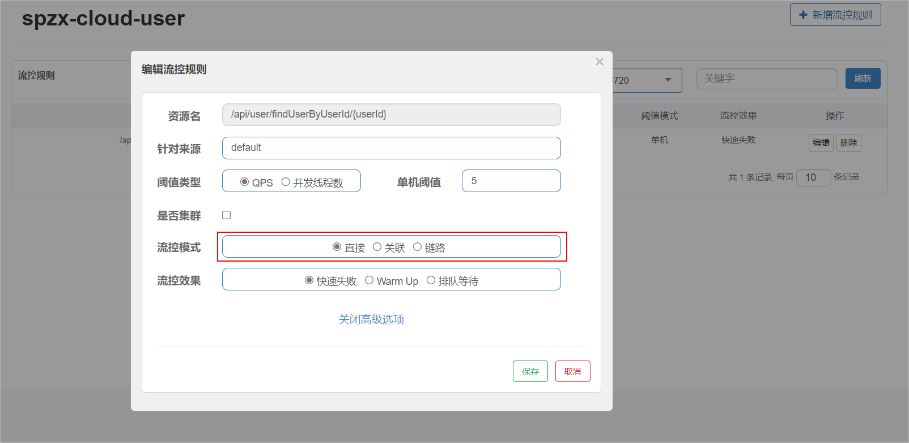 

快速入门测试的就是直接模式。

#### 关联模式

关联模式：统计与当前资源相关的另一个资源，触发阈值时，对当前资源限流

配置方式：

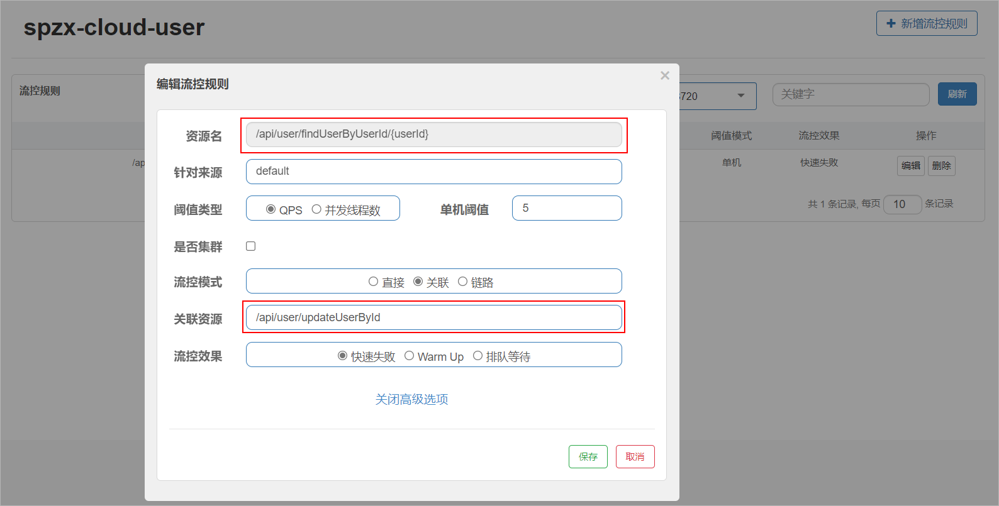 

语法说明：对/api/user/updateUserById资源的请求进行统计，当访问流量超过阈值时，就对/api/user/findUserByUserId/{userId}进行限流，避

免影响/api/user/updateUserById资源。

使用场景：比如用户支付时需要修改订单状态，同时用户要查询订单。查询和修改操作会争抢数据库锁，产生竞争。业务需求是优先支付和更新订单的

业务，因此当修改订单业务触发阈值时，需要对查询订单业务限流。


案例实现：

1、在UserController新建一个端点：/api/user/updateUserById，无需实现业务

```java
// 修改用户数据端点
@GetMapping(value = "/updateUserById")
public String updateUserById() {
    return "修改用户数据成功";
}
```

2、重启服务，访问对应的端点，让其产生簇点链路

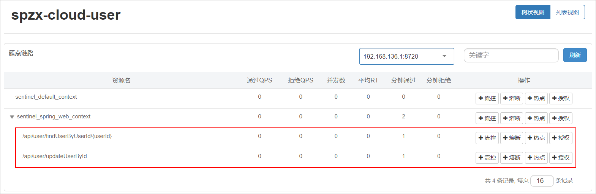 

3、配置流控规则，当/api/user/updateUserById资源被访问的QPS超过5时，对/api/user/findUserByUserId/1请求限流。对哪个端点限流，就点

击哪个端点后面的按钮。我们是对用户查询/api/user/findUserByUserId/1限流，因此点击它后面的按钮：

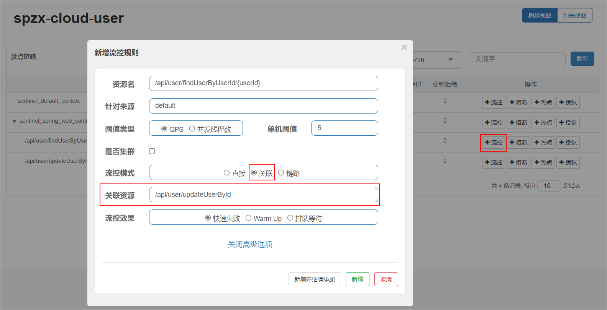 

4、在Jmeter中进行测试

选择《流控模式-关联》：

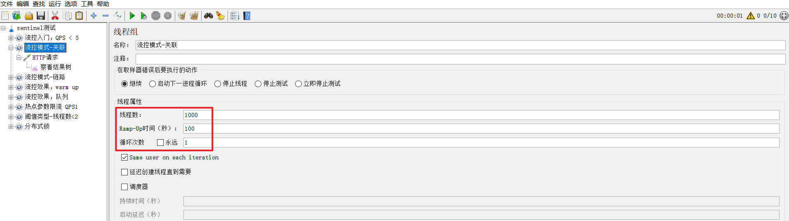

可以看到1000个线程，100秒，因此QPS为10，超过了我们设定的阈值：5

查看http请求：

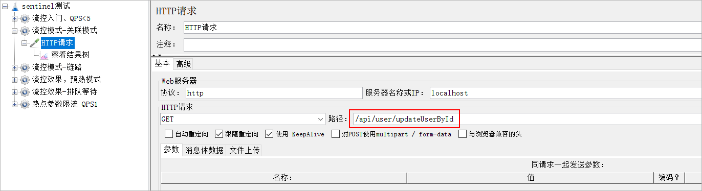  

请求的目标是/api/user/updateUserById，这样这个端点就会触发阈值。但限流的目标是/api/user/findUserByUserId/1，我们在浏览器访问，可

以发现：

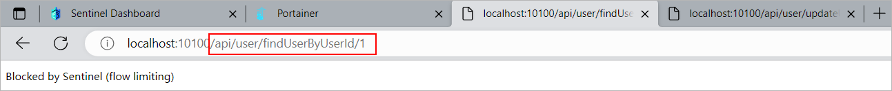 

确实被限流了。

关联流控模式的使用场景：

1、两个有竞争关系的资源

2、一个优先级较高，一个优先级较低

对高优先级的资源的流量进行统计，当超过阈值对低优先级的资源进行限流。

#### 链路模式

链路模式：只针对从指定链路访问到本资源的请求做统计，判断是否超过阈值，如果超过阈值对从该链路请求进行限流。

配置方式：

1、/api/user/save --> users

2、/api/user/query --> users

如果只希望统计从/api/user/query进入到users的请求，并进行限流操作，则可以这样配置：

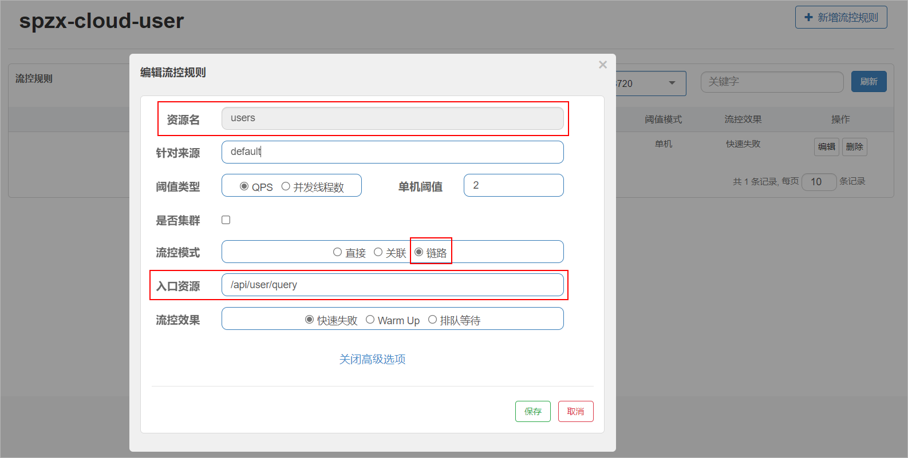 

案例实现：

1、在UserService中添加一个queryUsers方法，不用实现业务

```java
public void queryUsers(){
    System.err.println("查询用户");
}
```

2、在UserController中，添加两个端点，在这两个端点中分别调用UserService中的queryUsers方法

```java
@GetMapping(value = "/save")
public String save() {
    userService.queryUsers();
    System.out.println("保存用户");
    return "订单保存成功" ;
}

@GetMapping(value = "/query")
public String query() {
    userService.queryUsers();
    System.out.println("查询用户");
    return "查询用户成功" ;
}
```

4、通过**@SentinelResource**标记UserService中的queryUsers方法为一个sentinel监控的资源(默认情况下，sentinel只监控controller方法)

```java
@SentinelResource("users")
public void queryUsers(){
    System.err.println("查询用户");
}
```

5、更改application.yml文件中的sentinel配置

链路模式中，是对不同来源的两个链路做监控。但是sentinel默认会给进入spring mvc的所有请求设置同一个root资源，会导致链路模式失效。因此需

要关闭这种资源整合。

```yml
spring:
  cloud:
    sentinel:
      web-context-unify: false # 关闭context整合
```

6、重启服务，访问/api/user/save和/api/user/query，可以查看到sentinel的簇点链路规则中，出现了新的资源

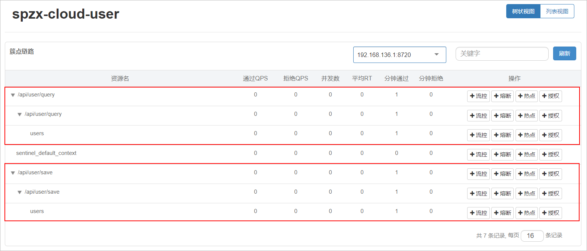 

7、添加流控规则

点击users资源后面的流控按钮，在弹出的表单中填写下面信息：

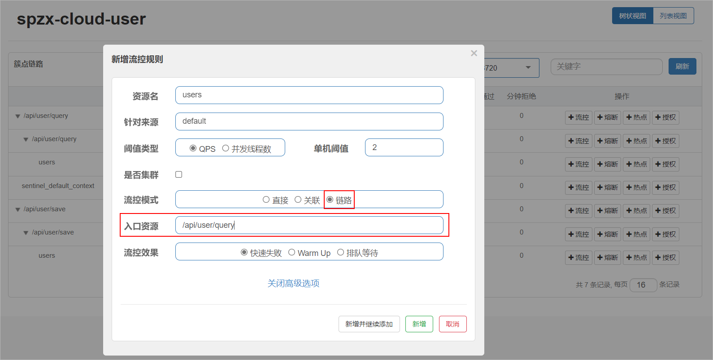 

只统计从/api/user/query进入/users的资源，QPS阈值为2，超出则被限流。

8、jmeter测试

选择《流控模式-链路》

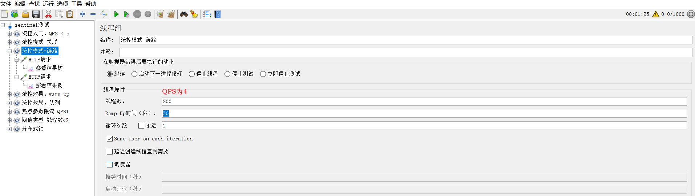

可以看到这里200个线程，50秒内发完，QPS为4，超过了我们设定的阈值2。

一个http请求是访问/api/user/save

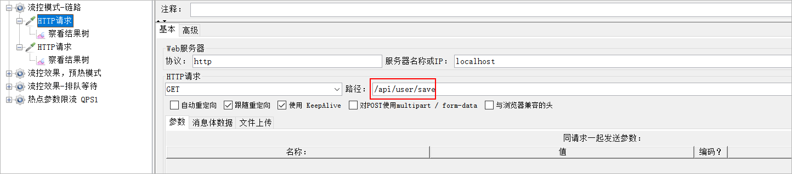 

另一个是访问/api/user/query

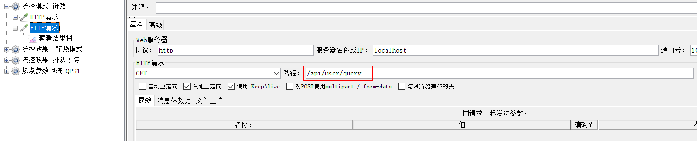 

运行测试，察看结果树：

访问/api/user/save,没有进行限流

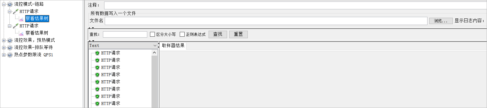 

访问/api/user/query,进行限流了

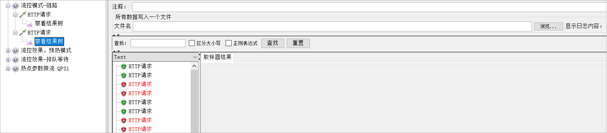 

### 3.3.4 流控效果

在流控的高级选项中，还有一个流控效果选项

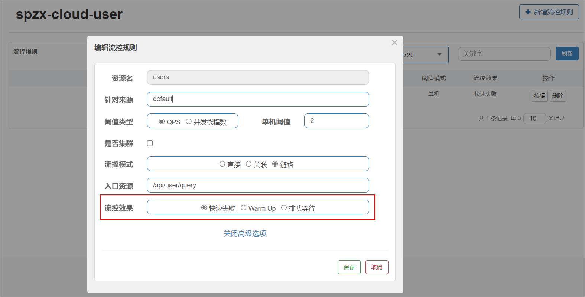 

流控效果是指请求达到流控阈值时应该采取的措施，包括三种：

1、快速失败：达到阈值后，新的请求会被立即拒绝并抛出FlowException异常，是默认的处理方式

2、warm up：预热模式，对超出阈值的请求同样是拒绝并抛出异常，但这种模式阈值会动态变化，从一个较小值逐渐增加到最大阈值

3、排队等待：让所有的请求按照先后次序进入到一个队列中进行排队，当某一个请求最大的预期等待时间超过了所设定的超时时间时同样是拒绝并抛

出异常

#### warm up

阈值一般是一个微服务能承担的最大QPS，但是一个服务刚刚启动时，一切资源尚未初始化（**冷启动**），如果直接将QPS跑到最大值，可能导致服务

瞬间宕机。

warm up也叫**预热模式**，是应对服务冷启动的一种方案。**阈值会动态变化**，从一个较小值逐渐增加到最大阈值。

**工作特点**：请求阈值初始值是 maxThreshold / coldFactor, 持续指定时长(预热时间)后，逐渐提高到maxThreshold值，而coldFactor的默认值是3。

例如，我设置QPS的maxThreshold为10，预热时间为5秒，那么初始阈值就是 10 / 3 ，也就是3，然后在5秒后逐渐增长到10。

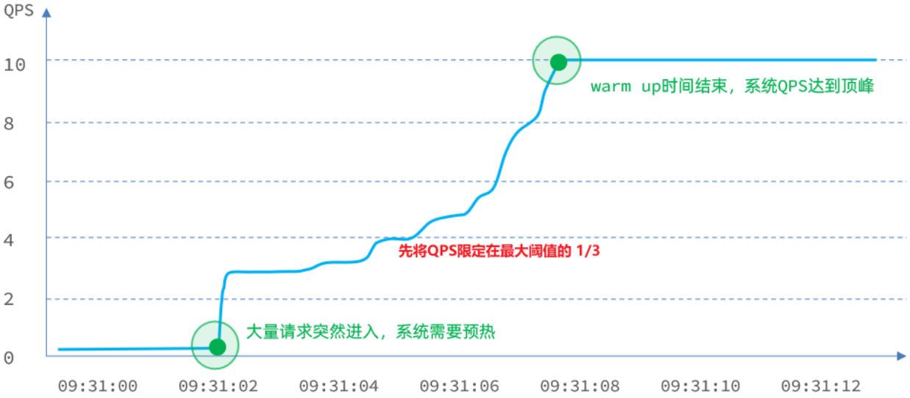


**案例需求**：给/api/user/findUserByUserId/{userId}这个资源设置限流，最大QPS为10，利用warm up效果，预热时长为5秒

1、配置流控规则

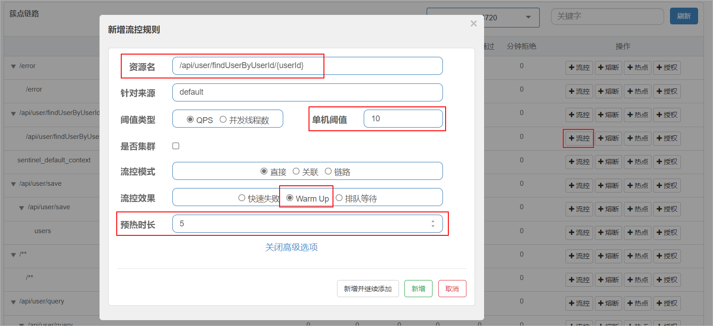 

2、jmeter测试

选择《流控效果，warm up》

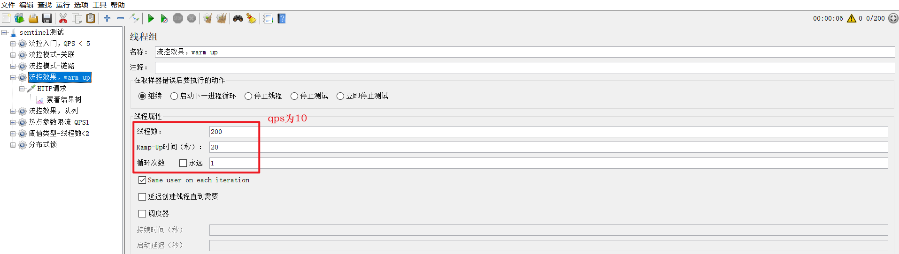

QPS为10

刚刚启动时，大部分请求失败，成功的只有3个，说明QPS被限定在3：

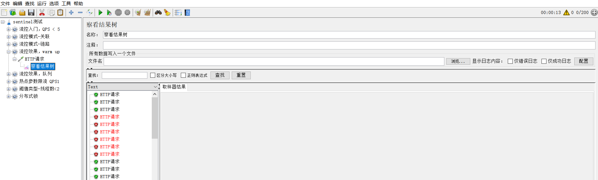

随着时间推移，成功比例越来越高

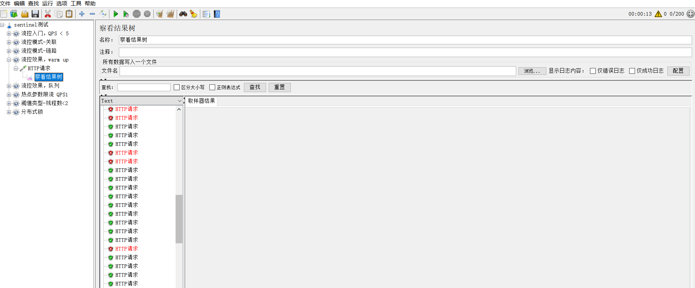

到sentinel控制台查看实时监控

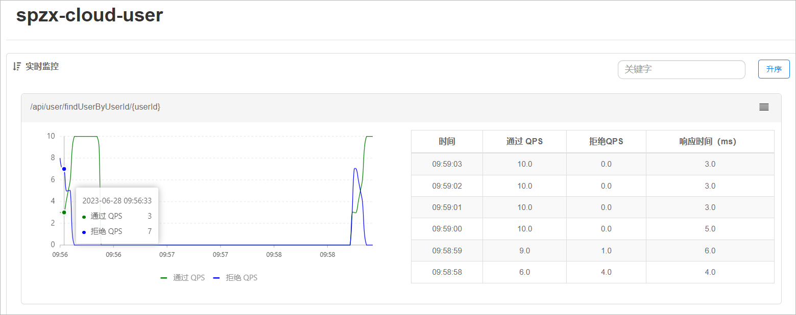 

#### 排队等待

**排队等待**：让所有的请求按照先后次序进入到一个队列中进行排队，当某一个请求最大的预期等待时间超过了所设定的超时时间时同样是拒绝并抛出

异常

例如：QPS = 5，意味着每200ms处理一个队列中的请求；timeout = 2000，意味着**预期等待时长**超过2000ms的请求会被拒绝并抛出异常。

那什么叫做预期等待时长呢？

比如现在一下子来了12 个请求，因为每200ms执行一个请求，那么：

1、第6个请求的**预期等待时长** =  200 * （6 - 1） = 1000ms

2、第12个请求的预期等待时长 = 200 * （12-1） = 2200ms

现在，第1秒同时接收到10个请求，但第2秒只有1个请求，此时QPS的曲线这样的：

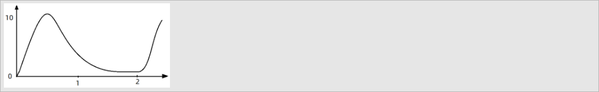 

如果使用队列模式做流控，所有进入的请求都要排队，以固定的200ms的间隔执行，QPS会变的很平滑

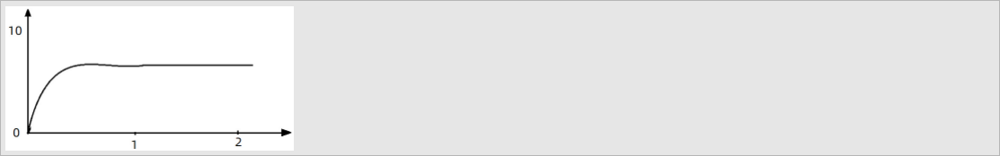 

平滑的QPS曲线，对于服务器来说是更友好的。


**案例需求**：给/api/user/findUserByUserId/{userId}这个资源设置限流，最大QPS为10，利用排队的流控效果，超时时长设置为5s

1、添加流控规则

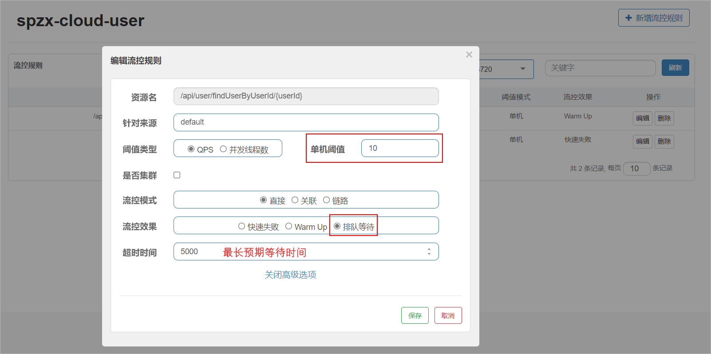 

2、jmeter测试

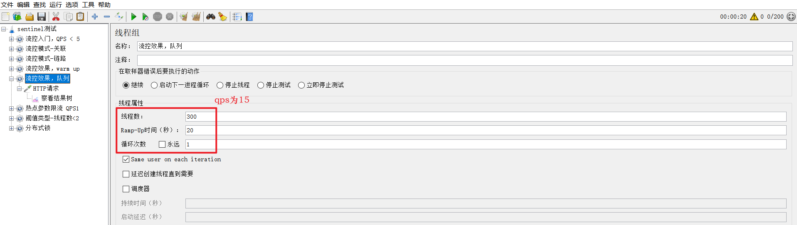

QPS为15，已经超过了我们设定的10。

运行测试用例，察看结果树：

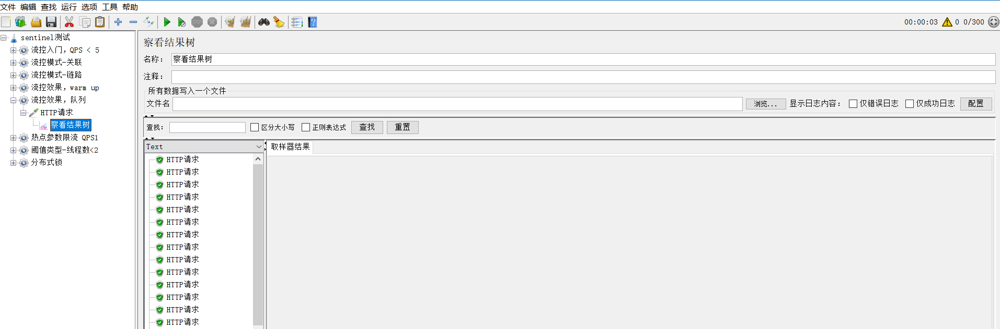

全部都通过了。

再去sentinel查看实时监控的QPS曲线

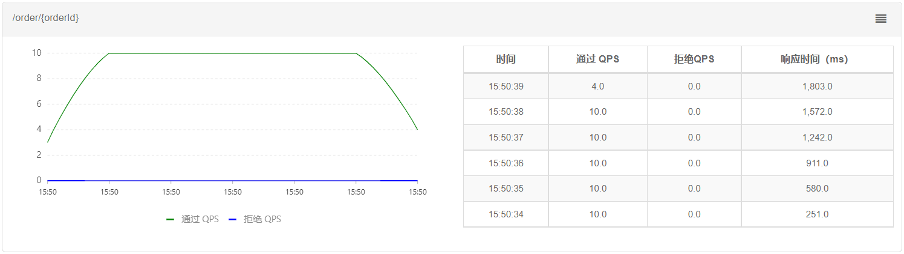

QPS非常平滑，一致保持在10，但是超出的请求没有被拒绝，而是放入队列。因此**响应时间**（等待时间）会越来越长。

### 3.3.5 热点参数限流

#### 配置介绍

之前的限流是统计访问某个资源的所有请求，判断是否超过QPS阈值。而热点参数限流是**分别统计参数值相同的请求**，判断是否超过QPS阈值。

例如，一个根据id查询商品的接口：

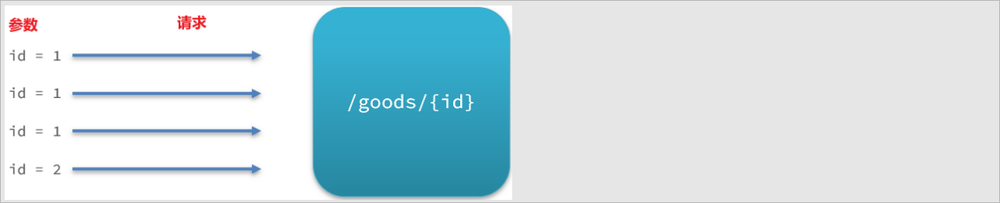 

访问/goods/{id}的请求中，id参数值会有变化，热点参数限流会根据参数值分别统计QPS，统计结果：

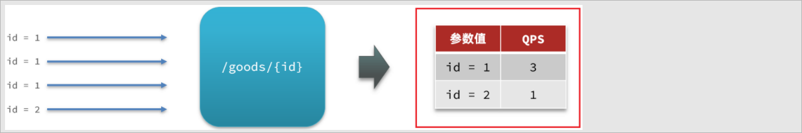 

当id=1的请求触发阈值被限流时，id值不为1的请求不受影响。

配置方式(点击资源中的热点按钮)：

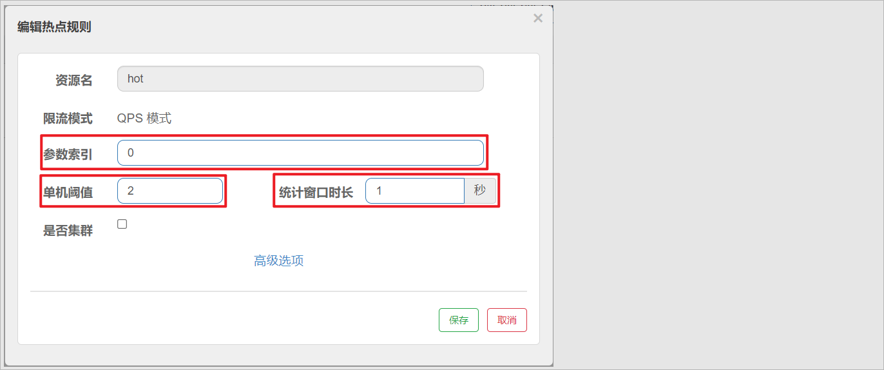 

代表的含义是：对hot这个资源的0号参数（第一个参数）做统计，每1秒**相同参数值**的请求数不能超过2。这种配置是对查询商品这个接口的所有商品

一视同仁，QPS都限定为5。而在实际开发中，可能部分商品是热点商品，例如秒杀商品，我们希望这部分商品的QPS限制与其它商品不一样，高一

些。那就需要配置热点参数限流的高级选项了：

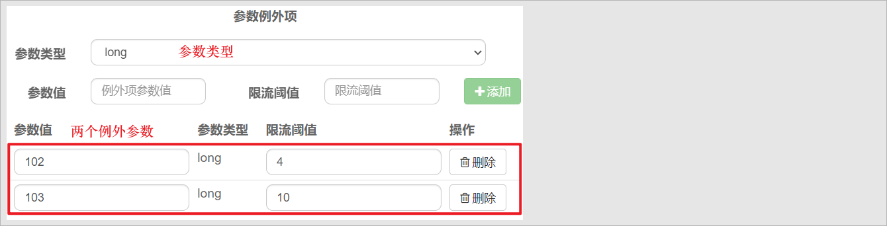 

#### 案例演示

**案例需求**：给/api/user/findUserByUserId/{userId}这个资源添加热点参数限流，规则如下：

1、默认的热点参数规则是每1秒请求量不超过2

2、给2这个参数设置例外：每1秒请求量不超过4

3、给3这个参数设置例外：每1秒请求量不超过10

**注意事项**：热点参数限流对默认的spring mvc资源无效，需要利用@SentinelResource注解标记资源


实现步骤：

1、标记资源

给UserController中的/api/user/findUserByUserId/{userId}资源添加注解：

```java
@SentinelResource("hot")  // 声明资源名称
@GetMapping(value = "/findUserByUserId/{userId}")
public User findUserByUserId(@PathVariable(value = "userId") Long userId ,
                             @RequestHeader(name = "Truth" , required = false)String header) {
    log.info("UserController...findUserByUserId方法执行了... ,header: {} , dateformat: {} " , header , patternProperties.getDateformat());
    return userService.findUserByUserId(userId) ;
}
```

2、热点参数限流规则

访问该接口，可以看到我们标记的hot资源出现了

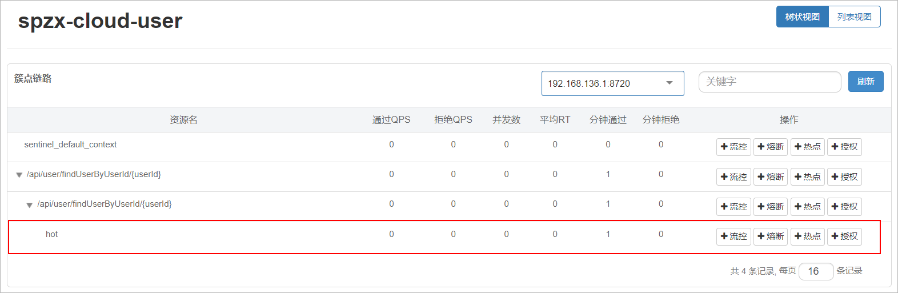 

这里不要点击hot后面的按钮，页面有BUG

点击左侧菜单中**热点规则**菜单：

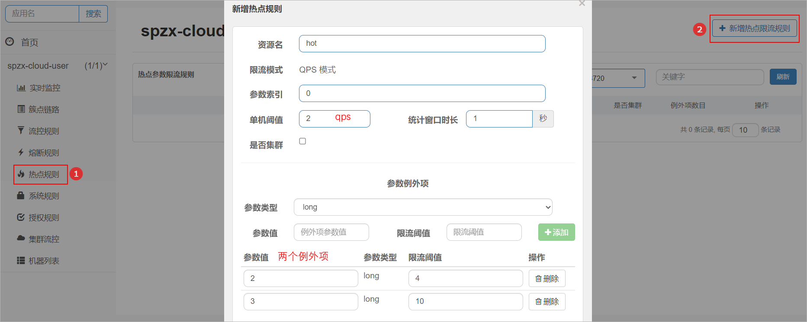 

3、jmeter测试

选择《热点参数限流 QPS1》

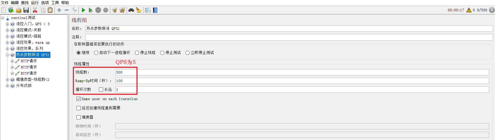

这里发起请求的QPS为5。

包含三个请求，参数分别为：101 ， 102 ， 103，运行测试程序，察看结果树：


| 101  | 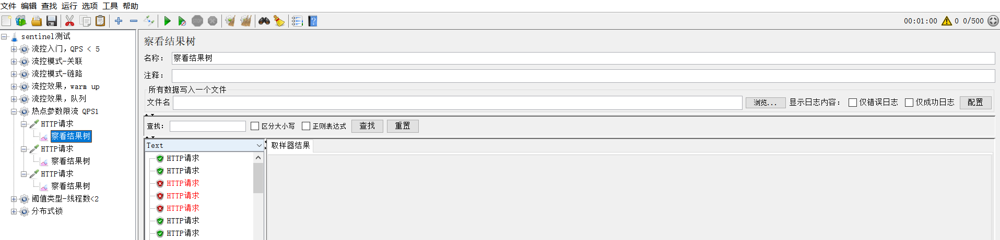 |
| ---- | ------------------------------------------------------------ |
| 102  | 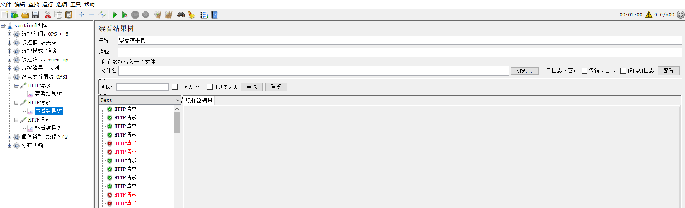 |
| 103  | 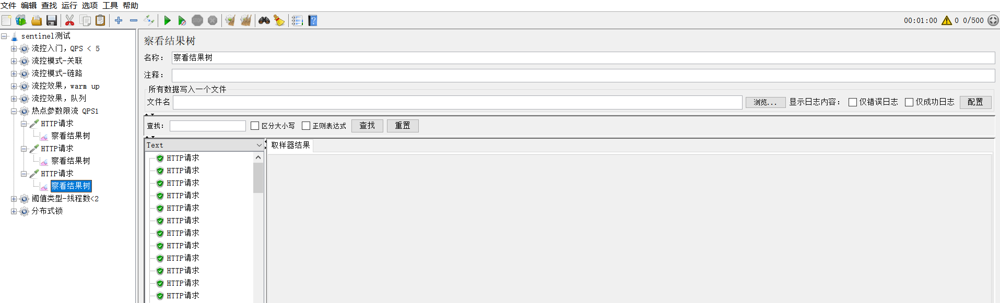 |

## 3.4 隔离处理

隔离处理：将错误隔离在可控的范围之内，不要让其影响到其他的程序的运行。

### 3.4.1 实现方式

线程隔离有两种方式实现：

1、线程池隔离

2、信号量隔离（sentinel默认采用）

如图：

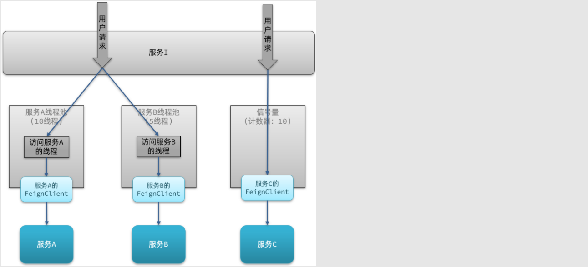 

**线程池隔离**：给每个服务调用业务分配一个线程池，利用线程池本身实现隔离效果

**信号量隔离**：不创建线程池，而是计数器模式，记录业务使用的线程数量，达到信号量上限时，禁止新的请求


两者比对：

|      |                  线程池隔离                  |                 信号量隔离                 |
| ---- | :------------------------------------------: | :----------------------------------------: |
| 线程 | 请求线程和调用provider线程**不是**同一个线程 | 请求线程和调用provider线程**是**同一个线程 |
| 开销 |         存在线程上下文切换，开销较大         |       不存在线程上下文切换，开销较小       |
| 异步 |                     支持                     |                   不支持                   |
| 超时 |               支持主动超时处理               |             不支持主动超时处理             |

使用场景：

线程池隔离：请求并发量大，并且**耗时长**(请求耗时长一般计算量大，或者读数据库)：采用线程池隔离策略，这样的话，可以保证大量的**容器**

**(tomcat)线程**可用，不会由于服务原因，一直处于阻塞或者等待状态。


信号量隔离：请求并发量大，并且**耗时短**(请求耗时长一般计算量小，或者读缓存)：采用信号量隔离策略，因为这类服务的返回通常会**非常快**，不会

占用**容器线程**太长时间，而且也减少了线程切换的开销，提高了缓存服务的效率。


### 3.4.2 sentinel实现

在添加限流规则时，可以选择两种阈值类型：

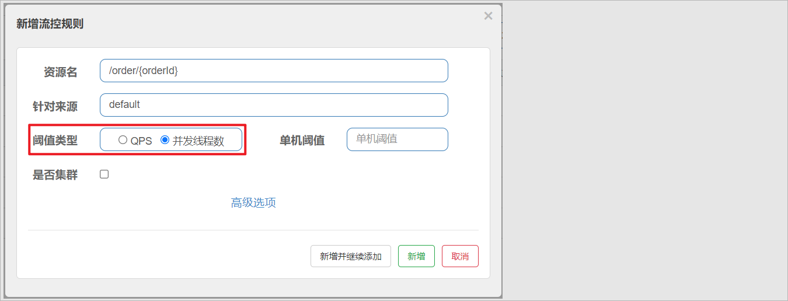 

1、QPS：就是每秒的请求数，在服务之外直接进行拦截处理(类似于：银行的保安)

2、并发线程数：设置该资源能使用的tomcat线程数的最大值，在服务之内通过指定的线程数来处理请求，线程处理不过来触发限流(类似于：银行业

务员)


### 3.4.3 案例演示

需求：给spzx-cloud-order服务中的UserFeignClient的查询用户接口设置流控规则，线程数不能超过1，然后利用jemeter测试。

步骤：

1、在spzx-cloud-order微服务中添加sentinel的依赖

```xml
<!--sentinel-->
<dependency>
    <groupId>com.alibaba.cloud</groupId>
    <artifactId>spring-cloud-starter-alibaba-sentinel</artifactId>
</dependency>
```

2、feign整合sentinel

```yml
# 微服务整合sentinel
spring:
  cloud:
    sentinel:
      transport:
        dashboard: localhost:8080

# feign整合sentinel
feign:
  sentinel:
    enabled: true
```

3、重启服务，访问根据订单id查询订单接口方法，产生簇点链路

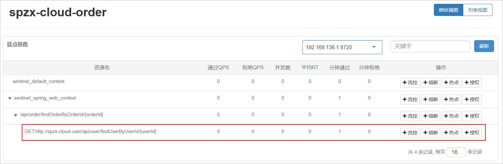 

4、配置隔离规则

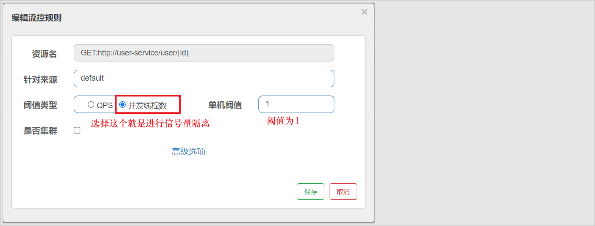 

单机阈值设置为1表示针对这个资源最多同时有1个线程进行访问。

5、为了让测试效果更加明显一点，可以让访问/api/user/findUserByUserId/{userId}接口的线程主动休眠一段时间

```java
@SentinelResource("hot")
@GetMapping(value = "/findUserByUserId/{userId}")
public User findUserByUserId(@PathVariable(value = "userId") Long userId ,
                             @RequestHeader(name = "Truth" , required = false)String header) {
    log.info("UserController...findUserByUserId方法执行了... ,header: {} , dateformat: {} " , header , patternProperties.getDateformat());
    try {
        TimeUnit.SECONDS.sleep(1);
    } catch (InterruptedException e) {
        throw new RuntimeException(e);
    }
    return userService.findUserByUserId(userId) ;
}
```

6、jmeter测试

选择《阈值类型-线程数<2》

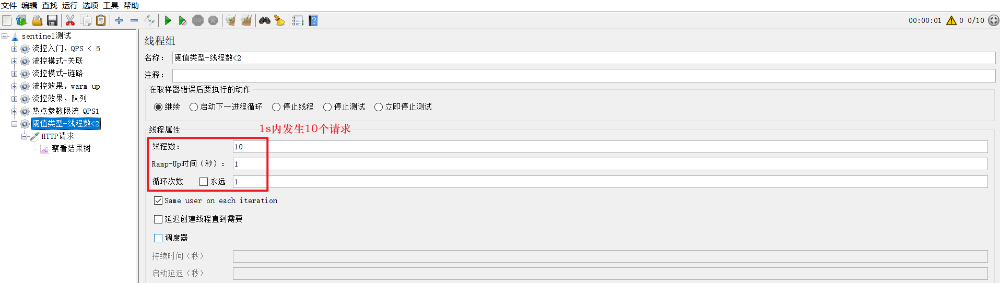

1s内发生10个请求，10个请求由一个线程进行处理，而一个线程处理的请求时长是1s，有很大的可能一部分的请求处理不了就会报错。

查看运行结果：

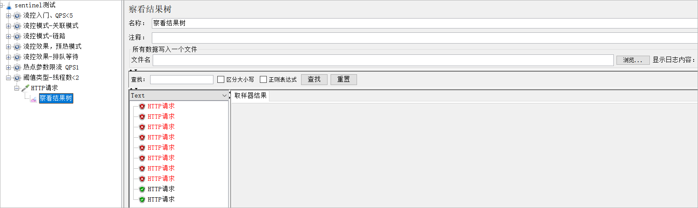 

### 3.4.4 降级逻辑

上述请求失败以后，直接返回返回500的错误状态码给用户：

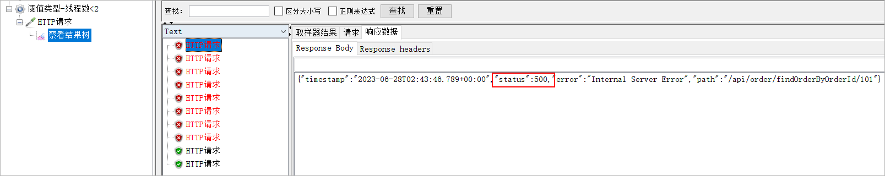 

而这个错误请求并不是由于用户访问查询订单信息报错导致的，而是由于根据订单查询用户时报错的。因此直接给用户返回500的错误状态码其实不太

友好，友好的做法当远程调用失败以后，返回一个默认的用户信息给前端，这种备用方案就是我们的降级方案。


实现步骤：

1、在spzx-feign-api模块中定义一个类让其实现**UserFeignClient**接口，重写queryById方法，在该方法中编写降级逻辑

```java
//  com.atguigu.spzx.cloud.feign.fallback;
@Slf4j
public class UserFeignClientFallback implements UserFeignClient {

    @Override
    public User queryById(Long userId) {
        log.info("UserFeignClientFallback...queryById...方法执行了...");
        return new User();
    }
    
}
```

2、在UserFeignClient接口中注册配置该降级类

```java
@FeignClient(value = "spzx-cloud-user", fallback = UserFeignClientFallback.class)		
public interface UserFeignClient {

    @GetMapping("/api/user/findUserByUserId/{userId}")
    public abstract User queryById(@PathVariable("userId") Long userId) ;	// 根据userId查询用户信息的接口方法

}
```

3、把该降级类纳入到spring容器中

方案一：在spzx-cloud-order的启动类上通过@Import注解进行导入

方案二：使用Spring Boot3的自动化配置原理完成

4、重启服务，重新配置隔离规则，并进行测试

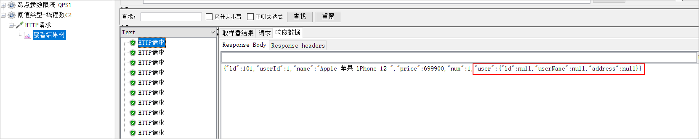 

此时发现所有请求都是成功的，但是有一部分的用户数据为空。

## 3.5 熔断处理

### 3.5.1 工作原理

熔断降级是解决雪崩问题的重要手段。其思路是由**断路器**统计服务调用的异常比例、异常数、慢请求比例，如果超出阈值则会**熔断**该服务。即拦截访

问该服务的一切请求；而当服务恢复时，断路器会放行访问该服务的请求。

断路器控制熔断和放行是通过状态机来完成的：

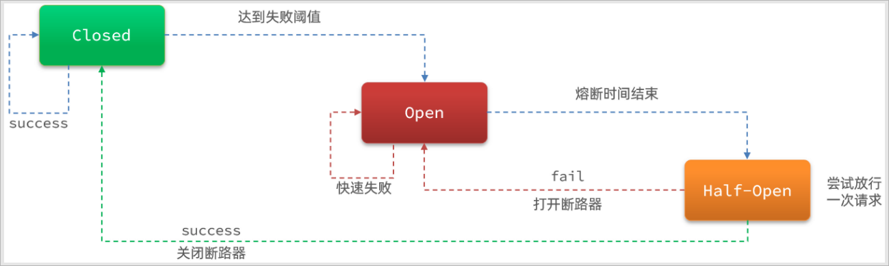 

状态机包括三个状态：

1、closed：关闭状态，断路器放行所有请求，并开始统计异常比例、异常数、慢请求比例。超过阈值则切换到open状态

2、open：打开状态，服务调用被**熔断**，访问被熔断服务的请求会被拒绝，快速失败，直接走降级逻辑。Open状态5秒后会进入half-open状态

3、half-open：半开状态，放行一次请求，根据执行结果来判断接下来的操作。

① 请求成功：则切换到closed状态

② 请求失败：则切换到open状态

断路器熔断判断策略有三种：慢调用、异常比例、异常数

### 3.5.2 慢调用比例

**慢调用**：业务的响应时长（RT）大于指定时长的请求认定为慢调用请求。sentinel会统计指定时间内，请求数量超过设定的最小数量的请求并且慢调

用比例的比例。

如果慢调用比例大于设定的阈值，则触发熔断。

例如下述配置：

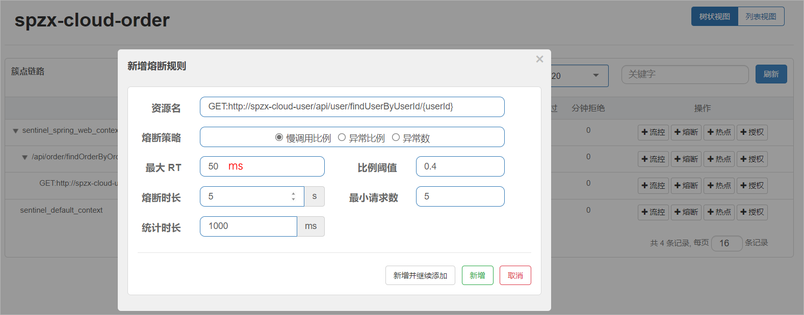 

含义：RT超过50ms的调用是慢调用，统计最近10000ms内的请求，如果请求量超过5次，并且慢调用比例不低于0.4，则触发熔断，熔断时长为5秒。

然后进入half-open状态，放行一次请求做测试。


**案例演示**

需求：给 UserFeginClient的查询用户接口设置降级规则，慢调用的RT阈值为50ms，统计时间为1秒，最小请求数量为5，失败阈值比例为0.4，熔断

时长为5s

1、修改spzx-cloud-user中的/api/user/findUserByUserId/{userId}这个接口的业务。通过休眠模拟一个延迟时间

```java
@SentinelResource("hot")
@GetMapping(value = "/findUserByUserId/{userId}")
public User findUserByUserId(@PathVariable(value = "userId") Long userId ,
                             @RequestHeader(name = "Truth" , required = false)String header) {
    log.info("UserController...findUserByUserId方法执行了... ,header: {} , dateformat: {} " , header , patternProperties.getDateformat());
    try {
        TimeUnit.MILLISECONDS.sleep(60);  // 休眠60ms
    } catch (InterruptedException e) {
        throw new RuntimeException(e);
    }
    return userService.findUserByUserId(userId) ;
}
```

此时，orderId=101的订单，关联的是id为1的用户，调用时长为60ms：

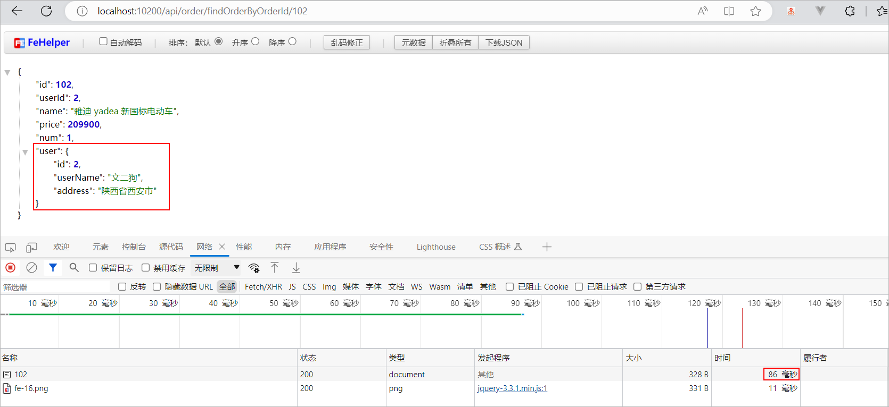 

2、设置熔断规则

下面，给feign接口设置降级规则：

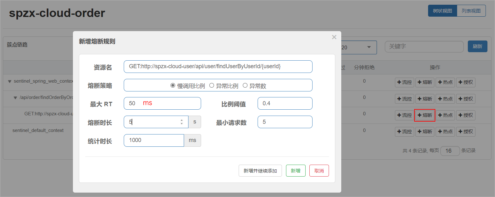 

超过50ms的请求都会被认为是慢请求。

3、测试

在浏览器访问：http://localhost:10200/api/order/findOrderByOrderId/102，快速刷新5次以上，可以发现：

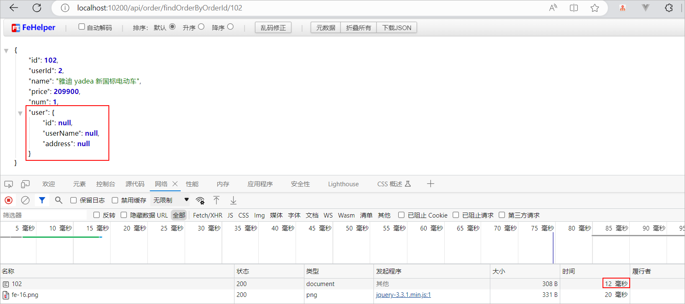 

在浏览器访问：http://localhost:10200/api/order/findOrderByOrderId/103，竟然也被熔断了!

### 3.5.3 异常比例和异常数

**异常比例或异常数**：统计指定时间内的调用，如果调用次数超过指定请求数，并且出现异常的比例达到设定的比例阈值（或超过指定异常数），则触

发熔断。

例如，一个异常比例设置：


|          | 配置示例                                                     | 含义                                                         |
| -------- | ------------------------------------------------------------ | ------------------------------------------------------------ |
| 异常比例 | 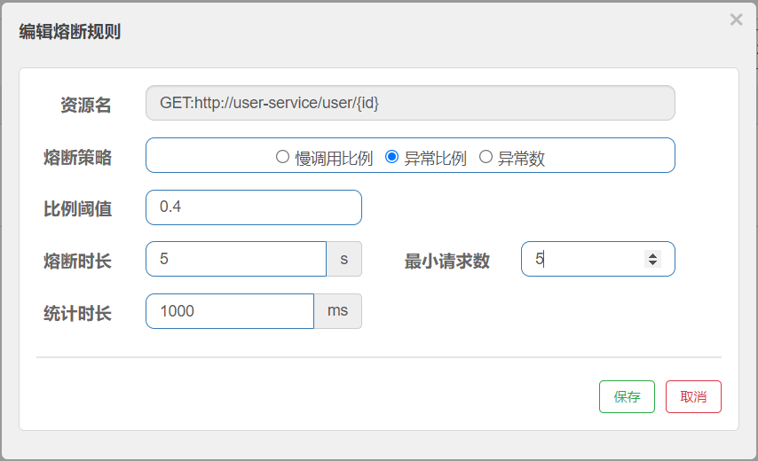 | 统计最近1000ms内的请求，如果请求量超过5次，并且异常比例不低于0.4，则触发熔断。 |
| 异常数   | 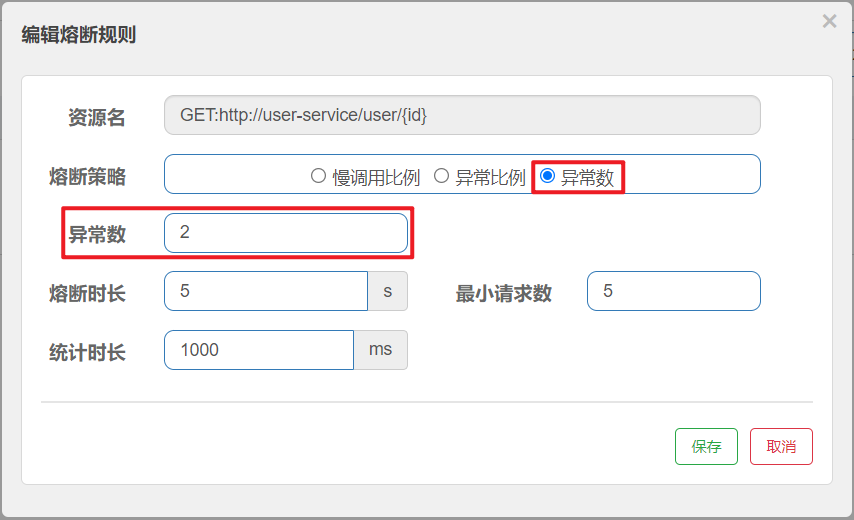 | 统计最近1000ms内的请求，如果请求量超过5次，并且异常比例不低于2次，则触发熔断。 |


**案例演示**

需求：给 UserFeginClient的查询用户接口设置降级规则，统计时间为1秒，最小请求数量为5，异常失败阈值比例为0.4，熔断时长为5s。

步骤：

1、修改spzx-cloud-user中的/api/user/findUserByUserId/{userId}这个接口的业务。手动抛出异常，以触发异常比例的熔断：

```java
@SentinelResource("hot")
@GetMapping(value = "/findUserByUserId/{userId}")
public User findUserByUserId(@PathVariable(value = "userId") Long userId ,
                             @RequestHeader(name = "Truth" , required = false)String header) {
    log.info("UserController...findUserByUserId方法执行了... ,header: {} , dateformat: {} " , header , patternProperties.getDateformat());
    if(userId == 2) {
        throw new RuntimeException("手动抛出异常，触发异常比例熔断规则") ;
    }
    return userService.findUserByUserId(userId) ;
}
```

也就是说，id为2时，就会触发异常。

2、设置熔断规则

下面，给feign接口设置降级规则：

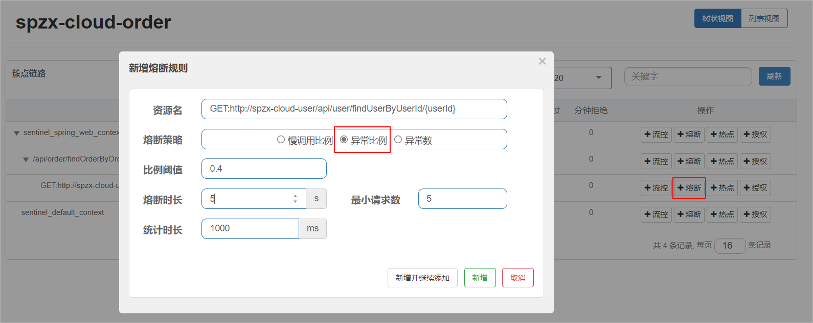 

在5次请求中，只要异常比例超过0.4，也就是有2次以上的异常，就会触发熔断。

3、测试

在浏览器快速访问：http://localhost:10200/api/order/findOrderByOrderId/102，快速刷新5次以上，触发熔断：

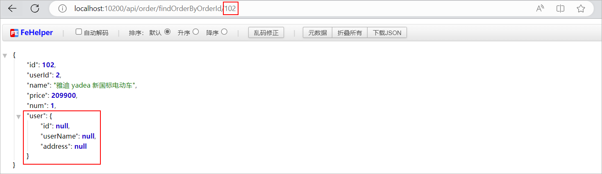 

此时，我们去访问本来应该正常的103：

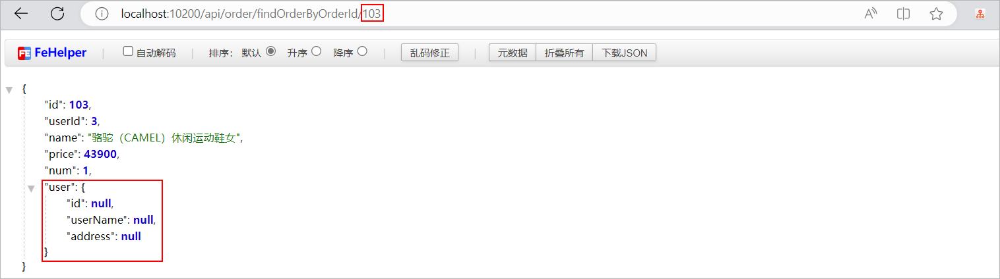 

## 3.6 规则持久化

### 3.6.1 规则持久化概述

默认情况下sentinel没有对规则进行持久化，让对服务进行重启以后，Sentinel规则将消失，生产环境需要将配置规则进行持久化

持久化思想：

**将限流配置规则持久化进Nacos保存**，只要刷新spzx-cloud-order某个rest地址，sentinel控制台的流控规则就能看到，只要Nacos里面的配置

不删除，针对spzx-cloud-order上Sentinel上的流控规则持续有效

### 3.6.2 规则持久化实战

#### Nacos添加规则配置

在nacos配置中心中添加规则配置

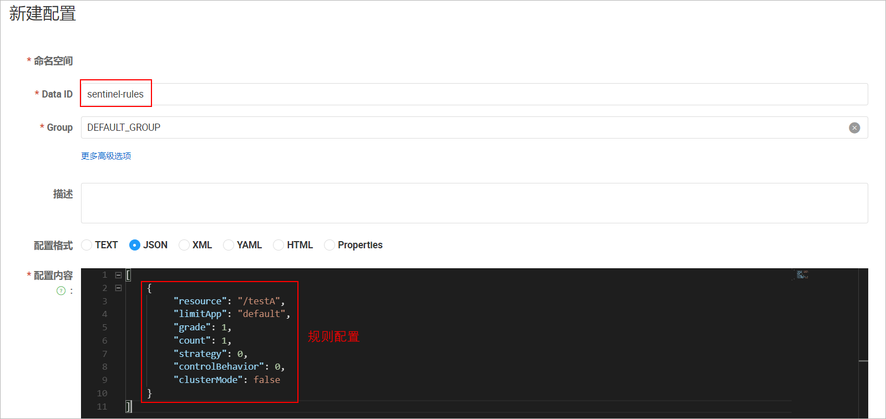  

规则配置内容如下所示：

```yml
[
    {
         "resource": "/testA",
         "limitApp": "default",
         "grade": 1,
         "count": 1,
         "strategy": 0,
         "controlBehavior": 0,
         "clusterMode": false 
    }
]
```

规则说明：

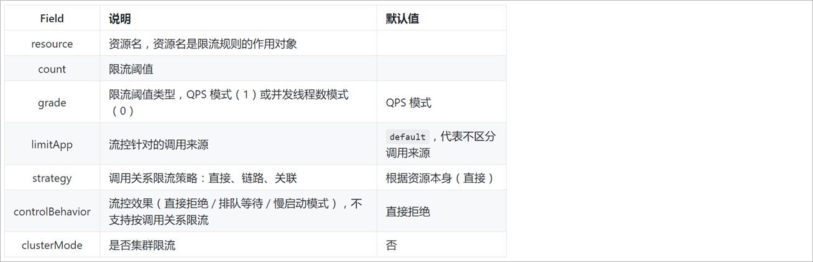 

#### 读取nacos规则配置

微服务可以从nacos配置中心读取规则配置信息然后进行使用。

具体步骤如下所示：

1、在spzx-cloud-order微服务中的pom.xml文件中添加如下依赖

```xml
<dependency>
    <groupId>com.alibaba.csp</groupId>
    <artifactId>sentinel-datasource-nacos</artifactId>
</dependency>
```

2、在spzx-cloud-order微服务的application.yml文件添加如下配置

```yml
# 配置数据库的连接信息
spring:
  cloud:
    sentinel:
      transport:
        dashboard: localhost:8080
      datasource:
        ds1:
          nacos:
            serverAddr: 192.168.136.142:8848
            dataId: sentinel-rules
            groupId: DEFAULT_GROUP
            dataType: json
            ruleType: flow
```

3、重启spzx-cloud-order微服务，访问任意一个接口，此时就可以在sentinel的控制台看到对应的流控规则了

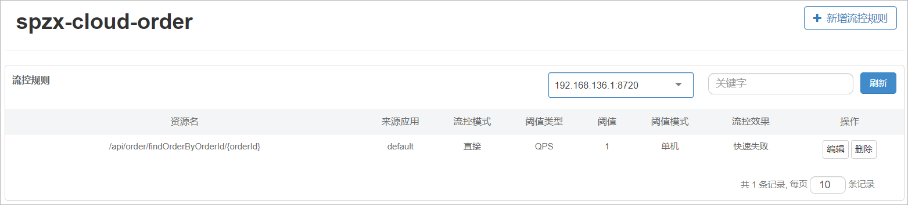  

4、重新启动spzx-cloud-order微服务服务再看sentinel控制台是否还存在该规则信息

扎一看还是没有，稍等一会儿,多次调用 http://localhost:10200/api/order/findOrderByOrderId/101，重新配置出现了，持久化验证通过！
