# 1 微服务系统监控

## 1.1 监控系统的意义

微服务系统监控对于一个企业来说非常重要，因为它能够提供以下几个方面的价值：

**1、提高系统稳定性和可靠性**：微服务架构中的每个服务都是独立的，因此出现故障的概率也会增加。监控系统可以实时地检测并报告各个服务的状

态和性能数据，及时发现并解决问题，提高系统的稳定性和可靠性。

**2、提高服务质量和用户体验**：微服务系统监控可以帮助企业**追踪和分析服务性能数据**，如响应时间、请求成功率、错误率等，从而了解服务的运

行情况，并及时采取措施来提高服务质量和用户体验。

**3、提高运维效率和降低成本**：微服务系统监控可以自动收集和分析各个服务的运行数据，帮助企业快速发现和解决问题，从而提高运维效率并降低

成本。此外，监控数据还可以帮助企业优化资源分配和容量规划，减少资源浪费和成本开销。

**4、帮助企业预测和规避风险**：微服务系统监控可以帮助企业实时了解服务的运行情况，预测和规避可能出现的问题和风险，保障系统的稳定性和可

靠性，从而避免损失和影响

总之，微服务系统监控可以帮助企业及时发现和解决问题，提高系统稳定性和可靠性，优化服务质量和用户体验，提高运维效率和降低成本，预测和规

避风险，是企业微服务架构中不可或缺的一部分。

## 1.2 SBA监控方案

官网地址：https://docs.spring-boot-admin.com/

**Spring Boot Admin**：Spring Boot Admin是一个用于管理和监控Spring Boot应用程序的开源项目。它提供了一个用户友好的Web界面，可以方

便地查看和管理运行中的Spring Boot应用程序。

Spring Boot Admin具有以下主要功能：

1、应用程序监控：Spring Boot Admin可以监控注册到其上的Spring Boot应用程序的运行状态、健康状况、内存使用情况、线程信息等。它通过与

Spring Boot Actuator集成来获取这些信息，并以可视化的方式展示在管理界面上。

2、集中式配置管理：Spring Boot Admin允许您在管理界面上对注册的Spring Boot应用程序进行配置管理。您可以动态修改应用程序的配置属性，而

无需重新启动应用程序。

3、日志管理：Spring Boot Admin提供了对应用程序日志的集中式管理和查看功能。您可以在管理界面上查看应用程序的日志输出，并根据需要进行

搜索和过滤。

4、通知和告警：Spring Boot Admin支持通过电子邮件、Slack等方式发送通知和告警。您可以设置特定的规则和阈值，当应用程序达到或超过这些规

则时，将会触发相应的通知。

5、安全性和权限控制：Spring Boot Admin提供了安全性和权限控制机制，可以限制对管理界面的访问，并为不同的用户或角色分配不同的权限。


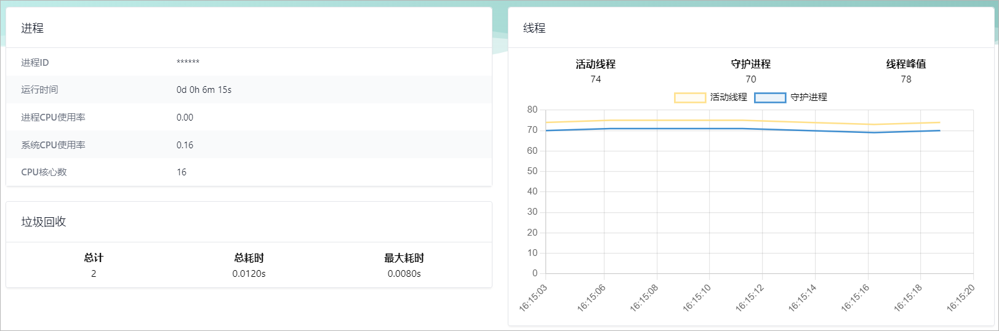  


Spring Boot Admin是一个基于客户端-服务器架构的应用程序管理和监控工具。它由两个主要组件组成：Admin Server（服务器）和Admin Client

（客户端）。

1、**Admin Server**（服务器）： Admin Server是Spring Boot Admin的核心组件，负责提供Web界面和API接口，用于管理和监控注册到其上的

Spring Boot应用程序。Admin Server通过HTTP或HTTPS与Admin Client进行通信，并收集应用程序的运行状态、健康状况、配置信息、日志等数

据。它还提供了用户认证和权限控制机制，以确保安全访问。

2、**Admin Client**（客户端）： Admin Client是被管理的Spring Boot应用程序，它通过将Spring Boot Actuator与Admin Server集成来实现与

Admin Server的通信。Admin Client在启动时会向Admin Server注册自己，并定期发送心跳信息和应用程序的运行状态、健康状况等数据给Admin 

Server。Admin Client还可以接收来自Admin Server的命令和配置更新，并根据需要执行相应的操作。


## 1.3 SBA实战

### 1.3.1 创建SBA服务端

具体步骤：

1、在spzx-cloud-parent创建一个监控微服务(spzx-cloud-sba)，加入如下依赖：

```xml
<dependency>
    <groupId>de.codecentric</groupId>
    <artifactId>spring-boot-admin-starter-server</artifactId>
    <version>3.1.0</version>
</dependency>

<dependency>
    <groupId>org.springframework.boot</groupId>
    <artifactId>spring-boot-starter-web</artifactId>
</dependency>

<dependency>
    <groupId>com.alibaba.cloud</groupId>
    <artifactId>spring-cloud-starter-alibaba-nacos-discovery</artifactId>
</dependency>
```

2、编写启动类

```java
@SpringBootApplication
@EnableAdminServer
public class AdminApplication {

    public static void main(String[] args) {
        SpringApplication.run(AdminApplication.class , args) ;
    }

}
```

3、创建配置文件

```yml
# application.yml文件内容
server:
  port: 20100

# bootstrap.yml文件
spring:
  application:
    name: spzx-cloud-sba
  cloud:
    nacos:
      discovery:
        server-addr: 192.168.136.142:8848
```

4、启动监控服务，通过http://localhost:20100访问监控服务后台管理系统

### 1.3.2 微服务集成SBA

具体步骤如下所示：

1、在spzx-cloud-parent模块中添加如下依赖

```xml
<dependency>
    <groupId>de.codecentric</groupId>
    <artifactId>spring-boot-admin-starter-client</artifactId>
    <version>3.1.0</version>
</dependency>
```

2、在指定的微服务配置文件中加入如下依赖

```yml
management:
  endpoints:
    web:
      exposure:
        include: "*"    # 开启所有需要监控的指标端点
  endpoint:
    health:
      show-details: always
```

3、重启微服务，通过sba服务端查看微服务相关信息

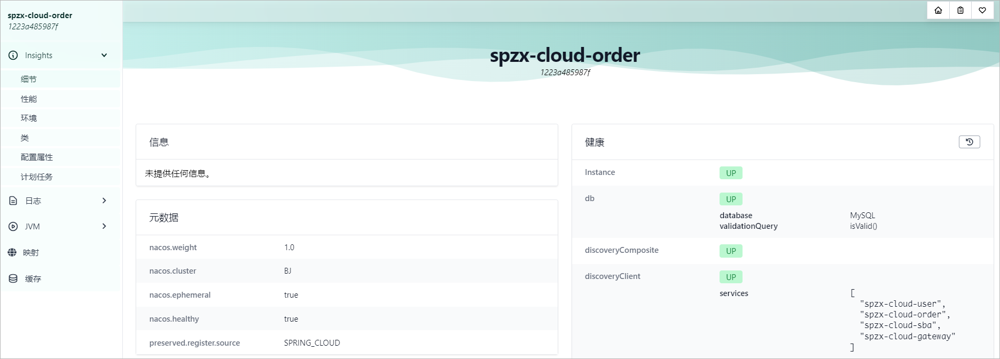 

## 1.4 微服务集成logback

在resources目录下创建一个logback-spring.xml文件，内容如下所示：

```xml
<?xml version="1.0" encoding="UTF-8"?>
<configuration scan="true" scanPeriod="60 seconds" debug="false">

    <!-- 日志存放路径 -->
    <property name="log.path" value="D://logs/spzx-cloud-order" />

    <!-- 日志输出格式 -->
    <property name="log.pattern" value="%d{HH:mm:ss.SSS} [%thread] %-5level %logger{20} - [%method,%line] - %msg%n" />

    <!-- 控制台输出 -->
    <appender name="console" class="ch.qos.logback.core.ConsoleAppender">
        <encoder>
            <pattern>%highlight${log.pattern}</pattern>
        </encoder>
    </appender>

    <!-- 系统日志输出 -->
    <appender name="file_info" class="ch.qos.logback.core.rolling.RollingFileAppender">
        <file>${log.path}/info.log</file>
        <!-- 循环政策：基于时间创建日志文件 -->
        <rollingPolicy class="ch.qos.logback.core.rolling.TimeBasedRollingPolicy">
            <!-- 日志文件名格式 -->
            <fileNamePattern>${log.path}/info.%d{yyyy-MM-dd}.log</fileNamePattern>
            <!-- 日志最大的历史 30天 -->
            <maxHistory>30</maxHistory>
        </rollingPolicy>
        <encoder>
            <pattern>${log.pattern}</pattern>
        </encoder>
    </appender>

    <!-- 系统模块日志级别控制  -->
    <logger name="com.atguigu" level="info" />

    <!-- Spring日志级别控制  -->
    <logger name="org.springframework" level="warn" />

    <root level="info">
        <appender-ref ref="console" />
        <appender-ref ref="file_info" />
    </root>

</configuration>
```

在application.yml配置文件中添加如下配置

```yml
management:
  endpoint:
    logfile:
      external-file: D://logs/spzx-cloud-order//info.log
```

此时就可以在SBA的监控界面查询到Spring Boot应用所产生的配置文件。

## 1.5 配置邮件告警

Spring Boot Admin 可以与多种告警系统集成，例如 PagerDuty、Slack、邮件等，以便在应用程序状态异常时通知管理员。在这里，我将为您介绍如

何在 Spring Boot Admin 中集成邮件告警功能。

具体步骤如下所示：

1、开通邮件服务器(以163邮箱为例说明)

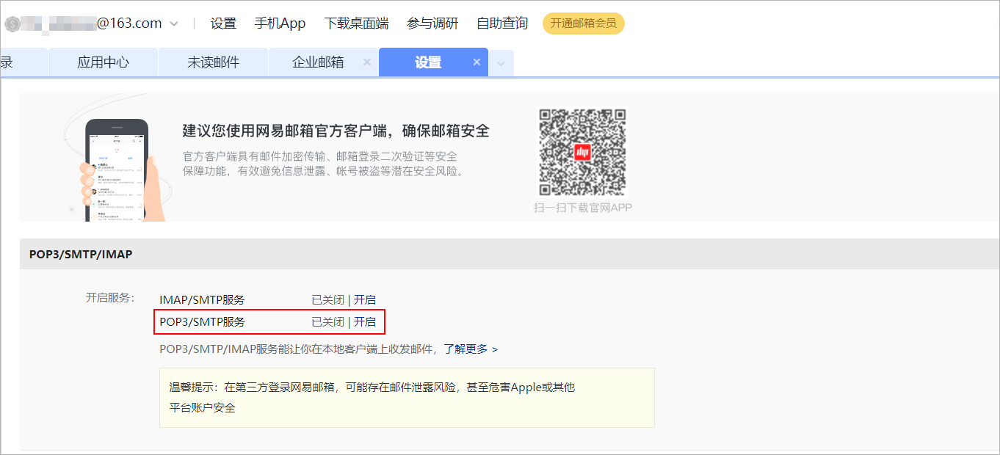 

按照提示操作，会得到一个授权码，后期发送邮件的时候需要使用，注意授权码只会显示一次：

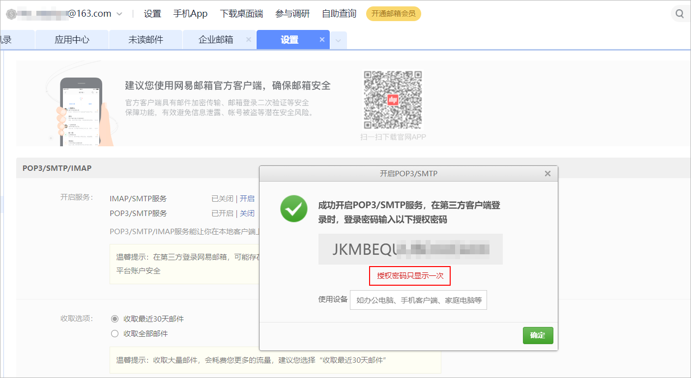 

2、在SBA服务端添加如下依赖

```xml
<dependency>
    <groupId>org.springframework.boot</groupId>
    <artifactId>spring-boot-starter-mail</artifactId>
</dependency>
```

3、在配置文件中添加如下配置

```yml
spring:
  mail:
    host: smtp.163.com
    port: 465
    username: hly_atguigu@163.com
    password: JKMBEQUUBDJUEAXX
    properties:
      mail:
        smtp:
          auth: true
          starttls:   # 使用 SSL 安全协议，须如下配置
            enable: true
            required: true
    protocol: smtps   # 465端口使用的通讯协议为smtps
  boot:
    admin:
      notify:
        mail:
          to: hly_atguigu@163.com
          from: hly_atguigu@163.com
          enabled: true
        filter:
          health-status: DOWN       # 邮件通知策略，当微服务下线的时候发送通知邮件
      monitor:
        default-timeout: 30000
```

重启SBA服务，手动下线spzx-cloud-order进行测试。

# 2 Nginx

## 2.1 Nginx简介

Nginx是一款轻量级的Web服务器/反向代理服务器及电子邮件（IMAP/POP3）代理服务器。其特点是占有内存少，并发能力强，事实上nginx的并发

能力在同类型的网页服务器中表现较好，中国大陆使用nginx的网站有：百度、京东、新浪、网易、腾讯、淘宝等。

Nginx是由**伊戈尔·赛索耶夫**为俄罗斯访问量第二的Rambler.ru站点（俄文：Рамблер）开发的，第一个公开版本0.1.0发布于2004年10月4日。

官网：https://nginx.org/

## 2.2 下载和安装

### 2.2.1 下载

在Nginx的官网的下载页面中(http://nginx.org/en/download.html)，就展示了当前Nginx版本，并提供了下载的连接。 如下： 

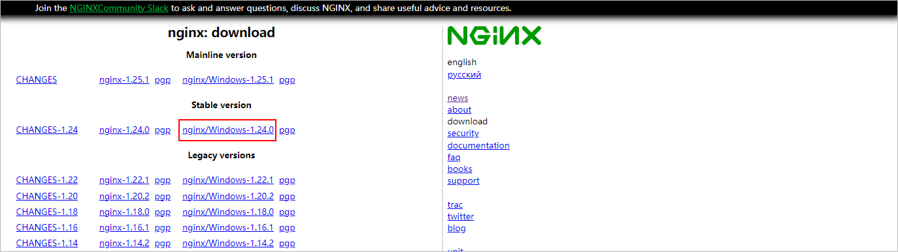 

在本项目中，我们所学习的Nginx选择的是windows版本的稳定版本的1.24.0这个版本，我们可以直接从官网下载，当然在我们的课程资料中也已经提

供了该版本的安装包。

### 2.2.2 下载

windows版本的nginx安装比较简单，只需要将其解压到一个不带中文的目录下即可。

## 2.3 目录结构

安装完Nginx后，我们可以切换到Nginx的安装目录，先来熟悉一下Nginx的目录结构，如下图：

 

重点目录和文件如下: 

| 目录/文件       | 说明                                | 备注                                                      |
| --------------- | ----------------------------------- | --------------------------------------------------------- |
| conf            | 配置文件的存放目录                  |                                                           |
| conf/nginx.conf | Nginx的核心配置文件                 | conf下有很多nginx的配置文件，我们主要操作这个核心配置文件 |
| html            | 存放静态资源(html, css, )           | 部署到Nginx的静态资源都可以放在html目录中                 |
| logs            | 存放nginx日志(访问日志、错误日志等) |                                                           |
| nginx.exe       | 二进制文件，用于启动、停止Nginx服务 |                                                           |

## 2.4 常用命令

Nginx中，我们的二进制可执行文件就是nginx.exe，虽然只有一个可执行文件，但是我们可以通过该指令配合不同的参数达到更加强大的功能。接下

来，我们就演示一下Nginx常见指令, 在执行下面的指令时,都需要在nginx的安装目录下执行。

常用命令如下所示：

```shell
./nginx -v     						# 查看nginx的版本
./nginx -t							# 检测配置文件
./nginx								# 启动nginx、nginx启动成功以后会有两个进程， 也可以通过直接双击exe文件进行启动
```

nginx启动成功以后，我们可以直接访问Nginx的80端口， http://localhost

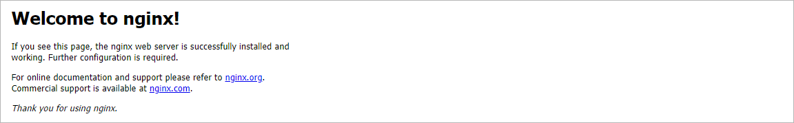 

```shell
./nginx -s stop                   # 停止nginx服务
./nginx -s reload				  # 重新加载nginx的配置文件
```

## 2.5 Nginx应用

介绍了并安装了Nginx之后，本章节将要讲解的是Nginx的使用，我们主要从以下四个方面进行讲解。

### 2.5.1 配置文件结构

nginx的配置文件(conf/nginx.conf)整体上分为三部分: 全局块、events块、http块。这三块的分别配置什么样的信息呢，看下表： 

| 区域     | 职责                                     |
| -------- | ---------------------------------------- |
| 全局块   | 配置和nginx运行相关的全局配置            |
| events块 | 配置和网络连接相关的配置                 |
| http块   | 配置代理、缓存、日志记录、虚拟主机等配置 |

具体结构图如下: 

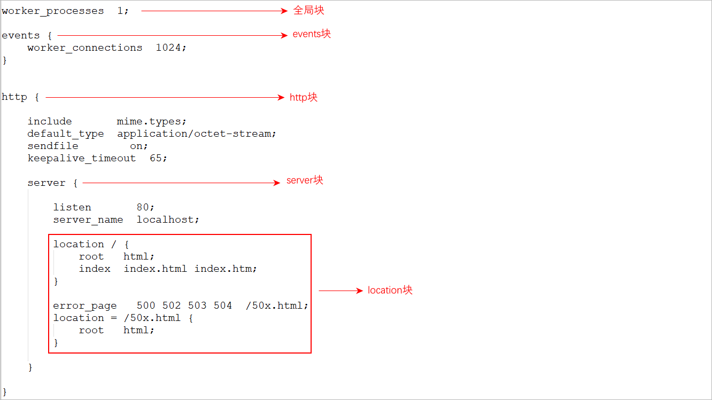 

注意：在全局块、events块以及http块中，我们经常配置的是http块。在http块中可以包含多个server块,每个server块可以配置多个location块。

### 2.5.2 部署静态资源

#### 概念介绍

Nginx可以作为静态web服务器来部署静态资源。这里所说的静态资源是指在服务端真实存在，并且能够直接展示的一些文件，比如常见的html页面、

css文件、js文件、图片、视频等资源。

相对于Tomcat，**Nginx处理静态资源的能力更加高效**，所以在生产环境下，一般都会将静态资源部署到Nginx中。

将静态资源部署到Nginx非常简单，只需要将文件复制到Nginx安装目录下的html目录中即可。

```properties
server {
    listen 80;				#监听端口	
    server_name localhost;	#服务器名称
    location / {			#匹配客户端请求url
        root html;			#指定静态资源根目录
        index index.html;	#指定默认首页
    }
}
```

在资料中，我们提供了一个静态的html文件，我们需要将这个文件部署到nginx中，然后通过nginx访问html静态资源。

#### 案例演示

在资料中，我们提供了一个静态的html文件，我们需要将这个文件部署到nginx中，然后通过nginx访问html静态资源。

1、将静态资源复制到 nginx安装目录的html目录中

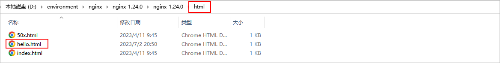 

2、启动nginx

3、打开浏览器进行访问：输入http://localhost/hello.html。

4、配置首页，当输入http://localhost地址的时候，默认访问的首页，首页的配置如下所示：

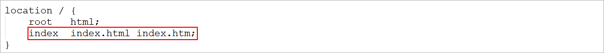 

如果我们需要将hello.html作为nginx的首页，可以修改location的index指令，配置为hello.html，如下：

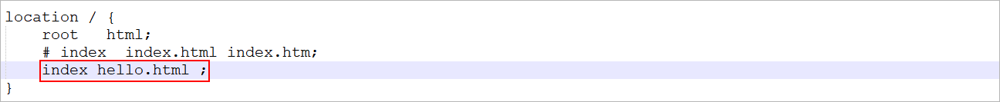 

配置完毕后，我们可以通过指令，来检查配置文件是否配置正确： nginx -t

 

配置文件修改了，我们需要重新加载一下，才可以生效： 

```shell
nginx.exe -s reload
```

5、访问：http://localhost

 

### 2.5.3 反向代理

#### 概念介绍

> 正向代理

正向代理服务器是一个位于客户端和原始服务器(origin server)之间的服务器，为了从原始服务器取得内容，客户端向代理发送一个请求并指定目标

(原始服务器)，然后代理向原始服务器转交请求并将获得的内容返回给客户端。

正向代理的典型用途是为在防火墙内的局域网客户端提供访问Internet的途径。

正向代理一般是**在客户端设置代理服务器**，通过代理服务器转发请求，最终访问到目标服务器。在使用代理服务器的时候需要在客户端进行代理服务

器地址的相关配置。

 

> 反向代理

反向代理服务器位于用户与目标服务器之间，但是对于用户而言，反向代理服务器就相当于目标服务器，即用户直接访问反向代理服务器就可以获得目

标服务器的资源，反向代理服务器负责将请求转发给目标服务器。用户不需要知道目标服务器的地址，也无须在用户端作任何设定，对于用户来说，访

问反向代理服务器是完全无感知的。

 

那么在本小节，我们就是要使用nginx来作为反向代理服务器使用。 在nginx中，我们可以在nginx.conf中配置反向代理: 

```properties
server {
    listen 82;
    server_name localhost;
    location / {
        proxy_pass http://localhost:8081; 	# 反向代理配置，将请求转发到指定服务[网关服务]
    }
}
```

上述配置的含义为: 当我们访问nginx的82端口时，根据反向代理配置，会将请求转发到 http://localhost:8081 对应的服务上。

#### 案例演示

1、整体访问流程介绍

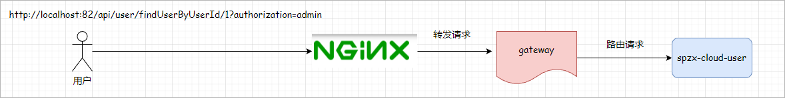 

2、启动相关微服务(spzx-cloud-gateway、spzx-cloud-user)

 

3、在nginx中配置反向代理

找到nginx的配置文件nginx.conf，在http块中,再添加一个server块虚拟主机的配置,监听82端口,并配置反向代理**proxy_pass**: 

```properties
server {
    listen 82;
    server_name localhost;
    location / {
        proxy_pass http://localhost:8081; 	# 反向代理配置，将请求转发到指定服务[网关服务]
    }
}
```

4、检查配置文件，并重新加载

```shell
nginx -t   				# 检查配置文件是否正确
nginx -s reload			# 重新加载配置文件
```

5、访问： [localhost:82/api/user/findUserByUserId/1?authorization=admin](http://localhost:82/api/user/findUserByUserId/1?authorization=admin)

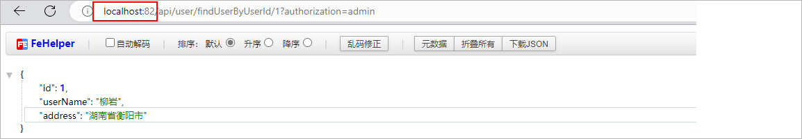 

### 2.5.4 负载均衡

#### 概念介绍

早期的网站流量和业务功能都比较简单，单台服务器就可以满足基本需求，但是随着互联网的发展，业务流量越来越大并且业务逻辑也越来越复杂，单

台服务器的性能及单点故障问题就凸显出来了，因此需要多台服务器组成应用集群，进行性能的水平扩展以及避免单点故障出现。

**应用集群：**将同一应用部署到多台机器上，组成应用集群，接收负载均衡器分发的请求，进行业务处理并返回响应数据

**负载均衡器：**将用户请求根据对应的负载均衡算法分发到应用集群中的一台服务器进行处理

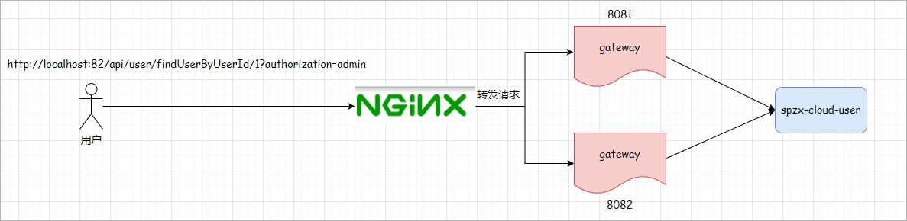  

此处的负载均衡器，我们将会使用Nginx来实现，而Nginx的负载均衡是基于反向代理的，只不过此时所代理的服务器不是一台，而是多台。

#### 案例演示

1、启动两个spzx-cloud-gateway服务，端口号分别是8081和8082，可以通过配置启动参数进行实现：-Dserver.port=8081

 

2、在nginx中配置负载均衡

打开nginx的配置文件nginx.conf并增加如下配置: 

```properties
#upstream指令可以定义一组服务器
upstream targetserver{	
    server localhost:8081;
    server localhost:8082;
}

server {
    listen       83;
    server_name  localhost;
    location / {
        proxy_pass http://targetserver;
    }
}
```

3、检查配置文件，并重新加载

```shell
nginx -t   				# 检查配置文件是否正确
nginx -s reload			# 重新加载配置文件
```

4、测试时,我们直接访问nginx的8080端口(http://localhost:83/api/user/findUserByUserId/1?authorization=admin), 此时nginx会根据负载均衡

策略,将请求转发到后面的两台服务器。

#### 负载均衡算法

##### 常见算法介绍

在nginx中提供了很多的负载均衡算法，常见的负载均衡算法如下所示：

| **名称**    | **说明**         | 特点                                                         |
| ----------- | ---------------- | ------------------------------------------------------------ |
| round robin | 轮询方式         | 默认的负载均衡算法，按照请求的顺序依次分配给后端服务器。     |
| random      | 随机             | 随机选择一个后端服务器来处理请求                             |
| url_hash    | 依据url分配方式  | 根据客户端请求url的hash值，来分发请求, 同一个url请求, 会发转发到同一个服务器上 |
| ip_hash     | 依据ip分配方式   | 根据客户端请求的IP地址计算hash值， 根据hash值来分发请求, 同一个IP发起的请求, 会发转发到同一个服务器上 |
| weight      | 权重方式         | 根据权重分发请求,权重大的分配到请求的概率大                  |
| least_conn  | 依据最少连接方式 | 哪个服务器当前处理的连接少, 请求优先转发到这台服务器         |

##### random算法

```properties
#upstream指令可以定义一组服务器
upstream targetserver {
	random;
    server localhost:8081;
    server localhost:8082;
}
```

##### url_hash算法

```properties
#upstream指令可以定义一组服务器
upstream targetserver {
	hash $request_uri;
    server localhost:8081;
    server localhost:8082;
}
```

##### ip_hash算法

```properties
#upstream指令可以定义一组服务器
upstream targetserver {
	ip_hash;
    server localhost:8081;
    server localhost:8082;
}
```

##### weight算法

```properties
#upstream指令可以定义一组服务器
upstream targetserver {
    server localhost:8081 weight=5;
    server localhost:8082 weight=1; 
}
```

##### least_conn算法

```properties
#upstream指令可以定义一组服务器
upstream targetserver {
	least_conn;
    server localhost:8081 ;
    server localhost:8082 ; 
}
```

