# 1 尚品甄选H5介绍

本章讲解尚品甄选H5端介绍。

## 1.1 业务功能介绍

首页、商品分类查询、关键字查询、商品详情、注册、登录、购物车模块、用户收货地址管理、订单模块、支付...

项目演示地址：http://spzx.atguigu.cn/

## 1.2 系统架构

服务器端架构：SpringBoot3 + Spring Cloud + Spring Cloud Alibaba(Nacos/Sentinel) + MyBatis + Redis + Mysql

前端架构：Uni-App

## 1.3 前端H5开发说明

前端H5部分我们不需要开发，我们只需要根据接口文档开发微服务接口，然后对接到写好的前端H5即可

导入课程资料：spzx-h5

**部署spzx-h5:**

1、docker部署nignx

```shell
#拉取镜像
docker pull nginx:latest

#运行nginx镜像
docker run -d -p 80:80 \
--name nginx-spzx \
-v nginx_html:/usr/share/nginx/html \
-v nginx_conf:/etc/nginx/ \
-v nginx_logs:/var/log/nginx  nginx

# nginx-spzx容器的管理命令
docker start nginx-spzx			# 启动容器
docker stop nginx-spzx			# 关闭容器
docker rm nginx-spzx			# 删除容器

#使用浏览器访问测试：http://ip
```

2、部署spzx-h5

删除/var/lib/docker/volumes/nginx_html/_data目录下的文件，将spzx-h5目录下的文件上传到该目录下。

浏览器访问：http://ip，打开手机模式

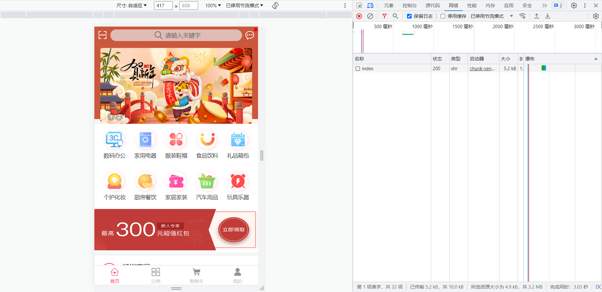

3、H5调用本地接口设置

我的 => 设置 =》 接口base路径，改为本地网关地址：http://IP:端口

注意：http://139.198.163.91:8400为云服务接口地址

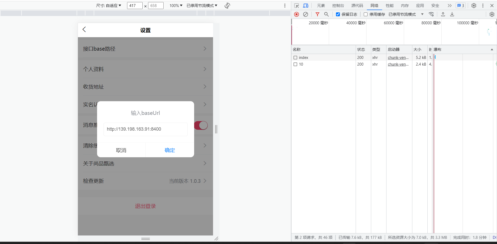

# 2 搭建项目环境

本章讲解在spzx-parent基础上搭建尚品甄选H5端微服务开发环境。

## 2.1 项目结构说明

尚品甄选H5端微服务项目结构如下所示：

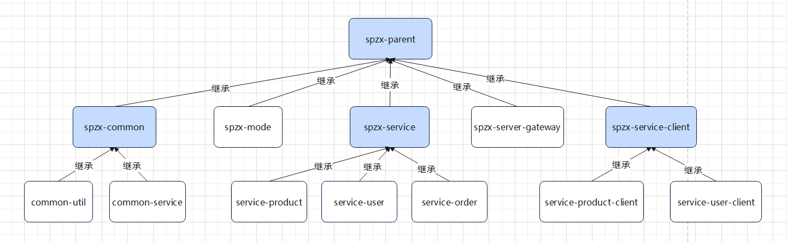

模块说明：

spzx-parent： 尚品甄选项目的父工程，进行项目依赖的统一管理，打包方式为pom

​	spzx-common:  尚品甄选项目公共模块的管理模块

​		common-util:    工具类模块

​		common-service：公共服务模块

​	spzx-model:  尚品甄选项目实体类模块

​	spzx-manager： 尚品甄选项目后台管理系统的后端服务（忽略、前面已讲）

​	spzx-server-gateway： 尚品甄选项目的网关

​	spzx-service： 尚品甄选微服务模块的父工程

​		service-product：商品微服务模块

​		service-user：用户微服务模块

​		service-order：订单微服务模块

​	spzx-service-client： 尚品甄选微服务模块**远程调用接口**的父工程

​		service-product-client：商品微服务远程调用接口模块

​		service-user-client：用户微服务远程调用接口模块

## 2.2 模块依赖说明

模块之间的依赖关系如下图所示：

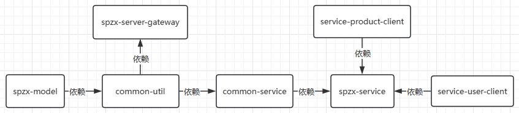   

对应说明：

1、common-service依赖common-util、spzx-mode

2、spzx-service依赖common-service、service-product-client、service-user-client

3、spzx-server-gateway依赖common-util、spzx-mode


## 2.3 环境说明

本次项目开发的时候所使用的软件环境版本如下所示：

| 软件名称                    | 版本说明            |
| --------------------------- | ------------------- |
| jdk                         | jdk17               |
| spring boot                 | 3.0.5               |
| spring cloud                | 2022.0.2            |
| spring cloud alibaba        | 2022.0.0.0-RC2      |
| redis                       | 7.0.10              |
| mybaits-spring-boot-starter | 3.0.1               |
| mysql                       | 8.0.29              |
| idea                        | 2022.2.2            |
| nacos server                | 2.2.1               |
| sentinel dashboard          | 2.0.0-alpha-preview |

## 2.4 项目模块创建

### 2.4.1 spzx-parent

添加微服务依赖：

```xml
<properties>
    ...

    <cloud.version>2022.0.2</cloud.version>
    <alibaba.version>2022.0.0.0-RC2</alibaba.version>
    <alipay.version>4.8.73.ALL</alipay.version>
</properties>

<!-- 管理依赖，版本锁定 -->
<dependencyManagement>

    <dependencies>
        <dependency>
            <groupId>org.springframework.cloud</groupId>
            <artifactId>spring-cloud-dependencies</artifactId>
            <version>${cloud.version}</version>
            <type>pom</type>
            <scope>import</scope>
        </dependency>
        <dependency>
            <groupId>com.alibaba.cloud</groupId>
            <artifactId>spring-cloud-alibaba-dependencies</artifactId>
            <version>${alibaba.version}</version>
            <type>pom</type>
            <scope>import</scope>
        </dependency>
        <!--导入支付宝支付sdk-->
        <dependency>
            <groupId>com.alipay.sdk</groupId>
            <artifactId>alipay-sdk-java</artifactId>
            <version>${alipay.version}</version>
        </dependency>

        ...
    </dependencies>
</dependencyManagement>
```

### 2.4.2 spzx-service

在spzx-parent下面创建该子模块，并导入如下依赖：

```xml
<dependencies>
    
    <dependency>
        <groupId>com.atguigu.spzx</groupId>
        <artifactId>common-service</artifactId>
        <version>1.0-SNAPSHOT</version>
    </dependency>

    <!-- mybatis的起步依赖 -->
    <dependency>
        <groupId>org.mybatis.spring.boot</groupId>
        <artifactId>mybatis-spring-boot-starter</artifactId>
    </dependency>

    <!-- mysql驱动 -->
    <dependency>
        <groupId>mysql</groupId>
        <artifactId>mysql-connector-java</artifactId>
    </dependency>

    <dependency>
        <groupId>org.springframework.boot</groupId>
        <artifactId>spring-boot-configuration-processor</artifactId>
        <optional>true</optional>
    </dependency>

    <dependency>
        <groupId>com.github.pagehelper</groupId>
        <artifactId>pagehelper-spring-boot-starter</artifactId>
    </dependency>

    <!-- 服务注册 -->
    <dependency>
        <groupId>com.alibaba.cloud</groupId>
        <artifactId>spring-cloud-starter-alibaba-nacos-discovery</artifactId>
    </dependency>

    <!-- 流量控制 -->
    <dependency>
        <groupId>com.alibaba.cloud</groupId>
        <artifactId>spring-cloud-starter-alibaba-sentinel</artifactId>
    </dependency>
    
</dependencies>
```

注意：删除src目录

### 2.4.43 service-product

在spzx-service下面创建子模块service-product.在service-product服务的src/resources目录下创建application.yml、application-dev.yml文件，文

件的内容如下所示：

application.yml

```yml
spring:
  profiles:
    active: dev
```

application-dev.yml

```yml
server:
  port: 8511

spring:
  application:
    name: service-product
  cloud:
    nacos:
      discovery:
        server-addr: 192.168.136.142:8848
    sentinel:
      transport:
        dashboard: localhost:8080
  datasource:
    type: com.zaxxer.hikari.HikariDataSource
    driver-class-name: com.mysql.cj.jdbc.Driver
    url: jdbc:mysql://192.168.136.142:3306/db_spzx?serverTimezone=UTC&characterEncoding=utf8&useUnicode=true&useSSL=true
    username: root
    password: 1234

mybatis:
  config-location: classpath:mybatis-config.xml
  mapper-locations: classpath:mapper/*/*.xml
```

导入课程资料中提供的：logback-spring.xml配置文件，修改输出路径：

```xml
<property name="log.path" value="D://logs//service-product//logs" />
```


启动类创建

```java
package com.atguigu.spzx.product;

@SpringBootApplication
public class ProductApplication {

    public static void main(String[] args) {
        SpringApplication.run(ProductApplication.class, args);
    }

}
```

## 2.5 导入接口文档

将课程资料中所提供的接口文档(OpenAPI文件夹下的json文件)导入到Apifox中，具体步骤如下所示：

1、在Apifox中创建项目

2、进入项目 ----> 项目设置  ----> 导入数据 -----> 点击或者拖拽文件到本区域导入

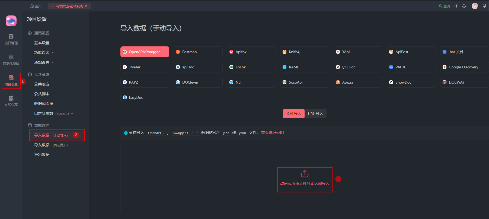 

3、导出完毕以后可以在接口中管理中看到对应的接口信息

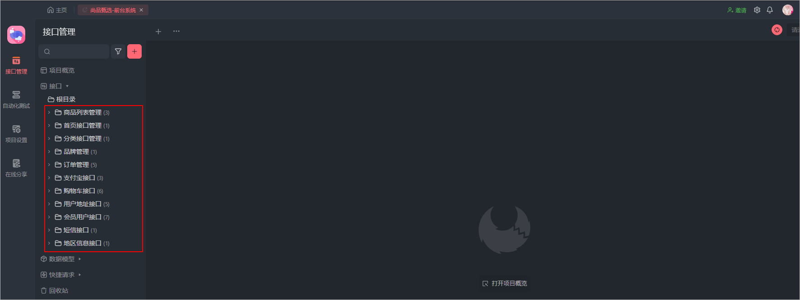 

# 3 首页接口开发

## 3.1 需求分析

需求说明：在前台系统首页展示商品一级分类数据以及畅销商品列表数据，如下所示：

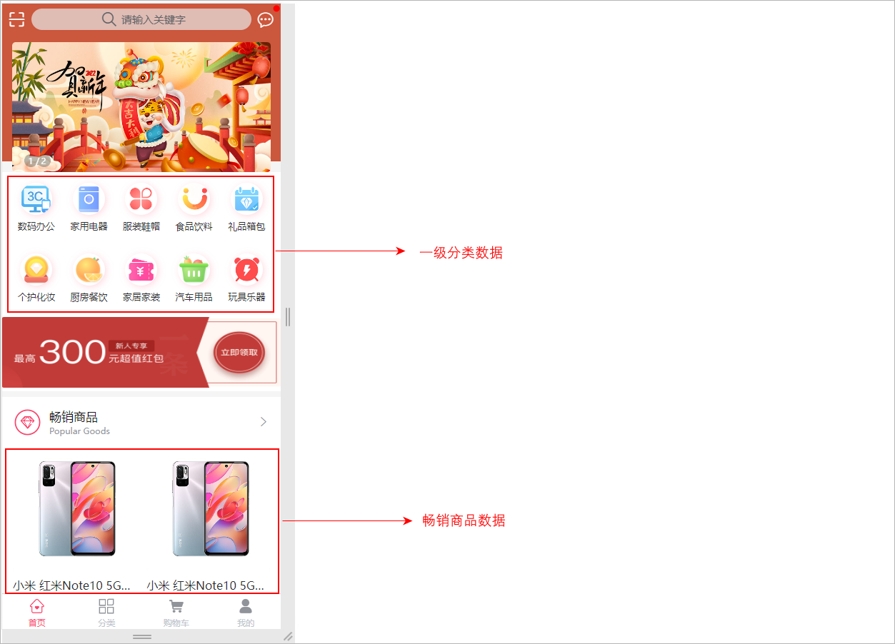 

需求分析：

商品一级分类：查询category表，获取parent_id="0"的数据列表

畅销商品列表：查询product_sku表，根据sale_num字段排序，取前20条数据列表 


整体的访问流程如下所示：

  

## 3.3 接口开发

对比着接口文档进行相关接口的开发。

**查看接口文档：**

首页接口地址及示例数据

```json
get  /api/product/index
返回结果：
{
    "code": 200,
    "message": "成功",
    "data": {
        "productSkuList": [
            {
                "id": 1,
                "createTime": "2023-05-25 22:21:07",
                "skuCode": "1_0",
                "skuName": "小米 红米Note10 5G手机 颜色:白色 内存:8G",
                "productId": 1,
                "thumbImg": "http://139.198.127.41:9000/spzx/20230525/665832167-5_u_1 (1).jpg",
                "salePrice": 1999.00,
                "marketPrice": 2019.00,
                "costPrice": 1599.00,
                "stockNum": 99,
                "saleNum": 1,
                "skuSpec": "颜色:白色,内存:8G",
                "weight": "1.00",
                "volume": "1.00",
                "status": null,
                "skuSpecList": null
            },
            ...
        ],
        "categoryList": [
            {
                "id": 1,
                "createTime": "2023-05-22 23:30:28",
                "name": "数码办公",
                "imageUrl": "https://lilishop-oss.oss-cn-beijing.aliyuncs.com/230f48f024a343c6be9be72597c2dcd0.png",
                "parentId": 0,
                "status": 1,
                "orderNum": 1,
                "hasChildren": null,
                "children": null
            },
            ...
        ]
    }
}
```

### 3.3.1 IndexVo

定义一个实体类来封装要给前端详细的数据，如下所示：

```java
// com.atguigu.spzx.model.vo.h5;
@Data
public class IndexVo {

    private List<Category> categoryList ;       // 一级分类的类别数据
    private List<ProductSku> productSkuList ;   // 畅销商品列表数据

}
```

### 3.3.2 IndexController

操作模块：service-product

表现层代码：

```java
// com.atguigu.spzx.product.controller;

@Tag(name = "首页接口管理")
@RestController
@RequestMapping(value="/api/product/index")
@SuppressWarnings({"unchecked", "rawtypes"})
public class IndexController {

   @Autowired
   private CategoryService categoryService;

   @Autowired
   private ProductService productService;

   @Operation(summary = "获取首页数据")
   @GetMapping
   public Result<IndexVo> findData(){
      List<Category> categoryList = categoryService.findOneCategory();
      List<ProductSku> productSkuList = productService.findProductSkuBySale();
      IndexVo indexVo = new IndexVo() ;
      indexVo.setCategoryList(categoryList);
      indexVo.setProductSkuList(productSkuList);
      return Result.build(indexVo , ResultCodeEnum.SUCCESS);
   }

}
```

### 3.3.3 商品一级分类接口

#### CategoryService

业务层代码实现

```java
// 业务接口
public interface CategoryService {

    List<Category> findOneCategory();

}

// 接口实现类
@Service
public class CategoryServiceImpl implements CategoryService {

	@Autowired
	private CategoryMapper categoryMapper;

    @Override
    public List<Category> findOneCategory() {
        return categoryMapper.findOneCategory();
    }
}
```

#### CategoryMapper

持久层代码实现

```java
@Mapper
public interface CategoryMapper {

    List<Category> findOneCategory();
}
```

#### CategoryMapper.xml

在映射文件中定义对应的sql语句

```xml
<?xml version="1.0" encoding="UTF-8" ?>
<!DOCTYPE mapper PUBLIC "-//mybatis.org//DTD Mapper 3.0//EN" "http://mybatis.org/dtd/mybatis-3-mapper.dtd">


<mapper namespace="com.atguigu.spzx.product.mapper.CategoryMapper">

   <resultMap id="categoryMap" type="com.atguigu.spzx.model.entity.product.Category" autoMapping="true">
   </resultMap>
   
   <!-- 用于select查询公用抽取的列 -->
   <sql id="columns">
      id,name,image_url,parent_id,status,order_num,create_time,update_time,is_deleted
   </sql>

   <select id="findOneCategory" resultMap="categoryMap">
      select <include refid="columns" />
      from category
      where
          parent_id = 0
         and status = 1
         and is_deleted = 0
      order by order_num
   </select>

</mapper>
```

### 3.3.4 畅销商品列表接口

#### ProductService

业务层代码实现

```java
// 业务接口
public interface ProductService {

    List<ProductSku> findProductSkuBySale();

}

// 接口实现类
@Service
public class ProductServiceImpl implements ProductService {

    @Autowired
    private ProductSkuMapper productSkuMapper;

    @Override
    public List<ProductSku> findProductSkuBySale() {
        return productSkuMapper.findProductSkuBySale();
    }
}
```

#### ProductSkuMapper

持久层代码实现

```java
@Mapper
public interface ProductSkuMapper {

    List<ProductSku> findProductSkuBySale();
}
```

#### ProductSkuMapper.xml

在映射文件中定义对应的sql语句

```xml
<?xml version="1.0" encoding="UTF-8" ?>
<!DOCTYPE mapper PUBLIC "-//mybatis.org//DTD Mapper 3.0//EN" "http://mybatis.org/dtd/mybatis-3-mapper.dtd">

<mapper namespace="com.atguigu.spzx.product.mapper.ProductSkuMapper">

   <resultMap id="productSkuMap" type="com.atguigu.spzx.model.entity.product.ProductSku" autoMapping="true">
   </resultMap>
   
   <!-- 用于select查询公用抽取的列 -->
   <sql id="columns">
      id,sku_code,sku_name,product_id,thumb_img,sale_price,market_price,cost_price,stock_num,sale_num,sku_spec,weight,volume,status,create_time,update_time,is_deleted
   </sql>

   <select id="findProductSkuBySale" resultMap="productSkuMap">
      select
          sku.id,sku.sku_code,sku.sku_name,sku.product_id,sku.thumb_img,sku.sale_price,sku.market_price,sku.cost_price,sku.stock_num,sku.sale_num,sku.sku_spec,sku.weight,sku.volume,sku.status,sku.create_time,sku.update_time,sku.is_deleted
      from product_sku sku
         left join product p on p.id = sku.product_id
      where
         p.status = 1
         and p.audit_status = 1
         and sku.is_deleted = 0
         and p.is_deleted = 0
         order by sku.sale_num desc
      limit 20
   </select>

</mapper>
```

### 3.3.5 Knife4j调试接口

#### 配置前端H5接口

在common-service模块Knife4jConfig类添加配置信息：

```java
@Bean
public GroupedOpenApi webApi() {      // 创建了一个api接口的分组
    return GroupedOpenApi.builder()
            .group("web-api")         // 分组名称
            .pathsToMatch("/api/**")  // 接口请求路径规则
            .build();
}
```

#### Knife4j调试首页接口

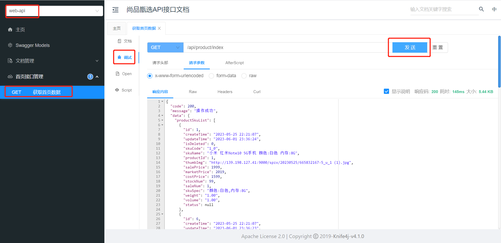

#### H5对接本地接口

启动nginx，访问：http://ip

我的 => 设置 =》 接口base路径，改为本地网关地址：http://IP:端口

请求

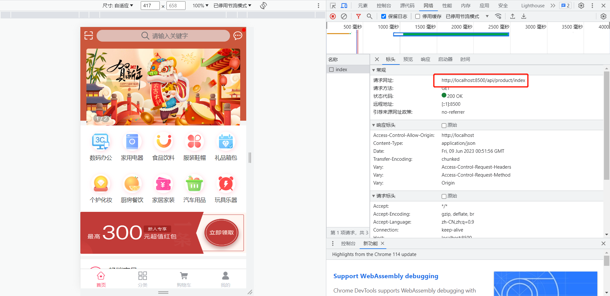

数据

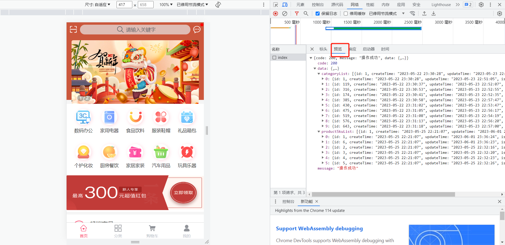

### 3.3.6 接口测试

测试方向：

1、后端接口单独测试

2、配合前端项目测试

后端地址配置：

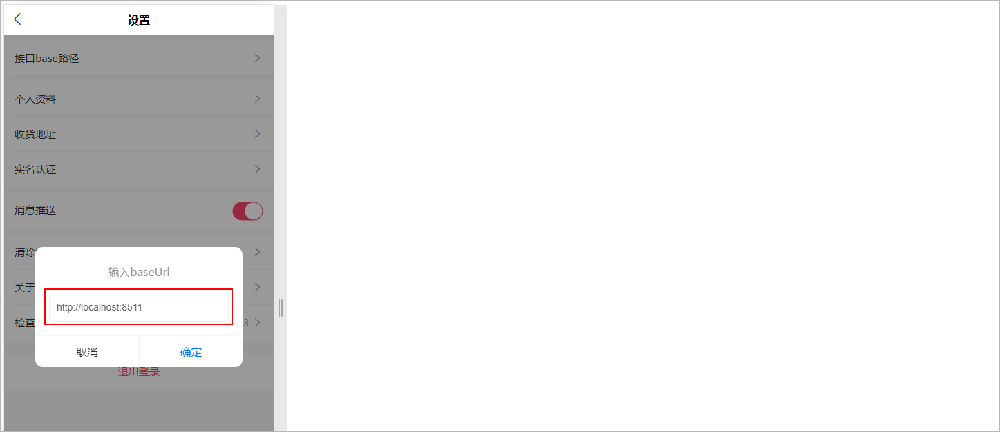 

解决跨域问题：在IndexController类上添加**@CrossOrigin**注解接口跨域问题

# 4 分类接口开发

## 4.1 需求分析

需求说明：当用户点击分类导航按钮的时候，那么此时就需要将系统中所对应的所有的分类数据查询出来，如下所示：

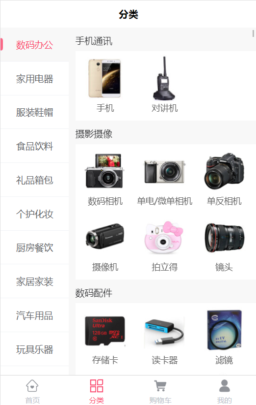 

展示全部商品三级联动的分类数据，查询category数据表


需求分析：分类数据是来自于category表，因此只需要查询出该表中的数据即可，要访问该表就需要通过spzx-manager服务进行访问，因此整体的调

用流程如下所示：

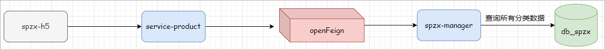 


**查看接口文档：**

分类数据接口地址及示例数据

```json
get  /api/product/category/findCategoryTree
返回结果：
{
    "code": 200,
    "message": "成功",
    "data": [
        {
            "id": 1,
            "createTime": "2023-05-22 23:30:28",
            "name": "数码办公",
            "imageUrl": "https://lilishop-oss.oss-cn-beijing.aliyuncs.com/230f48f024a343c6be9be72597c2dcd0.png",
            "parentId": 0,
            "status": 1,
            "orderNum": 1,
            "hasChildren": null,
            "children": [
                {
                    "id": 2,
                    "createTime": "2023-05-22 23:30:28",
                    "name": "手机通讯",
                    "imageUrl": "",
                    "parentId": 1,
                    "status": 1,
                    "orderNum": 0,
                    "hasChildren": null,
                    "children": [
                        {
                            "id": 3,
                            "createTime": "2023-05-22 23:30:28",
                            "name": "手机",
                            "imageUrl": "https://lilishop-oss.oss-cn-beijing.aliyuncs.com/1348576427264204943.png",
                            "parentId": 2,
                            "status": 1,
                            "orderNum": 0,
                            "hasChildren": null,
                            "children": null
                        },
                        {
                            "id": 4,
                            "createTime": "2023-05-22 23:30:28",
                            "name": "对讲机",
                            "imageUrl": "https://lilishop-oss.oss-cn-beijing.aliyuncs.com/1348576427264204944.png",
                            "parentId": 2,
                            "status": 1,
                            "orderNum": 0,
                            "hasChildren": null,
                            "children": null
                        },
                        ...
                    ]
                },
                ...
            ]
        },
        ...
    ]
}
```

## 4.2 接口开发

操作模块：service-product

### 4.2.1 CategoryController

表现层代码：

```java
@Tag(name = "分类接口管理")
@RestController
@RequestMapping(value="/api/product/category")
@SuppressWarnings({"unchecked", "rawtypes"})
public class CategoryController {
   
   @Autowired
   private CategoryService categoryService;

   @Operation(summary = "获取分类树形数据")
   @GetMapping("findCategoryTree")
   public Result<List<Category>> findCategoryTree(){
      List<Category> list = categoryService.findCategoryTree();
      return Result.build(list,  ResultCodeEnum.SUCCESS);
   }

}
```

### 4.2.2 CategoryService

业务层代码实现

```java
// 业务接口
List<Category> findCategoryTree();

// 接口实现类
@Override
public List<Category> findCategoryTree() {
    List<Category> categoryList = categoryMapper.findAll();
    //全部一级分类
    List<Category> oneCategoryList = categoryList.stream().filter(item -> item.getParentId().longValue() == 0).collect(Collectors.toList());
    if(!CollectionUtils.isEmpty(oneCategoryList)) {
        oneCategoryList.forEach(oneCategory -> {
            List<Category> twoCategoryList = categoryList.stream().filter(item -> item.getParentId().longValue() == oneCategory.getId().longValue()).collect(Collectors.toList());
            oneCategory.setChildren(twoCategoryList);
            if(!CollectionUtils.isEmpty(twoCategoryList)) {
                twoCategoryList.forEach(twoCategory -> {
                    List<Category> threeCategoryList = categoryList.stream().filter(item -> item.getParentId().longValue() == twoCategory.getId().longValue()).collect(Collectors.toList());
                    twoCategory.setChildren(threeCategoryList);
                });
            }
        });
    }
    return oneCategoryList;
}
```

### 4.2.3 CategoryMapper

持久层代码实现

```java
List<Category> findAll();
```

### 4.2.4 CategoryMapper.xml

在映射文件中定义对应的sql语句

```xml
<select id="findAll" resultMap="categoryMap">
   select <include refid="columns" />
   from category
   where
   status = 1
   and is_deleted = 0
   order by order_num
</select>
```

### 4.2.5 接口测试

测试方向：

1、后端接口单独测试

2、配合前端项目测试

# 5 网关服务搭建

## 5.1 网关服务说明

后期针对前台系统会创建很多个后端微服务，前端在访问后端微服务的时候需要通过服务网关进行访问，如下图所示：

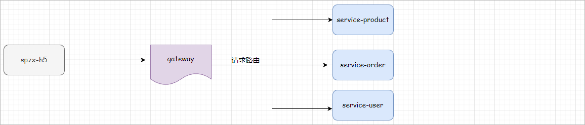 

## 5.2 服务网关搭建

步骤：

1、在spzx-parent项目下创建一个spzx-server-gateway模块，并加入依赖

```xml
<dependencies>

    <dependency>
        <groupId>com.atguigu.spzx</groupId>
        <artifactId>common-util</artifactId>
        <version>1.0-SNAPSHOT</version>
    </dependency>

    <dependency>
        <groupId>com.atguigu.spzx</groupId>
        <artifactId>spzx-model</artifactId>
        <version>1.0-SNAPSHOT</version>
    </dependency>

    <dependency>
        <groupId>org.springframework.cloud</groupId>
        <artifactId>spring-cloud-starter-gateway</artifactId>
    </dependency>

    <!-- loadbalancer依赖 -->
    <dependency>
        <groupId>org.springframework.cloud</groupId>
        <artifactId>spring-cloud-loadbalancer</artifactId>
    </dependency>

    <!-- 服务注册 -->
    <dependency>
        <groupId>com.alibaba.cloud</groupId>
        <artifactId>spring-cloud-starter-alibaba-nacos-discovery</artifactId>
    </dependency>

    <!-- 服务保护组件 -->
    <dependency>
        <groupId>com.alibaba.cloud</groupId>
        <artifactId>spring-cloud-starter-alibaba-sentinel</artifactId>
    </dependency>

</dependencies>
```

2、在classpath路径下编写两个配置文件：application.yml、application-dev.yml，文件内容分别如下所示：

application.yml文件内容：

```yml
spring:
  profiles:
    active: dev
```

application-dev.yml文件内容：

```yml
server:
  port: 8500
spring:
  application:
    name: spzx-server-gateway
  cloud:
    nacos:
      discovery:
        server-addr: 192.168.136.142:8848
    sentinel:
      transport:
        dashboard: localhost:8080
    gateway:
      discovery: #是否与服务发现组件进行结合，通过 serviceId(必须设置成大写) 转发到具体的服务实例。默认为false，设为true便开启通过服务中心的自动根据 serviceId 创建路由的功能。
        locator: #路由访问方式：http://Gateway_HOST:Gateway_PORT/大写的serviceId/**，其中微服务应用名默认大写访问。
          enabled: true
      globalcors:
        cors-configurations:
          '[/**]':
            allowedOriginPatterns: "*"
            # 允许请求中携带的头信息
            allowedHeaders: "*"
            # 运行跨域的请求方式
            allowedMethods: "*"
            # 跨域检测的有效期,单位s
            maxAge: 36000
      routes:
        - id: service-product
          uri: lb://service-product
          predicates:
            - Path=/*/product/**
```

3、编写启动类

```java
// com.atguigu.spzx.gateway;
@SpringBootApplication
public class GatewayApplication {

    public static void main(String[] args) {
        SpringApplication.run(GatewayApplication.class , args) ;
    }

}
```

4、导入课程资料中提供的：logback-spring.xml配置文件，修改输出路径：

```xml
<property name="log.path" value="D://logs//spzx-server-gateway//logs" />
```

## 5.3 服务网关测试

具体步骤：

1、注释掉service-product微服务两个controller上的@CrossOrigin注解

2、后端地址配置

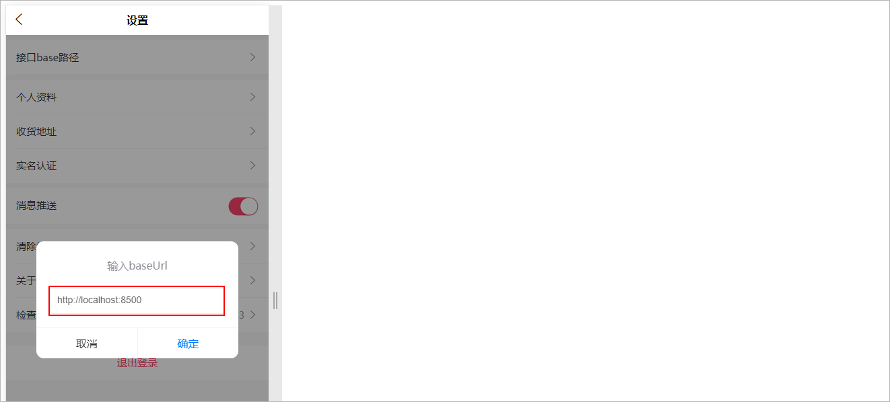 

# 6 Redis缓存

分类数据一般情况下不会做过多的修改，因此可以将分类数据进行缓存，以提高页面的加载速度。

## 6.1 使用缓存

先将首页接口获取一级分类数据缓存

步骤：

1、在service-product微服务中集成Spring Data Redis，如下所示：

在service-product的pom.xml文件中添加如下依赖：

```xml
<!-- redis的起步依赖 -->
<dependency>
    <groupId>org.springframework.boot</groupId>
    <artifactId>spring-boot-starter-data-redis</artifactId>
</dependency>
```

在application-dev.yml文件中添加如下Redis的相关配置：

```yaml
spring:
  # Redis的相关配置
  data:
    redis:
      host: 192.168.136.142
      port: 6379
      password: 1234
```

2、对CategoryServiceImpl的findOneCategory方法进行改造，如下所示：

```java
@Autowired
private RedisTemplate<String , String> redisTemplate ;

@Override
public List<Category> findOneCategory() {

    // 从Redis缓存中查询所有的一级分类数据
    String categoryListJSON = redisTemplate.opsForValue().get("category:one");
    if(!StringUtils.isEmpty(categoryListJSON)) {
        List<Category> categoryList = JSON.parseArray(categoryListJSON, Category.class);
        log.info("从Redis缓存中查询到了所有的一级分类数据");
        return categoryList ;
    }

    List<Category> categoryList = categoryMapper.findOneCategory();
    log.info("从数据库中查询到了所有的一级分类数据");
    redisTemplate.opsForValue().set("category:one" , JSON.toJSONString(categoryList) , 7 , TimeUnit.DAYS);
    return categoryList ;
}
```

3、启动程序进行测试：第一次查询从MySQL数据库获取，第二次查询从Redis获取

**说明**：针对查询所有分类的接口，也可以使用上述思想对分类数据进行缓存。

## 6.2 Spring Cache

### 6.2.1 介绍

**Spring Cache**是一个框架，实现了基于注解的缓存功能，只需要简单地加一个注解，就能实现缓存功能，**大大简化我们在业务中操作缓存的代码**。

Spring Cache只是提供了一层抽象，底层可以切换不同的cache实现。具体就是通过**CacheManager**接口来统一不同的缓存技术。CacheManager是

Spring提供的各种缓存技术抽象接口。


针对不同的缓存技术需要实现不同的CacheManager：

| **CacheManager**    | **描述**                           |
| ------------------- | ---------------------------------- |
| EhCacheCacheManager | 使用EhCache作为缓存技术            |
| GuavaCacheManager   | 使用Google的GuavaCache作为缓存技术 |
| RedisCacheManager   | 使用Redis作为缓存技术              |

### 6.2.2 注解

在SpringCache中提供了很多缓存操作的注解，常见的是以下的几个：

| **注解**       | **说明**                                                     |
| -------------- | ------------------------------------------------------------ |
| @EnableCaching | 开启缓存注解功能                                             |
| @Cacheable     | 在方法执行前spring先查看缓存中是否有数据，如果有数据，则直接返回缓存数据；若没有数据，调用方法并将方法返回值放到缓存中 |
| @CachePut      | 将方法的返回值放到缓存中                                     |
| @CacheEvict    | 将一条或多条数据从缓存中删除                                 |

在spring boot项目中，使用缓存技术只需在项目中导入相关缓存技术的依赖包，并在启动类上使用**@EnableCaching**开启缓存支持即可。

例如，使用Redis作为缓存技术，只需要导入Spring data Redis的maven坐标即可。

### 6.2.3 入门程序

接下来，我们将通过一个入门案例来演示一下SpringCache的常见用法。 上面我们提到，SpringCache可以集成不同的缓存技术，如Redis、Ehcache

本次我们直接使用Redis作为缓存技术。

需求：给spring-cache-demo项目中的查询用户方法添加查询缓存逻辑

具体步骤：

1、打开课程资料中所提供的spring-cache-demo项目

2、在spring-cache-demo项目的pom.xml文件中添加如下依赖

```xml
<dependency>
    <groupId>org.springframework.boot</groupId>
    <artifactId>spring-boot-starter-cache</artifactId>
</dependency>

<dependency>
    <groupId>org.springframework.boot</groupId>
    <artifactId>spring-boot-starter-data-redis</artifactId>
</dependency>
```

3、在application.yml文件中配置Redis的连接信息

```yaml
spring:
  data:
    redis:
      host: 192.168.136.142
      port: 6379
      password: 1234
```

4、配置Redis的key的序列化器

```java
// com.atguigu.spzx.cache.config;
@Configuration
public class RedisConfig {

    @Bean
    public CacheManager cacheManager(LettuceConnectionFactory connectionFactory) {

        //定义序列化器
        GenericJackson2JsonRedisSerializer genericJackson2JsonRedisSerializer = new GenericJackson2JsonRedisSerializer();
        StringRedisSerializer stringRedisSerializer = new StringRedisSerializer();


        RedisCacheConfiguration config = RedisCacheConfiguration.defaultCacheConfig()
                //过期时间600秒
                .entryTtl(Duration.ofSeconds(600))
                // 配置序列化
                .serializeKeysWith(RedisSerializationContext.SerializationPair.fromSerializer(stringRedisSerializer))
                .serializeValuesWith(RedisSerializationContext.SerializationPair.fromSerializer(genericJackson2JsonRedisSerializer));

        RedisCacheManager cacheManager = RedisCacheManager.builder(connectionFactory)
                .cacheDefaults(config)
                .build();

        return cacheManager;
    }

}
```

5、在启动类上添加**@EnableCaching**注解

6、在UserServiceImpl类中的findById方法上添加**@Cacheable**注解

```java
@Override
@Cacheable(value = "userCache" , key = "#userId")
public User findById(Long userId) {
    log.info("用户数据查询成功...");
    User user = new User() ;
    user.setAge(23);
    user.setUserName("尚硅谷");
    return user;
}
```

7、启动程序进行测试：第一次查询时候会打印日志，第二次查询的时候由于Redis中已经存在了数据，因此直接从Redis中进行命中


**@Cacheable 说明**:

1、作用: 在方法执行前，spring先查看缓存中是否有数据，如果有数据，则直接返回缓存数据；若没有数据，调用方法并将方法返回值放到缓存中

2、value: 缓存的名称，每个缓存名称下面可以有多个key

3、key: 缓存的key  ----------> 支持Spring的表达式语言SPEL语法

### 6.2.4 其他注解

#### @CachePut

作用: 将方法返回值，放入缓存

value: 缓存的名称, 每个缓存名称下面可以有很多key

key: 缓存的key  ----------> 支持Spring的表达式语言SPEL语法


当前UserController的save方法是用来保存用户信息的，我们希望在该用户信息保存到数据库的同时，也往缓存中缓存一份数据，我们可以在save方

法上加上注解 @CachePut，用法如下： 

```java
@CachePut(value = "userCache", key = "#user.userName")
public User saveUser(User user) {
    log.info("用户数据保存成功...");
    return user ;
}
```

**key的写法如下**： 

#user.id : #user指的是方法形参的名称, id指的是user的id属性 , 也就是使用user的id属性作为key ;

#user.userName: #user指的是方法形参的名称, name指的是user的name属性 ,也就是使用user的name属性作为key ;

​	

#result.id : #result代表方法返回值，该表达式 代表以返回对象的id属性作为key ；

#result.userName: #result代表方法返回值，该表达式 代表以返回对象的name属性作为key ；

#### @CacheEvict

作用: 清理指定缓存

value: 缓存的名称，每个缓存名称下面可以有多个key

key: 缓存的key  ----------> 支持Spring的表达式语言SPEL语法


当我们在删除数据库user表的数据的时候,我们需要删除缓存中对应的数据,此时就可以使用**@CacheEvict**注解, 具体的使用方式如下: 

```java
@CacheEvict(value = "userCache" , key = "#userId")
public void deleteById(Long userId) {
    log.info("用户数据删除成功...");
}
```

## 6.3 缓存所有分类数据

需求：给查询所有的分类数据添加查询缓存，使用Spring Cache框架

步骤：

1、在service-product服务中的pom.xml文件中添加依赖

```xml
<dependency>
    <groupId>org.springframework.boot</groupId>
    <artifactId>spring-boot-starter-cache</artifactId>
</dependency>
```

2、配置Redis的key的序列化器

```java
// com.atguigu.spzx.cache.config;
@Configuration
public class RedisConfig {

    @Bean
    public CacheManager cacheManager(LettuceConnectionFactory connectionFactory) {

        //定义序列化器
        GenericJackson2JsonRedisSerializer genericJackson2JsonRedisSerializer = new GenericJackson2JsonRedisSerializer();
        StringRedisSerializer stringRedisSerializer = new StringRedisSerializer();


        RedisCacheConfiguration config = RedisCacheConfiguration.defaultCacheConfig()
                //过期时间600秒
                .entryTtl(Duration.ofSeconds(600))
                // 配置序列化
                .serializeKeysWith(RedisSerializationContext.SerializationPair.fromSerializer(stringRedisSerializer))
                .serializeValuesWith(RedisSerializationContext.SerializationPair.fromSerializer(genericJackson2JsonRedisSerializer));

        RedisCacheManager cacheManager = RedisCacheManager.builder(connectionFactory)
                .cacheDefaults(config)
                .build();

        return cacheManager;
    }

}
```

3、在启动类上添加**@EnableCaching**注解

4、在CategoryServiceImpl类中的findCategoryTree方法上添加**@Cacheable**注解

```java
@Cacheable(value = "category" , key = "'all'")
public List<Category> findAllCategory() {
..
    return oneCategoryList;
}
```

5、启动程序进行测试

