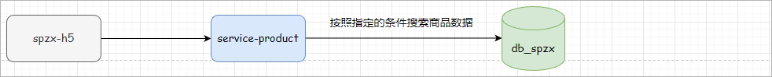
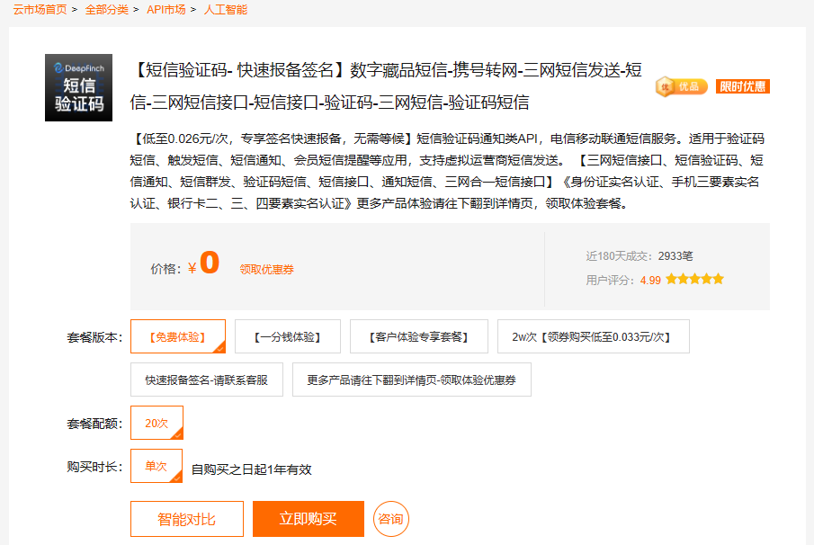
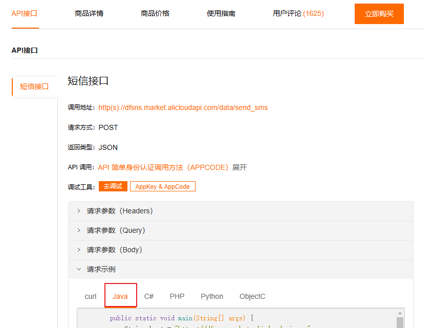
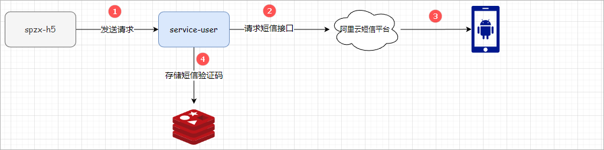
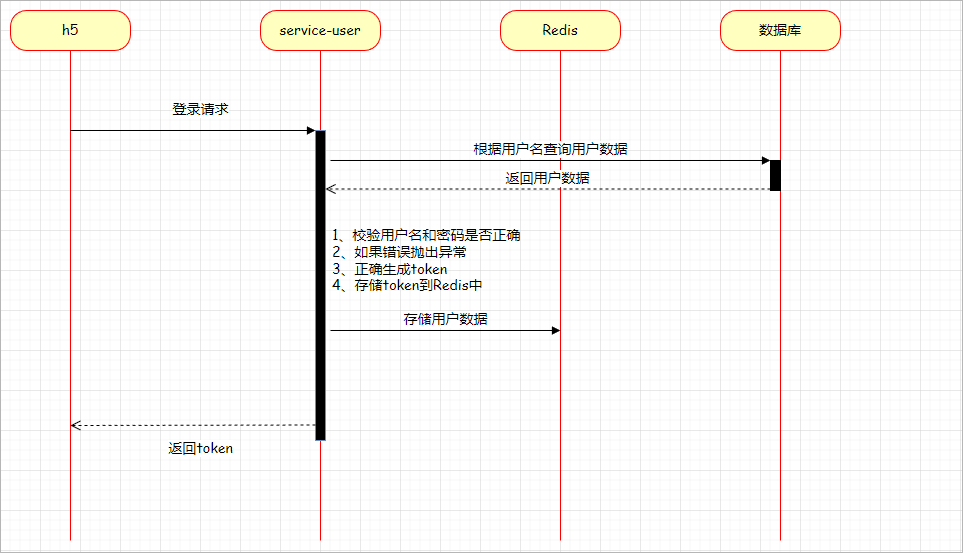

# 1 商品列表

## 1.1 需求说明

进入商品列表有四个入口：

1、点击首页一级分类

2、点击首页关键字搜索

3、分类频道，点击三级分类

4、点击首页畅销商品（商品列表按销量排序展示）

**搜索条件**：关键字、一级分类、三级分类、品牌（获取全部品牌）

**排序**：销量降序、价格升序与降序

效果图如下所示：

 

要完成上述搜索功能需要完成两个接口：

1、查询所有品牌(用于商品列表页面)

2、商品列表搜索

## 1.2 查询所有品牌

### 1.2.1 需求分析

整体的访问流程如下所示：

  

**查看接口文档：**

查询所有品牌数据接口以及示例数据：

```json
get  /api/product/brand/findAll
返回结果：
{
	"code": 200,
	"message": "操作成功",
	"data": [
		{
			"id": 2,
			"createTime": "2023-05-06 01:31:19",
			"updateTime": "2023-06-04 00:37:16",
			"isDeleted": 0,
			"name": "华为",
			"logo": "http://139.198.127.41:9000/sph/20230506/华为.png"
		}
	]
}
```

### 1.2.2 接口开发

#### BrandController

表现层代码：

```java
// com.atguigu.spzx.product.controller;
@Tag(name = "品牌管理")
@RestController
@RequestMapping(value="/api/product/brand")
@SuppressWarnings({"unchecked", "rawtypes"})
public class BrandController {
   
   @Autowired
   private BrandService brandService;
   
   @Operation(summary = "获取全部品牌")
   @GetMapping("findAll")
   public Result<List<Brand>> findAll() {
      List<Brand> list = brandService.findAll();
      return Result.build(list, ResultCodeEnum.SUCCESS);
   }

}
```

#### BrandService

业务层代码实现

```java
// com.atguigu.spzx.product.service;
// 业务接口
public interface BrandService {

    List<Brand> findAll();

}

// 接口实现类
@Service
public class BrandServiceImpl implements BrandService {
    
	@Autowired
	private BrandMapper brandMapper;

	@Cacheable(value = "brandList", unless="#result.size() == 0")
    @Override
    public List<Brand> findAll() {
        return brandMapper.findAll();
    }

}
```

#### BrandMapper

持久层代码实现

```java
// com.atguigu.spzx.product.mapper;
@Mapper
public interface BrandMapper {

    List<Brand> findAll();

}
```

#### BrandMapper.xml

在映射文件中定义对应的sql语句

```xml
<?xml version="1.0" encoding="UTF-8" ?>
<!DOCTYPE mapper PUBLIC "-//mybatis.org//DTD Mapper 3.0//EN" "http://mybatis.org/dtd/mybatis-3-mapper.dtd">


<mapper namespace="com.atguigu.spzx.product.mapper.BrandMapper">

   <resultMap id="brandMap" type="com.atguigu.spzx.model.entity.product.Brand" autoMapping="true">
   </resultMap>
   
   <!-- 用于select查询公用抽取的列 -->
   <sql id="columns">
      id,name,logo,create_time,update_time,is_deleted
   </sql>

   <select id="findAll" resultMap="brandMap">
      select <include refid="columns" />
      from brand
      where is_deleted = 0
      order by id desc
   </select>

</mapper>
```

## 1.3 商品列表搜索

### 1.3.1 需求分析

整体的访问流程如下所示：

  

**查看接口文档：**

请求方式和请求地址：

```json
get  /api/product/{page}/{limit}
```

请求参数：

 

响应结果示例数据：

```json
{
    "code": 200,
    "message": "成功",
    "data": {
        "total": 6,
        "list": [
            {
                "id": 1,
                "createTime": "2023-05-25 22:21:07",
                "skuCode": "1_0",
                "skuName": "小米 红米Note10 5G手机 颜色:白色 内存:8G",
                "productId": 1,
                "thumbImg": "http://139.198.127.41:9000/spzx/20230525/665832167-5_u_1 (1).jpg",
                "salePrice": 1999.00,
                "marketPrice": 2019.00,
                "costPrice": 1599.00,
                "stockNum": 99,
                "saleNum": 1,
                "skuSpec": "颜色:白色,内存:8G",
                "weight": "1.00",
                "volume": "1.00",
                "status": null,
                "skuSpecList": null
            },
            ...
        ],
        "pageNum": 1,
        "pageSize": 10,
        "size": 6,
        "startRow": 1,
        "endRow": 6,
        "pages": 1,
        "prePage": 0,
        "nextPage": 0,
        "isFirstPage": true,
        "isLastPage": true,
        "hasPreviousPage": false,
        "hasNextPage": false,
        "navigatePages": 10,
        "navigatepageNums": [
            1
        ],
        "navigateFirstPage": 1,
        "navigateLastPage": 1
    }
}
```

### 1.3.2 接口开发

#### ProductSkuDto

定义一个实体类用来封装前端所传递过来的查询参数，具体定义如下所示：

```java
@Data
@Schema(description = "商品列表搜索条件实体类")
public class ProductSkuDto {

    @Schema(description = "关键字")
    private String keyword;

    @Schema(description = "品牌id")
    private Long brandId;

    @Schema(description = "一级分类id")
    private Long category1Id;

    @Schema(description = "二级分类id")
    private Long category2Id;

    @Schema(description = "三级分类id")
    private Long category3Id;

    @Schema(description = "排序（综合排序:1 价格升序:2 价格降序:3）")
    private Integer order = 1;

}
```

#### ProductController

表现层代码：

```java
@Tag(name = "商品列表管理")
@RestController
@RequestMapping(value="/api/product")
@SuppressWarnings({"unchecked", "rawtypes"})
public class ProductController {
	
	@Autowired
	private ProductService productService;

	@Operation(summary = "分页查询")
	@GetMapping(value = "/{page}/{limit}")
	public Result<PageInfo<ProductSku>> findByPage(@Parameter(name = "page", description = "当前页码", required = true) @PathVariable Integer page,
												   @Parameter(name = "limit", description = "每页记录数", required = true) @PathVariable Integer limit,
												   @Parameter(name = "productSkuDto", description = "搜索条件对象", required = false) ProductSkuDto productSkuDto) {
		PageInfo<ProductSku> pageInfo = productService.findByPage(page, limit, productSkuDto);
		return Result.build(pageInfo , ResultCodeEnum.SUCCESS) ;
	}

}
```

#### ProductService

业务层代码实现

```java
// 业务接口
PageInfo<ProductSku> findByPage(Integer page, Integer limit, ProductSkuDto productSkuDto);

// 接口实现类
@Override
public PageInfo<ProductSku> findByPage(Integer page, Integer limit, ProductSkuDto productSkuDto) {
    PageHelper.startPage(page, limit);
    List<ProductSku> productSkuList = productSkuMapper.findByPage(productSkuDto);
    return new PageInfo<>(productSkuList);
}
```

#### ProductSkuMapper

持久层代码实现

```java
List<ProductSku> findByPage(ProductSkuDto productSkuDto);
```

#### ProductSkuMapper.xml

在映射文件中定义对应的sql语句

```xml
<select id="findByPage" resultMap="productSkuMap">
   select
   sku.id,sku.sku_code,sku.sku_name,sku.product_id,sku.thumb_img,sku.sale_price,sku.market_price,sku.cost_price,sku.stock_num,sku.sale_num,sku.sku_spec,sku.weight,sku.volume,sku.status,sku.create_time,sku.update_time,sku.is_deleted
   from product_sku sku
   left join product p on p.id = sku.product_id
   <where>
      <if test="keyword != null and keyword != ''">
         and sku.sku_name like CONCAT('%',#{keyword},'%')
      </if>
      <if test="brandId != null">
         and p.brand_id = #{brandId}
      </if>
      <if test="category1Id != null">
         and p.category1_id = #{category1Id}
      </if>
      <if test="category2Id != null">
         and p.category2_id = #{category2Id}
      </if>
      <if test="category3Id != null">
         and p.category3_id = #{category3Id}
      </if>
      and p.status = 1
      and p.audit_status = 1
      and sku.is_deleted = 0
      and p.is_deleted = 0
   </where>
   <if test="order == 1">
      order by sku.sale_num desc
   </if>
   <if test="order == 2">
      order by sku.sale_price asc
   </if>
   <if test="order == 3">
      order by sku.sale_price desc
   </if>
</select>
```

# 2 商品详情

## 2.1 需求分析

需求说明：当点击某一个商品的时候，此时就需要在商品详情页面展示出商品的详情数据，商品详情页所需数据：

1、商品的基本信息

2、当前商品sku的基本信息

3、商品轮播图信息

4、商品详情（详细为图片列表）

5、商品规格信息

6、当前商品sku的规格属性

如下所示： 

 


整体的访问流程如下所示：

   


**查看接口文档：**

商品详情接口地址及示例数据

```json
get /api/product/item/{skuId}
返回结果：
{
    "code": 200,
    "message": "成功",
    "data": {
        "productSku": {
            "id": 1,
            "createTime": "2023-05-25 22:21:07",
            "skuCode": "1_0",
            "skuName": "小米 红米Note10 5G手机 颜色:白色 内存:8G",
            "productId": 1,
            "thumbImg": "http://139.198.127.41:9000/spzx/20230525/665832167-5_u_1 (1).jpg",
            "salePrice": 1999.00,
            "marketPrice": 2019.00,
            "costPrice": 1599.00,
            "stockNum": 99,
            "saleNum": 1,
            "skuSpec": "颜色:白色,内存:8G",
            "weight": "1.00",
            "volume": "1.00",
            "status": null,
            "skuSpecList": null
        },
        "product": {
            "id": 1,
            "createTime": "2023-05-25 22:21:07",
            "name": "小米 红米Note10 5G手机",
            "brandId": 1,
            "category1Id": 1,
            "category2Id": 2,
            "category3Id": 3,
            "unitName": "个",
            "sliderUrls": "",
            "specValue": "[{\"key\":\"颜色\",\"valueList\":[\"白色\",\"红色\",\"黑色\"]},{\"key\":\"内存\",\"valueList\":[\"8G\",\"18G\"]}]",
            "status": 1,
            "auditStatus": 1,
            "auditMessage": "审批通过",
            "brandName": null,
            "category1Name": null,
            "category2Name": null,
            "category3Name": null,
            "productSkuList": null,
            "detailsImageUrls": null
        },
        "specValueList": [
            {
                "valueList": [
                    "白色",
                    "红色",
                    "黑色"
                ],
                "key": "颜色"
            },
            {
                "valueList": [
                    "8G",
                    "18G"
                ],
                "key": "内存"
            }
        ],
        "detailsImageUrlList": [
            "http://139.198.127.41:9000/spzx/20230525/665832167-5_u_1.jpg",
            "http://139.198.127.41:9000/spzx/20230525/665832167-6_u_1.jpg",
            "http://139.198.127.41:9000/spzx/20230525/665832167-4_u_1.jpg",
            "http://139.198.127.41:9000/spzx/20230525/665832167-1_u_1.jpg",
            "http://139.198.127.41:9000/spzx/20230525/665832167-5_u_1 (1).jpg",
            "http://139.198.127.41:9000/spzx/20230525/665832167-3_u_1.jpg"
        ],
        "skuSpecValueMap": {
            "白色 + 12G": 13,
            "白色 + 8G": 12
        },
        "sliderUrlList": [
            "http://139.198.127.41:9000/spzx/20230525/665832167-5_u_1.jpg",
            "http://139.198.127.41:9000/spzx/20230525/665832167-6_u_1.jpg",
            "http://139.198.127.41:9000/spzx/20230525/665832167-4_u_1.jpg",
            "http://139.198.127.41:9000/spzx/20230525/665832167-1_u_1.jpg",
            "http://139.198.127.41:9000/spzx/20230525/665832167-5_u_1 (1).jpg",
            "http://139.198.127.41:9000/spzx/20230525/665832167-3_u_1.jpg"
        ]
    }
}
```

## 2.2 接口开发

操作模块：service-product

### 2.2.1 ProductItemVo

封装接口返回的数据对象：

```java
@Data
@Schema(description = "商品详情对象")
public class ProductItemVo {

   @Schema(description = "商品sku信息")
   private ProductSku productSku;

   @Schema(description = "商品信息")
   private Product product;

   @Schema(description = "商品轮播图列表")
   private List<String> sliderUrlList;

   @Schema(description = "商品详情图片列表")
   private List<String> detailsImageUrlList;

   @Schema(description = "商品规格信息")
   private JSONArray specValueList;

   @Schema(description = "商品规格对应商品skuId信息")
   private Map<String,Object> skuSpecValueMap;

}
```

spzx-model模块添加依赖

```xml
<!-- fastjson依赖 -->
<dependency>
    <groupId>com.alibaba</groupId>
    <artifactId>fastjson</artifactId>
</dependency>
```

### 2.2.2 ProductController

表现层代码：

```java
@Operation(summary = "商品详情")
@GetMapping("item/{skuId}")
public Result<ProductItemVo> item(@Parameter(name = "skuId", description = "商品skuId", required = true) @PathVariable Long skuId) {
    ProductItemVo productItemVo = productService.item(skuId);
    return Result.build(productItemVo , ResultCodeEnum.SUCCESS);
}
```

### 2.2.3 ProductService

业务层代码实现

```java
// 业务接口
ProductItemVo item(Long skuId);

// 接口实现类
@Autowired
private ProductMapper productMapper;

@Autowired
private ProductDetailsMapper productDetailsMapper;

@Override
public ProductItemVo item(Long skuId) {
    Map<String, Object> map = new HashMap<>();

    //当前sku信息
    ProductSku productSku = productSkuMapper.getById(skuId);
    //当前商品信息
    Product product = productMapper.getById(productSku.getProductId());
    //同一个商品下面的sku信息列表
    List<ProductSku> productSkuList = productSkuMapper.findByProductId(productSku.getProductId());
    //建立sku规格与skuId对应关系
    Map<String,Object> skuSpecValueMap = new HashMap<>();
    productSkuList.forEach(item -> {
        skuSpecValueMap.put(item.getSkuSpec(), item.getId());
    });

    //商品详情信息
    ProductDetails productDetails = productDetailsMapper.getByProductId(productSku.getProductId());

    ProductItemVo productItemVo = new ProductItemVo();
    productItemVo.setProductSku(productSku);
    productItemVo.setProduct(product);
    productItemVo.setDetailsImageUrlList(Arrays.asList(productDetails.getImageUrls().split(",")));
    productItemVo.setSliderUrlList(Arrays.asList(product.getSliderUrls().split(",")));
    productItemVo.setSpecValueList(JSON.parseArray(product.getSpecValue()));
    productItemVo.setSkuSpecValueMap(skuSpecValueMap);
    return productItemVo;
}
```

### 2.2.4 根据skuId获取ProductSku

#### ProductSkuMapper

```java
ProductSku getById(Long id);
```

#### ProductSkuMapper.xml

在映射文件中定义对应的sql语句

```xml
<select id="getById" resultMap="productSkuMap">
   select <include refid="columns" />
   from product_sku
   where
   id = #{id}
</select>
```

### 2.2.5 根据商品id获取Product

#### ProductMapper

```java
@Mapper
public interface ProductMapper {

    Product getById(Long id);
}
```

#### ProductMapper.xml

在映射文件中定义对应的sql语句

```xml
<?xml version="1.0" encoding="UTF-8" ?>
<!DOCTYPE mapper PUBLIC "-//mybatis.org//DTD Mapper 3.0//EN" "http://mybatis.org/dtd/mybatis-3-mapper.dtd">

<mapper namespace="com.atguigu.spzx.product.mapper.ProductMapper">

	<resultMap id="productMap" type="com.atguigu.spzx.model.entity.product.Product" autoMapping="true">
	</resultMap>
	
	<!-- 用于select查询公用抽取的列 -->
	<sql id="columns">
		id,name,brand_id,category1_id,category2_id,category3_id,unit_name,slider_urls,spec_value,status,audit_status,audit_message,create_time,update_time,is_deleted
	</sql>

	<select id="getById" resultMap="productMap">
		select <include refid="columns" />
		from product
		where
		id = #{id}
	</select>
	
</mapper>
```

### 2.2.6 根据商品id获取ProductSku列表

#### ProductSkuMapper

```java
List<ProductSku> findByProductId(Long productId);
```

#### ProductSkuMapper.xml

在映射文件中定义对应的sql语句

```xml
<select id="findByProductId" resultMap="productSkuMap">
   select <include refid="columns" />
   from product_sku
   where
   product_id = #{productId}
</select>
```

### 2.2.7 根据商品id获取ProductDetails

#### ProductDetailsMapper

```java
@Mapper
public interface ProductDetailsMapper {

    ProductDetails getByProductId(Long productId);

}
```

#### ProductDetailsMapper.xml

在映射文件中定义对应的sql语句

```xml
<?xml version="1.0" encoding="UTF-8" ?>
<!DOCTYPE mapper PUBLIC "-//mybatis.org//DTD Mapper 3.0//EN" "http://mybatis.org/dtd/mybatis-3-mapper.dtd">

<mapper namespace="com.atguigu.spzx.product.mapper.ProductDetailsMapper">

   <resultMap id="productDetailsMap" type="com.atguigu.spzx.model.entity.product.ProductDetails" autoMapping="true">
   </resultMap>
   
   <!-- 用于select查询公用抽取的列 -->
   <sql id="columns">
      id,product_id,image_urls,create_time,update_time,is_deleted
   </sql>

   <select id="getByProductId" resultMap="productDetailsMap">
      select <include refid="columns" />
      from product_details
      where
      product_id = #{productId}
   </select>

</mapper>
```

# 3 用户注册

在完成购物车模块之前需要先完成用户注册和登录功能，尚品甄选项目只允许用户在登录状态下把商品添加到购物车。

## 3.1 需求分析

需求说明：用户注册可采用手机号码或邮箱注册，当前我们使用手机号码注册，使用手机号码注册我们要集成短信通道

注册时所涉及数据：

1、用户名（当前只做手机号码注册）

2、手机验证码

3、密码与确认密码

4、昵称

注册涉及2个接口：

1、获取手机验证码

2、提交注册

如图所示：

 

**查看接口文档：**

获取手机验证码接口地址

```json
get /api/user/sms/{phone}
```

注册接口地址

```json
post /api/user/userInfo/register
参数：
{
    "username": "15017685678",
    "password": "111111",
    "nickName": "晴天",
    "code": "6799"
}
```

## 3.2  手机验证

### 3.2.1 云市场-短信API

#### 开通三网106短信

在阿里云云市场搜索“短信”，一般都可用，选择一个即可，例如如下：点击“立即购买”开通

这里开通的是[【短信验证码- 快速报备签名】](https://market.aliyun.com/products/57124001/cmapi00037170.html?spm=5176.2020520132.101.17.3f857218FL9yug#sku=yuncode3117000001)  

 

#### 获取开发参数

登录[云市场控制台](https://market.console.aliyun.com/)，在**已购买的服务**中可以查看到所有购买成功的API商品情况，下图红框中的就是AppKey/AppSecret，AppCode的信息。

 

#### API方式使用云市场服务

官网示例代码：https://market.aliyun.com/products/57124001/cmapi00037170.html?spm=5176.2020520132.101.3.7d5f7218srVh72#sku=yuncode31170000018

参考如下例子，复制代码在test目录进行测试

 

### 3.2.2 发送短信流程说明

发送短信验证码的流程如下所示：

 

查看接口文档：

```json
get /api/user/sms/{phone}
```

### 3.2.3 user微服务环境搭建

步骤：

1、在spzx-service模块下创建对应的service-user微服务，并加入如下的依赖

```xml
<dependencies>

    <dependency>
        <groupId>org.springframework.boot</groupId>
        <artifactId>spring-boot-starter-data-redis</artifactId>
    </dependency>

</dependencies>
```

2、在service-user服务的src/resources目录下创建application.yml、application-dev.yml文件，文件的内容如下所示：

application.yml

```yml
spring:
  profiles:
    active: dev
```

application-dev.yml

```yaml
server:
  port: 8512

spring:
  application:
    name: service-user
  cloud:
    nacos:
      discovery:
        server-addr: 192.168.136.142:8848
    sentinel:
      transport:
        dashboard: localhost:8080
  datasource:
    type: com.zaxxer.hikari.HikariDataSource
    driver-class-name: com.mysql.cj.jdbc.Driver
    url: jdbc:mysql://192.168.136.142:3306/db_spzx?serverTimezone=UTC&characterEncoding=utf8&useUnicode=true&useSSL=true
    username: root
    password: 1234
  data:
    redis:
      host: 192.168.136.142
      port: 6379
      password: 1234

mybatis:
  config-location: classpath:mybatis-config.xml
  mapper-locations: classpath:mapper/*/*.xml
```

3、导入课程资料中提供的：mybatis-config.xml以及logback-spring.xml配置文件，修改输出路径：

```xml
<property name="log.path" value="D://logs//service-user//logs" />
```

4、启动类创建

```java
package com.atguigu.spzx.user;

@SpringBootApplication
public class UserApplication {

    public static void main(String[] args) {
        SpringApplication.run(UserApplication.class, args);
    }

}
```

### 3.2.4 发送短信接口开发

#### SmsController

表现层代码：

```java
//  com.atguigu.spzx.user.controller;
@RestController
@RequestMapping("api/user/sms")
public class SmsController {

    @Autowired
    private SmsService smsService ;

    @GetMapping(value = "/sendCode/{phone}")
    public Result sendValidateCode(@PathVariable String phone) {
        smsService.sendValidateCode(phone);
        return Result.build(null , ResultCodeEnum.SUCCESS) ;
    }

}
```

#### SmsService

业务层接口方法

```java
// com.atguigu.spzx.user.service.impl;

@Service
@Slf4j
public class SmsServiceImpl implements SmsService {

    @Autowired
    private RedisTemplate<String , String> redisTemplate ;

    @Override
    public void sendValidateCode(String phone) {
        String validateCode = RandomStringUtils.randomNumeric(4);      // 生成验证码
        redisTemplate.opsForValue().set("phone:code:" + phone , validateCode , 5 , TimeUnit.MINUTES);
        Map<String, Object> param = new HashMap<>();
        param.put("code", validateCode);
        sendSms(phone , "CST_ptdie100" , param) ;
    }

    // 发送短信方法
    public void sendSms(String phone, String templateCode, Map<String, Object> param) {

        String host = "https://dfsns.market.alicloudapi.com";
        String path = "/data/send_sms";
        String method = "POST";
        String appcode = "您的appCode";
        Map<String, String> headers = new HashMap<>();
        //最后在header中的格式(中间是英文空格)为Authorization:APPCODE 83359fd73fe94948385f570e3c139105
        headers.put("Authorization", "APPCODE " + appcode);
        //根据API的要求，定义相对应的Content-Type
        headers.put("Content-Type", "application/x-www-form-urlencoded; charset=UTF-8");
        Map<String, String> querys = new HashMap<>();
        Map<String, String> bodys = new HashMap<>();

        StringBuffer contentBuffer = new StringBuffer();
        param.entrySet().forEach( item -> {
            contentBuffer.append(item.getKey()).append(":").append(item.getValue()).append(",");
        });
        String content = contentBuffer.substring(0, contentBuffer.length() - 1);

        bodys.put("content", content);
        bodys.put("phone_number", phone);
        bodys.put("template_id", templateCode);

        try {
            /**
             * 重要提示如下:
             * HttpUtils请从
             * https://github.com/aliyun/api-gateway-demo-sign-java/blob/master/src/main/java/com/aliyun/api/gateway/demo/util/HttpUtils.java
             * 下载
             *
             * 相应的依赖请参照
             * https://github.com/aliyun/api-gateway-demo-sign-java/blob/master/pom.xml
             */
            HttpResponse response = HttpUtils.doPost(host, path, method, headers, querys, bodys);

            //获取response的body
            String data = EntityUtils.toString(response.getEntity());

            HashMap<String, String> resultMap = JSONObject.parseObject(data, HashMap.class);
            String status = resultMap.get("status");

            if(!"OK".equals(status)){
                String reason = resultMap.get("reason");
                log.error("短信发送失败：status = " + status + ", reason = " + reason);
                throw new GuiguException(ResultCodeEnum.DATA_ERROR.getCode(), "短信发送失败");
            }

        } catch (Exception e) {
            throw new GuiguException(ResultCodeEnum.DATA_ERROR.getCode(), "短信发送失败");
        }
    }
}
```

#### spzx-server-gateway

网关配置user微服务的路由规则：

```yml
spring:
  cloud:
    gateway:
      routes:
        - id: service-user
          uri: lb://service-user
          predicates:
            - Path=/*/user/**
```

### 3.2.5 用户注册后端接口

#### 注册流程说明

用户注册就是向db_spzx的数据库的user_info表中插入用户数据，整体的调用流程如下所示：

  


查看接口文档：

```json
post /api/user/userInfo/register
请求参数：
{
    "username": "15017685678",
    "password": "111111",
    "nickName": "晴天",
    "code": "6799"
}
```

#### UserInfo

创建与数据库表相对应的实体类：

```java
// com.atguigu.spzx.model.entity.user
@Data
@Schema(description = "用户实体类")
public class UserInfo extends BaseEntity {

   private static final long serialVersionUID = 1L;

   @Schema(description = "用户名")
   private String username;

   @Schema(description = "密码")
   private String password;

   @Schema(description = "昵称")
   private String nickName;

   @Schema(description = "头像")
   private String avatar;

   @Schema(description = "性别")
   private Integer sex;

   @Schema(description = "电话号码")
   private String phone;

   @Schema(description = "备注")
   private String memo;

   @Schema(description = "微信open id")
   private String openId;

   @Schema(description = "微信开放平台unionID")
   private String unionId;

   @Schema(description = "最后一次登录ip")
   private String lastLoginIp;

   @Schema(description = "最后一次登录时间")
   private Date lastLoginTime;

   @Schema(description = "状态：1为正常，0为禁止")
   private Integer status;

}
```

#### UserRegisterDto

定义一个实体类用来封装前端所传递过来的参数，具体定义如下所示：

```java
@Data
@Schema(description="注册对象")
public class UserRegisterDto {

    @Schema(description = "用户名")
    private String username;

    @Schema(description = "密码")
    private String password;

    @Schema(description = "昵称")
    private String nickName;

    @Schema(description = "手机验证码")
    private String code ;

}
```

#### UserInfoController

表现层代码：

```java
@Tag(name = "会员用户接口")
@RestController
@RequestMapping("api/user/userInfo")
public class UserInfoController {

    @Autowired
    private UserInfoService userInfoService;

    @Operation(summary = "会员注册")
    @PostMapping("register")
    public Result register(@RequestBody UserRegisterDto userRegisterDto) {
        userInfoService.register(userRegisterDto);
        return Result.build(null , ResultCodeEnum.SUCCESS) ;
    }

}
```

#### UserInfoService

业务层代码实现

```java
// 业务接口
public interface UserInfoService {
    void register(UserRegisterDto userRegisterDto);
}

// 业务接口实现
// com.atguigu.spzx.user.service.impl;
@Service
public class UserInfoServiceImpl implements UserInfoService {

	@Autowired
	private UserInfoMapper userInfoMapper;

	@Autowired
	private RedisTemplate<String , String> redisTemplate;

	@Transactional(rollbackFor = Exception.class)
	@Override
	public void register(UserRegisterDto userRegisterDto) {

		// 获取数据
		String username = userRegisterDto.getUsername();
		String password = userRegisterDto.getPassword();
		String nickName = userRegisterDto.getNickName();
		String code = userRegisterDto.getCode();

		//校验参数
		if(StringUtils.isEmpty(username) ||
				StringUtils.isEmpty(password) ||
				StringUtils.isEmpty(nickName) ||
				StringUtils.isEmpty(code)) {
			throw new GuiguException(ResultCodeEnum.DATA_ERROR);
		}

		//校验校验验证码
		String codeValueRedis = redisTemplate.opsForValue().get("phone:code:" + username);
		if(!code.equals(codeValueRedis)) {
			throw new GuiguException(ResultCodeEnum.VALIDATECODE_ERROR);
		}

		UserInfo userInfo = userInfoMapper.getByUsername(username);
		if(null != userInfo) {
			throw new GuiguException(ResultCodeEnum.USER_NAME_IS_EXISTS);
		}

		//保存用户信息
		userInfo = new UserInfo();
		userInfo.setUsername(username);
		userInfo.setNickName(nickName);
		userInfo.setPassword(DigestUtils.md5DigestAsHex(password.getBytes()));
		userInfo.setPhone(username);
		userInfo.setStatus(1);
		userInfo.setSex(0);
		userInfo.setAvatar("http://thirdwx.qlogo.cn/mmopen/vi_32/DYAIOgq83eoj0hHXhgJNOTSOFsS4uZs8x1ConecaVOB8eIl115xmJZcT4oCicvia7wMEufibKtTLqiaJeanU2Lpg3w/132");
		userInfoMapper.save(userInfo);

		// 删除Redis中的数据
		redisTemplate.delete("phone:code:" + username) ;
	}
}
```

#### UserInfoMapper

```java
@Mapper
public interface UserInfoMapper {

    void save(UserInfo userInfo);

    UserInfo getByUsername(@Param("username") String username);

}
```

#### UserInfoMapper.xml

在映射文件中定义对应的sql语句

```xml
<?xml version="1.0" encoding="UTF-8" ?>
<!DOCTYPE mapper PUBLIC "-//mybatis.org//DTD Mapper 3.0//EN" "http://mybatis.org/dtd/mybatis-3-mapper.dtd">

<mapper namespace="com.atguigu.spzx.user.mapper.UserInfoMapper">

   <resultMap id="userInfoMap" type="com.atguigu.spzx.model.entity.user.UserInfo" autoMapping="true">
   </resultMap>
   
   <!-- 用于select查询公用抽取的列 -->
   <sql id="columns">
      id,username,password,nick_name,avatar,sex,phone,memo,open_id,union_id,last_login_ip,last_login_time,status,create_time,update_time,is_deleted
   </sql>

   <insert id="save" useGeneratedKeys="true" keyProperty="id">
      insert into user_info (
         id,
         username,
         password,
         nick_name,
         avatar,
         sex,
         phone,
         memo,
         open_id,
         union_id,
         last_login_ip,
         last_login_time,
         status
      ) values (
          #{id},
          #{username},
          #{password},
          #{nickName},
          #{avatar},
          #{sex},
          #{phone},
          #{memo},
          #{openId},
          #{unionId},
          #{lastLoginIp},
          #{lastLoginTime},
          #{status}
       )
   </insert>

   <select id="getByUsername" resultMap="userInfoMap">
      select <include refid="columns" />
      from user_info
      where
      username = #{username}
   </select>
   
</mapper>
```

# 4 用户登录

## 4.1 需求分析

登录功能实现思路：登录采用用户名与密码登录方式，登录成功将用户信息保存到redis，并生成token返回，前端H5会把token信息保存到浏览器本地

存储，后续访问接口默认将token带在header头进行访问


用户的登录流程如下所示：

 


登录涉及2个接口：

1、登录接口

2、根据token获取用户基本信息


## 4.2 登录接口开发

### 4.2.1 接口说明

**查看接口文档：**

登录接口地址

```json
post /api/user/userInfo/login
参数：
{
    "username": "15017685678",
    "password": "111111"
}

```

### 4.2.2 UserLoginDto

定义一个实体类用来封装前端所传递过来的参数，具体定义如下所示：

```java
@Data
@Schema(description = "用户登录请求参数")
public class UserLoginDto {

    @Schema(description = "用户名")
    private String username ;

    @Schema(description = "密码")
    private String password ;
}
```

### 4.2.3 UserInfoController

表现层代码：

```java
@Operation(summary = "会员登录")
@PostMapping("login")
public Result login(@RequestBody UserLoginDto userLoginDto, HttpServletRequest request) {
    String ip = IpUtil.getIpAddress(request);
    return Result.build(userInfoService.login(userLoginDto, ip), ResultCodeEnum.SUCCESS);
}
```

### 4.2.4 UserInfoService

业务层代码实现

```java
//业务接口
String login(UserLoginDto userLoginDto, String ip);

//业务接口实现
@Override
public String login(UserLoginDto userLoginDto, String ip) {
   String username = userLoginDto.getUsername();
   String password = userLoginDto.getPassword();

   //校验参数
   if(StringUtils.isEmpty(username) ||
         StringUtils.isEmpty(password)) {
      throw new GuiguException(ResultCodeEnum.DATA_ERROR);
   }

   UserInfo userInfo = userInfoMapper.getByUsername(username);
   if(null == userInfo) {
      throw new GuiguException(ResultCodeEnum.LOGIN_ERROR);
   }

   //校验密码
   String md5InputPassword = DigestUtils.md5DigestAsHex(password.getBytes());
   if(!md5InputPassword.equals(userInfo.getPassword())) {
      throw new GuiguException(ResultCodeEnum.LOGIN_ERROR);
   }

   //校验是否被禁用
   if(userInfo.getStatus() == 0) {
      throw new GuiguException(ResultCodeEnum.ACCOUNT_STOP);
   }

   //更新登录信息
   userInfo.setLastLoginIp(ip);
   userInfo.setLastLoginTime(new Date());
   userInfoMapper.updateById(userInfo);

   String token = UUID.randomUUID().toString().replaceAll("-", "");
   redisTemplate.opsForValue().set("user:login:" + token, JSON.toJSONString(userInfo), 30, TimeUnit.DAYS);
   return token;
}
```

ResultCodeEnum类添加枚举

```
ACCOUNT_STOP( 216, "账号已停用"),
```

### 4.2.5 UserInfoMapper

```java
void updateById(UserInfo userInfo);
```

### 4.2.6 UserInfoMapper.xml

在映射文件中定义对应的sql语句

```xml
<update id="updateById" >
   update user_info set
   <if test="username != null and username != ''">
      username = #{username},
   </if>
   <if test="password != null and password != ''">
      password = #{password},
   </if>
   <if test="nickName != null and nickName != ''">
      nick_name = #{nickName},
   </if>
   <if test="avatar != null and avatar != ''">
      avatar = #{avatar},
   </if>
   <if test="sex != null">
      sex = #{sex},
   </if>
   <if test="phone != null and phone != ''">
      phone = #{phone},
   </if>
   <if test="memo != null and memo != ''">
      memo = #{memo},
   </if>
   <if test="openId != null and openId != ''">
      open_id = #{openId},
   </if>
   <if test="unionId != null and unionId != ''">
      union_id = #{unionId},
   </if>
   <if test="lastLoginIp != null and lastLoginIp != ''">
      last_login_ip = #{lastLoginIp},
   </if>
   <if test="lastLoginTime != null">
      last_login_time = #{lastLoginTime},
   </if>
   <if test="status != null">
      status = #{status},
   </if>
   update_time =  now()
   where
   id = #{id}
</update>
```

## 4.3 获取用户基本信息接口

登录成功后会默认调用获取用户基本信息接口用于前端页面渲染

### 4.3.1 接口说明

获取手机验证码接口地址

```json
get /api/user/auth/getCurrentUserInfo
返回结果：
{
    "code": 200,
    "message": "操作成功",
    "data": {
        "nickName": "晴天",
        "avatar": "http://139.198.127.41:9000/sph/20230505/default_handsome.jpg"
    }
}
```

### 4.3.2 UserInfoVo

定义一个实体类用来封装返回给页面的用户属性，具体定义如下所示

```java
@Data
@Schema(description = "用户类")
public class UserInfoVo {

   @Schema(description = "昵称")
   private String nickName;

   @Schema(description = "头像")
   private String avatar;

}
```

### 4.3.3 UserInfoController

表现层代码：

```java
@Operation(summary = "获取当前登录用户信息")
@GetMapping("auth/getCurrentUserInfo")
public Result<UserInfoVo> getCurrentUserInfo(HttpServletRequest request) {
    String token = request.getHeader("token");
    UserInfoVo userInfoVo = userInfoService.getCurrentUserInfo(token) ;
    return Result.build(userInfoVo , ResultCodeEnum.SUCCESS) ;
}
```

### 4.3.4 UserInfoServiceImpl

业务层代码实现：

```java
// com.atguigu.spzx.user.service.impl.UserInfoServiceImpl
@Override
public UserInfoVo getCurrentUserInfo(String token) {
    String userInfoJSON = redisTemplate.opsForValue().get("user:login:" + token);
    if(StringUtils.isEmpty(userInfoJSON)) {
        throw new GuiguException(ResultCodeEnum.LOGIN_AUTH) ;
    }
    UserInfo userInfo = JSON.parseObject(userInfoJSON , UserInfo.class) ;
    UserInfoVo userInfoVo = new UserInfoVo();
    BeanUtils.copyProperties(userInfo, userInfoVo);
    return userInfoVo ;
}
```

注：未登录或token过期，返回208状态，页面自动跳转到登录页面

## 4.4 验证登录状态

### 4.4.1 需求说明

首页、分类、商品列表等这些页面当前不需要登录就可以访问；

商品详情等不强制登录，如果需要收藏商品，那边就需要登录；

购物车、订单等必须登录。

上面“获取当前登录用户信息”，我们是在方法里面做判断，显然不可取，我们可以在网关里面做判断，根据url规则判断用户必须登录，凡是url规则满

足 “/* */auth/**”这种规则的就必须登录

获取当前用户信息，我们可以加一个拦截器，把当前用户信息放到ThreadLocal中，需要使用时直接从ThreadLocal中获取

### 4.4.2 网关处理

#### 网关服务集成Redis

在网关服务的pom.xml文件中添加如下依赖：

```xml
<dependency>
    <groupId>org.springframework.boot</groupId>
    <artifactId>spring-boot-starter-data-redis</artifactId>
</dependency>
```

在application.yml文件中添加如下配置：

```yaml
spring:
  data:
    redis:
      host: 192.168.136.142
      port: 6379
      password: 1234
```

#### RedisConfig

在spzx-server-gateway模块添加RedisTemplate已经序列化配置

```java
@Configuration
public class RedisConfig {

    @Bean
    @Primary
    public RedisTemplate<Object, Object> redisTemplate(RedisConnectionFactory redisConnectionFactory) {
        RedisTemplate<Object, Object> redisTemplate = new RedisTemplate<>();
        redisTemplate.setConnectionFactory(redisConnectionFactory);

        //String的序列化方式
        StringRedisSerializer stringRedisSerializer = new StringRedisSerializer();
        GenericJackson2JsonRedisSerializer genericJackson2JsonRedisSerializer = new GenericJackson2JsonRedisSerializer();

        //序列号key value
        redisTemplate.setKeySerializer(stringRedisSerializer);
        redisTemplate.setValueSerializer(genericJackson2JsonRedisSerializer);

        redisTemplate.afterPropertiesSet();
        return redisTemplate;
    }
}
```

#### AuthGlobalFilter

在spzx-server-gateway模块添加全局Filter，统一处理会员登录

```java
// com.atguigu.spzx.gateway.filter;

/**
 * <p>
 * 全局Filter，统一处理会员登录
 * </p>
 *
 */
@Slf4j
@Component
public class AuthGlobalFilter implements GlobalFilter, Ordered {

    @Autowired
    private RedisTemplate<String , String> redisTemplate;

    private AntPathMatcher antPathMatcher = new AntPathMatcher();

    @Override
    public Mono<Void> filter(ServerWebExchange exchange, GatewayFilterChain chain) {
        ServerHttpRequest request = exchange.getRequest();
        String path = request.getURI().getPath();
        log.info("path {}", path);

        UserInfo userInfo = this.getUserInfo(request);
        //api接口，异步请求，校验用户必须登录
        if(antPathMatcher.match("/api/**/auth/**", path)) {
            if(null == userInfo) {
                ServerHttpResponse response = exchange.getResponse();
                return out(response, ResultCodeEnum.LOGIN_AUTH);
            }
        }

        return chain.filter(exchange);
    }

    @Override
    public int getOrder() {
        return 0;
    }

    private Mono<Void> out(ServerHttpResponse response, ResultCodeEnum resultCodeEnum) {
        Result result = Result.build(null, resultCodeEnum);
        byte[] bits = JSONObject.toJSONString(result).getBytes(StandardCharsets.UTF_8);
        DataBuffer buffer = response.bufferFactory().wrap(bits);
        //指定编码，否则在浏览器中会中文乱码
        response.getHeaders().add("Content-Type", "application/json;charset=UTF-8");
        return response.writeWith(Mono.just(buffer));
    }

    private UserInfo getUserInfo(ServerHttpRequest request) {
        String token = "";
        List<String> tokenList = request.getHeaders().get("token");
        if(null  != tokenList) {
            token = tokenList.get(0);
        }
        if(!StringUtils.isEmpty(token)) {
            String userInfoJSON = redisTemplate.opsForValue().get("user:login:"+token);
            if(StringUtils.isEmpty(userInfoJSON)) {
                return null ;
            }else {
                return JSON.parseObject(userInfoJSON , UserInfo.class) ;
            }
        }
        return null;
    }
}
```

### 4.4.3 用户信息处理

#### UserLoginAuthInterceptor

在common-service模块添加一个拦截器，拦截前端所有以api开头的接口，只是把当前用户直接放到ThreadLocal中即可，没有别的业务

```java
public class UserLoginAuthInterceptor implements HandlerInterceptor {

    @Autowired
    private RedisTemplate<String , String> redisTemplate ;

    @Override
    public boolean preHandle(HttpServletRequest request, HttpServletResponse response, Object handler) throws Exception {

        // 如果token不为空，那么此时验证token的合法性
        String userInfoJSON = redisTemplate.opsForValue().get("user:login:" + request.getHeader("token"));
        AuthContextUtil.setUserInfo(JSON.parseObject(userInfoJSON , UserInfo.class));
        return true ;

    }

}
```

#### AuthContextUtil

AuthContextUtil工具类添加前端用户信息

```java
private static final ThreadLocal<UserInfo> userInfoThreadLocal = new ThreadLocal<>() ;


// 定义存储数据的静态方法
public static void setUserInfo(UserInfo userInfo) {
    userInfoThreadLocal.set(userInfo);
}

// 定义获取数据的方法
public static UserInfo getUserInfo() {
    return userInfoThreadLocal.get() ;
}

// 删除数据的方法
public static void removeUserInfo() {
    userInfoThreadLocal.remove();
}
```

#### UserWebMvcConfiguration

在common-service模块添加拦截器注册

```java
// com.atguigu.spzx.common.config
public class UserWebMvcConfiguration implements WebMvcConfigurer {

    @Autowired
    private UserLoginAuthInterceptor userLoginAuthInterceptor ;

    @Override
    public void addInterceptors(InterceptorRegistry registry) {
        registry.addInterceptor(userLoginAuthInterceptor)
                .addPathPatterns("/api/**");
    }
}
```

#### @EnableUserLoginAuthInterceptor

自定义注解使用当前拦截器配置类：

```java
//  com.atguigu.spzx.common.anno;
@Retention(value = RetentionPolicy.RUNTIME)
@Target(value = ElementType.TYPE)
@Import(value = { UserLoginAuthInterceptor.class , UserWebMvcConfiguration.class})
public @interface EnableUserWebMvcConfiguration {

}
```

#### UserInfoController

更改获取用户信息方法

```java
// com.atguigu.spzx.user.service.impl.UserInfoServiceImpl
@Override
public UserInfoVo getCurrentUserInfo(String token) {
    UserInfo userInfo = AuthContextUtil.getUserInfo();
    UserInfoVo userInfoVo = new UserInfoVo();
    BeanUtils.copyProperties(userInfo, userInfoVo);
    return userInfoVo ;
}
```


