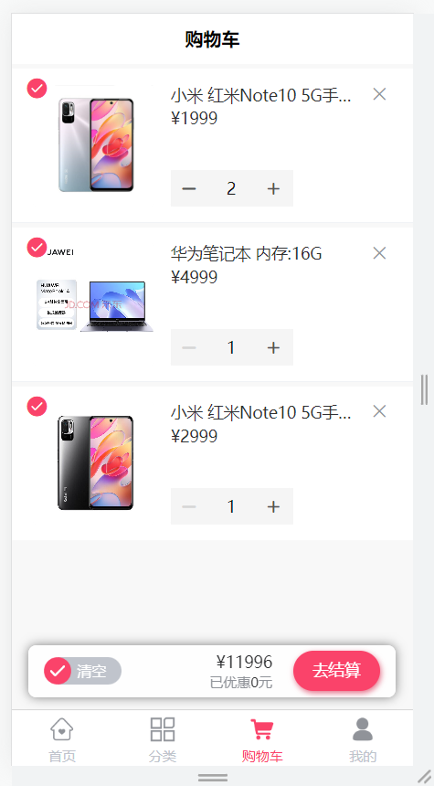
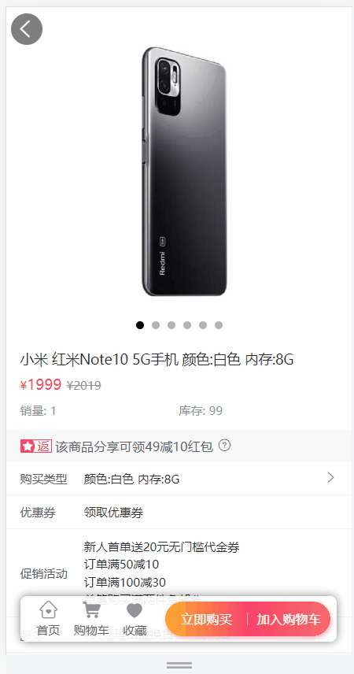
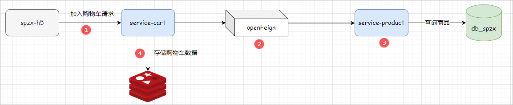
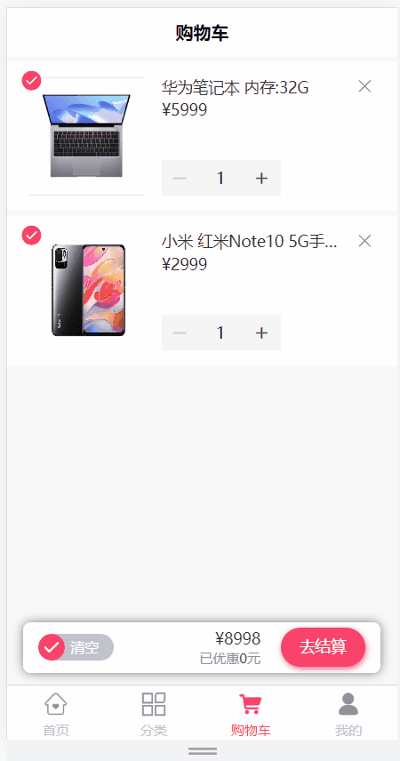
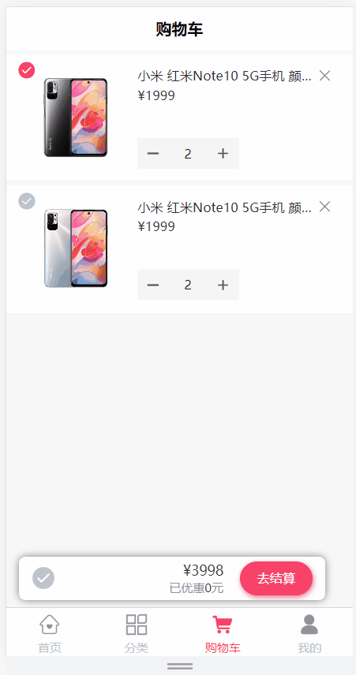
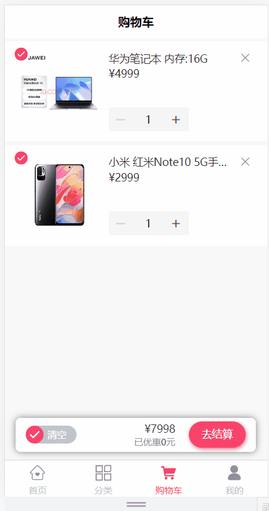
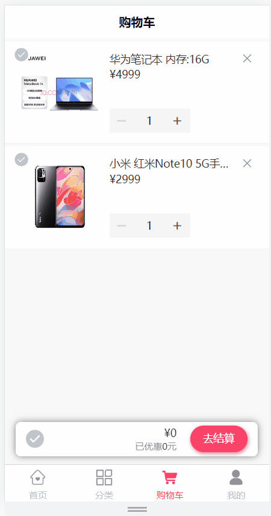

# 购物车模块

# 1 需求说明

购物车模块存储顾客所选的的商品，记录下所选商品，当用户决定购买时，用户可以选择决定购买的商品进入结算页面。

购物车模块功能说明：

1、添加商品到购物车

2、查询购物车列表数据

3、删除购物车商品数据

4、更新选中商品状态

5、完成购物车商品的全选

6、清空购物车商品数据

数据存储：为了提高对购物车数据操作的性能，可以使用Redis【HASH】存储购物车数据。

页面效果：

 

# 2 环境搭建

创建一个独立模块(service-cart)来完成购物车的相关功能。

步骤如下：

1、在spzx-service模块下创建一个service-cart模块，并加入如下的依赖：

```xml
<dependencies>

    <dependency>
        <groupId>org.springframework.boot</groupId>
        <artifactId>spring-boot-starter-data-redis</artifactId>
    </dependency>

</dependencies>
```

2、准备application.yml、application-dev.yml、logback-spring.xml文件。文件内容如下所示：

```yml
# application.yml
spring:
  profiles:
    active: dev
    
# application-dev.yml
server:
  port: 8513

spring:
  application:
    name: service-cart
  cloud:
    nacos:
      discovery:
        server-addr: 192.168.136.142:8848
    sentinel:
      transport:
        dashboard: localhost:8080
  data:
    redis:
      host: 192.168.136.142
      port: 6379
      password: 1234
```

logback-spring.xml修改输出路径：

```xml
<property name="log.path" value="D://work//service-cart//logs" />
```

3、创建启动类

```java
// com.atguigu.spzx.cart;
@SpringBootApplication(exclude = DataSourceAutoConfiguration.class)  // 排除数据库的自动化配置，Cart微服务不需要访问数据库
public class CartApplication {

    public static void main(String[] args) {
        SpringApplication.run(CartApplication.class , args) ;
    }

}
```

# 3 添加购物车

## 3.1 需求说明

需求如下所示：

1、商品详情页加入购物车

2、加入购物车必须登录

加入购物车功能如图所示：

 

**查看接口文档：**

添加购物车接口地址及返回结果

```json
get api/order/cart/auth/addToCart/{skuId}/{skuNum}
返回结果：
{
    "code": 200,
    "message": "操作成功",
    "data": null
}
```

注意：购物车页面加减商品数量与商品详情页加入购物车是同一个接口


请求响应流程如下所示：

 


## 3.2 远程调用接口开发

在service-product微服务中提供一个远程调用接口，根据skuId查询ProductSku数据，操作模块：service-product。

### 3.2.1 ProductController

表现层代码：

```java
@Operation(summary = "获取商品sku信息")
@GetMapping("getBySkuId/{skuId}")
public Result<ProductSku> getBySkuId(@Parameter(name = "skuId", description = "商品skuId", required = true) @PathVariable Long skuId) {
    ProductSku productSku = productService.getBySkuId(skuId);
    return Result.build(productSku , ResultCodeEnum.SUCCESS) ;
}
```

### 3.2.2 ProductService

业务层代码实现：

```java
//业务接口
ProductSku getBySkuId(Long skuId);

//业务接口实现
@Override
public ProductSku getBySkuId(Long skuId) {
    return productSkuMapper.getById(skuId);
}
```

启动service-product微服务进行测试。

## 3.3 openFeign接口定义

### 3.3.1 环境搭建

步骤如下所示：

1、spzx-service-client模块创建：在spzx-parent下面创建该子模块spzx-service-client，并导入如下依赖：

```xml
<dependencies>

    <dependency>
        <groupId>com.atguigu.spzx</groupId>
        <artifactId>common-util</artifactId>
        <version>1.0-SNAPSHOT</version>
        <scope>provided </scope>
    </dependency>

    <dependency>
        <groupId>com.atguigu.spzx</groupId>
        <artifactId>spzx-model</artifactId>
        <version>1.0-SNAPSHOT</version>
        <scope>provided </scope>
    </dependency>

    <!-- openfeign依赖 -->
    <dependency>
        <groupId>org.springframework.cloud</groupId>
        <artifactId>spring-cloud-starter-openfeign</artifactId>
    </dependency>

    <!-- loadbalancer依赖 -->
    <dependency>
        <groupId>org.springframework.cloud</groupId>
        <artifactId>spring-cloud-loadbalancer</artifactId>
    </dependency>

</dependencies>
```

注意：删除src目录

2、service-product-client模块创建：在spzx-service-client下面创建该子模块

### 3.3.2 接口定义

在service-product-client定义针对service-product微服务的远程调用接口，如下所示：

```java
// com.atguigu.spzx.feign.product;
@FeignClient(value = "service-product")
public interface ProductFeignClient {

    @GetMapping("/api/product/getBySkuId/{skuId}")
    public abstract Result<ProductSku>  getBySkuId(@PathVariable Long skuId) ;

}
```

### 3.3.3 降级类定义

针对该远程调用接口提供一个降级类，一旦远程调用接口调用发生异常以后执行降级逻辑。

步骤：

1、定义一个类实现ProductFeignClient接口

```java
// com.atguigu.spzx.feign.product.fallback
@Slf4j
public class ProductFeignClientFallback implements ProductFeignClient {

    @Override
    public Result<ProductSku> getBySkuId(Long skuId) {
        log.info("ProductFeignClientFallback...getBySkuId的方法执行了");
        return Result.build(null , ResultCodeEnum.SUCCESS) ;
    }

}
```

2、ProductFeignClient接口使用该降级类

```java
@FeignClient(value = "service-product" , fallback = ProductFeignClientFallback.class)
```

3、将该接口通过Spring Boot的自动化配置原理，将其纳入到Spring容器中

在resources目录下创建一个MATE-INF/spring文件夹，在该文件夹下创建一个

org.springframework.boot.autoconfigure.AutoConfiguration.imports文件，文件的中的内容如下所示：

```java
com.atguigu.spzx.feign.product.fallback.ProductFeignClientFallback
```

## 3.4 业务后端接口开发

操作模块：service-cart

### 3.4.1 添加依赖

在service-cart微服务中添加service-product-client接口的依赖：

```xml
<dependency>
    <groupId>com.atguigu.spzx</groupId>
    <artifactId>service-product-client</artifactId>
    <version>1.0-SNAPSHOT</version>
</dependency>
```

### 3.4.2 修改启动类

在启动类上添加对应的注解

```java
@SpringBootApplication(exclude = DataSourceAutoConfiguration.class)
@EnableFeignClients(basePackages = {
        "com.atguigu.spzx.feign.product"
})
@EnableUserWebMvcConfiguration
public class CartApplication {

    public static void main(String[] args) {
        SpringApplication.run(CartApplication.class , args) ;
    }

}
```

### 3.4.3 CartInfo

定义一个实体类来封装购物车中的商品数据(购物项数据)，该实体类的定义依据：购物车列表页面需要展示的数据。如下所示：

```java
// com.atguigu.spzx.model.entity.h5;
@Data
@Schema(description = "购物车实体类")
public class CartInfo extends BaseEntity {
   
   private static final long serialVersionUID = 1L;

   @Schema(description = "用户id")
   private Long userId;

   @Schema(description = "skuid")
   private Long skuId;

   @Schema(description = "放入购物车时价格")
   private BigDecimal cartPrice;

   @Schema(description = "数量")
   private Integer skuNum;

   @Schema(description = "图片文件")
   private String imgUrl;

   @Schema(description = "sku名称 (冗余)")
   private String skuName;

   @Schema(description = "isChecked")
   private Integer isChecked;
    
}
```

### 3.4.4 CartController

表现层代码：

```java
@Tag(name = "购物车接口")
@RestController
@RequestMapping("api/order/cart")
public class CartController {

    @Autowired
    private CartService cartService;

    @Operation(summary = "添加购物车")
    @GetMapping("auth/addToCart/{skuId}/{skuNum}")
    public Result addToCart(@Parameter(name = "skuId", description = "商品skuId", required = true) @PathVariable("skuId") Long skuId,
                            @Parameter(name = "skuNum", description = "数量", required = true) @PathVariable("skuNum") Integer skuNum) {
        cartService.addToCart(skuId, skuNum);
        return Result.build(null, ResultCodeEnum.SUCCESS);
    }
}
```

### 3.4.5 CartService

业务层代码实现：

```java
//业务接口
public interface CartService {
    void addToCart(Long skuId, Integer skuNum);
}

//业务接口实现
// com.atguigu.spzx.cart.service.impl;
import java.util.Date;

//业务接口实现
@Service
public class CartServiceImpl implements CartService {

    @Autowired
    private RedisTemplate<String , String> redisTemplate;

    @Autowired
    private ProductFeignClient productFeignClient;

    private String getCartKey(Long userId) {
        //定义key user:cart:userId
        return "user:cart:" + userId;
    }

    @Override
    public void addToCart(Long skuId, Integer skuNum) {

        // 获取当前登录用户的id
        Long userId = AuthContextUtil.getUserInfo().getId();
        String cartKey = getCartKey(userId);

        //获取缓存对象
        Object cartInfoObj = redisTemplate.opsForHash().get(cartKey, String.valueOf(skuId));
        CartInfo cartInfo = null ;
        if(cartInfoObj != null) {       //  如果购物车中有该商品，则商品数量 相加！
            cartInfo = JSON.parseObject(cartInfoObj.toString() , CartInfo.class) ;
            cartInfo.setSkuNum(cartInfo.getSkuNum() + skuNum);
            cartInfo.setIsChecked(1);
            cartInfo.setUpdateTime(new Date());
        }else {

            // 当购物车中没用该商品的时候，则直接添加到购物车！
            cartInfo = new CartInfo();

            // 购物车数据是从商品详情得到 {skuInfo}
            ProductSku productSku = productFeignClient.getBySkuId(skuId).getData() ;
            cartInfo.setCartPrice(productSku.getSalePrice());
            cartInfo.setSkuNum(skuNum);
            cartInfo.setSkuId(skuId);
            cartInfo.setUserId(userId);
            cartInfo.setImgUrl(productSku.getThumbImg());
            cartInfo.setSkuName(productSku.getSkuName());
            cartInfo.setIsChecked(1);
            cartInfo.setCreateTime(new Date());
            cartInfo.setUpdateTime(new Date());

        }

        // 将商品数据存储到购物车中
        redisTemplate.opsForHash().put(cartKey , String.valueOf(skuId) , JSON.toJSONString(cartInfo));
    }

}
```

### 3.4.6 修改配置文件

在配置文件application-dev.yml中添加如下配置，完成openFeign和sentinel的整合：

```yml
feign:
  sentinel:
    enabled: true
```

### 3.4.7 服务网关配置

在spzx-server-gateway微服务网关中配置service-cart微服务的路由规则：

```yml
spring:
  cloud:
    gateway:
      routes:
        - id: service-cart
          uri: lb://service-cart
          predicates:
            - Path=/api/order/cart/**
```

启动服务进行测试。

# 4 购物车列表查询

## 4.1 需求说明

当用户在商品详情页面点击**购物车**按钮的时候，那么此时就需要将当前登录用户的所对应的所有的购物车数据在购物车页面展出出来。如下图所示：

  

**查看接口文档：**

购物车列表接口地址及返回结果

```json
get api/order/cart/auth/cartList
返回结果：
{
    "code": 200,
    "message": "操作成功",
    "data": [
        {
            "id": null,
            "createTime": "2023-06-13 10:27:30",
            "updateTime": "2023-06-13 11:21:23",
            "isDeleted": null,
            "userId": 1,
            "skuId": 5,
            "cartPrice": 1999.00,
            "skuNum": 2,
            "imgUrl": "http://139.198.127.41:9000/spzx/20230525/665832167-1_u_1.jpg",
            "skuName": "小米 红米Note10 5G手机 颜色:黑色 内存:8G",
            "isChecked": 1
        },
        ...
    ]
}
```

## 4.2 后端接口

### 4.2.1 CartController

表现层代码：

```java
@Operation(summary = "查询购物车")
@GetMapping("auth/cartList")
public Result<List<CartInfo>> cartList() {
    List<CartInfo> cartInfoList = cartService.getCartList();
    return Result.build(cartInfoList, ResultCodeEnum.SUCCESS);
}
```

### 4.2.2 CartService

业务层代码实现：

```java
//业务接口
List<CartInfo> getCartList();

//业务接口实现
@Override
public List<CartInfo> getCartList() {

        // 获取当前登录的用户信息
        Long userId = AuthContextUtil.getUserInfo().getId();
        String cartKey = this.getCartKey(userId);

        // 获取数据
        List<Object> cartInfoList = redisTemplate.opsForHash().values(cartKey);

        if (!CollectionUtils.isEmpty(cartInfoList)) {
            List<CartInfo> infoList = cartInfoList.stream().map(cartInfoJSON -> JSON.parseObject(cartInfoJSON.toString(), CartInfo.class))
                    .sorted((o1, o2) -> o2.getCreateTime().compareTo(o1.getCreateTime()))
                    .collect(Collectors.toList());
            return infoList ;
        }

        return new ArrayList<>() ;
    }
```

# 5 删除购物车商品

## 5.1 需求说明

删除功能如图所示：

 

**查看接口文档：**

删除购物车商品接口地址及返回结果

```json
get api/order/cart/auth/deleteCart/{skuId}
返回结果：
{
    "code": 200,
    "message": "操作成功",
    "data": null
}
```

## 5.2 后端接口

### 5.2.1 CartController

表现层代码：

```java
@Operation(summary = "删除购物车商品")
@DeleteMapping("auth/deleteCart/{skuId}")
public Result deleteCart(@Parameter(name = "skuId", description = "商品skuId", required = true) @PathVariable("skuId") Long skuId) {
    cartService.deleteCart(skuId);
    return Result.build(null, ResultCodeEnum.SUCCESS);
}
```

### 5.2.2 CartService

业务层代码实现：

```java
//业务接口
void deleteCart(Long skuId);

//业务接口实现
@Override
public void deleteCart(Long skuId) {

    // 获取当前登录的用户数据
    Long userId = AuthContextUtil.getUserInfo().getId();
    String cartKey = getCartKey(userId);

    //获取缓存对象
    redisTemplate.opsForHash().delete(cartKey  ,String.valueOf(skuId)) ;
}
```

# 6 更新选中商品状态

## 6.1 需求说明

更新选中商品状态功能如图所示：

 

**查看接口文档：**

更新选中商品状态接口地址及返回结果

```json
get api/order/cart/auth/checkCart/{skuId}/{isChecked}
返回结果：
{
    "code": 200,
    "message": "操作成功",
    "data": null
}
```

## 6.2 后端接口

### 6.2.1 CartController

表现层代码：

```java
@Operation(summary="更新购物车商品选中状态")
@GetMapping("/auth/checkCart/{skuId}/{isChecked}")
public Result checkCart(@Parameter(name = "skuId", description = "商品skuId", required = true) @PathVariable(value = "skuId") Long skuId,
                        @Parameter(name = "isChecked", description = "是否选中 1:选中 0:取消选中", required = true) @PathVariable(value = "isChecked") Integer isChecked) {
    cartService.checkCart(skuId, isChecked);
    return Result.build(null, ResultCodeEnum.SUCCESS);
}
```

### 6.2.2 CartService

业务层代码实现：

```java
//业务接口
void checkCart(Long skuId, Integer isChecked);

//业务接口实现
@Override
public void checkCart(Long skuId, Integer isChecked) {

    // 获取当前登录的用户数据
    Long userId = AuthContextUtil.getUserInfo().getId();
    String cartKey = this.getCartKey(userId);

    Boolean hasKey = redisTemplate.opsForHash().hasKey(cartKey, String.valueOf(skuId));
    if(hasKey) {
        String cartInfoJSON = redisTemplate.opsForHash().get(cartKey, String.valueOf(skuId)).toString();
        CartInfo cartInfo = JSON.parseObject(cartInfoJSON, CartInfo.class);
        cartInfo.setIsChecked(isChecked);
        redisTemplate.opsForHash().put(cartKey , String.valueOf(skuId) , JSON.toJSONString(cartInfo));
    }

}
```

# 7 完成购物车商品的全选

## 7.1 需求说明

更新购物车商品全部选中状态功能如图所示：

 

**查看接口文档：**

更新购物车商品全部选中状态接口地址及返回结果

```json
get api/order/cart/auth/allCheckCart/{isChecked}
返回结果：
{
    "code": 200,
    "message": "操作成功",
    "data": null
}
```


## 7.2 后端接口

### 7.2.1 CartController

表现层代码：

```java
@Operation(summary="更新购物车商品全部选中状态")
@GetMapping("/auth/allCheckCart/{isChecked}")
public Result allCheckCart(@Parameter(name = "isChecked", description = "是否选中 1:选中 0:取消选中", required = true) @PathVariable(value = "isChecked") Integer isChecked){
    cartService.allCheckCart(isChecked);
    return Result.build(null, ResultCodeEnum.SUCCESS);
}
```

### 7.2.2 CartService

业务层代码实现：

```java
//业务接口
void allCheckCart(Integer isChecked);

//业务接口实现
public void allCheckCart(Integer isChecked) {

    // 获取当前登录的用户数据
    Long userId = AuthContextUtil.getUserInfo().getId();
    String cartKey = getCartKey(userId);

    // 获取所有的购物项数据
    List<Object> objectList = redisTemplate.opsForHash().values(cartKey);
    if(!CollectionUtils.isEmpty(objectList)) {
        objectList.stream().map(cartInfoJSON -> {
            CartInfo cartInfo = JSON.parseObject(cartInfoJSON.toString(), CartInfo.class);
            cartInfo.setIsChecked(isChecked);
            return cartInfo ;
        }).forEach(cartInfo -> redisTemplate.opsForHash().put(cartKey , String.valueOf(cartInfo.getSkuId()) , JSON.toJSONString(cartInfo)));

    }
}
```

# 8 清空购物车

## 8.1 需求说明

清空购物车功能如图所示：

 

**查看接口文档：**

清空购物车接口地址及返回结果

```json
get api/order/cart/auth/clearCart
返回结果：
{
    "code": 200,
    "message": "操作成功",
    "data": null
}
```


## 8.2 后端接口

### 8.2.1 CartController

表现层代码：

```java
@Operation(summary="清空购物车")
@GetMapping("/auth/clearCart")
public Result clearCart(){
    cartService.clearCart();
    return Result.build(null, ResultCodeEnum.SUCCESS);
}
```

### 8.2.2 CartService

业务层代码实现：

```java
//业务接口
void clearCart();

//业务接口实现
@Override
public void clearCart() {
    Long userId = AuthContextUtil.getUserInfo().getId();
    String cartKey = getCartKey(userId);
    redisTemplate.delete(cartKey);
}
```

