# 项目实战

# 1 项目实战意义

项目实战对于学习和发展技能具有重要的意义。以下是项目实战的一些主要意义：

1、**实践应用知识**：通过项目实战，可以将学到的理论知识应用到实际情境中，加深对知识的理解和掌握。项目实战可以帮助你更好地理解和应用所学

的技术和工具。

2、**锻炼问题解决能力**：在项目实战中，你会面临各种挑战和问题，需要运用自己的知识和经验来解决。这样的锻炼可以提高你的问题解决能力和创

新思维，培养解决实际问题的能力。

3、**增强团队协作能力**：在项目实战中，通常需要与团队成员合作，共同完成项目目标。这可以提高你的团队协作能力、沟通能力和领导能力，培养

良好的团队合作精神。

4、**实现自我价值**：通过项目实战，你可以将自己的想法和创意付诸实践，实现自己的项目目标。这不仅可以增加自信心，还可以为个人发展和职业

发展打下坚实的基础。

5、**展示能力和经验**：项目实战可以作为你的个人作品集，展示你的能力和经验。这对于找工作、升职或者申请学校等都具有重要的意义，能够给雇

主或招生官一个直观的了解你的能力和潜力。

# 2 项目实战说明

项目实战说明：

1、项目实战涉及到的功能代码要求**学生自主完成**，代课老师说明需求即可

2、每一位学员将上课老师的第18天的完整代码提交到gitee上

3、从gitee上拉取代码，开发每一个功能模块接口的时候需要**创建git分支**进行开发，开发完毕以后进行分支合并

4、项目实战初步安排3天【具体安排以当前代课老师为准】

5、项目实战最后一天下午可以由代课老师组织学员进行项目评审，选出最好的1 ~ 3组给出丰厚的礼品

# 3 后台实战功能

## 3.1 数据管理(5)

### 3.1.1 区域管理(1)

按照下图所示完成区域管理的数据查询功能：

操作的数据库表：region

对应的接口文档：区域管理#根据parentCode查询子区域

### 3.1.2 商品单位(4)

操作的数据库表：product_unit

#### 分页查询商品单位

按照下图所示完成产品单位管理的分页查询功能：

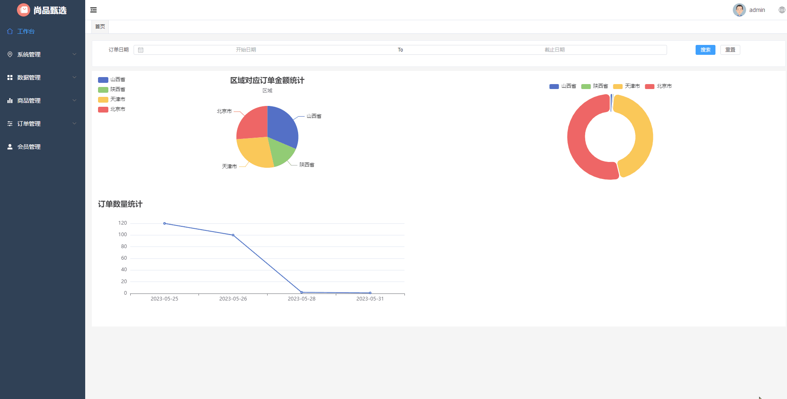

对应的接口文档：产品单元管理#分页查询

#### 产品单位添加

按照下图所示完成产品单位管理的添加功能：

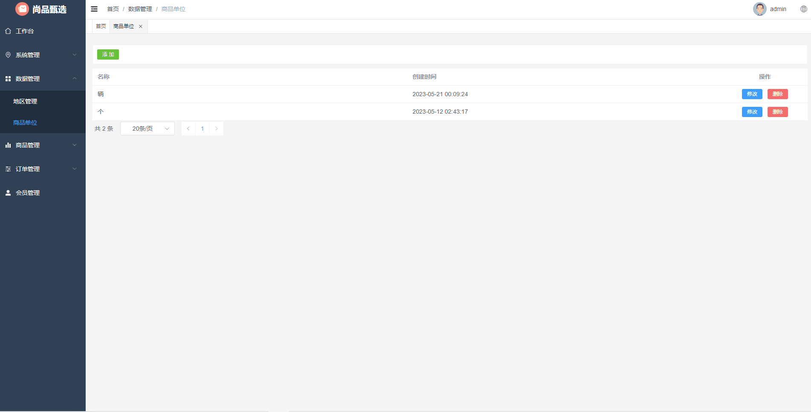

对应的接口文档：产品单元管理#保存商品单元

#### 产品单位修改

按照下图所示完成产品单位的修改功能：

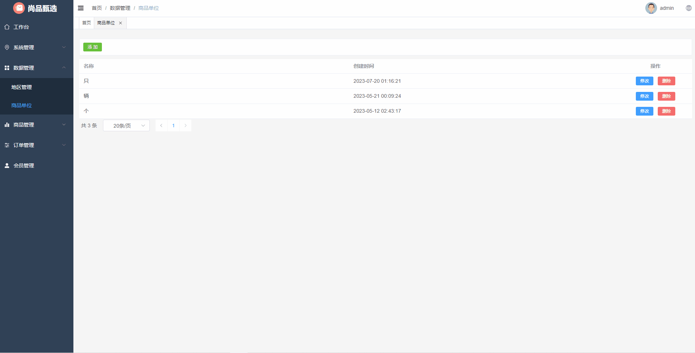

对应的接口文档：产品单元管理#根据id进行修改

#### 产品单位删除

按照下图所示完成产品单位的删除功能：

对应的接口文档：产品单元管理#根据id进行删除

## 3.2 会员管理(3)

操作的数据库表：user_info

### 3.2.1 条件分页查询

按照下图所示完成会员数据的条件分页查询功能：

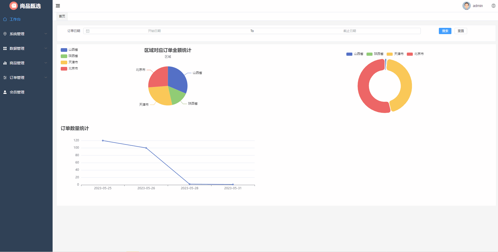

对应的接口文档：会员接口#获取分页列表

### 3.2.2 会员数据详情查询

按照下图所示完成会员数据详情查询功能：

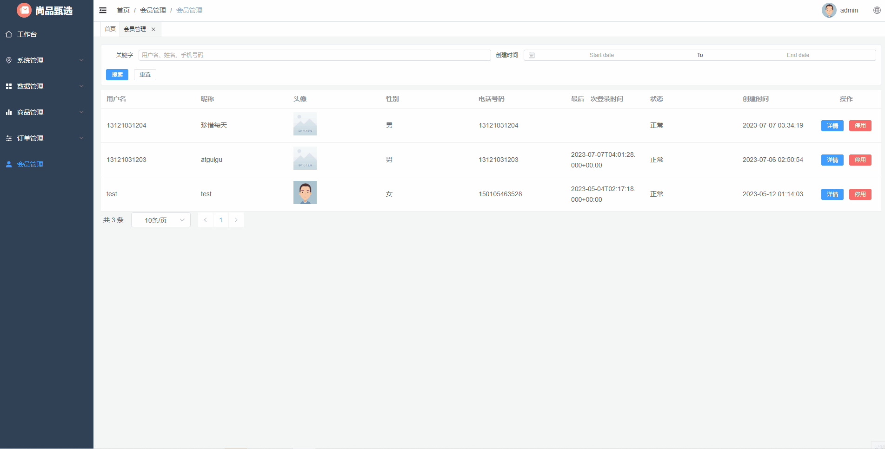

对应的接口文档：会员接口#获取用户地址

### 3.2.3 会员停用与启用

按照下图所示完成会员停用与启用功能：

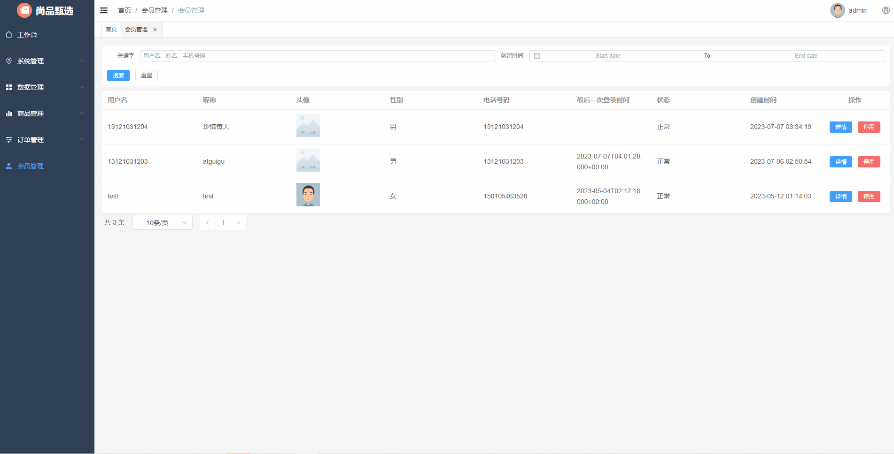

对应的接口文档：会员接口#更新状态

## 3.3 订单管理(2)

操作的数据库表：order_info

### 3.3.1 条件分页查询

按照下图所示完成订单数据的条件分页查询功能：

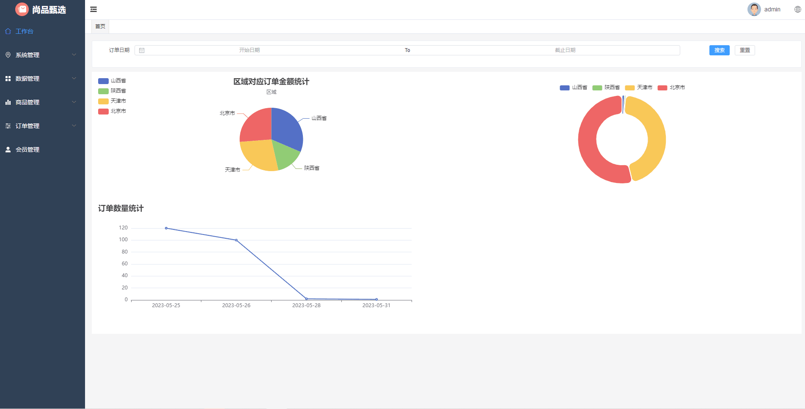

对应的接口文档：订单管理#获取分页列表

### 3.3.2 订单数据详情查询

按照下图所示完成订单数据详情查询功能：

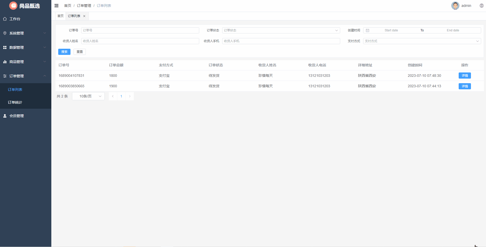

对应的接口文档：订单管理#获取详情

## 3.4 系统管理(1)

操作的数据库表：sys_oper_log

按照下图所示完成系统管理中操作日志数据的维护功能：

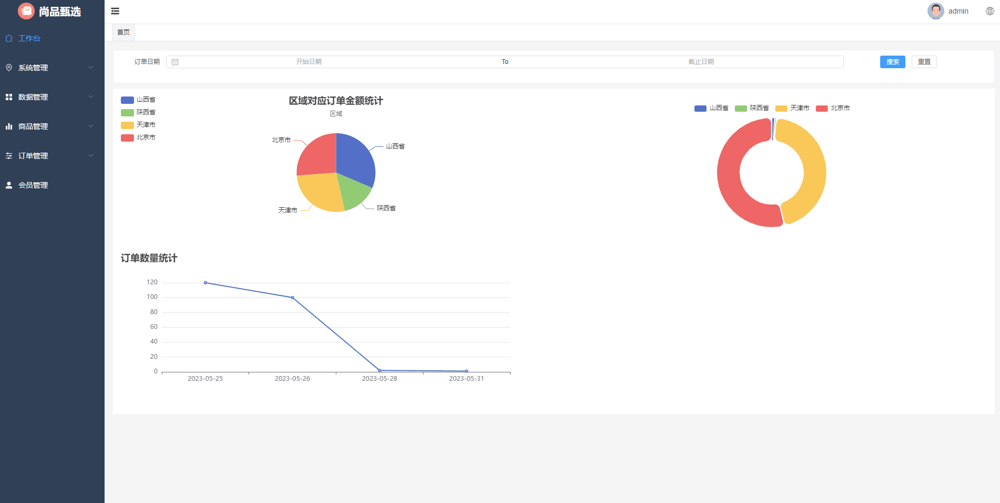

对应的接口文档：日志管理#获取分页列表

## 3.5 首页数据统计(1)

按照下图所示完成首页要统计的相关数据展示功能：

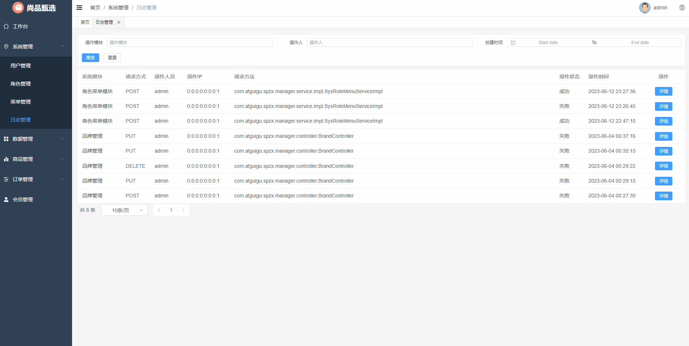

首页需要统计的数据说明：

1、根据订单所属区域对订单金额进行统计，以饼状图形式展示

2、根据订单所属区域对订单总数量进行统计，以饼状图形式展示

3、根据订单日期对订单总数量进行统计，以折线图形式展示

对应的接口文档：首页数据统计#统计首页数据

# 4 前台实战功能

## 4.1 地址管理(5)

操作的数据库表：user_address

### 4.1.1 地址列表查询

按照下图所示完成收货人地址信息的列表查询功能：

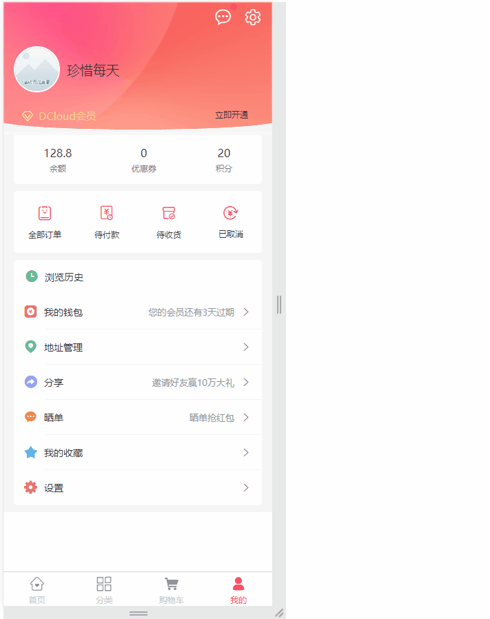 

对应的接口文档：用户地址接口#获取用户地址列表

### 4.1.2 新增地址信息

按照下图所示完成收货人地址信息的新增功能：

 

对应的接口文档：

1、用户地址接口#新增用户地址

2、地区信息接口#根据parentCode获取下级节点

### 4.1.3 修改地址信息

按照下图所示完成收货人地址信息的修改功能：

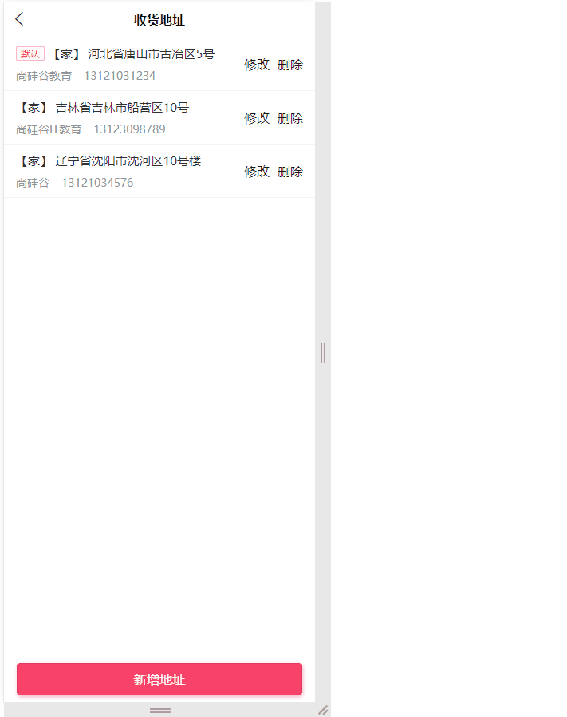 

对应的接口文档：用户地址接口#修改用户地址

### 4.1.4 删除地址信息

按照下图所示完成收货人地址信息的删除功能：

 

对应的接口文档：用户地址接口#删除用户地址

## 4.2 商品收藏(4)

操作的数据库表：user_collect

### 4.2.1 判断商品是否收藏

具体功能如下所示，如果当前登录用户收藏了对应的商品，那么在查询商品详情的时候商品收藏显示红心，否则显示灰心。

 

对应的接口文档：会员用户接口#当前用户是否收藏商品

### 4.2.2 当前用户收藏商品

具体功能如下所示，用户在商品详情页面点击收藏按钮完成商品的收藏功能：

 

对应的接口文档：会员用户接口#当前用户收藏商品

### 4.2.3 取消当前用户收藏商品

具体功能如下所示，用户在商品详情页面针对收藏的商品点击收藏按钮完成商品的取消收藏功能：

 

对应的接口文档：会员用户接口#当前用户取消收藏商品

### 4.2.4 用户收藏分页列表查询

具体功能如下所示：

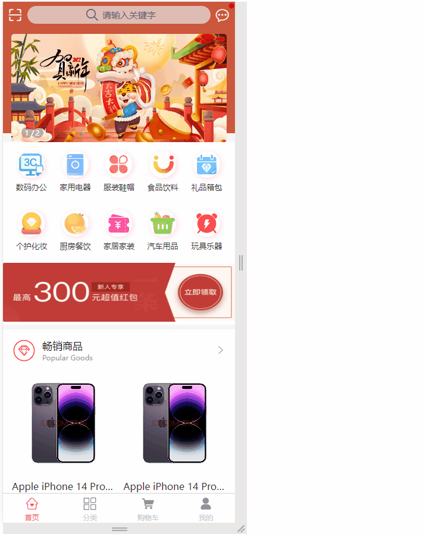 

对应的接口文档：会员用户接口#获取用户收藏分页列表

## 4.3 商品浏览(1)

操作的数据库表：user_browse_history

按照下图所示完成商品浏览分页列表查询相关功能：

 

对应的接口文档：会员用户接口#获取用户浏览历史分页列表

