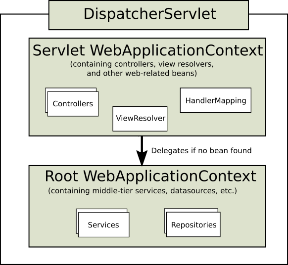
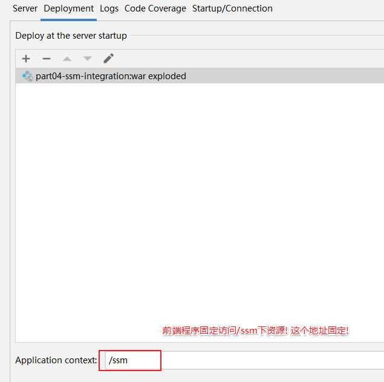
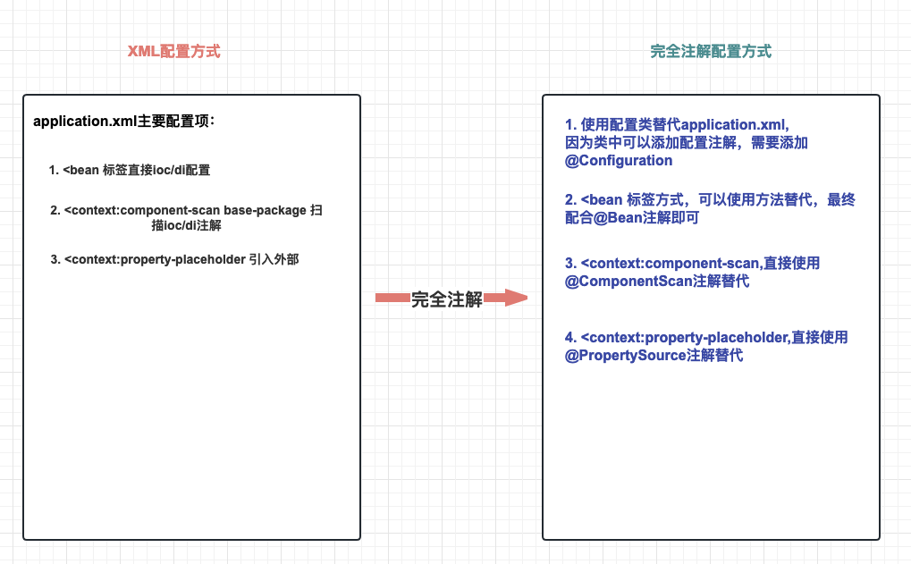

# 五、SSM整合实战

## 目录

-   [一、SSM整合理解](#一SSM整合理解)
    -   [1. 什么是SSM整合？](#1-什么是SSM整合)
    -   [2. SSM整合核心理解五连问！](#2-SSM整合核心理解五连问)
        -   [2.1 SSM整合涉及几个IoC容器？](#21-SSM整合涉及几个IoC容器)
        -   [2.2 每个IoC容器盛放哪些组件？](#22-每个IoC容器盛放哪些组件)
        -   [2.3 IoC容器之间是什么关系？](#23-IoC容器之间是什么关系)
        -   [2.4 需要几个配置文件和对应IoC容器关系？](#24-需要几个配置文件和对应IoC容器关系)
        -   [2.5 IoC容器初始化方式？](#25-IoC容器初始化方式)
-   [二、SSM整合配置实战](#二SSM整合配置实战)
    -   [1. 依赖添加](#1-依赖添加)
    -   [2. 控制层配置编写(SpringMVC整合)](#2-控制层配置编写SpringMVC整合)
    -   [3. 业务层配置编写(AOP / TX整合）](#3-业务层配置编写AOP--TX整合)
    -   [4. 持久层配置编写(MyBatis整合)](#4-持久层配置编写MyBatis整合)
    -   [5. 容器初始化配置web.xml](#5-容器初始化配置webxml)
    -   [6. 整合测试](#6-整合测试)
-   [三、前端程序搭建和运行](#三前端程序搭建和运行)
    -   [1. 案例功能和接口分析](#1-案例功能和接口分析)
        -   [1.1 案例功能预览](#11-案例功能预览)
        -   [1.2 接口分析](#12-接口分析)
    -   [2. 前端工程导入](#2-前端工程导入)
    -   [3. 启动测试](#3-启动测试)
-   [四、后端程序实现和测试](#四后端程序实现和测试)
    -   [1.  准备工作](#1--准备工作)
    -   [2. 功能实现](#2-功能实现)
    -   [3. 前后联调](#3-前后联调)
-   [五、SSM技术栈总结](#五SSM技术栈总结)
    -   [1. Spring框架总结](#1-Spring框架总结)
        -   [1.1 技术点总结](#11-技术点总结)
        -   [1.2 配置总结](#12-配置总结)
        -   [1.3 注解总结](#13-注解总结)
    -   [2. Spring MVC 框架总结](#2-Spring-MVC-框架总结)
        -   [2.1 技术点总结](#21-技术点总结)
        -   [2.2 配置总结](#22-配置总结)
        -   [2.3 注解总结](#23-注解总结)
    -   [3. MyBatis框架总结](#3-MyBatis框架总结)
        -   [3.1 技术点总结](#31-技术点总结)
        -   [3.2 配置总结](#32-配置总结)
        -   [3.3 注解总结](#33-注解总结)

## 一、SSM整合理解

### 1. 什么是SSM整合？

**本质**：Spring接管一切（将框架核心组件交给Spring进行IoC管理），代码更加简洁。

-   SpringMVC管理web相关组件
-   Spring管理业务层、持久层、以及数据库相关（DataSource,MyBatis）的组件
-   SSM整合最终就是编写IoC配置文件

### 2. SSM整合核心理解五连问！

#### 2.1 SSM整合涉及几个IoC容器？

我们提到过SpringMVC/DispatcherServlet 加载 spring-mvc.xml，此时整个 Web 应用中只创建一个 IoC 容器。如果将Mybatis、配置声明式事务，全部在 spring-mvc.xml 配置文件中配置也是可以的。可是这样会导致配置文件太长，不容易维护。

通常情况下，SSM整合我们会创建两个IoC容器，分开管理SSM下的核心组件！

#### 2.2 每个IoC容器盛放哪些组件？

| 容器名    | 创建类                   | 盛放组件                                                  |
| ------ | --------------------- | ----------------------------------------------------- |
| web容器  | DispatcherServlet     | web相关组件（controller,springmvc核心组件）                     |
| root容器 | ContextLoaderListener | 业务和持久层相关组件（service,aop,tx,dataSource,mybatis,mapper等） |

#### 2.3 IoC容器之间是什么关系？

结论：两个组件分别创建的 IOC 容器是**父子**关系。

-   父容器：ContextLoaderListener 创建的 IOC 容器（root容器）
-   子容器：DispatcherServlet 创建的 IOC 容器（web容器）

源码部分：

ContextLoaderListener将实例化root容器，存储到ServletContext:

```java
  /**
   * Initialize Spring's web application context for the given servlet context,
   * using the application context provided at construction time, or creating a new one
   * according to the "{@link #CONTEXT_CLASS_PARAM contextClass}" and
   * "{@link #CONFIG_LOCATION_PARAM contextConfigLocation}" context-params.
   * @param servletContext current servlet context
   * @return the new WebApplicationContext
   * @see #ContextLoader(WebApplicationContext)
   * @see #CONTEXT_CLASS_PARAM
   * @see #CONFIG_LOCATION_PARAM
   */
  public WebApplicationContext initWebApplicationContext(ServletContext servletContext) {
    if (servletContext.getAttribute(WebApplicationContext.ROOT_WEB_APPLICATION_CONTEXT_ATTRIBUTE) != null) {
      throw new IllegalStateException(
          "Cannot initialize context because there is already a root application context present - " +
          "check whether you have multiple ContextLoader* definitions in your web.xml!");
    }
    servletContext.log("Initializing Spring root WebApplicationContext");
    Log logger = LogFactory.getLog(ContextLoader.class);
    if (logger.isInfoEnabled()) {
      logger.info("Root WebApplicationContext: initialization started");
    }
    long startTime = System.currentTimeMillis();
    try {
      // Store context in local instance variable, to guarantee that
      // it is available on ServletContext shutdown.
      if (this.context == null) {
        this.context = createWebApplicationContext(servletContext);
      }
      if (this.context instanceof ConfigurableWebApplicationContext cwac && !cwac.isActive()) {
        // The context has not yet been refreshed -> provide services such as
        // setting the parent context, setting the application context id, etc
        if (cwac.getParent() == null) {
          // The context instance was injected without an explicit parent ->
          // determine parent for root web application context, if any.
          ApplicationContext parent = loadParentContext(servletContext);
          cwac.setParent(parent);
        }
        configureAndRefreshWebApplicationContext(cwac, servletContext);
      }
      //将root容器存储到servletContext中
      servletContext.setAttribute(WebApplicationContext.ROOT_WEB_APPLICATION_CONTEXT_ATTRIBUTE, this.context);

      ClassLoader ccl = Thread.currentThread().getContextClassLoader();
      if (ccl == ContextLoader.class.getClassLoader()) {
        currentContext = this.context;
      }
      else if (ccl != null) {
        currentContextPerThread.put(ccl, this.context);
      }

      if (logger.isInfoEnabled()) {
        long elapsedTime = System.currentTimeMillis() - startTime;
        logger.info("Root WebApplicationContext initialized in " + elapsedTime + " ms");
      }

      return this.context;
    }
    catch (RuntimeException | Error ex) {
      logger.error("Context initialization failed", ex);
      servletContext.setAttribute(WebApplicationContext.ROOT_WEB_APPLICATION_CONTEXT_ATTRIBUTE, ex);
      throw ex;
    }
  }

```

DispatcherServlet读取root容器，并且设置为web容器的父容器：

```java
protected WebApplicationContext createWebApplicationContext(@Nullable ApplicationContext parent) {
    Class<?> contextClass = getContextClass();
    if (!ConfigurableWebApplicationContext.class.isAssignableFrom(contextClass)) {
      throw new ApplicationContextException(
          "Fatal initialization error in servlet with name '" + getServletName() +
          "': custom WebApplicationContext class [" + contextClass.getName() +
          "] is not of type ConfigurableWebApplicationContext");
    }
    ConfigurableWebApplicationContext wac =
        (ConfigurableWebApplicationContext) BeanUtils.instantiateClass(contextClass);

    wac.setEnvironment(getEnvironment());
    //将root容器取出，并设置为父容器
    wac.setParent(parent);
    String configLocation = getContextConfigLocation();
    if (configLocation != null) {
      wac.setConfigLocation(configLocation);
    }
    configureAndRefreshWebApplicationContext(wac);

    return wac;
  }
```

容器访问流程：




#### 2.4 需要几个配置文件和对应IoC容器关系？

文件的数量不是固定的，但是至少要两个，为了方便编写，我们可以三层架构每层对应一个配置文件，分别指定两个容器加载即可！

建议配置文件：

| 配置名                | 对应内容                        | 对应容器   |
| ------------------ | --------------------------- | ------ |
| spring-mvc.xml     | controller,springmvc相关      | web容器  |
| spring-service.xml | service,aop,tx相关            | root容器 |
| spring-mapper.xml  | mapper,datasource,mybatis相关 | root容器 |

#### 2.5 IoC容器初始化方式？

在一个 Web 应用中就会出现两个 IOC 容器

-   DispatcherServlet 创建一个 IOC 容器
-   ContextLoaderListener 创建一个 IOC 容器

配置方式：

```xml
<!-- 通过全局初始化参数指定 Spring 配置文件的位置  root ioc容器配置-->
<context-param>
    <param-name>contextConfigLocation</param-name>
    <param-value>classpath:spring-service.xml,classpath:spring-mapper.xml</param-value>
</context-param>
 
<listener>
    <!-- 指定全类名，配置监听器 -->
    <listener-class>org.springframework.web.context.ContextLoaderListener</listener-class>
</listener>

<!-- web容器配置-->
<!-- 配置SpringMVC中负责处理请求的核心Servlet，也被称为SpringMVC的前端控制器 -->
<servlet>
  <servlet-name>DispatcherServlet</servlet-name>
  <!-- DispatcherServlet的全类名 -->
  <servlet-class>org.springframework.web.servlet.DispatcherServlet</servlet-class>
  <!-- 通过初始化参数指定SpringMVC配置文件位置 -->
  <init-param>
    <!-- 如果不记得contextConfigLocation配置项的名称，可以到DispatcherServlet的父类FrameworkServlet中查找 -->
    <param-name>contextConfigLocation</param-name>
    <!-- 使用classpath:说明这个路径从类路径的根目录开始才查找 -->
    <param-value>classpath:spring-mvc.xml</param-value>
  </init-param>
  <!-- 作为框架的核心组件，在启动过程中有大量的初始化操作要做，这些操作放在第一次请求时才执行非常不恰当 -->
  <!-- 我们应该将DispatcherServlet设置为随Web应用一起启动 -->
  <load-on-startup>1</load-on-startup>

</servlet>

<servlet-mapping>
  <servlet-name>DispatcherServlet</servlet-name>
  <!-- 对DispatcherServlet来说，url-pattern有两种方式配置 -->
  <!-- 方式一：配置“/”，表示匹配整个Web应用范围内所有请求。这里有一个硬性规定：不能写成“/*”。
    只有这一个地方有这个特殊要求，以后我们再配置Filter还是可以正常写“/*”。 -->
  <!-- 方式二：配置“*.扩展名”，表示匹配整个Web应用范围内部分请求 -->
  <url-pattern>/</url-pattern>
</servlet-mapping>
```

## 二、SSM整合配置实战

### 1. 依赖添加

1.  数据库准备

    依然沿用mybatis数据库测试脚本！
    ```sql
    CREATE DATABASE `mybatis-example`;

    USE `mybatis-example`;

    CREATE TABLE `t_emp`(
      emp_id INT AUTO_INCREMENT,
      emp_name CHAR(100),
      emp_salary DOUBLE(10,5),
      PRIMARY KEY(emp_id)
    );

    INSERT INTO `t_emp`(emp_name,emp_salary) VALUES("tom",200.33);
    INSERT INTO `t_emp`(emp_name,emp_salary) VALUES("jerry",666.66);
    INSERT INTO `t_emp`(emp_name,emp_salary) VALUES("andy",777.77);
    ```
2.  准备项目

    part04-ssm-integration

    转成web项目
3.  依赖导入

    pom.xml
    ```xml
    <?xml version="1.0" encoding="UTF-8"?>

    <project xmlns="http://maven.apache.org/POM/4.0.0" xmlns:xsi="http://www.w3.org/2001/XMLSchema-instance" xsi:schemaLocation="http://maven.apache.org/POM/4.0.0 http://maven.apache.org/xsd/maven-4.0.0.xsd">  
      <modelVersion>4.0.0</modelVersion>  
      <groupId>com.atguigu</groupId>  
      <artifactId>part04-ssm-integration</artifactId>  
      <version>1.0-SNAPSHOT</version>  
      <packaging>war</packaging>
      <properties>
        <spring.version>6.0.6</spring.version>
        <jakarta.annotation-api.version>2.1.1</jakarta.annotation-api.version>
        <jakarta.jakartaee-web-api.version>9.1.0</jakarta.jakartaee-web-api.version>
        <jackson-databind.version>2.15.0</jackson-databind.version>
        <hibernate-validator.version>8.0.0.Final</hibernate-validator.version>
        <commons-fileupload.version>1.3.1</commons-fileupload.version>
        <mybatis.version>3.5.11</mybatis.version>
        <mysql.version>8.0.25</mysql.version>
        <pagehelper.version>5.1.11</pagehelper.version>
        <druid.version>1.2.8</druid.version>
        <mybatis-spring.version>3.0.2</mybatis-spring.version>
        <jakarta.servlet.jsp.jstl-api.version>3.0.0</jakarta.servlet.jsp.jstl-api.version>
        <logback.version>1.2.3</logback.version>
        <lombok.version>1.18.26</lombok.version>

        <maven.compiler.source>17</maven.compiler.source>
        <maven.compiler.target>17</maven.compiler.target>  
        <project.build.sourceEncoding>UTF-8</project.build.sourceEncoding> 
      </properties>
      <!--
         需要依赖清单分析:
            spring
              ioc/di
                spring-context / 6.0.6
              aop
                spring-aop / 6.0.6
                spring-aspects / 6.0.6
              tx
                spring-tx  / 6.0.6
                spring-jdbc / 6.0.6
              jakarta.annotation-api / 2.1.1

            springmvc
               spring-webmvc 6.0.6
               jakarta.jakartaee-web-api 9.1.0
               jackson-databind 2.15.0
               hibernate-validator / hibernate-validator-annotation-processor 8.0.0.Final
               commons-fileupload / 1.3.1
            mybatis
               mybatis  / 3.5.11
               mysql    / 8.0.25
               pagehelper / 5.1.11

            整合需要
               加载spring容器 spring-web / 6.0.6
               整合mybatis    mybatis-spring x x
               数据库连接池   druid / x
               lombok        lombok / 1.18.26
               logback       logback/ 1.2.3
      -->

      <dependencies>
        <!--spring pom.xml依赖-->
        <dependency>
          <groupId>org.springframework</groupId>
          <artifactId>spring-context</artifactId>
          <version>${spring.version}</version>
        </dependency>

        <dependency>
          <groupId>jakarta.annotation</groupId>
          <artifactId>jakarta.annotation-api</artifactId>
          <version>${jakarta.annotation-api.version}</version>
        </dependency>

        <dependency>
          <groupId>org.springframework</groupId>
          <artifactId>spring-aop</artifactId>
          <version>${spring.version}</version>
        </dependency>

        <dependency>
          <groupId>org.springframework</groupId>
          <artifactId>spring-aspects</artifactId>
          <version>${spring.version}</version>
        </dependency>

        <dependency>
          <groupId>org.springframework</groupId>
          <artifactId>spring-tx</artifactId>
          <version>${spring.version}</version>
        </dependency>

        <dependency>
          <groupId>org.springframework</groupId>
          <artifactId>spring-jdbc</artifactId>
          <version>${spring.version}</version>
        </dependency>
        <!--
           springmvc
               spring-webmvc 6.0.6
               jakarta.jakartaee-web-api 9.1.0
               jackson-databind 2.15.0
               hibernate-validator / hibernate-validator-annotation-processor 8.0.0.Final
               commons-fileupload / 1.3.1
        -->
        <dependency>
          <groupId>org.springframework</groupId>
          <artifactId>spring-webmvc</artifactId>
          <version>${spring.version}</version>
        </dependency>
    
        <dependency>
          <groupId>jakarta.platform</groupId>
          <artifactId>jakarta.jakartaee-web-api</artifactId>
          <version>${jakarta.jakartaee-web-api.version}</version>
          <scope>provided</scope>
        </dependency>
    
        <!-- jsp需要依赖! jstl-->
        <dependency>
          <groupId>jakarta.servlet.jsp.jstl</groupId>
          <artifactId>jakarta.servlet.jsp.jstl-api</artifactId>
          <version>${jakarta.servlet.jsp.jstl-api.version}</version>
        </dependency>
         <!-- https://mvnrepository.com/artifact/commons-fileupload/commons-fileupload -->
        <dependency>
          <groupId>commons-fileupload</groupId>
          <artifactId>commons-fileupload</artifactId>
          <version>${commons-fileupload.version}</version>
        </dependency>
    
        <dependency>
          <groupId>com.fasterxml.jackson.core</groupId>
          <artifactId>jackson-databind</artifactId>
          <version>${jackson-databind.version}</version>
        </dependency>
         <!-- https://mvnrepository.com/artifact/org.hibernate.validator/hibernate-validator -->
        <dependency>
          <groupId>org.hibernate.validator</groupId>
          <artifactId>hibernate-validator</artifactId>
          <version>${hibernate-validator.version}</version>
        </dependency>
        <!-- https://mvnrepository.com/artifact/org.hibernate.validator/hibernate-validator-annotation-processor -->
        <dependency>
          <groupId>org.hibernate.validator</groupId>
          <artifactId>hibernate-validator-annotation-processor</artifactId>
          <version>${hibernate-validator.version}</version>
        </dependency>
        <!--
          mybatis
               mybatis  / 3.5.11
               mysql    / 8.0.25
               pagehelper / 5.1.11
        -->
        <!-- mybatis依赖 -->
        <dependency>
          <groupId>org.mybatis</groupId>
          <artifactId>mybatis</artifactId>
          <version>${mybatis.version}</version>
        </dependency>
    
        <!-- MySQL驱动 mybatis底层依赖jdbc驱动实现,本次不需要导入连接池,mybatis自带! -->
        <dependency>
          <groupId>mysql</groupId>
          <artifactId>mysql-connector-java</artifactId>
          <version>${mysql.version}</version>
        </dependency>
    
        <dependency>
          <groupId>com.github.pagehelper</groupId>
          <artifactId>pagehelper</artifactId>
          <version>${pagehelper.version}</version>
        </dependency>
    
        <!-- 整合第三方特殊依赖 -->
        <dependency>
          <groupId>org.springframework</groupId>
          <artifactId>spring-web</artifactId>
          <version>${spring.version}</version>
        </dependency>
    
        <dependency>
          <groupId>org.mybatis</groupId>
          <artifactId>mybatis-spring</artifactId>
          <version>${mybatis-spring.version}</version>
        </dependency>
    
        <!-- 日志 ， 会自动传递slf4j门面-->
        <dependency>
          <groupId>ch.qos.logback</groupId>
          <artifactId>logback-classic</artifactId>
          <version>${logback.version}</version>
        </dependency>
    
        <dependency>
          <groupId>org.projectlombok</groupId>
          <artifactId>lombok</artifactId>
          <version>${lombok.version}</version>
        </dependency>
        
        <dependency>
          <groupId>com.alibaba</groupId>
          <artifactId>druid</artifactId>
          <version>${druid.version}</version>
        </dependency>
        
      </dependencies>
    
    </project> 
    ```

4.  实体类添加

    com.atguigu.pojo
    ```java
    @Data
    public class Employee {

        private Integer empId;
        private String empName;
        private Double empSalary;
    }
    ```
5.  logback配置

    位置：resources/logback.xml
    ```xml
    <?xml version="1.0" encoding="UTF-8"?>
    <configuration debug="true">
        <!-- 指定日志输出的位置，ConsoleAppender表示输出到控制台 -->
        <appender name="STDOUT"
                  class="ch.qos.logback.core.ConsoleAppender">
            <encoder>
                <!-- 日志输出的格式 -->
                <!-- 按照顺序分别是：时间、日志级别、线程名称、打印日志的类、日志主体内容、换行 -->
                <pattern>[%d{HH:mm:ss.SSS}] [%-5level] [%thread] [%logger] [%msg]%n</pattern>
                <charset>UTF-8</charset>
            </encoder>
        </appender>

        <!-- 设置全局日志级别。日志级别按顺序分别是：TRACE、DEBUG、INFO、WARN、ERROR -->
        <!-- 指定任何一个日志级别都只打印当前级别和后面级别的日志。 -->
        <root level="DEBUG">
            <!-- 指定打印日志的appender，这里通过“STDOUT”引用了前面配置的appender -->
            <appender-ref ref="STDOUT" />
        </root>

        <!-- 根据特殊需求指定局部日志级别，可也是包名或全类名。 -->
        <logger name="com.atguigu.mybatis" level="DEBUG" />

    </configuration>
    ```

### 2. 控制层配置编写(SpringMVC整合)

主要配置controller,springmvc相关！ 本次先不配置文件上传！

位置：resources/spring-mvc.xml(命名随意)

```xml
<?xml version="1.0" encoding="UTF-8"?>
<beans xmlns="http://www.springframework.org/schema/beans"
       xmlns:xsi="http://www.w3.org/2001/XMLSchema-instance"
       xmlns:context="http://www.springframework.org/schema/context"
       xmlns:mvc="http://www.springframework.org/schema/mvc"
       xsi:schemaLocation="http://www.springframework.org/schema/beans http://www.springframework.org/schema/beans/spring-beans.xsd http://www.springframework.org/schema/context https://www.springframework.org/schema/context/spring-context.xsd http://www.springframework.org/schema/mvc https://www.springframework.org/schema/mvc/spring-mvc.xsd">


    <!-- 扫描controller对应的包,将handler加入到ioc-->
    <context:component-scan base-package="com.atguigu.controller" />

    <!--
       注意: 导入mvc命名空间!
       mvc:annotation-driven 是一个整合标签
                             他会导入handlerMapping和handlerAdapter
                             他会导入json数据格式转化器等等
    -->
    <mvc:annotation-driven />
     <!-- viewResolver 不需要配置,因为我们不需要查找逻辑视图!!! -->

    <!-- 加入这个配置，SpringMVC 就会在遇到没有 @RequestMapping 的请求时放它过去 -->
    <!-- 所谓放它过去就是让这个请求去找它原本要访问的资源 -->
    <mvc:default-servlet-handler/>

    <!-- 配置动态页面语言jsp的视图解析器,快速查找jsp-->
    <bean class="org.springframework.web.servlet.view.InternalResourceViewResolver">
        <property name="viewClass" value="org.springframework.web.servlet.view.JstlView"/>
        <property name="prefix" value="/WEB-INF/views/"/>
        <property name="suffix" value=".jsp"/>
    </bean>
    
</beans>
```

### 3. 业务层配置编写(AOP / TX整合）

主要配置service,注解aop和声明事务相关！&#x20;

位置：resources/spring-service.xml(命名随意)

```xml
<?xml version="1.0" encoding="UTF-8"?>
<beans xmlns="http://www.springframework.org/schema/beans"
       xmlns:xsi="http://www.w3.org/2001/XMLSchema-instance"
       xmlns:context="http://www.springframework.org/schema/context"
       xmlns:aop="http://www.springframework.org/schema/aop" xmlns:tx="http://www.springframework.org/schema/tx"
       xsi:schemaLocation="http://www.springframework.org/schema/beans http://www.springframework.org/schema/beans/spring-beans.xsd http://www.springframework.org/schema/context https://www.springframework.org/schema/context/spring-context.xsd http://www.springframework.org/schema/aop https://www.springframework.org/schema/aop/spring-aop.xsd http://www.springframework.org/schema/tx http://www.springframework.org/schema/tx/spring-tx.xsd">

       <!-- 业务层bean,增强,切点等都在此层配置 -->
       <context:component-scan base-package="com.atguigu.service,com.atguigu.advice,com.atguigu.pointcut" />
    
       <!-- 开启aspectj框架注解支持-->
       <aop:aspectj-autoproxy />
    
       <!-- 事务注解开启 
            注意:数据库配置将在mapper文件中,最终会被加载到同一个容器中,此处爆红运行正常!
       -->
       <bean id="transactionManager" class="org.springframework.jdbc.datasource.DataSourceTransactionManager" >
           <property name="dataSource" ref="dataSource" />
       </bean>
    
       <tx:annotation-driven transaction-manager="transactionManager" /> 
</beans>
```

### 4. 持久层配置编写(MyBatis整合)

jdbc外部配置

位置：resources/jdbc.properties

```.properties
jdbc.user=root
jdbc.password=root
jdbc.url=jdbc:mysql:///mybatis-example
jdbc.driver=com.mysql.cj.jdbc.Driver
```

持久层配置

位置：resources/spring-mapper.xml(命名随意)

```xml
<?xml version="1.0" encoding="UTF-8"?>
<beans xmlns="http://www.springframework.org/schema/beans"
       xmlns:xsi="http://www.w3.org/2001/XMLSchema-instance"
       xmlns:context="http://www.springframework.org/schema/context"
       xsi:schemaLocation="http://www.springframework.org/schema/beans http://www.springframework.org/schema/beans/spring-beans.xsd http://www.springframework.org/schema/context https://www.springframework.org/schema/context/spring-context.xsd">

    <!-- 加载外部属性文件 -->
    <context:property-placeholder location="classpath:jdbc.properties"/>

    <!-- 配置数据源 
         注意: dataSource被service配置文件中引用,命名为:dataSource
    -->
    <bean id="dataSource" class="com.alibaba.druid.pool.DruidDataSource">
        <property name="username" value="${jdbc.user}"/>
        <property name="password" value="${jdbc.password}"/>
        <property name="driverClassName" value="${jdbc.driver}"/>
        <property name="url" value="${jdbc.url}"/>
    </bean>
    
</beans>
```

**配置mybatis方式1：保留mybaits全局配置**

准备mybatis-config.xml文件：去掉数据库信息，去掉mapper包映射（xml中配置）

```xml
<?xml version="1.0" encoding="UTF-8" ?>
<!DOCTYPE configuration
        PUBLIC "-//mybatis.org//DTD Config 3.0//EN"
        "http://mybatis.org/dtd/mybatis-3-config.dtd">
<configuration>
    <settings>
        <!-- 开启驼峰式映射-->
        <setting name="mapUnderscoreToCamelCase" value="true"/>
        <!-- 开启logback日志输出-->
        <setting name="logImpl" value="SLF4J"/>
        <!--开启resultMap自动映射 -->
        <setting name="autoMappingBehavior" value="FULL"/>
    </settings>

    <typeAliases>
        <!-- 给实体类起别名 -->
        <package name="com.atguigu.pojo"/>
    </typeAliases>

    <plugins>
        <plugin interceptor="com.github.pagehelper.PageInterceptor">
            <!--
                helperDialect：分页插件会自动检测当前的数据库链接，自动选择合适的分页方式。
                你可以配置helperDialect属性来指定分页插件使用哪种方言。配置时，可以使用下面的缩写值：
                oracle,mysql,mariadb,sqlite,hsqldb,postgresql,db2,sqlserver,informix,h2,sqlserver2012,derby
                （完整内容看 PageAutoDialect） 特别注意：使用 SqlServer2012 数据库时，
                https://github.com/pagehelper/Mybatis-PageHelper/blob/master/wikis/zh/HowToUse.md#%E5%A6%82%E4%BD%95%E9%85%8D%E7%BD%AE%E6%95%B0%E6%8D%AE%E5%BA%93%E6%96%B9%E8%A8%80
             -->
            <property name="helperDialect" value="mysql"/>
        </plugin>
    </plugins>
    
</configuration>
```

修改spring-mapper.xml

```xml
<?xml version="1.0" encoding="UTF-8"?>
<beans xmlns="http://www.springframework.org/schema/beans"
       xmlns:xsi="http://www.w3.org/2001/XMLSchema-instance"
       xmlns:context="http://www.springframework.org/schema/context"
       xsi:schemaLocation="http://www.springframework.org/schema/beans http://www.springframework.org/schema/beans/spring-beans.xsd http://www.springframework.org/schema/context https://www.springframework.org/schema/context/spring-context.xsd">

    <!-- 加载外部属性文件 -->
    <context:property-placeholder location="classpath:jdbc.properties"/>

    <!-- 配置数据源 
         注意: dataSource被service配置文件中引用,命名为:dataSource
    -->
    <bean id="dataSource" class="com.alibaba.druid.pool.DruidDataSource">
        <property name="username" value="${jdbc.user}"/>
        <property name="password" value="${jdbc.password}"/>
        <property name="driverClassName" value="${jdbc.driver}"/>
        <property name="url" value="${jdbc.url}"/>
    </bean>

    <!-- 方式1: 引用外部配置文件 -->
    <!-- 配置 SqlSessionFactoryBean -->
    <bean id="sqlSessionFactory" class="org.mybatis.spring.SqlSessionFactoryBean">
        <!-- 指定 Mybatis 全局配置文件位置 -->
        <property name="configLocation" value="classpath:mybatis-config.xml"/>
        <!-- 指定 Mapper 配置文件位置 -->
        <property name="mapperLocations" value="classpath:mappers/*Mapper.xml"/>
        <!-- 装配数据源 -->
        <property name="dataSource" ref="dataSource"/>
    </bean>

    <!-- 配置 Mapper接口类型的bean的扫描器 -->
    <bean id="mapperScannerConfigurer" class="org.mybatis.spring.mapper.MapperScannerConfigurer">
        <property name="basePackage" value="com.atguigu.mapper"/>
    </bean>
    
    
</beans>
```

**配置mybatis方式2：完全配置文件实现**

修改spring-mapper.xml

```xml
<?xml version="1.0" encoding="UTF-8"?>
<beans xmlns="http://www.springframework.org/schema/beans"
       xmlns:xsi="http://www.w3.org/2001/XMLSchema-instance"
       xmlns:context="http://www.springframework.org/schema/context"
       xsi:schemaLocation="http://www.springframework.org/schema/beans http://www.springframework.org/schema/beans/spring-beans.xsd http://www.springframework.org/schema/context https://www.springframework.org/schema/context/spring-context.xsd">

    <!-- 加载外部属性文件 -->
    <context:property-placeholder location="classpath:jdbc.properties"/>

    <!-- 配置数据源 
         注意: dataSource被service配置文件中引用,命名为:dataSource
    -->
    <bean id="dataSource" class="com.alibaba.druid.pool.DruidDataSource">
        <property name="username" value="${jdbc.user}"/>
        <property name="password" value="${jdbc.password}"/>
        <property name="driverClassName" value="${jdbc.driver}"/>
        <property name="url" value="${jdbc.url}"/>
    </bean>

    <!-- 方式1: 引用外部配置文件 -->
    <!-- 配置 SqlSessionFactoryBean -->
    <bean id="sqlSessionFactory" class="org.mybatis.spring.SqlSessionFactoryBean">
        <!-- 指定 Mybatis 全局配置文件位置 -->
        <property name="configLocation" value="classpath:mybatis-config.xml"/>
        <!-- 指定 Mapper 配置文件位置 -->
        <property name="mapperLocations" value="classpath:mappers/*Mapper.xml"/>
        <!-- 装配数据源 -->
        <property name="dataSource" ref="dataSource"/>
    </bean>
    
    <!-- 方式2: 彻底舍弃Mybatis全局配置文件 -->
    <!-- 配置 SqlSessionFactoryBean -->
    <bean id="sqlSessionFactory" class="org.mybatis.spring.SqlSessionFactoryBean">

        <!-- 舍弃 Mybatis 全局配置文件，使用 configuration 属性 -->
        <property name="configuration">
            <bean class="org.apache.ibatis.session.Configuration">
                <property name="mapUnderscoreToCamelCase" value="true"/>
            </bean>
        </property>

        <!-- 舍弃 Mybatis 全局配置文件，使用 typeAliasesPackage 属性配置实体类所在包 -->
        <property name="typeAliasesPackage" value="com.atguigu.pojo"/>

        <!-- 指定 Mapper 配置文件位置 -->
        <property name="mapperLocations" value="classpath:mappers/*Mapper.xml"/>

        <!-- 装配数据源 -->
        <property name="dataSource" ref="dataSource"/>

    </bean>

    <!-- 配置 Mapper接口类型的bean的扫描器 -->
    <bean id="mapperScannerConfigurer" class="org.mybatis.spring.mapper.MapperScannerConfigurer">
        <property name="basePackage" value="com.atguigu.mapper"/>
    </bean>
    
</beans>
```

### 5. 容器初始化配置web.xml

```xml
<?xml version="1.0" encoding="UTF-8"?>
<web-app xmlns="http://xmlns.jcp.org/xml/ns/javaee"
  xmlns:xsi="http://www.w3.org/2001/XMLSchema-instance"
  xsi:schemaLocation="http://xmlns.jcp.org/xml/ns/javaee http://xmlns.jcp.org/xml/ns/javaee/web-app_4_0.xsd"
  version="4.0">

  <!-- ContextLoaderListener -->
  <!-- 通过 context-param 指定 Spring 框架的配置文件位置 -->
  <context-param>
    <param-name>contextConfigLocation</param-name>
    <param-value>classpath:spring-service.xml,classpath:spring-mapper.xml</param-value>
  </context-param>

  <!-- 配置 ContextLoaderListener -->
  <listener>
    <listener-class>org.springframework.web.context.ContextLoaderListener</listener-class>
  </listener>

  <!-- DispatcherServlet -->
  <servlet>
    <servlet-name>dispatcherServlet</servlet-name>
    <servlet-class>org.springframework.web.servlet.DispatcherServlet</servlet-class>
    <init-param>
      <param-name>contextConfigLocation</param-name>
      <param-value>classpath:spring-mvc.xml</param-value>
    </init-param>
    <load-on-startup>1</load-on-startup>
  </servlet>
  <servlet-mapping>
    <servlet-name>dispatcherServlet</servlet-name>
    <url-pattern>/</url-pattern>
  </servlet-mapping>

  <!-- 需要注意两个 Filter 的顺序：字符集过绿器在前，转换请求方式过绿器在后 -->
  <!-- CharacterEncodingFilter -->
  <filter>
    <filter-name>characterEncodingFilter</filter-name>
    <filter-class>org.springframework.web.filter.CharacterEncodingFilter</filter-class>
    <init-param>
      <param-name>encoding</param-name>
      <param-value>UTF-8</param-value>
    </init-param>
    <init-param>
      <param-name>forceRequestEncoding</param-name>
      <param-value>true</param-value>
    </init-param>
    <init-param>
      <param-name>forceResponseEncoding</param-name>
      <param-value>true</param-value>
    </init-param>
  </filter>
  <filter-mapping>
    <filter-name>characterEncodingFilter</filter-name>
    <url-pattern>/*</url-pattern>
  </filter-mapping>

</web-app>
```

### 6. 整合测试

1.  需求

    查询所有员工信息,返回对应json数据！
2.  controller
    ```java
    @Slf4j
    @RestController
    @RequestMapping("/employee")
    public class EmployeeController {

        @Autowired
        private EmployeeService employeeService;

        @GetMapping("list")
        public List<Employee> retList(){
            List<Employee> employees = employeeService.findAll();
            log.info("员工数据:{}",employees);
            return employees;
        }
    }

    ```
3.  service&#x20;
    ```java
    @Service
    public class EmployeeServiceImpl implements EmployeeService {

        @Autowired
        private EmployeeMapper employeeMapper;

        /**
         * 查询所有员工信息
         */
        @Override
        public List<Employee> findAll() {
            List<Employee> employeeList =  employeeMapper.queryAll();
            return employeeList;
        }
    }

    ```
4.  mapper

    mapper接口  包：com.atguigu.mapper&#x20;
    ```java
    public interface EmployeeMapper {

         List<Employee> queryAll();
    }

    ```
    mapper XML 文件位置： resources/mappers
    ```xml
    <?xml version="1.0" encoding="UTF-8" ?>
    <!DOCTYPE mapper
            PUBLIC "-//mybatis.org//DTD Mapper 3.0//EN"
            "https://mybatis.org/dtd/mybatis-3-mapper.dtd">
    <!-- namespace等于mapper接口类的全限定名,这样实现对应 -->
    <mapper namespace="com.atguigu.mapper.EmployeeMapper">

        <select id="queryAll" resultType="employee">
            <!-- #{empId}代表动态传入的参数,并且进行赋值!后面详细讲解 -->
            select emp_id empId,emp_name empName, emp_salary empSalary from t_emp
        </select>

    </mapper>
    ```

## 三、前端程序搭建和运行

### 1. 案例功能和接口分析

#### 1.1 案例功能预览


#### 1.2 接口分析

1.  学习计划分页查询
    ```java
    /* 
    需求说明
        查询全部数据页数据
    请求uri
        schedule/{pageSize}/{currentPage}
    请求方式 
        get   
    响应的json
        {
            "code":200,
            "flag":true,
            "data":{
                //本页数据
                data:
                [
                {id:1,title:'学习java',completed:true},
                {id:2,title:'学习html',completed:true},
                {id:3,title:'学习css',completed:true},
                {id:4,title:'学习js',completed:true},
                {id:5,title:'学习vue',completed:true}
                ], 
                //分页参数
                pageSize:5, // 每页数据条数 页大小
                total:0 ,   // 总记录数
                currentPage:1 // 当前页码
            }
        }
    */
    ```
2.  学习计划删除
    ```java
    /* 
    需求说明
        根据id删除日程
    请求uri
        schedule/{id}
    请求方式 
        delete
    响应的json
        {
            "code":200,
            "flag":true,
            "data":null
        }
    */
    ```
3.  学习计划保存
    ```java
    /* 
    需求说明
        增加日程
    请求uri
        schedule
    请求方式 
        post
    请求体中的JSON
        {
            title: '',
            completed: false
        }
    响应的json
        {
            "code":200,
            "flag":true,
            "data":null
        }
    */
    ```
4.  学习计划修改
    ```java
    /* 
    需求说明
        根据id修改数据
    请求uri
        schedule
    请求方式 
        put
    请求体中的JSON
        {
            id: 1,
            title: '',
            completed: false
        }
    响应的json
        {
            "code":200,
            "flag":true,
            "data":null
        }
    */
    ```

### 2. 前端工程导入

### 3. 启动测试

```java
npm i //安装依赖
npm run dev //运行测试
```

## 四、后端程序实现和测试

### 1.  准备工作

1.  准备数据库脚本
    ```sql
    CREATE TABLE schedule (
      id INT NOT NULL AUTO_INCREMENT,
      title VARCHAR(255) NOT NULL,
      completed BOOLEAN NOT NULL,
      PRIMARY KEY (id)
    );

    INSERT INTO schedule (title, completed)
    VALUES
        ('学习java', true),
        ('学习Python', false),
        ('学习C++', true),
        ('学习JavaScript', false),
        ('学习HTML5', true),
        ('学习CSS3', false),
        ('学习Vue.js', true),
        ('学习React', false),
        ('学习Angular', true),
        ('学习Node.js', false),
        ('学习Express', true),
        ('学习Koa', false),
        ('学习MongoDB', true),
        ('学习MySQL', false),
        ('学习Redis', true),
        ('学习Git', false),
        ('学习Docker', true),
        ('学习Kubernetes', false),
        ('学习AWS', true),
        ('学习Azure', false);

    ```
2.  准备pojo

    包：com.atguigu.pojo
    ```java
    /**
     * projectName: com.atguigu.pojo
     *
     * description: 任务实体类
     */
    @Data
    public class Schedule {

        private Integer id;
        private String title;
        private Boolean completed;
    }

    ```
3.  准备 R

    包：com.atguigu.utils
    ```java
    **
     * projectName: com.atguigu.utils
     *
     * description: 返回结果类
     */
    public class R {

        private int code = 200; //200成功状态码

        private boolean flag = true; //返回状态

        private Object data;  //返回具体数据
    ```


        public  static R ok(Object data){
            R r = new R();
            r.data = data;
            return r;
        }
    
        public static R  fail(Object data){
            R r = new R();
            r.code = 500; //错误码
            r.flag = false; //错误状态
            r.data = data;
            return r;
        }


        public int getCode() {
            return code;
        }
    
        public void setCode(int code) {
            this.code = code;
        }
    
        public boolean isFlag() {
            return flag;
        }
    
        public void setFlag(boolean flag) {
            this.flag = flag;
        }
    
        public Object getData() {
            return data;
        }
    
        public void setData(Object data) {
            this.data = data;
        }
    }
    ```
4.  准备 PageBean

    包：com.atguigu.utils
    ```java
    @Data
    @NoArgsConstructor
    @AllArgsConstructor
    public class PageBean<T> {
        private int currentPage;   // 当前页码
        private int pageSize;      // 每页显示的数据量
        private long total;    // 总数据条数
        private List<T> data;      // 当前页的数据集合
    }

    ```

### 2. 功能实现

1.  分页查询
    1.  controller
        ```java
        /*
            @CrossOrigin 注释在带注释的控制器方法上启用跨源请求
         */
        @CrossOrigin
        @RequestMapping("schedule")
        @RestController
        public class ScheduleController
        {

            @Autowired
            private ScheduleService scheduleService;

            @GetMapping("/{pageSize}/{currentPage}")
            public R showList(@PathVariable(name = "pageSize") int pageSize, @PathVariable(name = "currentPage") int currentPage){
                PageBean<Schedule> pageBean = scheduleService.findByPage(pageSize,currentPage);
                return  R.ok(pageBean);
            }
        }    
        ```
    2.  service
        ```java
        @Slf4j
        @Service
        public class ScheduleServiceImpl  implements ScheduleService {

            @Autowired
            private ScheduleMapper scheduleMapper;

            /**
             * 分页数据查询,返回分页pageBean
             *
             * @param pageSize
             * @param currentPage
             * @return
             */
            @Override
            public PageBean<Schedule> findByPage(int pageSize, int currentPage) {
                //1.设置分页参数
                PageHelper.startPage(currentPage,pageSize);
                //2.数据库查询
                List<Schedule> list = scheduleMapper.queryPage();
                //3.结果获取
                PageInfo<Schedule> pageInfo = new PageInfo<>(list);
                //4.pageBean封装
                PageBean<Schedule> pageBean = new PageBean<>(pageInfo.getPageNum(),pageInfo.getPageSize(),pageInfo.getTotal(),pageInfo.getList());

                log.info("分页查询结果:{}",pageBean);

                return pageBean;
            }

        }
        ```
    3.  mapper

        mapper接口
        ```java
        public interface ScheduleMapper {

            List<Schedule> queryPage();
        }    
        ```
        mapperxml文件
        ```xml
        <?xml version="1.0" encoding="UTF-8" ?>
        <!DOCTYPE mapper
                PUBLIC "-//mybatis.org//DTD Mapper 3.0//EN"
                "https://mybatis.org/dtd/mybatis-3-mapper.dtd">
        <!-- namespace等于mapper接口类的全限定名,这样实现对应 -->
        <mapper namespace="com.atguigu.mapper.ScheduleMapper">

            <select id="queryPage" resultType="schedule">
                select * from schedule
            </select>
        </mapper>    
        ```
2.  计划添加
    1.  controller
        ```java
        @PostMapping
        public R saveSchedule(@RequestBody Schedule schedule){
            scheduleService.saveSchedule(schedule);
            return R.ok(null);
        }
        ```
    2.  service
        ```java
        /**
         * 保存学习计划
         *
         * @param schedule
         */
        @Override
        public void saveSchedule(Schedule schedule) {
            scheduleMapper.insert(schedule);
        }
        ```
    3.  mapper

        mapper接口
        ```java
        void insert(Schedule schedule);
        ```
        mapperxml文件
        ```xml
        <insert id="insert">
            insert into schedule (title, completed)
            values
            (#{title}, #{completed});
        </insert>
        ```
3.  计划删除
    1.  controller
        ```java
        @DeleteMapping("/{id}")
        public R removeSchedule(@PathVariable Integer id){
            scheduleService.removeById(id);
            return R.ok(null);
        }
        ```
    2.  service
        ```java
        /**
         * 移除学习计划
         *
         * @param id
         */
        @Override
        public void removeById(Integer id) {
            scheduleMapper.delete(id);
        }
        ```
    3.  mapper
        mapper接口
        ```java
        void delete(Integer id);
        ```
        mapperxml文件
        ```xml
        <delete id="delete">
            delete from schedule where id = #{id}
        </delete>
        ```
4.  计划修改
    1.  controller
        ```java
        @PutMapping
            public R changeSchedule(@RequestBody Schedule schedule){
            scheduleService.updateSchedule(schedule);
            return R.ok(null);
        }
        ```
    2.  service
        ```java
        /**
         * 更新学习计划
         *
         * @param schedule
         */
        @Override
        public void updateSchedule(Schedule schedule) {
            scheduleMapper.update(schedule);
        }
        ```
    3.  mapper
        mapper接口
        ```java
        void update(Schedule schedule);
        ```
        mapperxml文件
        ```xml
        <update id="update">
            update schedule set title = #{title} , completed = #{completed}
                 where id = #{id}
        </update>
        ```

### 3. 前后联调

1.  后台项目根路径设计

    
2.  启动测试即可

## 五、SSM技术栈总结

### 1. Spring框架总结

#### 1.1 技术点总结

-   控制反转（IoC，Inversion of Control）和依赖注入（DI，Dependency Injection）
-   Spring AOP（Aspect-Oriented Programming）面向切面编程
-   Spring TX声明式事务实现

#### 1.2 配置总结

-   IoC/DI配置
    -   xml
        ```xml
        <bean id="petStore" class="org.springframework.samples.
                                    jpetstore.services.PetStoreServiceImpl">
          <property name="accountDao" ref="accountDao"/>
          <property name="itemDao" ref="itemDao"/>
          <!-- additional collaborators and configuration for this bean go here -->
        </bean>

        ```
    -   注解
        | 注解          | 说明                                                                                                          |
        | ----------- | ----------------------------------------------------------------------------------------------------------- |
        | @Component  | 该注解用于描述 Spring 中的 Bean，它是一个泛化的概念，仅仅表示容器中的一个组件（Bean），并且可以作用在应用的任何层次，例如 Service 层、Dao 层等。 使用时只需将该注解标注在相应类上即可。 |
        | @Repository | 该注解用于将数据访问层（Dao 层）的类标识为 Spring 中的 Bean，其功能与 @Component 相同。                                                  |
        | @Service    | 该注解通常作用在业务层（Service 层），用于将业务层的类标识为 Spring 中的 Bean，其功能与 @Component 相同。                                       |
        | @Controller | 该注解通常作用在控制层（如SpringMVC 的 Controller），用于将控制层的类标识为 Spring 中的 Bean，其功能与 @Component 相同。                         |
        ```xml
        <?xml version="1.0" encoding="UTF-8"?>
        <beans xmlns="http://www.springframework.org/schema/beans"
               xmlns:xsi="http://www.w3.org/2001/XMLSchema-instance"
               xmlns:context="http://www.springframework.org/schema/context"
               xsi:schemaLocation="http://www.springframework.org/schema/beans http://www.springframework.org/schema/beans/spring-beans.xsd http://www.springframework.org/schema/context https://www.springframework.org/schema/context/spring-context.xsd">
            <!-- 配置自动扫描的包 -->
            <!-- 1.包要精准,提高性能!
                 2.会扫描指定的包和子包内容
                 3.多个包可以使用,分割 例如: com.atguigu.controller,com.atguigu.service等
            -->
            <context:component-scan base-package="com.atguigu.components"/>
          
        </beans>
        ```
    -   配置类

        
        ```java
        //标注当前类是配置类，替代application.xml    
        @Configuration
        //引入jdbc.properties文件
        @PropertySource({"classpath:application.properties","classpath:jdbc.properties"})
        @ComponentScan(basePackages = {"com.atguigu.components"})
        @Import(其他的配置类.class)
        public class MyConfiguration {

            //如果第三方类进行IoC管理,无法直接使用@Component相关注解
            //解决方案: xml方式可以使用<bean标签
            //解决方案: 配置类方式,可以使用方法返回值+@Bean注解
            @Bean
            public DataSource createDataSource(@Value("${jdbc.user:default}") String username,
                                               @Value("${jdbc.password}")String password,
                                               @Value("${jdbc.url}")String url,
                                               @Value("${jdbc.driver}")String driverClassName){
                //使用Java代码实例化
                DruidDataSource dataSource = new DruidDataSource();
                dataSource.setUsername(username);
                dataSource.setPassword(password);
                dataSource.setUrl(url);
                dataSource.setDriverClassName(driverClassName);
                //返回结果即可
                return dataSource;
            }
            
            
            @Bean
            public XxxMapper createMapper(DataSource createDataSource){
              
            }
            
        }
        ```
-   AOP配置
    -   注解
        ```xml
        <?xml version="1.0" encoding="UTF-8"?>
        <beans xmlns="http://www.springframework.org/schema/beans"
               xmlns:xsi="http://www.w3.org/2001/XMLSchema-instance"
               xmlns:context="http://www.springframework.org/schema/context"
               xmlns:aop="http://www.springframework.org/schema/aop"
               xsi:schemaLocation="http://www.springframework.org/schema/beans http://www.springframework.org/schema/beans/spring-beans.xsd http://www.springframework.org/schema/context https://www.springframework.org/schema/context/spring-context.xsd http://www.springframework.org/schema/aop https://www.springframework.org/schema/aop/spring-aop.xsd">

            <!-- 进行包扫描-->
            <context:component-scan base-package="com.atguigu" />
            <!-- 开启aspectj框架注解支持-->
            <aop:aspectj-autoproxy />
        </beans>

        @Aspect
        @Order 值越小优先级越高  
        @Before
        @After
        @AfterReturning
        @AfterThrowing
        @Around
        @Pointcut
        ```
    -   xml(了解)
        ```xml
        <!-- 配置目标类的bean -->
        <bean id="calculatorPure" class="com.atguigu.aop.imp.CalculatorPureImpl"/>
            
        <!-- 配置切面类的bean -->
        <bean id="logAspect" class="com.atguigu.aop.aspect.LogAspect"/>
            
        <!-- 配置AOP -->
        <aop:config>
            
            <!-- 配置切入点表达式 -->
            <aop:pointcut id="logPointCut" expression="execution(* *..*.*(..))"/>
            
            <!-- aop:aspect标签：配置切面 -->
            <!-- ref属性：关联切面类的bean -->
            <aop:aspect ref="logAspect">
                <!-- aop:before标签：配置前置通知 -->
                <!-- method属性：指定前置通知的方法名 -->
                <!-- pointcut-ref属性：引用切入点表达式 -->
                <aop:before method="printLogBeforeCore" pointcut-ref="logPointCut"/>
            
                <!-- aop:after-returning标签：配置返回通知 -->
                <!-- returning属性：指定通知方法中用来接收目标方法返回值的参数名 -->
                <aop:after-returning
                        method="printLogAfterCoreSuccess"
                        pointcut-ref="logPointCut"
                        returning="targetMethodReturnValue"/>
            
                <!-- aop:after-throwing标签：配置异常通知 -->
                <!-- throwing属性：指定通知方法中用来接收目标方法抛出异常的异常对象的参数名 -->
                <aop:after-throwing
                        method="printLogAfterCoreException"
                        pointcut-ref="logPointCut"
                        throwing="targetMethodException"/>
            
                <!-- aop:after标签：配置后置通知 -->
                <aop:after method="printLogCoreFinallyEnd" pointcut-ref="logPointCut"/>
            
                <!-- aop:around标签：配置环绕通知 -->
                <!--<aop:around method="……" pointcut-ref="logPointCut"/>-->
            </aop:aspect>
            
        </aop:config>

        ```
-   TX配置
    -   注解
        ```xml
        <bean id="transactionManager" class="org.springframework.jdbc.datasource.DataSourceTransactionManager">
               
            <!-- 事务管理器的bean只需要装配数据源，其他属性保持默认值即可 -->
            <property name="dataSource" ref="druidDataSource"/>
        </bean>
        <!-- 开启基于注解的声明式事务功能 -->
        <!-- 使用transaction-manager属性指定当前使用是事务管理器的bean -->
        <!-- transaction-manager属性的默认值是transactionManager，如果事务管理器bean的id正好就是这个默认值，则可以省略这个属性 -->
        <tx:annotation-driven transaction-manager="transactionManager"/>
        ```
        
        @Transactional
    -   xml（了解）
        ```xml
        <?xml version="1.0" encoding="UTF-8"?>
        <beans xmlns="http://www.springframework.org/schema/beans"
               xmlns:xsi="http://www.w3.org/2001/XMLSchema-instance"
               xmlns:context="http://www.springframework.org/schema/context"
               xmlns:tx="http://www.springframework.org/schema/tx"
               xmlns:aop="http://www.springframework.org/schema/aop"
               xsi:schemaLocation="http://www.springframework.org/schema/beans http://www.springframework.org/schema/beans/spring-beans.xsd http://www.springframework.org/schema/context https://www.springframework.org/schema/context/spring-context.xsd http://www.springframework.org/schema/tx http://www.springframework.org/schema/tx/spring-tx.xsd http://www.springframework.org/schema/aop https://www.springframework.org/schema/aop/spring-aop.xsd">
    
            <!-- 扫描包 -->
            <context:component-scan base-package="com.atguigu" />
    
            <!-- 导入外部属性文件 -->
            <context:property-placeholder location="classpath:jdbc.properties" />
    
            <!-- 配置数据源 -->
            <bean id="druidDataSource" class="com.alibaba.druid.pool.DruidDataSource">
                <property name="url" value="${atguigu.url}"/>
                <property name="driverClassName" value="${atguigu.driver}"/>
                <property name="username" value="${atguigu.username}"/>
                <property name="password" value="${atguigu.password}"/>
            </bean>
    
            <!-- 配置 JdbcTemplate -->
            <bean id="jdbcTemplate" class="org.springframework.jdbc.core.JdbcTemplate">
                <!-- 装配数据源 -->
                <property name="dataSource" ref="druidDataSource"/>
    
            </bean>
    
            <!-- 配置事务管理器 -->
            <bean id="transactionManager" class="org.springframework.jdbc.datasource.DataSourceTransactionManager">
                <!-- 事务管理器的bean只需要装配数据源，其他属性保持默认值即可 -->
                <property name="dataSource" ref="druidDataSource"/>
            </bean>
            <!-- tx:advice标签：配置事务通知 -->
                <!-- id属性：给事务通知标签设置唯一标识，便于引用 -->
                <!-- transaction-manager属性：关联事务管理器 -->
                <tx:advice id="txAdvice" transaction-manager="transactionManager">
                    <tx:attributes>
        
                        <!-- tx:method标签：配置具体的事务方法 -->
                        <!-- name属性：指定方法名，可以使用星号代表多个字符 -->
                        <tx:method name="get*" read-only="true"/>
                        <tx:method name="query*" read-only="true"/>
                        <tx:method name="find*" read-only="true"/>
        
                        <!-- read-only属性：设置只读属性 -->
                        <!-- rollback-for属性：设置回滚的异常 -->
                        <!-- no-rollback-for属性：设置不回滚的异常 -->
                        <!-- isolation属性：设置事务的隔离级别 -->
                        <!-- timeout属性：设置事务的超时属性 -->
                        <!-- propagation属性：设置事务的传播行为 -->
                        <tx:method name="save*" read-only="false" rollback-for="java.lang.Exception" propagation="REQUIRES_NEW"/>
                        <tx:method name="update*" read-only="false" rollback-for="java.lang.Exception" propagation="REQUIRES_NEW"/>
                        <tx:method name="delete*" read-only="false" rollback-for="java.lang.Exception" propagation="REQUIRES_NEW"/>
                        <!-- 兜个底-->
                        <tx:method name="*" />
                    </tx:attributes>
                </tx:advice>
        
                <aop:config>
                    <!-- 配置切入点表达式，将事务功能定位到具体方法上 -->
                    <aop:pointcut id="txPoincut" expression="execution(* *..*Service.*(..))"/>
        
                    <!-- 将事务通知和切入点表达式关联起来 -->
                    <aop:advisor advice-ref="txAdvice" pointcut-ref="txPoincut"/>
                </aop:config>
        </beans>  
        ```

#### 1.3 注解总结

-   &#x20;ioc/di注解：

    **@Autowired**：自动装配 Bean，可用于构造方法、属性和方法上，配合 `@Qualifier` 使用实现按名称注入。

    **@Qualifier**：指定需要注入的 Bean 的名称，通常和 `@Autowired` 一起使用。

    **@Resource**：和 `@Autowired` 类似，可以实现按名称注入，不过是 JSR-250 规范的注解。

    **@Value**：注入 properties 文件中的属性值，还可以注入 SpEL 表达式的值。

    **@Component**：通用的组件注解，通常用于标记 Spring 管理的 Bean。

    **@Controller**：标记 Spring MVC 控制器，也是 `@Component` 的一种。

    **@Service**：标记 Service 层组件，也是 `@Component` 的一种。

    **@Repository**：标记数据访问层组件，是 `@Component` 的一种。
-   aop注解：

    **@Aspect**：声明一个切面类。

    **@Pointcut**：定义切入点表达式。

    **@Before**：前置通知，在目标方法执行之前执行。

    **@AfterReturning**：后置通知，在目标方法执行之后执行，返回结果时执行。

    **@AfterThrowing**：异常通知，在目标方法抛出异常时执行。

    **@After**：最终通知，在目标方法执行之后执行，无论是否发生异常都执行。

    **@Around**：环绕通知，在目标方法执行前后执行，可以控制目标方法的执行。
-   tx注解：

    **@Transactional**：声明一个事务方法，可以配置事务的属性，如传播行为、隔离级别、超时时间等。

### 2. Spring MVC 框架总结

#### 2.1 技术点总结

-   简化参数接收

    接收param / json / 文件 / 原生api / 共享域
-   简化数据响应

    响应 页面 / 转发和重定向 / json / 文件

#### 2.2 配置总结

```xml
<?xml version="1.0" encoding="UTF-8"?>
<beans xmlns="http://www.springframework.org/schema/beans"
       xmlns:xsi="http://www.w3.org/2001/XMLSchema-instance"
       xmlns:context="http://www.springframework.org/schema/context"
       xmlns:mvc="http://www.springframework.org/schema/mvc"
       xsi:schemaLocation="http://www.springframework.org/schema/beans http://www.springframework.org/schema/beans/spring-beans.xsd http://www.springframework.org/schema/context https://www.springframework.org/schema/context/spring-context.xsd http://www.springframework.org/schema/mvc https://www.springframework.org/schema/mvc/spring-mvc.xsd">


    <!-- 扫描controller对应的包,将handler加入到ioc  handler-->
    <context:component-scan base-package="com.atguigu.controller" />

    <!--
       注意: 导入mvc命名空间!
       mvc:annotation-driven 是一个整合标签
                             他会导入handlerMapping和handlerAdapter
                             他会导入json数据格式转化器等等
    -->
    <mvc:annotation-driven />
     <!-- viewResolver 不需要配置,因为我们不需要查找逻辑视图!!! -->

    <!-- 加入这个配置，SpringMVC 就会在遇到没有 @RequestMapping 的请求时放它过去 -->
    <!-- 所谓放它过去就是让这个请求去找它原本要访问的资源 -->
    <mvc:default-servlet-handler/>

    <!-- 配置动态页面语言jsp的视图解析器,快速查找jsp-->
    <bean class="org.springframework.web.servlet.view.InternalResourceViewResolver">
        <property name="viewClass" value="org.springframework.web.servlet.view.JstlView"/>
        <property name="prefix" value="/WEB-INF/views/"/>
        <property name="suffix" value=".jsp"/>
    </bean>

</beans>
```

#### 2.3 注解总结

-   控制器相关

    `@Controller`：用于定义控制器类；

    `@RestController`：与 `@Controller` 类似，但返回值都会被转换为 JSON 格式；

    `@RequestMapping`：用于定义请求 URI 与控制器方法的映射关系；

    `@CrossOrigin`：用于标注在 Controller 类或处理请求的方法上，表示允许跨域请求；
-   接收参数相关

    `@RequestParam`：用于获取请求参数的值；

    `@RequestBody`：用于获取 POST 请求的请求体（Request Body）；

    `@RequestHeader`：用于获取请求头信息；

    `@CookieValue`：用于获取 Cookie 中的值。

    `@PathVariable`：用于获取 URI 中的参数值；
-   响应数据相关

    `@ResponseBody`：用于将 Controller 中方法返回的对象转换成指定格式（通常是 JSON 或 XML）的对象，并将其作为响应正文返回；
-   校验注解相关

    `@Validate`：用于开启对象的数据校验；

    `@NotNull`：用于检验是否为 null；

    `@NotBlank`：用于检验是否为 null 或空字符串；

    `@Size`：用于检验字符串、数组、集合的长度范围；

    `@Min`：用于检验数字的最小值；

    `@Max`：用于检验数字的最大值；

    `@DecimalMin`：用于检验 BigDecimal 和 BigInteger 的最小值；

    `@DecimalMax`：用于检验 BigDecimal 和 BigInteger 的最大值；

    `@Pattern`：用于检验正则表达式。

### 3. MyBatis框架总结

#### 3.1 技术点总结

-   映射文件及 SQL 语句编写
-   MyBatis 动态 SQL
-   MyBatis 多表映射
-   MyBatis 逆向工程

#### 3.2 配置总结

-   mapper配置
    ```xml
    MyBatis 的真正强大在于它的语句映射，这是它的魔力所在。由于它的异常强大，映射器的 XML 文件就显得相对简单。如果拿它跟具有相同功能的 JDBC 代码进行对比，你会立即发现省掉了将近 95% 的代码。MyBatis 致力于减少使用成本，让用户能更专注于 SQL 代码。

    SQL 映射文件只有很少的几个顶级元素（按照应被定义的顺序列出）：

        resultMap – 描述如何从数据库结果集中加载对象，是最复杂也是最强大的元素。
        sql – 可被其它语句引用的可重用语句块。
        insert – 映射插入语句。
        update – 映射更新语句。
        delete – 映射删除语句。
        select – 映射查询语句。

    ```
-   mybatis配置
    ```xml
    MyBatis 的配置文件包含了会深深影响 MyBatis 行为的设置和属性信息。 配置文档的顶层结构如下：
        configuration（配置）
            properties（属性）
            settings（设置）
            typeAliases（类型别名）
            typeHandlers（类型处理器） String []  ,  varchar()
            objectFactory（对象工厂）
            plugins（插件）
            environments（环境配置）
                environment（环境变量）
                    transactionManager（事务管理器）
                    dataSource（数据源）
            databaseIdProvider（数据库厂商标识）
            mappers（映射器）

    ```

#### 3.3 注解总结

​	`@Param`
