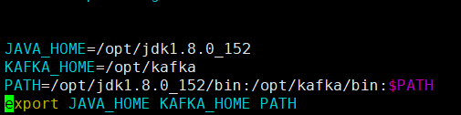

# 1. Kafka简介

## 1.1  开发中遇到的问题

- 非必要的业务逻辑以同步(串行)的方式运行，太耗费时间


- 系统间耦合性太强


- 流量激增导致宕机


## 1.2 消息队列Message Queue

### 1.2.1  消息队列是什么

消息队列，即MQ，Message Queue。


不同进程（process）之间传递消息时，两个进程之间**耦合**程度过高，改动一个进程，引发必须修改另一个进程，为了**隔离**这两个进程，在两进程间抽离出一层（一个模块），所有两进程之间传递的消息，都必须通过消息队列来传递，单独修改某一个进程，不会影响另一个；

不同进程（process）之间传递消息时，为了实现标准化，将消息的格式规范化了，并且，某一个进程接受的**消息太多**，一下子无法处理完，并且也有先后顺序，必须对收到的消息**进行排队**，因此诞生了事实上的消息队列；

消息队列是典型的：生产者、消费者模型。生产者不断向消息队列中生产消息，消费者不断的从队列中获取消息。因为消息的生产和消费都是异步的，而且只关心消息的发送和接收，没有业务逻辑的侵入，这样就实现了生产者和消费者的解耦。

结合前面所说的问题：

- 注册服务对保存注册信息以后，无需去发送邮件短信、保存日志，只是发送一条消息，不用关心消息被谁接收。
- 邮件、短信服务接收消息，去处理各自的业务。

  如果以后有其它系统(如日志系统)也依赖注册服务的数据，同样监听消息即可，注册服务无需任何代码修改。

### 1.2.2 消息队列的作用


**异步处理**

用户注册后，需要发注册邮件和注册短信。传统的串行方式会等所有业务执行完成后再返回结果。并行方式将注册信息写入数据库成功后，发送注册邮件的同时，发送注册短信，可以加快响应速度。

**应用解耦**

利用消息队列存储消息，需要消费消息的系统只需要订阅消息队列即可，有新的业务加入时无需修改原本的代码。

**流量削锋**

高并发请求同时对数据库执行写操作，`可能会导致数据库卡死导致宕机`。将请求消息保存到消息队列，系统可以按照自己的能力来消费消息。

### 1.2.3 消息队列主流产品概述

**1、Apache Kafka：**

Apache Kafka是一个分布式流处理平台，具有高吞吐量、低延迟和可靠性等特点。它广泛应用于实时数据处理、日志收集、消息队列等场景。

**2、基于JMS的产品：**

​		JMS: Java Message Service API（Java消息服务）只能在java中使用

- Apache ActiveMQ：比较成熟的产品
- RocketMQ：阿里巴巴产品，目前交由Apache基金会

**3、基于AMQP的产品**

​		AMQP：Advanced Message Queuing Protocol（高级消息队列协议） 基于协议的，可以跨语言使用

- RabbitMQ：erlang语言开发，稳定性好，响应快。


主流消息队列对比表：

| **特性** | **ActiveMQ**        | **RabbitMQ**                             | **RocketMQ**                             | **Kafka**                                |
| ------ | ------------------- | ---------------------------------------- | ---------------------------------------- | ---------------------------------------- |
| 开发语言   | java                | erlang                                   | java                                     | scala                                    |
| 单机吞吐量  | 万级                  | 万级                                       | 10万级                                     | 100万级                                    |
| 时效性    | ms                  | us                                       | ms                                       | ms级以内                                    |
| 可用性    | 高（主从）               | 高（主从）                                    | 非常高（分布式）                                 | 非常高（分布式）                                 |
| 功能特性   | 成熟的产品、较全的文档、各种协议支持好 | 并发能力强、性能好、延迟低，社区活跃度高，数据量没有那么大，优先选择功能比较完备的RabbitMQ | MQ功能比较完善，扩展性佳，可靠性要求高的金融互联网领域使用多,稳定性高，经历了多次阿里双11考验 | 只支持主要的MQ功能，大数据领域使用多，追求高吞吐量，适合产生大量数据的互联网服务的数据收集业务 |

### 1.2.4 消息分类


## 1.3 Kafka起源和特点

### 1.3.1 Kafka是什么

Kafka是Apache开源的一款基于zookeeper协调的分布式消息系统，具有高吞吐率、高性能、实时、高可靠等特点，可实时处理流式数据。它最初由LinkedIn公司开发，使用Scala语言编写。

`Kafka`历经数年的发展，从最初纯粹的消息引擎，到近几年开始在流处理平台生态圈发力，多个组织或公司发布了各种不同特性的产品。常见产品如下：

- <font color="red">**Apache Kafka** ：最“正统”的`Kafka`也是开源版，它是后面其他所有发行版的基础</font>。
- Cloudera/Hortonworks Kafka ：集成了目前主流的大数据框架，能够帮助用户实现从分布式存储、集群调度、流处理到机器学习、实时数据库等全方位的数据处理。
- Confluent Kafka ：主要提供基于`Kafka`的企业级流处理解决方案。

`Apache Kafka`，它现在依然是开发人数最多、版本迭代速度最快的`Kafka`。我们使用此产品学习。**Apache 目前为止总共演进了8个大版本，分别是0.7、0.8、0.9、0.11、1.0、2.0和3.0，我们选择kafka_2.13-3.5.1.tgz版本讲解(截止2023.8)。**

### 1.3.2 Kafka能干嘛

**Kafka特点**

- 高吞吐量、低延迟：即使是非常普通的硬件Kafka也可以支持每秒数百万的消息，它的延迟最低只有几毫秒

- 持久性：支持消息持久化，即使数TB级别的消息也能够保持长时间的稳定性能。

- 可靠性：支持数据备份防止丢失

- 容错性：支持通过Kafka服务器和消费机集群来分区消息，允许集群中的节点失败（若分区副本数量为n，则允许n-1个节点失败）
- 高并发：单机可支持数千个客户端同时读写，支持在线水平扩展。可无缝对接hadoop、strom、spark等，支持Hadoop并行数据加载，

### 1.3.3 Kafka去哪下

| kafka官网 | https://kafka.apache.org/          |
| --------- | ---------------------------------- |
| kafka下载 | https://kafka.apache.org/downloads |

### 1.3.4 Kafka怎么玩

| ID   | 设计目标     | 功能                                                         |
| ---- | ------------ | ------------------------------------------------------------ |
| 1    | 日志收集     | 一个公司可以用Kafka可以收集各种服务的Log，通过Kafka以统一接口服务的方式开放给各种Consumer |
| 2    | 消息系统     | 解耦生产者和消费者、缓存消息等                               |
| 3    | 用户活动跟踪 | 用来记录web用户或者APP用户的各种活动，如网页搜索、搜索、点击，用户数据收集然后进行用户行为分析。 |
| 4    | 运营指标     | Kafka也经常用来记录运营监控数据。包括收集各种分布式应用的数据，生产各种操作的集中反馈，比如报警和报告 |
| 5    | 流式处理     | 比如Spark Streaming和Storm                                   |

## 1.4 尚硅谷MQ视频资料

| **尚硅谷ActiveMQ教程**    | https://www.bilibili.com/video/BV164411G7aB?p=1 |
| -------------------- | ---------------------------------------- |
| 尚硅谷RabbitMQ教程        | https://www.bilibili.com/video/BV1cb4y1o7zz?p=1 |
| 尚硅谷RocketMQ教程        | https://www.bilibili.com/video/BV164411G7aB?p=1 |
| **<font color="red">(工作后用到什么再回来学具体MQ)</font>** |                                          |

# **2. Kafka单机版安装**

**上传课件资料下的《kafka_2.12-3.4.0.tgz》到虚拟机/opt目录下**

## 2.1 下载

| kafka官网 | https://kafka.apache.org/          |
| ------- | ---------------------------------- |
| kafka下载 | https://kafka.apache.org/downloads |

## **2.2 解压**

```shell
cd /opt
tar -zxvf kafka_2.12-3.4.0.tgz
# 修改解压后的文件夹名称为Kafka
mv kafka_2.12-3.4.0 Kafka
```

## **2.3 目录结构**

****

## **2.4 配置全局环境变量**

### **2.4.1 编辑profile**

* 使用kafka前提是：Linux服务器上已经有Java环境并配置好

```
vim /etc/profile
```

**文件最后的内容如下：**

****

```properties
JAVA_HOME=/opt/jdk1.8.0_152
KAFKA_HOME=/opt/kafka
PATH=/opt/jdk1.8.0_152/bin:/opt/kafka/bin:$PATH
export JAVA_HOME KAFKA_HOME PATH
```

**保存退出**

### **2.4.2 激活profile**

```shell
source /etc/profile
```

### **2.4.3 编辑config目录下的server.properties**


1. Kafka需要使用Zookeeper，默认下载包里面已经集成了Zookeeper，可以直接使用。
2. 默认Kafka是仅在本地使用，如果要远程访问，请修改config/server.properties，代码+抓图如下：

```shell
listeners=PLAINTEXT://192.168.111.172:9092
advertised.listeners=PLAINTEXT://192.168.111.172:9092
# 上面IP地址为你自己Linux系统的真实IP地址
```


```shell
zookeeper.connect=192.168.111.172:2181
# 上面IP地址为你自己Linux系统的真实IP地址
```


**最小化简单修改结论：**

kafka的默认端口9092                                     zookeeper默认端口2181


## **2.5 测试**

### **2.5.1 查看Kafka版本：**

```shell
kafka-topics.sh -version
```

****

### 2.5.2 启动Kafka自带的Zookeeper

```shell
# 前台启动，讲课用，为了给学生看到控制台浮现的zookeeper图标表示启动成功
# &使得进程在后台启动
bin/zookeeper-server-start.sh config/zookeeper.properties &

# 后台启动，开发用，也即消息内容别往前台打
# nohup 英文全称 no hang up（不挂起），用于在系统后台不挂断地运行命令，退出终端不会影响程序的运行。
# nohup bin/zookeeper-server-start.sh config/zookeeper.properties &
```

### 2.5.3 启动Kafka自身

```shell
# 前台启动，讲课用
bin/kafka-server-start.sh config/server.properties &
# 后台启动，开发用，也即消息内容别往前台打
# nohup bin/kafka-server-start.sh config/server.properties &

# -daemon 守护启动，[]表示可以省略
# server.properties Kafka配置文件
kafka-server-start.sh -daemon config/server.properties
```

完成上述两步，可以用lsof -i:端口号分别验证下:


### 2.5.4 创建Topic

```shell
bin/kafka-topics.sh --create  --topic hellokafka-topic --bootstrap-server 192.168.111.172:9092
```


### 2.5.5 查看已经创建的Topic信息

```shell
bin/kafka-topics.sh --list --bootstrap-server 192.168.111.172:9092
# 第2种方式
bin/kafka-topics.sh --describe --topic hellokafka-topic --bootstrap-server 192.168.111.172:9092
```


### 2.5.6 发送消息

```shell
bin/kafka-console-producer.sh  --topic hellokafka-topic --bootstrap-server 192.168.111.172:9092
```


### 2.5.7 消费消息

```shell
# 请新启一个客户端
bin/kafka-console-consumer.sh --topic hellokafka-topic --from-beginning --bootstrap-server 192.168.111.172:9092
```


### 2.5.8 停止kafka

```shell
bin/kafka-server-stop.sh
```

### 2.5.9 停止zookeeper

```
bin/zookeeper-server-stop.sh
```


# 3. Kafka基础架构和术语名词

从高阶和顶层看，生产者发送消息到kafka集群，然后消费者来获取消息进行后续处理


【以下是概念性质的基础名词和专业术语，请先了解，后续慢慢展开，首次听懵逼属于正常......^_^】

| **核心组件**                                 | **概念**                                                     |
| -------------------------------------------- | ------------------------------------------------------------ |
| **<font color=red>Producer</font>**          | **生产者，可以向Broker topic发布消息的客户端**               |
| **<font color=red>Consumer</font>**          | **消费者，从Broker topic订阅取消息的客户端**                 |
| **<font color=red>Broker</font>**            | **Broker是一个kafka实例，简单说就是一台kafka服务器，kafkaCluster表示集群。一个Linux服务器上启动一个或多个 kafka服务器实例。** |
| **<font color=red>Topic</font>**             | **主题,Kafka将消息分门别类，每一类的消息称之为一个主题。可以理解为一个队列，生产者和消费者面向的都是一个topic** |
| **<font color=red>Partition</font>**         | **Topic的分区，每个 Topic 可以有多个分区，同一个Topic 在不同分区的数据是不重复的，每个Partition是一个有序的队列。分区作用是做负载，提高 kafka 的吞吐量。每个partition都由一系列有序的、不可变的消息组成，这些消息被连续的追加到partition中。partition中的每个消息都有一个连续递增的序列号叫做offset，偏移量offset在每个分区中是唯一的。** |
| **Offset**                                   | **生产者Offset：消息写入的时候，每一个分区都有一个offset，这个offset就是生产者的offset，同时也是这个分区的最新最大的offset。 消费者Offset：某个分区的offset情况。例如：生产者写入的offset是最新值是10，当一个Consumer开始消费时，从0消费，一直消费到了5，消费者的offset为5。** |
| **Replication**                              | **Partition(分区)的副本。每个分区可以有多个Replication，由一个Leader和若干个Follower组成。Leader负责接收生产者push的消息和消费者poll消费消息。Follower会实时从自己的Leader中同步数据保持同步。Leader故障时,某个Follower会上位为新的Leader。保证高可用** |
| **Message**                                  | **kafka集群存储的消息是以topic为类别记录的，每个消息（也叫记录record）是由** |
| **<font color=red>ConsumerGroup(CG)</font>** | **消费者组，由多个Consumer组成，每个ConsumerGroup中可以有多个consumer，每个consumer属于一个ConsumerGroup。同一个Topic下的某一个分区只能被某个消费者组内的同一个消费者所消费，但可以被多个 consumer group 消费** |
| **In-sync Replicas（ISR）**                  | **（ISR）已同步副本：表示存活且副本都已和Leader同步的的broker集合，是Leader所有replicas副本的子集。如果某个副本节点宕机，该副本就会从ISR集合中剔除。** |

**Kafka中的Broker、Topic、Consumer都会注册到zookeeper**


## **3.1 Events, Streams, Topics**

| **Event**  | **Event**（事件），代表过去发生的一个事实(比如下了一个购物订单)。简单理解就是一条消息、一条记录，Event 是不可变的，但是很活跃，经常从一个地方流向另一个地方。 |
| :--------- | ------------------------------------------------------------ |
| **Stream** | 事件流表示运动中的相关事件                                   |
| **Topic**  | 当一个事件流进入 Kafka 之后，它就成为了一个 **Topic** 主题。所以，Topic 就是具体的事件流，也可以理解为一个 Topic 就是一个静止的 Stream。Topic 把相关的 Event 组织在一起，并且保存。一个 Topic 就像数据库中的一张表。 |


## **3.2 Partition 分区**

**Kafka 中 Topic 被分成多个 Partition 分区。Topic 是一个<font color=red>逻辑概念</font>，Partition 是最小的存储单元，掌握着一个 Topic 的部分数据。**


**每个 Partition 都是一个单独的 log 文件，每条记录都以追加的形式写入。**


## **3.3 Offsets（偏移量）和消息的顺序**

**Partition 中的每条记录都会被分配一个唯一的序号，称为 **Offset**（偏移量）。Offset 是一个递增的、不可变的数字，由 Kafka 自动维护。当一条记录写入 Partition 的时候，它就被追加到 log 文件的末尾，并被分配一个序号，作为 Offset。**


**如上图，这个 Topic 有 3 个 Partition 分区，向 Topic 发送消息的时候，实际上是被写入某一个 Partition，并赋予 Offset。消息的顺序性需要注意，一个 Topic 如果有多个 Partition 的话，那么从 Topic 这个层面来看，消息是无序的。但单独看 Partition 的话，Partition 内部消息是有序的。所以，一个 Partition 内部消息有序，一个 Topic 跨 Partition 是无序的。如果强制要求 Topic 整体有序，就只能让 Topic 只有一个 Partition。**

更进一步，如何指定写入到那个分区？


## **3.4 Partition 为 Kafka 提供了扩展能力**

**一个 Kafka 集群由多个 Broker（就是 Server） 构成，每个 Broker 中含有集群的部分数据。Kafka 把 Topic 的多个 Partition 分布在多个 Broker 中。**


| 扩容方便     | 如果把 Topic 的所有 Partition 都放在一个 Broker 上，那么这个 Topic 的可扩展性就大大降低了，会受限于这个 Broker 的 IO 能力。把 Partition 分散开之后，Topic 就可以水平扩展 |
| ------------ | ------------------------------------------------------------ |
| 防止单点故障 | 一个 Topic 可以被多个 Consumer 并行消费。如果 Topic 的所有 Partition 都在一个 Broker，那么支持的 Consumer 数量就有限，而分散之后，可以支持更多的 Consumer。 |
| 高并发       | 一个 Consumer 可以有多个实例，Partition 分布在多个 Broker 的话，Consumer 的多个实例就可以连接不同的 Broker，大大提升了消息处理能力。可以让一个 Consumer 实例负责一个 Partition，这样消息处理既清晰又高效。 |


# **4. Kafka常用命令**

****

## **4.1 启停命令**

**启动：**

```shell
# 一定先启动zookeeper
nohup bin/zookeeper-server-start.sh config/zookeeper.properties &
# -daemon 守护启动
# server.properties Kafka配置文件,在路径 /mykafka/kafka3.5.1目录下
kafka-server-start.sh -daemon config/server.properties
```

**停止：**

```shell
kafka-server-stop.sh
```

## **4.2 主题命令**

```
kafka-topics.sh
```

**常用参数列表：**

| **参数**                                   | **描述**                       |
| ---------------------------------------- | ---------------------------- |
| **--bootstrap-server <String: server toconnect to>** | **连接的Kafka Broker主机名称和端口号。** |
| **--topic <String: topic>**              | **操作的topic名称。**              |
| **--create**                             | **创建主题。**                    |
| **--delete**                             | **删除主题。**                    |
| **--alter**                              | **修改主题。**                    |
| **--list**                               | **查看所有主题。**                  |
| **--describe**                           | **查看主题详细描述。**                |
| **--partitions <Integer: # of partitions>** | **设置分区数。**                   |
| **--replication-factor<Integer: replication factor>** | **设置分区副本。**                  |
| **--config <String: name=value>**        | **更新系统默认的配置。**               |

### **4.2.1 主题列表查询**

```shell
kafka-topics.sh --bootstrap-server 192.168.111.172:9092 --list
```

### **4.2.2 创建topic(含分区和副本)**


```shell
# 创建1个分区1个副本的first主题：partitions 分区数, replication-factor 副本数，topic 主题名
# 各个参数含义如下：
# --create：创建主题的动作指令
# --bootstrap-server：指定kafka所连接的zookeeper服务地址
# --topic：指定了所要创建主题的名称
# --partitions：指定了分区个数
# --replication-factor：指定了副本因子 一个broker创建topic的时候只能是一个副本

kafka-topics.sh --bootstrap-server 192.168.111.172:9092 --create --partitions 1 --replication-factor 1 --topic first
```


```shell
# 创建3个分区1个副本的first2主题：partitions 分区数, replication-factor 副本数，topic 主题名
kafka-topics.sh --bootstrap-server 192.168.111.172:9092 --create --partitions 3 --replication-factor 1 --topic first2

# 上述命令执行完，按照【log.dirs=/tmp/kafka-logs】配置，进入到/tmp/kafka-logs
# 会看到你所建立的主题和对应分区
```


### **4.2.3 查看主题详情**

```shell
kafka-topics.sh --bootstrap-server 192.168.111.172:9092 --describe --topic first
```


### **4.2.4 修改分区数**

**注意：分区数只能增加,不能减少**

```shell
kafka-topics.sh --bootstrap-server 192.168.111.172:9092 --alter --topic first --partitions 3
```

**再次查看主题详情：**


**查询结果解释：**

**第一行显示所有partitions的概要信息：**

**​	列出了Topic名字，partition总数，存储这些partition的broker数**

**其他每一行是一个partition的详细信息：**

| Topic     | 主题                                                         |
| --------- | ------------------------------------------------------------ |
| Partition | **分区编号**                                                 |
| Leader    | **当前Partiton所有broker中担任leader的broker id，每个broker都有可能成为leader** |
| Replicas  | 显示该partiton所有副本所在的broker列表，包括leader，不管该broker是否是存活，不管是否和leader保持了同步 |
| Isr       | in-sync replicas的简写，表示存活且副本都已同步的的broker集合，是replicas的子集 |

**说明：当producer发送一个消息时，producer自己会判断发送到哪个partiton上，如果发到了partition0上，消息会发到leader上处理这个消息，其它broker会从leader上同步这个消息。如果这个leader挂了，那么Kafka会在Isr列表中选一个新的leader，不懂没关系，后续讲解Kafka集群再说**。


### **4.2.5 删除主题**

```shell
kafka-topics.sh --bootstrap-server 192.168.111.172:9092 --delete --topic first
```


## **4.3 生产者命令**

**新建主题topic: second：**

```shell
kafka-topics.sh --create  --topic hellokafka-topic --bootstrap-server 192.168.111.172:9092
```


**生产者发送消息到某个主题：**

```shell
kafka-console-producer.sh --bootstrap-server 192.168.111.172:9092 --topic second
# 输入消息，回车发送消息
>hello world
>atguigu
```

## **4.4 消费者命令**

### **4.4.1 消费者参数列表**

```
kafka-console-consumer.sh
```

**参数列表：**

| **参数**                                             | **描述**                                 |
| ---------------------------------------------------- | ---------------------------------------- |
| **--bootstrap-server <String: server toconnect to>** | **连接的Kafka Broker主机名称和端口号。** |
| **--topic <String: topic>**                          | **操作的topic名称。**                    |
| **--from-beginning**                                 | **从头重新消费topic中的消息**            |
| **--group <String: consumer group id>**              | **指定消费者组名称。**                   |

### **4.4.2 消费主题数据**

```shell
kafka-console-consumer.sh --bootstrap-server 192.168.111.172:9092 --topic second

kafka-console-consumer.sh --bootstrap-server 192.168.111.172:9092 --from-beginning --topic second
```

### **4.4.3 消费主题所有数据(包括历史数据)**

```shell
kafka-console-consumer.sh --bootstrap-server 192.168.111.172:9092  --from-beginning --topic second
```

****


## **4.5 消费者组(consumerGroup)命令**

### 4.5.1 消费组查看list

```shell
kafka-consumer-groups.sh  --bootstrap-server 192.168.111.172:9092 --list
```


### 4.5.2 消费组(点对点)

一条消息只能被同一个消费组里的一个消费者消费，组内有竞争先到先得，案例如下：

两个消费者都在同一个消费组，然后往主题里发送消息，结果只有一个消费者客户端能消费到。

也即，一个分区只能被一个消费组里面的一个消费者消费

```shell
# 新建topic kafkav1
kafka-topics.sh --create  --topic kafkav1 --bootstrap-server 192.168.111.172:9092
```

- 发送消息

  ```shell
  kafka-console-producer.sh  --topic kafkav1 --bootstrap-server 192.168.111.172:9092
  ```

  

- 两个消费者分别在不同的命令终端，但它两在同一个消费组却只有一个消费者能收到消息

  ```shell
  # 关键参数：--consumer-property group.id=group01
  kafka-console-consumer.sh --topic kafkav1 --from-beginning --bootstrap-server 192.168.111.172:9092 --consumer-property group.id=group01
  ```

  

消费者2号，也在group01同一个组里面，消费不到消息


```shell
# 消费组查看list
kafka-consumer-groups.sh  --bootstrap-server 192.168.111.172:9092 --list
```


### 4.5.3 消费组(发布-订阅模式)

一条消息能被多个消费者消费，发布订阅模式，保证不同的消费者分属不同的消费组即可做到，结果两个客户端都能收到消息

```sh
# 新增一个消费者后可以看到新的分组+消费到消息
kafka-console-consumer.sh --topic kafkav1 --from-beginning --bootstrap-server 192.168.111.172:9092 --consumer-property group.id=group02
```


**第2个组的消费者可以消费到消息：**


### 4.5.4 消费组查看offset偏移量

```shell
kafka-consumer-groups.sh  --bootstrap-server 192.168.111.172:9092 --describe --group group02
# 上述命令完成后下图1步骤
# 生产者发送一条消息，执行上述命令，下图步骤2
# 先让2号小组消费者退出(ctrl—C退出kafka-console-consumer),生产者发送一条消息，下图3会发现，消息落后了一步

# 生产者发送一条消息，执行上述命令，下图步骤4，会发现，消息落后了两步
```


| CURRENT-OFFSET | 当前消费者群组最近提交的offset，也就是消费者分区里读取的当前位置 |
| -------------- | ------------------------------------------------------------ |
| LOG-END-OFFSET | 当前最高水位偏移量，也就是最近一个读取消息的偏移量，同时也是最近一个提交到集群的偏移量 |
| LAG            | 消费者的CURRENT-OFFSET与broker的LOG-END-OFFSET之间的差距     |

### 4.5.5 消费者-消费组总结


**一个分区同一个时刻在一个消费组中只能有一个消费者在消费，从而保证消费顺序。消费组中的消费者的数量不能比一个Topic中的分区的数量多，否则，多出来的消费者消费不到消息。**


## **4.6 offset偏移量命令**

### 4.6.1 偏移量重置策略

|                     |                              |                                    |
| ------------------- | ---------------------------- | ---------------------------------- |
| --to-earliest       | 把位移调整到分区当前最小位移 |                                    |
| --to-latest         | 把位移调整到分区当前最新位移 |                                    |
| --to-current        | 把位移调整到分区当前位移     |                                    |
| --to-offset  正整数 | 把位移调整到指定位移处       |                                    |
|                     |                              |                                    |
| --execute：执行方案 | 执行真正的位移调整           | 只是打印出位移调整方案，不具体执行 |


1. to-earliest

   ```shell
   # 1
   kafka-consumer-groups.sh  --bootstrap-server 192.168.111.172:9092 --describe --group group02
   # 看结果
   
   # 2
   kafka-consumer-groups.sh --bootstrap-server 192.168.111.172:9092 --group group02 --topic kafkav1 --reset-offsets --to-earliest --execute
   ```

   

2. to-latest

   ```shell
   kafka-consumer-groups.sh --bootstrap-server 192.168.111.172:9092 --group group02 --topic kafkav1 --reset-offsets --to-latest  --execute
   # 再查看
   kafka-consumer-groups.sh  --bootstrap-server 192.168.111.172:9092 --describe --group group02
   ```

   

3. to-current

   ```shell
   kafka-consumer-groups.sh --bootstrap-server 192.168.111.172:9092 --group group02 --topic kafkav1 --reset-offsets --to-current  --execute
   # 再查看
   kafka-consumer-groups.sh  --bootstrap-server 192.168.111.172:9092 --describe --group group02
   ```

   

4. to-offset

   ```sh
   kafka-consumer-groups.sh --bootstrap-server 192.168.111.172:9092 --group group02 --topic kafkav1 --reset-offsets --to-offset 7  --execute
   # 再查看
   kafka-consumer-groups.sh  --bootstrap-server 192.168.111.172:9092 --describe --group group02
   ```


# **5. Kafka图形化监控Eagle**

## **5.1 安装**

**1、搜索镜像**

```shell
docker search efak
```

****

**2、下载镜像运行容器**

```shell
#注意：配置zookeeper服务的地址,需要较大内存，如果启动后不能访问一般是内存不足，需要关闭不相关的进程腾出内存
docker run -d --name Kafka-eagle -p 8048:8048 -e EFAK_CLUSTER_ZK_LIST="192.168.111.172:2181" nickzurich/efak:latest
```

**3、访问测试（注意防火墙互ping通过，自己本机真实IP地址）**

eagle地址：

http://192.168.111.172:8048/account/signin

****

## **5.2 使用**

### **5.2.1 首页**

**登录成功进入首页可以查看Kafka实例、主题、消费者等信息：**

****


### **5.2.2 查看Kafka列表**

****


### **5.2.3 新建主题**

****


### **5.2.4 查看主题列表**

**此页面可以修改或者删除主题，鉴权token默认是`keadmin`**

****


### **5.2.5 查看主题详情**

****

**执行命令向主题atguigu中发送消息：**

```
[root@atguigu ~]# kafka-console-producer.sh --bootstrap-server 192.168.111.172:9092 --topic atguigu 
>hello,atguigu
```

**查看分区中的消息：**

****

**注意：加载数据速度有点慢，遇到查询失败时重新查询即可**

****


# 6. Kafka原生API入门篇

## **6.1 发送消息**

### **6.1.1 项目搭建**

**创建SpringBoot项目：kafka-producter**

**SpringBoot版本：3.1.0**

****

**引入依赖：**

```xml
<!--kafka-clients 2023.8-->
<dependency>
    <groupId>org.apache.kafka</groupId>
    <artifactId>kafka-clients</artifactId>
    <version>3.5.1</version>
</dependency>
```

### **6.1.2 producer发送消息(默认)**

**需求：创建Kafka生产者，采用异步的方式发送消息到Kafka Broker**

**官方文档：**

| https://kafka.apache.org/35/javadoc/org/apache/kafka/clients/producer/KafkaProducer.html |
| ------------------------------------------------------------ |

**新建主题topic:hellokafka**

```shell
kafka-topics.sh --bootstrap-server 192.168.111.172:9092 --create  --topic hellokafka
```

**测试代码：**

```java
import org.apache.kafka.clients.producer.KafkaProducer;
import org.apache.kafka.clients.producer.ProducerConfig;
import org.apache.kafka.clients.producer.ProducerRecord;

import java.util.Properties;

public class MyProducerDemo
{
    public static final String TOPIC_NAME = "hellokafka";

    public static void main(String[] args)
    {
        // 1. 创建Kafka生产者的配置对象
        Properties properties = new Properties();
        // 2. 给Kafka配置对象添加配置信息：bootstrap.servers
        properties.put(ProducerConfig.BOOTSTRAP_SERVERS_CONFIG, "192.168.111.172:9092");
        // key,value序列化（必须）：key.serializer，value.serializer
        properties.put(ProducerConfig.KEY_SERIALIZER_CLASS_CONFIG, "org.apache.kafka.common.serialization.StringSerializer");
        properties.put(ProducerConfig.VALUE_SERIALIZER_CLASS_CONFIG, "org.apache.kafka.common.serialization.StringSerializer");
        
        // 3. 创建Kafka生产者对象
        KafkaProducer kafkaProducer = new KafkaProducer(properties);
        // 4. 调用send方法,发送消息
        for (int i = 0; i < 5; i++) {
            /*
            	public class ProducerRecord<K, V> {
            		//主题名称，必选参数
                    private final String topic;
                    //分区号，大于等于0的整数，可选参数。
                    private final Integer partition;
                    //消息的头信息，类型是RecordHeaders，可选属性。
                    private final Headers headers;
                    //键，可选参数。
                    private final K key;
                    //消息内容，必选参数。
                    private final V value;
                    //每条消息都有一个时间戳，可选参数
                    private final Long timestamp;
                }
            */
            kafkaProducer.send(new ProducerRecord<>(TOPIC_NAME, "hellokafka~" + i));
        }
        // 5. 关闭资源
        kafkaProducer.close();
    }
}
```

**注意：执行测试代码前，在控制台开启Kafka消费者监听hellokafka主题**

```shell
kafka-console-consumer.sh --topic hellokafka  --bootstrap-server 192.168.111.172:9092
```

**执行测试代码后，消费者中可以看到接收的消息**


备注：

```xml
<configuration>　　　　　　
    <!-- 如果觉得idea控制台日志太多，src\main\resources目录下新建logback.xml
屏蔽kafka debug -->
    <logger name="org.apache.kafka.clients" level="debug" />
</configuration>
```

## **6.2 消费消息**

```java
import org.apache.kafka.clients.consumer.ConsumerRecord;
import org.apache.kafka.clients.consumer.ConsumerRecords;
import org.apache.kafka.clients.consumer.KafkaConsumer;
import org.apache.kafka.clients.producer.ProducerConfig;

import java.time.Duration;
import java.util.Arrays;
import java.util.Properties;
import java.util.concurrent.TimeUnit;

/**
 * @auther zzyy
 * @create 2023-08-09 17:46
 *
 * https://kafka.apache.org/35/javadoc/org/apache/kafka/clients/consumer/KafkaConsumer.html
 */
public class MyConsumerDemo
{
    public static final String TOPIC_NAME = "hellokafka";
    public static void main(String[] args)
    {
        // 1. 创建Kafka生产者的配置对象
        Properties properties = new Properties();
        // 2. 给Kafka配置对象添加配置信息：bootstrap.servers
        properties.put(ProducerConfig.BOOTSTRAP_SERVERS_CONFIG, "192.168.111.172:9092");
        properties.setProperty("group.id", "test");
        properties.setProperty("enable.auto.commit", "true");
        properties.setProperty("auto.commit.interval.ms", "1000");
        properties.setProperty("key.deserializer", "org.apache.kafka.common.serialization.StringDeserializer");
        properties.setProperty("value.deserializer", "org.apache.kafka.common.serialization.StringDeserializer");

        KafkaConsumer<String, String> consumer = new KafkaConsumer<>(properties);
        consumer.subscribe(Arrays.asList(TOPIC_NAME));

        while (true) {
            System.out.println("....进行中");
            ConsumerRecords<String, String> records = consumer.poll(Duration.ofMillis(100));
            for (ConsumerRecord<String, String> record : records)
                System.out.printf("offset = %d, key = %s, value = %s%n", record.offset(), record.key(), record.value());

        }
    }
}
```


## **6.3 异步发送消息**

**Kafka producer默认是<font color='red'>异步发送不阻塞</font>，如果需要使用同步发送，可以在每次发送之后调用get方法，因为producer.send方法返回一个Future类型的结果，Future的get方法会一直阻塞直到该线程的任务得到返回值，也就是broker返回发送成功。**

```java
// 异步发送 默认
//kafkaProducer.send(new ProducerRecord<>("second","Kafka" + i));
// 同步发送
kafkaProducer.send(new ProducerRecord<>("second","Kafka" + i)).get();
```

## **6.4 异步发送且Callback回调**

```java
import org.apache.kafka.clients.producer.*;
import org.apache.kafka.common.serialization.StringSerializer;

import java.util.Properties;

/**
 * @auther zzyy
 * @create 2023-08-09 10:57
 */
public class KafkaProducerCallbackDemo
{
    public static final String TOPIC_NAME = "hellokafka";

    public static void main(String[] args)
    {
        //生产者配置文档：https://Kafka.apache.org/documentation.html#producerconfigs

        // 1. 创建Kafka生产者的配置对象
        Properties properties = new Properties();
        // 2. 给Kafka配置对象添加配置信息
        properties.put(ProducerConfig.BOOTSTRAP_SERVERS_CONFIG, "192.168.111.172:9092");
        // key,value序列化（必须）：key.serializer，value.serializer
        properties.put(ProducerConfig.KEY_SERIALIZER_CLASS_CONFIG, StringSerializer.class.getName());
        properties.put(ProducerConfig.VALUE_SERIALIZER_CLASS_CONFIG, StringSerializer.class.getName());
        // 3. 创建Kafka生产者对象
        KafkaProducer<String, String> kafkaProducer = new KafkaProducer<>(properties);

        // 4. 调用send方法,发送消息
        for (int i = 0; i < 5; i++) {
            // 添加回调
            kafkaProducer.send(new ProducerRecord<>(TOPIC_NAME, "atguigu " + i), new Callback() {
                //回调函数会在producer收到ack时调用，该方法有两个参数:元数据信息（RecordMetadata）和异常信息（Exception）。
                // 如果Exception为null，说明消息发送成功，否则消息发送失败。
                //注意：消息发送失败会自动重试，不需要我们在回调函数中手动重试。
                @Override
                public void onCompletion(RecordMetadata metadata, Exception exception) {
                    if (exception == null) {
                        // 没有异常,输出信息到控制台
                        System.out.println("主题：" + metadata.topic() + "->"  + "分区：" + metadata.partition()+"->"+"偏移量: "+metadata.offset());
                    } else {
                        // 出现异常打印
                        exception.printStackTrace();
                    }
                }
            });
        }
        // 5. 关闭资源
        kafkaProducer.close();
    }
}
```


# 7. Kafka原生API高阶篇

## 7.1 生产者消费者配置类

### **7.1.1 生产者配置类ProducerConfig**

```java
public class CustomProducerParameters {

    public static void main(String[] args) throws InterruptedException {
        // 1. 创建Kafka生产者的配置对象
        Properties properties = new Properties();
        // 2. 给Kafka配置对象添加配置信息：bootstrap.servers
        properties.put(ProducerConfig.BOOTSTRAP_SERVERS_CONFIG, "192.168.1.170:9091");
        // key,value序列化（必须）：key.serializer，value.serializer
        properties.put(ProducerConfig.KEY_SERIALIZER_CLASS_CONFIG, "org.apache.Kafka.common.serialization.StringSerializer");
        properties.put(ProducerConfig.VALUE_SERIALIZER_CLASS_CONFIG, "org.apache.Kafka.common.serialization.StringSerializer");
        // batch.size：批次大小，默认16K
        properties.put(ProducerConfig.BATCH_SIZE_CONFIG, 16384);
        // linger.ms：等待时间，默认0
        properties.put(ProducerConfig.LINGER_MS_CONFIG, 1);
        // RecordAccumulator：缓冲区大小，默认32M：buffer.memory
        properties.put(ProducerConfig.BUFFER_MEMORY_CONFIG, 33554432);
        // compression.type：压缩，默认none，可配置值gzip、snappy、lz4和zstd(2.1.0开始支持)四种压缩算法
        properties.put(ProducerConfig.COMPRESSION_TYPE_CONFIG,"snappy");
        // 3. 创建Kafka生产者对象
        KafkaProducer<String, String> kafkaProducer = new KafkaProducer<String, String>(properties);
        // 4. 调用send方法,发送消息
        for (int i = 0; i < 5; i++) {
            kafkaProducer.send(new ProducerRecord<>("second","atguigu " + i));
        }
        // 5. 关闭资源
        kafkaProducer.close();
    }
} 
```

**四种压缩算法对比：CPU资源充足，带宽资源有限时可以考虑使用压缩算法压缩消息。**

| **压缩类型** | **压缩比率** | **CPU 使用率** | **压缩速度** | **带宽使用率** |
| ------------ | ------------ | -------------- | ------------ | -------------- |
| **Gzip**     | **高**       | **高**         | **慢**       | **低**         |
| **Snappy**   | **一般**     | **一般**       | **一般**     | **一般**       |
| **Lz4**      | **低**       | **低**         | **快**       | **高**         |
| **Zstd**     | **一般**     | **一般**       | **一般**     | **一般**       |

### **7.1.2 消费者配置ConsumerConfig**

| **参数名称**                             | **描述**                                                     |
| ---------------------------------------- | ------------------------------------------------------------ |
| **bootstrap.servers**                    | **向Kafka集群建立初始连接用到的host/port列表。**             |
| **key.deserializer和value.deserializer** | **指定接收消息的key和value的反序列化类型。一定要写全类名。** |
| **group.id**                             | **标记消费者所属的消费者组。**                               |
| **partition.assignment.strategy**        | **消费者分区分配策略，默认策略是Range +  CooperativeSticky。Kafka可以同时使用多个分区分配策略。可以选择的策略包括：Range、RoundRobin、Sticky、CooperativeSticky** |
| **enable.auto.commit**                   | **默认值为true，消费者会自动周期性地向服务器提交偏移量。**   |
| **auto.commit.interval.ms**              | **如果设置了 enable.auto.commit 的值为true， 则该值定义了消费者偏移量向Kafka提交的频率，默认5s。** |
| **auto.offset.reset**                    | **当Kafka中没有初始偏移量或当前偏移量在服务器中不存在（如，数据被删除了），该如何处理？ earliest：自动重置偏移量到最早的偏移量。 latest：默认，自动重置偏移量为最新的偏移量。 none：如果消费组原来的（previous）偏移量不存在，则向消费者抛异常。 anything：向消费者抛异常。** |
| **offsets.topic.num.partitions**         | **__consumer_offsets的分区数，默认是50个分区。**             |
| **heartbeat.interval.ms**                | **Kafka消费者和coordinator之间的心跳时间，默认3s。该条目的值必须小于 session.timeout.ms ，也不应该高于 session.timeout.ms 的1/3。** |
| **session.timeout.ms**                   | **Kafka消费者和coordinator之间连接超时时间，默认45s。超过该值，该消费者被移除，消费者组执行再平衡。** |
| **max.poll.interval.ms**                 | **消费者处理消息的最大时长，默认是5分钟。超过该值，该消费者被移除，消费者组执行再平衡。** |
| **fetch.min.bytes**                      | **默认1个字节。消费者获取服务器端一批消息最小的字节数。**    |
| **fetch.max.wait.ms**                    | **默认500ms。如果没有从服务器端获取到一批数据的最小字节数。该时间到，仍然会返回数据。** |
| **fetch.max.bytes**                      | **默认Default:	52428800（50 m）。消费者获取服务器端一批消息最大的字节数。如果服务器端一批次的数据大于该值（50m）仍然可以拉取回来这批数据，因此，这不是一个绝对最大值。一批次的大小受message.max.bytes （broker config）or max.message.bytes （topic config）影响。** |
| **max.poll.records**                     | **一次poll拉取数据返回消息的最大条数，默认是500条。**        |

 

## **7.2 生产者分区**

### **7.2.1 生产者分区介绍**

**Kafka可以将主题划分为多个分区（Partition），会根据分区规则选择把消息存储到哪个分区中**

****

**（1）便于合理使用存储资源，每个Partition在一个Broker上存储，可以把海量的数据按照分区切割成一块一块数据存储在多台Broker上。合理控制分区的任务，可以实现负载均衡的效果。**

**（2）提高并行度，生产者可以以分区为单位发送数据；消费者可以以分区为单位进行消费数据。**


### **7.2.2 生产者分区策略**

**生产者分区策略是决定⽣产者将消息发送到哪个分区的算法。Kafka 为我们提供了默认的分区策略，同时它也⽀持你⾃定义分区策略。**

**在通过KafkaProducer的send方法发送包装成了ProducerRecord对象的消息时，必须要为ProducerRecord对象指定目标主题（topic）和消息内容（value），另外还有两个可选属性键：（key）和分区号（partition）。**

- **如果消息ProducerRecord指定分区发送，就不会使用到分区器。指定分区发送的实现方式，是在消息ProducerRecord设置分区号；**

- **如果不指定分区发送，则需要使用分区器经过规则计算出partition分区号，将消息发送到指定的分区。**

### **7.2.3 键和分区号的作用**

#### **7.2.3.1 测试案例1: 键为空，不指定分区值**

```java
package com.atguigu.kafka.partitions;

import org.apache.kafka.clients.producer.KafkaProducer;
import org.apache.kafka.clients.producer.ProducerConfig;
import org.apache.kafka.clients.producer.ProducerRecord;
import org.apache.kafka.common.serialization.StringSerializer;

import java.util.Properties;
import java.util.UUID;

/**
 * @auther zzyy
 * @create 2023-09-10 14:28
 */
public class CustomProducerCallbackPartitions
{

    public static final String TOPIC_NAME = "second";


    public static void main(String[] args) {
        // 1. 创建Kafka生产者的配置对象
        Properties properties = new Properties();
        // 2. 给Kafka配置对象添加配置信息
        properties.put(ProducerConfig.BOOTSTRAP_SERVERS_CONFIG, "192.168.111.172:9092");
        // key,value序列化（必须）：key.serializer，value.serializer
        properties.put(ProducerConfig.KEY_SERIALIZER_CLASS_CONFIG, StringSerializer.class.getName());
        properties.put(ProducerConfig.VALUE_SERIALIZER_CLASS_CONFIG, StringSerializer.class.getName());

        KafkaProducer<String, String> kafkaProducer = new KafkaProducer<>(properties);
        for (int i = 0; i < 10; i++) {
            // 不指定分区，key为空
            kafkaProducer.send(new ProducerRecord<>(TOPIC_NAME, "atguigu " + i+":"+ UUID.randomUUID().toString()),(metadata, exception) -> {
                if (exception == null) {
                    System.out.println("主题：" + metadata.topic() + "->" + "分区：" + metadata.partition());
                } else {
                    exception.printStackTrace();
                }
            });
        }
        kafkaProducer.close();
    }
}
```

**执行结果：**

****

#### **7.2.3.2 测试案例2:键为空，指定分区值**

```java
package com.atguigu.kafka.partitions;

import org.apache.kafka.clients.producer.*;
import org.apache.kafka.common.serialization.StringSerializer;

import java.util.Properties;
import java.util.UUID;

/**
 * @auther zzyy
 * @create 2023-09-10 14:35
 */
public class CustomProducerCallbackPartitions2
{
    public static final String TOPIC_NAME = "second";

    public static void main(String[] args) {
        // 1. 创建Kafka生产者的配置对象
        Properties properties = new Properties();
        // 2. 给Kafka配置对象添加配置信息
        properties.put(ProducerConfig.BOOTSTRAP_SERVERS_CONFIG, "192.168.111.172:9092");
        // key,value序列化（必须）：key.serializer，value.serializer
        properties.put(ProducerConfig.KEY_SERIALIZER_CLASS_CONFIG, StringSerializer.class.getName());
        properties.put(ProducerConfig.VALUE_SERIALIZER_CLASS_CONFIG, StringSerializer.class.getName());
        KafkaProducer<String, String> kafkaProducer = new KafkaProducer<>(properties);

        for (int i = 0; i < 2000; i++) {
            // 指定分区，key为空
            kafkaProducer.send(new ProducerRecord<>(TOPIC_NAME, 1, "","atguigu " + i+":"+ UUID.randomUUID().toString()), new Callback() {
                @Override
                public void onCompletion(RecordMetadata metadata, Exception e) {
                    if (e == null) {
                        System.out.println("主题：" + metadata.topic() + "->" + "分区：" + metadata.partition());
                    } else {
                        e.printStackTrace();
                    }
                }
            });
        }
        kafkaProducer.close();
    }
}

```

**测试结果：**

****

#### **7.2.3.3  测试案例3:键不为空，不指定分区值**

**当前场景会将key的hash值与topic的partition数进行取余得到partition值。**

```java
package com.atguigu.kafka.partitions;

import org.apache.kafka.clients.producer.*;
import org.apache.kafka.common.serialization.StringSerializer;

import java.util.Properties;

/**
 * @auther zzyy
 * @create 2023-09-10 14:37
 */
public class CustomProducerCallbackPartitions3
{
    public static void main(String[] args) {

        Properties properties = new Properties();

        properties.put(ProducerConfig.BOOTSTRAP_SERVERS_CONFIG, "192.168.111.172:9092");

        properties.put(ProducerConfig.KEY_SERIALIZER_CLASS_CONFIG, StringSerializer.class.getName());
        properties.put(ProducerConfig.VALUE_SERIALIZER_CLASS_CONFIG, StringSerializer.class.getName());

        KafkaProducer<String, String> kafkaProducer = new KafkaProducer<>(properties);

        String key = null;
        for (int i = 0; i < 5; i++) {
            // 依次指定key值为a,b,f ，数据key的hash值与3个分区求余，分别发往1、2、0
            key = "a";
            kafkaProducer.send(new ProducerRecord<>("second", key,"atguigu " + i), new Callback() {
                @Override
                public void onCompletion(RecordMetadata metadata, Exception e) {
                    if (e == null){
                        System.out.println("主题：" + metadata.topic() + "->" + "分区：" + metadata.partition()
                        );
                    }else {
                        e.printStackTrace();
                    }
                }
            });
        }

        kafkaProducer.close();
    }
}

```

**测试结果：**

**①key="a"时**

****

**②key="b"时**

****

**③key="f"时**

****

### **7.2.4 默认分区器DefaultPartitioner**

**上述分区案例策略逻辑总结如下：**

**（1）指明partition的情况下，直接写入到指定partition分区；**
**例如partition=0，所有数据写入分区0**

**（2）没有指明partition值但有key的情况下，使用murmur2hash算法计算key的hash值与topic的partition数进行取余得到partition值；**
		例如：key1的hash值=5， key2的hash值=6 ，topic的partition数=2，那么

​                   key1 对应的value1写入1号分区(5÷2余数1)，key2对应的value2写入0号分区(6÷2余数0)。

**（3）既没有partition值又没有key值的情况下，Kafka采用Sticky Partition（黏性分区器），会随机选择一个分区，并尽可能一直使用该分区，待该分区的batch（默认16k）已满或者已完成，Kafka再随机一个分区进行使用（和上一次的分区不同）。**
        例如：第一次随机选择0号分区，等0号分区当前批次满了或者linger.ms设置的时间到， Kafka再随机一个分区进行使用（如果还是0会继续随机）。

### **7.2.5 轮询分区器RoundRobinPartitioner**

**轮询分区器，将消息均匀地分配给每一个分区。**

**注意：在实际使用过程中，RoundRobinPartitioner分区器并不能真正的将将消息均匀地分配给每一个分区，而是将消费分配给第偶数分区（第0、2、4....个）。如果想要轮询效果，建议自定义分区策略。**

```java
package com.atguigu.kafka.partitions;

import org.apache.kafka.clients.producer.*;
import org.apache.kafka.common.serialization.StringSerializer;

import java.util.Properties;
import java.util.UUID;

/**
 * @auther zzyy
 * @create 2023-09-10 14:45
 */
public class CustomProducerCallbackRoundRobinPartitioner
{
    public static final String TOPIC_NAME = "second";
    public static void main(String[] args)
    {
        // 1. 创建Kafka生产者的配置对象
        Properties properties = new Properties();
        // 2. 给Kafka配置对象添加配置信息
        properties.put(ProducerConfig.BOOTSTRAP_SERVERS_CONFIG, "192.168.111.172:9092");
        // key,value序列化（必须）：key.serializer，value.serializer
        properties.put(ProducerConfig.KEY_SERIALIZER_CLASS_CONFIG, StringSerializer.class.getName());
        properties.put(ProducerConfig.VALUE_SERIALIZER_CLASS_CONFIG, StringSerializer.class.getName());
        //配置Kafka提供的RoundRobinPartitioner轮询分区器
        properties.put(ProducerConfig.PARTITIONER_CLASS_CONFIG,"org.apache.kafka.clients.producer.RoundRobinPartitioner");
        KafkaProducer<String, String> kafkaProducer = new KafkaProducer<>(properties);
        for (int i = 0; i < 10; i++) {
            kafkaProducer.send(new ProducerRecord<>(TOPIC_NAME, "atguigu " + i+":"+ UUID.randomUUID().toString()), new Callback() {
                @Override
                public void onCompletion(RecordMetadata metadata, Exception e) {
                    if (e == null) {
                        System.out.println("主题：" + metadata.topic() + "->" + "分区：" + metadata.partition()
                        );
                    } else {
                        e.printStackTrace();
                    }
                }
            });
        }
        kafkaProducer.close();
    }
}
```

**测试结果：**

****

### **7.2.6 自定义分区器**

**我们实现一个自定义分区器，发送过来的数据中如果包含atguigu发往0号分区，包含sgg发往1号分区，其他的发往2号分区。**

#### **7.2.6.1 实现自定义分区器**

```java
package com.atguigu.kafka.partitions;

import org.apache.kafka.clients.producer.Partitioner;
import org.apache.kafka.common.Cluster;

import java.util.Map;

/**
 * @auther zzyy
 * @create 2023-09-10 14:47
 */
public class MyPartitioner implements Partitioner
{
    /**
     * 返回信息发往的分区
     * @param topic         主题
     * @param key           消息的key
     * @param keyBytes      消息的key序列化后的字节数组
     * @param value         消息的value
     * @param valueBytes    消息的value序列化后的字节数组
     * @param cluster       集群元数据可以查看分区信息
     * @return
     */
    @Override
    public int partition(String topic, Object key, byte[] keyBytes, Object value, byte[] valueBytes, Cluster cluster) {
        // 获取消息
        String msgValue = value.toString();
        // 创建partition
        int partition;
        // 判断消息是否包含atguigu
        if (msgValue.contains("atguigu")){
            partition = 0;
        }else if(msgValue.contains("sgg")){
            partition = 1;
        }else{
            partition = 2;
        }
        // 返回分区号
        return partition;
    }
    // 关闭资源
    @Override
    public void close() {
    }
    // 配置方法
    @Override
    public void configure(Map<String, ?> configs) {
    }
}
```

#### **7.2.6.2 发送消息配置使用自定义分区器**

```java
package com.atguigu.kafka.partitions;

import org.apache.kafka.clients.producer.*;
import org.apache.kafka.common.serialization.StringSerializer;

import java.util.Properties;
import java.util.UUID;

/**
 * @auther zzyy
 * @create 2023-09-10 14:49
 */
public class CustomProducerCallbackPartitionsBySelf
{
    public static final String TOPIC_NAME = "second";
    public static void main(String[] args) {
        // 1. 创建Kafka生产者的配置对象
        Properties properties = new Properties();
        // 2. 给Kafka配置对象添加配置信息
        properties.put(ProducerConfig.BOOTSTRAP_SERVERS_CONFIG, "192.168.111.172:9092");
        // key,value序列化（必须）：key.serializer，value.serializer
        properties.put(ProducerConfig.KEY_SERIALIZER_CLASS_CONFIG, StringSerializer.class.getName());
        properties.put(ProducerConfig.VALUE_SERIALIZER_CLASS_CONFIG, StringSerializer.class.getName());
        //配置Kafka提供的RoundRobinPartitioner轮询分区器
        properties.put(ProducerConfig.PARTITIONER_CLASS_CONFIG,"com.atguigu.kafka.partitions.MyPartitioner");
        KafkaProducer<String, String> kafkaProducer = new KafkaProducer<>(properties);

        //String  myValue = "sgg";//分区：1
        String  myValue = "atguigu";//分区：0
        //其它分区2

        for (int i = 0; i < 10; i++) {

            kafkaProducer.send(new ProducerRecord<>(TOPIC_NAME, myValue + i+":"+ UUID.randomUUID().toString()), new Callback() {
                @Override
                public void onCompletion(RecordMetadata metadata, Exception e) {
                    if (e == null) {
                        System.out.println("主题：" + metadata.topic() + "->" + "分区：" + metadata.partition());
                    } else {
                        e.printStackTrace();
                    }
                }
            });
        }
        kafkaProducer.close();
    }
}

```

**测试结果：分别发送携带atguigu、sgg等信息测试。**

**<font color=red>小总结：Kafka为什么要分区，都有哪些分区策略？</font>**

**分区为了提供负载均衡的能力，实现系统的高伸缩性。分区策略是决定生产者将消息发送到哪个分区的算法,避免造成数据“倾斜”**

**Kafka提供了默认的分区策略，同时也支持自定义的分区策略**

- **默认分区策略：如果指定了 Key，那么默认实现按消息键保序策略；如果没有指定 Key，则使用轮询策略。**
- **自定义分区策略（限制配置生产者端的参数 partitioner.class,编写一个具体的类实现org.apache.kafka.clients.producer.Partitioner接口）：**
  - **轮询策略（Round-robin）**
  - **随机策略（Randomness）**
  - **按消息键保序策略（Key-ordering）：保证同一个 Key 的所有消息都进入到相同的分区里**

## 7.3 发送消息ack可靠性

### **7.3.1 生产者数据可靠性配置**

**Kafka支持了ack机制，保证生产者可以将消息可靠的发送到达broker。**

**生产者发送消息时可以配置ack的值：ProducerConfig.ACKS_CONFIG**

- **acks=0：生产者发送过来数据，就不管了，可靠性差数据会丢，效率最高**

- **acks=1：生产者发送过来数据，只需要Leader确认即可返回，可靠性中等，效率中等**

- **acks=-1(all)：生产者发送过来数据，Leader和ISR队列里面所有Follwer应答，可靠性高效率最低**

**在生产环境中：**

- **acks=0很少使用；**
- **acks=1，一般用于传输普通日志，允许丢个别数据；**
- **acks=-1(all)，一般用于传输重要不能丢失的数据(例如：钱、订单、积分等)，对可靠性要求比较高的场景。**

**测试代码：**

```java
public class CustomProducerAck {

    public static void main(String[] args) throws InterruptedException {

        // 1. 创建Kafka生产者的配置对象
        Properties properties = new Properties();
        // 2. 给Kafka配置对象添加配置信息：bootstrap.servers
        properties.put(ProducerConfig.BOOTSTRAP_SERVERS_CONFIG, "192.168.1.170:9092");
        // key,value序列化（必须）：key.serializer，value.serializer
        properties.put(ProducerConfig.KEY_SERIALIZER_CLASS_CONFIG, StringSerializer.class.getName());
        properties.put(ProducerConfig.VALUE_SERIALIZER_CLASS_CONFIG, StringSerializer.class.getName());
        // 设置acks  可以设置 "0","1"或者"all"
        properties.put(ProducerConfig.ACKS_CONFIG, "all");
        // 重试次数retries，默认Integer.MAX_VALUE （RETRY_BACKOFF_MS_CONFIG：重试间隔毫秒）
        properties.put(ProducerConfig.RETRIES_CONFIG, 3);
        // 3. 创建Kafka生产者对象
        KafkaProducer<String, String> kafkaProducer = new KafkaProducer<String, String>(properties);
        // 4. 调用send方法,发送消息
        for (int i = 0; i < 5; i++) {
            kafkaProducer.send(new ProducerRecord<>("second","atguigu " + i));

        }
        // 5. 关闭资源
        kafkaProducer.close();
    }
}
```


## **7.4 Kafka消费模式**

**Kafka有两种模式消费数据：**

**1、pull(拉模式，也叫发布订阅模式)：Kafka现在使用的方式，消费者可以自主选择从哪个分区开始拉取消息，并可以自主控制拉取消息的速度。Kafka 中为消费者维护着一个 offset，表示消费者已经消费的消息序号，当消费者拉取消息时，Kafka会返回该消费者还未消费的消息。虽然相比push模式实时性低一些，但是消费者灵活性高可以减少资源浪费。Kafka现在采用这种方式。**

- **可以有多个topic主题(例如：发送短息、发送邮件、保存日志等)**

- **消费者消费数据后,不会删除数据**
- **消费数据的多个消费者都可以消费到数据**

****


**2、push(推模式，也叫点对点模式)：Kafka最初的默认方式，此模式生产者将消息直接推送到 Kafka 集群中的分区中，分区自动将消息存储在磁盘上，并异步将消息传输到消费者。生产者主动控制消息的推送速度，消费者则以自己的速度从Kafka集群中拉取可用消息。虽然push模式实时性高，但是可能会发送大量重复或无效消息，浪费资源。**

- **消费者主动拉取数据，消息收到后删除消息，每个消费者都属于不同的消费者组**

****


## **7.5 消费者组**

**所有的消费者都属于某个消费者组，即消费者组是逻辑上的一个订阅者。**

### **7.5.1 消费者组介绍**

**Consumer Group（CG）：消费者组，由多个consumer组成。groupid相同的消费者们会形成一个消费者组。没有指定groupid的消费者**

**消费者组内每个消费者负责消费不同分区的数据，一个分区只能由一个组内消费者消费。**

- **消费者组之间互不影响。**

****

- **如果向消费组中添加更多的消费者，超过主题分区数量，则有一部分消费者就会闲置，不会接收任何消息。**

****


- **消费者组之间互不影响。**

****


## **7.6 offset偏移量**

### **7.6.1 offset说明**

<font color=red>**生产者offset：**</font>

**每个分区无论Leader还是Follower，都有一个LEO（log end offset，如下图虚线标注）日志末端offset，表示生产者待写入消息的offset。**

****

<font color=red>**消费者offset：**</font>

**Kafka会创建__consumer_offsets主题来保存 consumer 提交的位移，并采用key和value的方式存储：**

**key是group.id+topic+分区号，value就是当前offset的值。**

**consumer 根据offset依次消费消息。**

**同一个消费者/消费者组也可以通过重置offset多次消费某些数据，或者跳过消费某些数据。**

****

**消费者消费数据时，会涉及到下图所示的几个概念：**

- **HW(high watermark高水位)：消费者最多能消费到的位置，也就是该分区Leader和所有Follower都到达的位置。如下图[0,8]都可以被消费，[9,12]Follower正在同步数据还未提交对消费者不可见**

- **LEO(log end offset)：待写入消息的offset，此位置暂时没有消息。**


****

**Kafka提供了offset提交机制，使得Kafka在消费的过程中即使挂了或者引发再均衡问题重新分配Partation，恢复消费时仍然知道从哪里开始消费。**

**Kafka的offset有两种提交方式：**

(1) 自动提交(默认方式)   

**(2) 手动提交(可以灵活地控制offset)**

### **7.6.2 自动提交offset**

**自动提交offset可以让我们能够专注于自己的业务逻辑。**

**Kafka中偏移量的自动提交是由参数`enable_auto_commit`和`auto_commit_interval_ms`控制的，当`enable_auto_commit=true`时，Kafka在消费时会以频率为`auto_commit_interval_ms`（默认5秒）将offset提交到Kafka的__consumer_offsets主题中。**

****

**消费者自动提交offset案例：先在IDEA工具里面启动消费者开始监听**

```java
package com.atguigu.kafka.senior;

import org.apache.kafka.clients.consumer.ConsumerConfig;
import org.apache.kafka.clients.consumer.ConsumerRecord;
import org.apache.kafka.clients.consumer.ConsumerRecords;
import org.apache.kafka.clients.consumer.KafkaConsumer;

import java.time.Duration;
import java.util.Arrays;
import java.util.Properties;

/**
 * @auther zzyy
 * @create 2023-09-10 15:19
 先在IDEA工具里面启动消费者开始监听,再去生产者发送消息
 */
public class KafkaConsumerAutoCommitOffSetSeniorDemo
{
    public static final String TOPIC_NAME = "senior";

    public static void main(String[] args)
    {
        // 1. 创建Kafka生产者的配置对象
        Properties properties = new Properties();
        // 2. 给Kafka配置对象添加配置信息：bootstrap.servers
        properties.put(ConsumerConfig.BOOTSTRAP_SERVERS_CONFIG, "192.168.111.172:9092");

        // 消费者组指定ID，每个消费者都在一个消费者组里面，是消费者组去订阅了Topic
        properties.setProperty("group.id", "senior");
        //默认值为true，消费者会自动周期性地向服务器提交偏移量,true表示读过的就不来了
        properties.setProperty("enable.auto.commit", "true");
        //设置了 enable.auto.commit 的值为true， 则该值定义了消费者偏移量向Kafka提交的频率，默认5s。
        properties.setProperty("auto.commit.interval.ms", "1000");

        properties.setProperty("key.deserializer", "org.apache.kafka.common.serialization.StringDeserializer");
        properties.setProperty("value.deserializer", "org.apache.kafka.common.serialization.StringDeserializer");

        KafkaConsumer<String, String> consumer = new KafkaConsumer<>(properties);
        consumer.subscribe(Arrays.asList(TOPIC_NAME));


        while (true) {
            System.out.println("....进行中");
            // 设置1秒消费一批数据
            ConsumerRecords<String, String> records = consumer.poll(Duration.ofSeconds(1));
            // 打印消费到的数据
            for (ConsumerRecord<String, String> record : records)
            {
                System.out.printf("offset = %d, key = %s, value = %s%n", record.offset(), record.key(), record.value());
            }
        }
    }
}
```

**消费者仅关闭自动提交，但没有手动提交，导致重复消费案例：等30秒内**

```java
package com.atguigu.kafka.senior;

import org.apache.kafka.clients.consumer.ConsumerConfig;
import org.apache.kafka.clients.consumer.ConsumerRecord;
import org.apache.kafka.clients.consumer.ConsumerRecords;
import org.apache.kafka.clients.consumer.KafkaConsumer;

import java.time.Duration;
import java.util.Arrays;
import java.util.Properties;

/**
 * @auther zzyy
 * @create 2023-09-10 15:28
 *
 * **消费者仅关闭自动提交，但没有手动提交，导致重复消费案例：等30秒内**
 *
 *  1 先启动一个消费者，出来结果抓个图
 *
 *  2 再启动一个消费者，看结果和第一次对比，发现一样内容被重复消费了。
 *
 */
public class KafkaConsumerAutoCommitOffSetCloseSeniorDemo
{
    public static final String TOPIC_NAME = "senior";

    public static void main(String[] args)
    {
        // 1. 创建Kafka生产者的配置对象
        Properties properties = new Properties();
        // 2. 给Kafka配置对象添加配置信息：bootstrap.servers
        properties.put(ConsumerConfig.BOOTSTRAP_SERVERS_CONFIG, "192.168.111.172:9092");

        properties.setProperty("group.id", "senior");
        //默认值为true，修改为false关闭自动提交，如没有手动提交会重复消费消息
        properties.setProperty("enable.auto.commit", "false");
        properties.setProperty("auto.commit.interval.ms", "1000");
        properties.setProperty("key.deserializer", "org.apache.kafka.common.serialization.StringDeserializer");
        properties.setProperty("value.deserializer", "org.apache.kafka.common.serialization.StringDeserializer");

        KafkaConsumer<String, String> consumer = new KafkaConsumer<>(properties);
        consumer.subscribe(Arrays.asList(TOPIC_NAME));


        while (true) {
            System.out.println("....进行中");
            // 设置1秒消费一批数据
            ConsumerRecords<String, String> records = consumer.poll(Duration.ofSeconds(1));
            // 打印消费到的数据
            for (ConsumerRecord<String, String> record : records)
            {
                System.out.printf("offset = %d, key = %s, value = %s%n", record.offset(), record.key(), record.value());
            }
        }
    }
}
```


消费者消费消息以后自动提交，只有当消息提交以后，该消息才不会被再次接收到，

还可以配合auto.commit.interval.ms控制自动提交的频率。 
有自动必然有手动，我们也可以通过consumer.commitSync()的方式实现手动提交

### **7.6.3 手动提交offset**

 鉴于Kafka自动提交offset的不灵活性和不精确性(只能按指定频率提交)，Kafka提供了手动提交offset策略。手动提交能对偏移量更加灵活精准地控制，以保证消息不被重复消费以及消息不被丢失。

**手动提交offset的方法有两种：**

**commitSync（手动提交offset之同步提交）：必须等待offset提交完毕，再去消费下一批数据。**

**commitAsync（手动提交offset之异步提交）：发送完提交offset请求后，就开始消费下一批数据了。**

**两者都会将本次提交的一批数据最高的偏移量提交；不同的是，同步提交阻塞当前线程，一直到提交成功，并且会自动失败重试（仍会出现提交失败），而异步提交则没有失败重试机制，当消费者异常关闭或者触发了再均衡前，偏移量还未提交会造成偏移量丢失。**


****

#### **7.6.3.1 同步提交offset**

**由于同步提交offset有失败重试机制，故更加可靠，但是由于一直等待提交结果，提交的效率比较低。以下为同步提交offset的示例。**

```java
package com.atguigu.kafka.senior;

import org.apache.kafka.clients.consumer.ConsumerConfig;
import org.apache.kafka.clients.consumer.ConsumerRecord;
import org.apache.kafka.clients.consumer.ConsumerRecords;
import org.apache.kafka.clients.consumer.KafkaConsumer;

import java.time.Duration;
import java.util.Arrays;
import java.util.Properties;

/**
 * @auther zzyy
 * @create 2023-09-10 15:33
 *
 * commitSync（手动提交offset之同步提交）：必须等待offset提交完毕，再去消费下一批数据。
 */
public class KafkaConsumerAutoCommitOffSetManualSeniorDemo
{
    public static final String TOPIC_NAME = "senior";

    public static void main(String[] args)
    {
        // 1. 创建Kafka生产者的配置对象
        Properties properties = new Properties();
        // 2. 给Kafka配置对象添加配置信息：bootstrap.servers
        properties.put(ConsumerConfig.BOOTSTRAP_SERVERS_CONFIG, "192.168.111.172:9092");

        properties.setProperty("group.id", "senior");
        //默认值为true，修改为false关闭自动提交，如没有手动提交会重复消费消息
        properties.setProperty("enable.auto.commit", "false");
        properties.setProperty("auto.commit.interval.ms", "1000");


        properties.setProperty("key.deserializer", "org.apache.kafka.common.serialization.StringDeserializer");
        properties.setProperty("value.deserializer", "org.apache.kafka.common.serialization.StringDeserializer");

        KafkaConsumer<String, String> consumer = new KafkaConsumer<>(properties);
        consumer.subscribe(Arrays.asList(TOPIC_NAME));


        while (true) {
            System.out.println("....进行中");
            // 设置1秒消费一批数据
            ConsumerRecords<String, String> records = consumer.poll(Duration.ofSeconds(1));
            // 打印消费到的数据
            for (ConsumerRecord<String, String> record : records)
            {
                System.out.printf("offset = %d, key = %s, value = %s%n", record.offset(), record.key(), record.value());
            }
            // !!!!!!!!!!!同步提交offset
            //commitSync（手动提交offset之同步提交）：必须等待offset提交完毕，再去消费下一批数据。
            consumer.commitSync(); //"enable.auto.commit"设置为"false"
        }
    }
}
```

#### **7.6.3.2 异步提交offset**

**虽然同步提交offset更可靠一些，但是由于其会阻塞当前线程，直到提交成功。因此吞吐量会受到很大的影响。因此更多的情况下，会选用异步提交offset的方式，然后配合回调函数在broker做出响应的时候记录错误信息。**

**以下为异步提交offset的示例：**

```java
package com.atguigu.kafka.senior;

import org.apache.kafka.clients.consumer.ConsumerConfig;
import org.apache.kafka.clients.consumer.ConsumerRecord;
import org.apache.kafka.clients.consumer.ConsumerRecords;
import org.apache.kafka.clients.consumer.KafkaConsumer;

import java.time.Duration;
import java.util.Arrays;
import java.util.Properties;

/**
 * @auther zzyy
 * @create 2023-09-10 15:39
 *
 * **commitAsync（手动提交offset之异步提交）：发送完提交offset请求后，就开始消费下一批数据了。**
 */
public class KafkaConsumerAutoCommitOffSetManualV2SeniorDemo
{
    public static final String TOPIC_NAME = "senior";

    public static void main(String[] args)
    {
        // 1. 创建Kafka生产者的配置对象
        Properties properties = new Properties();
        // 2. 给Kafka配置对象添加配置信息：bootstrap.servers
        properties.put(ConsumerConfig.BOOTSTRAP_SERVERS_CONFIG, "192.168.111.172:9092");

        properties.setProperty("group.id", "senior");
        //默认值为true，修改为false关闭自动提交，如没有手动提交会重复消费消息
        properties.setProperty("enable.auto.commit", "false");
        properties.setProperty("auto.commit.interval.ms", "1000");

        properties.setProperty("key.deserializer", "org.apache.kafka.common.serialization.StringDeserializer");
        properties.setProperty("value.deserializer", "org.apache.kafka.common.serialization.StringDeserializer");

        KafkaConsumer<String, String> consumer = new KafkaConsumer<>(properties);
        consumer.subscribe(Arrays.asList(TOPIC_NAME));

        while (true) {
            System.out.println("....进行中");
            // 设置1秒消费一批数据
            ConsumerRecords<String, String> records = consumer.poll(Duration.ofSeconds(1));
            // 打印消费到的数据
            for (ConsumerRecord<String, String> record : records){
                System.out.printf("offset = %d, key = %s, value = %s%n", record.offset(), record.key(), record.value());
            }
            // !!!!!!!!!!异步提交offset
            // commitAsync（手动提交offset之异步提交）：发送完提交offset请求后，就开始消费下一批数据了。
            consumer.commitAsync();//"enable.auto.commit"设置为"false"
        }
    }
}
```

### **7.6.4 指定Offset消费**

**当Kafka中没有初始偏移量（消费者组第一次消费）或服务器上不再存在当前消费者偏移量时（例如该数据已被删除），该怎么办？**

**可以配置参数：**ConsumerConfig.AUTO_OFFSET_RESET_CONFIG

**auto.offset.reset = earliest | latest | none   默认是latest。**

**（1）earliest：自动将偏移量重置为最早的偏移量，--from-beginning。对于新的GroupId来说，如果设置为earliest，它会从最早的消息开始进行消费，但是对于已经消费过的GroupId来说，它还是会从最大的offset取**

**（2）latest（默认值）：自动将偏移量重置为最新偏移量。对于新的GroupId来说，它直接取最近的值，就是已经消费且提交的最大的offset值**

**（3）none：如果未找到消费者组的先前偏移量，则向消费者抛出异常。**

 

**测试案例：**

```java
package com.atguigu.kafka.senior;

import org.apache.kafka.clients.consumer.ConsumerConfig;
import org.apache.kafka.clients.consumer.ConsumerRecord;
import org.apache.kafka.clients.consumer.ConsumerRecords;
import org.apache.kafka.clients.consumer.KafkaConsumer;

import java.time.Duration;
import java.util.Arrays;
import java.util.Properties;

/**
 * @auther zzyy
 * @create 2023-09-10 15:51
 */
public class KafkaConsumerAutoCommitOffSetResetSeniorDemo
{
    public static final String TOPIC_NAME = "senior";

    public static void main(String[] args)
    {
        // 1. 创建Kafka生产者的配置对象
        Properties properties = new Properties();
        // 2. 给Kafka配置对象添加配置信息：bootstrap.servers
        properties.put(ConsumerConfig.BOOTSTRAP_SERVERS_CONFIG, "192.168.111.172:9092");

        properties.setProperty("group.id", "senior77");
        //默认值为true，修改为false关闭自动提交，如没有手动提交会重复消费消息
        properties.setProperty("enable.auto.commit", "true");
        properties.setProperty("auto.commit.interval.ms", "1000");
        properties.setProperty("key.deserializer", "org.apache.kafka.common.serialization.StringDeserializer");
        properties.setProperty("value.deserializer", "org.apache.kafka.common.serialization.StringDeserializer");

        // 设置 auto.offset.reset   none、latest、earliest
        //none: 使用新的消费者组名时，找不到自己的offset 会抛出异常NoOffsetForPartitionException
        //latest: 将offset设置为最新的
        //earliest：将offset设置为最早的
        properties.put(ConsumerConfig.AUTO_OFFSET_RESET_CONFIG, "none");

        KafkaConsumer<String, String> consumer = new KafkaConsumer<>(properties);
        consumer.subscribe(Arrays.asList(TOPIC_NAME));
        while (true) {
            System.out.println("....进行中");
            // 设置1秒消费一批数据
            ConsumerRecords<String, String> records = consumer.poll(Duration.ofSeconds(1));
            // 打印消费到的数据
            for (ConsumerRecord<String, String> record : records)
            {
                System.out.printf("offset = %d, key = %s, value = %s%n", record.offset(), record.key(), record.value());
            }
        }
    }
}
```

1. 新的GroupId，earliest

2. 新的GroupId，lastest

3. 新的GroupId，none

   


# **8. Kafka分布式集群搭建**

## **8.1 Kafka集群机制**

- **Kafka是天然支持集群的，哪怕是一个节点实际上也是集群模式**
- **Kafka集群依赖于Zookeeper进行协调，并且在早期的Kafka版本中很多数据都是存放在Zookeeper的**
- **Kafka节点只要注册到同一个Zookeeper上就代表它们是同一个集群的**
- **Kafka通过brokerId来区分集群中的不同节点**

## **8.2 分析**

**为了测试方便，我们选择搭建伪分布式Kafka集群，在同一台虚拟机上启动**

**1个zookeeper实例，**

**3个Kafka实例搭建集群，创建Topic时可以分成3个partition,每个partition包括leader在内3个replication。**

**集群配置如下：**

|                   | **server1**                                       | **server2**                                       | **server3**                                       |
| ----------------- | ------------------------------------------------- | ------------------------------------------------- | ------------------------------------------------- |
| **zookeeper**     | **192.168.111.172:2181**                          | **192.168.111.172:2181**                          | **192.168.111.172:2181**                          |
| **kafka**         | **192.168.111.172:9095**                          | **192.168.111.172:9096**                          | **192.168.111.172:9097**                          |
| **kafka配置文件** | **/mykafka/kafka3.5.1/config/server1.properties** | **/mykafka/kafka3.5.1/config/server2.properties** | **/mykafka/kafka3.5.1/config/server3.properties** |
| **kafka日志文件** | **/tmp/kafkacluster-logs1**                       | **/tmp/kafkacluster-logs2**                       | **/tmp/kafkacluster-logs3**                       |


## **8.3 搭建**

### **8.3.1 配置文件**

```shell
# 此步可选，也可以用原来单机版的zookeeper.properties，如果想单独为集群做一个zookeeper.properties
# 进入/mykafka/kafka3.5.1路径下，准备zookeeper配置文件zookeeper.properties
cp zookeeper.properties zookeeper4cluster.properties

# 进入/mykafka/kafka3.5.1/config路径下，准备Kafka配置文件，参考原来单机版server.properties
cp server.properties server1.properties
cp server.properties server2.properties
cp server.properties server3.properties
```

**Kafka实例1配置文件：**

```shell
vim /mykafka/kafka3.5.1/config/server1.properties
```

**修改内容如下：**

```properties
# Kafka实例1配置文件,配置完1后照着它拷贝进行2和3实例配置
broker.id=1
listeners=PLAINTEXT://192.168.111.172:9095
advertised.listeners=PLAINTEXT://192.168.111.172:9095
log.dirs=/tmp/kafkacluster-logs1
zookeeper.connect=192.168.111.172:2181
```

**Kafka实例2配置文件：**

```shell
vim /mykafka/kafka3.5.1/config/server2.properties
```

**修改内容如下：**

```properties
broker.id=2
listeners=PLAINTEXT://192.168.111.172:9096
advertised.listeners=PLAINTEXT://192.168.111.172:9096
log.dirs=/tmp/kafkacluster-logs2
zookeeper.connect=192.168.111.172:2181
```

**Kafka实例3配置文件：**

**修改内容如下：**

```properties
broker.id=3
listeners=PLAINTEXT://192.168.111.172:9097
advertised.listeners=PLAINTEXT://192.168.111.172:9097
log.dirs=/tmp/kafkacluster-logs3
zookeeper.connect=192.168.111.172:2181
```

### **8.3.2 修改Kafka和zk的启动内存[可选+可选+可选]**

**修改Kafka启动内存大小：**

```shell
vim /opt/Kafka/bin/Kafka-server-start.sh
```

**修改内容如下：**

```
if [ "x$KAFKA_HEAP_OPTS" = "x" ]; then
    export KAFKA_HEAP_OPTS="-Xmx256M -Xms256M"
```

**修改zk启动内存大小:**

```shell
vim /opt/Kafka/bin/zookeeper-server-start.sh
```

**修改内容如下：**

```
if [ "x$KAFKA_HEAP_OPTS" = "x" ]; then
    export KAFKA_HEAP_OPTS="-Xmx256M -Xms256M"
```

### **8.3.3 启动zk**

```shell
# 等待2秒钟后请用命令lsof -i:2181查看zk是否成功启动，务必保证zk先OK
# /mykafka/kafka3.5.1路径下，启动
zookeeper-server-start.sh -daemon  config/zookeeper.properties
```

### **8.3.4 启动Kafka**

```shell
# 先保证原来单机版的kafka实例关闭，9092端口不被占用

# /mykafka/kafka3.5.1路径下，启动Kafka实例1
kafka-server-start.sh -daemon config/server1.properties
# /mykafka/kafka3.5.1路径下，启动Kafka实例2
kafka-server-start.sh -daemon config/server2.properties
# /mykafka/kafka3.5.1路径下，启动Kafka实例3
kafka-server-start.sh -daemon config/server3.properties
```

### **8.3.5 查看启动是否成功**

```shell
jps -l | grep -v jps
```


**如上图所示，三个Kafka和一个zk实例启动成功。**

### **8.3.6 停止Kafka和zk**

```shell
# 停止Kafka：
kafka-server-stop.sh
# 停止zk
zookeeper-server-stop.sh
```

## **8.5 使用集群**

### 8.5.1 创建集群主题

```shell
# 建立3个分区并给每个分区建立3个副本
kafka-topics.sh --bootstrap-server 
192.168.111.172:9095,192.168.111.172:9096,192.168.111.172:9097 --create --partitions 3 --replication-factor 3 --topic myclustertopic
```


### 8.5.2 查看集群主题

```shell
kafka-topics.sh --bootstrap-server 192.168.111.172:9095 --describe --topic myclustertopic
```


### 8.5.3 集群消息发送

```shell
kafka-console-producer.sh --bootstrap-server 192.168.111.172:9095,192.168.111.172:9096,192.168.111.172:9097 --topic myclustertopic
```


### 8.5.4 集群消息消费

```shell
kafka-console-consumer.sh --bootstrap-server 192.168.111.172:9095,192.168.111.172:9096,192.168.111.172:9097  --from-beginning --topic myclustertopic
```


### 8.5.4 集群相关命令

```shell
kafka-topics.sh --bootstrap-server 192.168.111.172:9095 --delete --topic myclustertopic
```


```shell

新建
kafka-topics.sh --bootstrap-server 192.168.111.172:9095,192.168.111.172:9096,192.168.111.172:9097 --create --partitions 3 --replication-factor 3 --topic myclustertopic

删除
kafka-topics.sh --bootstrap-server 192.168.111.172:9095 --delete --topic myclustertopic

kafka-topics.sh --bootstrap-server 192.168.111.172:9095,192.168.111.172:9096,192.168.111.172:9097 --delete --topic spring_test_topic


查看
kafka-topics.sh --bootstrap-server 192.168.111.172:9095 --describe --topic myclustertopic
kafka-topics.sh --bootstrap-server 192.168.111.172:9096 --list

发送

kafka-console-producer.sh --bootstrap-server 192.168.111.172:9095,192.168.111.172:9096,192.168.111.172:9097 --topic myclustertopic


消费
kafka-console-consumer.sh --bootstrap-server 192.168.111.172:9095,192.168.111.172:9096,192.168.111.172:9097  --from-beginning --topic myclustertopic

# 将消费者偏移量设置为最初偏移量
kafka-consumer-groups.sh --bootstrap-server 192.168.111.172:9092 --group group02 --topic kafkav1 --reset-offsets --to-earliest --execute
```


### **8.5.5 集群环境消息可靠性解决方案**

**集群环境中一个主题有多个分区，一个分区又有一个leader和多个follower。**

**默认情况：生产者发送消息不需要等待应答，数据可靠性差。**

**解决：生产者发送的数据，leader接收到后应答。**

**情况2：生产者发送消息到分区的leader中，如果leader数据落盘ack应答但是follower还未同步时宕机，数据就丢失了。**

**解决：生产者发送的数据，leader和ISR(和leader保持同步的leader和follower集合)中所有的follower都接收/同步到数据后应答。**

**情况3：基于情况2的解决方案，如果有一个follower因为故障不能同步leader的数据，迟迟不能应答，问题该如何解决？**

**解决：将迟迟不能和leader同步的follower踢出ISR**


# **9. SpringBoot整合Kafka**

## **9.1 介绍**

**官网：https://spring.io/projects/spring-Kafka**

**SpringKafka提供了KafkaTemplate模板类和@KafkaListener注解简化了Kafka的使用**

****


## **9.2 生产者**

### **9.2.1 项目搭建**

#### **9.2.1.1 创建项目**

**创建springboot项目：spring-kafka-producter**

****

#### **9.2.1.2 引入依赖**

**修改springboot项目版本：3.1.0**

**引入spring-web和spring-Kafka依赖**

```xml
<?xml version="1.0" encoding="UTF-8"?>
<project xmlns="http://maven.apache.org/POM/4.0.0" xmlns:xsi="http://www.w3.org/2001/XMLSchema-instance"
         xsi:schemaLocation="http://maven.apache.org/POM/4.0.0 https://maven.apache.org/xsd/maven-4.0.0.xsd">
    <modelVersion>4.0.0</modelVersion>
    <parent>
        <groupId>org.springframework.boot</groupId>
        <artifactId>spring-boot-starter-parent</artifactId>
        <version>3.1.3</version>
        <relativePath/> <!-- lookup parent from repository -->
    </parent>
    <groupId>com.atguigu.kafka</groupId>
    <artifactId>spring-kafka-producter</artifactId>
    <version>0.0.1-SNAPSHOT</version>
    <name>spring-kafka-producter</name>
    <description>spring-kafka-producter</description>
    <properties>
        <java.version>17</java.version>
    </properties>
    <dependencies>
        <dependency>
            <groupId>org.springframework.boot</groupId>
            <artifactId>spring-boot-starter-web</artifactId>
        </dependency>

        <dependency>
            <groupId>org.projectlombok</groupId>
            <artifactId>lombok</artifactId>
            <optional>true</optional>
        </dependency>
        <dependency>
            <groupId>org.springframework.boot</groupId>
            <artifactId>spring-boot-starter-test</artifactId>
            <scope>test</scope>
        </dependency>
        <!--spring-kafka-->
        <dependency>
            <groupId>org.springframework.kafka</groupId>
            <artifactId>spring-kafka</artifactId>
        </dependency>
        <!--hutool-->
        <dependency>
            <groupId>cn.hutool</groupId>
            <artifactId>hutool-all</artifactId>
            <version>5.8.19</version>
        </dependency>
    </dependencies>

    <build>
        <plugins>
            <plugin>
                <groupId>org.springframework.boot</groupId>
                <artifactId>spring-boot-maven-plugin</artifactId>
                <configuration>
                    <excludes>
                        <exclude>
                            <groupId>org.projectlombok</groupId>
                            <artifactId>lombok</artifactId>
                        </exclude>
                    </excludes>
                </configuration>
            </plugin>
        </plugins>
    </build>
</project>
```

#### **9.2.1.3 添加配置**

**application.yml配置----v1版**

```yaml
server:
  port: 8110

# v1
spring:
  kafka:
    bootstrap-servers: 192.168.111.172:9095,192.168.111.172:9096,192.168.111.172:9097
    producer: # producer 生产者
      retries: 0 # 重试次数 0表示不重试
      acks: -1 # 应答级别:多少个分区副本备份完成时向生产者发送ack确认(可选0、1、-1/all)
      batch-size: 16384 # 批次大小 单位byte
      buffer-memory: 33554432 # 生产者缓冲区大小 单位byte
      key-serializer: org.apache.kafka.common.serialization.StringSerializer # key的序列化器
      value-serializer: org.apache.kafka.common.serialization.StringSerializer # value的序列化器
```

### **9.2.2 新建主题**

**创建配置类：**

```java
@Configuration
public class KafkaConfig
{
    @Bean
    public NewTopic springTestTopic(){
        return TopicBuilder.name("spring_test_topic") //主题名称
                .partitions(3) //分区数量
                .replicas(3) //副本数量
                .build();
    }
}
```

**启动生产者服务**


**通过Eagle控制台可以查看到主题新建成功：**

****

### **9.2.3 发送消息**

#### **9.2.3.1 发送简单消息**

```java
@Resource
KafkaTemplate kafkaTemplate;
@Test
void sendMsg() {
    //参数1：主题名称
    //参数2：消息内容
    kafkaTemplate.send("spring_test_topic","hello,Kafka");
}
```

**执行测试代码，通过Eagle控制台可以查看到消息发送成功：**

****

#### **9.2.3.2 生产者确认**

**生产者发送消息后接收到Kafka服务端应答acks可以通过回调确认消息是否发送成功**

**1、创建生产者监听器**

```java
@Component
@Slf4j
public class KafkaSendResultHandler implements ProducerListener {
    /**
     * Kafka发送成功回调
     * @param producerRecord
     * @param recordMetadata
     */
    @Override
    public void onSuccess(ProducerRecord producerRecord, RecordMetadata recordMetadata) {
        String topic = producerRecord.topic();
        String value = producerRecord.value().toString();
        log.info("topic：{}，value：{}， 发送成功回调",topic,value);
    }

    @Override
    public void onError(ProducerRecord producerRecord, RecordMetadata recordMetadata, Exception exception) {
        String topic = producerRecord.topic();
        String value = producerRecord.value().toString();
        log.info("topic：{}，value：{}， 发送失败，原因：{}",topic,value,exception.getMessage());
    }
}
```

**2、发送消息测试**

```java
@SpringBootTest
@Slf4j
class SpringKafkaProducterApplicationTests {
    @Resource
    KafkaTemplate<String,String> kafkaTemplate;
    @Test
    void sendMsg() throws IOException {
      kafkaTemplate.send("spring_test_topic","hello,Kafka3");
      //阻塞：避免回调未执行时线程结束
      System.in.read();
    }
}
```

**成功时，控制台可以看到成功回调输出的日志：**

****

#### **9.2.3.3 发送复杂消息**

**1、新建javabean**

```java
@Data
@AllArgsConstructor
public class UserDTO {
    private String name;
    private Integer age;
    private String mobile;
}
```

**2、发送对象消息**

```java
@SpringBootTest
@Slf4j
class SpringKafkaProducterApplicationTests {
    @Resource
    KafkaTemplate kafkaTemplate;
    @Test
    void sendMsg() throws IOException {
//      kafkaTemplate.send("spring_test_topic","hello,Kafka3");
        kafkaTemplate.send("spring_test_topic",new UserDTO("pangju",39,"13512345678"));
      //阻塞：避免回调未执行时线程结束
      System.in.read();
    }
}
```

**执行报错：**

```
Caused by: java.lang.ClassCastException: class com.atguigu.spring.Kafka.producter.bean.UserDTO cannot be cast to class java.lang.String (com.atguigu.spring.Kafka.producter.bean.UserDTO is in unnamed module of loader 'app'; java.lang.String is in module java.base of loader 'bootstrap')
```

**原因：生产者值的序列化器配置的是StringSerializer**

**解决：appication.yml中修改生产者序列化器**

```yaml
server:
  port: 8110

# v1
#spring:
#  kafka:
#    bootstrap-servers: 192.168.111.172:9095,192.168.111.172:9096,192.168.111.172:9097
#    producer: # producer 生产者
#      retries: 0 # 重试次数 0表示不重试
#      acks: -1 # 应答级别:多少个分区副本备份完成时向生产者发送ack确认(可选0、1、-1/all)
#      batch-size: 16384 # 批次大小 单位byte
#      buffer-memory: 33554432 # 生产者缓冲区大小 单位byte
#      key-serializer: org.apache.kafka.common.serialization.StringSerializer # key的序列化器
#      value-serializer: org.apache.kafka.common.serialization.StringSerializer # value的序列化器
      
# v2      
spring:
  kafka:
    bootstrap-servers: 192.168.111.172:9095,192.168.111.172:9096,192.168.111.172:9097
    producer: # producer 生产者
      retries: 0 # 重试次数 0表示不重试
      acks: -1 # 应答级别:多少个分区副本备份完成时向生产者发送ack确认(可选0、1、-1/all)
      batch-size: 16384 # 批次大小 单位byte
      buffer-memory: 33554432 # 生产者缓冲区大小 单位byte
      key-serializer: org.apache.kafka.common.serialization.StringSerializer # key的序列化器
      value-serializer: org.springframework.kafka.support.serializer.JsonSerializer # 配置json序列化器      
```

**再次执行发送对象消息的代码，可以正常发送：**

**

#### **9.2.3.4 生产者拦截器**

**消息在通过 send() 方法发往 broker 的过程中，有可能依次经过拦截、序列化器和分区器 的一系列作用之后才被真正地发往 broker。**

**生产者拦截器既可以用来在消息发送前做一些准备工作，比如按照检查、修改消息内容，也可以用来在发送回调逻辑前做一些定制化的需求，比如统计工作。**

**需求：统计消息发送的成功率**

**1、创建生产者拦截器**

```java
package com.atguigu.kafka.interceptors;

import lombok.extern.slf4j.Slf4j;
import org.apache.kafka.clients.producer.ProducerInterceptor;
import org.apache.kafka.clients.producer.ProducerRecord;
import org.apache.kafka.clients.producer.RecordMetadata;
import org.springframework.stereotype.Component;

import java.util.Map;

/**
 * @auther zzyy
 * @create 2023-09-10 17:01
 */
@Component
@Slf4j
public class KafkaProducerInterceptor implements ProducerInterceptor<String,String>
{
    private volatile long success = 0;
    private volatile long failure = 0;
    //消息发送前执行：可以对消息内容进行处理
    @Override
    public ProducerRecord<String, String> onSend(ProducerRecord<String, String> producerRecord) {
        log.info("即将发送的消息内容:{}",producerRecord.value());
        //此处可以修改producerRecord的属性值然后return
        return producerRecord;
    }
    //Kafka服务端应答后，应答到达生产者确认回调前执行
    @Override
    public void onAcknowledgement(RecordMetadata recordMetadata, Exception e) {
        if(null==e){//成功
            success++;
        }else{//失败
            failure++;
        }
    }
    //拦截器销毁前执行
    @Override
    public void close() {
        log.info("消息发送统计,成功数量：{}，失败数量：{}，成功比例：{}",
                success,failure,(success*1.0/(success+failure))*100+"%");
    }

    @Override
    public void configure(Map<String, ?> map) {

    }
}
```

**2、KafkaTemplate配置生产者拦截器**

```java
package com.atguigu.kafka;

import com.atguigu.kafka.interceptors.KafkaProducerInterceptor;
import jakarta.annotation.PostConstruct;
import jakarta.annotation.Resource;
import org.springframework.boot.SpringApplication;
import org.springframework.boot.autoconfigure.SpringBootApplication;
import org.springframework.kafka.core.KafkaTemplate;

@SpringBootApplication
public class SpringKafkaProducterApplication
{
    @Resource
    KafkaTemplate<String,String> kafkaTemplate;
    @Resource
    KafkaProducerInterceptor kafkaProducerInterceptor;
    @PostConstruct
    public void init()
    {
        kafkaTemplate.setProducerInterceptor(kafkaProducerInterceptor);
        System.out.println("----init success over,KafkaTemplate配置生产者拦截器kafkaProducerInterceptor");
    }

    public static void main(String[] args)
    {
        SpringApplication.run(SpringKafkaProducterApplication.class, args);
    }
}
```

**3、测试代码发送消息**

```java
    @Test
    void sendMsgByProducerInterceptor() throws IOException {
        for (int i = 0; i < 10; i++) {
            kafkaTemplate.send("spring_test_topic",i/5,"",new UserDTO("pangju"+i,39,"13512345678"));
        }
    }
```

**控制台日志：**

****

**<font color=red>备注：最后关闭自己的微服务，结果才出来表示触发了close()方法</font>**


### **9.2.4 生产者事务*

#### **9.2.4.1 数据传递语义**

- **At Most Once（默认）：最多一次【允许为0次，数据可能丢失】**

  **Producer禁止重试**

- **At Least Once：至少一次【至少一次，允许多次，数据可能重复】**

  **Producer开启了重试机制，当发送的消息没有收到Kafka集群成功的应答时会再次发送数据**

- **Exactly Once：有且仅有一次【只有一次，精准数据传输】**

   **Kafka通过幂等性和事务这两个机制保证了精准一次**

**Kafka 0.11版本以后，引入了幂等性和事务。**

#### **9.2.4.2 幂等性**

**什么是幂等性?**

**幂等性就是指Producer不论向Broker发送多少次重复数据，Broker端都只会持久化一条，保证了不重复。**

****


#### **9.2.4.3 springkafka事务**

**幂等性只能保证单次会话内的精准一次性，不能解决跨会话和跨分区的问题。事务保证Kafka在 Exactly Once 语义的基础上，Producer 和 Consumer 可以跨分区会话，要么全部成功，要么全部失败。**

**Kafka事务是指一系列的生产者生产消息和消费者提交偏移量的操作在一个事务中，是一个原子操作，同时成功或者失败。**

**`Kafka`事务操作有一些要求，首先`acks=all`，要确保每个节点都能同步消息，同时`retries>0`，满足这2个条件后，就可以使用`Kafka`事务。**

 

**1、事务配置,yml---V3**

****

```yaml
      retries: 1 # 重试次数
      acks: -1
      # 事务前缀：配置后producer自动开启事务
      transaction-id-prefix: tx_
```

**2、测试代码**

**测试发送两条消息，并在中间制造异常**

```java
//添加事务注解：会自动回滚
@Transactional
@Test
void sendMsg()  {
    //        kafkaTemplate.send("spring_test_topic","key","trans_data1");
    //        int i = 1/0;
    //        kafkaTemplate.send("spring_test_topic","trans_data2");
    //事务多消息发送：和上面效果一致
    kafkaTemplate.executeInTransaction(operations -> {
        operations.send("spring_test_topic","key","trans_data1");
        int i = 1/0;
        operations.send("spring_test_topic","key","trans_data2");
        return true;
    });
}
```

**执行测试，可以看到生产者监听器的消息发送失败的日志：**

```
KafkaSendResultHandler: topic：spring_test_topic，value：trans_data1， 发送失败，原因：Failing batch since transaction was aborted
```

### **9.2.5 生产者数据有序**

**Kafka 最多只保证单分区内的消息是有序的，所以如果要保证业务全局严格有序，就要设置 Topic 为单分区。但是，某批次的数据发送失败后，进行了重试，也可能出现后边的批次先于它到达的情况。**

**如何保证单分区内数据有序or怎么解决乱序？**

**解决方案：**
**通过将指定key的消息发送到同一个分区，可以保证消息的局部有序，因为Kafka可以保证同一个分区的消息是严格有序的，然后设置retries等于0**

**1、配置重试次数，将application.yml恢复到V2版本配置**

```yaml
# v2
spring:
  kafka:
    bootstrap-servers: 192.168.111.172:9095,192.168.111.172:9096,192.168.111.172:9097
    producer: # producer 生产者
      retries: 0 # 重试次数 0表示不重试
      acks: -1 # 应答级别:多少个分区副本备份完成时向生产者发送ack确认(可选0、1、-1/all)
      batch-size: 16384 # 批次大小 单位byte
      buffer-memory: 33554432 # 生产者缓冲区大小 单位byte
      key-serializer: org.apache.kafka.common.serialization.StringSerializer # key的序列化器
      value-serializer: org.springframework.kafka.support.serializer.JsonSerializer # 配置json序列化器
```

**2、发送消息时指定key保证发送到同一个分区**

```java
    @Resource
    KafkaTemplate<String,Object> kafkaTemplate2;
    @Test
    void sendMsgBysendMsgSamePartition() throws IOException
    {
        System.out.println(kafkaTemplate2.send("spring_test_topic", "b", "ordered_data1").join().getRecordMetadata().partition());
        System.out.println(kafkaTemplate2.send("spring_test_topic", "b", "ordered_data1").join().getRecordMetadata().partition());
    }
```


## **9.3 消费者**

### **9.3.1 项目搭建**

#### **9.3.1.1 创建项目**

**创建springboot项目：spring-kafka-consumer**

****

#### **9.3.1.2 引入依赖**

**修改springboot项目版本：3.1.0**

**引入spring-web和spring-Kafka依赖**

```xml
<dependency>
    <groupId>org.springframework.boot</groupId>
    <artifactId>spring-boot-starter-web</artifactId>
</dependency>
<dependency>
    <groupId>org.springframework.kafka</groupId>
    <artifactId>spring-kafka</artifactId>
</dependency>
<dependency>
    <groupId>org.projectlombok</groupId>
    <artifactId>lombok</artifactId>
</dependency>
```

#### **9.2.1.3 添加配置**

**application.yml配置**

```yaml
server:
  port: 8120

# v1
spring:
  Kafka:
    bootstrap-servers: 192.168.111.172:9095,192.168.111.172:9096,192.168.111.172:9097
    consumer: # consumer消费者配置
      group-id: consumer-group # 默认的消费组ID
      enable-auto-commit: true # 是否自动提交offset
      auto-commit-interval: 120000 # 自动提交offset时间间隔2分钟。这期间服务异常停止时，再次重启会导致重复消费
      auto-offset-reset: latest  # 指定Offset消费:earliest | latest | none
      key-deserializer: org.apache.kafka.common.serialization.StringDeserializer
      value-deserializer: org.apache.kafka.common.serialization.StringDeserializer
```

### **9.3.2 简单消费**

#### **9.3.2.1 前面已经有了spring_test_topic主题，直接复用或者命令自己创建一个**

```java
@Configuration
public class KafkaInitConfig
{
    @Bean
    public NewTopic springTestTopic2(){
        return TopicBuilder.name("spring_test_topic") //主题名称
                .partitions(3) //分区数量
                .replicas(3) //副本数量
                .build();
    }
}
```


#### **9.3.2.2 创建消费者监听器**

```java
@Component
public class KafkaListeners {
    /**
     * 简单消费：
     * topics：消费的主题列表
     *	接收消息的两种方式：
     *	1、记录对象
     *		ConsumerRecord<String, String> record
     *  2、通过注解获取
     *		@Payload String data,
     *		@Header(KafkaHeaders.RECEIVED_TOPIC) String topic,
     *		@Header(KafkaHeaders.RECEIVED_PARTITION_ID) int partition,
     *		@Header(KafkaHeaders.RECEIVED_MESSAGE_KEY) String key,
     *		@Header(KafkaHeaders.RECEIVED_TIMESTAMP) long ts
     */
    @KafkaListener(topics = {"spring_test_topic"})
    public void simpleConsumer(ConsumerRecord<String, String> record) {
        System.out.println("进入simpleConsumer方法");
        System.out.printf(
                "分区 = %d, 偏移量 = %d, key = %s, 内容 = %s, 时间戳 = %d%n",
                record.partition(),
                record.offset(),
                record.key(),
                record.value(),
                record.timestamp()
        );
    }
}
```

**启动消费者服务**

#### **9.3.2.3 测试**

**在生产者服务中执行以下代码发送消息：**

```java
//注意：需要注释掉，生产者服务中的事务配置(transaction-id-prefix: tx_)
@Test
void sendSimpleMsg(){
    kafkaTemplate.send("spring_test_topic","simple_data1_"+ LocalDateTime.now());
}

// 或者直接命令开打，这是在控制台自己用命令干
kafka-console-producer.sh --bootstrap-server 192.168.111.172:9095,192.168.111.172:9096,192.168.111.172:9097 --topic spring_test_topic
```

**消费者控制台：**

****


### **9.3.3 消费指定分区**

#### **9.3.3.1 消费者服务创建测试主题**

```java
@Configuration
public class KafkaInitConfig {

    @Bean
    public NewTopic springTestPartitionTopic(){
        return TopicBuilder.name("spring_test_partition_topic") //主题名称
                .partitions(3) //分区数量
                .replicas(3) //副本数量
                .build();
    }
}
```


#### **9.3.3.2 消费者代码**

```java
@KafkaListener(
    topicPartitions = {
        @TopicPartition(
            topic = "spring_test_partition_topic",
            //消费分区2所有的消息
            partitions = {"2"},
            //指定消费的分区，并配置消费该分期的起始offset,注意partitions中配置的主题不能重复
            partitionOffsets = {
                //分区0 offset从3开始消费
                @PartitionOffset(
                    partition = "0",
                    initialOffset = "3",
                    relativeToCurrent="true"
                ),
                //分区3 offset从0开始消费
                @PartitionOffset(
                    partition = "1",
                    initialOffset = "0",
                    relativeToCurrent="true"
                ),
            }
        )
    },
    concurrency = "3"
)
public void consumeByPartitionOffsets(ConsumerRecord<String, String> record) {
    System.out.println("consumeByPartitionOffsets");
    System.out.printf(
        "主题 = %s,分区 = %d, 偏移量 = %d, key = %s, 内容 = %s,时间戳 = %d%n",
        record.topic(),
        record.partition(),
        record.offset(),
        record.key(),
        record.value(),
        record.timestamp()
    );
}
```

**重启消费者服务**

#### **9.3.3.3 生产者发送消息**

**生产者服务发送消息代码：**

```java
@Test
void sendPartitionMsg(){
    for (int i = 0; i < 3; i++) {
        kafkaTemplate.send("spring_test_partition_topic",i,"","simple_data"+i+"_"+ LocalDateTime.now());
    }
}
```

**在生产者服务中执行代码发送消息：**

**消费者服务控制台：**

****

### **9.3.4 指定起始偏移量消费**

#### **9.3.4.1 消费者服务创建测试主题**

```java
@Bean
public NewTopic springTestOffsetTopic(){
    return TopicBuilder.name("spring_test_offset_topic") //主题名称
        .partitions(3) //分区数量
        .replicas(3) //副本数量
        .build();
}
```


#### **9.3.4.2 消费者代码**

```java
@KafkaListener(
    topicPartitions = {
        @TopicPartition(
            topic = "spring_test_offset_topic",
            //消费分区2所有的消息
            partitions = {"2"},
            //指定消费的分区，并配置消费该分期的起始offset,注意partitions中配置的主题不能重复
            partitionOffsets = {
                //分区0 offset从3开始消费
                @PartitionOffset(
                    partition = "0",
                    initialOffset = "3",
                    relativeToCurrent="true"
                ),
                //分区3 offset从0开始消费
                @PartitionOffset(
                    partition = "1",
                    initialOffset = "0",
                    relativeToCurrent="true"
                ),
            }
        )
    },
    concurrency = "3"
)
public void consumeByPartitionOffsets(ConsumerRecord<String, String> record) {
    System.out.println("consumeByPartitionOffsets");
    System.out.printf(
        "主题 = %s,分区 = %d, 偏移量 = %d, key = %s, 内容 = %s,时间戳 = %d%n",
        record.topic(),
        record.partition(),
        record.offset(),
        record.key(),
        record.value(),
        record.timestamp()
    );
}
```

**重启消费者服务**

#### **9.3.4.3 生产者发送消息**

**生产者服务执行测试代码发送消息**

```java
@Test
void sendOffsetMsg(){
    for (int i = 1; i < 10; i++) {
        kafkaTemplate.send("spring_test_offset_topic",0,"","offset_data"+i+"_"+ LocalDateTime.now());
    }
}
```

**观察消费者控制台**

### **9.3.5 手动提交offset

**自动提交offset和手动提交offset区别参考章节7.1.2**

#### **9.3.5.1 手动提交偏移量配置**

**消费者服务 application.ym修改配置**

****

```yaml
server:
  port: 8120
spring:
  Kafka:
    bootstrap-servers: 192.168.1.170:9091,192.168.1.170:9092,192.168.1.170:9093
    consumer: # consumer消费者配置
      group-id: consumer-group # 默认的消费组ID
      enable-auto-commit: false # 是否自动提交offset
      auto-commit-interval: 120000 # 自动提交offset时间间隔2分钟。这期间服务异常停止时，再次重启会导致重复消费\
      auto-offset-reset: latest  # 指定Offset消费:earliest | latest | none
      key-deserializer: org.apache.kafka.common.serialization.StringDeserializer
      value-deserializer: org.apache.kafka.common.serialization.StringDeserializer
    listener:
      # 监听器消费消息运行的线程数，一般为 机器数*分区数
      concurrency: 3
      # 自动提交关闭，需要设置手动消息确认
      # MANUAL: 调用Acknowledgment.acknowledge()先将offset存放到map本地缓存，在下一次poll之前从缓存拿出来批量提交
      # manual_immediate: 调用Acknowledgment.acknowledge()后立即提交
      ack-mode: manual_immediate
      # 消费监听接口监听的主题不存在时，默认会报错，所以设置为false忽略错误
      missing-topics-fatal: false
      # 两次poll之间的最大间隔，默认值为5分钟。如果超过这个间隔会触发reBalance
      poll-timeout: 600000
```


#### **9.3.5.2 消费者服务创建测试主题**

```java
@Bean
public NewTopic springTestAckTopic(){
    return TopicBuilder.name("spring_test_ack_topic") //主题名称
        .partitions(3) //分区数量
        .replicas(3) //副本数量
        .build();
}
```


#### **9.3.5.3 消费者代码**

```java
@KafkaListener(
    topics = "spring_test_ack_topic",
    //3个消费者
    concurrency = "3"
)
public void consumeByAck(ConsumerRecord<String, String> record, Acknowledgment ack) {
    System.out.println("consumeByAck");
    System.out.printf(
        "主题 = %s,分区 = %d, 偏移量 = %d, key = %s, 内容 = %s,时间戳 = %d%n",
        record.topic(),
        record.partition(),
        record.offset(),
        record.key(),
        record.value(),
        record.timestamp()
    );
    //手动ack
    ack.acknowledge();
}
```

**重启消费者服务**

#### **9.3.5.4 生产者发送消息**

```java
@Test
void sendAckMsg(){
    for (int i = 1; i < 5; i++) {
        kafkaTemplate.send("spring_test_ack_topic",0,"","offset_data"+i+"_"+ LocalDateTime.now());
    }
}
```

**发送消息测试**

**测试结果**


### **9.3.6 消费异常处理**

**背景 **

**当消费者对消息消费时，如果发生了异常当然也需要处理一下异常。一般我们在@KafkaListener中，
只是监听topic中的主题并消费，如果再try catch捕获并处理的话，则会显得代码块非常臃肿不利于维护，
kafka为我们提供了专门的异常处理器ConsumerAwareListenerErrorHandler，通过它我们可以处理consumer在消费时发生的异常。**

#### **9.3.6.1 注册异常处理器**

**消费者新建类：**CustomListenerErrorHandler.java

```java
package com.atguigu.bf.listeners;

import org.apache.kafka.clients.consumer.Consumer;
import org.springframework.context.annotation.Bean;
import org.springframework.context.annotation.Configuration;
import org.springframework.kafka.listener.ConsumerAwareListenerErrorHandler;
import org.springframework.kafka.listener.ListenerExecutionFailedException;
import org.springframework.messaging.Message;

@Configuration
public class CustomListenerErrorHandler {

    @Bean
    public ConsumerAwareListenerErrorHandler listenerErrorHandler(){
        return new ConsumerAwareListenerErrorHandler()
        {
            @Override
            public Object handleError(Message<?> message, ListenerExecutionFailedException exception, Consumer<?, ?> consumer)
            {
                System.out.println("--- 消费时发生异常 ---");
                return null;
            }
        };
    }
}
```

#### **9.3.6.2 消费者服务创建测试主题**

```java
@Configuration
public class KafkaInitConfig{
    @Bean
    public NewTopic springTestAckTopicWithExp(){
        return TopicBuilder.name("spring_test_ack_topic_withExp") //主题名称
                .partitions(3) //分区数量
                .replicas(3) //副本数量
                .build();
    }
}    
```


#### **9.3.6.3 消费者使用异常处理器**

```java
    @KafkaListener(
            topics = "spring_test_ack_topic_withExp",
            concurrency = "3",
            errorHandler = "listenerErrorHandler"
    )
    public void consumeByAckWithExp(ConsumerRecord<String, String> record, Acknowledgment ack) {
        System.out.println("============> consumeByAckWithExp");
        System.out.printf(
                "主题 = %s,分区 = %d, 偏移量 = %d, key = %s, 内容 = %s,时间戳 = %d%n",
                record.topic(),
                record.partition(),
                record.offset(),
                record.key(),
                record.value(),
                record.timestamp()
        );
        int i = 1/0;
        //手动ack
        ack.acknowledge();
    }
```

#### 9.3.6.4 发送消息测试

```java
@Test
void sendAckMsgWithExp(){
    kafkaTemplate.send("spring_test_ack_topic_withExp",0,"","offset_data"+"_withExp"+ LocalDateTime.now());
}
```


### **9.3.7 消息重试和死信队列**

**需求：手动ack时，如果消息消费失败，尝试重试3次，再次失败，将消息发送到死信队列避免消息丢失。**

**注意：需要配合之前的手动提交offset才可以，安排家庭作业练，动手**

#### **9.3.7.1 消费者创建测试主题**

**KafkaInitConfig配置类添加：**

```java
@Bean
public NewTopic springTestRetryTopic(){
    return TopicBuilder.name("spring_test_retry_topic") //主题名称
        .partitions(3) //分区数量
        .replicas(3) //副本数量
        .build();
}
```

#### **9.3.7.2 消费者代码**

```java
//attempts:重试的最大次数
//autoCreateTopics:指定是否自动创建重试主题和 DLT（死信主题）
//backoff: value 重试的时间间隔
@RetryableTopic(
    attempts = "3",
    backoff =@Backoff(value = 2_000L),
    autoCreateTopics ="true"
)
@KafkaListener(
    topics = "spring_test_retry_topic",
    //3个消费者
    concurrency = "3"
)
public void consumeByRetry(ConsumerRecord<String, String> record, Acknowledgment ack) {
    System.out.println("consumeByRetry");
    System.out.printf(
        "主题 = %s,分区 = %d, 偏移量 = %d, key = %s, 内容 = %s,时间戳 = %d%n",
        record.topic(),
        record.partition(),
        record.offset(),
        record.key(),
        record.value(),
        record.timestamp()
    );
    int i = 1/0;
    //手动ack
    ack.acknowledge();
}
```

**重启消费者，启动后可以在Eagle中看到自动创建的重试和死信队列：**
****

#### **9.3.7.3 生产者发送消息**

```java
@Test
void sendRertyMsg(){
    for (int i = 1; i < 2; i++) {
        kafkaTemplate.send("spring_test_retry_topic",0,"","retry_data"+i+"_"+ LocalDateTime.now());
    }
}
```

**执行测试，在消费者控制台可以看到以下日志：消息消费重试失败后，最终到达死信队列**

```verilog
consumeByRetry
主题 = spring_test_retry_topic,分区 = 0, 偏移量 = 1, key = , 内容 = "retry_data1_2023-07-02T21:00:59.987993",时间戳 = 1688302860999
consumeByRetry
主题 = spring_test_retry_topic,分区 = 0, 偏移量 = 1, key = , 内容 = "retry_data1_2023-07-02T21:00:59.987993",时间戳 = 1688302860999
consumeByRetry
主题 = spring_test_retry_topic,分区 = 0, 偏移量 = 1, key = , 内容 = "retry_data1_2023-07-02T21:00:59.987993",时间戳 = 1688302860999
consumeByRetry
主题 = spring_test_retry_topic,分区 = 0, 偏移量 = 1, key = , 内容 = "retry_data1_2023-07-02T21:00:59.987993",时间戳 = 1688302860999
2023-07-02T21:01:08.460+08:00 ERROR 23164 --- [ntainer#2-0-C-1] k.r.DeadLetterPublishingRecovererFactory : Record: topic = spring_test_retry_topic, partition = 0, offset = 1, main topic = spring_test_retry_topic threw an error at topic spring_test_retry_topic and won't be retried. Sending to DLT with name spring_test_retry_topic-dlt.
```

#### **9.3.7.4 消费者消费死信队列消息**

```java
//死信队列默认名称在原队列后拼接'-dlt'
@KafkaListener(
    topics = "spring_test_retry_topic-dlt",
    //1个消费者
    concurrency = "1"
)
public void consumeByDLT(ConsumerRecord<String, String> record, Acknowledgment ack) {
    System.out.println("consumeByDLT");
    System.out.printf(
        "主题 = %s,分区 = %d, 偏移量 = %d, key = %s, 内容 = %s,时间戳 = %d%n",
        record.topic(),
        record.partition(),
        record.offset(),
        record.key(),
        record.value(),
        record.timestamp()
    );
    //手动ack
    ack.acknowledge();
}
```
