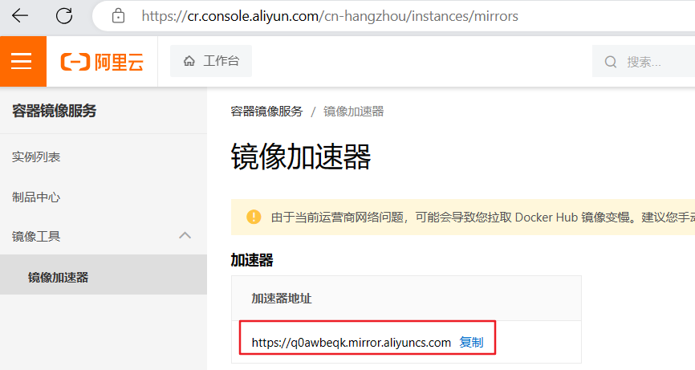
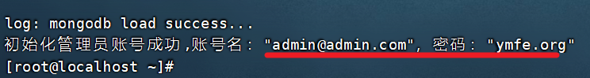

# 听书软件环境安装

电商软件环境安装部署

# 一、环境准备

## 1安装docker

环境安装：

> yum -y install gcc-c++

第一步：安装必要的一些系统工具

> yum install -y yum-utils device-mapper-persistent-data lvm2

第二步：添加软件源信息

> yum-config-manager --add-repo [http://mirrors.aliyun.com/docker-ce/linux/centos/docker-ce.repo](http://mirrors.aliyun.com/docker-ce/linux/centos/docker-ce.repo "http://mirrors.aliyun.com/docker-ce/linux/centos/docker-ce.repo")

第三步：更新并安装Docker-CE

> yum makecache fast
> yum -y install docker-ce

第四步：开启Docker服务

> service docker start
> systemctl enable docker

第五步：测试是否安装成功

> docker -v

第六步：配置镜像加速器

您可以通过修改daemon配置文件/etc/docker/daemon.json来使用加速器

> sudo mkdir -p /etc/docker

新建daemon.json文件内容如下：

```bash
{
	"registry-mirrors":["https://docker.mirrors.ustc.edu.cn","http://hubmirror.c.163.com"]
}
```

以上镜像不能使用了，使用阿里云的镜像！ [官方镜像加速 (aliyun.com)](https://help.aliyun.com/document_detail/60750.html?spm=a2c4g.60743.0.i1)





	{
		"registry-mirrors":["https://q0awbeqk.mirror.aliyuncs.com"]
	}


> sudo systemctl daemon-reload
> sudo systemctl restart docker

## 2安装mysql

已安装或能访问忽略

第一步：拉取镜像

> docker pull mysql:8.0.29

第二步：启动

> docker run --name gmalldocker\_mysql --restart=always -v /home/ljaer/mysql:/var/lib/mysql -p 3306:3306 -e MYSQL\_ROOT\_PASSWORD=root -d mysql:8.0.29

第三步：测试mysql

进入容器：

> docker exec -it gmalldocker\_mysql /bin/bash

登录mysql：

mysql -u root -p

root

如果顺利进入，安装成功

## 3安装kafka 

第一步：拉取zookeeper、kafka镜像

> docker pull wurstmeister/zookeeper
>
> docker pull wurstmeister/kafka

第二步：启动zookeeper、kafka

> docker run -d --name zookeeper -p 2181:2181 -e TZ="Asia/Shanghai" --restart always wurstmeister/zookeeper 
>
> docker run -d --name kafka -p 9092:9092 -e KAFKA_BROKER_ID=0 -e KAFKA_ZOOKEEPER_CONNECT=192.168.200.130:2181 -e KAFKA_ADVERTISED_LISTENERS=PLAINTEXT://192.168.200.130:9092 -e KAFKA_LISTENERS=PLAINTEXT://0.0.0.0:9092 -e TZ="Asia/Shanghai" wurstmeister/kafka 

参数介绍：
--name：容器名字
-p：端口号
KAFKA_BROKER_ID：该ID是集群的唯一标识
KAFKA_ADVERTISED_LISTENERS：kafka发布到zookeeper供客户端使用的服务地址。
KAFKA_ZOOKEEPER_CONNECT：zk的连接地址
KAFKA_LISTENERS：允许使用PLAINTEXT侦听器


第三步：进入kafka容器内部

```sh
docker exec -it kafka /bin/bash
cd /opt/kafka_2.13-2.8.1/bin
通过生产者想topic 发送消息
./kafka-console-producer.sh --broker-list 192.168.200.130:9092 --topic atguigu（topic名）
另外打开一个窗口 消费者消费消息
kafka-console-consumer.sh --bootstrap-server 192.168.200.130:9092 --topic atguigu
```


## 4安装redis

已安装或能访问忽略

第一步：拉取镜像

> docker pull redis:7.0.10

第二步：启动

> docker run --name=gmalldocker\_redis -d -p 6379:6379  --restart=always redis

## 5安装nacos

已安装或能访问忽略

第一步：拉取镜像

> docker pull nacos/nacos-server:v2.1.1

第二步：启动

```
docker run -d \
-e MODE=standalone \
-p 8848:8848 \
-p 9848:9848 \
-p 9849:9849 \
--name nacos2.1.1 \
--restart=always \
nacos/nacos-server:v2.1.1
```

## 6安装sentinel

已安装或能访问忽略

第一步：拉取镜像

> docker pull bladex/sentinel-dashboard

第二步：启动

> docker run --name=gmalldocker\_sentinel-dashboard --restart=always -p 8858:8858 -d bladex/sentinel-dashboard:latest

## 7安装elasticsearch

已安装或能访问忽略

第一步：拉取镜像

> docker pull elasticsearch:8.5.0

第二步：启动

需要在宿主机建立：两个文件夹

> rm -rf /opt/elasticsearch
>
> mkdir -p /opt/elasticsearch/{config,plugins,data}
>
> 项配置中文分词器直接去github下载拷贝到plugins目录再重启即可

```shell
yum install -y unzip
unzip elasticsearch-analysis-ik-8.5.0.zip -d ik-analyzer
rm -rf elasticsearch-analysis-ik-8.5.0.zip 
```


> 制作配置文件

```
cat <<EOF> /opt/elasticsearch/config/elasticsearch.yml
xpack.security.enabled: false
xpack.license.self_generated.type: basic
xpack.security.transport.ssl.enabled: false  # 不配报错
xpack.security.enrollment.enabled: true
http.host: 0.0.0.0
EOF
```


授予权限

> chmod -R 777 /opt/elasticsearch

执行

```纯文本
docker run --name elasticsearch -p 9200:9200 -p 9300:9300 \
--net elastic \
--restart=always \
-e "discovery.type=single-node" \
-e ES_JAVA_OPTS="-Xms1024m -Xmx1024m" \
-v /opt/elasticsearch/config/elasticsearch.yml:/usr/share/elasticsearch/config/elasticsearch.yml \
-v /opt/elasticsearch/data:/usr/share/elasticsearch/data \
-v /opt/elasticsearch/plugins:/usr/share/elasticsearch/plugins \
-d elasticsearch:8.5.0
```

如果运行时提示elastic 未找到 执行这个命令 ： docker network create elastic

```
# 重置下面两个密码，注意：需等待es启动
docker exec -it elasticsearch bin/elasticsearch-reset-password -u elastic  -i  # -i 表示自定义密码 给java客户端用的
docker exec -it elasticsearch bin/elasticsearch-reset-password -u kibana_system -i  # 给 kibana 用的

用户名: elastic 密码可以使用: 111111
```


第三步：安装中文分词器

1.  下载elasticsearch-analysis-ik-8.5.0.zip
2.  上传到/mydata/elasticsearch/plugins 目录后，解压：unzip elasticsearch-analysis-ik-8.5.0.zip -d ik-analyzer
    **必须删除原来的压缩包elasticsearch-analysis-ik-8.5.0.zip**
3.  重启es：docker restart a24eb9941759

a24eb9941759：表示容器ID 运行时，需要改成自己的容器ID


## 8安装logstash/filebeat -- 暂时不需要

安装 logstash

第一步：拉取镜像

> docker pull logstash:7.8.0

第二步：需要提前在linux服务器上环境 /mydata/logstash/logstash.conf,内容如下

> mkdir -p /mydata/logstash

```json
input {
  tcp {
  mode => "server"
  host => "0.0.0.0"
  port => 5044
  codec => json_lines
  }
}
filter{
  
}
output {
  elasticsearch {
  hosts => "192.168.200.128:9200"
  index => "gmall-%{+YYYY.MM.dd}"
  }
}
```

第三步：创建容器

```纯文本
docker run --name gmalldocker_logstash -p 5044:5044 \
--restart=always \
--link gmalldocker_elasticsearch:es \
-v /mydata/logstash/logstash.conf:/usr/share/logstash/pipeline/logstash.conf \
-d logstash:7.8.0
```

安装Filebeat

第一步：授权

chmod 777 -R /var/log/messages

第二步：启动日志收集器

```text
docker run -d \
  --name=filebeat \
  --restart=always \
  -v filebeat-conf:/usr/share/filebeat \
  -v /var/log/messages:/var/log/messages \
  --link 1833f6a65c2a:gmalldocker_elasticsearch \
  elastic/filebeat:7.8.0
  
  1833f6a65c2a: es容器的ID
```

第三步：修改配置文件：

```纯文本
进入到目录：
cd /var/lib/docker/volumes/filebeat-conf/_data
修改配置文件
vim filebeat.yml
内容如下
filebeat.inputs:
- type: log
  enabled: true
  paths:
    - /var/log/messages
filebeat.config:
  modules:
    path: ${path.config}/modules.d/*.yml
    reload.enabled: false

processors:
  - add_cloud_metadata: ~
  - add_docker_metadata: ~

output.elasticsearch:
  hosts: '192.168.200.128:9200'
  indices:
   - index: "filebeat-%{+yyyy.MM.dd}"
```

重启filebeat 容器，运行检索模块

效果：以后虚拟机上的所有日志都会收集保存到es中，可以在kibana中进行检索。


第四步： 创建可视化面板


在左侧菜单栏**点击Discover** 选项，就可以看到filebeat 收集的数据了。


## 9安装kibana

第一步：拉取镜像

docker pull kibana:8.5.0

第二步：启动

删除一些目录

rm -rf /opt/kibana
mkdir -p /opt/kibana/{config,data}

创建配置文件

```sh
docker run --name kibana -p 5601:5601 -d kibana:8.5.0

cat <<EOF> /opt/kibana/config/kibana.yml
server.host: "0.0.0.0"  # 不配报错
server.shutdownTimeout: "5s"
elasticsearch.hosts: [ "http://elasticsearch:9200" ]
elasticsearch.username: "kibana_system"  # 不能用 elastic 
elasticsearch.password: "111111"
i18n.locale: "zh-CN"
EOF
```

停止删除正在运行的容器

docker stop kibana && docker rm kibana

启动kibana

```sh
sudo docker run --name kibana \
--net elastic \
-v /opt/kibana/config/kibana.yml:/usr/share/kibana/config/kibana.yml \
-p 5601:5601 -d kibana:8.5.0
```

登录kibana ，注意需要使用elastic 用户登录不能使用 kibana_system 这个用户登录。

测试：在Kibana开发工具中，测试安装分词词库是否可以使用！

```json
GET  /_analyze
{
  "analyzer": "ik_smart", 
  "text":     "我是中国人"
}
```

## 10安装zipkin

第一步：拉取镜像

> docker pull openzipkin/zipkin

第二步：启动

> docker run --name zipkin --restart=always -d -p 9411:9411 openzipkin/zipkin

## 11安装minio

已安装或能访问忽略

第一步：拉取镜像

> docker pull minio/minio

第二步：启动

```纯文本
docker run \
-p 9000:9000 \
-p 9001:9001 \
--name=gmalldocker_minio \
-d --restart=always \
-e "MINIO_ROOT_USER=admin" \
-e "MINIO_ROOT_PASSWORD=admin123456" \
-v /home/data:/data \
-v /home/config:/root/.minio \
minio/minio server /data --console-address ":9001"
```

浏览器访问：[http://IP:9001/minio/login，登录使用自定义账户密码admin/admin123456登录](http://IP:9001/minio/login，登录使用自定义账户密码admin/admin123456登录 "http://IP:9001/minio/login，登录使用自定义账户密码admin/admin123456登录")

**注意**：文件上传时，需要调整一下linux 服务器的时间与windows 时间一致！

> 第一步：安装ntp服务
> yum -y install ntp
> 第二步：开启开机启动服务
> systemctl enable ntpd
> 第三步：启动服务
> systemctl start ntpd
> 第四步：更改时区
> timedatectl set-timezone Asia/Shanghai
> 第五步：启用ntp同步
> timedatectl set-ntp yes
> 第六步：同步时间
> ntpq -p

## 12安装在线Yapi 服务器--不需要

拉取镜像

> docker pull mongo:4.2.5

启动mongo

> docker run -d --name mongo-yapi  --restart=always -p 27017:27017 -v /mydata/mongodb:/data/db  mongo:4.2.5

获取Yapi 镜像

> docker pull registry.cn-hangzhou.aliyuncs.com/anoy/yapi

初始化Yapi 数据库索引以及管理员账号

> docker run -it --rm  --link mongo-yapi:mongo  --entrypoint npm  --workdir /api/vendors  registry.cn-hangzhou.aliyuncs.com/anoy/yapi  run install-server




启动Yapi 服务

> docker run -d  --name yapi  --restart=always --link mongo-yapi:mongo  --workdir /api/vendors  -p 3000:3000  registry.cn-hangzhou.aliyuncs.com/anoy/yapi  server/app.js

使用Yapi [http://192.168.200.128:3000](http://192.168.200.128:3000 "http://192.168.200.128:3000") 登录账号 [admin@admin.com](mailto:admin@admin.com "admin@admin.com")，密码 ymfe.org

# 注意：

停止所有的容器

> docker stop \$(docker ps -aq)

删除所有的容器

> docker rm \$(docker ps -aq)

\#删除所有的镜像

> docker rmi \$(docker images -q)
