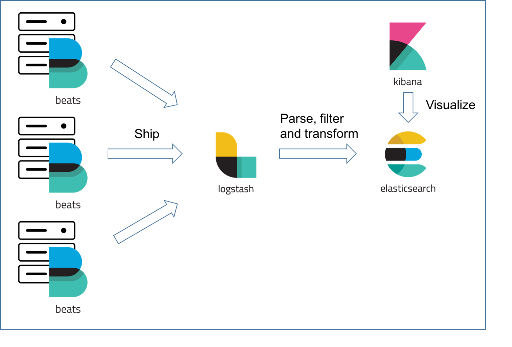
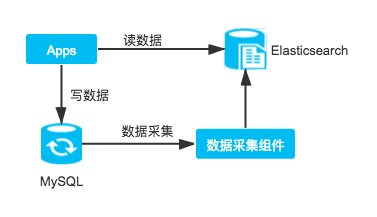
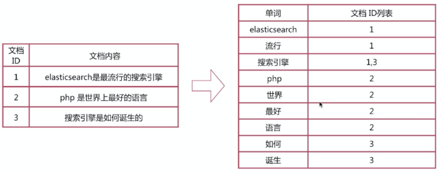
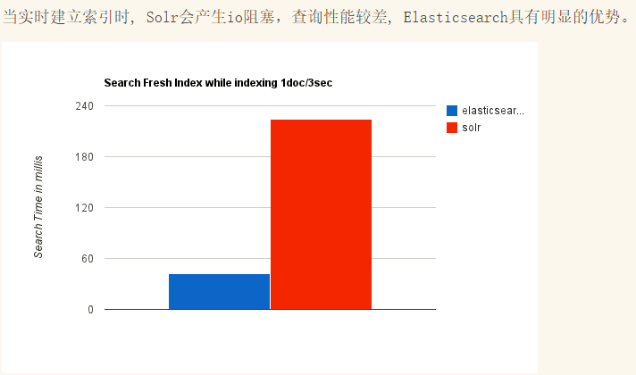
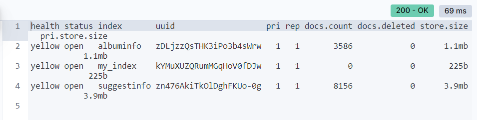
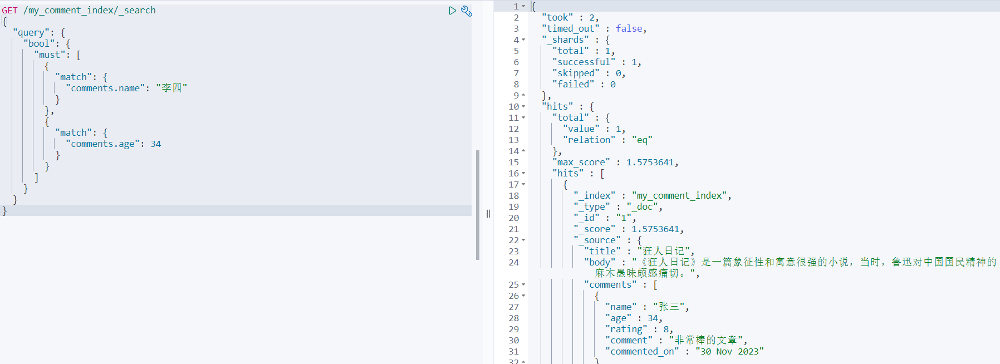
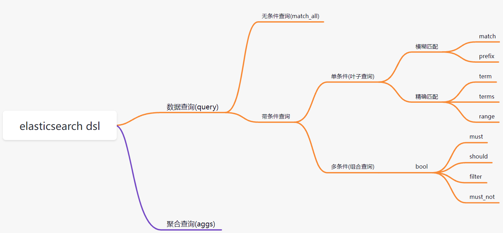
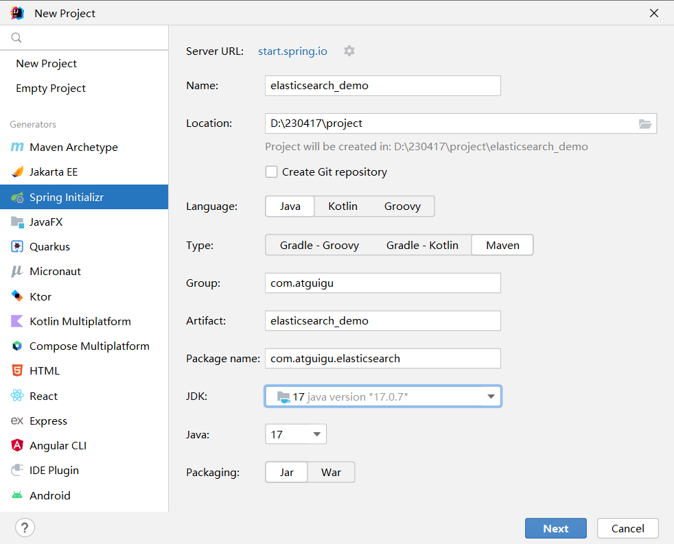
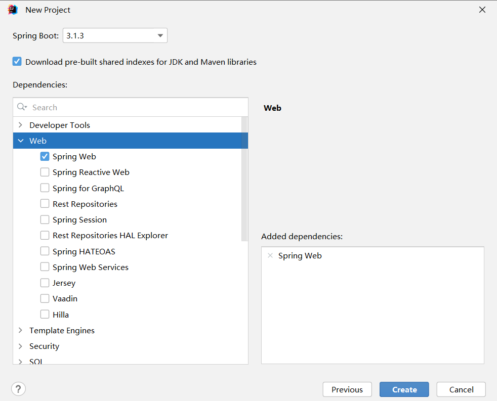

# 1 elasticsearch概述

## 1.1 elasticsearch简介

官网: https://www.elastic.co/

ElasticSearch是一个基于Lucene的搜索服务器。它提供了一个分布式多用户能力的全文搜索引擎，基于RESTful web接口。Elasticsearch是用Java开发的，并作为Apache许可条款下的开放源码发布，是当前流行的企业级搜索引擎。 

[Elastic](https://so.csdn.net/so/search?q=Elastic&spm=1001.2101.3001.7020)官方宣布Elasticsearch进入Version 8，在速度、扩展、高相关性和简单性方面开启了一个全新的时代。

说明：Elasticsearch 8最低jdk版本要求jdk17，当前我们选择Elasticsearch版本：Elasticsearch8.5.3

[DB-Engines Ranking - popularity ranking of database management systems](https://db-engines.com/en/ranking)

## 1.2 Elasticsearch的特性

**实时**
理论上数据从写入Elasticsearch到数据可以被搜索只需要1秒左右的时间，实现准实时的数据索引和查询。

**分布式、可扩展**
天生的分布式的设计，数据分片对于应用层透明，扩展性良好，可以轻易的进行节点扩容，支持上百甚至上千的服务器节点，支持PB级别的数据存储和搜索。

**稳定可靠**
Elasticsearch的分布式、数据冗余特性提供更加可靠的运行机制，且经过大型互联网公司众多项目使用，可靠性得到验证。

**高可用**
数据多副本、多节点存储，单节点的故障不影响**集群**的使用。

**Rest API**
Elasticsearch提供标准的Rest API，这使得所有支持Rest API的语言都能够轻易的使用Elasticsearch，具备多语言通用的支持特性，易于使用。Elasticsearch Version 8以后，去除了以前Transport API、High-Level API、Low-Level API，统一标准的Rest API，这将使得Elasticsearch更加容易使用，原来被诟病的API混乱问题终于得到完美解决。

**高性能**
Elasticsearch底层构建基于Lucene，具备强大的搜索能力，即便是PB级别的数据依然能够实现秒级的搜索。

**多客户端支持**
支持Java、Python、Go、PHP、Ruby等多语言客户端，还支持JDBC、ODBC等客户端。

**安全支持**
提供单点登录SSO、加密通信、集群角色、属性的访问控制，支持审计等功能，在安全层面上还支持集成第三方的安全组件，在Version 8以后，默认开启了HTTPS，大大简化了安全上的配置。

## 1.3 Elasticsearch应用场景

**搭建日志系统**
日志系统应该是Elasticsearch使用最广泛的场景之一了，Elasticsearch支持海量数据的存储和查询，特别适合日志搜索场景。广泛使用的ELK套件(Elasticsearch、Logstash、Kibana)是日志系统最经典的案例，使用Logstash和Beats组件进行日志收集，Elasticsearch存储和查询应用日志，Kibana提供日志的可视化搜索界面。



**搭建数据分析系统**
Elasitcsearch支持数据分析，例如强大的数据聚合功能，通过搭配Kibana，提供诸如直方图、统计分组、范围聚合等方便使用的功能，能够快速实现一些数据报表等功能。
在数字化转型的大行其道的当下，需要从海量数据中发现数据的规律，从而做出一定的决策，Elasticsearch一定是最适合的解决方案之一。


**搭建搜索系统**
Elasticsearch为搜索而生，用于搭建全文搜索系统是自然而然的事情，它能够提供快速的索引和搜索功能，还有相关的评分功能、分词插件等，支持丰富的搜索特性，可以用于搭建大型的搜索引擎，更加常用语实现站内搜索，例如银行App、购物App等站内商品、服务搜索。

**构建海量数据业务系统即席查询服务**
目前大量的需要支持事务的系统使用MySQL作为数据库，但随着业务的开展，数据量会越来越大，而MySQL的性能会越来越差，虽然可以通过分库分表的方案进行解决，但是操作比较复杂，而且往往每隔一段时间就需要进行扩展，且代码需要配合修改。
这种情况下可以将数据从MySQL同步到Elasticsearch，针对实时性要求不太高或者主要查询历史数据且数据量比较大的场景使用Elasticsearch提供查询，而对需要事务实时控制的即时数据还是通过MySQL存储和查询。




**作为独立数据库系统**
Elasticsearch本身提供了数据持久化存储的能力，并且提供了增删改查的功能，在某些应用场景下可以直接当做数据库系统来使用，既提供了存储能力，又能够同时具备搜索能力，整体技术架构会比较简单，例如博客系统、评论系统。需要注意的是，Elasticsearch不支持事务，且写入的性能相对关系型数据库稍弱，所有需要使用事务的场景都不能将Elasticsearch当做唯一的数据库系统，这使得这种使用场景很少见。

## 1.4 全文搜索引擎

Google，百度类的网站搜索，它们都是根据网页中的**关键字**生成索引，我们在搜索的时候输入关键字，它们会将该关键字即索引匹配到的所有网页返回；还有常见的项目中应用日志的搜索等等。对于这些非结构化的数据文本，关系型数据库搜索不是能很好的支持。

一般**传统数据库**，全文检索都实现的很鸡肋，因为一般也没人用数据库存文本字段。进行全文检索需要**扫描整个表**，如果数据量大的话即使对SQL的语法**优化**，也收效甚微。建立了索引，但是维护起来也很麻烦，对于 insert 和 update 操作都会重新构建索引。

这里说到的**全文搜索引擎**指的是目前广泛应用的主流**搜索引擎**。它的工作原理是计算机索引程序通过扫描文章中的每一个词，**对每一个词建立一个索引，指明该词在文章中出现的次数和位置**，当用户查询时，检索程序就根据事先建立的索引进行查找，并将查找的结果反馈给用户的检索方式。这个过程类似于通过字典中的检索字表查字的过程。

## 1.5 lucene介绍

​	Lucene是Apache软件基金会Jakarta项目组的一个子项目，提供了一个简单却强大的应用程式接口，能够做全文索引和搜寻。在Java开发环境里Lucene是一个成熟的免费开源工具。就其本身而言，Lucene是当前以及最近几年最受欢迎的免费**Java信息检索程序库**。但Lucene只是一个提供全文搜索功能类库的核心工具包，而真正使用它还需要一个完善的服务框架搭建起来进行应用。

​	目前市面上流行的搜索引擎软件，主流的就两款：**Elasticsearch和Solr**,这两款都是基于Lucene搭建的，可以独立部署启动的搜索引擎服务软件。由于内核相同，所以两者除了服务器安装、部署、管理、集群以外，对于数据的操作 修改、添加、保存、查询等等都十分类似。

## 1.6 倒排索引



**倒排索引步骤:**

- 数据根据词条进行分词，同时记录文档索引位置
- 将词条相同的数据化进行合并
- 对词条进行排序

**搜索过程:**

先将搜索词语进行分词，分词后再倒排索引列表查询文档位置(docId)。根据docId查询文档数据。

## 1.7 elasticsearch、solr对比





**ElasticSearch vs Solr 总结**

- es基本是开箱即用，非常简单。Solr安装略微复杂。
- Solr 利用 Zookeeper 进行分布式管理，而 Elasticsearch 自身带有分布式协调管理功能。
- Solr 支持更多格式的数据，比如JSON、XML、CSV，而 Elasticsearch 仅支持json文件格式。
- Solr 是传统搜索应用的有力解决方案，但 Elasticsearch 更适用于新兴的实时搜索应用。

现在很多互联网应用都是要求实时搜索的，所以我们选择了elasticsearch。


# 2 elasticSearch的安装

**详见《软件环境安装》**

# 3 elasticsearch核心概念

### 3.1 es对照数据库


### 3.2 索引(Index)

一个索引就是一个拥有几分相似特征的文档的集合。比如说，你可以有一个客户数据的索引，另一个产品目录的索引，还有一个订单数据的索引。一个索引由一个名字来标识（必须全部是小写字母），并且当我们要对这个索引中的文档进行索引、搜索、更新和删除的时候，都要使用到这个名字。在一个集群中，可以定义任意多的索引。

能搜索的数据必须索引，这样的好处是可以提高查询速度，比如：新华字典前面的目录就是索引的意思，目录可以提高查询速度。

***Elasticsearch索引的精髓：一切设计都是为了提高搜索的性能。***

### 3.3 类型(Type)

在一个索引中，你可以定义一种或多种类型。

一个类型是你的索引的一个逻辑上的分类/分区，其语义完全由你来定。通常，会为具有一组共同字段的文档定义一个类型。不同的版本，类型发生了不同的变化

| 版本   | Type                      |
| ---- | ------------------------- |
| 5.x  | 支持多种type                  |
| 6.x  | 只能有一种type                 |
| 7.x  | 默认不再支持自定义索引类型（默认类型为：_doc） |
| 8.x  | 默认类型为：_doc                |

### 3.4 文档(Document)

一个文档是一个可被索引的基础信息单元，也就是一条数据

比如：你可以拥有某一个客户的文档，某一个产品的一个文档，当然，也可以拥有某个订单的一个文档。文档以**JSON（Javascript Object Notation）格式**来表示，而JSON是一个到处存在的互联网数据交互格式。

在一个index/type里面，你可以存储任意多的文档。

### 3.5 字段(Field)

相当于是数据表的字段，对文档数据根据不同属性进行的分类标识。

### 3.6 映射(Mapping)

mapping是处理数据的方式和规则方面做一些限制，如：某个字段的数据类型、默认值、分析器、是否被索引等等。这些都是映射里面可以设置的，其它就是处理ES里面数据的一些使用规则设置也叫做映射，按着最优规则处理数据对性能提高很大，因此才需要建立映射，并且需要思考如何建立映射才能对性能更好。

# 4 Elasticsearch 基础功能

参考文档：https://www.elastic.co/guide/en/elasticsearch/reference/8.5/elasticsearch-intro.html

 我们在Kibana（前面已经安装过） 软件给大家演示基本操作

详见《软件环境安装》

### 4.1 分词器

官方提供的分词器有这么几种: Standard、Letter、Lowercase、Whitespace、UAX URL Email、Classic、Thai等，中文分词器可以使用第三方的比如IK分词器。前面我们已经安装过了。

IK分词器:

```json
POST _analyze
{
  "analyzer": "ik_smart",
  "text": "我是中国人"
}
结果:
{
  "tokens": [
    {
      "token": "我",
      "start_offset": 0,
      "end_offset": 1,
      "type": "CN_CHAR",
      "position": 0
    },
    {
      "token": "是",
      "start_offset": 1,
      "end_offset": 2,
      "type": "CN_CHAR",
      "position": 1
    },
    {
      "token": "中国人",
      "start_offset": 2,
      "end_offset": 5,
      "type": "CN_WORD",
      "position": 2
    }
  ]
}

POST _analyze
{
  "analyzer": "ik_max_word",
  "text": "我是中国人"
}
结果:
{
  "tokens": [
    {
      "token": "我",
      "start_offset": 0,
      "end_offset": 1,
      "type": "CN_CHAR",
      "position": 0
    },
    {
      "token": "是",
      "start_offset": 1,
      "end_offset": 2,
      "type": "CN_CHAR",
      "position": 1
    },
    {
      "token": "中国人",
      "start_offset": 2,
      "end_offset": 5,
      "type": "CN_WORD",
      "position": 2
    },
    {
      "token": "中国",
      "start_offset": 2,
      "end_offset": 4,
      "type": "CN_WORD",
      "position": 3
    },
    {
      "token": "国人",
      "start_offset": 3,
      "end_offset": 5,
      "type": "CN_WORD",
      "position": 4
    }
  ]
}
```

Standard分词器:

```json
POST _analyze
{
  "analyzer": "standard",
  "text": "我是中国人"
}

结果:
{
  "tokens": [
    {
      "token": "我",
      "start_offset": 0,
      "end_offset": 1,
      "type": "<IDEOGRAPHIC>",
      "position": 0
    },
    {
      "token": "是",
      "start_offset": 1,
      "end_offset": 2,
      "type": "<IDEOGRAPHIC>",
      "position": 1
    },
    {
      "token": "中",
      "start_offset": 2,
      "end_offset": 3,
      "type": "<IDEOGRAPHIC>",
      "position": 2
    },
    {
      "token": "国",
      "start_offset": 3,
      "end_offset": 4,
      "type": "<IDEOGRAPHIC>",
      "position": 3
    },
    {
      "token": "人",
      "start_offset": 4,
      "end_offset": 5,
      "type": "<IDEOGRAPHIC>",
      "position": 4
    }
  ]
}
```

### 4.2 索引操作

ES 软件的索引可以类比为 MySQL 中表的概念，创建一个索引，类似于创建一个表

#### 4.2.1 创建索引

语法: PUT /{索引名称}

```json
PUT /my_index

结果:
{
  "acknowledged" : true,
  "shards_acknowledged" : true,
  "index" : "my_index"
}
```

#### 4.2.2 查看所有索引

```java
GET /_cat/indices?v
```



#### 4.2.3 查看单个索引

语法: GET /{索引名称}

```json
GET /my_index
结果:
{
  "my_index": {
    "aliases": {},
    "mappings": {},
    "settings": {
      "index": {
        "routing": {
          "allocation": {
            "include": {
              "_tier_preference": "data_content"
            }
          }
        },
        "number_of_shards": "1",
        "provided_name": "my_index",
        "creation_date": "1693294063006",
        "number_of_replicas": "1",
        "uuid": "kYMuXUZQRumMGqHoV0fDJw",
        "version": {
          "created": "8050099"
        }
      }
    }
  }
}
```

#### 4.2.4 删除索引

语法: DELETE /{索引名称}

```json
DELETE /my_index
结果:
{
  "acknowledged" : true
}
```

### 4.3 文档操作

文档是 ES 软件搜索数据的最小单位, 不依赖预先定义的模式，所以可以将文档类比为表的一行JSON类型的数据。我们知道关系型数据库中，要提前定义字段才能使用，在Elasticsearch中，对于字段是非常灵活的，有时候我们可以忽略该字段，或者动态的添加一个新的字段。

#### 4.3.1 创建文档

语法:

PUT /{索引名称}/{类型}/{id}

{

jsonbody

}

在创建数据时，需要指定唯一性标识，那么请求范式 POST，PUT 都可以

```shell
PUT /my_index/_doc/1
{
  "title": "小米手机",
  "category": "小米",
  "images": "http://www.gulixueyuan.com/xm.jpg",
  "price": 3999
}

返回结果:
{
  "_index": "my_index",
  "_id": "1",
  "_version": 3,
  "_seq_no": 2,
  "_primary_term": 1,
  "found": true,
  "_source": {
    "title": "小米手机",
    "category": "小米",
    "images": "http://www.gulixueyuan.com/xm.jpg",
    "price": 3999
  }
}
```

#### 4.3.2 查看文档

语法:GET /{索引名称}/{类型}/{id}

```shell
GET /my_index/_doc/1
结果:
{
  "_index" : "my_index",
  "_type" : "_doc",
  "_id" : "1",
  "_version" : 1,
  "_seq_no" : 0,
  "_primary_term" : 1,
  "found" : true,
  "_source" : {
    "title" : "小米手机",
    "category" : "小米",
    "images" : "http://www.gulixueyuan.com/xm.jpg",
    "price" : 3999
  }
}
```

#### 4.3.3 查询所有文档

##### 语法: GET /{索引名称}/_search

```shell
GET /my_index/_search

结果:
{
  "took": 941,
  "timed_out": false,
  "_shards": {
    "total": 1,
    "successful": 1,
    "skipped": 0,
    "failed": 0
  },
  "hits": {
    "total": {
      "value": 1,
      "relation": "eq"
    },
    "max_score": 1,
    "hits": [
      {
        "_index": "my_index",
        "_id": "1",
        "_score": 1,
        "_source": {
          "title": "小米手机",
          "category": "小米",
          "images": "http://www.gulixueyuan.com/xm.jpg",
          "price": 3999
        }
      }
    ]
  }
}
```

#### 4.3.4 修改文档

语法: 

PUT /{索引名称}/{类型}/{id}

{

jsonbody

}

```shell
PUT /my_index/_doc/1
{
  "title": "小米手机",
  "category": "小米",
  "images": "http://www.gulixueyuan.com/xm.jpg",
  "price": 4500
}
```

#### 4.3.5 修改局部属性

语法: 

POST /{索引名称}/_update/{docId}
{
  "doc": {
    "属性": "值"
  }
}

**注意：这种更新只能使用post方式。**

```shell
POST /my_index/_update/1
{
  "doc": {
    "price": 4500
  }
}
```

#### 4.3.6 删除文档

语法: DELETE /{索引名称}/{类型}/{id}

```shell
DELETE /my_index/_doc/1
结果:
{
  "_index": "my_index",
  "_id": "1",
  "_version": 5,
  "result": "deleted",
  "_shards": {
    "total": 2,
    "successful": 1,
    "failed": 0
  },
  "_seq_no": 6,
  "_primary_term": 1
}
```

### 4.4 映射mapping

创建数据库表需要设置字段名称，类型，长度，约束等；索引库也一样，需要知道这个类型下有哪些字段，每个字段有哪些约束信息，这就叫做**映射(mapping)**。

#### 4.4.1 查看映射

语法: GET /{索引名称}/_mapping

```json
GET /my_index/_mapping
结果:
{
  "my_index": {
    "mappings": {
      "properties": {
        "category": {
          "type": "text",
          "fields": {
            "keyword": {
              "type": "keyword",
              "ignore_above": 256
            }
          }
        },
        "images": {
          "type": "text",
          "fields": {
            "keyword": {
              "type": "keyword",
              "ignore_above": 256
            }
          }
        },
        "price": {
          "type": "long"
        },
        "title": {
          "type": "text",
          "fields": {
            "keyword": {
              "type": "keyword",
              "ignore_above": 256
            }
          }
        }
      }
    }
  }
}
```

#### 4.4.2 动态映射

在关系数据库中，需要事先创建数据库，然后在该数据库下创建数据表，并创建 表字段、类型、长度、主键等，最后才能基于表插入数据。而Elasticsearch中不 需要定义Mapping映射（即关系型数据库的表、字段等），在文档写入 Elasticsearch时，会根据文档字段**自动识别类型**，这种机制称之为**动态映射**。

映射规则对应:

| 数据          | 对应的类型   |
| ----------- | ------- |
| null        | 字段不添加   |
| true\|flase | boolean |
| 字符串         | text    |
| 数值          | long    |
| 小数          | float   |
| 日期          | date    |

#### 4.4.3 静态映射

静态映射是在Elasticsearch中也可以事先定义好映射，即手动映射，包含文档的各字段类型、分词器等，这称为**静态映射**。

```shell
#删除原创建的索引
DELETE /my_index

#创建索引，并同时指定映射关系和分词器等。
PUT /my_index
{
  "mappings": {
    "properties": {
      "title": {
        "type": "text",
        "index": true,
        "store": true,
        "analyzer": "ik_max_word",
        "search_analyzer": "ik_smart"
      },
      "category": {
        "type": "keyword",
        "index": true,
        "store": true
      },
      "images": {
        "type": "keyword",
        "index": true,
        "store": true
      },
      "price": {
        "type": "integer",
        "index": true,
        "store": true
      }
    }
  }
}

结果:
{
  "acknowledged" : true,
  "shards_acknowledged" : true,
  "index" : "my_index"
}
```

**type分类如下:**

- 字符串：text(支持分词)和 keyword(不支持分词)。 
- text：该类型被用来索引长文本，在创建索引前会将这些文本进行分词，转化为词的组合，建立索引；允许es来检索这些词，text类型不能用来排序和聚合。 
- keyword：该类型不能分词，可以被用来检索过滤、排序和聚合，keyword类型不可用text进行分词模糊检索。 
- 数值型：long、integer、short、byte、double、float 
- 日期型：date 
- 布尔型：boolean 
- 特殊数据类型：nested

#### 4.4.4 nested 介绍

nested：类型是一种特殊的对象object数据类型(specialised version of the object datatype )，允许对象数组彼此独立地进行索引和查询。

demo： 建立一个普通的index

如果linux 中有这个my\_comment\_index 先删除！DELETE /my\_comment\_index

步骤1：建立一个索引（ 存储博客文章及其所有评论）

```http
PUT my_comment_index/_doc/1
{
  "title": "狂人日记",
  "body": "《狂人日记》是一篇象征性和寓意很强的小说，当时，鲁迅对中国国民精神的麻木愚昧颇感痛切。",
  "comments": [
    {
      "name": "张三",
      "age": 34,
      "rating": 8,
      "comment": "非常棒的文章",
      "commented_on": "30 Nov 2023"
    },
    {
      "name": "李四",
      "age": 38,
      "rating": 9,
      "comment": "文章非常好",
      "commented_on": "25 Nov 2022"
    },
    {
      "name": "王五",
      "age": 33,
      "rating": 7,
      "comment": "手动点赞",
      "commented_on": "20 Nov 2021"
    }
  ]
}
```

如上所示，所以我们有一个文档描述了一个帖子和一个包含帖子上所有评论的内部对象评论。
但是Elasticsearch搜索中的内部对象并不像我们期望的那样工作。

步骤2 : 执行查询

```http
GET /my_comment_index/_search
{
  "query": {
    "bool": {
      "must": [
        {
          "match": {
            "comments.name": "李四"
          }
        },
        {
          "match": {
            "comments.age": 34
          }
        }
      ]
    }
  }
}
```

查询结果：居然正常的响应结果了



> 原因分析：comments 字段默认的数据类型是Object，故我们的文档内部存储为：
> {
> "title":                    \[ 狂人日记],
> "body":                     \[ 《狂人日记》是一篇象征性和寓意很强的小说，当时... ],
> "comments.name":            \[ 张三, 李四, 王五 ],
> "comments.comment":         \[ 非常棒的文章,文章非常好,王五,... ],
> "comments.age":             \[ 33, 34, 38 ],
> "comments.rating":          \[ 7, 8, 9 ]
> }

我们可以清楚地看到，comments.name和comments.age之间的关系已丢失。这就是为什么我们的文档匹配李四和34的查询。

步骤3：删除当前索引

```http
DELETE /my_comment_index
```

步骤4：建立一个nested 类型的（comments字段映射为nested类型，而不是默认的object类型）

```json
PUT my_comment_index
{
  "mappings": {
      "properties": {
        "comments": {
          "type": "nested" 
        }
    }
  }
}


PUT my_comment_index/_doc/1
{
  "title": "狂人日记",
  "body": "《狂人日记》是一篇象征性和寓意很强的小说，当时，鲁迅对中国国民精神的麻木愚昧颇感痛切。",
  "comments": [
    {
      "name": "张三",
      "age": 34,
      "rating": 8,
      "comment": "非常棒的文章",
      "commented_on": "30 Nov 2023"
    },
    {
      "name": "李四",
      "age": 38,
      "rating": 9,
      "comment": "文章非常好",
      "commented_on": "25 Nov 2022"
    },
    {
      "name": "王五",
      "age": 33,
      "rating": 7,
      "comment": "手动点赞",
      "commented_on": "20 Nov 2021"
    }
  ]
}
```

重新执行步骤1，使用nested 查询

```http
GET /my_comment_index/_search
{
  "query": {
    "nested": {
      "path": "comments",
      "query": {
        "bool": {
          "must": [
            {
              "match": {
                "comments.name": "李四"
              }
            },
            {
              "match": {
                "comments.age": 34
              }
            }
          ]
        }
      }
    }
  }
}
```

结果发现没有返回任何的文档，这是何故？

当将字段设置为nested 嵌套对象将数组中的每个对象索引为单独的隐藏文档，这意味着可以独立于其他对象查询每个嵌套对象。文档的内部表示：

> {
> {
> "comments.name":    \[ 张三],
> "comments.comment": \[ 非常棒的文章 ],
> "comments.age":     \[ 34 ],
> "comments.rating":  \[ 9 ]
> },
> {
> "comments.name":    \[ 李四],
> "comments.comment": \[ 文章非常好 ],
> "comments.age":     \[ 38 ],
> "comments.rating":   \[ 8 ]
> },
> {
> "comments.name":    \[ 王五],
> "comments.comment": \[手动点赞],
> "comments.age":     \[ 33 ],
> "comments.rating":   \[ 7 ]
> },
> {
> "title":            \[ 狂人日记 ],
> "body":             \[ 《狂人日记》是一篇象征性和寓意很强的小说，当时，鲁迅对中国... ]
> }
> }

每个内部对象都在内部存储为单独的隐藏文档。 这保持了他们的领域之间的关系。

## 5 DSL高级查询

### 5.1 DSL概述

Query DSL概述: Domain Specific Language(领域专用语言)，Elasticsearch提供了基于JSON的DSL来定义查询。

**DSL概览:**



准备数据:

```shell
PUT /my_index/_doc/1
{"id":1,"title":"华为笔记本电脑","category":"华为","images":"http://www.gulixueyuan.com/xm.jpg","price":5388}

PUT /my_index/_doc/2
{"id":2,"title":"华为手机","category":"华为","images":"http://www.gulixueyuan.com/xm.jpg","price":5500}

PUT /my_index/_doc/3
{"id":3,"title":"VIVO手机","category":"vivo","images":"http://www.gulixueyuan.com/xm.jpg","price":3600}
```

### 5.2 DSL查询

#### 5.2.1 查询所有文档

match_all:

```shell
POST /my_index/_search
{
  "query": {
    "match_all": {}
  }
}

结果:
{
  "took" : 0,
  "timed_out" : false,
  "_shards" : {
    "total" : 1,
    "successful" : 1,
    "skipped" : 0,
    "failed" : 0
  },
  "hits" : {
    "total" : {
      "value" : 3,
      "relation" : "eq"
    },
    "max_score" : 1.0,
    "hits" : [
      {
        "_index" : "my_index",
        "_type" : "_doc",
        "_id" : "1",
        "_score" : 1.0,
        "_source" : {
          "id" : 1,
          "title" : "华为笔记本电脑",
          "category" : "华为",
          "images" : "http://www.gulixueyuan.com/xm.jpg",
          "price" : 5388
        }
      },
      {
        "_index" : "my_index",
        "_type" : "_doc",
        "_id" : "2",
        "_score" : 1.0,
        "_source" : {
          "id" : 2,
          "title" : "华为手机",
          "category" : "华为",
          "images" : "http://www.gulixueyuan.com/xm.jpg",
          "price" : 5500
        }
      },
      {
        "_index" : "my_index",
        "_type" : "_doc",
        "_id" : "3",
        "_score" : 1.0,
        "_source" : {
          "id" : 3,
          "title" : "VIVO手机",
          "category" : "vivo",
          "images" : "http://www.gulixueyuan.com/xm.jpg",
          "price" : 3600
        }
      }
    ]
  }
}
```

#### 5.2.2 匹配查询(match)

match:

```shell
POST /my_index/_search
{
  "query": {
    "match": {
      "title": "华为智能手机"
    }
  }
}

结果:
{
  "took" : 3,
  "timed_out" : false,
  "_shards" : {
    "total" : 1,
    "successful" : 1,
    "skipped" : 0,
    "failed" : 0
  },
  "hits" : {
    "total" : {
      "value" : 2,
      "relation" : "eq"
    },
    "max_score" : 0.5619608,
    "hits" : [
      {
        "_index" : "my_index",
        "_type" : "_doc",
        "_id" : "2",
        "_score" : 0.5619608,
        "_source" : {
          "id" : 2,
          "title" : "华为手机",
          "category" : "华为",
          "images" : "http://www.gulixueyuan.com/xm.jpg",
          "price" : 5500
        }
      },
      {
        "_index" : "my_index",
        "_type" : "_doc",
        "_id" : "1",
        "_score" : 0.35411233,
        "_source" : {
          "id" : 1,
          "title" : "华为笔记本电脑",
          "category" : "华为",
          "images" : "http://www.gulixueyuan.com/xm.jpg",
          "price" : 5388
        }
      }
    ]
  }
}
```

#### 5.2.3 多字段匹配

```shell
POST /my_index/_search
{
  "query": {
    "multi_match": {
      "query": "华为智能手机",
      "fields": ["title","category"]
    }
  }
}

结果:
{
  "took": 1,
  "timed_out": false,
  "_shards": {
    "total": 1,
    "successful": 1,
    "skipped": 0,
    "failed": 0
  },
  "hits": {
    "total": {
      "value": 3,
      "relation": "eq"
    },
    "max_score": 1.5619192,
    "hits": [
      {
        "_index": "my_index",
        "_id": "2",
        "_score": 1.5619192,
        "_source": {
          "id": 2,
          "title": "华为手机",
          "category": "华为",
          "images": "http://www.gulixueyuan.com/xm.jpg",
          "price": 5500
        }
      },
      {
        "_index": "my_index",
        "_id": "1",
        "_score": 1.489748,
        "_source": {
          "id": 1,
          "title": "华为笔记本电脑",
          "category": "华为",
          "images": "http://www.gulixueyuan.com/xm.jpg",
          "price": 5388
        }
      },
      {
        "_index": "my_index",
        "_id": "3",
        "_score": 0.59518534,
        "_source": {
          "id": 3,
          "title": "VIVO手机",
          "category": "vivo",
          "images": "http://www.gulixueyuan.com/xm.jpg",
          "price": 3600
        }
      }
    ]
  }
}
```

#### 5.2.4 关键字精确查询

**term:关键字不会进行分词。** 相当于where title = ?;

```shell
POST /my_index/_search
{
  "query": {
   "term": {
     "title": {
       "value": "华为手机"
     }
   }
  }
}

结果:
{
  "took" : 0,
  "timed_out" : false,
  "_shards" : {
    "total" : 1,
    "successful" : 1,
    "skipped" : 0,
    "failed" : 0
  },
  "hits" : {
    "total" : {
      "value" : 0,
      "relation" : "eq"
    },
    "max_score" : null,
    "hits" : [ ]
  }
}
```

#### 5.2.6 多关键字精确查询   

where title in ()

```shell
POST /my_index/_search
{
  "query": {
   "terms": {
     "title": [
       "华为手机",
       "华为"
     ]
   }
  }
}

结果:
{
  "took" : 0,
  "timed_out" : false,
  "_shards" : {
    "total" : 1,
    "successful" : 1,
    "skipped" : 0,
    "failed" : 0
  },
  "hits" : {
    "total" : {
      "value" : 2,
      "relation" : "eq"
    },
    "max_score" : 1.0,
    "hits" : [
      {
        "_index" : "my_index",
        "_type" : "_doc",
        "_id" : "1",
        "_score" : 1.0,
        "_source" : {
          "id" : 1,
          "title" : "华为笔记本电脑",
          "category" : "华为",
          "images" : "http://www.gulixueyuan.com/xm.jpg",
          "price" : 5388
        }
      },
      {
        "_index" : "my_index",
        "_type" : "_doc",
        "_id" : "2",
        "_score" : 1.0,
        "_source" : {
          "id" : 2,
          "title" : "华为手机",
          "category" : "华为",
          "images" : "http://www.gulixueyuan.com/xm.jpg",
          "price" : 5500
        }
      }
    ]
  }
}
```

#### 5.2.7 范围查询

范围查询使用range。

- gte: 大于等于
- lte: 小于等于
- gt: 大于
- lt: 小于

```shell
POST /my_index/_search
{
  "query": {
    "range": {
      "price": {
        "gte": 3000,
        "lte": 5000
      }
    }
  }
}
结果:
{
  "took" : 0,
  "timed_out" : false,
  "_shards" : {
    "total" : 1,
    "successful" : 1,
    "skipped" : 0,
    "failed" : 0
  },
  "hits" : {
    "total" : {
      "value" : 1,
      "relation" : "eq"
    },
    "max_score" : 1.0,
    "hits" : [
      {
        "_index" : "my_index",
        "_type" : "_doc",
        "_id" : "3",
        "_score" : 1.0,
        "_source" : {
          "title" : "VIVO手机",
          "category" : "vivo"
        }
      }
    ]
  }
}
```

#### 5.2.8 指定返回字段

**query同级增加_source进行过滤。**

```shell
POST /my_index/_search
{
  "query": {
   "terms": {
     "title": [
       "华为手机",
       "华为"
     ]
   }
  },
  "_source": ["title","category"]
}
```

#### 5.2.9 组合查询

bool 各条件之间有and,or或not的关系

- must: 各个条件都必须满足，所有条件是and的关系
- should: 各个条件有一个满足即可，即各条件是or的关系
- must_not: 不满足所有条件，即各条件是not的关系
- filter: 与must效果等同，但是它不计算得分，效率更高点。

##### must 

 各个条件都必须满足，所有条件是and的关系

```json
POST /my_index/_search
{
  "query": {
    "bool": {
      "must": [
        {
          "match": {
            "title": "华为"
          }
        },
        {
          "range": {
            "price": {
              "gte": 3000,
              "lte": 5400
            }
          }
        }
      ]
    }
  }
}
结果:
{
  "took": 1,
  "timed_out": false,
  "_shards": {
    "total": 1,
    "successful": 1,
    "skipped": 0,
    "failed": 0
  },
  "hits": {
    "total": {
      "value": 1,
      "relation": "eq"
    },
    "max_score": 1.2923405,
    "hits": [
      {
        "_index": "my_index",
        "_id": "1",
        "_score": 1.2923405,
        "_source": {
          "id": 1,
          "title": "华为笔记本电脑",
          "category": "华为",
          "images": "http://www.gulixueyuan.com/xm.jpg",
          "price": 5388
        }
      }
    ]
  }
}
```

##### should

各个条件有一个满足即可，即各条件是or的关系

```shell
POST /my_index/_search
{
  "query": {
    "bool": {
      "should": [
        {
          "match": {
            "title": "华为"
          }
        },
        {
          "range": {
            "price": {
              "gte": 3000,
              "lte": 5000
            }
          }
        }
      ]
    }
  }
}

结果:
{
  "took" : 0,
  "timed_out" : false,
  "_shards" : {
    "total" : 1,
    "successful" : 1,
    "skipped" : 0,
    "failed" : 0
  },
  "hits" : {
    "total" : {
      "value" : 3,
      "relation" : "eq"
    },
    "max_score" : 1.0,
    "hits" : [
      {
        "_index" : "my_index",
        "_type" : "_doc",
        "_id" : "3",
        "_score" : 1.0,
        "_source" : {
          "id" : 3,
          "title" : "VIVO手机",
          "category" : "vivo",
          "images" : "http://www.gulixueyuan.com/xm.jpg",
          "price" : 3600
        }
      },
      {
        "_index" : "my_index",
        "_type" : "_doc",
        "_id" : "2",
        "_score" : 0.5619608,
        "_source" : {
          "id" : 2,
          "title" : "华为手机",
          "category" : "华为",
          "images" : "http://www.gulixueyuan.com/xm.jpg",
          "price" : 5500
        }
      },
      {
        "_index" : "my_index",
        "_type" : "_doc",
        "_id" : "1",
        "_score" : 0.35411233,
        "_source" : {
          "id" : 1,
          "title" : "华为笔记本电脑",
          "category" : "华为",
          "images" : "http://www.gulixueyuan.com/xm.jpg",
          "price" : 5388
        }
      }
    ]
  }
}
```

如果should和must同时存在，他们之间是and关系：

```shell
POST /my_index/_search
{
  "query": {
    "bool": {
      "should": [
        {
          "match": {
            "title": "华为"
          }
        },
        {
          "range": {
            "price": {
              "gte": 3000,
              "lte": 5000
            }
          }
        }
      ],
      "must": [
        {
          "match": {
            "title": "华为"
          }
        },
        {
          "range": {
            "price": {
              "gte": 3000,
              "lte": 5000
            }
          }
        }
      ]
    }
  }
}

结果:
{
  "took" : 1,
  "timed_out" : false,
  "_shards" : {
    "total" : 1,
    "successful" : 1,
    "skipped" : 0,
    "failed" : 0
  },
  "hits" : {
    "total" : {
      "value" : 0,
      "relation" : "eq"
    },
    "max_score" : null,
    "hits" : [ ]
  }
}
```

##### must_not

不满足所有条件，即各条件是not的关系

```shell
POST /my_index/_search
{
  "query": {
    "bool": {
      "must_not": [
        {
          "match": {
            "title": "华为"
          }
        },
        {
          "range": {
            "price": {
              "gte": 3000,
              "lte": 5000
            }
          }
        }
      ]
    }
  }
}
结果:
{
  "took" : 0,
  "timed_out" : false,
  "_shards" : {
    "total" : 1,
    "successful" : 1,
    "skipped" : 0,
    "failed" : 0
  },
  "hits" : {
    "total" : {
      "value" : 0,
      "relation" : "eq"
    },
    "max_score" : null,
    "hits" : [ ]
  }
}
```

##### filter

与must效果等同，但是它不计算得分，效率更高点。

**_score的分值为0** 在Elasticsearch中，`_score` 字段代表每个文档的相关性分数（relevance score）。这个分数用于衡量一个文档与特定查询的匹配程度，它是基于搜索查询的条件和文档的内容来计算的。相关性分数越高，表示文档与查询的匹配度越高，排名也越靠前。

```shell
POST /my_index/_search
{
  "query": {
    "bool": {
      "filter": [
        {
          "match": {
            "title": "华为"
          }
        }
      ]
    }
  }
}

结果:
{
  "took" : 1,
  "timed_out" : false,
  "_shards" : {
    "total" : 1,
    "successful" : 1,
    "skipped" : 0,
    "failed" : 0
  },
  "hits" : {
    "total" : {
      "value" : 2,
      "relation" : "eq"
    },
    "max_score" : 0.0,
    "hits" : [
      {
        "_index" : "my_index",
        "_type" : "_doc",
        "_id" : "1",
        "_score" : 0.0,
        "_source" : {
          "id" : 1,
          "title" : "华为笔记本电脑",
          "category" : "华为",
          "images" : "http://www.gulixueyuan.com/xm.jpg",
          "price" : 5388
        }
      },
      {
        "_index" : "my_index",
        "_type" : "_doc",
        "_id" : "2",
        "_score" : 0.0,
        "_source" : {
          "id" : 2,
          "title" : "华为手机",
          "category" : "华为",
          "images" : "http://www.gulixueyuan.com/xm.jpg",
          "price" : 5500
        }
      }
    ]
  }
}
```

#### 5.2.10 聚合查询

聚合允许使用者对es文档进行统计分析，类似与关系型数据库中的group by，当然还有很多其他的聚合，例如取最大值、平均值等等。

##### max

```json
POST /my_index/_search
{
  "query": {
    "match_all": {}{}
  },
  "size": 0, 
  "aggs": {
    "max_price": {
      "max": {
        "field": "price"
      }
    }
  }
}

结果:
{
  "took" : 1,
  "timed_out" : false,
  "_shards" : {
    "total" : 1,
    "successful" : 1,
    "skipped" : 0,
    "failed" : 0
  },
  "hits" : {
    "total" : {
      "value" : 3,
      "relation" : "eq"
    },
    "max_score" : null,
    "hits" : [ ]
  },
  "aggregations" : {
    "max_price" : {
      "value" : 5500.0
    }
  }
}
```

##### min

```json
POST /my_index/_search
{
  "query": {
    "match_all": {}
  },
  "size": 0, 
  "aggs": {
    "min_price": {
      "min": {
        "field": "price"
      }
    }
  }
}

结果:
{
  "took" : 12,
  "timed_out" : false,
  "_shards" : {
    "total" : 1,
    "successful" : 1,
    "skipped" : 0,
    "failed" : 0
  },
  "hits" : {
    "total" : {
      "value" : 3,
      "relation" : "eq"
    },
    "max_score" : null,
    "hits" : [ ]
  },
  "aggregations" : {
    "max_price" : {
      "value" : 3600.0
    }
  }
}
```

##### avg

```json
POST /my_index/_search
{
  "query": {
    "match_all": {}
  },
  "size": 0, 
  "aggs": {
    "avg_price": {
      "avg": {
        "field": "price"
      }
    }
  }
}
结果:
{
  "took" : 12,
  "timed_out" : false,
  "_shards" : {
    "total" : 1,
    "successful" : 1,
    "skipped" : 0,
    "failed" : 0
  },
  "hits" : {
    "total" : {
      "value" : 3,
      "relation" : "eq"
    },
    "max_score" : null,
    "hits" : [ ]
  },
  "aggregations" : {
    "avg_price" : {
      "value" : 4829.333333333333
    }
  }
}
```

##### sum

```json
POST /my_index/_search
{
  "query": {
    "match_all": {}
  },
  "size": 0, 
  "aggs": {
    "sum_price": {
      "sum": {
        "field": "price"
      }
    }
  }
}
结果:
{
  "took" : 3,
  "timed_out" : false,
  "_shards" : {
    "total" : 1,
    "successful" : 1,
    "skipped" : 0,
    "failed" : 0
  },
  "hits" : {
    "total" : {
      "value" : 3,
      "relation" : "eq"
    },
    "max_score" : null,
    "hits" : [ ]
  },
  "aggregations" : {
    "sum_price" : {
      "value" : 14488.0
    }
  }
}
```

##### stats

```json
POST /my_index/_search
{
  "query": {
    "match_all": {}
  },
  "size": 0, 
  "aggs": {
    "stats_price": {
      "stats": {
        "field": "price"
      }
    }
  }
}
结果:
{
  "took" : 20,
  "timed_out" : false,
  "_shards" : {
    "total" : 1,
    "successful" : 1,
    "skipped" : 0,
    "failed" : 0
  },
  "hits" : {
    "total" : {
      "value" : 3,
      "relation" : "eq"
    },
    "max_score" : null,
    "hits" : [ ]
  },
  "aggregations" : {
    "stats_price" : {
      "count" : 3,
      "min" : 3600.0,
      "max" : 5500.0,
      "avg" : 4829.333333333333,
      "sum" : 14488.0
    }
  }
}
```

##### terms

桶聚合相当于sql中的group by语句

```json
POST /my_index/_search
{
  "query": {
    "match_all": {}
  },
  "size": 0, 
  "aggs": {
    "groupby_category": {
      "terms": {
        "field": "category",
        "size": 10
      }
    }
  }
}
结果:
{
  "took" : 16,
  "timed_out" : false,
  "_shards" : {
    "total" : 1,
    "successful" : 1,
    "skipped" : 0,
    "failed" : 0
  },
  "hits" : {
    "total" : {
      "value" : 3,
      "relation" : "eq"
    },
    "max_score" : null,
    "hits" : [ ]
  },
  "aggregations" : {
    "groupby_category" : {
      "doc_count_error_upper_bound" : 0,
      "sum_other_doc_count" : 0,
      "buckets" : [
        {
          "key" : "华为",
          "doc_count" : 2
        },
        {
          "key" : "vivo",
          "doc_count" : 1
        }
      ]
    }
  }
}
```

还可以对桶继续下钻：计算每个品牌对应的平均值是多少！

```json
POST /my_index/_search
{
  "query": {
    "match_all": {}
  },
  "size": 0, 
  "aggs": {
    "groupby_category": {
      "terms": {
        "field": "category",
        "size": 10
      },
      "aggs": {
        "avg_price": {
          "avg": {
            "field": "price"
          }
        }
      }
    }
  }
}
结果:
{
  "took" : 2,
  "timed_out" : false,
  "_shards" : {
    "total" : 1,
    "successful" : 1,
    "skipped" : 0,
    "failed" : 0
  },
  "hits" : {
    "total" : {
      "value" : 3,
      "relation" : "eq"
    },
    "max_score" : null,
    "hits" : [ ]
  },
  "aggregations" : {
    "groupby_category" : {
      "doc_count_error_upper_bound" : 0,
      "sum_other_doc_count" : 0,
      "buckets" : [
        {
          "key" : "华为",
          "doc_count" : 2,
          "avg_price" : {
            "value" : 5444.0
          }
        },
        {
          "key" : "vivo",
          "doc_count" : 1,
          "avg_price" : {
            "value" : 3600.0
          }
        }
      ]
    }
  }
}
```

#### 5.2.11 排序

```shell
POST /my_index/_search
{
  "query": {
    "bool": {
      "must": [
        {
          "match": {
            "title": "华为"
          }
        }
      ]
    }
  },
  "sort": [
    {
      "price": {
        "order": "asc"
      }
    },
    {
      "_score": {
        "order": "desc"
      }
    }
  ]
}
结果:
{
  "took" : 0,
  "timed_out" : false,
  "_shards" : {
    "total" : 1,
    "successful" : 1,
    "skipped" : 0,
    "failed" : 0
  },
  "hits" : {
    "total" : {
      "value" : 2,
      "relation" : "eq"
    },
    "max_score" : null,
    "hits" : [
      {
        "_index" : "my_index",
        "_type" : "_doc",
        "_id" : "1",
        "_score" : 0.35411233,
        "_source" : {
          "id" : 1,
          "title" : "华为笔记本电脑",
          "category" : "华为",
          "images" : "http://www.gulixueyuan.com/xm.jpg",
          "price" : 5388
        },
        "sort" : [
          5388,
          0.35411233
        ]
      },
      {
        "_index" : "my_index",
        "_type" : "_doc",
        "_id" : "2",
        "_score" : 0.5619608,
        "_source" : {
          "id" : 2,
          "title" : "华为手机",
          "category" : "华为",
          "images" : "http://www.gulixueyuan.com/xm.jpg",
          "price" : 5500
        },
        "sort" : [
          5500,
          0.5619608
        ]
      }
    ]
  }
}
```

#### 5.2.12 分页查询

分页的两个关键属性:from、size。

- from: 当前页的起始索引，默认从0开始。 from = (pageNum - 1) * size
- size: 每页显示多少条

```json
POST /my_index/_search
{
  "query": {
    "match_all": {}
  },
  "from": 0,
  "size": 2
}
结果:
{
  "took" : 3,
  "timed_out" : false,
  "_shards" : {
    "total" : 1,
    "successful" : 1,
    "skipped" : 0,
    "failed" : 0
  },
  "hits" : {
    "total" : {
      "value" : 3,
      "relation" : "eq"
    },
    "max_score" : 1.0,
    "hits" : [
      {
        "_index" : "my_index",
        "_type" : "_doc",
        "_id" : "1",
        "_score" : 1.0,
        "_source" : {
          "id" : 1,
          "title" : "华为笔记本电脑",
          "category" : "华为",
          "images" : "http://www.gulixueyuan.com/xm.jpg",
          "price" : 5388
        }
      },
      {
        "_index" : "my_index",
        "_type" : "_doc",
        "_id" : "2",
        "_score" : 1.0,
        "_source" : {
          "id" : 2,
          "title" : "华为手机",
          "category" : "华为",
          "images" : "http://www.gulixueyuan.com/xm.jpg",
          "price" : 5500
        }
      }
    ]
  }
}
```

#### 5.2.13 高亮显示

无检索不高亮

```json
# 检索数据
GET /my_index/_search
{
  "query": {
    "match": {
      "title": "华为手机"
    }
  },
  "highlight": {
    "fields": {
      "title": {}
    },
    "pre_tags": ["<font color:#e4393c>"],
    "post_tags": ["</font>"]
  }
}

```

效果：

```json
{
  "took": 2,
  "timed_out": false,
  "_shards": {
    "total": 1,
    "successful": 1,
    "skipped": 0,
    "failed": 0
  },
  "hits": {
    "total": {
      "value": 3,
      "relation": "eq"
    },
    "max_score": 1.996705,
    "hits": [
      {
        "_index": "my_index",
        "_id": "2",
        "_score": 1.996705,
        "_source": {
          "id": 2,
          "title": "华为手机",
          "category": "华为",
          "images": "http://www.gulixueyuan.com/xm.jpg",
          "price": 5500
        },
        "highlight": {
          "title": [
            "<font color:#e4393c>华</font><font color:#e4393c>为</font><font color:#e4393c>手</font><font color:#e4393c>机</font>"
          ]
        }
      },
      {
        "_index": "my_index",
        "_id": "3",
        "_score": 1.100845,
        "_source": {
          "id": 3,
          "title": "VIVO手机",
          "category": "vivo",
          "images": "http://www.gulixueyuan.com/xm.jpg",
          "price": 3600
        },
        "highlight": {
          "title": [
            "VIVO<font color:#e4393c>手</font><font color:#e4393c>机</font>"
          ]
        }
      },
      {
        "_index": "my_index",
        "_id": "1",
        "_score": 0.78038335,
        "_source": {
          "id": 1,
          "title": "华为笔记本电脑",
          "category": "华为",
          "images": "http://www.gulixueyuan.com/xm.jpg",
          "price": 5388
        },
        "highlight": {
          "title": [
            "<font color:#e4393c>华</font><font color:#e4393c>为</font>笔记本电脑"
          ]
        }
      }
    ]
  }
}
```


# 6 Java Api操作ES

## 6.1 Elasticsearch Java API Client

官方文档：https://www.elastic.co/guide/en/elasticsearch/client/java-api-client/8.5/installation.html

### 6.1.1 搭建项目

1、创建项目：elasticsearch_demo






2、导入pom.xml：

```xml
<?xml version="1.0" encoding="UTF-8"?>
<project xmlns="http://maven.apache.org/POM/4.0.0" xmlns:xsi="http://www.w3.org/2001/XMLSchema-instance"
         xsi:schemaLocation="http://maven.apache.org/POM/4.0.0 https://maven.apache.org/xsd/maven-4.0.0.xsd">
    <modelVersion>4.0.0</modelVersion>
    <parent>
        <groupId>org.springframework.boot</groupId>
        <artifactId>spring-boot-starter-parent</artifactId>
        <version>3.0.5</version>
        <relativePath/> <!-- lookup parent from repository -->
    </parent>
    <groupId>com.atguigu</groupId>
    <artifactId>elasticsearch_demo</artifactId>
    <version>0.0.1-SNAPSHOT</version>
    <properties>
        <java.version>17</java.version>
    </properties>
    <dependencies>
        <dependency>
            <groupId>org.springframework.boot</groupId>
            <artifactId>spring-boot-starter-web</artifactId>
        </dependency>

        <dependency>
            <groupId>co.elastic.clients</groupId>
            <artifactId>elasticsearch-java</artifactId>
            <version>8.5.3</version>
        </dependency>

        <dependency>
            <groupId>com.fasterxml.jackson.core</groupId>
            <artifactId>jackson-databind</artifactId>
            <version>2.12.3</version>
        </dependency>

        <dependency>
            <groupId>org.springframework.boot</groupId>
            <artifactId>spring-boot-starter-test</artifactId>
            <scope>test</scope>
        </dependency>
    </dependencies>

    <build>
        <plugins>
            <plugin>
                <groupId>org.springframework.boot</groupId>
                <artifactId>spring-boot-maven-plugin</artifactId>
            </plugin>
        </plugins>
    </build>

</project>
```

### 6.1.2 配置连接

在启动类配置es连接

```java
package com.atguigu.elasticsearch;

import co.elastic.clients.elasticsearch.ElasticsearchClient;
import co.elastic.clients.json.jackson.JacksonJsonpMapper;
import co.elastic.clients.transport.ElasticsearchTransport;
import co.elastic.clients.transport.rest_client.RestClientTransport;
import org.apache.http.Header;
import org.apache.http.HttpHost;
import org.apache.http.auth.AuthScope;
import org.apache.http.auth.UsernamePasswordCredentials;
import org.apache.http.impl.client.BasicCredentialsProvider;
import org.apache.http.message.BasicHeader;
import org.elasticsearch.client.RestClient;
import org.springframework.boot.SpringApplication;
import org.springframework.boot.autoconfigure.SpringBootApplication;
import org.springframework.context.annotation.Bean;

@SpringBootApplication
public class ElasticsearchDemoApplication {

    public static void main(String[] args) {
        SpringApplication.run(ElasticsearchDemoApplication.class, args);
    }

    @Bean
    public ElasticsearchClient buildElasticsearchClient() {
        BasicCredentialsProvider credsProv = new BasicCredentialsProvider();
        credsProv.setCredentials(
                AuthScope.ANY, new UsernamePasswordCredentials("elastic", "111111")
        );

        RestClient restClient = RestClient
                .builder(HttpHost.create("http://139.198.127.41:9200"))
                .setHttpClientConfigCallback(hc -> hc
                        .setDefaultCredentialsProvider(credsProv)
                )
                .build();

        // Create the transport with a Jackson mapper
        ElasticsearchTransport transport = new RestClientTransport(
                restClient, new JacksonJsonpMapper());

        // And create the API client
        ElasticsearchClient esClient = new ElasticsearchClient(transport);
        return esClient;
    }
}
```

### 6.1.3 测试查询

```java
package com.atguigu.elasticsearch_demo;

import co.elastic.clients.elasticsearch.ElasticsearchClient;
import co.elastic.clients.elasticsearch.core.SearchResponse;
import org.junit.jupiter.api.Test;
import org.springframework.beans.factory.annotation.Autowired;
import org.springframework.boot.test.context.SpringBootTest;

import java.io.IOException;

@SpringBootTest
class ElasticsearchDemoApplicationTests {

    @Autowired
    private ElasticsearchClient elasticsearchClient;

    @Test
    void contextLoads() throws IOException {
        //  创建查询请求对象
        //        SearchRequest.Builder request = new SearchRequest.Builder();
        //        //  QueryBuilders.queryString()
        //        SearchRequest searchRequest = request.index("my_index").query(q -> {
        //            return q.match(f -> {
        //                return f.field("title").query("华为");
        //            });
        //        }).build();
        //        //  获取到查询结果集对象
        //        SearchResponse<Object> search = elasticsearchClient.search(searchRequest, Object.class);
        //        System.out.println(search);

        SearchResponse<Object> search = elasticsearchClient.search(s -> s.index("my_index").query(f -> f.match(f1 -> f1.field("title").query("华为"))), Object.class);
        //  遍历获取数据
        for (Hit<Object> hit : search.hits().hits()) {
            System.out.println(hit.source());
        }
    }
}
```

打印结果：

```json
{id=2, title=华为手机, category=华为, images=http://www.gulixueyuan.com/xm.jpg, price=5500}
{id=1, title=华为笔记本电脑, category=华为, images=http://www.gulixueyuan.com/xm.jpg, price=5388}
```

