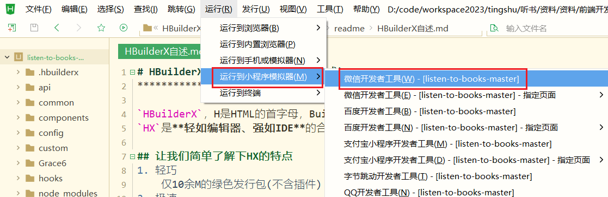
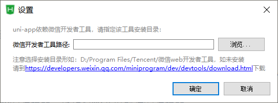
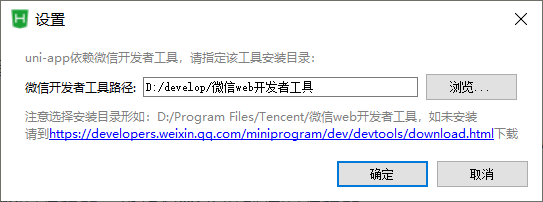
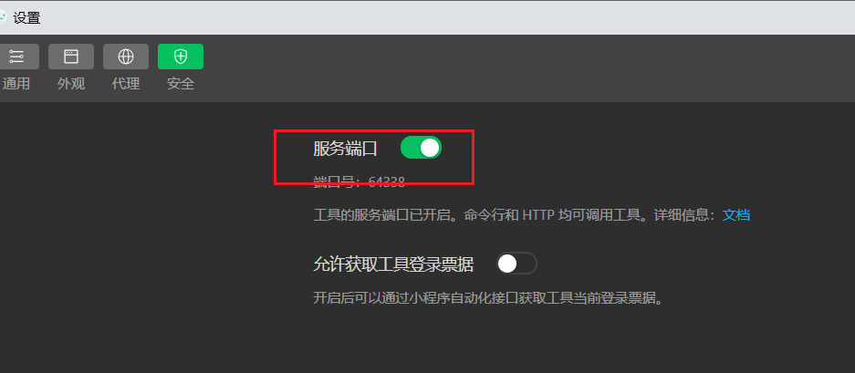
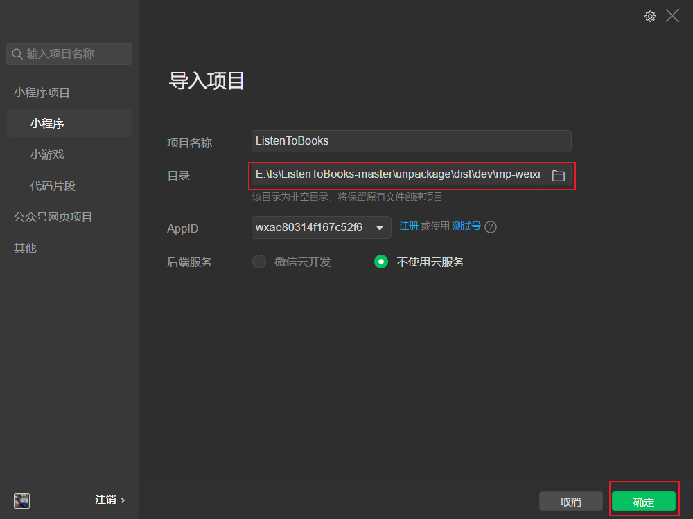
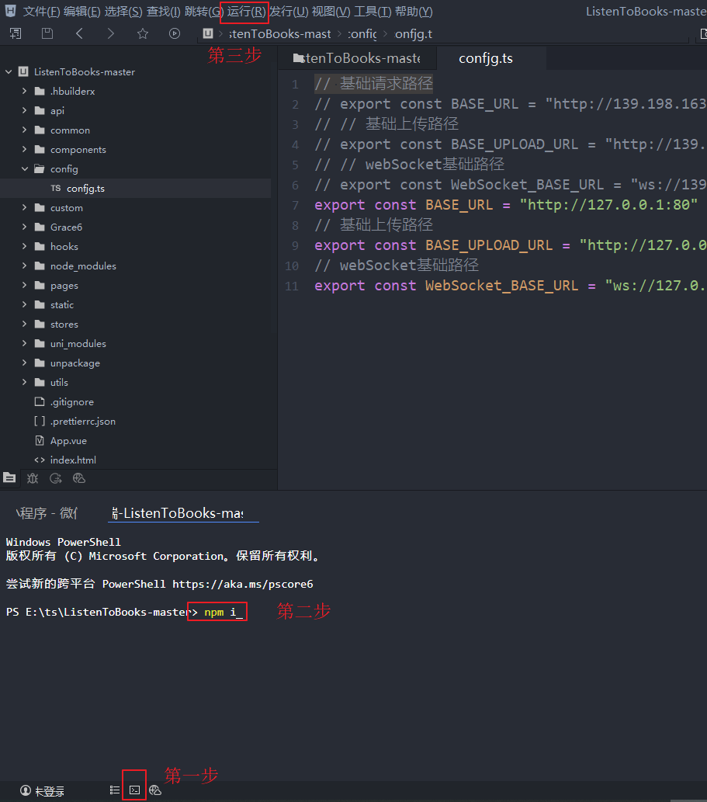

# 前端项目部署

## 将项目引入到开发工具中

修改config/config.ts 下的 配置文件，将服务器上地址改为本地：

```java
// 基础请求路径
export const BASE_URL = "http://127.0.0.1:80"
// 基础上传路径
export const BASE_UPLOAD_URL = "http://127.0.0.1:80"
// webSocket基础路径
export const WebSocket_BASE_URL = "ws://127.0.0.1/api/websocket"
```

然后运行项目



## 设置开发者工具路径

选中安装好的微信小程序路径





点击确定：

## 打开服务端口

设置微信开发者工具：安全--打开服务端口



## 导入项目

选中好前端项目，选择**测试账号** 点击确定即可

项目目录点到：mp-weixin文件夹即可  E:\ts\ListenToBooks-master\unpackage\dist\dev\mp-weixin




如果找不到 **unpackage** 文件夹，打开HBuilder中的终端窗口 执行 npm i ，在重新运行前端项目即可！

