# 1 开通直播

## 1.1 需求说明

直播的火爆相信大家有目共睹，它和短视频平台作为近几年最为火爆的行业，究其原因离不开它们的社交属性，尤其是直播平台，它被各个行业广泛应用，时至今日直播已经成为了我们生活中的一部分，甚至于到了人人直播的地步，下至未成年上至老年人，直播凭借着其自身社交性、互动性吸引了大量的关注，那么今天我们就来探索一下直播背后的奥秘。

当前我们要实现直播最核心的两个功能：

1、主播创建直播，普通用户观看直播

2、直播间可以进行实时互动：即时聊天

实现思路：

1、直播我们可以基于腾讯云云直播平台实现

2、即时聊天我们可以基于websocket实现


## 1.2 开通腾讯云云直播

### 1.2.1 登录腾讯云

腾讯云地址：https://cloud.tencent.com/login

微信扫码登录

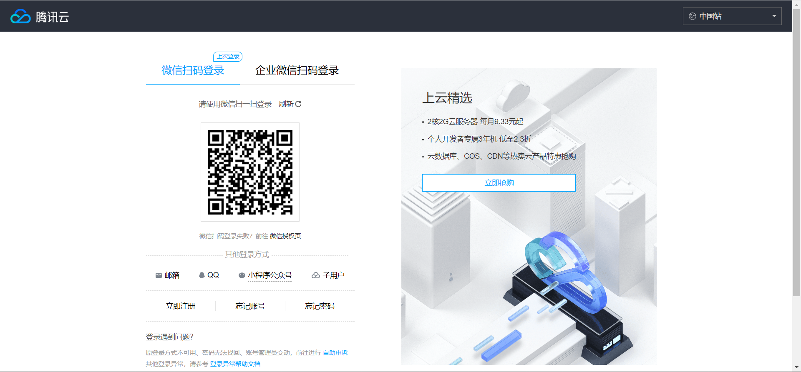

### 1.2.2 云直播地址

云直播地址：https://cloud.tencent.com/product/css

选择“立即使用”，开通“云直播”

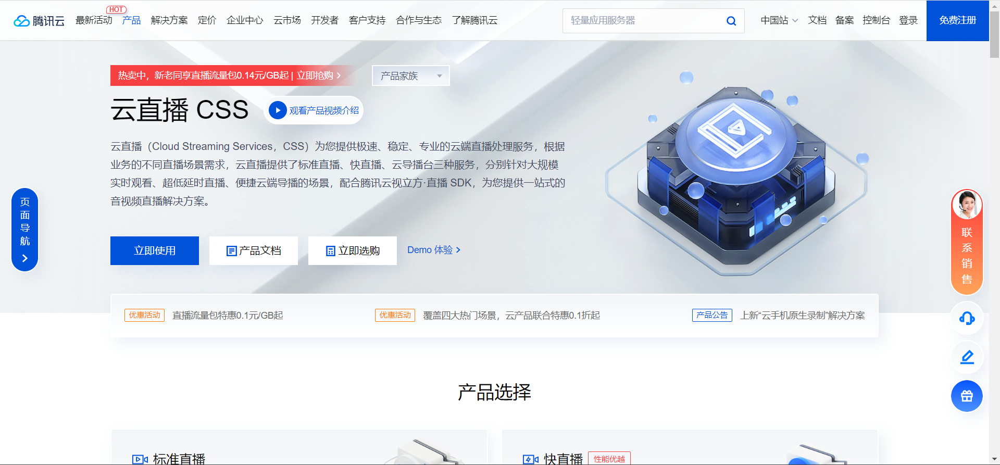


## 1.3 配置云直播

### 1.3.1 直播基础知识

最原始的直播系统其实并没有想象的那么复杂，无非就是主播端将音视频数据推送到服务器，观众端则从服务器拉取数据播放。

####  产品架构

通过下面这个数据流程图，能清晰地看到整个直播的过程。

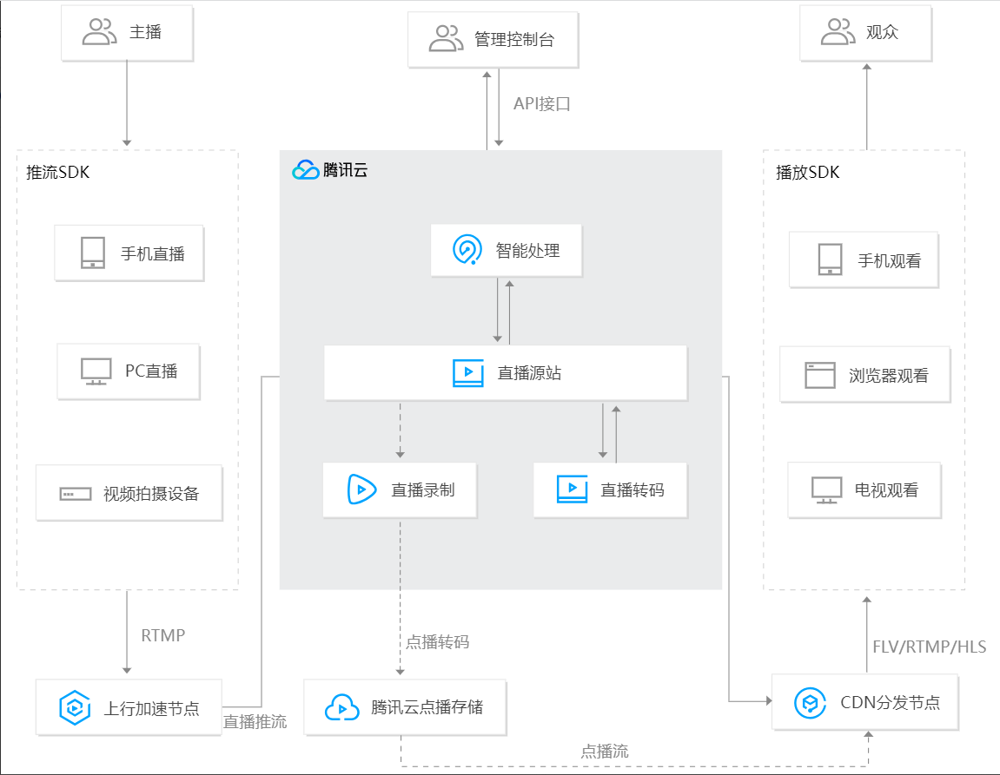


#### 直播推流

推流，是直播中的一个术语，意思是将流媒体数据推送到服务器。如何推流，关键就在于使用的推流协议。

官方文档：https://cloud.tencent.com/document/product/267/32732

说明：我们项目为微信小程序，微信小程序可以使用微信推流插件实现推流，但是微信小程序推流要求资质高并且收费，因此我们项目采用H5的方式，使用WebRTC协议进行推流，故直播部分使用H5开发。

| 功能名称                                     | 功能简介                                     |
| ---------------------------------------- | ---------------------------------------- |
| [推流协议](https://cloud.tencent.com/document/product/267/7968#.E6.94.AF.E6.8C.81.E5.93.AA.E4.BA.9B.E6.8E.A8.E6.B5.81.E5.8D.8F.E8.AE.AE.EF.BC.9F) | 支持 RTMP 和 WebRTC 协议进行推流。                 |
| [推流方式](https://cloud.tencent.com/document/product/267/32732) | 支持集成腾讯云直播 iOS、Android、Web 的腾讯云视立方·直播 SDK，以及常见的第三方推流软件，包括 OBS、XSplit、FMLE 等进行推流。 |
| 推流设备                                     | 支持常见的第三方 RTMP 推流硬件和编码器或盒子等设备。            |

#### 直播播放

官方文档：https://cloud.tencent.com/document/product/267/32733

播放即拉流，指的是「观众端」流媒体数据的拉取，同样也需要通过约定的拉流协议来拉取。

| 功能名称                                     | 功能简介                                     |
| ---------------------------------------- | ---------------------------------------- |
| [播放协议](https://cloud.tencent.com/document/product/267/7968#.E6.94.AF.E6.8C.81.E5.93.AA.E4.BA.9B.E6.92.AD.E6.94.BE.E5.8D.8F.E8.AE.AE.EF.BC.9F) | 支持 RTMP、FLV、HLS 及 UDP 播放协议。              |
| [播放方式](https://cloud.tencent.com/document/product/267/32733) | 支持集成腾讯云直播 iOS、Android、Web 的腾讯云视立方·直播 SDK，以及常见的第三方 FLV、RTMP、HLS 播放器进行播放。 |
| 播放控制                                     | 可播放与输入流规格一致的原始码流，或播放经过实时转码的码流。           |

### 1.3.2 配置域名

打开云直播控制台，概述 ==》 新手接入指导

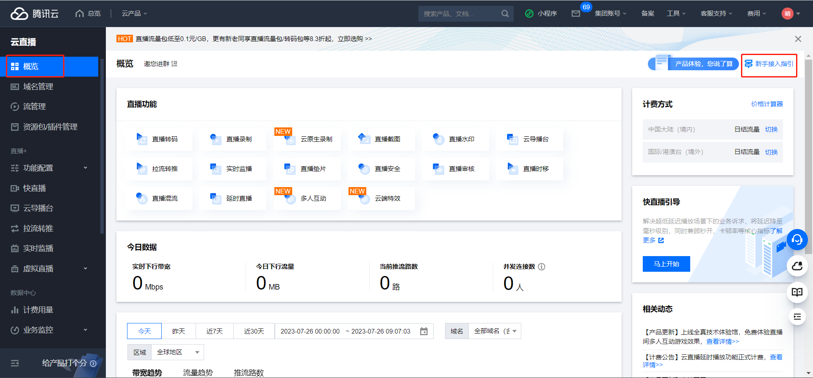

点击“新手接入指导”

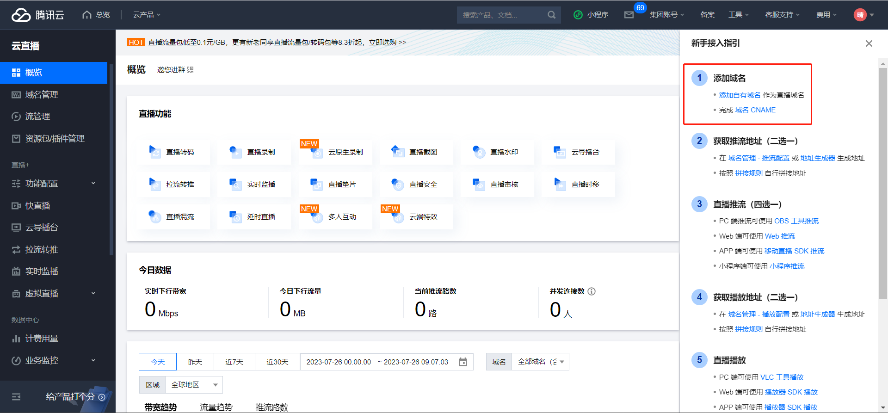

按照官方文档引导配置“推流域名”与“播放域名”，过程比较繁琐，请认真阅读并配置；

腾讯云一般会赠送你一个“推流域名”，大家可以直接使用，只需要配置一个“播放域名”，配置好后如图：


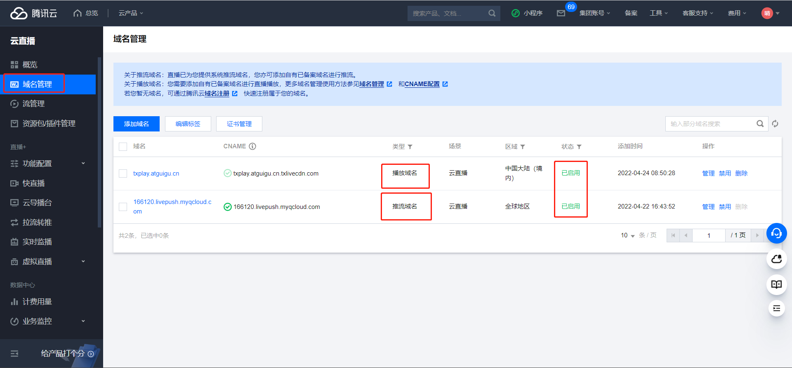

### 1.3.3 直播推流

当前已配置好域名，可以测试推流

#### 步骤一：Web推流

常用工具 ==》 Web推流

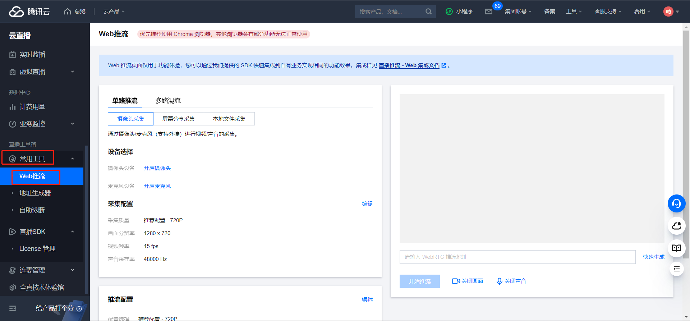

#### 步骤二：开启摄像头与麦克风

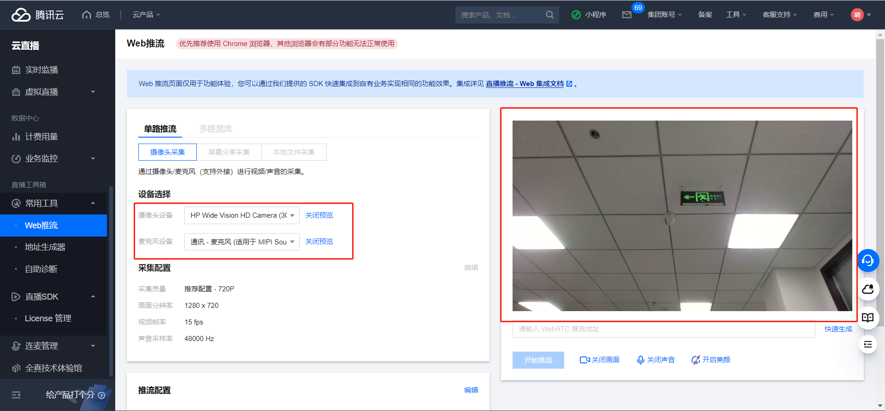

#### 步骤三：生成推流地址

快速生成

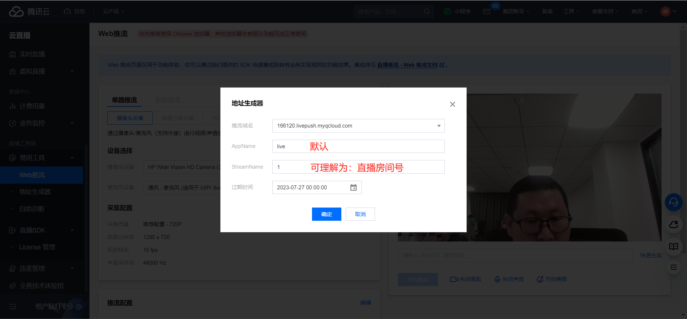

生成结课

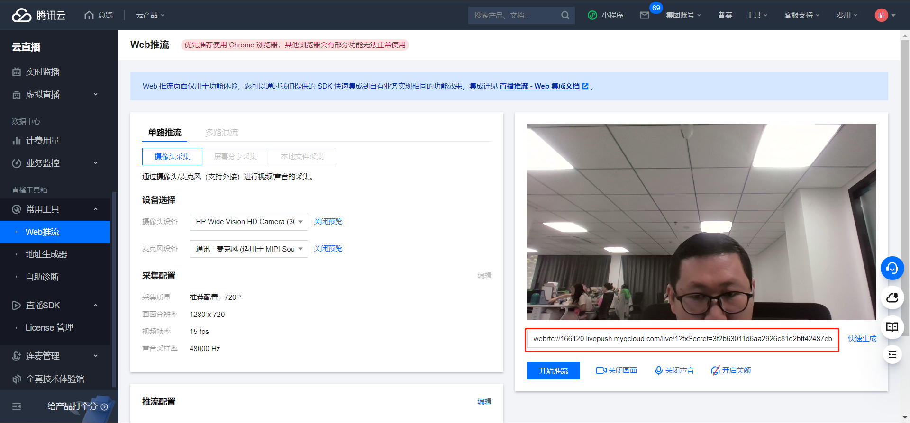

点击“开始推流”，然后查看控制台“流管理”，如果流管理出现记录，说明推流成功

#### 步骤四：查看推流

新开一个网页查看推流，推流不能断

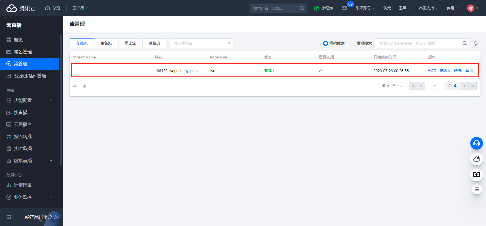

#### 步骤五：直播播放

流管理，点击预览，即可看见直播内容

#### 步骤六：总结

只要我们生成好直播推流地址，使用推流工具，即可完成推流，播放也是同理，只要有播放地址，我们就可以观看直播播放。

## 1.4 生成直播地址

自主拼装直播 URL官方地址：https://cloud.tencent.com/document/product/267/32720

### 1.4.1 推流地址生成

#### 步骤一：官方示例代码

腾讯云已经给我们提供了推流地址的示例代码，我们直接使用即可

进入 **云直播控制台** ==> [**域名管理**](https://console.cloud.tencent.com/live/domainmanage)，选中事先配置的推流域名，**管理==>推流配置** 页面下半部分有 **推流地址示例代码** （PHP 和 Java 两个版本）演示如何生成防盗链地址，如图：

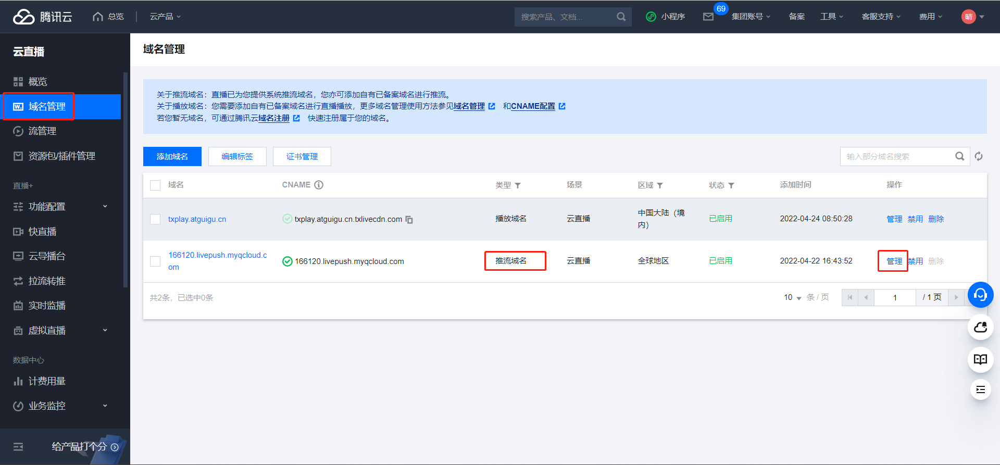

点击“管理”，如图：

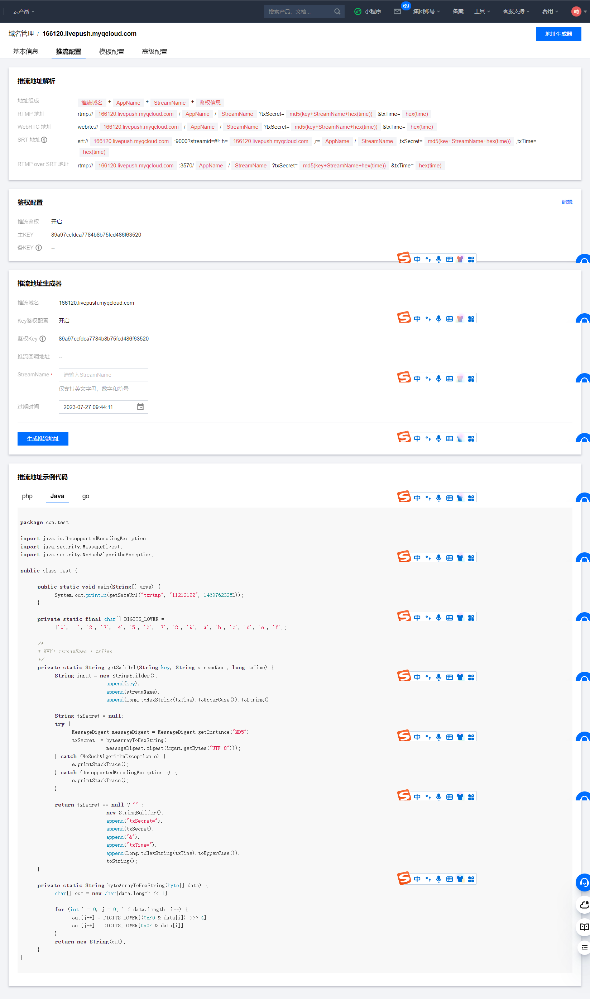

#### 步骤二：调整及运行示例代码

根据示例代码，我们改造一个推流地址

```java
package com.atguigu.tingshu.live.util;

import java.io.UnsupportedEncodingException;
import java.security.MessageDigest;
import java.security.NoSuchAlgorithmException;
import java.time.LocalDateTime;
import java.time.ZoneOffset;

public class Test {

    public static void main(String[] args) {
        //域名管理中点击推流域名-->推流配置-->鉴权配置-->主KEY
        String key = "89a97ccfdca7784b8b75fcd486f63520";
        //流名称，后续为直播房间号
        String streamName = "room1";
        //过期时间
        LocalDateTime localDateTime = LocalDateTime.now();
        long nowTime = localDateTime.toEpochSecond(ZoneOffset.of("+8"));
        long txTime = nowTime + 60 * 60 * 12; // 默认12小时

        String safeUrl = getSafeUrl(key, streamName, txTime);
        System.out.println(safeUrl);
        
        //推流地址
        String pushUrl = "webrtc://166120.livepush.myqcloud.com/live/" + streamName + "?" + safeUrl;
        System.out.println(pushUrl);
    }

    private static final char[] DIGITS_LOWER =
            {'0', '1', '2', '3', '4', '5', '6', '7', '8', '9', 'a', 'b', 'c', 'd', 'e', 'f'};

    /*
     * KEY+ streamName + txTime
     */
    private static String getSafeUrl(String key, String streamName, long txTime) {
        String input = new StringBuilder().
                append(key).
                append(streamName).
                append(Long.toHexString(txTime).toUpperCase()).toString();

        String txSecret = null;
        try {
            MessageDigest messageDigest = MessageDigest.getInstance("MD5");
            txSecret  = byteArrayToHexString(
                    messageDigest.digest(input.getBytes("UTF-8")));
        } catch (NoSuchAlgorithmException e) {
            e.printStackTrace();
        } catch (UnsupportedEncodingException e) {
            e.printStackTrace();
        }

        return txSecret == null ? "" :
                new StringBuilder().
                        append("txSecret=").
                        append(txSecret).
                        append("&").
                        append("txTime=").
                        append(Long.toHexString(txTime).toUpperCase()).
                        toString();
    }

    private static String byteArrayToHexString(byte[] data) {
        char[] out = new char[data.length << 1];

        for (int i = 0, j = 0; i < data.length; i++) {
            out[j++] = DIGITS_LOWER[(0xF0 & data[i]) >>> 4];
            out[j++] = DIGITS_LOWER[0x0F & data[i]];
        }
        return new String(out);
    }
}
```

#### 步骤三：测试推流地址

复制上面代码输出的推流地址，到控制台 “常用工具” ==》 “Web推流”，测试推流地址，详细步骤如上，在流管理中能够看到状态是直播中则说明推流地址正确！

### 1.4.2 播放地址生成

播放地址生成规则跟推流地址生成规则一致，只是拼接的域名不同，完整代码

```java
package com.atguigu.tingshu.live.util;

import java.io.UnsupportedEncodingException;
import java.security.MessageDigest;
import java.security.NoSuchAlgorithmException;
import java.time.LocalDateTime;
import java.time.ZoneOffset;

public class Test {

    public static void main(String[] args) {
        //域名管理中点击推流域名-->推流配置-->鉴权配置-->主KEY
        String key = "89a97ccfdca7784b8b75fcd486f63520";
        //流名称
        String streamName = "room1";
        //过期时间
        LocalDateTime localDateTime = LocalDateTime.now();
        long nowTime = localDateTime.toEpochSecond(ZoneOffset.of("+8")); 
        long txTime = nowTime + 60 * 60 * 12; // 默认12小时

        String safeUrl = getSafeUrl(key, streamName, txTime);
        System.out.println(safeUrl);
        
        //推流地址
        String pushUrl = "webrtc://166120.livepush.myqcloud.com/live/" + streamName + "?" + safeUrl;
        System.out.println(pushUrl);

        //播放地址
        String playUrl = "webrtc://txplay.atguigu.cn/live/" + streamName + "?" + safeUrl;
        System.out.println(playUrl);
    }

    private static final char[] DIGITS_LOWER =
            {'0', '1', '2', '3', '4', '5', '6', '7', '8', '9', 'a', 'b', 'c', 'd', 'e', 'f'};

    /*
     * KEY+ streamName + txTime
     */
    private static String getSafeUrl(String key, String streamName, long txTime) {
        String input = new StringBuilder().
                append(key).
                append(streamName).
                append(Long.toHexString(txTime).toUpperCase()).toString();

        String txSecret = null;
        try {
            MessageDigest messageDigest = MessageDigest.getInstance("MD5");
            txSecret  = byteArrayToHexString(
                    messageDigest.digest(input.getBytes("UTF-8")));
        } catch (NoSuchAlgorithmException e) {
            e.printStackTrace();
        } catch (UnsupportedEncodingException e) {
            e.printStackTrace();
        }

        return txSecret == null ? "" :
                new StringBuilder().
                        append("txSecret=").
                        append(txSecret).
                        append("&").
                        append("txTime=").
                        append(Long.toHexString(txTime).toUpperCase()).
                        toString();
    }

    private static String byteArrayToHexString(byte[] data) {
        char[] out = new char[data.length << 1];

        for (int i = 0, j = 0; i < data.length; i++) {
            out[j++] = DIGITS_LOWER[(0xF0 & data[i]) >>> 4];
            out[j++] = DIGITS_LOWER[0x0F & data[i]];
        }
        return new String(out);
    }
}
```

### 1.4.3 封装直播地址

后续做直播，其实只是使用了这两个地址，封装为工具类，后续使用

```java
package com.atguigu.tingshu.live.util;

import com.atguigu.tingshu.vo.live.TencentLiveAddressVo;
import jakarta.annotation.PostConstruct;
import org.springframework.beans.factory.annotation.Autowired;
import org.springframework.core.env.Environment;
import org.springframework.stereotype.Component;

import java.io.UnsupportedEncodingException;
import java.security.MessageDigest;
import java.security.NoSuchAlgorithmException;
import java.time.LocalDateTime;
import java.time.ZoneOffset;

/**
 * 推拉流生成工具
 */
public class LiveAutoAddressUtil {

    private static char[] DIGITS_LOWER = {'0', '1', '2', '3', '4', '5', '6', '7', '8', '9', 'a', 'b', 'c', 'd', 'e', 'f'};
    private static String pushKey = "89a97ccfdca7784b8b75fcd486f63520"; //域名管理中点击推流域名-->推流配置-->鉴权配置-->主KEY
    private static String pushDomain = "166120.livepush.myqcloud.com"; //云直播控制台配置的推流域名
    private static String pullDomain = "txplay.atguigu.cn";//云直播控制台配置的拉流域名
    private static String AppName = "live"; //直播SDK-->应用管理-->自己创建应用中的应用名称
    

    public static TencentLiveAddressVo getAddressUrl(String streamName, long txTime) {
        String safeUrl = getSafeUrl(pushKey, streamName, txTime);
        TencentLiveAddressVo liveAddress = new TencentLiveAddressVo();

        liveAddress.setPushWebRtcUrl("webrtc://" + pushDomain + "/" + AppName + "/" + streamName + "?" + safeUrl);
        liveAddress.setPullWebRtcUrl("webrtc://" + pullDomain + "/" + AppName + "/" + streamName + "?" + safeUrl);
        return liveAddress;
    } /* * KEY+ streamName + txTime */

    private static String getSafeUrl(String key, String streamName, long txTime) {
        String input = new StringBuilder().append(key).append(streamName).append(Long.toHexString(txTime).toUpperCase()).toString();
        String txSecret = null;
        try {
            MessageDigest messageDigest = MessageDigest.getInstance("MD5");
            txSecret = byteArrayToHexString(messageDigest.digest(input.getBytes("UTF-8")));
        } catch (NoSuchAlgorithmException e) {
            e.printStackTrace();
        } catch (UnsupportedEncodingException e) {
            e.printStackTrace();
        }
        return txSecret == null ? "" : new StringBuilder().append("txSecret=").append(txSecret).append("&").append("txTime=").append(Long.toHexString(txTime).toUpperCase()).toString();
    }

    private static String byteArrayToHexString(byte[] data) {
        char[] out = new char[data.length << 1];
        for (int i = 0, j = 0; i < data.length; i++) {
            out[j++] = DIGITS_LOWER[(0xF0 & data[i]) >>> 4];
            out[j++] = DIGITS_LOWER[0x0F & data[i]];
        }
        return new String(out);
    }

    public static void main(String[] args) {
        String streamName = "test";
        LocalDateTime localDateTime = LocalDateTime.now();
        long nowTime = localDateTime.toEpochSecond(ZoneOffset.of("+8"));
        long endTime = nowTime + 60 * 60 * 12; // 默认12小时
        TencentLiveAddressVo addressUrl = LiveAutoAddressUtil.getAddressUrl(streamName, endTime);
        System.out.println(addressUrl.getPushWebRtcUrl());
        System.out.println(addressUrl.getPullWebRtcUrl());
    }
}
```

# 2 直播对接

## 2.1 需求说明

主播开启直播，如果当前时间段有未结束直播，直接进入直播间

用户观看端，直接点击“直播”频道，可以看见正在直播的用户列表，选择其中一个可进入直播间。

## 2.2 创建直播

### 2.2.1 创建直播流程

由于直播部分为H5开发，因此我们不能在微信小程序工具上打开测试，微信小程序不支持

#### 步骤一：运行H5

打开HBuilder工具，选中项目，点击：运行 ==》 运行到浏览器 ==》 Chrome

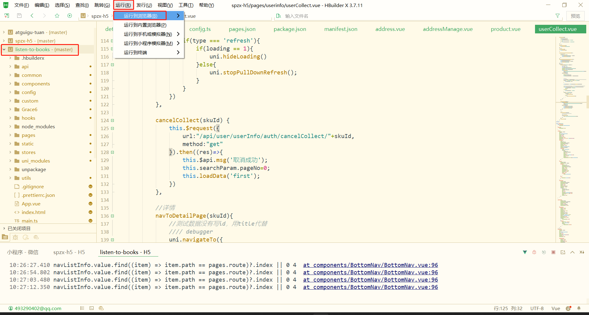


#### 步骤二：开启调试模式

启动项目，浏览器使用调试模式 ，访问项目数据的时候，需要跨域设置，所以在网关中添加配置即可

```java
server:
  port: 80
spring:
  cloud:
    openfeign:
      lazy-attributes-resolution: true
      client:
        config:
          default:
            connectTimeout: 30000
            readTimeout: 30000
            loggerLevel: basic
    gateway:
      discovery:      #是否与服务发现组件进行结合，通过 serviceId(必须设置成大写) 转发到具体的服务实例。默认为false，设为true便开启通过服务中心的自动根据 serviceId 创建路由的功能。
        locator:      #路由访问方式：http://Gateway_HOST:Gateway_PORT/大写的serviceId/**，其中微服务应用名默认大写访问。
          enabled: true
      routes:
        - id: service-album
          uri: lb://service-album
          predicates:
            - Path=/*/album/**
        - id: service-user
          uri: lb://service-user
          predicates:
            - Path=/*/user/**
        - id: service-order
          uri: lb://service-order
          predicates:
            - Path=/*/order/**
        - id: service-live
          uri: lb://service-live
          predicates:
            - Path=/*/live/**
        - id: service-live-websocket
          uri: lb:ws://service-live #ws://localhost:8507
          predicates:
            - Path=/websocket/**
        - id: service-account
          uri: lb://service-account
          predicates:
            - Path=/*/account/**
        - id: service-comment
          uri: lb://service-comment
          predicates:
            - Path=/*/comment/**
        - id: service-dispatch
          uri: lb://service-dispatch
          predicates:
            - Path=/*/dispatch/**
        - id: service-payment
          uri: lb://service-payment
          predicates:
            - Path=/*/payment/**
        - id: service-system
          uri: lb://service-system
          predicates:
            - Path=/*/system/**
        - id: service-search
          uri: lb://service-search
          predicates:
            - Path=/*/search/**
        - id: service-search
          uri: lb://service-system
          predicates:
            - Path=/*/system/**
      globalcors:
        cors-configurations:
          '[/**]':
            allowedMethods: "*"
            allowedHeaders: "*"
            allowedOriginPatterns: "*"
            allowCredentials: true
```


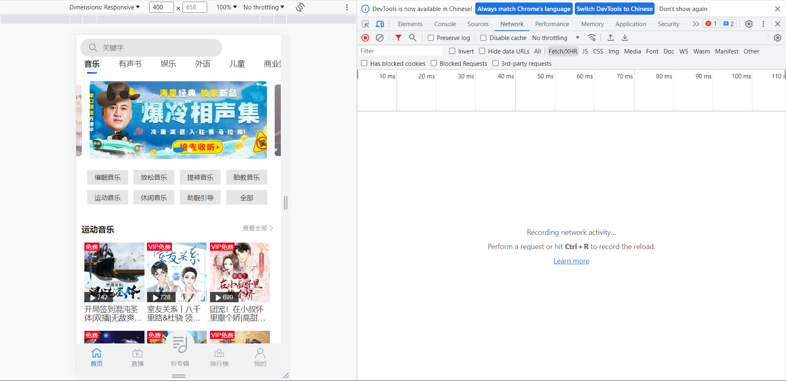

#### 步骤三：访问频道“我的”

点击“我的”

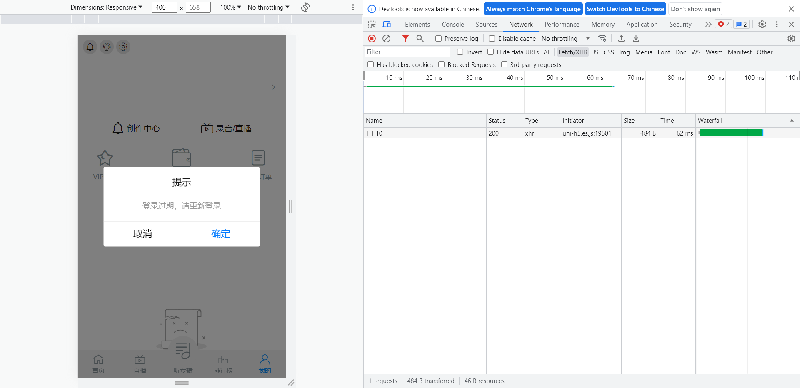

由于H5没有登录入口，因此我们要把小程序的登录token设置到浏览器的本地存储

#### 步骤四：获取小程序token

直接从redis 获取！

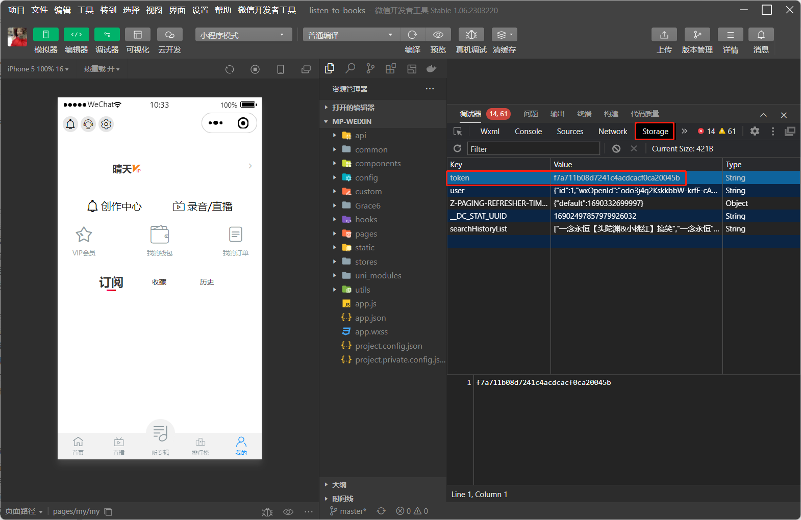

#### 步骤五：设置H5的token

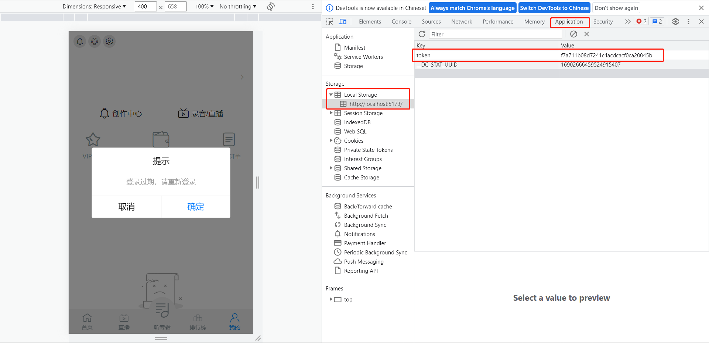

url 路径为 http://localhost:5173/  **后面如果有参数则删除！**  再刷新页面，H5自动登录成功

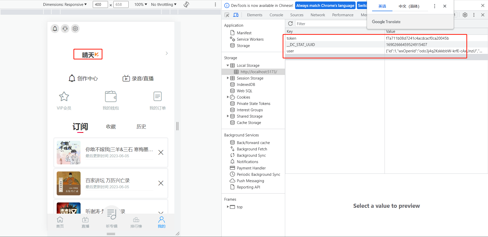

#### 步骤六：创建直播

点击“录音/直播”

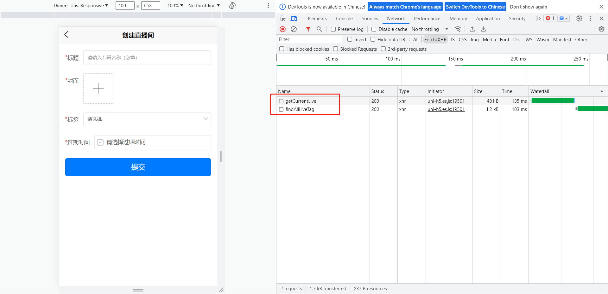

进入创建直播页面，会请求2个接口：

1，获取全部直播标签

2，获取当前正在直播的数据，如果有，直接进入直播间，如果没有创建直播

### 2.2.2 获取全部直播标签

#### LiveTagApiController

定义controller接口

```java
@Operation(summary = "获取全部直播标签")
@GetMapping("findAllLiveTag")
public Result<List<LiveTag>> findAllLiveTag() {
   return Result.ok(liveTagService.list());
}
```

### 2.2.3 获取用户当前正在直播的信息

#### LiveRoomApiController

定义controller接口

```java
@GuiGuLogin
@Operation(summary = "获取当前用户直播")
@GetMapping("getCurrentLive")
public Result<LiveRoom> getCurrentLive() {
   return Result.ok(liveRoomService.getCurrentLive(AuthContextHolder.getUserId()));
}
```

#### LiveRoomService

定义service接口

```java
LiveRoom getCurrentLive(Long userId);
```

#### LiveRoomServiceImpl

service接口实现

```java
@Override
public LiveRoom getCurrentLive(Long userId) {
   return liveRoomMapper.selectOne(new LambdaQueryWrapper<LiveRoom>().eq(LiveRoom::getUserId, userId).ge(LiveRoom::getExpireTime, new Date()));
}
```

### 2.2.4 创建直播

#### LiveRoomApiController

将保存数据封装到一个实体类：LiveRoomVo


定义controller接口

```java
@GuiGuLogin
@Operation(summary = "创建直播")
@PostMapping("saveLiveRoom")
public Result<LiveRoom> saveLiveRoom(@RequestBody @Validated LiveRoomVo liveRoomVo) {
   return Result.ok(liveRoomService.saveLiveRoom(liveRoomVo, AuthContextHolder.getUserId()));
}
```

#### LiveRoomService

定义service接口

```
LiveRoom saveLiveRoom(LiveRoomVo liveRoomVo, Long userId);
```

#### LiveRoomServiceImpl

service接口实现

```java
@Transactional
@Override
public LiveRoom saveLiveRoom(LiveRoomVo liveRoomVo, Long userId) {
   long count = liveRoomMapper.selectCount(new LambdaQueryWrapper<LiveRoom>().eq(LiveRoom::getUserId, userId).gt(LiveRoom::getExpireTime, new Date()));
   if(count > 0) {
      throw new GuiguException(ResultCodeEnum.EXIST_NO_EXPIRE_LIVE);
   }
   LiveRoom liveRoom = new LiveRoom();
   BeanUtils.copyProperties(liveRoomVo, liveRoom);
   liveRoom.setUserId(userId);
   liveRoom.setAppName("live");
   liveRoom.setStreamName("guigu"+userId);
   liveRoomMapper.insert(liveRoom);

   long txTime = liveRoom.getExpireTime().getTime() / 1000;
   TencentLiveAddressVo addressUrl = LiveAutoAddressUtil.getAddressUrl(liveRoom.getStreamName(), txTime);
   liveRoom.setPushUrl(addressUrl.getPushWebRtcUrl());
   liveRoom.setPlayUrl(addressUrl.getPullWebRtcUrl());
   liveRoomMapper.updateById(liveRoom);
   return liveRoom;
}
```


### 2.2.4 直播列表

直播频道对应的直播列表

当前数据较少，大家可以自己造一些数据，页面更美观

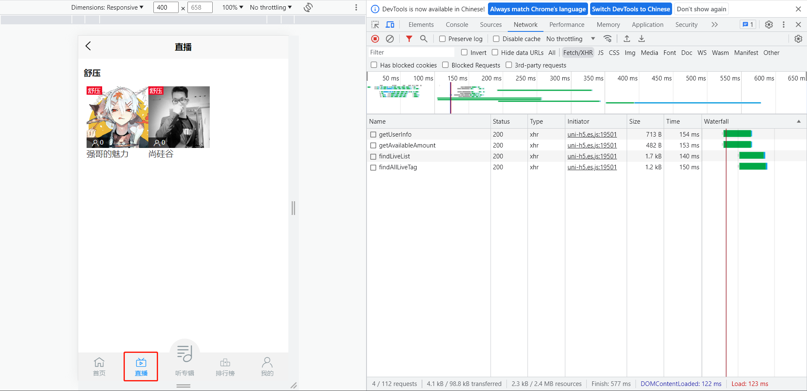

#### LiveRoomApiController

定义controller接口

```java
@GuiGuLogin
@Operation(summary = "获取当前直播列表")
@GetMapping("findLiveList")
public Result<List<LiveRoom>> findLiveList() {
   return Result.ok(liveRoomService.findLiveList());
}
```

#### LiveRoomService

定义service接口

```java
List<LiveRoom> findLiveList();
```

#### LiveRoomServiceImpl

service接口实现

```java
@Override
public List<LiveRoom> findLiveList() {
   LambdaQueryWrapper<LiveRoom> queryWrapper = new LambdaQueryWrapper<>();
   queryWrapper.gt(LiveRoom::getExpireTime, new Date());
   return liveRoomMapper.selectList(queryWrapper);
}
```

## 2.4 直播详情

前面开启了直播，当前通过列表，进入任意一个详情页，就可以看见直播视频了，直播详情主要获取播放地址及相关信息。

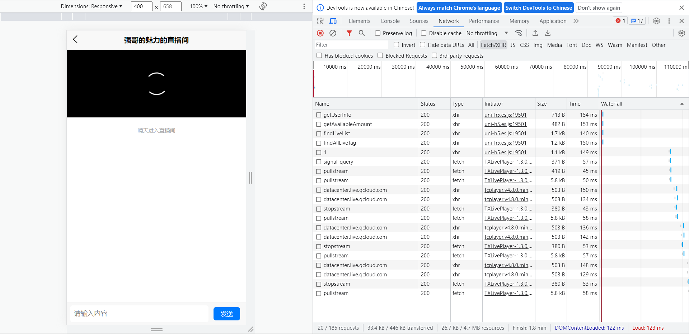

#### LiveRoomApiController

定义controller接口

```java
@GuiGuLogin
@Operation(summary = "根据id获取信息")
@GetMapping("getById/{id}")
public Result<LiveRoom> getById(@PathVariable Long id) {
   return Result.ok(liveRoomService.getById(id));
}
```

# 3 直播间即时通讯

## 3.1 需求说明

主播创建了直播，用户进入直播，大家可以进行实时互动，可以在直播间发送信息，直播间的消息，在直播间的用户都是共享的，相当于把直播间的用户组建了一个群组

实现思路：

1，使用websocket实现即时通讯

2，以直播id组建群组

## 3.2 集成websocket

springboot集成 websocket 很容易

### 3.2.1 引入依赖

已引入就忽略

```xml
<!--websocket依赖-->
<dependency>
    <groupId>org.springframework.boot</groupId>
    <artifactId>spring-boot-starter-websocket</artifactId>
</dependency>
```

### 3.2.2 开启websocket

```java
package com.atguigu.tingshu.config;

import org.springframework.context.annotation.Bean;
import org.springframework.context.annotation.Configuration;
import org.springframework.web.socket.server.standard.ServerEndpointExporter;

/**
 * WebSocket配置类：
 *  开启websocket配置，通过这个配置 spring boot 才能去扫描到 websocket 的注解
 *
 * WebSocket常用注解：
 * @ServerEndpoint
 * 通过这个 spring boot 就可以知道你暴露出去的 ws 应用的路径，有点类似我们经常用的@RequestMapping。比如你的启动端口是8080，而这个注解的值是api，那我们就可以通过 ws://127.0.0.1:8080/api 来连接你的应用
 * @OnOpen
 * 当 websocket 建立连接成功后会触发这个注解修饰的方法，注意它有一个 Session 参数
 * @OnClose
 * 当 websocket 建立的连接断开后会触发这个注解修饰的方法，注意它有一个 Session 参数
 * @OnMessage
 * 当客户端发送消息到服务端时，会触发这个注解修改的方法，它有一个 String 入参表明客户端传入的值
 * @OnError
 * 当 websocket 建立连接时出现异常会触发这个注解修饰的方法，注意它有一个 Session 参数
 */
@Configuration
public class WebSocketConfig {

    @Bean
    public ServerEndpointExporter serverEndpointExporter() {
        return new ServerEndpointExporter();
    }
}
```

### 3.2.3 编写websocket服务器端

连接websocket我们需要知道用户身份及他进入的哪个直播间，因此客户端连接的时候需要传入两个参数：直播间id与用户token，初始代码如下：

注意：使用@ServerEndpoint标签标记接口

```java
package com.atguigu.tingshu.live.api;

import io.swagger.v3.oas.annotations.tags.Tag;
import jakarta.websocket.*;
import jakarta.websocket.server.PathParam;
import jakarta.websocket.server.ServerEndpoint;
import lombok.extern.slf4j.Slf4j;
import org.springframework.stereotype.Component;

@Slf4j
@Tag(name = "直播间即时通讯接口管理")
@ServerEndpoint(value = "/api/websocket/{liveRoomId}/{token}")
@Component
public class WebSocketApiController {

    /**
     * 连接建立成功调用的方法
     */
    @OnOpen
    public void onOpen(Session session, @PathParam("liveRoomId") Long liveRoomId, @PathParam("token") String token) {
        log.info("建立连接，liveRoomId：{}， token：{}", liveRoomId, token);
    }

    /**
     * 连接关闭调用的方法
     */
    @OnClose
    public void onClose(Session session, @PathParam("liveRoomId") Long liveRoomId, @PathParam("token") String token) {
        log.info("断开连接，liveRoomId：{}， token：{}", liveRoomId, token);
    }

    /**
     * 收到客户端消息后调用的方法
     *
     * @param message 客户端发送过来的消息
     */
    @OnMessage
    public void onMessage(String message, Session session) {
        log.info("来自客户端的消息：{}", message);
    }

    /**
     * 发生错误时调用+
     */
    @OnError
    public void onError(Session session, Throwable error) {
        log.error("发生错误");
        error.printStackTrace();
    }

}
```

暴露接口：ws://localhost/api/websocket/{liveRoomId}/{token}，端口可以是本微服务端口，也可以试网关端口，一般使用网关端口

### 3.2.4 配置网关

如果使用网关端口，需配置如下：

```yaml
- id: service-live-websocket
  uri: lb:ws://service-live #ws://localhost:8507
  predicates:
    - Path=/api/websocket/**
```

### 3.2.5 测试websocket

测试工具：http://www.jsons.cn/websocket/

websocket地址：直播间地址

1、ws://localhost/api/websocket/{liveRoomId}/{token}

可分别连接试试

输入地址：ws://localhost/api/websocket/1/user1，点击“Websocket连接”，连接成功

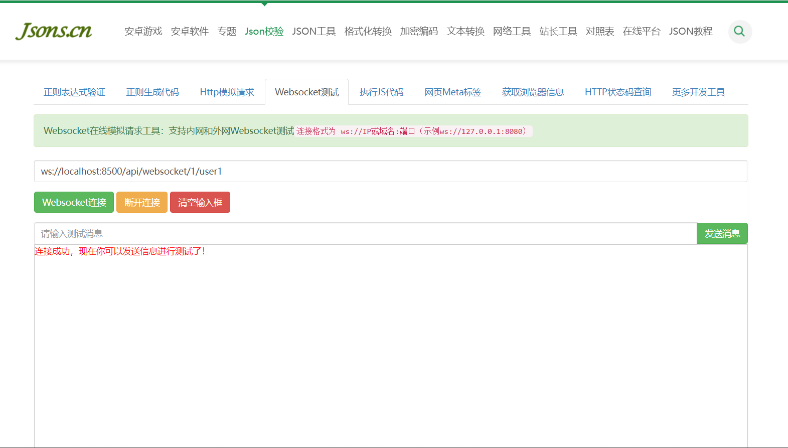

查看idea控制台，如图

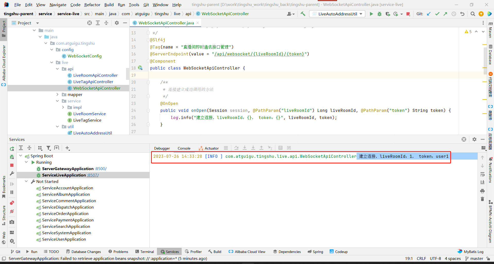

发送消息与断开连接，如图

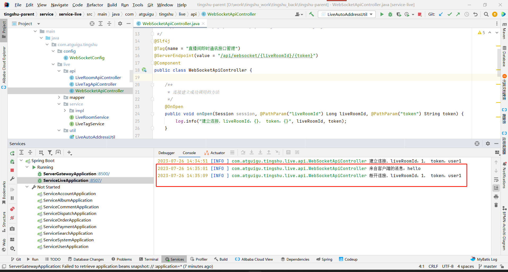

都收到了对应消息，说明websocket调试通过，下面我们就可以编写直播间通讯逻辑了

## 3.3 直播间即时通讯

### 3.3.1 封装直播间容器工具类

```java
package com.atguigu.tingshu.live.util;

import com.atguigu.tingshu.model.live.FromUser;
import jakarta.websocket.Session;
import org.springframework.util.CollectionUtils;

import java.util.ArrayList;
import java.util.List;
import java.util.Map;
import java.util.concurrent.ConcurrentHashMap;

public class WebSocketLocalContainerUtil {

    //建立用户id与用户基本信息对应关系容器，通过用户id能够获取用户基本信息
    private static Map<Long, FromUser> userMap = new ConcurrentHashMap<>();
  
    //建立用户id与websocket Session的对应关系容器，通过用户id能够获取Session会话信息
    private static Map<Long, Session> sessionMap = new ConcurrentHashMap<>();
  
    //建立直播间id与用户id列表的对应关系容器，通过直播间能够获取全部直播间用户列表
    private static Map<Long, List<Long>> liveRoomIdToUserListMap = new ConcurrentHashMap<>();

    public static void addFromUser(Long userId, FromUser fromUser) {
        WebSocketLocalContainerUtil.userMap.put(userId, fromUser);
    }

    public static void removeFromUser(Long userId) {
        WebSocketLocalContainerUtil.userMap.remove(userId);
    }

    public static FromUser getFromUser(Long userId) {
        return WebSocketLocalContainerUtil.userMap.get(userId);
    }

    public static void addSession(Long userId, Session session) {
        WebSocketLocalContainerUtil.sessionMap.put(userId, session);
    }

    public static void removeSession(Long userId) {
        WebSocketLocalContainerUtil.sessionMap.remove(userId);
    }

    public static Session getSession(Long userId) {
        return WebSocketLocalContainerUtil.sessionMap.get(userId);
    }
	

    public static void removeUserIdToLiveRoom(Long liveRoomId, Long userId) {
        WebSocketLocalContainerUtil.liveRoomIdToUserListMap.get(liveRoomId).remove(userId);
    }

    public static List<Long> getLiveRoomUserIdList(Long liveRoomId) {
        return WebSocketLocalContainerUtil.liveRoomIdToUserListMap.get(liveRoomId);
    }

    public static Integer getLiveRoomUserNum(Long liveRoomId) {
        return WebSocketLocalContainerUtil.liveRoomIdToUserListMap.get(liveRoomId).size();
    }
  
    public static void addUserIdToLiveRoom(Long liveRoomId, Long userId) {
      List<Long> userIdList = WebSocketLocalContainerUtil.liveRoomIdToUserListMap.get(liveRoomId);
      if(CollectionUtils.isEmpty(userIdList)) {
          userIdList = new ArrayList<>();
          userIdList.add(userId);
          WebSocketLocalContainerUtil.liveRoomIdToUserListMap.put(liveRoomId, userIdList);
      } else {
          userIdList.add(userId);
      }
    }
}
```

### 3.3.2 封装直播间关联数据到容器

```java
@Slf4j
@Tag(name = "直播间即时通讯接口管理")
@ServerEndpoint(value = "/api/websocket/{liveRoomId}/{token}")
@Component
public class WebSocketApiController {

    private static RedisTemplate redisTemplate;

    @Autowired
    public void setRedisTemplate(RedisTemplate redisTemplate) {
        WebSocketApiController.redisTemplate = redisTemplate;
    }

    /**
     * 连接建立成功调用的方法
     */
    @OnOpen
    public void onOpen(Session session, @PathParam("liveRoomId") Long liveRoomId, @PathParam("token") String token) {
        log.info("建立连接，liveRoomId：{}， token：{}", liveRoomId, token);
        
        //从redis获取用户基本信息，登录时保存到了redis
        UserInfo userInfo = (UserInfo)redisTemplate.opsForValue().get(RedisConstant.USER_LOGIN_KEY_PREFIX+token);

        Long userId = userInfo.getId();
        //构建即时通讯用户基本信息
        FromUser fromUser = new FromUser();
        fromUser.setUserId(userInfo.getId());
        fromUser.setNickname(userInfo.getNickname());
        fromUser.setAvatarUrl(userInfo.getAvatarUrl());

        //保存用户与直播间关联关系到容器
        WebSocketLocalContainerUtil.addSession(userId, session);
        WebSocketLocalContainerUtil.addFromUser(userId, fromUser);
        WebSocketLocalContainerUtil.addUserIdToLiveRoom(liveRoomId, userId);
    }

    /**
     * 连接关闭调用的方法
     */
    @OnClose
    public void onClose(Session session, @PathParam("liveRoomId") Long liveRoomId, @PathParam("token") String token) {
        log.info("断开连接，liveRoomId：{}， token：{}", liveRoomId, token);

        //获取用户信息
        UserInfo userInfo = (UserInfo)redisTemplate.opsForValue().get(RedisConstant.USER_LOGIN_KEY_PREFIX+token);
        Long userId = userInfo.getId();

        //删除容器中的关联关系
        WebSocketLocalContainerUtil.removeSession(userId);
        WebSocketLocalContainerUtil.removeFromUser(userId);
        WebSocketLocalContainerUtil.removeUserIdToLiveRoom(liveRoomId, userId);
    }

    /**
     * 收到客户端消息后调用的方法
     *
     * @param message 客户端发送过来的消息
     */
    @OnMessage
    public void onMessage(String message, Session session) {
        log.info("来自客户端的消息：{}", message);
    }

    /**
     * 发生错误时调用
     */
    @OnError
    public void onError(Session session, Throwable error) {
        log.error("发生错误");
        error.printStackTrace();
    }
}
```

### 3.3.3 封装消息实体

服务器端与前端H5通讯的消息协议就封装到这个对象里面了，后续前端H5与后端服务器都是以SocketMsg对象json串进行交互。

```java
package com.atguigu.tingshu.model.live;


import lombok.Data;
import lombok.Getter;

/**
 * 这里我们就不能使用简单的文本消息进行消息的发送了，我们使用json进行消息的发送。
 */
@Data
public class SocketMsg {

    @Getter
    public enum MsgTypeEnum {

        HEART_BEAT("0","心跳信息"),
        PUBLIC_MSG("1","公共聊天消息"),
        JOIN_CHAT("2","加入直播间"),
        CLOSE_SOCKET("3","退出直播间"),
        TOKEN_INVALID("-1","token无效"),
        ;

        private String code;
        private String data;
		
        MsgTypeEnum(String code, String data) {
            this.code = code;
            this.data = data;
        }

    }

    //直播房间id
    private Long liveRoomId;

    //消息类型
    private String msgType;
  
    //消息内容
    private Object msgContent;

    //发送者
    private FromUser fromUser;
  	
    //时间戳
    private String time;
}
```

### 3.3.4 封装构建消息实体方法

在WebSocketLocalContainerUtil类添加构建消息实体方法

```java
/**
 * 构建消息实体
 * @param liveRoomId
 * @param fromUser
 * @param msgTypeEnum
 * @param msgContent
 * @return
 */
public static SocketMsg buildSocketMsg(Long liveRoomId, FromUser fromUser, SocketMsg.MsgTypeEnum msgTypeEnum, Object msgContent) {
    SocketMsg socketMsg = new SocketMsg();
    socketMsg.setLiveRoomId(liveRoomId);
    socketMsg.setMsgType(msgTypeEnum.getCode());
    socketMsg.setMsgContent(msgContent);
    socketMsg.setFromUser(fromUser);
    socketMsg.setTime(new DateTime().toString("HH:mm:ss"));
    return socketMsg;
}
```

### 3.3.5 封装群发消息

在WebSocketLocalContainerUtil类添加封装群发消息

```java
/**
 * 群发消息
 * @param socketMsg
 */
public static void sendMsg(SocketMsg socketMsg) {
    List<Long> userIdSet = WebSocketLocalContainerUtil.getLiveRoomUserIdList(socketMsg.getLiveRoomId());
    if (!CollectionUtils.isEmpty(userIdSet)) {
        for(Long userId : userIdSet) {
            Session session = WebSocketLocalContainerUtil.getSession(userId);
            if(null != session) {
                session.getAsyncRemote().sendText(JSON.toJSONString(socketMsg, SerializerFeature.DisableCircularReferenceDetect));//异步发送消息.
            }
        }
    }
}
```

### 3.3.6 加入直播间消息通知

#### 添加直播间消息

用户加入直播间，建立websocket连接，提示直播间全体用户（张三加入了直播间），关键代码

```java
@OnOpen
public void onOpen(Session session, @PathParam("liveRoomId") Long liveRoomId, @PathParam("token") String token) {
    log.info("建立连接，liveRoomId：{}， token：{}", liveRoomId, token);
    ...

    //保存用户与直播间关联关系到容器
    WebSocketLocalContainerUtil.addSession(userId, session);
    WebSocketLocalContainerUtil.addFromUser(userId, fromUser);
    WebSocketLocalContainerUtil.addUserIdToLiveRoom(liveRoomId, userId);

    //构建消息：加入直播间
    SocketMsg socketMsg = WebSocketLocalContainerUtil.buildSocketMsg(liveRoomId, fromUser, SocketMsg.MsgTypeEnum.JOIN_CHAT, fromUser.getNickname()+"加入直播间");
    WebSocketLocalContainerUtil.sendMsg(socketMsg);
}
```

#### 手动获取用户token

为了方便测试，手动获取token，我们在WxLoginApiController添加方法

service-user模块，WxLoginApiController

```java
@Operation(summary = "手动获取token")
@GetMapping("/getToken/{userId}")
public Result login(@PathVariable Long userId) {
    UserInfo userInfo = userInfoService.getById(userId);
    String token = UUID.randomUUID().toString().replaceAll("-", "");
    redisTemplate.opsForValue().set(RedisConstant.USER_LOGIN_KEY_PREFIX+token, userInfo, RedisConstant.USER_LOGIN_REFRESH_KEY_TIMEOUT, TimeUnit.SECONDS);
    Map<String, Object> map = new HashMap<>();
    map.put("token", token);
    return Result.ok(map);
}
```

token1：2286fb83463e443f819ae51ae4c39e5d

token2：5c45b78b195843f1a0e54fe6aaf1bb8d

#### 多用户测试

用户1：ws://localhost/api/websocket/1/2286fb83463e443f819ae51ae4c39e5d

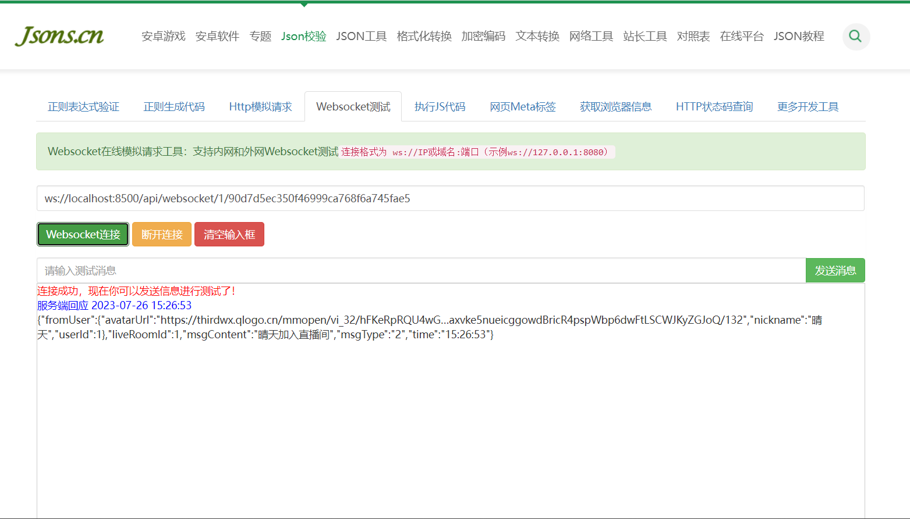

用户2：ws://localhost/api/websocket/1/5c45b78b195843f1a0e54fe6aaf1bb8d

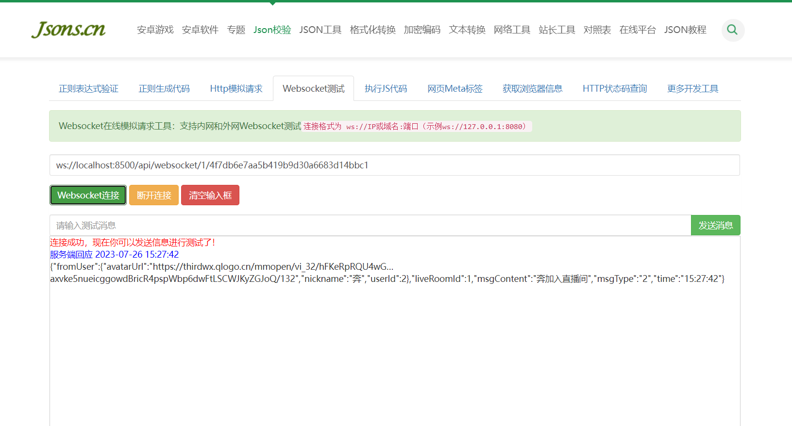

当前2个用户连接成功，再看用户1控制台

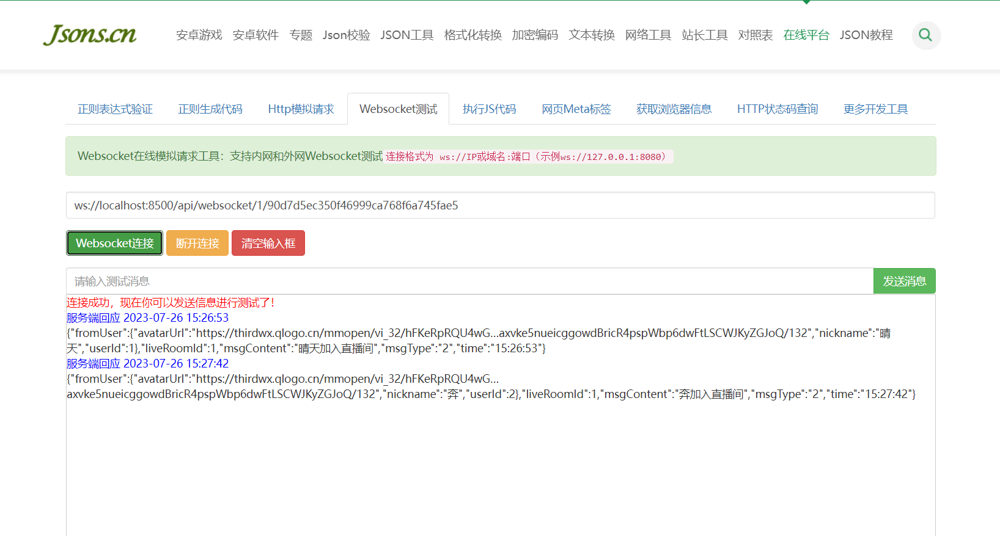

用户1收到到了用户2的登录通知消息，测试通过

### 3.3.7 直播间发送消息

消息我们都要构建成SocketMsg对象的json格式

```java
@OnMessage
public void onMessage(String message, Session session) {
    log.info("来自客户端的消息：{}", message);

    SocketMsg socketMsg = JSON.parseObject(message, SocketMsg.class);
    WebSocketLocalContainerUtil.sendMsg(socketMsg);
}
```

测试消息：

```json
{"fromUser":{"avatarUrl":"https://thirdwx.qlogo.cn/mmopen/vi_32/hFKeRpRQU4wG…axvke5nueicggowdBricR4pspWbp6dwFtLSCWJKyZGJoQ/132","nickname":"晴天","userId":1},"liveRoomId":1,"msgContent":"hello","msgType":"1","time":"15:26:53"}
```

效果如下：

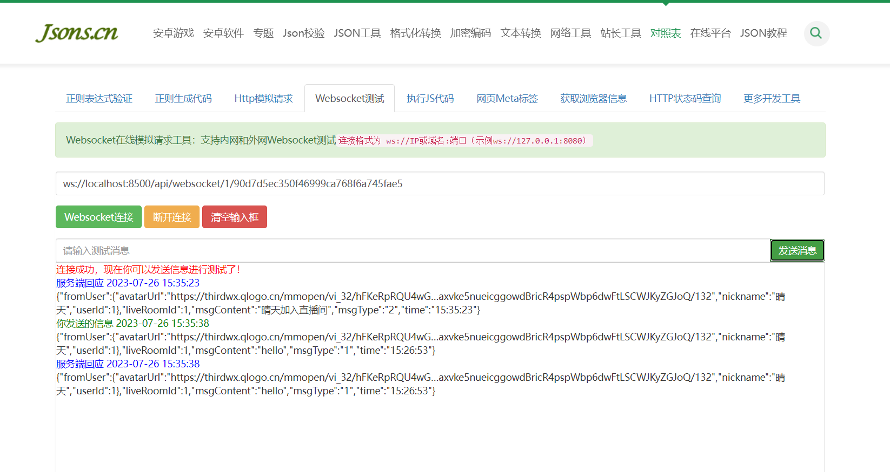

### 3.3.8 退出直播间

用户退出直播间，通知直播间用户，谁谁谁离开直播间。

```java
@OnClose
public void onClose(Session session, @PathParam("liveRoomId") Long liveRoomId, @PathParam("token") String token) {
    log.info("断开连接，liveRoomId：{}， token：{}", liveRoomId, token);

    //获取用户信息
    UserInfo userInfo = (UserInfo)redisTemplate.opsForValue().get(RedisConstant.USER_LOGIN_KEY_PREFIX+token);
    Long userId = userInfo.getId();
    //构建消息：退出直播间
    FromUser fromUser = WebSocketLocalContainerUtil.getFromUser(userId);
    SocketMsg socketMsg = WebSocketLocalContainerUtil.buildSocketMsg(liveRoomId, fromUser, SocketMsg.MsgTypeEnum.CLOSE_SOCKET, fromUser.getNickname()+"离开直播间");
    //删除容器中的关联关系
    WebSocketLocalContainerUtil.removeSession(userId);
    WebSocketLocalContainerUtil.removeFromUser(userId);
    WebSocketLocalContainerUtil.removeUserIdToLiveRoom(liveRoomId, userId);


    WebSocketLocalContainerUtil.sendMsg(socketMsg);
}
```

自行测试

### 3.3.9 配合前端H5联调

前端主播开启直播，用户登录直播间

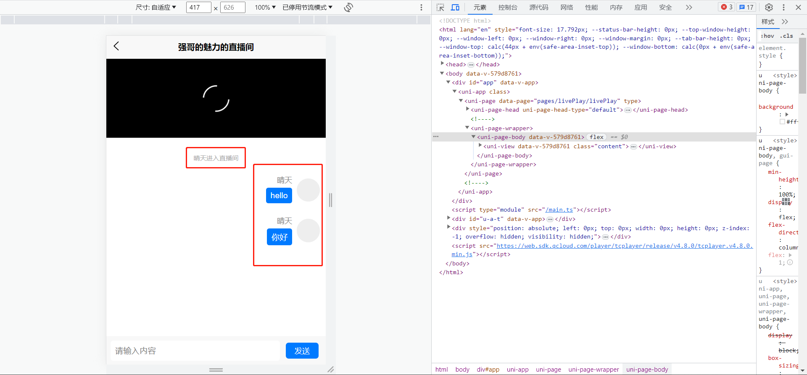

到此，一个单机版的直播间聊天室构建完成

页面会有一个定时检索发送消息内容，即使用户不发送任何信息，也会调用发送消息方法。所以我们需要再发送消息方法上添加一个判断

```java
/**
 * 封装发送消息方法.
 * @param socketMsg
 */
public static void sendMsg(SocketMsg socketMsg){
    //  判断当前是否发送消息。
    if (StringUtils.isEmpty(socketMsg.getMsgContent())) return;
    //  获取到当前直播间的用户Id集合
    List<Long> userIdList = liveRoomIdToUserListMap.get(socketMsg.getLiveRoomId());
    //  判断集合
    if (!CollectionUtils.isEmpty(userIdList)){
        //  循环遍历这个集合
        for (Long userId : userIdList) {
            //  执行一个异步发送消息功能.
            Session session = getSession(userId);
            if (null != session){
                //  异步发送消息方法。
                session.getAsyncRemote().sendText(JSON.toJSONString(socketMsg, SerializerFeature.DisableCircularReferenceDetect));
            }
        }
    }
}
```

## 3.4 直播间即时通讯优化

### 3.4.1 优化方案

#### 当前问题

当前有一个问题，一个service-live微服务是没有问题，但是部署多个service-live微服务那就有问题了，同一个直播的用户可能连接到不同的service-live微服务，并且websocket的会话session只能序列化到本地内存，不能序列化到redis中，如图

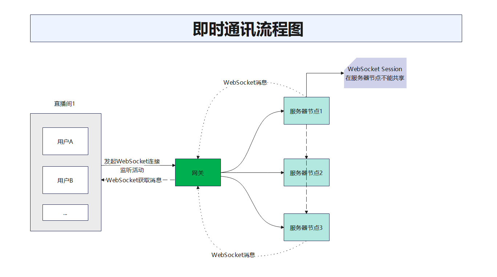

直播间1的用户A、用户B、用户C可能连接到不同的服务器节点，怎么解决？

#### 解决方案

解决方案：redis广播

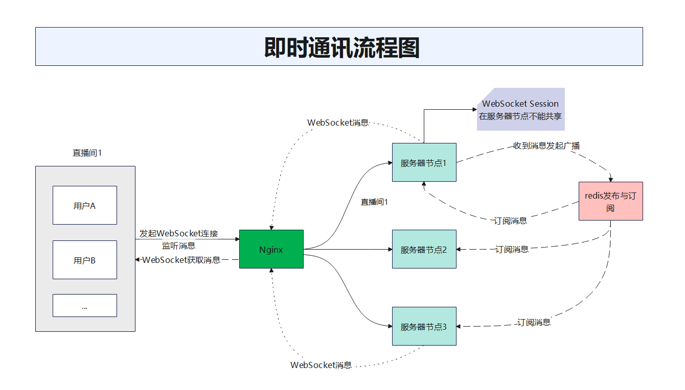

### 3.4.2 集成redis广播

#### redis广播通知配置类

```java
package com.atguigu.tingshu.message;

import org.springframework.context.annotation.Bean;
import org.springframework.context.annotation.Configuration;
import org.springframework.data.redis.connection.RedisConnectionFactory;
import org.springframework.data.redis.listener.PatternTopic;
import org.springframework.data.redis.listener.RedisMessageListenerContainer;
import org.springframework.data.redis.listener.adapter.MessageListenerAdapter;

/**
 * redis广播通知配置类：订阅发布
 */
@Configuration
public class RedisChannelConfig {

    /**
     * Redis消息监听器容器
     * 可以添加一个或多个监听不同主题的redis监听器，只需要把消息监听器和相应的消息订阅处理器绑定
     * 通过反射技术调用消息订阅处理器的相关方法进行业务处理
     *
     * @param connectionFactory
     * @param listenerAdapter
     * @return
     */
    @Bean
    public RedisMessageListenerContainer container(RedisConnectionFactory connectionFactory,
                                                   MessageListenerAdapter listenerAdapter) {
        RedisMessageListenerContainer container = new RedisMessageListenerContainer();
        container.setConnectionFactory(connectionFactory);
        //订阅主题， 这个container 可以添加多个 messageListener
        container.addMessageListener(listenerAdapter, new PatternTopic("message:list"));
        return container;
    }

    /**
     * 消息监听器适配器，绑定消息处理器，利用反射技术调用消息处理器的业务方法
     *
     * @param receiver
     * @return
     */
    @Bean
    public MessageListenerAdapter listenerAdapter(RedisMessageReceive receiver) {
        //这个地方 是给messageListenerAdapter 传入一个消息接受的处理器，利用反射的方法调用“receiveMessage”
        return new MessageListenerAdapter(receiver, "receiveMessage");
    }

}
```

#### redis广播消息处理类

```java
package com.atguigu.tingshu.message;

import com.alibaba.fastjson.JSON;
import com.atguigu.tingshu.live.util.WebSocketLocalContainerUtil;
import com.atguigu.tingshu.model.live.SocketMsg;
import org.springframework.beans.factory.annotation.Autowired;
import org.springframework.data.redis.core.RedisTemplate;
import org.springframework.stereotype.Component;
import org.springframework.util.StringUtils;

/**
 * redis广播消息处理类
 */
@Component
public class RedisMessageReceive {

    @Autowired
    private RedisTemplate redisTemplate;

    /**
     * 接收redis广播消息的方法
     */
    public void receiveMessage(String message) {
        System.out.println("----------收到消息了message：" + message);
        Object msg = redisTemplate.getValueSerializer().deserialize(message.getBytes());
        System.out.println("----------收到消息了message1：" + msg);
        if (!StringUtils.isEmpty(message)) {
            //从客户端传过来的数据是json数据，所以这里使用JSON进行转换为SocketMsg对象，
            SocketMsg socketMsg = JSON.parseObject(msg.toString(), SocketMsg.class);
            //忽略心跳消息
            if (!SocketMsg.MsgTypeEnum.HEART_BEAT.getCode().equals(socketMsg.getMsgType())) {
                WebSocketLocalContainerUtil.sendMsg(socketMsg);
            }
        }
    }
}
```

#### 改造消息方法

改造WebSocketApiController类onMessage方法

```java
@OnMessage
public void onMessage(String message, Session session) {
  log.info("来自客户端的消息：{}", message);
  //        SocketMsg socketMsg = JSON.parseObject(message, SocketMsg.class);
  //        WebSocketLocalContainerUtil.sendMsg(socketMsg);
  //redis广播
  redisTemplate.convertAndSend("message:list", message);
}
```

到处，直播间即时通讯大功告成

说明：除websocket 会话session消息，容器中的其他信息我们也可以保存到redis中，自行优化调整