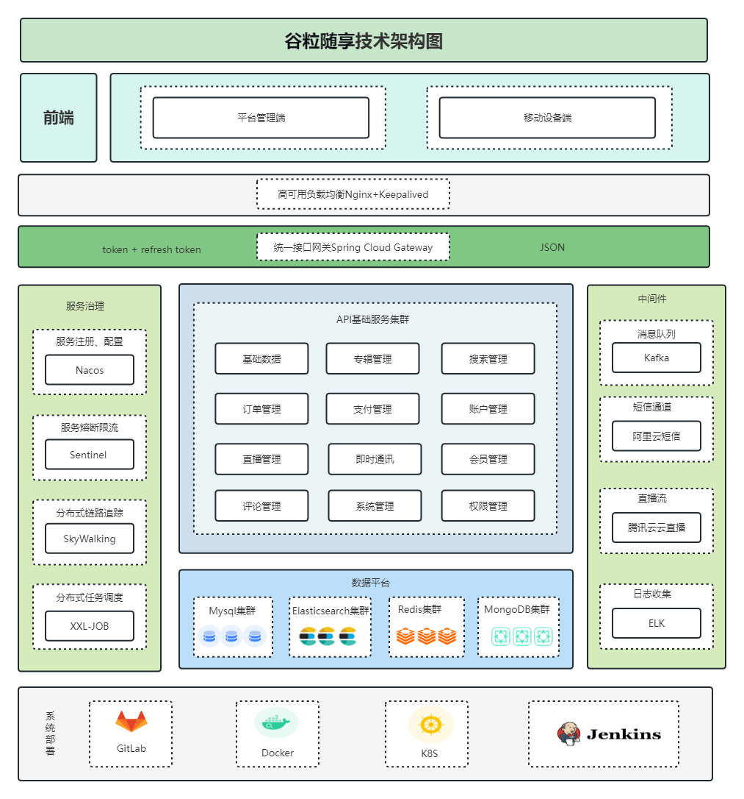
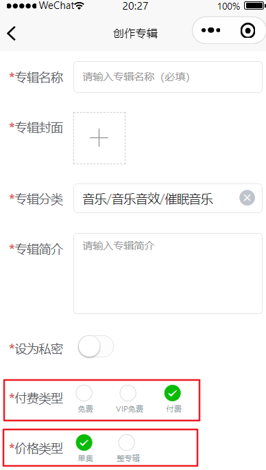
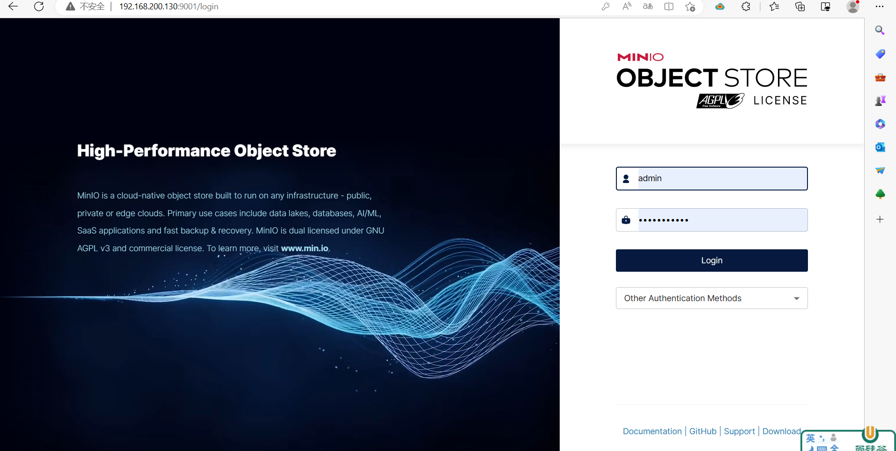
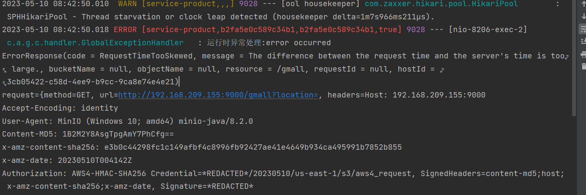
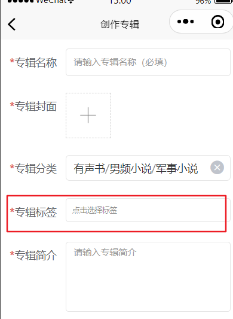

# 				谷粒随享

## 项目背景

随着智能手机和高速互联网的普及，人们开始寻求更便捷的方式来获取信息和娱乐。有声书的出现使得人们可以在旅途中、跑步时、做家务时等各种场景下，以更加灵活的方式享受阅读。

在过去，有声书主要是由**专业的演员朗读**，制作成录音带或CD。但随着数字化媒体的发展，听书软件应运而生，为用户提供了更多选择，包括自助出版的有声书和多样化的内容。

意义：

1. 便捷性：听书软件使得阅读不再局限于纸质书籍，用户可以通过手机等设备在任何时间、任何地点收听有声书，节省了携带实体书的麻烦。
2. 多样化内容：听书软件提供了广泛的有声书选择，涵盖了各种类型的图书、小说、杂志、教育内容等。这样的多样性使得用户能够根据个人兴趣和需求选择内容。
3. 阅读体验：通过专业的朗读演员和音效制作，听书软件可以提供更加生动、有趣的阅读体验，有助于吸引更多读者，尤其是那些不太喜欢阅读纸质书籍的人。
4. 辅助功能：听书软件通常还具备一些辅助功能，如调整朗读速度、书签功能、字幕显示等，有助于提高可访问性，使得视力受损或其他障碍的用户也能轻松阅读。
5. 支持作家和内容创作者：听书软件为作家和内容创作者提供了另一种传播作品的渠道，有助于扩大影响力和读者群。
6. 学习工具：听书软件也可以用作学习工具，提供学术教材、外语学习材料等，帮助用户在学习过程中更好地理解和吸收知识。

总的来说，听书软件的开发推动了阅读体验的数字化和个性化，为用户提供了更加便捷、多样化的阅读方式，也促进了作家和内容创作者的创作和传播。

## 项目技术栈

- **SpringBoot**：简化Spring应用的初始搭建以及开发过程
- **SpringCloud**：基于Spring Boot实现的云原生应用开发工具，SpringCloud使用的技术：（Spring Cloud Gateway、Spring Cloud Task和Spring Cloud Feign等）
- **SpringBoot+SpringCloudAlibaba(Nacos，Sentinel)+Cloud OpenFeign**
- MyBatis-Plus：持久层框架，也依赖mybatis
- Redis：内存做缓存
- Redisson：基于redis的Java驻内存数据网格 - 框架；操作redis的框架
- MongoDB: 分布式文件存储的数据库
- Kafka：消息中间件；大型分布式项目是标配；分布式事务最终一致性
- ElasticSearch+Kibana+Logstash/Filebeat 全文检索服务器+可视化数据监控：检索
- ThreadPoolExecutor+CompletableFuture：线程池来实现异步操作，提高效率
- xxl-Job: 分布式定时任务调用中心
- Knife4J/YAPI：Api接口文档工具
- MinIO（私有化对象存储集群）：分布式文件存储 类似于OSS（公有）
- 微信支付：
- MySQL：关系型数据库 {shardingSphere-jdbc 进行读写分离; 分库，分表}
- Lombok: 实体类的中get/set 生成的jar包
- natapp：内网穿透
- Docker：容器化技术;  生产环境Redis（运维人员）；快速搭建环境Docker run
- Git：代码管理工具；git使用，拉代码、提交、推送、合并、冲突解决

前端技术栈

- UniApp

- Vue3全家桶

- TypeScript

- Grace-UI

- Uni-UI

- uniapp-axios-adapter

  

## 项目架构图




## 项目环境搭建

1. 参考听书软件环境安装.md  

2. 导入听书初始化项目 资料中的tingshu-parent项目导入idea开发工具中即可！


## 专辑管理添加

功能入口：运行app项目-->我的-->创作中心点击 + 添加专辑



主要功能如下：

1. 先获取到专辑分类
2. 文件上传
3. 保存专辑


### 查看分类数据

设计到的视图: base_category_view ，在这张视图中存储了所有的分类数据。

展示分类数据的格式如下：

```json
[
 {
    "categoryName":"图书、音像、电子书刊",   #一级分类名称
    "categoryId":1,                       #一级分类ID
    "categoryChild":[                     #当前一级分类包含的二级分类集合
        {
            "categoryName":"电子书刊",     #二级分类名称
            "categoryId":1,               #二级分类ID
            "categoryChild":[             #当前二级分类包含的三级分类集合
                {
                    "categoryName":"电子书",#三级分类名称
                    "categoryId":1         #三级分类ID
                },
                {
                    "categoryName":"网络原创",
                    "categoryId":2
                }
            ]
        }
    ]
},
{
    "categoryName":"手机",
    "categoryId":2,
    "categoryChild":[
        {
            "categoryName":"手机通讯",
            "categoryId":13,
            "categoryChild":[
                {
                    "categoryName":"手机",
                    "categoryId":61
                }
            ]
        },
        {
            "categoryName":"运营商",
            "categoryId":14
        },
        {
            "categoryName":"手机配件",
            "categoryId":15
        }
    ]
 }
]
```


BaseCategoryApiController 控制器编写

```java
package com.atguigu.tingshu.album.controller;

import com.alibaba.fastjson.JSONObject;
import com.atguigu.tingshu.album.service.BaseCategoryService;
import com.atguigu.tingshu.common.result.Result;
import io.swagger.v3.oas.annotations.Operation;
import io.swagger.v3.oas.annotations.tags.Tag;
import org.springframework.beans.factory.annotation.Autowired;
import org.springframework.web.bind.annotation.GetMapping;
import org.springframework.web.bind.annotation.RequestMapping;
import org.springframework.web.bind.annotation.RestController;

import java.util.List;


@Tag(name = "分类管理")
@RestController
@RequestMapping(value="/admin/album/category")
@SuppressWarnings({"unchecked", "rawtypes"})
public class BaseCategoryApiController {
	
	@Autowired
	private BaseCategoryService baseCategoryService;

	/**
	 * 查询所有分类数据
	 * @return
	 */
	@Operation(tags = "查询所有分类数据")
	@GetMapping("getBaseCategoryList")
	public Result getBaseCategoryList(){
		//	调用服务层的查询分类方法
		List<JSONObject> categoryList = this.baseCategoryService.getBaseCategoryList();
		//	将数据返回给页面使用
		return Result.ok(categoryList);
	}
}
```

接口与实现类

```java
package com.atguigu.tingshu.album.service;

import com.alibaba.fastjson.JSONObject;
import com.atguigu.tingshu.model.album.BaseCategory1;
import com.baomidou.mybatisplus.extension.service.IService;

import java.util.List;

public interface BaseCategoryService extends IService<BaseCategory1> {

    /**
     * 查询所有的分类数据
     * @return
     */
    List<JSONObject> getBaseCategoryList();

}
```

```java
package com.atguigu.tingshu.album.service.impl;

import com.alibaba.fastjson.JSONObject;
import com.atguigu.tingshu.album.mapper.BaseCategory1Mapper;
import com.atguigu.tingshu.album.mapper.BaseCategory2Mapper;
import com.atguigu.tingshu.album.mapper.BaseCategory3Mapper;
import com.atguigu.tingshu.album.mapper.BaseCategoryViewMapper;
import com.atguigu.tingshu.album.service.BaseCategoryService;
import com.atguigu.tingshu.model.album.BaseCategory1;
import com.atguigu.tingshu.model.album.BaseCategoryView;
import com.baomidou.mybatisplus.extension.service.impl.ServiceImpl;
import org.springframework.beans.factory.annotation.Autowired;
import org.springframework.stereotype.Service;

import java.util.ArrayList;
import java.util.List;
import java.util.Map;
import java.util.stream.Collectors;

@Service
@SuppressWarnings({"unchecked", "rawtypes"})
public class BaseCategoryServiceImpl extends ServiceImpl<BaseCategory1Mapper, BaseCategory1> implements BaseCategoryService {

	@Autowired
	private BaseCategory1Mapper baseCategory1Mapper;

	@Autowired
	private BaseCategory2Mapper baseCategory2Mapper;

	@Autowired
	private BaseCategory3Mapper baseCategory3Mapper;

	@Autowired
	private BaseCategoryViewMapper baseCategoryViewMapper;


	@Override
	public List<JSONObject> getBaseCategoryList() {
		//	创建集合对象
		List<JSONObject> list = new ArrayList<>();
		//	查看所有分类数据
		List<BaseCategoryView> baseCategoryViewList = baseCategoryViewMapper.selectList(null);
		//	按照一级分类Id 进行分组 key:一级分类Id， value:一级分类Id 对应的集合数据
		Map<Long, List<BaseCategoryView>> map = baseCategoryViewList.stream().collect(Collectors.groupingBy(BaseCategoryView::getCategory1Id));
		//	循环遍历数据
		for (Map.Entry<Long, List<BaseCategoryView>> entry : map.entrySet()) {
			//	获取到一级分类Id
			Long category1Id = entry.getKey();
			//	获取到一级分类Id 对应的集合数据
			List<BaseCategoryView> category1ViewList = entry.getValue();
			// 声明一级分类对象
			JSONObject category1 = new JSONObject();
			category1.put("categoryId", category1Id);
			category1.put("categoryName", category1ViewList.get(0).getCategory1Name());

			//	按照二级分类Id 进行分组
			Map<Long, List<BaseCategoryView>> map2 = category1ViewList.stream().collect(Collectors.groupingBy(BaseCategoryView::getCategory2Id));
			// 声明二级分类对象集合
			List<JSONObject> category2Child = new ArrayList<>();
			//	循环遍历
			for (Map.Entry<Long, List<BaseCategoryView>> entry2 : map2.entrySet()) {
				//	获取到二级分类Id
				Long category2Id = entry2.getKey();
				//	获取到二级分类Id 对应的集合数据
				List<BaseCategoryView> category2ViewList = entry2.getValue();
				//	创建二级分类对象
				JSONObject category2 = new JSONObject();
				category2.put("categoryId",category2Id);
				category2.put("categoryName",category2ViewList.get(0).getCategory2Name());

				// 循环三级分类数据
				List<JSONObject> category3Child = category2ViewList.stream().map(baseCategoryView -> {
					JSONObject category3 = new JSONObject();
					category3.put("categoryId", baseCategoryView.getCategory3Id());
					category3.put("categoryName", baseCategoryView.getCategory3Name());
					return category3;
				}).collect(Collectors.toList());
				// 将三级数据放入二级里面
				category2.put("categoryChild", category3Child);
                //	将二级分类对象添加到集合中
				category2Child.add(category2);
			}
             // 将三级数据放入二级里面
			category1.put("categoryChild", category2Child);
			//	将一级分类数据放入到集合中。
			list.add(category1);
		}
		return list;
	}
}
```

### 文件上传

MinIO介绍

MinIO 是一个基于 Apache License v3.0 开源协议的对象存储服务。它兼容亚马逊S3云存储服务接口，非常适合于存储大容量非结构化的数据，例如图片、视频、日志文件、备份数据和容器/虚拟机镜像等，而一个对象文件可以是任意大小，从几kb到最大5T不等。

MinIO 是一个非常轻量的服务,可以很简单的和其他应用的结合，类似 NodeJS, Redis 或者 MySQL。

[https://docs.min.io/](https://docs.min.io/ "https://docs.min.io/") 英文

特点

· 高性能：作为高性能对象存储，在标准硬件条件下它能达到55GB/s的读、35GB/s的写速率

· 可扩容：不同MinIO集群可以组成联邦，并形成一个全局的命名空间，并跨越多个数据中心

· 云原生：容器化、基于K8S的编排、多租户支持

· Amazon S3兼容：Minio使用Amazon S3 v2 / v4 API。可以使用Minio SDK，Minio Client，AWS SDK和AWS CLI访问Minio服务器。

· 可对接后端存储: 除了Minio自己的文件系统，还支持DAS、 JBODs、NAS、Google云存储和Azure Blob存储。

· SDK支持: 基于Minio轻量的特点，它得到类似Java、Python或Go等语言 的sdk支持

· Lambda计算: Minio服务器通过其兼容AWS SNS / SQS的事件通知服务触发Lambda功能。支持的目标是消息队列，如Kafka，NATS，AMQP，MQTT，Webhooks以及Elasticsearch，Redis，Postgres和MySQL等数据库。

· 有操作页面

· 功能简单: 这一设计原则让MinIO不容易出错、更快启动

· 支持纠删码：MinIO使用纠删码、Checksum来防止硬件错误和静默数据污染。在最高冗余度配置下，即使丢失N/2的磁盘也能恢复数据！

存储机制

Minio使用纠删码erasure code和校验和checksum。 即便丢失一半数量（N/2）的硬盘，仍然可以恢复数据。纠删码是一种恢复丢失和损坏数据的**数学算法**。

docker安装MinIO(已完成)

> docker pull minio/minio

> docker run \\
> \-p 9000:9000 \
> \-p 9001:9001 \\
> \--name minio \\
> \-d --restart=always \\
> \-e "MINIO\_ROOT\_USER=admin" \\
> \-e "MINIO\_ROOT\_PASSWORD=admin123456" \\
> \-v /home/data:/data \\
> \-v /home/config:/root/.minio \\
> minio/minio server /data --console-address ":9001"

浏览器访问：[http://IP:9001/minio/login，如图：](http://IP:9001/minio/login，如图： "http://IP:9001/minio/login，如图：")



登录账户说明：安装时指定了**登录账号**：admin/admin123456

**注意**：文件上传时，需要调整一下linux 服务器的时间与windows 时间一致！



> 第一步：安装ntp服务
> yum -y install ntp
> 第二步：开启开机启动服务
> systemctl enable ntpd
> 第三步：启动服务
> systemctl start ntpd
> 第四步：更改时区
> timedatectl set-timezone Asia/Shanghai
> 第五步：启用ntp同步
> timedatectl set-ntp yes
> 第六步：同步时间
> ntpq -p

控制器

```java
package com.atguigu.tingshu.album.api;

import com.atguigu.tingshu.album.config.MinioConstantProperties;
import com.atguigu.tingshu.common.result.Result;
import io.minio.*;
import io.swagger.v3.oas.annotations.tags.Tag;
import org.apache.commons.io.FilenameUtils;
import org.springframework.beans.factory.annotation.Autowired;
import org.springframework.web.bind.annotation.PostMapping;
import org.springframework.web.bind.annotation.RequestMapping;
import org.springframework.web.bind.annotation.RestController;
import org.springframework.web.multipart.MultipartFile;

import java.text.SimpleDateFormat;
import java.util.Date;
import java.util.UUID;

@Tag(name = "上传管理接口")
@RestController
@RequestMapping("api/album")
public class FileUploadApiController {

    @Autowired
    private MinioConstantProperties minioConstantProperties;

    /**
     * 文件上传
     * @param file
     * @return
     * @throws Exception
     */
    @PostMapping("fileUpload")
    public Result<String> fileUpload(MultipartFile file) throws Exception {
        //  声明一个url 地址
        String url = "";
        // Create a minioClient with the MinIO server playground, its access key and secret key.
        MinioClient minioClient = MinioClient.builder()
                .endpoint(minioConstantProperties.getEndpointUrl())
                .credentials(minioConstantProperties.getAccessKey(), minioConstantProperties.getSecreKey())
                .build();

        // 判断桶是否存在。
        boolean found =
                minioClient.bucketExists(BucketExistsArgs.builder().bucket(minioConstantProperties.getBucketName()).build());
        if (!found) {
            // 如果不存在，则创建
            minioClient.makeBucket(MakeBucketArgs.builder().bucket(minioConstantProperties.getBucketName()).build());
        } else {
            //  这个桶已经存在.
            System.out.println("Bucket "+ minioConstantProperties.getBucketName() + " already exists.");
        }

        //  生成文件名。
        String fileName =  UUID.randomUUID().toString().replaceAll("-","")+"."+ FilenameUtils.getExtension(file.getOriginalFilename());
        //  调用上传方法.
        minioClient.putObject(
 PutObjectArgs.builder().bucket(minioConstantProperties.getBucketName()).object(fileName).stream(
                                file.getInputStream(), file.getSize(), -1)
                        .contentType(file.getContentType())
                        .build());
        //  拼接url
  url=minioConstantProperties.getEndpointUrl()+"/"+minioConstantProperties.getBucketName()+"/"+fileName;
        System.out.println(url);
        //  返回图片地址
        return Result.ok(url);
    }

}
```

文件上传方法抽取：

FileUploadApiController 控制器

```java
@Operation(summary = "文件上传")
@PostMapping("/fileUpload")
public Result fileUpload(MultipartFile file) {
    //  文件上传
    String url = fileUploadService.upload(file);
    //  返回数据
    return Result.ok(url);
}
```

接口

```java
package com.atguigu.tingshu.album.service;

import org.springframework.web.multipart.MultipartFile;

/**
 * @author atguigu-mqx
 * @ClassName FileUploadService
 * @description: TODO
 * @date 2023年09月13日
 * @version: 1.0
 */
public interface FileUploadService {
    /**
     * 文件上传
     * @param file
     * @return
     */
    String upload(MultipartFile file);
}
```

实现类

```java
package com.atguigu.tingshu.album.service.impl;

import com.atguigu.tingshu.album.config.MinioConstantProperties;
import com.atguigu.tingshu.album.service.FileUploadService;
import io.minio.BucketExistsArgs;
import io.minio.MakeBucketArgs;
import io.minio.MinioClient;
import io.minio.PutObjectArgs;
import io.minio.errors.MinioException;
import org.apache.commons.io.FilenameUtils;
import org.springframework.beans.factory.annotation.Autowired;
import org.springframework.stereotype.Service;
import org.springframework.web.multipart.MultipartFile;

import java.io.IOException;
import java.security.InvalidKeyException;
import java.security.NoSuchAlgorithmException;
import java.util.UUID;

/**
 * @author atguigu-mqx
 * @ClassName FileUploadServiceImpl
 * @description: TODO
 * @date 2023年09月13日
 * @version: 1.0
 */
@Service
public class FileUploadServiceImpl implements FileUploadService {

    @Autowired
    private MinioConstantProperties minioConstantProperties;

    @Override
    public String upload(MultipartFile file) {
        //  声明一个url 地址
        String url = "";
        //  代码：
        try {
            // Create a minioClient with the MinIO server playground, its access key and secret key.
            //  ctrl+p
            MinioClient minioClient =
                    MinioClient.builder()
                            .endpoint(minioConstantProperties.getEndpointUrl())
                            .credentials(minioConstantProperties.getAccessKey(), minioConstantProperties.getSecreKey())
                            .build();

            // Make 'asiatrip' bucket if not exist.
            boolean found =
                    false;
            found = minioClient.bucketExists(BucketExistsArgs.builder().bucket(minioConstantProperties.getBucketName()).build());
            if (!found) {
                // Make a new bucket called 'asiatrip'.
                minioClient.makeBucket(MakeBucketArgs.builder().bucket(minioConstantProperties.getBucketName()).build());
            } else {
                System.out.println("Bucket " + minioConstantProperties.getBucketName() + " already exists.");
            }

            //  文件：
            //  new File().length();  数组长度:length  集合长度:size()  字符串长度: length();  ()--> 方法 没有(); 属性
            String fileName = UUID.randomUUID().toString().replaceAll("-", "") + "." + FilenameUtils.getExtension(file.getOriginalFilename());
            // Upload known sized input stream.
            minioClient.putObject(
                    PutObjectArgs.builder().bucket(minioConstantProperties.getBucketName()).object(fileName).stream(
                                    file.getInputStream(), file.getSize(), -1)
                            .contentType(file.getContentType())
                            .build());
            //  获取到上传之后的文件路径：
            //  https://www.image.com/ts/1213oiqwe.jpg;
            //  http://192.168.200.130:9000/tingshu/atguigu.jpg
            url = minioConstantProperties.getEndpointUrl()+"/"+minioConstantProperties.getBucketName()+"/"+fileName;
            System.out.println("url:\t"+url);
        } catch (MinioException e) {
            System.out.println("Error occurred: " + e);
            System.out.println("HTTP trace: " + e.httpTrace());
        } catch (IOException e) {
            throw new RuntimeException(e);
        } catch (NoSuchAlgorithmException e) {
            throw new RuntimeException(e);
        } catch (InvalidKeyException e) {
            throw new RuntimeException(e);
        }
        return url;
    }
}
```

配置类 MinioConstantProperties 完善，添加@RefreshScope 注解能够动态读取nacos的配置数据

```java
package com.atguigu.tingshu.album.config;

import lombok.Data;
import org.springframework.boot.context.properties.ConfigurationProperties;
import org.springframework.cloud.context.config.annotation.RefreshScope;
import org.springframework.context.annotation.Configuration;

@Configuration
@ConfigurationProperties(prefix="minio") //读取节点
@RefreshScope
@Data
public class MinioConstantProperties {
    //  服务器的地址
    private String endpointUrl;
    //  服务器的用户名
    private String accessKey;
    //  服务器的密码
    private String secreKey;
    //  服务桶名
    private String bucketName;
}
```

### 保存专辑

设为私密：表示不发布的意思，后续可以通过这个按钮选项实现专辑的上架-下架操作

#### 根据一级分类Id获取专辑标签中的属性与属性值：



此功能涉及的相关表如下：

base_attribute; 属性表

```sql
Data Source: @192.168.200.130 Schema: tingshu_album Table: base_attribute  -- 属性表 
-- auto-generated definition
create table base_attribute
(
    id             bigint auto_increment comment 'ID'
        primary key,
    category1_id   bigint       default 0                 not null comment '1级分类id',
    attribute_name varchar(200) default ''                not null comment '属性显示名称',
    create_time    timestamp    default CURRENT_TIMESTAMP not null comment '创建时间',
    update_time    timestamp    default CURRENT_TIMESTAMP not null on update CURRENT_TIMESTAMP,
    is_deleted     tinyint      default 0                 not null
)
    comment '属性表';
```

base_attribute_value; 属性值表

```sql
-- 属性值表 
-- auto-generated definition
create table base_attribute_value
(
    id           bigint auto_increment comment 'ID'
        primary key,
    attribute_id bigint       default 0                 not null comment '属性id',
    value_name   varchar(100) default ''                not null comment '属性值名称',
    create_time  timestamp    default CURRENT_TIMESTAMP not null comment '创建时间',
    update_time  timestamp    default CURRENT_TIMESTAMP not null on update CURRENT_TIMESTAMP,
    is_deleted   tinyint      default 0                 not null
)
    comment '属性值表';
```


在BaseCategoryApiController 控制器中添加代码

http://127.0.0.1/api/album/category/findAttribute/2

```java
@Operation(summary = "根据一级分类Id 查询分类属性数据")
@GetMapping("findAttribute/{category1Id}")
public Result<List<BaseAttribute>> findAttribute(@PathVariable Long category1Id) {
  // 调用服务层方法
  return Result.ok(baseCategoryService.findAttributeByCategory1Id(category1Id));
}
```

```java
/**
* 根据三级id获取分类属性
* @param category1Id
* @return
*/
List<BaseAttribute> findAttributeByCategory1Id(Long category1Id);

@Override
public List<BaseAttribute> findAttributeByCategory1Id(Long category1Id) {
  	//	调用mapper层方法
	return baseAttributeMapper.selectBaseAttributeList(category1Id);
}
```

在BaseAttributeMapper中添加方法

```java
/**
* 根据一级分类Id查询属性数据
* @param category1Id
* @return
*/
List<BaseAttribute> selectBaseAttributeList(@Param("category1Id")Long category1Id);
```

在resource 目录下创建mapper文件夹并添加配置文件BaseAttributeMapper.xml

```xml
<?xml version="1.0" encoding="UTF-8" ?>
<!DOCTYPE mapper
PUBLIC "-//mybatis.org//DTD Mapper 3.0//EN"
"http://mybatis.org/dtd/mybatis-3-mapper.dtd">

<mapper namespace="com.atguigu.tingshu.album.mapper.BaseAttributeMapper">
	<resultMap id="baseAttributeMap" type="com.atguigu.tingshu.model.album.BaseAttribute" autoMapping="true">
		<!--id:表示主键 property：表示实体类的属性名 column：表示通过sql 执行以后查询出来的字段名-->
		<id property="id" column="id"></id>
		<!--result : 表示映射普通字段-->
		<!--<result property="" column=""></result>-->
		<!--mybatis 如何配置一对多-->
		<!--ofType : 返回的数据类型-->
		<collection property="attributeValueList" ofType="com.atguigu.tingshu.model.album.BaseAttributeValue" autoMapping="true">
			<!--如果有字段重复则起别名-->
			<id property="id" column="attribute_value_id"></id>
		</collection>
	</resultMap>

	<!--id:表示方法名-->
	<select id="selectBaseAttributeList" resultMap="baseAttributeMap">
		select
		ba.id,
		ba.attribute_name,
		ba.category1_id,
		bav.id attribute_value_id,
		bav.value_name,
		bav.attribute_id
		from
		base_attribute ba
		inner join base_attribute_value bav on ba.id = bav.attribute_id
		where ba.category1_id = #{category1Id}
		order by ba.id
	</select>
</mapper>
```


#### 保存专辑

设计的表结构：

album_info 专辑表  

​	a. 初始化userId 默认值1 为了后续能查到数据

​	b. 并设置初始化状态为审核通过

​	c. 如果**不是费的专辑**则设置前五集为免费试看

album_attribute_value 专辑属性值表

​	a. 设置专辑Id

album_stat 专辑统计表

​	a. 初始化统计项 【播放量，订阅量，购买量，评论数】为0

我们将前端传递的参数统一封装到实体类AlbumInfoVo 中

参数校验：

@Validation是一套帮助我们继续对传输的参数进行数据校验的注解，通过配置Validation可以很轻松的完成对数据的约束。

前端传递的是Json 字符串，我们在项目中通过AlbumInfoVo 实体类来接收数据！

```java
package com.atguigu.tingshu.vo.album;

import com.atguigu.tingshu.common.util.Decimal2Serializer;
import com.atguigu.tingshu.validation.NotEmptyPaid;
import com.fasterxml.jackson.databind.annotation.JsonSerialize;
import io.swagger.v3.oas.annotations.media.Schema;
import jakarta.validation.constraints.NotEmpty;
import jakarta.validation.constraints.Positive;
import lombok.Data;
import org.hibernate.validator.constraints.Length;

import java.math.BigDecimal;
import java.util.List;

@Data
@Schema(description = "专辑信息")
public class AlbumInfoVo {

   @NotEmpty(message = "专辑标题不能为空")
   @Length(min = 2, message = "专辑标题的长度必须大于2")
   @Schema(description = "标题", required=true)
   private String albumTitle;

   @Positive(message = "三级分类不能为空")
   @Schema(description = "三级分类id", required=true)
   private Long category3Id;

   @NotEmpty(message = "专辑简介不能为空")
   @Schema(description = "专辑简介", required=true)
   private String albumIntro;

   @NotEmpty(message = "专辑封面不能为空")
   @Schema(description = "专辑封面图", required=true)
   private String coverUrl;

   @Schema(description = "预计更新多少集")
   private Integer estimatedTrackCount;

   @Schema(description = "专辑简介，富文本")
   private String albumRichIntro;

   @NotEmpty(message = "付费类型不能为空")
   @Schema(description = "付费类型: 0101-免费、0102-vip免费、0103-付费", required=true)
   private String payType;

   @Schema(description = "价格类型： 0201-单集 0202-整专辑")
   private String priceType;

   @Schema(description = "原价")
   @JsonSerialize(using = Decimal2Serializer.class)
   private BigDecimal price;

   @Schema(description = "0.1-9.9  不打折 -1")
   @JsonSerialize(using = Decimal2Serializer.class)
   private BigDecimal discount = new BigDecimal(-1);

   @Schema(description = "0.1-9.9 不打折 -1")
   @JsonSerialize(using = Decimal2Serializer.class)
   private BigDecimal vipDiscount = new BigDecimal(-1);

   @Schema(description = "免费试听集数")
   private Integer tracksForFree;

   @Schema(description = "每集免费试听秒数")
   private Integer secondsForFree;

   @Schema(description = "购买须知，富文本")
   private String buyNotes;

   @Schema(description = "专辑卖点，富文本")
   private String sellingPoint;

   @Schema(description = "是否公开：0-否 1-是")
   private String isOpen;

   //递归校验
   //@Valid
   //@NotEmpty(message = "属性值集合不能为空")
   @Schema(description = "属性值集合")
   private List<AlbumAttributeValueVo> albumAttributeValueVoList;

   @NotEmptyPaid(message = "价格类型不能为空")
   public String getPayTypeAndPriceType() {
      return this.getPayType() + "_" + this.getPriceType();
   }

   @NotEmptyPaid(message = "价格不能为空")
   public String getPayTypeAndPrice() {
      return this.getPayType() + "_" + this.getPrice();
   }
}
```

AlbumInfoApiController  控制器

```java
/**
  * 新增专辑方法
  * @param albumInfoVo
  * @return
  */
@Operation(summary = "新增专辑")
@PostMapping("saveAlbumInfo")
public Result save(@RequestBody @Validated AlbumInfoVo albumInfoVo) {
  //	调用服务层保存方法
  albumInfoService.saveAlbumInfo(albumInfoVo, AuthContextHolder.getUserId());
  return Result.ok();
}
```

接口

```java
public interface AlbumInfoService extends IService<AlbumInfo> {
    /**
     * 保存专辑
     * @param albumInfoVo
     * @param userId
     */
    void saveAlbumInfo(AlbumInfoVo albumInfoVo, Long userId);
}
```

实现类

```java
package com.atguigu.tingshu.album.service.impl;

import com.atguigu.tingshu.album.mapper.AlbumAttributeValueMapper;
import com.atguigu.tingshu.album.mapper.AlbumInfoMapper;
import com.atguigu.tingshu.album.mapper.AlbumStatMapper;
import com.atguigu.tingshu.album.service.AlbumInfoService;
import com.atguigu.tingshu.common.constant.KafkaConstant;
import com.atguigu.tingshu.common.constant.SystemConstant;
import com.atguigu.tingshu.model.album.AlbumAttributeValue;
import com.atguigu.tingshu.model.album.AlbumInfo;
import com.atguigu.tingshu.model.album.AlbumStat;
import com.atguigu.tingshu.vo.album.AlbumAttributeValueVo;
import com.atguigu.tingshu.vo.album.AlbumInfoVo;
import com.baomidou.mybatisplus.extension.service.impl.ServiceImpl;
import lombok.extern.slf4j.Slf4j;
import org.springframework.beans.BeanUtils;
import org.springframework.beans.factory.annotation.Autowired;
import org.springframework.stereotype.Service;
import org.springframework.transaction.annotation.Transactional;
import org.springframework.util.CollectionUtils;

import java.util.List;

@Slf4j
@Service
@SuppressWarnings({"unchecked", "rawtypes"})
public class AlbumInfoServiceImpl extends ServiceImpl<AlbumInfoMapper, AlbumInfo> implements AlbumInfoService {

	@Autowired
	private AlbumInfoMapper albumInfoMapper;

	@Autowired
	private AlbumAttributeValueMapper albumAttributeValueMapper;

	@Autowired
	private AlbumStatMapper albumStatMapper;

	/**
	 * 保存专辑方法
	 * @param albumInfoVo
	 * @param userId -- 可以暂时写个固定值
	 * @return
	 */
	@Override
	@Transactional(rollbackFor = Exception.class)
	public void saveAlbumInfo(AlbumInfoVo albumInfoVo, Long userId) {
		//	创建专辑对象
		AlbumInfo albumInfo = new AlbumInfo();
		//	属性拷贝
		BeanUtils.copyProperties(albumInfoVo,albumInfo);
		//	设置专辑审核状态为：通过
		albumInfo.setStatus(SystemConstant.ALBUM_STATUS_PASS);
		//	设置用户Id
		albumInfo.setUserId(userId);
        //  付费的默认前前5集免费试看
		if(!SystemConstant.ALBUM_PAY_TYPE_FREE.equals(albumInfo.getPayType())) {
			albumInfo.setTracksForFree(5);
		}
		//	保存专辑
		this.save(albumInfo);

		//	保存专辑属性值：
		List<AlbumAttributeValueVo> albumAttributeValueVoList = albumInfoVo.getAlbumAttributeValueVoList();
		//	判断
		if (!CollectionUtils.isEmpty(albumAttributeValueVoList)){
			//	循环遍历设置字段值
			albumAttributeValueVoList.stream().forEach(albumAttributeValueVo -> {
				AlbumAttributeValue albumAttributeValue = new AlbumAttributeValue();
				BeanUtils.copyProperties(albumAttributeValueVo, albumAttributeValue);
				albumAttributeValue.setAlbumId(albumInfo.getId());
				//	保存数据
				albumAttributeValueMapper.insert(albumAttributeValue);
			});
		}

		//初始化统计数据
        //播放量
		this.saveAlbumStat(albumInfo.getId(), SystemConstant.ALBUM_STAT_PLAY);
		//订阅量
		this.saveAlbumStat(albumInfo.getId(), SystemConstant.ALBUM_STAT_SUBSCRIBE);
		//购买量
		this.saveAlbumStat(albumInfo.getId(), SystemConstant.ALBUM_STAT_BROWSE);
		//评论数
		this.saveAlbumStat(albumInfo.getId(), SystemConstant.ALBUM_STAT_COMMENT);

	}

	/**
	 * 初始化统计数据
	 * @param albumId
	 * @param statType
	 */
	private void saveAlbumStat(Long albumId, String statType) {
		AlbumStat albumStat = new AlbumStat();
		albumStat.setAlbumId(albumId);
		albumStat.setStatType(statType);
		albumStat.setStatNum(0);
		albumStatMapper.insert(albumStat);
	}
}
```

批量保存：

创建 AlbumAttributeValueService 接口

```java
package com.atguigu.tingshu.album.service;

import com.atguigu.tingshu.model.album.AlbumAttributeValue;
import com.baomidou.mybatisplus.extension.service.IService;

/**
 * @author atguigu-mqx
 * @ClassName AlbumAttributeValueService
 * @description: TODO
 * @date 2023年09月13日
 * @version: 1.0
 */
public interface AlbumAttributeValueService extends IService<AlbumAttributeValue> {
}
```

创建 AlbumAttributeValueServiceImpl 实现类

```java
package com.atguigu.tingshu.album.service.impl;

import com.atguigu.tingshu.album.mapper.AlbumAttributeValueMapper;
import com.atguigu.tingshu.album.service.AlbumAttributeValueService;
import com.atguigu.tingshu.model.album.AlbumAttributeValue;
import com.baomidou.mybatisplus.extension.service.impl.ServiceImpl;
import org.springframework.stereotype.Service;

/**
 * @author atguigu-mqx
 * @ClassName AlbumAttributeValueServiceImpl
 * @description: TODO
 * @date 2023年09月13日
 * @version: 1.0
 */
@Service
public class AlbumAttributeValueServiceImpl extends ServiceImpl<AlbumAttributeValueMapper, AlbumAttributeValue> implements AlbumAttributeValueService {
}
```

改造 AlbumInfoServiceImpl 实现类代码

```java
@Autowired
private AlbumAttributeValueService albumAttributeValueService;

List<AlbumAttributeValueVo> albumAttributeValueVoList = albumInfoVo.getAlbumAttributeValueVoList();
if (!CollectionUtils.isEmpty(albumAttributeValueVoList)){
   // 循环遍历
   List<AlbumAttributeValue> attributeValueList = albumAttributeValueVoList.stream().map(albumAttributeValueVo -> {
      // 创建一个实体对象
      AlbumAttributeValue albumAttributeValue = new AlbumAttributeValue();
      BeanUtils.copyProperties(albumAttributeValueVo, albumAttributeValue);
      albumAttributeValue.setAlbumId(albumInfo.getId());
      return albumAttributeValue;
   }).collect(Collectors.toList());
   // 批量插入
   this.albumAttributeValueService.saveBatch(attributeValueList);
}
```

### 查看专辑列表

查询数据的时候，我们将页面渲染的数据封装到一个实体类中AlbumListVo，只需要返回这个类的集合即可！

查询时传递参数封装到AlbumInfoQuery 实体类中。


```java
/**
  * 根据条件查询专辑列表
  * @param page
  * @param limit
  * @param albumInfoQuery
  * @return
  */
@Operation(summary = "获取当前用户专辑分页列表")
@PostMapping("findUserAlbumPage/{page}/{limit}")
public Result findUserAlbumPage(@Parameter(name = "page",description = "当前页码",required = true)
                                @PathVariable Long page,
                                @Parameter(name = "limit", description = "每页记录数", required = true)
                                @PathVariable Long limit,
                                @Parameter(name = "albumInfoQuery", description = "查询对象", required = false)
                                @RequestBody AlbumInfoQuery albumInfoQuery
									){
		//	获取数据：
		albumInfoQuery.setUserId(AuthContextHolder.getUserId());
		Page<AlbumListVo> albumInfoPage = new Page<>(page,limit);
		//	调用服务层方法
		IPage<AlbumListVo> iPage = this.albumInfoService.findUserAlbumPage(albumInfoPage,albumInfoQuery);
		//	返回数据集
		return Result.ok(iPage);
	}
```

接口与实现类

```java
/**
  * 查询专辑列表
  * @param albumInfoPage
  * @param albumInfoQuery
  * @return
  */
IPage<AlbumListVo> findUserAlbumPage(Page<AlbumListVo> albumInfoPage, AlbumInfoQuery albumInfoQuery);

@Override
public IPage<AlbumListVo> findUserAlbumPage(Page<AlbumListVo> albumInfoPage, AlbumInfoQuery albumInfoQuery) {
  //	调用mapper 层方法
  return albumInfoMapper.selectUserAlbumPage(albumInfoPage,albumInfoQuery);
}
```

mapper 层

```java
@Mapper
public interface AlbumInfoMapper extends BaseMapper<AlbumInfo> {
    /**
     * 根据条件查询专辑列表
     * @param albumInfoPage
     * @param albumInfoQuery
     * @return
     */
    IPage<AlbumListVo> selectUserAlbumPage(Page<AlbumListVo> albumInfoPage, @Param("vo") AlbumInfoQuery albumInfoQuery);
}
```

AlbumInfoMapper.xml 实现

```xml
<?xml version="1.0" encoding="UTF-8" ?>
<!DOCTYPE mapper
PUBLIC "-//ibatis.apache.org//DTD Mapper 3.0//EN"
"http://ibatis.apache.org/dtd/ibatis-3-mapper.dtd">

<mapper namespace="com.atguigu.tingshu.album.mapper.AlbumInfoMapper">
    <select id="selectUserAlbumPage" resultType="com.atguigu.tingshu.vo.album.AlbumListVo">
        select
        info.albumId,
        info.albumTitle,
        info.coverUrl,
        info.includeTrackCount,
        info.status,
        info.createTime,
        MAX(IF(info.statType = '0401', info.statNum, 0)) as playStatNum,
        MAX(IF(info.statType = '0402', info.statNum, 0)) as subscribeStatNum,
        MAX(IF(info.statType = '0403', info.statNum, 0)) as buyStatNum,
        MAX(IF(info.statType = '0404', info.statNum, 0)) as commentStatNum
        from (
        select
        album.id as albumId,
        album.album_title as albumTitle,
        album.cover_url as coverUrl,
        album.include_track_count as includeTrackCount,
        album.status,
        album.create_time as createTime,
        stat.stat_type as statType,
        stat.stat_num as statNum
        from album_info album
        left join album_stat stat on stat.album_id = album.id
        <where>
            <if test="vo.userId != null">
                and album.user_id = #{vo.userId}
            </if>
            <if test="vo.albumTitle != null and vo.albumTitle != ''">
                and album.album_title like CONCAT('%',#{vo.albumTitle},'%')
            </if>
            <if test="vo.status != null and vo.status != ''">
                and album.status = #{vo.status}
            </if>
            and album.is_deleted = 0
        </where>
        ) info
        group by info.albumId
    </select>
</mapper>
```

### 根据Id获删除专辑

控制器

```java
/**
  * 根据专辑id删除专辑数据
  * @param id
  * @return
  */
@Operation(summary = "删除专辑信息")
@DeleteMapping("removeAlbumInfo/{id}")
public Result removeAlbumInfoById(@PathVariable Long id) {
  albumInfoService.removeAlbumInfoById(id);
  return Result.ok();
}
```

接口与实现类

```java
/**
  * 根据 id 删除专辑
  * @param id
  */
void removeAlbumInfoById(Long id);
```

```java
@Override
@Transactional(rollbackFor = Exception.class)
public void removeAlbumInfoById(Long id) {
  //	删除专辑表的数据 album_info
  this.removeById(id);
  //	删除专辑属性信息
  albumAttributeValueMapper.delete(new LambdaQueryWrapper<AlbumAttributeValue>().eq(AlbumAttributeValue::getAlbumId,id));
  //	删除专辑对应的统计数据
  albumStatMapper.delete(new LambdaQueryWrapper<AlbumStat>().eq(AlbumStat::getAlbumId,id));
}
```

### 修改专辑

#### 先回显数据

1. 需要根据专辑id获取到对应的回显数据，需要回显专辑albumInfo与属性数据albumAttrValue，不需要回显统计数据！
2. 根据修改内容保存最新数据

控制器

```java
/**
  * 根据id 获取到专辑信息
  * @param id
  * @return
  */
@Operation(summary = "获取专辑信息")
@GetMapping("getAlbumInfo/{id}")
public Result<AlbumInfo> getAlbumInfoById(@PathVariable Long id) {
  //	调用服务层方法
  AlbumInfo albumInfo = albumInfoService.getAlbumInfoById(id);
  return Result.ok(albumInfo);
}
```

接口

```java
/**
* 根据专辑Id 获取到专辑信息
* @param id
* @return
*/
AlbumInfo getAlbumInfoById(Long id);
```

实现类

```java
@Override
public AlbumInfo getAlbumInfoById(Long id) {
  //	根据id 查询专辑数据
  AlbumInfo albumInfo = this.getById(id);
  //	回显时，需要回显专辑数据信息数据
  if (albumInfo!=null){
    List<AlbumAttributeValue> albumAttributeValueList = albumAttributeValueMapper.selectList(new LambdaQueryWrapper<AlbumAttributeValue>().eq(AlbumAttributeValue::getAlbumId, id));
    albumInfo.setAlbumAttributeValueVoList(albumAttributeValueList);
  }
  return albumInfo;
}
```


#### 保存修改之后的数据

思路：

  1.专辑直接更新

 2.  更新专辑标签（属性）不能确定用户要修改哪一个！所以不能单纯的执行 update 语句. 所以采用先删除，再新增的方式！会有缺点{浪费主键号段}

     

涉及的表：
album_info	根据主键进行更新

album_attribute_value  先删除所有数据，再新增数据

不涉及的表：

album_stat 不需要修改状态信息,因为回显的时候根本就没有显示！统计状态信息跟播放量，购买量，评论数，订阅数有关系！

控制器

```java
/**
  * 修改专辑信息
  * @param id
  * @param albumInfoVo
  * @return
  */
@Operation(summary = "修改专辑")
@PutMapping("/updateAlbumInfo/{id}")
public Result updateById(@PathVariable Long id,@RequestBody @Validated AlbumInfoVo albumInfoVo){
  //	调用服务层方法
  albumInfoService.updateAlbumInfo(id,albumInfoVo);
  return Result.ok();
}
```

接口

```java
/**
* 修改专辑数据
* @param id
* @param albumInfoVo
*/
void updateAlbumInfo(Long id, AlbumInfoVo albumInfoVo);
```

实现类

```java
@Override
@Transactional(rollbackFor = Exception.class)
public void updateAlbumInfo(Long id, AlbumInfoVo albumInfoVo) {
  AlbumInfo albumInfo = this.getById(id);
  BeanUtils.copyProperties(albumInfoVo, albumInfo);
  //	根据id 修改数据
  this.updateById(albumInfo);

  //	先删除专辑属性数据
  albumAttributeValueMapper.delete(new LambdaQueryWrapper<AlbumAttributeValue>().eq(AlbumAttributeValue::getAlbumId,id));

  //	保存专辑属性数据
  List<AlbumAttributeValueVo> albumAttributeValueVoList = albumInfoVo.getAlbumAttributeValueVoList();
  if (!CollectionUtils.isEmpty(albumAttributeValueVoList)){
    albumAttributeValueVoList.forEach(albumAttributeValueVo -> {
      //	创建专辑属性对象
      AlbumAttributeValue albumAttributeValue = new AlbumAttributeValue();
      //	进行数据拷贝
      BeanUtils.copyProperties(albumAttributeValueVo,albumAttributeValue);
      //	赋值专辑属性Id
      albumAttributeValue.setAlbumId(id);
      albumAttributeValueMapper.insert(albumAttributeValue);
    });
  }
}
```


