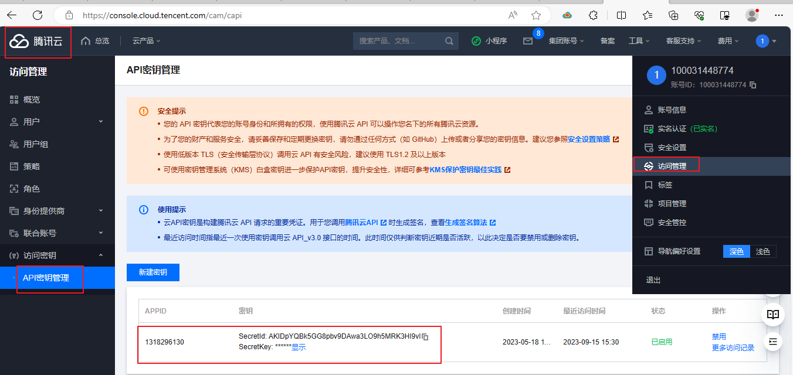
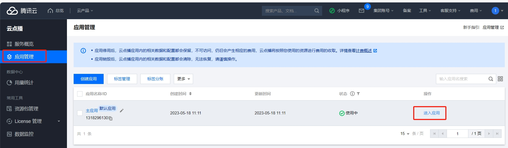

# 谷粒随享

点击添加声音的时候会触发一个查询所有专辑列表

http://127.0.0.1/api/album/albumInfo/findUserAllAlbumList 主要目的是为了让专辑与声音进行挂钩！

主要是根据userId查询数据{专辑Id，专辑标题}。然后并按照专辑Id 进行降序排列

## 获取当前用户全部专辑列表

控制器

```java
/**
  * 获取当前用户专辑列表
  * @return
  */
@Operation(summary = "获取当前用户全部专辑列表")
@GetMapping("findUserAllAlbumList")
public Result findUserAllAlbumList() {
  //	调用服务层方法
  List<AlbumInfo> list = albumInfoService.findUserAllAlbumList(AuthContextHolder.getUserId());
  return Result.ok(list);
}
```

接口

```java
/**
* 获取当前用户专辑列表
* @param userId
* @return
*/
List<AlbumInfo> findUserAllAlbumList(Long userId);
```

实现类

```java
@Override
public List<AlbumInfo> findUserAllAlbumList(long userId) {
   // 默认查看第一页
   Page<AlbumInfo> albumInfoPage = new Page<>(1,100);
   // 设置查询条件
   LambdaQueryWrapper<AlbumInfo> wrapper = new LambdaQueryWrapper<>();
   wrapper.select(AlbumInfo::getId,AlbumInfo::getAlbumTitle);
   wrapper.eq(AlbumInfo::getUserId,userId);
   wrapper.orderByDesc(AlbumInfo::getId);
   // 返回查询记录
   return albumInfoMapper.selectPage(albumInfoPage,wrapper).getRecords();
}
```

## 

## 上传声音

需要开通腾讯云服务 https://cloud.tencent.com/

快速介入流程：[云点播 快速入门-文档中心-腾讯云 (tencent.com)](https://cloud.tencent.com/document/product/266/8757)

微信扫码登录：

关注公众号：

搜索云点播：

微信认证：

实名认证：

立即开通服务：

右边：点击访问管理

TrackInfoApiController 控制器中添加

```java
package com.atguigu.tingshu.album.api;

import com.atguigu.tingshu.album.service.TrackInfoService;
import com.atguigu.tingshu.common.result.Result;
import io.swagger.v3.oas.annotations.Operation;
import io.swagger.v3.oas.annotations.tags.Tag;
import org.springframework.beans.factory.annotation.Autowired;
import org.springframework.web.bind.annotation.GetMapping;
import org.springframework.web.bind.annotation.PostMapping;
import org.springframework.web.bind.annotation.RequestMapping;
import org.springframework.web.bind.annotation.RestController;
import org.springframework.web.multipart.MultipartFile;

import java.util.Map;

@Tag(name = "声音管理")
@RestController
@RequestMapping("/api/album/trackInfo")
@SuppressWarnings({"unchecked", "rawtypes"})
public class TrackInfoApiController {
	
	@Autowired
	private TrackInfoService trackInfoService;
  
	@Autowired
	private VodService vodService;
	/**
	 * 上传声音
	 * @param file
	 * @return
	 */
	@Operation(summary = "上传声音")
	@PostMapping("uploadTrack")
	public Result<Map<String,Object>> uploadTrack(MultipartFile file) {
		//	调用服务层方法
		Map<String,Object> map = vodService.uploadTrack(file);
		return Result.ok(map);
	}
}
```

接口

```java
package com.atguigu.tingshu.album.service;

import org.springframework.web.multipart.MultipartFile;

import java.util.Map;

public interface VodService {

    /**
     * 上传声音
     * @param file
     * @return
     */
    Map<String, Object> uploadTrack(MultipartFile file);
}

```

实现类 [云点播 Java SDK-开发指南-文档中心-腾讯云 (tencent.com)](https://cloud.tencent.com/document/product/266/10276) Java 语言实现声音上传功能API

云API生成密钥：https://cloud.tencent.com/document/product/1278/85305

访问密钥：



```java
package com.atguigu.tingshu.album.service.impl;

import com.atguigu.tingshu.album.config.VodConstantProperties;
import com.atguigu.tingshu.album.service.VodService;
import com.atguigu.tingshu.common.util.UploadFileUtil;
import com.qcloud.vod.VodUploadClient;
import com.qcloud.vod.model.VodUploadRequest;
import com.qcloud.vod.model.VodUploadResponse;
import lombok.SneakyThrows;
import org.springframework.beans.factory.annotation.Autowired;
import org.springframework.stereotype.Service;
import org.springframework.web.multipart.MultipartFile;

import java.util.HashMap;
import java.util.Map;


@Service
public class VodServiceImpl implements VodService {

    @Autowired
    private VodConstantProperties vodConstantProperties;

    @SneakyThrows
    @Override
    public Map<String, Object> uploadTrack(MultipartFile file) {
        //  声音上传临时目录：
        String tempPath = UploadFileUtil.uploadTempPath(vodConstantProperties.getTempPath(), file);
        //  创建上传声音客户端
        VodUploadClient client = new VodUploadClient(vodConstantProperties.getSecretId(), vodConstantProperties.getSecretKey());
        //  构建上传请求对象
        VodUploadRequest request = new VodUploadRequest();
        //  设置视频本地地址
        request.setMediaFilePath(tempPath);
        //  指定任务流
        request.setProcedure(vodConstantProperties.getProcedure());
        //  调用上传方法
        VodUploadResponse response = client.upload(vodConstantProperties.getRegion(), request);
        //  创建map 对象
        HashMap<String, Object> map = new HashMap<>();
        map.put("mediaFileId",response.getFileId());
        map.put("mediaUrl",response.getMediaUrl());
        //  返回map 数据
        return map;
    }
}
```

上传之后可以在：[音视频管理 - 媒资管理 - 云点播 - 控制台 (tencent.com)](https://console.cloud.tencent.com/vod/media)看是否有音频



## 保存声音

前端传递Json 字符串，此时我们可以使用封装好的TrackInfoVo实体类进行接收，方便处理数据

设计到的表有：

track_info 声音信息表 

​	user_id : 直接从工具类中获取

​	order_num :  声音在专辑中的排序值，从1开始依次递增，值越小排序越前，根据专辑Id上一条声音的排序值 并且按照声音Id 进行降序排列 并且 获取第一条数.

​	media_duration , media_size ,media_type, media_url：根据流媒体Id获取到数据并赋值！获取到的数据使用TrackMediaInfoVo 对象接收

​	status : 自己设置

track_stat 声音统计表

​	初始化： 播放量 收藏量 点赞数 评论数

album_info 专辑表

​	因为修改专辑中的字段 include_track_count 专辑包含声音的总数

控制器，此时有还没有写用户登录相关代码，所以可以给用户Id 一个初始化数据 1

```java
/**
  * 保存声音
  * @param trackInfoVo
  * @return
  */
@Operation(summary = "新增声音")
@PostMapping("saveTrackInfo")
public Result saveTrackInfo(@RequestBody @Validated TrackInfoVo trackInfoVo) {
  //	调用服务层方法
  trackInfoService.saveTrackInfo(trackInfoVo, AuthContextHolder.getUserId());
  return Result.ok();
}
```

接口

```java
/**
* 保存声音
* @param trackInfoVo
* @param userId
*/
void saveTrackInfo(TrackInfoVo trackInfoVo, Long userId);
```

实现类

```java
@Override
@Transactional(rollbackFor = Exception.class)
public void saveTrackInfo(TrackInfoVo trackInfoVo, Long userId) {
   // 创建声音对象
   TrackInfo trackInfo = new TrackInfo();
   // 属性拷贝
   BeanUtils.copyProperties(trackInfoVo,trackInfo);
   trackInfo.setStatus(SystemConstant.TRACK_STATUS_PASS);
   trackInfo.setUserId(userId);
   // 获取上一条声音
   TrackInfo preTrackInfo = this.getOne(new LambdaQueryWrapper<TrackInfo>().eq(TrackInfo::getAlbumId, trackInfoVo.getAlbumId()).orderByDesc(TrackInfo::getId).select(TrackInfo::getOrderNum).last(" limit 1 "));
   int orderNum = 1;
   if(null != preTrackInfo) {
      orderNum = preTrackInfo.getOrderNum() + 1;
   }
   // 获取流媒体信息.
   TrackMediaInfoVo trackMediaInfo = vodService.getTrackMediaInfo(trackInfoVo.getMediaFileId());
   // 赋值声音
   trackInfo.setMediaSize(trackMediaInfo.getSize());
   trackInfo.setMediaUrl(trackMediaInfo.getMediaUrl());
   trackInfo.setMediaDuration(trackMediaInfo.getDuration());
   trackInfo.setMediaType(trackMediaInfo.getType());
	
   trackInfo.setOrderNum(orderNum);

   this.save(trackInfo);

   // 更新专辑声音总数
   AlbumInfo albumInfo = albumInfoService.getById(trackInfo.getAlbumId());
   int includeTrackCount = albumInfo.getIncludeTrackCount() + 1;
   albumInfo.setIncludeTrackCount(includeTrackCount);
   albumInfoService.updateById(albumInfo);

   // 初始化统计数据
   this.saveTrackStat(trackInfo.getId(),SystemConstant.TRACK_STAT_PLAY);
   this.saveTrackStat(trackInfo.getId(),SystemConstant.TRACK_STAT_COLLECT);
   this.saveTrackStat(trackInfo.getId(),SystemConstant.TRACK_STAT_PRAISE);
   this.saveTrackStat(trackInfo.getId(),SystemConstant.TRACK_STAT_COMMENT);
}
```

初始化统计数据

```java
/**
* 初始化统计数量
* @param trackId
* @param trackType
*/
private void saveTrackStat(Long trackId, String trackType) {
  TrackStat trackStat = new TrackStat();
  trackStat.setTrackId(trackId);
  trackStat.setStatType(trackType);
  trackStat.setStatNum(0);
  this.trackStatMapper.insert(trackStat);
}
```

获取流媒体数据方法实现  参考地址[API Explorer - 云 API - 控制台 (tencent.com)](https://console.cloud.tencent.com/api/explorer?Product=vod&Version=2018-07-17&Action=DescribeMediaInfos)

```java
@SneakyThrows
@Override
public TrackMediaInfoVo getTrackMediaInfo(String mediaFileId) {
  //  初始化认证对象
  Credential cred = new Credential(vodConstantProperties.getSecretId(), vodConstantProperties.getSecretKey());
  // 实例化要请求产品的client对象,clientProfile是可选的
  VodClient client = new VodClient(cred, vodConstantProperties.getRegion());
  // 实例化一个请求对象,每个接口都会对应一个request对象
  DescribeMediaInfosRequest req = new DescribeMediaInfosRequest();
  //  设置当前fileIds
  req.setFileIds(new String[]{mediaFileId});
  // 返回的resp是一个DescribeMediaInfosResponse的实例，与请求对象对应
  DescribeMediaInfosResponse response = client.DescribeMediaInfos(req);
  log.info("声音详细返回结果：{}", JSON.toJSONString(response));
  //  判断对象不为空
  if (response.getMediaInfoSet().length>0){
    //  获取到
    MediaInfo mediaInfo = response.getMediaInfoSet()[0];
    //  创建流媒体信息对象
    TrackMediaInfoVo trackMediaInfoVo = new TrackMediaInfoVo();
    trackMediaInfoVo.setDuration(mediaInfo.getMetaData().getDuration());
    trackMediaInfoVo.setSize(mediaInfo.getMetaData().getSize());
    trackMediaInfoVo.setMediaUrl(mediaInfo.getBasicInfo().getMediaUrl());
    trackMediaInfoVo.setType(mediaInfo.getBasicInfo().getType());
    //  返回数据
    return trackMediaInfoVo;
  }
  return null;
}
```

## 查询声音列表

需要根据用户Id，状态或标题查询当前声音列表！这三个条件被封装到一个实体类中 **TrackInfoQuery**,返回结果对象封装到 **TrackListVo** 实体类中

TrackInfoApiController 控制器

```java
/**
  * 查看声音专辑列表
  * @param page
  * @param limit
  * @param trackInfoQuery
  * @return
  
  */
@Operation(summary = "获取当前用户声音分页列表")
@PostMapping("findUserTrackPage/{page}/{limit}")
public Result<IPage<TrackListVo>> findUserTrackPage(@Parameter(name = "page",description = "当前页面",required = true)
                                                    @PathVariable Long page,
                                                    @Parameter(name = "limit",description = "每页记录数",required = true)
                                                    @PathVariable Long limit,
                                                    @Parameter(name = "trackInfoQuery",description = "查询对象",required = false)
                                                    @RequestBody TrackInfoQuery trackInfoQuery){
  //	设置当前用户Id
  trackInfoQuery.setUserId(AuthContextHolder.getUserId());
  //	创建对象
  Page<TrackListVo> trackListVoPage = new Page<>(page,limit);
  IPage<TrackListVo> trackListVoIPage = trackInfoService.findUserTrackPage(trackListVoPage,trackInfoQuery);
  //	返回数据
  return Result.ok(trackListVoIPage);
}
```

接口

```java
/**
* 查询声音专辑列表
* @param trackListVoPage
* @param trackInfoQuery
* @return
*/
IPage<TrackListVo> findUserTrackPage(Page<TrackListVo> trackListVoPage, TrackInfoQuery trackInfoQuery);
```

实现类

```java
@Override
public IPage<TrackListVo> findUserTrackPage(Page<TrackListVo> trackListVoPage, TrackInfoQuery trackInfoQuery) {
//	调用mapper层方法
return trackInfoMapper.selectUserTrackPage(trackListVoPage,trackInfoQuery);
}
```

mapper接口

```java
package com.atguigu.tingshu.album.mapper;

import com.atguigu.tingshu.model.album.TrackInfo;
import com.atguigu.tingshu.query.album.TrackInfoQuery;
import com.atguigu.tingshu.vo.album.TrackListVo;
import com.baomidou.mybatisplus.core.mapper.BaseMapper;
import com.baomidou.mybatisplus.core.metadata.IPage;
import com.baomidou.mybatisplus.extension.plugins.pagination.Page;
import org.apache.ibatis.annotations.Mapper;
import org.apache.ibatis.annotations.Param;

@Mapper
public interface TrackInfoMapper extends BaseMapper<TrackInfo> {


    /**
     * 查询声音专辑列表
     * @param trackListVoPage
     * @param trackInfoQuery
     * @return
     */
    IPage<TrackListVo> selectUserTrackPage(Page<TrackListVo> trackListVoPage, @Param("vo") TrackInfoQuery trackInfoQuery);
}
```

TrackInfoMapper.xml


```xml
<?xml version="1.0" encoding="UTF-8" ?>
<!DOCTYPE mapper
PUBLIC "-//ibatis.apache.org//DTD Mapper 3.0//EN"
"http://ibatis.apache.org/dtd/ibatis-3-mapper.dtd">
<mapper namespace="com.atguigu.tingshu.album.mapper.TrackInfoMapper">
    <select id="selectUserTrackPage" resultType="com.atguigu.tingshu.vo.album.TrackListVo">
        select
        any_value(info.albumId) as albumId,
        info.albumTitle,
        info.trackId,
        info.trackTitle,
        info.coverUrl,
        info.mediaDuration,
        info.status,
        info.createTime,
        MAX(IF(info.statType = '0701', info.statNum, 0)) as playStatNum,
        MAX(IF(info.statType = '0702', info.statNum, 0)) as collectStatNum,
        MAX(IF(info.statType = '0703', info.statNum, 0)) as praiseStatNum,
        MAX(IF(info.statType = '0704', info.statNum, 0)) as commentStatNum
        from (
        select
        album.id as albumId,
        album.album_title as albumTitle,
        track.id as trackId,
        track.track_title as trackTitle,
        track.media_duration as mediaDuration,
        if(track.cover_url is null or track.cover_url = '', album.cover_url, track.cover_url) as coverUrl,
        track.status,
        track.create_time as createTime,
        stat.stat_type as statType,
        stat.stat_num as statNum
        from track_info track
        left join track_stat stat on stat.track_id = track.id
        left join album_info album on album.id = track.album_id
        <where>
            <if test="vo.userId != null">
                and track.user_id = #{vo.userId}
            </if>
            <if test="vo.trackTitle != null and vo.trackTitle != ''">
                and track.track_title like CONCAT('%',#{vo.trackTitle},'%')
            </if>
            <if test="vo.status != null and vo.status != ''">
                and track.status = #{vo.status}
            </if>
            and track.is_deleted = 0
        </where>
        ) info
        group by info.trackId
        order by info.trackId desc
    </select>
</mapper>
```

## 

## 修改声音

1. 根据Id获取数据并回显 将数据封装到 TrackInfo对象

2. 保存修改之后的数据

   ​	修改的时候，传递的有声音Id ，还有修改的Json 字符串.

   ​	只修改track_info 表中的数据就可以了

   ​		涉及到声音保存的问题，如果修改了声音，那么track_info 中声音信息，就需要修改media_duration , media_size ,media_type, media_url这些字段信息。

   

   回显数据控制器

   ```java
   /**
   * 根据Id 获取数据
   * @param id
   * @return
   */
   @Operation(summary = "获取声音信息")
   @GetMapping("getTrackInfo/{id}")
   public Result<TrackInfo> getTrackInfo(@PathVariable Long id) {
     //	调用服务层方法
     TrackInfo trackInfo = trackInfoService.getById(id);
     return Result.ok(trackInfo);
   }
   ```

   保存修改控制器

   传递声音Id ，封装好的TrackInfoVo 实体类。

   ```java
   /**
   * 保存修改声音数据
   * @param id
   * @param trackInfoVo
   * @return
   */
   @Operation(summary = "修改声音")
   @PutMapping("updateTrackInfo/{id}")
   public Result updateById(@PathVariable Long id, @RequestBody @Validated TrackInfoVo trackInfoVo) {
     //	调用服务层方法
     trackInfoService.updateTrackInfo(id, trackInfoVo);
     return Result.ok();
   }
   ```

   接口

   ```java
   /**
   * 保存数据
   * @param id
   * @param trackInfoVo
   */
   void updateTrackInfo(Long id, TrackInfoVo trackInfoVo);
   ```

   实现类

   ```java
   @Override
   public void updateTrackInfo(Long id, TrackInfoVo trackInfoVo) {
     //	获取到声音对象
     TrackInfo trackInfo = this.getById(id);
     //    获取传递的fileId
     String mediaFileId = trackInfo.getMediaFileId();
     //	进行属性拷贝
     BeanUtils.copyProperties(trackInfoVo, trackInfo);
     //	获取声音信息 页面传递的fileId 与 数据库的 fileId 不相等就修改
     if (!trackInfoVo.getMediaFileId().equals(mediaFileId)) {
       //	说明已经修改过了.
       TrackMediaInfoVo trackMediaInfoVo = vodService.getTrackMediaInfo(trackInfoVo.getMediaFileId());
       //	判断对象不为空.
       if (null==trackMediaInfoVo){
         //	抛出异常
         throw new GuiguException(ResultCodeEnum.VOD_FILE_ID_ERROR);
       }
       trackInfo.setMediaUrl(trackMediaInfoVo.getMediaUrl());
       trackInfo.setMediaType(trackMediaInfoVo.getType());
       trackInfo.setMediaDuration(trackMediaInfo.getDuration());
       trackInfo.setMediaSize(trackMediaInfoVo.getSize());
     }
     //	修改数据
     this.updateById(trackInfo);
   }
   ```

   


## 删除声音

设计的表： track_info，album_info，track_stat，media

思路：

   	1.	track_info,track_stat：对这两张表要进行逻辑删除
   	2.	修改album_info 表中的专辑声音总数
   	3.	3.删除云点播中的声音记录

控制器

```java
/**
* 删除声音
* @param id
* @return
*/
@Operation(summary = "删除声音信息")
@DeleteMapping("removeTrackInfo/{id}")
public Result removeTrackInfo(@PathVariable Long id) {
  //	调用服务层方法
  trackInfoService.removeTrackInfo(id);
  return Result.ok();
}
```

接口：

```java
/**
* 删除声音
* @param id
*/
void removeTrackInfo(Long id);
```

实现类

```java
@Transactional
@Override
public void removeTrackInfo(Long id) {
   // 获取声音对象数据
   TrackInfo trackInfo = this.getById(id);
   // 删除
   this.removeById(id);
   //更新专辑声音总数
   AlbumInfo albumInfo = this.albumInfoService.getById(trackInfo.getAlbumId());
   int includeTrackCount = albumInfo.getIncludeTrackCount() - 1;
   albumInfo.setIncludeTrackCount(includeTrackCount);
   albumInfoService.updateById(albumInfo);
   //删除统计数据
   trackStatMapper.delete(new LambdaQueryWrapper<TrackStat>().eq(TrackStat::getTrackId, id));

   //删除声音媒体
   vodService.removeTrack(trackInfo.getMediaFileId());
}
```

接口与实现类

```java
/**
* 根据媒体Id 删除数据
* @param mediaFileId
*/
void removeTrack(String mediaFileId);
```

[API Explorer - 云 API - 控制台 (tencent.com)](https://console.cloud.tencent.com/api/explorer?Product=vod&Version=2018-07-17&Action=DeleteMedia)

```java
@SneakyThrows
@Override
public void removeTrack(String mediaFileId) {
  Credential cred = new Credential(vodConstantProperties.getSecretId(), vodConstantProperties.getSecretKey());
  // 实例化要请求产品的client对象,clientProfile是可选的
  VodClient client = new VodClient(cred, "");
  // 实例化一个请求对象,每个接口都会对应一个request对象
  DeleteMediaRequest req = new DeleteMediaRequest();
  req.setFileId(mediaFileId);
  // 返回的resp是一个DeleteMediaResponse的实例，与请求对象对应
  DeleteMediaResponse response = client.DeleteMedia(req);
  // 输出json格式的字符串回包
  log.info("声音删除返回结课: {}", JSON.toJSONString(response));
}
```


