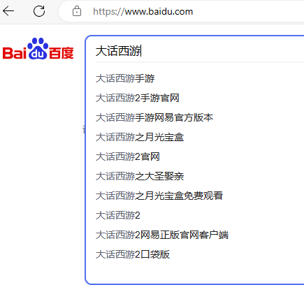

# 谷粒随享

## 检索业务介绍

 1.  用户在首页的检索文本框中输入检索的内容，然后根据输入的内容从 es 索引库中获取数据，并展示给用户

 2.  用户输入关键字的时候，能够实现自动补全功能

     

## 商品上架-下架

专辑的标题：

专辑的介绍：

专辑的分类：

专辑的属性：

找实体类的这个过程叫：面向对象思想！封装-继承-多态

### 封装实体类

商品上架，下架信息存在不同的数据库表中，所以我们将商品的上架-下架的字段统一封装到实体类中。

```java
@Data
@Document(indexName = "albuminfo")
@JsonIgnoreProperties(ignoreUnknown = true)//目的：防止json字符串转成实体对象时因未识别字段报错
public class AlbumInfoIndex implements Serializable {
    
    private static final long serialVersionUID = 1L;

    // 专辑Id
    @Id
    private Long id;

    //  es 中能分词的字段，这个字段数据类型必须是 text！keyword 不分词！ analyzer = "ik_max_word"
    @Field(type = FieldType.Text, analyzer = "ik_max_word")
    private String albumTitle;

    @Field(type = FieldType.Text, analyzer = "ik_max_word")
    private String albumIntro;
    
    //  主播名称
    @Field(type = FieldType.Keyword)
    private String announcerName;

    //专辑封面
    @Field(type = FieldType.Keyword, index = false)
    private String coverUrl;

    //专辑包含声音总数
    @Field(type = FieldType.Long, index = false)
    private Integer includeTrackCount;

    //专辑是否完结：0-否；1-完结
    @Field(type = FieldType.Long, index = false)
    private String isFinished;

    //付费类型：免费、vip免费、付费
    @Field(type = FieldType.Keyword, index = false)
    private String payType;

    @Field(type = FieldType.Date,format = DateFormat.date_time, pattern = "yyyy-MM-dd HH:mm:ss")
    private Date createTime; 

    @Field(type = FieldType.Long)
    private Long category1Id;

    @Field(type = FieldType.Long)
    private Long category2Id;

    @Field(type = FieldType.Long)
    private Long category3Id;

    //播放量
    @Field(type = FieldType.Integer)
    private Integer playStatNum = 0;

    //订阅量
    @Field(type = FieldType.Integer)
    private Integer subscribeStatNum = 0;

    //购买量
    @Field(type = FieldType.Integer)
    private Integer buyStatNum = 0;

    //评论数
    @Field(type = FieldType.Integer)
    private Integer commentStatNum = 0;

    //商品的热度！
    @Field(type = FieldType.Double)
    private Double hotScore = 0d;

    // 专辑属性值
    // Nested 支持嵌套查询
    @Field(type = FieldType.Nested)
    private List<AttributeValueIndex> attributeValueIndexList;

}
```

### 功能实现 - 上架

1. 获取专辑信息（有）但是需要将其发布到feign 上 
2. 根据专辑Id获取专辑属性信息（无）
3. 获取分类信息（无）
4. 获取用户信息（有）但是需要将其发布到feign上

#### 根据专辑Id 获取专辑数据

AlbumInfoFeignClient根据专辑Id 获取到专辑数据,需要将这个接口发布到feign上.

```java
/**
 * 获取专辑信息
 * @param id
 * @return
 */
@GetMapping("api/album/albumInfo/getAlbumInfo/{id}")
Result<AlbumInfo> getAlbumInfo(@PathVariable("id") Long id);
```

```java
public Result<AlbumInfo> getAlbumInfo(Long albumId) {
    return null;
}
```

#### 根据专辑Id获取专辑属性信息

```java
/**
  * 获取专辑属性值列表
  * @param albumId
  * @return
  */
@GetMapping("api/album/albumInfo/findAlbumAttributeValue/{albumId}")
Result<List<AlbumAttributeValue>> findAlbumAttributeValue(@PathVariable("albumId") Long albumId);
```

AlbumInfoDegradeFeignClient 熔断类

```java
@Override
public Result<List<AlbumAttributeValue>> findAlbumAttributeValue(Long albumId) {
	return null;
}
```

service-album 中的AlbumInfoApiController控制器添加方法

```java
/**
  * 根据专辑Id 获取到专辑属性列表
  * @param albumId
  * @return
  */
@Operation(summary = "获取专辑属性值列表")
@GetMapping("findAlbumAttributeValue/{albumId}")
public Result<List<AlbumAttributeValue>> findAlbumAttributeValue(@PathVariable Long albumId) {
  //	获取到专辑属性集合
  List<AlbumAttributeValue> albumAttributeValueList = albumInfoService.findAlbumAttributeValueByAlbumId(albumId);
  return Result.ok(albumAttributeValueList);
}
```

接口

```java
/**
* 根据专辑Id 获取到专辑属性列表
* @param albumId
* @return
*/
List<AlbumAttributeValue> findAlbumAttributeValueByAlbumId(Long albumId)
```

实现类

```java
@Override
public List<AlbumAttributeValue> findAlbumAttributeValueByAlbumId(Long albumId) {
LambdaQueryWrapper<AlbumAttributeValue> lambdaQueryWrapper = new LambdaQueryWrapper<>();
lambdaQueryWrapper.eq(AlbumAttributeValue::getAlbumId,albumId);
  List<AlbumAttributeValue> albumAttributeValueList = albumAttributeValueMapper.selectList(lambdaQueryWrapper);
  //	返回集合数据
  return albumAttributeValueList;
}
```


#### 根据三级分类Id查询分类数据

远程调用

```java
@FeignClient(value = "service-album", fallback = CategoryDegradeFeignClient.class)
public interface CategoryFeignClient {

    /**
     * 根据三级分类Id 获取到分类数据
     * @param category3Id
     * @return
     */
    @GetMapping("api/album/category/getCategoryView/{category3Id}")
    Result<BaseCategoryView> getCategoryView(@PathVariable Long category3Id);

}
```

熔断类

```java
@Component
public class CategoryDegradeFeignClient implements CategoryFeignClient {
    @Override
    public Result<BaseCategoryView> getCategoryView(Long category3Id) {
        return null;
    }
}
```

在BaseCategoryApiController 控制器中添加

```java
/**
 * 根据三级分类Id 获取到分类信息
 * @param category3Id
 * @return
 */
@Operation(summary = "通过三级分类id查询分类信息")
@GetMapping("getCategoryView/{category3Id}")
public Result<BaseCategoryView> getCategoryView(@PathVariable Long category3Id){
   // 调用服务层方法
   BaseCategoryView baseCategoryView = baseCategoryService.getCategoryViewByCategory3Id(category3Id);
   return Result.ok(baseCategoryView);
}
```

接口

```java
/**
 * 根据三级分类Id 查询分类数据
 * @param category3Id
 * @return
 */
BaseCategoryView getCategoryViewByCategory3Id(Long category3Id);
```

实现类

```java
@Override
public BaseCategoryView getCategoryViewByCategory3Id(Long category3Id) {
   return baseCategoryViewMapper.selectById(category3Id);
}
```


#### 根据用户Id 获取到用户信息.

控制器

```java
/**
 * 根据用户Id获取用户信息
 * @param userId
 * @return
 */
@Operation(summary = "根据用户id获取用户信息")
@GetMapping("getUserInfoVo/{userId}")
public Result<UserInfoVo> getUserInfoVo(@PathVariable Long userId) {
   // 获取用户信息
   UserInfoVo userInfoVo = userInfoService.getUserInfoVoByUserId(userId);
   return Result.ok(userInfoVo);
}
```


远程调用接口与熔断类

```java
/**
 * 根据userId 获取到用户信息
 * @param userId
 * @return
 */
@GetMapping("api/user/userInfo/getUserInfoVo/{userId}")
Result<UserInfoVo> getUserInfoVo(@PathVariable Long userId);
```

```
@Override
public Result<UserInfoVo> getUserInfoVo(Long userId) {
    return null;
}
```


#### 商品上架

```java
/**
  * 上架专辑
  * @param albumId
  * @return
  */
@Operation(summary = "上架专辑")
@GetMapping("/upperAlbum/{albumId}")
public Result upperAlbum(@PathVariable Long albumId){
  //  调用服务层方法.
  this.searchService.upperAlbum(albumId);
  //  默认返回
  return Result.ok();
}
```

SearchService 接口

```java
/**
* 上架专辑
* @param albumId
*/
void upperAlbum(Long albumId);
```

SearchServiceImpl 实现类

```java
@Autowired
private AlbumIndexRepository albumIndexRepository;

@Override
public void upperAlbum(Long albumId) {
  //  获取专辑信息
  Result<AlbumInfo> albumInfoResult = albumInfoFeignClient.getAlbumInfo(albumId);
  AlbumInfo albumInfo = albumInfoResult.getData();
  Assert.notNull(albumInfo,"专辑为空");
  //  获取专辑属性信息
  Result<List<AlbumAttributeValue>> albumAttributeValueResult = albumInfoFeignClient.findAlbumAttributeValue(albumId);
  List<AlbumAttributeValue> albumAttributeValueList = albumAttributeValueResult.getData();
  Assert.notNull(albumAttributeValueList,"专辑属性为空");
  //  根据三级分类Id 获取到分类数据
  Result<BaseCategoryView> baseCategoryViewResult = categoryFeignClient.getCategoryView(albumInfo.getCategory3Id());
  BaseCategoryView baseCategoryView = baseCategoryViewResult.getData();
  Assert.notNull(baseCategoryView,"分类为空");
  //  根据用户Id 获取到用户信息
  Result<UserInfoVo> userInfoVoResult = userInfoFeignClient.getUserInfoVo(albumInfo.getUserId());
  UserInfoVo userInfoVo = userInfoVoResult.getData();
  Assert.notNull(userInfoVo,"用户信息为空");

  //  创建索引库对象
  AlbumInfoIndex albumInfoIndex = new AlbumInfoIndex();
  BeanUtils.copyProperties(albumInfo,albumInfoIndex);

  //  赋值属性值信息
  if (!CollectionUtils.isEmpty(albumAttributeValueList)){
    List<AttributeValueIndex> attributeValueIndexList = albumAttributeValueList.stream().map(albumAttributeValue -> {
      AttributeValueIndex attributeValueIndex = new AttributeValueIndex();
      BeanUtils.copyProperties(albumAttributeValue, attributeValueIndex);
      return attributeValueIndex;
    }).collect(Collectors.toList());
    //  保存数据
    albumInfoIndex.setAttributeValueIndexList(attributeValueIndexList);
  }
  //  赋值分类数据
  albumInfoIndex.setCategory1Id(baseCategoryView.getCategory1Id());
  albumInfoIndex.setCategory2Id(baseCategoryView.getCategory2Id());
  albumInfoIndex.setCategory3Id(baseCategoryView.getCategory3Id());
  //  赋值主播名称
  albumInfoIndex.setAnnouncerName(userInfoVo.getNickname());
  
  //更新统计量与得分，默认随机，方便测试
  int num1 = new Random().nextInt(1000);
  int num2 = new Random().nextInt(100);
  int num3 = new Random().nextInt(50);
  int num4 = new Random().nextInt(300);
  albumInfoIndex.setPlayStatNum(num1);
  albumInfoIndex.setSubscribeStatNum(num2);
  albumInfoIndex.setBuyStatNum(num3);
  albumInfoIndex.setCommentStatNum(num4);
  double hotScore = num1*0.2 + num2*0.3 + num3*0.4 + num4*0.1;
  //  设置热度排名
  albumInfoIndex.setHotScore(hotScore);
  //  保存商品上架信息
  albumIndexRepository.save(albumInfoIndex);
}
```

创建操作es索引库的对象

```java
/**
 * @author atguigu-mqx
 * @ClassName AlbumIndexRepository
 * @description: TODO
 * @date 2023年08月08日
 * @version: 1.0
 */
public interface AlbumIndexRepository extends ElasticsearchRepository<AlbumInfoIndex,Long> {
}
```


升级多线程上架：

```java
@Override
public void upperAlbum(Long albumId) {
    //  专辑上架时都应该给 AlbumInfoIndex
    AlbumInfoIndex albumInfoIndex = new AlbumInfoIndex();
    //  singleSave(albumId);
    //  创建异步编排对象
    CompletableFuture<AlbumInfo> albumInfoCompletableFuture = CompletableFuture.supplyAsync(() -> {
        //  远程获取数据
        Result<AlbumInfo> albumInfoResult = albumInfoFeignClient.getAlbumInfo(albumId);
        //  判断
        Assert.notNull(albumInfoResult, "albumInfoResult这个对象不为空");
        AlbumInfo albumInfo = albumInfoResult.getData();
        //  判断
        Assert.notNull(albumInfo, "albumInfo 这个对象不为空");
        //  给albumInfoIndex 对象中的专辑部分数据进行赋值.
        BeanUtils.copyProperties(albumInfo,albumInfoIndex);
        //  返回对象
        return albumInfo;
    });

    //  获取分类数据：需要使用三级分类Id  albumInfo.getCategory3Id();
    CompletableFuture<Void> categoryCompletableFuture = albumInfoCompletableFuture.thenAcceptAsync(albumInfo -> {
        Result<BaseCategoryView> categoryViewResult = categoryFeignClient.getCategoryView(albumInfo.getCategory3Id());
        BaseCategoryView baseCategoryView = categoryViewResult.getData();
        //  赋值：
        albumInfoIndex.setCategory1Id(baseCategoryView.getCategory1Id());
        albumInfoIndex.setCategory2Id(baseCategoryView.getCategory2Id());
        albumInfoIndex.setCategory3Id(baseCategoryView.getCategory3Id());
    });

    //  获取属性集合
    CompletableFuture<Void> attributeCompletableFuture = CompletableFuture.runAsync(() -> {
        //  获取专辑属性信息.
        Result<List<AlbumAttributeValue>> albumAttributeValueResult = albumInfoFeignClient.findAlbumAttributeValue(albumId);
        List<AlbumAttributeValue> albumAttributeValueList = albumAttributeValueResult.getData();
        //  遍历数据
        if (!CollectionUtils.isEmpty(albumAttributeValueList)) {
            //  获取到当前albumAttributeValue 对象中的  attributeId  valueId 给  AttributeValueIndex 这个对象 赋值
            List<AttributeValueIndex> attributeValueIndexList = albumAttributeValueList.stream().map(albumAttributeValue -> {
                //  获取  attributeId  valueId 给  AttributeValueIndex 这个对象 赋值
                AttributeValueIndex attributeValueIndex = new AttributeValueIndex();
                attributeValueIndex.setAttributeId(albumAttributeValue.getAttributeId());
                attributeValueIndex.setValueId(albumAttributeValue.getValueId());
                return attributeValueIndex;
            }).collect(Collectors.toList());
            //  赋值：
            albumInfoIndex.setAttributeValueIndexList(attributeValueIndexList);
        }
    });

    //  获取主播数据
    CompletableFuture<Void> userCompletableFuture = albumInfoCompletableFuture.thenAcceptAsync(albumInfo -> {
        //  赋值主播名称.album_info.user_id
        Result<UserInfoVo> userInfoVoResult = userInfoFeignClient.getUserInfoVo(albumInfo.getUserId());
        UserInfoVo userInfoVo = userInfoVoResult.getData();
        //  赋值主播
        albumInfoIndex.setAnnouncerName(userInfoVo.getNickname());
    });

    //  赋值播放量，，订阅量，购买量, 评论数
    int playStatNum = new Random().nextInt(10000);
    int subscribeStatNum = new Random().nextInt(100);
    int buyStatNum = new Random().nextInt(1000);
    int commentStatNum = new Random().nextInt(100);
    albumInfoIndex.setPlayStatNum(playStatNum);
    albumInfoIndex.setSubscribeStatNum(subscribeStatNum);
    albumInfoIndex.setBuyStatNum(buyStatNum);
    albumInfoIndex.setCommentStatNum(commentStatNum);

    //  随机生成一个热度值。
    double hotScore = new Random().nextInt(100);
    albumInfoIndex.setHotScore(hotScore);

    //  多任务组合：
    CompletableFuture.allOf(
            albumInfoCompletableFuture,
            attributeCompletableFuture,
            categoryCompletableFuture,
            userCompletableFuture).join();
    //  保存数据：
    albumIndexRepository.save(albumInfoIndex);

}
```

### 功能实现 - 下架

控制器

```java
/**
  * 下架专辑
  * @param albumId
  * @return
  */
@Operation(summary = "下架专辑")
@GetMapping("lowerAlbum/{albumId}")
public Result lowerAlbum(@PathVariable Long albumId) {
  searchService.lowerAlbum(albumId);
  return Result.ok();
}
```

接口

```java
/**
  * 下架专辑
  * @param albumId
  */
  void lowerAblum(Long albumId);
```

实现类

```java
@Override
public void lowerAblum(Long albumId) {
  albumIndexRepository.deleteById(albumId);
}
```

通过这个url http://localhost:8502/doc.html 进行测试！

### 利用mq实现专辑自动上架-下架

##### 上架-发送消息

###### 保存专辑

```java
//	发送上架消息
if ("1".equals(albumInfo.getIsOpen())){
  this.kafkaService.sendMessage(KafkaConstant.QUEUE_ALBUM_UPPER,String.valueOf(albumInfo.getId()  ));
}
```

###### 更新专辑

```java
@Override
@Transactional(rollbackFor = Exception.class)
public void updateAlbumInfo(Long id, AlbumInfoVo albumInfoVo) {
  AlbumInfo albumInfo = this.getById(id);
  BeanUtils.copyProperties(albumInfoVo, albumInfo);
  //	根据id 修改数据
  this.updateById(albumInfo);

  //	先删除专辑属性数据
  albumAttributeValueMapper.delete(new LambdaQueryWrapper<AlbumAttributeValue>().eq(AlbumAttributeValue::getAlbumId,id));

  //	保存专辑属性数据
  List<AlbumAttributeValueVo> albumAttributeValueVoList = albumInfoVo.getAlbumAttributeValueVoList();
  if (!CollectionUtils.isEmpty(albumAttributeValueVoList)){
    albumAttributeValueVoList.forEach(albumAttributeValueVo -> {
      //	创建专辑属性对象
      AlbumAttributeValue albumAttributeValue = new AlbumAttributeValue();
      //	进行数据拷贝
      BeanUtils.copyProperties(albumAttributeValueVo,albumAttributeValue);
      //	赋值专辑属性Id
      albumAttributeValue.setAlbumId(id);
      albumAttributeValueMapper.insert(albumAttributeValue);
    });
  }
  //	更新上架下架
  if("1".equals(albumInfo.getIsOpen())) {
    kafkaService.sendMessage(KafkaConstant.QUEUE_ALBUM_UPPER, String.valueOf(albumInfo.getId()));
  } else {
    kafkaService.sendMessage(KafkaConstant.QUEUE_ALBUM_LOWER, String.valueOf(albumInfo.getId()));
  }
}
```

##### 下架-发送消息

###### 删除专辑

```java
@Override
@Transactional(rollbackFor = Exception.class)
public void removeAlbumInfoById(Long id) {
  //	删除专辑表的数据 album_info
  this.removeById(id);
  //	删除专辑属性信息
  albumAttributeValueMapper.delete(new LambdaQueryWrapper<AlbumAttributeValue>().eq(AlbumAttributeValue::getAlbumId,id));
  //	删除专辑对应的统计数据
  albumStatMapper.delete(new LambdaQueryWrapper<AlbumStat>().eq(AlbumStat::getAlbumId,id));
  //下架
  kafkaService.sendMessage(KafkaConstant.QUEUE_ALBUM_LOWER, String.valueOf(id));
}
```

#### 监听消息

在service-search微服务中添加监听方法

```java
package com.atguigu.tingshu.search.receiver;

import com.atguigu.tingshu.common.constant.KafkaConstant;
import com.atguigu.tingshu.search.service.SearchService;
import lombok.extern.slf4j.Slf4j;
import org.apache.kafka.clients.consumer.ConsumerRecord;
import org.springframework.beans.factory.annotation.Autowired;
import org.springframework.kafka.annotation.KafkaListener;
import org.springframework.stereotype.Component;

/**
 * @author atguigu-mqx
 * @ClassName SearchReceiver
 * @description: TODO
 * @version: 1.0
 */
@Component
@Slf4j
public class SearchReceiver {

    @Autowired
    private SearchService searchService;

    /**
     * 监听专辑上架
     * @param consumerRecord
     */
    @KafkaListener(topics = KafkaConstant.QUEUE_ALBUM_UPPER)
    public void upperGoods(ConsumerRecord<String,String> consumerRecord){
        //  获取到发送的消息
        Long albumId = Long.parseLong(consumerRecord.value());
        if (null != albumId){
            searchService.upperAlbum(albumId);
        }
    }

    /**
     * 监听专辑下架
     * @param consumerRecord
     */
    @KafkaListener(topics = KafkaConstant.QUEUE_ALBUM_LOWER)
    public void lowerGoods(ConsumerRecord<String,String> consumerRecord){
        //  获取到发送的消息
        Long albumId = Long.parseLong(consumerRecord.value());
        if (null != albumId){
            searchService.lowerAlbum(albumId);
        }
    }
}
```

批量上传专辑：为了后续测试使用

```java
@Operation(summary = "批量上架")
@GetMapping("batchUpperAblum")
public Result upperAlbum(){
    for (long i = 1; i <= 1500; i++) {
        searchService.upperAlbum(i);
    }
    return Result.ok();
}
```

## 商品检索

### 根据关键词检索

#### 封装检索条件

根据用户可能根据不同的检索条件检索数据，所以将用户可能输入的检索条件封装到一个实体对象中 **AlbumIndexQuery**

```java
@Data
@Schema(description = "专辑信息搜索")
public class AlbumIndexQuery {

   @Schema(description = "关键字")
   private String keyword;

   @Schema(description = "一级分类")
   private Long category1Id;

   @Schema(description = "二级分类")
   private Long category2Id;

   @Schema(description = "三级分类")
   private Long category3Id;

   @Schema(description = "属性（属性id:属性值id）")
   private List<String> attributeList;

   // order=1:asc  排序规则   0:asc
   @Schema(description = "排序（综合排序[1:desc] 播放量[2:desc] 发布时间[3:desc]；asc:升序 desc:降序）")
   private String order = "";// 1：综合排序 2：播放量 3：最近更新

   private Integer pageNo = 1;//分页信息
   private Integer pageSize = 10;
}
```

#### 封装返回结果集

将检索的结果统一封装到一个实体类便于显示检索内容 **AlbumSearchResponseVo**

```java
@Data
public class AlbumSearchResponseVo implements Serializable {

    //检索出来的商品信息
    private List<AlbumInfoIndexVo> list = new ArrayList<>();
    private Long total;//总记录数
    private Integer pageSize;//每页显示的内容
    private Integer pageNo;//当前页面
    private Long totalPages;

}
```

#### 检索功能实现

##### 控制器

```java
/**
  * 根据关键词检索
  * @param albumIndexQuery
  * @return
  * @throws IOException
  */
@Operation(summary = "专辑搜索列表")
@PostMapping
public Result search(@RequestBody AlbumIndexQuery albumIndexQuery) throws IOException {
  //  调用服务层方法.
  AlbumSearchResponseVo albumSearchResponseVo = searchService.search(albumIndexQuery);
  return Result.ok(albumSearchResponseVo);
}
```

##### 接口

```java
/**
  * 根据关键词检索
  * @param albumIndexQuery
  * @return
  */
AlbumSearchResponseVo search(AlbumIndexQuery albumIndexQuery);
```

##### 实现类

```java
@Autowired
private ElasticsearchClient elasticsearchClient;

public AlbumSearchResponseVo search(AlbumIndexQuery albumIndexQuery) {
  // 构建dsl语句
  SearchRequest request = this.buildQueryDsl(albumIndexQuery);
  //  调用查询方法
  SearchResponse<AlbumInfoIndex> response = null;
  try {
    response = elasticsearchClient.search(request, AlbumInfoIndex.class);
  } catch (IOException e) {
    throw new RuntimeException(e);
  }
  //  得到返回的结果集
  AlbumSearchResponseVo responseVO = this.parseSearchResult(response);
  responseVO.setPageSize(albumIndexQuery.getPageSize());
  responseVO.setPageNo(albumIndexQuery.getPageNo());
  // 获取总页数
  long totalPages = (responseVO.getTotal() + albumIndexQuery.getPageSize() - 1) / albumIndexQuery.getPageSize();
  responseVO.setTotalPages(totalPages);
  return responseVO;
}
```

###### 动态生成dsl语句

静态dsl 语句：

```json
# 根据关键词与分类属性Id 过滤
GET /albuminfo/_search
{
  "query": {
    "bool": {
      "should": [
        {
          "match": {
            "albumTitle": "小说"
          }
        },
        {
          "match": {
            "albumIntro": "小说"
          }
        }
      ],
      "filter": [
        {
          "term": {
            "category3Id": "1152"
          }
        }
      ]
    }
  }
}

# 根据平台属性值Id 进行过滤
GET /albuminfo/_search
{
  "query": {
    "bool": {
      "filter": [
        {
          "nested": {
            "path": "attributeValueIndexList",
            "query": {
              "bool": {
                "must": [
                  {
                    "term": {
                      "attributeValueIndexList.attributeId": {
                        "value": "15"
                      }
                    }
                  },
                  {
                    "term": {
                      "attributeValueIndexList.valueId": {
                        "value": "32"
                      }
                    }
                  }
                ]
              }
            }
          }
        }
      ]
    }
  }
}

# 分页-排序-高亮
GET /albuminfo/_search
{
  "query": {
    "match": {
      "albumTitle": "小说"
    }
  },
  "from": 0,
  "size": 20,
  "sort": [
    {
      "playStatNum": {
        "order": "desc"
      }
    }
  ],
  "highlight": {
    "fields": {"albumTitle": {}},
    "pre_tags": ["<font color='red'>"],
    "post_tags": ["</font>"]
  }
}
```


[elastic.co/guide/en/elasticsearch/client/java-api-client/8.5/installation.html](https://www.elastic.co/guide/en/elasticsearch/client/java-api-client/8.5/installation.html)

```java
/**
  * 获取查询请求对象 - 生成 dsl 语句.
  * @param albumIndexQuery
  * @return
  */
private SearchRequest buildQueryDsl(AlbumIndexQuery albumIndexQuery) {
  //  检索入口： 关键词
  String keyword = albumIndexQuery.getKeyword();
  SearchRequest.Builder requestBuilder = new SearchRequest.Builder();
  //  {query - bool }
  BoolQuery.Builder boolQuery = new BoolQuery.Builder();
  //  {query - bool - should - match}
  //  MatchQuery.Builder matchQuery = new MatchQuery.Builder();
  //  matchQuery.field("albumTitle").query(keyword);
  //  boolQuery.should(f-> f.match(matchQuery.build()));
  if (!StringUtils.isEmpty(keyword)) {
    //  {query - bool - should - match}
    boolQuery.should(f -> f.match(s -> s.field("albumTitle").query(keyword)));
    boolQuery.should(f -> f.match(s -> s.field("albumIntro").query(keyword)));
    //  高亮
    requestBuilder.highlight(h->h.fields("albumTitle",
                                         //                    f->f.preTags("<font color:red>").postTags("</font>")
                                         f->f.preTags("<span style=color:red>").postTags("</span>")
                                        ));
  }

  //  入口：分类Id  复制小括号，写死右箭头，落地大括号
  //  一级分类Id
  Long category1Id = albumIndexQuery.getCategory1Id();
  if (!StringUtils.isEmpty(category1Id)) {
    boolQuery.filter(f -> f.term(s -> s.field("category1Id").value(category1Id)));
  }
  //  二级分类Id
  Long category2Id = albumIndexQuery.getCategory2Id();
  if (!StringUtils.isEmpty(category2Id)) {
    boolQuery.filter(f -> f.term(s -> s.field("category2Id").value(category2Id)));
  }
  //  三级分类Id
  Long category3Id = albumIndexQuery.getCategory3Id();
  if (!StringUtils.isEmpty(category3Id)) {
    boolQuery.filter(f -> f.term(s -> s.field("category3Id").value(category3Id)));
  }

  //  根据属性Id 检索 前端传递数据的时候 属性Id:属性值Id 属性Id:属性值Id
  List<String> attributeList = albumIndexQuery.getAttributeList();
  //  判断集合不为空
  if (!CollectionUtils.isEmpty(attributeList)) {
    //  循环遍历.
    for (String attribute : attributeList) {
      //  需要使用 : 分割
      String[] split = attribute.split(":");
      //  判断
      if (null != split && split.length == 2) {
        //  创建nestedQuery 对象.
        NestedQuery nestedQuery = NestedQuery.of(f -> f.path("attributeValueIndexList")
                                                 .query(q -> q.bool(
                                                   m -> m.must(s -> s.match(
                                                     a -> a.field("attributeValueIndexList.attributeId").query(split[0])
                                                   ))
                                                   .must(s -> s.match(
                                                     a -> a.field("attributeValueIndexList.valueId").query(split[1])
                                                   ))
                                                 ))
                                                );
        boolQuery.filter(f -> f.nested(nestedQuery));
      }
    }
  }

  //  排序 分页 高亮 排序（综合排序[1:desc] 播放量[2:desc] 发布时间[3:desc]；asc:升序 desc:降序）
  String order = albumIndexQuery.getOrder();
  //  定义一个排序字段
  String orderField = "";
  //  定义一个排序规则
  String sort = "";
  //  判断
  if (!StringUtils.isEmpty(order)) {
    //  分割数据
    String[] split = order.split(":");
    //  判断这个数组
    if (null != split && split.length == 2) {
      switch (split[0]) {
        case "1":
          orderField = "hotScore";
          break;
        case "2":
          orderField = "playStatNum";
          break;
        case "3":
          orderField = "createTime";
          break;
      }
      sort = split[1];
    }
    //  判断 desc SortOrder.Desc  asc SortOrder.Asc
    String finalSort = sort;
    String finalOrderField = orderField;
    requestBuilder.sort(f->f.field(o->o.field(finalOrderField).order("asc".equals(finalSort)?SortOrder.Asc:SortOrder.Desc)));
  }else {
    //  默认排序规则
    requestBuilder.sort(f->f.field(o->o.field("hotScore").order(SortOrder.Desc)));
  }
  //  字段选择
  requestBuilder.source(s->s.filter(f->f.excludes("attributeValueIndexList")));
  //  分页： (pageNo-1)*pageSize()
  Integer from = (albumIndexQuery.getPageNo() - 1)*albumIndexQuery.getPageSize();
  requestBuilder.from(from);
  requestBuilder.size(albumIndexQuery.getPageSize());

  //  {query }
  //  GET /albuminfo/_search
  requestBuilder.index("albuminfo").query(f -> f.bool(boolQuery.build()));
  //  创建对象
  SearchRequest searchRequest = requestBuilder.build();
  System.out.println("dsl:\t"+searchRequest.toString());
  //  返回
  return searchRequest;
}
```

###### 获取查询结果集

```java
/**
 * 获取结果集对象
 *
 * @param searchResponse
 * @return
 */
private AlbumSearchResponseVo parseSearchResult(SearchResponse<AlbumInfoIndex> searchResponse) {
    //  创建对象
    AlbumSearchResponseVo searchResponseVo = new AlbumSearchResponseVo();
    //  private List<AlbumInfoIndexVo> list = new ArrayList<>();
    //  private Long total;//总记录数
    //  获取数据
    HitsMetadata<AlbumInfoIndex> hits = searchResponse.hits();
    //  总记录数
    searchResponseVo.setTotal(hits.total().value());
    //  获取数据
    List<Hit<AlbumInfoIndex>> subHist = hits.hits();
    //  判断
    if (!CollectionUtils.isEmpty(subHist)){
        //  循环遍历.
        List<AlbumInfoIndexVo> list = subHist.stream().map(albumInfoIndexHit -> {
            //  创建对象
            AlbumInfoIndexVo albumInfoIndexVo = new AlbumInfoIndexVo();
            AlbumInfoIndex albumInfoIndex = albumInfoIndexHit.source();
            //  进行赋值
            BeanUtils.copyProperties(albumInfoIndex, albumInfoIndexVo);
            //  判断用户是否根据关键词进行检索.
            if (null != albumInfoIndexHit.highlight().get("albumTitle")){
                //  获取高亮数据
                String albumTitle = albumInfoIndexHit.highlight().get("albumTitle").get(0);
                //  赋值高亮数据
                albumInfoIndexVo.setAlbumTitle(albumTitle);
            }
            //  返回数据
            return albumInfoIndexVo;
        }).collect(Collectors.toList());
        //  赋值
        searchResponseVo.setList(list);
    }
    //  返回数据
    return searchResponseVo;
}
```


### 根据一级分类Id 查询频道数据


业务分析：

获取频道页数据时，页面需要将存储一个 List\<Map\> 集合，map中需要存储 

```java
//	根据三级分类Id 找到三级分类对象
map.put("baseCategory3", category3IdToMap.get(category3Id));
//	专辑的集合数据
map.put("list", albumInfoIndexList);
```

该接口是获取一级分类下，置顶到频道页的三级分类（base_category3（is_top=1））的热门数据

#### 控制器

itemApiController

```java
/**
 * 根据一级分类Id获取数据
 * @param category1Id
 * @return
 */
@Operation(summary = "获取频道页数据")
@GetMapping("channel/{category1Id}")
public Result channel(@PathVariable Long category1Id) {

  //  调用服务层方法
  List<Map<String, Object>> mapList = null;
  try {
    mapList = searchService.channel(category1Id);
  } catch (IOException e) {
    throw new RuntimeException(e);
  }
  return Result.ok(mapList);
}
```

#### 接口

```java
/**
* 根据一级分类Id 获取置顶数据
* @param category1Id
* @return
*/
List<Map<String, Object>> channel(Long category1Id);
```

实现类：

基本DSL语句：

```json
GET /albuminfo/_search
{
  "query": {
    "terms": {
      "category3Id": [
        "1001",
        "1002",
        "1003",
        "1004",
        "1005",
        "1006",
        "1007"
      ]
    }
  },
  "aggs": {
    "groupByCategory3IdAgg": {
      "terms": {
        "field": "category3Id",
        "size": 10
      },
      "aggs": {
        "topTenHotScoreAgg": {
          "top_hits": {
            "size": 6,
            "sort": [
              {
                "hotScore": {
                  "order": "desc"
                }
              }
            ]
          }
        }
      }
    }
  }
}
```

#### 实现类

思路：

1. 先根据一级分类Id获取到三级分类集合数据
2. 获取到三级分类Id集合
3. 根据三级分类Id 集合生成根据三级分类Id查询专辑数据
4. 根据三级分类Id聚合并获取到前6条数据并按照热度排名进行降序排列
5. 从聚合中获取到数据并封装到返回数据的集合中

```java
@Override
public List<Map<String, Object>> channel(Long category1Id) {
    //  根据一级分类Id 获取到置顶数据集合
    Result<List<BaseCategory3>> baseCategory3ListResult = categoryFeignClient.findTopBaseCategory3(category1Id);
    //  获取数据
    List<BaseCategory3> baseCategory3List = baseCategory3ListResult.getData();
    //  建立对应关系 key = 三级分类Id value = 三级分类对象
    Map<Long, BaseCategory3> category3IdToMap = baseCategory3List.stream().collect(Collectors.toMap(BaseCategory3::getId, baseCategory3 -> baseCategory3));
    //  获取到三级分类Id 集合
    List<Long> idList = baseCategory3List.stream().map(BaseCategory3::getId).collect(Collectors.toList());
    //  将这个idList进行转换
    List<FieldValue> valueList = idList.stream().map(id -> FieldValue.of(id)).collect(Collectors.toList());
    //  调用查询方法:
    SearchRequest.Builder request = new SearchRequest.Builder();
    request.index("albuminfo").query(q->q.terms(f->f.field("category3Id").terms(new TermsQueryField.Builder().value(valueList).build())));
    request.aggregations("groupByCategory3IdAgg",a->a.terms(t->t.field("category3Id"))
            .aggregations("topTenHotScoreAgg",a1->a1.topHits(s->s.size(6).sort(sort->sort.field(f->f.field("hotScore").order(SortOrder.Desc))))));
    //  获取到查询结果集
    SearchResponse<AlbumInfoIndex> searchResponse = null;
    try {
        searchResponse = elasticsearchClient.search(request.build(), AlbumInfoIndex.class);
    } catch (IOException e) {
        throw new RuntimeException(e);
    }
    //  声明集合
    List<Map<String, Object>> result = new ArrayList<>();
    //  从聚合中获取数据
    Aggregate groupByCategory3IdAgg = searchResponse.aggregations().get("groupByCategory3IdAgg");
    groupByCategory3IdAgg.lterms().buckets().array().forEach(item ->{
        //  创建集合数据
        List<AlbumInfoIndex> albumInfoIndexList = new ArrayList<>();
        //  获取三级分类Id 对象
        long category3Id = item.key();
        //  获取要置顶的集合数据
        Aggregate topTenHotScoreAgg = item.aggregations().get("topTenHotScoreAgg");
        //  循环遍历获取聚合中的数据
        topTenHotScoreAgg.topHits().hits().hits().forEach(hit->{
            //  获取到source 的json 字符串数据
            String json = hit.source().toString();
            //  将json 字符串转换为AlbumInfoIndex 对象
            AlbumInfoIndex albumInfoIndex = JSON.parseObject(json, AlbumInfoIndex.class);
            //  将对象添加到集合中
            albumInfoIndexList.add(albumInfoIndex);
        });
        //  声明一个map 集合数据
        Map<String, Object> map = new HashMap<>();
        //  存储根据三级分类Id要找到的三级分类
        map.put("baseCategory3",category3IdToMap.get(category3Id));
        //  存储所有的专辑集合数据
        map.put("list",albumInfoIndexList);
        //  将map 添加到集合中
        result.add(map);
    });
    //  返回数据
    return result;
}
```

远程调用接口：

```java
/**
  * 根据一级分类Id查询置顶到频道页的三级分类列表
  * @param category1Id
  * @return
  */
@GetMapping("api/album/category/findTopBaseCategory3/{category1Id}")
Result<List<BaseCategory3>> findTopBaseCategory3(@PathVariable Long category1Id);
```

```java
@Override
public Result<List<BaseCategory3>> findTopBaseCategory3(Long category1Id) {
  return null;
}
```

##### service-album 模块 获取置顶数据

BaseCategoryApiController 控制器中添加

```java
	/**
	 * 根据一级分类Id 查询置顶频道页的三级分类列表
	 * @param category1Id
	 * @return
	 */
	@Operation(summary = "获取一级分类下置顶到频道页的三级分类列表")
	@GetMapping("findTopBaseCategory3/{category1Id}")
	public Result<List<BaseCategory3>> findTopBaseCategory3(@PathVariable Long category1Id) {
		//	获取三级分类列表
		List<BaseCategory3> baseCategory3List = baseCategoryService.findTopBaseCategory3ByCategory1Id(category1Id);
		//	返回数据
		return Result.ok(baseCategory3List);
	}
```

##### 接口

```java
/**
  * 根据一级分类Id 查询置顶频道页的三级分类列表
  * @param category1Id
  * @return
  */
List<BaseCategory3> findTopBaseCategory3ByCategory1Id(Long category1Id);
```

##### 实现类

思路：

1. 先根据一级分类Id找到二级分类集合
2. 获取到二级分类Id 的集合数据
3. 再根据二级分类Id 与isTop = 1查询三级分类数据

```java
@Override
public List<BaseCategory3> findTopBaseCategory3ByCategory1Id(Long category1Id) {
  //	select * from base_category3 where base_category3.category2_id in (101,102,103) and is_top = 1 limit 7;
  //	先根据一级分类Id 找到二级分类集合
  LambdaQueryWrapper<BaseCategory2> baseCategory2LambdaQueryWrapper = new LambdaQueryWrapper<>();
  baseCategory2LambdaQueryWrapper.eq(BaseCategory2::getCategory1Id,category1Id);
  List<BaseCategory2> baseCategory2List = baseCategory2Mapper.selectList(baseCategory2LambdaQueryWrapper);
  List<Long> category2IdList = baseCategory2List.stream().map(BaseCategory2::getId).collect(Collectors.toList());
  //	查询置顶消息，每页显示7条数据；
  LambdaQueryWrapper<BaseCategory3> wrapper = new LambdaQueryWrapper<>();
  wrapper.in(BaseCategory3::getCategory2Id,category2IdList).eq(BaseCategory3::getIsTop,1).last("limit 7");
  return baseCategory3Mapper.selectList(wrapper);
}
```

### 根据一级分类Id获取全部分类信息

点击全部的时候，加载所有的一级分类信息数据：


实现思路：

1. 根据一级分类Id 查询一级分类对象

2. 根据一级分类Id查询当前一级分类Id 下对应的集合数据

3. 根据二级分类Id进行分组获取二级分类对象

4. 获取二级下对应的三级分类数据

5. 将数据统一封装到一级分类对象中

   格式如下：

```json
{
	"categoryChild": [{
		"categoryChild": [{
			"categoryName": "催眠音乐",
			"categoryId": 1001
		}, {
			"categoryName": "放松音乐",
			"categoryId": 1002
		}, {
			"categoryName": "提神音乐",
			"categoryId": 1003
		}, {
			"categoryName": "胎教音乐",
			"categoryId": 1004
		}, {
			"categoryName": "运动音乐",
			"categoryId": 1005
		}, {
			"categoryName": "休闲音乐",
			"categoryId": 1006
		}],
		"categoryName": "音乐音效",
		"categoryId": 101
	}, {
		"categoryChild": [{
			"categoryName": "助眠引导",
			"categoryId": 1007
		}, {
			"categoryName": "放松引导",
			"categoryId": 1008
		}, {
			"categoryName": "专注引导",
			"categoryId": 1009
		}, {
			"categoryName": "儿童入睡引导",
			"categoryId": 1010
		}, {
			"categoryName": "其他",
			"categoryId": 1011
		}],
		"categoryName": "课程引导",
		"categoryId": 102
	}, {
		"categoryChild": [{
			"categoryName": "经典音乐推荐",
			"categoryId": 1012
		}, {
			"categoryName": "热歌盘点",
			"categoryId": 1013
		}, {
			"categoryName": "歌曲翻唱",
			"categoryId": 1014
		}, {
			"categoryName": "音乐教学",
			"categoryId": 1015
		}, {
			"categoryName": "音乐故事",
			"categoryId": 1016
		}, {
			"categoryName": "其他",
			"categoryId": 1017
		}],
		"categoryName": "主播音乐节目",
		"categoryId": 103
	}],
	"categoryName": "音乐",
	"categoryId": 1
}
```

#### 控制器

BaseCategoryApiController

```java
/**
 * 根据一级分类Id 获取全部数据
 * @param category1Id
 * @return
 */
@Operation(summary = "根据一级分类id获取全部分类信息")
@GetMapping("getBaseCategoryList/{category1Id}")
public Result<JSONObject> getBaseCategoryList(@PathVariable Long category1Id){
   JSONObject jsonObject = baseCategoryService.getAllCategoryList(category1Id);
   return Result.ok(jsonObject);
}
```

#### 接口

```java
/**
 * 根据一级分类Id 获取数据
 * @param category1Id
 * @return
 */
JSONObject getAllCategoryList(Long category1Id);
```

#### 实现类

```java
@Override
public JSONObject getAllCategoryList(Long category1Id) {
   BaseCategory1 baseCategory1 = baseCategory1Mapper.selectById(category1Id);
   // 声明一级分类对象
   JSONObject category1 = new JSONObject();
   category1.put("categoryId", category1Id);
   category1.put("categoryName", baseCategory1.getName());

   //获取全部分类信息
   List<BaseCategoryView> baseCategoryViewList = baseCategoryViewMapper.selectList(new LambdaQueryWrapper<BaseCategoryView>().eq(BaseCategoryView::getCategory1Id, category1Id));

   //根据二级分类ID分组转换数据
   Map<Long, List<BaseCategoryView>> category2Map = baseCategoryViewList.stream().collect(Collectors.groupingBy(BaseCategoryView::getCategory2Id));
   List<JSONObject> category2Child = new ArrayList<>();
   for(Map.Entry<Long, List<BaseCategoryView>> entry2 : category2Map.entrySet()) {
      //二级分类ID
      Long category2Id = entry2.getKey();
      //二级分类对应的全部数据（三级数据）
      List<BaseCategoryView> category3List = entry2.getValue();

      // 声明二级分类对象
      JSONObject category2 = new JSONObject();
      category2.put("categoryId", category2Id);
      category2.put("categoryName", category3List.get(0).getCategory2Name());

      // 循环三级分类数据
      List<JSONObject> category3Child = new ArrayList<>();
      category3List.stream().forEach(category3View -> {
         JSONObject category3 = new JSONObject();
         category3.put("categoryId", category3View.getCategory3Id());
         category3.put("categoryName", category3View.getCategory3Name());
         category3Child.add(category3);
      });
      category2Child.add(category2);
      // 将三级数据放入二级里面
      category2.put("categoryChild", category3Child);
   }
   // 将二级数据放入一级里面
   category1.put("categoryChild", category2Child);
   return category1;
}
```

### 关键字自动补全功能

根据用户输入的关键词，实现自动填充的效果

API: [Suggesters | Elasticsearch Guide [8.5\] | Elastic](https://www.elastic.co/guide/en/elasticsearch/reference/8.5/search-suggesters.html#completion-suggester)

入门案例：

completion suggest 也叫自动完成，搜索推荐，搜索提示 ，一般多叫自动完成，即auto completion。

比如说我们在百度，搜索，你现在搜索“大话西游” —>


completion，es 实现的时候，是非常高性能的，会构建不是倒排索引，也不是正排索引，就是纯的用于进行前缀搜索的一种特殊的数据结构，而且会全部放在内存中，所以auto completion进行的前缀搜索提示，性能是非常高的。

1. 初始化设置

   要使用completion需要先将其做设置，注意此处suggest的type【注：suggest不只有completion这一种】，另外此处title未设置全词匹配即type非keyword,故会出现补充测试这一现象

2. 存储数据

   ```json
   #创建索引
   PUT test
   {
     "mappings": {
       "properties": {
         "name": {
           "type": "keyword"
         },
         "suggest": {
           "type": "completion"
         }
       }
     }
   }
   # 添加数据
   POST test/_doc
   {
     "name": "Pitch Fork",
     "suggest": ["Pitch", "Fork"]
   }
   POST test/_doc
   {
     "name": "Spading Fork",
     "suggest": ["Spading", "Fork"]
   }
   POST test/_doc
   {
     "name": "Fountain",
     "suggest": ["Fountain"]
   }
   # 查询所有数据 会有三条数据出现
   GET test/_search
   ```

3. 测试 suggest

   ```json
   # 检索fo开的的人 会出现三条数据
   GET test/_search
   {
     "suggest": {
       "completer": {
         "prefix": "fo",
         "completion": {
           "field": "suggest"
         }
       }
     }
   }
   ```

   结果：检索结果集为空，但是建议提词中有三条数据

   ```json
   {
     "took": 2,
     "timed_out": false,
     "_shards": {
       "total": 1,
       "successful": 1,
       "skipped": 0,
       "failed": 0
     },
     "hits": {
       "total": {
         "value": 0,
         "relation": "eq"
       },
       "max_score": null,
       "hits": []
     },
     "suggest": {
       "completer": [
         {
           "text": "fo",
           "offset": 0,
           "length": 2,
           "options": [
             {
               "text": "Fork",
               "_index": "test",
               "_id": "sA5tvIoBWq_kM3ND-lkp",
               "_score": 1,
               "_source": {
                 "name": "Pitch Fork",
                 "suggest": [
                   "Pitch",
                   "Fork"
                 ]
               }
             },
             {
               "text": "Fork",
               "_index": "test",
               "_id": "sg5xvIoBWq_kM3NDj1nD",
               "_score": 1,
               "_source": {
                 "name": "Spading Fork",
                 "suggest": [
                   "Spading",
                   "Fork"
                 ]
               }
             },
             {
               "text": "Fountain",
               "_index": "test",
               "_id": "sQ5uvIoBWq_kM3NDF1l7",
               "_score": 1,
               "_source": {
                 "name": "Fountain",
                 "suggest": [
                   "Fountain"
                 ]
               }
             }
           ]
         }
       ]
     }
   }
   ```

   如果检索fon开头的单词,则一条数据都不会出现.

   ```json
   GET test/_search
   {
     "suggest": {
       "completer": {
         "prefix": "fon",
         "completion": {
           "field": "suggest"
         }
       }
     }
   }
   ```

   结果：

   ```json
   {
     "took": 1,
     "timed_out": false,
     "_shards": {
       "total": 1,
       "successful": 1,
       "skipped": 0,
       "failed": 0
     },
     "hits": {
       "total": {
         "value": 0,
         "relation": "eq"
       },
       "max_score": null,
       "hits": []
     },
     "suggest": {
       "completer": [
         {
           "text": "fon",
           "offset": 0,
           "length": 3,
           "options": []
         }
       ]
     }
   }
   ```

   

4. 文档中包含两个fork。"skip_duplicates": true 作用 

   ```json
   # 去重显示
   GET test/_search
   {
     "suggest": {
       "completer": {
         "prefix": "fo",
         "completion": {
           "field": "suggest",
           "skip_duplicates": true
         }
       }
     }
   }
   ```

   结果：

   ```json
   {
     "took": 1,
     "timed_out": false,
     "_shards": {
       "total": 1,
       "successful": 1,
       "skipped": 0,
       "failed": 0
     },
     "hits": {
       "total": {
         "value": 0,
         "relation": "eq"
       },
       "max_score": null,
       "hits": []
     },
     "suggest": {
       "completer": [
         {
           "text": "fo",
           "offset": 0,
           "length": 2,
           "options": [
             {
               "text": "Fork",
               "_index": "test",
               "_id": "sA5tvIoBWq_kM3ND-lkp",
               "_score": 1,
               "_source": {
                 "name": "Pitch Fork",
                 "suggest": [
                   "Pitch",
                   "Fork"
                 ]
               }
             },
             {
               "text": "Fountain",
               "_index": "test",
               "_id": "sQ5uvIoBWq_kM3NDF1l7",
               "_score": 1,
               "_source": {
                 "name": "Fountain",
                 "suggest": [
                   "Fountain"
                 ]
               }
             }
           ]
         }
       ]
     }
   }
   ```

   

5. 在实际使用中，有时我们输入时可能会出现错误。比如输入 for 时，输入了foe。此时可以使用 fuzzy,  在这里面的 fuzziness 我设置为 auto。 _source : false 含义是不看source数据.

   ```json
   GET test/_search
   {
     "_source": false, 
     "suggest": {
       "completer": {
         "prefix": "foe",
         "completion": {
           "field": "suggest",
           "skip_duplicates": true,
           "fuzzy": {
             "fuzziness": "auto"
           }
         }
       }
     }
   }
   ```

   结果集：

   ```json
   {
     "took": 1,
     "timed_out": false,
     "_shards": {
       "total": 1,
       "successful": 1,
       "skipped": 0,
       "failed": 0
     },
     "hits": {
       "total": {
         "value": 0,
         "relation": "eq"
       },
       "max_score": null,
       "hits": []
     },
     "suggest": {
       "completer": [
         {
           "text": "foe",
           "offset": 0,
           "length": 3,
           "options": [
             {
               "text": "Fork",
               "_index": "test",
               "_id": "sA5tvIoBWq_kM3ND-lkp",
               "_score": 2
             },
             {
               "text": "Fountain",
               "_index": "test",
               "_id": "sQ5uvIoBWq_kM3NDF1l7",
               "_score": 2
             }
           ]
         }
       ]
     }
   }
   ```


#### 创建索引库初始化数据

项目启动的时候就会生成这个索引库

```java
package com.atguigu.tingshu.search.repository;

import com.atguigu.tingshu.model.search.SuggestIndex;
import org.springframework.data.elasticsearch.repository.ElasticsearchRepository;

public interface SuggestIndexRepository extends ElasticsearchRepository<SuggestIndex, String> {
}
```

在实现类中引入：

SearchServiceImpl

```java
@Autowired
private SuggestIndexRepository suggestIndexRepository;
```

在上架方法中追加内容：

```java
//  上架添加提词数据.
//  创建对象 专辑标题提词
SuggestIndex suggestIndex = new SuggestIndex();
suggestIndex.setId(UUID.randomUUID().toString().replaceAll("-",""));
suggestIndex.setTitle(albumInfoIndex.getAlbumTitle());
suggestIndex.setKeyword(new Completion(new String[]{albumInfoIndex.getAlbumTitle()}));
suggestIndex.setKeywordPinyin(new Completion(new String[]{PinYinUtils.toHanyuPinyin(albumInfoIndex.getAlbumTitle())}));
suggestIndex.setKeywordSequence(new Completion(new String[]{PinYinUtils.getFirstLetter(albumInfoIndex.getAlbumTitle())}));
this.suggestIndexRepository.save(suggestIndex);

//  专辑简介提词
SuggestIndex albumIntroSuggestIndex = new SuggestIndex();
albumIntroSuggestIndex.setId(UUID.randomUUID().toString().replaceAll("-",""));
albumIntroSuggestIndex.setTitle(albumInfoIndex.getAlbumIntro());
albumIntroSuggestIndex.setKeyword(new Completion(new String[]{albumInfoIndex.getAlbumIntro()}));
albumIntroSuggestIndex.setKeywordPinyin(new Completion(new String[]{PinYinUtils.toHanyuPinyin(albumInfoIndex.getAlbumIntro())}));
albumIntroSuggestIndex.setKeywordSequence(new Completion(new String[]{PinYinUtils.getFirstLetter(albumInfoIndex.getAlbumIntro())}));
this.suggestIndexRepository.save(albumIntroSuggestIndex);

// 专辑主播提词
SuggestIndex announcerSuggestIndex = new SuggestIndex();
announcerSuggestIndex.setId(UUID.randomUUID().toString().replaceAll("-", ""));
announcerSuggestIndex.setTitle(albumInfoIndex.getAnnouncerName());
announcerSuggestIndex.setKeyword(new Completion(new String[]{albumInfoIndex.getAnnouncerName()}));
announcerSuggestIndex.setKeywordPinyin(new Completion(new String[]{PinYinUtils.toHanyuPinyin(albumInfoIndex.getAnnouncerName())}));
announcerSuggestIndex.setKeywordSequence(new Completion(new String[]{PinYinUtils.getFirstLetter(albumInfoIndex.getAnnouncerName())}));
suggestIndexRepository.save(announcerSuggestIndex);
```


#### 相关dsl 语句：

```java
GET /suggestinfo/_search
{
  "suggest": {
    "suggestionKeyword": {
      "prefix": "",
      "completion": {
        "field": "keyword",
        "skip_duplicates": true,
        "size": 10,
        "fuzzy": {
          "fuzziness": "auto"
        }
      }
    },
     "suggestionkeywordPinyin": {
      "prefix": "sangui",
      "completion": {
        "field": "keywordPinyin",
        "skip_duplicates": true,
        "size": 10,
        "fuzzy": {
          "fuzziness": "auto"
        }
      }
    },
     "suggestionkeywordSequence": {
      "prefix": "",
      "completion": {
        "field": "keywordSequence",
        "skip_duplicates": true,
        "size": 10,
        "fuzzy": {
          "fuzziness": "auto"
        }
      }
    }
  }
}
```

#### SearchApiController 控制器

```java
/**
  * 自动补全功能
  * @param keyword
  * @return
  */
@Operation(summary = "关键字自动补全")
@GetMapping("completeSuggest/{keyword}")
public Result completeSuggest(@PathVariable String keyword) {
  //  根据关键词查询补全
  List<String> list = searchService.completeSuggest(keyword);
  //  返回数据
  return Result.ok(list);
}
```

#### 接口

```java
/**
* 根据关键字自动补全功能
* @param keyword
* @return
*/
List<String> completeSuggest(String keyword);
```

#### 实现类

```java
@Override
public List<String> getCompleteSuggest(String keyword) {
    //  Java 动态生成dsl 语句.
    SearchRequest.Builder searchRequest = new SearchRequest.Builder();
    searchRequest.index("suggestinfo").suggest(
            s->s.suggesters("suggestionKeyword",f->f.prefix(keyword).completion(
                    c->c.field("keyword").skipDuplicates(true).size(10)
                            .fuzzy(
                            z->z.fuzziness("auto"))  
                    ))
                    .suggesters("suggestionkeywordPinyin",f->f.prefix(keyword).completion(
                            c->c.field("keywordPinyin").skipDuplicates(true).size(10)
                                    .fuzzy(z->z.fuzziness("auto"))
                    ))
                    .suggesters("suggestionkeywordSequence",f->f.prefix(keyword).completion(
                            c->c.field("keywordSequence").skipDuplicates(true).size(10)
                                    .fuzzy(z->z.fuzziness("auto"))
                    ))
    );
    //  获取查询结果
    SearchResponse<SuggestIndex> searchResponse = null;
    try {
        searchResponse = elasticsearchClient.search(searchRequest.build(), SuggestIndex.class);
    } catch (IOException e) {
        throw new RuntimeException(e);
    }
    //  获取到结果集,数据转换. set集合无序不重复? 1.hashCode(); 2.equals();   为什么 底层hashMap !map.key=value map.value=new Object();
    HashSet<String> titleSet = new HashSet<>();
    titleSet.addAll(this.parseResultData(searchResponse,"suggestionKeyword"));
    titleSet.addAll(this.parseResultData(searchResponse,"suggestionkeywordPinyin"));
    titleSet.addAll(this.parseResultData(searchResponse,"suggestionkeywordSequence"));

    //  判断：
    if (titleSet.size()<10){
        //  使用查询数据的方式来填充集合数据，让这个提示信息够10条数据.
        SearchResponse<SuggestIndex> response = null;
        try {
            response = elasticsearchClient.search(s -> s.index("suggestinfo")
                            .query(f -> f.match(m -> m.field("title").query(keyword)))
                    , SuggestIndex.class);
        } catch (IOException e) {
            throw new RuntimeException(e);
        }
        //  从查询结果集中获取数据
        for (Hit<SuggestIndex> hit : response.hits().hits()) {
            //  获取数据结果
            SuggestIndex suggestIndex = hit.source();
            //  获取titile
            titleSet.add(suggestIndex.getTitle());
            //  判断当前这个结合的长度.
            if (titleSet.size()==10){
                break;
            }
        }
    }
    //  返回数据
    return new ArrayList<>(titleSet);
}
```

#### 数据转换

```java
/**
 * 处理聚合结果集
 * @param response
 * @param suggestName
 * @return
 */
private List<String> parseSearchResult(SearchResponse<SuggestIndex> response, String suggestName) {
    //  创建集合
    List<String> suggestList = new ArrayList<>();
    Map<String, List<Suggestion<SuggestIndex>>> groupBySuggestionListAggMap = response.suggest();
    groupBySuggestionListAggMap.get(suggestName).forEach(item -> {
        CompletionSuggest<SuggestIndex> completionSuggest =  item.completion();
        completionSuggest.options().forEach(it -> {
            SuggestIndex suggestIndex = it.source();
            suggestList.add(suggestIndex.getTitle());
        });
    });
    //  返回集合列表
    return suggestList;
}
```

