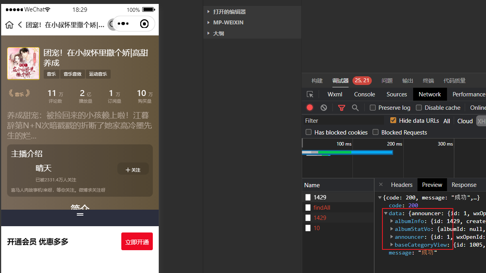
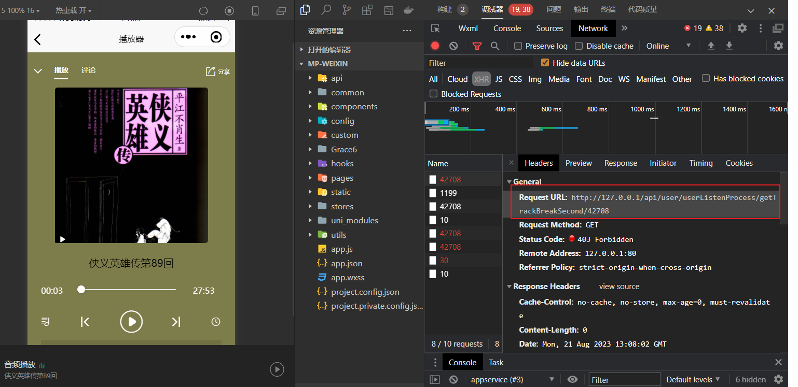

# 谷粒随享

## 专辑详情

主要功能如下：


我的-->创作中心-->专辑详情 查看专辑详细信息  或在检索列表中直接点击专辑都可以查看专辑详细信息！




http://127.0.0.1/api/search/albumInfo/125

在商品检索微服务中编写控制器：

以下是详情需要获取到的数据集

1. 通过专辑Id 获取专辑数据{已存在}
2. 通过专辑Id 获取专辑统计信息{不存在}
3. 通过三级分类Id 获取到分类数据{已存在}
4. 通过用户Id 获取到主播信息{已存在}

### 通过专辑Id 获取专辑数据

service-album-client 远程调用中添加

```java
package com.atguigu.tingshu.album.client;

import com.atguigu.tingshu.album.client.impl.AlbumInfoDegradeFeignClient;
import com.atguigu.tingshu.common.result.Result;
import com.atguigu.tingshu.model.album.AlbumInfo;
import com.atguigu.tingshu.vo.album.AlbumStatVo;
import org.springframework.cloud.openfeign.FeignClient;
import org.springframework.web.bind.annotation.GetMapping;
import org.springframework.web.bind.annotation.PathVariable;

/**
 * <p>
 * 产品列表API接口
 * </p>
 *
 */
@FeignClient(value = "service-album", fallback = AlbumInfoDegradeFeignClient.class)
public interface AlbumInfoFeignClient {

    /**
     * 获取专辑信息
     * @param id
     * @return
     */
    @GetMapping("api/album/albumInfo/getAlbumInfo/{id}")
    Result<AlbumInfo> getAlbumInfo(@PathVariable("id") Long id);
}
```

熔断类：

```java
package com.atguigu.tingshu.album.client.impl;

import com.atguigu.tingshu.album.client.AlbumInfoFeignClient;
import com.atguigu.tingshu.common.result.Result;
import com.atguigu.tingshu.model.album.AlbumInfo;
import com.atguigu.tingshu.vo.album.AlbumStatVo;
import org.springframework.stereotype.Component;

@Component
public class AlbumInfoDegradeFeignClient implements AlbumInfoFeignClient {
    @Override
    public Result<AlbumInfo> getAlbumInfo(Long id) {
        return null;
    }
}
```

AlbumInfoApiController 控制器

```java
/**
  * 根据id 获取到专辑信息
  * @param id
  * @return
  */
@Operation(summary = "获取专辑信息")
@GetMapping("/getAlbumInfo/{id}")
public Result<AlbumInfo> getAlbumInfoById(@PathVariable Long id) {
  //	调用服务层方法
  AlbumInfo albumInfo = albumInfoService.getAlbumInfoById(id);
  return Result.ok(albumInfo);
}
```

### 根据专辑Id 获取到状态信息

根据专辑Id 获取到状态数据之后，将数据封装到 AlbumStatVo 实体类中

```java
package com.atguigu.tingshu.vo.album;

import io.swagger.v3.oas.annotations.media.Schema;
import lombok.Data;

@Data
@Schema(description = "专辑统计信息")
public class AlbumStatVo {

   @Schema(description = "专辑id")
   private Long albumId;

   @Schema(description = "播放量")
   private Integer playStatNum;

   @Schema(description = "订阅量")
   private Integer subscribeStatNum;

   @Schema(description = "购买量")
   private Integer buyStatNum;

   @Schema(description = "评论数")
   private Integer commentStatNum;
}
```

AlbumInfoFeignClient 接口中添加

```java
/**
  * 通过专辑Id 获取到专辑状态信息
  * @param albumId
  * @return
  */
@GetMapping("api/album/albumInfo/getAlbumStatVo/{albumId}")
Result<AlbumStatVo> getAlbumStatVo(@PathVariable Long albumId);
```

熔断类：

```java
@Component
public class AlbumInfoDegradeFeignClient implements AlbumInfoFeignClient {

    @Override
    public Result<AlbumStatVo> getAlbumStatVo(Long albumId) {
        return null;
    }
}    
```


AlbumInfoApiController 控制器

```java
/**
  * 根据专辑Id 获取到统计信息
  * @param albumId
  * @return
  */
@Operation(summary = "获取到专辑统计信息")
@GetMapping("/getAlbumStatVo/{albumId}")
public Result getAlbumStatVo(@PathVariable Long albumId){
  //	获取服务层方法
  AlbumStatVo albumStatVo = this.albumInfoService.getAlbumStatVoByAlbumId(albumId);
  return Result.ok(albumStatVo);
}
```

接口与实现类

```java
/**
     * 根据专辑Id 获取到统计信息
     * @param albumId
     * @return
     */
AlbumStatVo getAlbumStatVoByAlbumId(Long albumId);
```

```java
@Override
public AlbumStatVo getAlbumStatVoByAlbumId(Long albumId) {
  //	调用mapper 层方法
  return albumInfoMapper.selectAlbumStat(albumId);
}
```

albumInfoMapper.java

```java
/**
* 根据专辑Id 获取到统计信息
* @param albumId
* @return
*/
AlbumStatVo selectAlbumStat(@Param("albumId") Long albumId);
```

albumInfoMapper.xml

```sql
<!--根据专辑Id 获取到统计数据-->
<select id="selectAlbumStat" resultType="com.atguigu.tingshu.vo.album.AlbumStatVo">
    select
        MAX(IF(info.statType = '0401', info.statNum, 0)) as playStatNum,
        MAX(IF(info.statType = '0402', info.statNum, 0)) as subscribeStatNum,
        MAX(IF(info.statType = '0403', info.statNum, 0)) as buyStatNum,
        MAX(IF(info.statType = '0404', info.statNum, 0)) as commentStatNum
    from (
             select
                 stat.album_id as albumId,
                 stat.stat_type as statType,
                 stat.stat_num as statNum
             from album_stat stat
             where album_id = #{albumId}
         ) info
    group by info.albumId
</select>
```


### 根据三级分类Id获取到分类信息数据

```java
package com.atguigu.tingshu.album.client;

import com.atguigu.tingshu.album.client.impl.CategoryDegradeFeignClient;
import com.atguigu.tingshu.common.result.Result;
import com.atguigu.tingshu.model.album.BaseCategoryView;
import org.springframework.cloud.openfeign.FeignClient;
import org.springframework.web.bind.annotation.GetMapping;

/**
 * <p>
 * 产品列表API接口
 * </p>
 *
 */
@FeignClient(value = "service-album", fallback = CategoryDegradeFeignClient.class)
public interface CategoryFeignClient {

    /**
     * 根据三级分类Id 获取到分类数据
     * @param category3Id
     * @return
     */
    @GetMapping("api/album/category/getCategoryView/{category3Id}")
    Result<BaseCategoryView> getCategoryView(@PathVariable Long category3Id);

}
```

熔断类：

```java
@Component
public class CategoryDegradeFeignClient implements CategoryFeignClient {


    @Override
    public Result<BaseCategoryView> getCategoryView(Long category3Id) {
        return null;
    }
}
```


BaseCategoryApiController 添加控制器

```java
/**
  * 根据三级分类Id 获取到分类信息
  * @param category3Id
  * @return
  */
@Operation(summary = "通过三级分类id查询分类信息")
@GetMapping("getCategoryView/{category3Id}")
public Result<BaseCategoryView> getCategoryView(@PathVariable Long category3Id){
  //	调用服务层方法
  BaseCategoryView baseCategoryView = baseCategoryService.getCategoryViewByCategory3Id(category3Id);
  return Result.ok(baseCategoryView);
}
```

接口：

```java
/**
* 根据三级分类Id 获取到分类信息
* @param category3Id
* @return
*/
BaseCategoryView getCategoryViewByCategory3Id(Long category3Id);
```

实现类：

```java
/**
	 * 根据三级分类Id获取到分类数据
	 * @param category3Id
	 * @return
	 */
@Override
public BaseCategoryView getCategoryViewByCategory3Id(Long category3Id) {
  return baseCategoryViewMapper.selectById(category3Id);
}
```

### 根据用户Id 获取主播信息

```java
@FeignClient(value = "service-user", fallback = UserInfoDegradeFeignClient.class)
public interface UserInfoFeignClient {

    /**
     * 根据userId 获取到用户信息
     * @param userId
     * @return
     */
    @GetMapping("api/user/userInfo/getUserInfoVo/{userId}")
    Result<UserInfoVo> getUserInfoVo(@PathVariable Long userId);
}
```

熔断类：

```java
@Component
public class UserInfoDegradeFeignClient implements UserInfoFeignClient {

    @Override
    public Result<UserInfoVo> getUserInfoVo(Long userId) {
        return null;
    }
}
```


UserInfoApiController 用户控制器

```java
/**
* 根据用户Id获取用户信息
* @param userId
* @return
*/
@Operation(summary = "根据用户id获取用户信息")
@GetMapping("getUserInfoVo/{userId}")
public Result<UserInfoVo> getUserInfoVo(@PathVariable Long userId) {
  //	获取用户信息
  UserInfoVo userInfoVo = userInfoService.getUserInfoVoByUserId(userId);
  return Result.ok(userInfoVo);
}
```

### 整合详情信息接口

回显时，后台需要提供将数据封装到map集合中;

result.put("albumInfo", albumInfo);			获取专辑信息
result.put("albumStatVo", albumStatVo);		获取专辑统计信息
result.put("baseCategoryView", baseCategoryView);	获取分类信息
result.put("announcer", userInfoVo);	获取主播信息

#### itemApiController 控制器

在service-list 微服务中添加 

```java
@Tag(name = "专辑详情管理")
@RestController
@RequestMapping("api/search/albumInfo")
@SuppressWarnings({"unchecked", "rawtypes"})
public class itemApiController {

   @Autowired
   private ItemService itemService;

   /**
    * 根据专辑Id 获取详情数据
    * @param albumId
    * @return
    */
   @GuiGuLogin(required = false)
   @Operation(summary = "专辑详情")
   @GetMapping("{albumId}")
   public Result getItem(@PathVariable Long albumId){
      // 获取到专辑详情数据
      Map<String,Object> result = this.itemService.getItem(albumId);
      // 返回数据
      return Result.ok(result);
   }
}
```

#### 接口

```java
package com.atguigu.tingshu.search.service;

import java.util.Map;

public interface ItemService {
    /**
     * 根据专辑Id 获取数据
     * @param albumId
     * @return
     */
    Map<String, Object> getItem(Long albumId);
}
```

#### 实现类


```java
package com.atguigu.tingshu.search.service.impl;

import com.alibaba.fastjson.JSON;
import com.atguigu.tingshu.album.client.*;
import com.atguigu.tingshu.common.cache.GuiguCache;
import com.atguigu.tingshu.common.result.Result;
import com.atguigu.tingshu.common.util.AuthContextHolder;
import com.atguigu.tingshu.model.album.AlbumInfo;
import com.atguigu.tingshu.model.album.BaseCategoryView;
import com.atguigu.tingshu.search.service.ItemService;
import com.atguigu.tingshu.vo.album.AlbumStatVo;
import com.atguigu.tingshu.vo.user.UserInfoVo;
import lombok.extern.slf4j.Slf4j;
import org.redisson.api.RedissonClient;
import org.springframework.beans.factory.annotation.Autowired;
import org.springframework.stereotype.Service;
import org.springframework.util.Assert;
import org.springframework.web.context.request.RequestContextHolder;
import org.springframework.web.context.request.ServletRequestAttributes;

import java.util.HashMap;
import java.util.Map;
import java.util.concurrent.CompletableFuture;
import java.util.concurrent.ThreadPoolExecutor;

@Slf4j
@Service
@SuppressWarnings({"unchecked", "rawtypes"})
public class ItemServiceImpl implements ItemService {

    @Autowired
    private AlbumInfoFeignClient albumInfoFeignClient;

    @Autowired
    private TrackInfoFeignClient trackInfoFeignClient;

    @Autowired
    private CategoryFeignClient categoryFeignClient;

    @Autowired
    private UserInfoFeignClient userInfoFeignClient;

    @Autowired
    private UserListenProcessFeignClient userListenProcessFeignClient;

    @Autowired
    private RedissonClient redissonClient;

    @Autowired
    private ThreadPoolExecutor threadPoolExecutor;

    @GuiguCache
    @Override
    public Map<String, Object> getItem(Long albumId) {
        Map<String, Object> result = new HashMap<>();

        //远程调用接口之前 提前知道用户访问的专辑id是否存在与布隆过滤器
//        RBloomFilter<Object> bloomFilter = redissonClient.getBloomFilter(RedisConstant.ALBUM_BLOOM_FILTER);
//        if (!bloomFilter.contains(albumId)) {
//            log.error("用户查询专辑不存在：{}", albumId);
//            //查询数据不存在直接返回空对象
//            return result;
//        }

        // 通过albumId 查询albumInfo
        CompletableFuture<AlbumInfo> albumCompletableFuture = CompletableFuture.supplyAsync(() -> {
            Result<AlbumInfo> albumInfoResult = albumInfoFeignClient.getAlbumInfo(albumId);
            Assert.notNull(albumInfoResult);
            AlbumInfo albumInfo = albumInfoResult.getData();
            // 保存albumInfo
            result.put("albumInfo", albumInfo);
            log.info("albumInfo:{}", JSON.toJSONString(albumInfo));
            return albumInfo;
        }, threadPoolExecutor);

        CompletableFuture<Void> albumStatCompletableFuture = CompletableFuture.runAsync(() -> {
            Result<AlbumStatVo> albumStatVoResult = albumInfoFeignClient.getAlbumStatVo(albumId);
            AlbumStatVo albumStatVo = albumStatVoResult.getData();
            result.put("albumStatVo", albumStatVo);
            log.info("albumStatVo:{}", JSON.toJSONString(albumStatVo));
        }, threadPoolExecutor);

        CompletableFuture<Void> baseCategoryViewCompletableFuture = albumCompletableFuture.thenAcceptAsync(albumInfo -> {
            Result<BaseCategoryView> baseCategoryViewResult = categoryFeignClient.getCategoryView(albumInfo.getCategory3Id());
            BaseCategoryView baseCategoryView = baseCategoryViewResult.getData();
            result.put("baseCategoryView", baseCategoryView);
            log.info("baseCategoryView:{}", JSON.toJSONString(baseCategoryView));
        }, threadPoolExecutor);

        CompletableFuture<Void> announcerCompletableFuture = albumCompletableFuture.thenAcceptAsync(albumInfo -> {
            Result<UserInfoVo> userInfoVoResult = userInfoFeignClient.getUserInfoVo(albumInfo.getUserId());
            UserInfoVo userInfoVo = userInfoVoResult.getData();
            result.put("announcer", userInfoVo);
            log.info("announcer:{}", JSON.toJSONString(userInfoVo));
        }, threadPoolExecutor);
       
        CompletableFuture.allOf(albumCompletableFuture, albumStatCompletableFuture, baseCategoryViewCompletableFuture, announcerCompletableFuture).join();
        return result;
    }
}
```


配置自定义线程池：

```java
package com.atguigu.tingshu.search.config;

import org.springframework.context.annotation.Bean;
import org.springframework.context.annotation.Configuration;

import java.util.concurrent.ArrayBlockingQueue;
import java.util.concurrent.ThreadPoolExecutor;
import java.util.concurrent.TimeUnit;

/**
 * @author atguigu-mqx
 * @ClassName ThreadPoolExecutorConfig
 * @description: TODO
 * @date 2023年09月24日
 * @version: 1.0
 */
@Configuration
public class ThreadPoolExecutorConfig {

    @Bean
    public ThreadPoolExecutor threadPoolExecutor(){
        //  自定义线程池-不能使用工具类创建线程池. 阻塞队列或最大线程个数是21亿，这样会导致OOM!
        ThreadPoolExecutor threadPoolExecutor = new ThreadPoolExecutor(
                8,    //  核心线程数 IO:2n  cpu:n+1
                16,   //  最大线程数
                3,  //  空闲线程存活时间
                TimeUnit.SECONDS, // 空闲线程存活时间单位
                new ArrayBlockingQueue<>(10) // 阻塞队列
        );
        return threadPoolExecutor;
    }
}
```

### 根据专辑Id获取专辑声音列表


http://127.0.0.1/api/album/trackInfo/findAlbumTrackPage/1593/1/10  获取专辑声音列表


##### 控制器

我们将数据都统一封装到 AlbumTrackListVo 实体类中

```java
package com.atguigu.tingshu.vo.album;

import io.swagger.v3.oas.annotations.media.Schema;
import lombok.Data;

import java.math.BigDecimal;
import java.util.Date;

@Data
@Schema(description = "用户专辑声音列表信息")
public class AlbumTrackListVo {

   @Schema(description = "声音id")
   private Long trackId;

   @Schema(description = "标题")
   private String trackTitle;

   @Schema(description = "声音媒体时长，单位秒")
   private BigDecimal mediaDuration;

   @Schema(description = "排序")
   private Integer orderNum;

   @Schema(description = "播放量")
   private Integer playStatNum;

   @Schema(description = "评论数")
   private Integer commentStatNum;

   @Schema(description = "发布时间")
   private Date createTime;

   @Schema(description = "是否显示付费标识，isShowPiadMark=true，则显示付费标识")
   private Boolean isShowPaidMark = false;

}
```

在service-album 微服务中添加控制器TrackInfoApiController. 获取专辑声音列表时

```java
/**
  * 根据专辑Id获取声音列表
  * @param albumId
  * @param page
  * @param limit
  * @return
  */
@GuiGuLogin(required = false)
@Operation(summary = "获取专辑声音分页列表")
@GetMapping("findAlbumTrackPage/{albumId}/{page}/{limit}")
public Result<IPage<AlbumTrackListVo>> findAlbumTrackPage(
		@Parameter(name = "albumId", description = "专辑id", required = true)
		@PathVariable Long albumId,
		@Parameter(name = "page", description = "当前页码", required = true)
		@PathVariable Long page,
		@Parameter(name = "limit", description = "每页记录数", required = true)
		@PathVariable Long limit) {
	//	获取用户Id
	Long userId = AuthContextHolder.getUserId();
	//	构建分页对象
	Page<AlbumTrackListVo> pageParam = new Page<>(page, limit);
	//	调用服务层方法
	IPage<AlbumTrackListVo> pageModel = trackInfoService.findAlbumTrackPage(pageParam, albumId, userId);
	//	返回数据
	return Result.ok(pageModel);
}
```

##### 接口

```java
public interface TrackInfoService extends IService<TrackInfo> {   
	IPage<AlbumTrackListVo> findAlbumTrackPage(Page<AlbumTrackListVo> pageParam, Long albumId, Long userId);
}
```

##### 实现类

思路：

1. 根据专辑Id 获取到声音列表 ，将数据封装到 AlbumTrackListVo 类中

   1. 用户为空的时候，只要是付费专辑，都需要在页面显示要付款的标识 {**但是，要出去试听集数**} isShowPaidMark=true

      付费类型： 0101-免费 0102-vip付费 0103-付费

   2. 用户不为空的时候

      1. 判断用户的类型 

         1. 专辑类型属于 vip 免费类型

            判断用户如果不是vip ，则需要付费

            判断用户如果是vip 但是已经过期了, 也需要显示付费

         2. 需要付费

            需要显示付费

         3. 统一处理需要付费业务

            ​    获取到声音Id列表集合 与 用户购买声音Id集合进行比较  [ 将用户购买的声音存储到map中，key=trackId value = 1或0; 1:表示购买过，0：表示没有购买过 ]

               如果声音Id集合不包含购买的声音Id，则将显示为付费，否则不需要付费


```java
@Override
public IPage<AlbumTrackListVo> findAlbumTrackPage(Page<AlbumTrackListVo> pageParam, Long albumId, Long userId) {
  //	根据专辑Id 获取到声音集合
  IPage<AlbumTrackListVo> pageInfo = trackInfoMapper.selectAlbumTrackPage(pageParam,albumId);

  //	判断用户是否需要付费：0101-免费 0102-vip付费 0103-付费
  AlbumInfo albumInfo = albumInfoService.getById(albumId);
  Assert.notNull(albumInfo,"专辑对象不能为空");
  //	判断用户是否登录
  if (null == userId){
    //	除免费的专辑都需要显示付费表示
    if (!SystemConstant.ALBUM_PAY_TYPE_FREE.equals(albumInfo.getPayType())){
      //	处理试听声音，获取需要付费的声音列表
      List<AlbumTrackListVo> albumTrackNeedPaidListVoList = pageInfo.getRecords().stream().filter(albumTrackListVo -> albumTrackListVo.getOrderNum().intValue() > albumInfo.getTracksForFree()).collect(Collectors.toList());
      if (!CollectionUtils.isEmpty(albumTrackNeedPaidListVoList)){
        albumTrackNeedPiadListVoList.forEach(albumTrackListVo -> {
          //	显示付费通知
          albumTrackListVo.setIsShowPiadMark(true);
        });
      }
    }
  } else {
    //	用户已登录
    //	声明变量是否需要付费，默认不需要付费
    boolean isNeedPaid = false;
    //  vip 付费情况
    if (SystemConstant.ALBUM_PAY_TYPE_VIPFREE.equals(albumInfo.getPayType())){
      //	获取用户信息
      Result<UserInfoVo> userInfoVoResult = userInfoFeignClient.getUserInfoVo(userId);
      Assert.notNull(userInfoVoResult,"用户信息不能为空");
      UserInfoVo userInfoVo = userInfoVoResult.getData();
      //	1.	VIP 免费,如果不是vip则需要付费，将这个变量设置为true，需要购买
      if (userInfoVo.getIsVip().intValue() == 0){
        isNeedPiad = true;
      }
      //1.1 如果是vip但是vip过期了（定时任务还为更新状态）
	  if(userInfoVo.getIsVip().intValue() == 1 && userInfoVo.getVipExpireTime().before(new Date())) {
		isNeedPiad = true;
	  }
    } else if(SystemConstant.ALBUM_PAY_TYPE_REQUIRE.equals(albumInfo.getPayType())){
      //	2.	付费
      isNeedPiad = true;
    }
    //需要付费，判断用户是否购买过专辑或声音
    if(isNeedPiad) {
      //	处理试听声音，获取需要付费的声音列表
      List<AlbumTrackListVo> albumTrackNeedPaidListVoList = pageInfo.getRecords().stream().filter(albumTrackListVo -> albumTrackListVo.getOrderNum().intValue() > albumInfo.getTracksForFree()).collect(Collectors.toList());
      //	判断
      if (!CollectionUtils.isEmpty(albumTrackNeedPaidListVoList)){
        //	判断用户是否购买该声音
        //	获取到声音Id 集合列表
        List<Long> trackIdList = albumTrackNeedPaidListVoList.stream().map(AlbumTrackListVo::getTrackId).collect(Collectors.toList());
        //	获取用户购买的声音列表
        Result<Map<Long, Integer>> mapResult = userInfoFeignClient.userIsPaidTrack(albumId,trackIdList);
        Assert.notNull(mapResult,"声音集合不能为空.");
        Map<Long, Integer> map = mapResult.getData();
        Assert.notNull(map,"map集合不能为空.");
        albumTrackNeedPaidListVoList.forEach(albumTrackListVo -> {          
            //	如果map.get(albumTrackListVo.getTrackId()) == 1 已经购买过，则不显示付费标识;
            boolean isBuy = map.get(albumTrackListVo.getTrackId()) == 1 ? false : true;
            albumTrackListVo.setIsShowPiadMark(isBuy);         
        });
      }
    }
  }
  // 返回集合数据
  return pageInfo;
}
```

#### 根据专辑Id 获取到声音列表

条件必须是当前已经**开放**并且是**审核通过状态**的数据,并且还需要获取到声音的**播放量以及评论数量**

##### TrackInfoMapper接口

```java
@Mapper
public interface TrackInfoMapper extends BaseMapper<TrackInfo> {
    /**
     * 获取专辑声音列表
     * @param pageParam
     * @param albumId
     * @return
     */
    IPage<AlbumTrackListVo> selectAlbumTrackPage(Page<AlbumTrackListVo> pageParam, @Param("albumId") Long albumId);

}
```

##### TrackInfoMapper.xml 映射文件

```xml
<!--根据专辑 Id 获取到声音列表-->
<select id="selectAlbumTrackPage" resultType="com.atguigu.tingshu.vo.album.AlbumTrackListVo">
  select
  info.trackId,
  info.trackTitle,
  info.mediaDuration,
  info.orderNum,
  info.createTime,
  MAX(IF(info.statType = '0701', info.statNum, 0)) as playStatNum,
  MAX(IF(info.statType = '0704', info.statNum, 0)) as commentStatNum
  from
  (select
  track.id as trackId,
  track.track_title as trackTitle,
  track.media_duration as mediaDuration,
  track.order_num as orderNum,
  track.create_time as createTime,
  stat.stat_type as statType,
  stat.stat_num as statNum
  from track_info track
  left join track_stat stat on stat.track_id = track.id
  where track.album_id = #{albumId} and track.is_open = '1' and track.status = '0501') info
  group by info.trackId
  order by info.orderNum asc
</select>
```


#### 判断用户是否购买声音列表

user_paid_album 这张表记录了用户购买过的专辑

如果购买过，则在 map 中存储数据 key=trackId value = 1

##### UserInfoFeignClient 远程调用接口中添加：

```java
/**
  * 判断用户是否购买声音列表
  * @param albumId
  * @param trackIdList
  * @return
  */
@PostMapping("api/user/userInfo/userIsPaidTrack/{albumId}")
Result<Map<Long, Integer>> userIsPaidTrack(@PathVariable("albumId") Long albumId, @RequestBody List<Long> trackIdList);
```

熔断类：

```java
@Component
public class UserInfoDegradeFeignClient implements UserInfoFeignClient {

    @Override
    public Result<Map<Long, Integer>> userIsPaidTrack(Long albumId, List<Long> trackIdList) {
        return null;
    }
}
```

##### UserInfoApiController 控制器

```java
/**
  * 判断用户是否购买声音列表
  * @param albumId
  * @param trackIdList
  * @return
  */
@GuiGuLogin(required = false)
@Operation(summary = "判断用户是否购买声音列表")
@PostMapping("userIsPaidTrack/{albumId}")
public Result<Map<Long, Integer>> userIsPaidTrack(@PathVariable Long albumId, @RequestBody List<Long> trackIdList) {
  //	获取用户Id
  Long userId = AuthContextHolder.getUserId();
  //	调用服务层方法
  Map<Long, Integer> map = userInfoService.userIsPaidTrack(userId, albumId, trackIdList);
  //	返回map 集合数据
  return Result.ok(map);
}
```

##### 接口

```java
/**
  * 判断用户是否购买过声音列表
  * @param userId
  * @param albumId
  * @param trackIdList
  * @return
  */
Map<Long, Integer> userIsPaidTrack(Long userId, Long albumId, List<Long> trackIdList);
```

##### 实现类

1. 根据用户Id，专辑Id 获取到用户付款专辑对象
   1. 如果对象不为空，说明购买过专辑，则设置在map集合中 声音Id为1  map.put(trackId,1); 并返回集合map
   2. 如果对象为空，说明用户没有购买过专辑，但是，需要查询当前用户Id是否购买过声音Id集合中的声音
      1. 判断当前专辑声音Id集合列表 中是否包含已购买的声音Id。
         1. true: 设置为1
         2. false: 设置为0

```java
@Override
public Map<Long, Integer> userIsPaidTrack(Long userId, Long albumId, List<Long> trackIdList) {
  //	根据UserId,albumId 获取到用户付款专辑对象
  LambdaQueryWrapper<UserPaidAlbum> userPaidAlbumLambdaQueryWrapper = new LambdaQueryWrapper<>();
  userPaidAlbumLambdaQueryWrapper.eq(UserPaidAlbum::getUserId,userId).eq(UserPaidAlbum::getAlbumId,albumId);
  UserPaidAlbum userPaidAlbum = userPaidAlbumMapper.selectOne(userPaidAlbumLambdaQueryWrapper);
  //	判断
  if (null != userPaidAlbum){
    //	创建一个map 集合
    HashMap<Long, Integer> map = new HashMap<>();
    //	如果查询到对应的专辑购买记录，则默认将声音Id 赋值为 1
    trackIdList.forEach(trackId->{
      map.put(trackId,1);
    });
    return map;
  } else {
    //	根据用户Id 与专辑Id 查询用户购买声音记录
    LambdaQueryWrapper<UserPaidTrack> userPaidTrackLambdaQueryWrapper = new LambdaQueryWrapper<>();
    userPaidTrackLambdaQueryWrapper.eq(UserPaidTrack::getUserId,userId).in(UserPaidTrack::getTrackId,trackIdList);
    List<UserPaidTrack> userPaidTrackList = userPaidTrackService.list(userPaidTrackLambdaQueryWrapper);
    //	获取到用户购买声音Id 集合
    List<Long> userPaidTrackIdList = userPaidTrackList.stream().map(UserPaidTrack::getTrackId).collect(Collectors.toList());
    //	创建一个map 集合
    HashMap<Long, Integer> map = new HashMap<>();
    trackIdList.forEach(trackId ->{
      if (userPaidTrackIdList.contains(trackId)){
        //	用户已购买声音
        map.put(trackId,1);
      }else {
        map.put(trackId,0);
      }
    });
    return map;
  }
}
```

## 声音详情

### 获取声音播放进度

在播放声音的时候，会有触发一个获取播放进度的控制器！因为页面每隔10s会自动触发一次保存功能，会将数据写入MongoDB中。所以我们直接从MongoDB中获取到声音的播放时间即可！



#### 控制器

在 service-user 微服务的 UserListenProcessApiController 控制器中添加

```java
/**
  * 获取声音播放的时间
  * @param trackId
  * @return
  */
@GuiGuLogin
@Operation(summary = "获取声音的上次跳出时间")
@GetMapping("/getTrackBreakSecond/{trackId}")
public Result<BigDecimal> getTrackBreakSecond(@PathVariable Long trackId) {
  //	获取用户Id
  Long userId = AuthContextHolder.getUserId();
  //	调用服务层方法
  BigDecimal trackBreakSecond = userListenProcessService.getTrackBreakSecond(userId, trackId);
  //	返回数据
  return Result.ok(trackBreakSecond);
}
```

#### 接口

```java
/**
  * 根据用户Id,声音Id 获取到播放进度
  * @param userId
  * @param trackId
  * @return
  */
BigDecimal getTrackBreakSecond(Long userId, Long trackId);
```

#### 实现类

思路：

1. 根据userId, 声音Id 获取数据 从MongoDB 获取数据 
2. 给集合起一个名称 userListenProcess_userId
3. 存储数据的时候，将数据封装到 UserListenProcess 这个对象中

```java
package com.atguigu.tingshu.model.user;

import io.swagger.v3.oas.annotations.media.Schema;
import lombok.Data;
import org.springframework.data.annotation.Id;
import org.springframework.data.mongodb.core.mapping.Document;

import java.math.BigDecimal;
import java.util.Date;

@Data
@Schema(description = "UserListenProcess")
@Document
public class UserListenProcess {

   @Schema(description = "id")
   @Id
   private String id;

   @Schema(description = "用户id")
   private Long userId;

   @Schema(description = "专辑id")
   private Long albumId;

   @Schema(description = "声音id，声音id为0时，浏览的是专辑")
   private Long trackId;

   @Schema(description = "相对于音频开始位置的播放跳出位置，单位为秒。比如当前音频总时长60s，本次播放到音频第25s处就退出或者切到下一首，那么break_second就是25")
   private BigDecimal breakSecond;

   @Schema(description = "是否显示")
   private Integer isShow;

   @Schema(description = "创建时间")
   private Date createTime;

   @Schema(description = "更新时间")
   private Date updateTime;

}
```

```java
@Override
public BigDecimal getTrackBreakSecond(Long userId, Long trackId) {
  //	根据用户Id,声音Id获取播放进度对象
  Query query = Query.query(Criteria.where("userId").is(userId).and("trackId").is(trackId));
  UserListenProcess userListenProcess = mongoTemplate.findOne(query, UserListenProcess.class, MongoUtil.getCollectionName(MongoUtil.MongoCollectionEnum.USER_LISTEN_PROCESS, userId));
  //	判断
  if (null != userListenProcess){
    //	获取到播放的跳出时间
    return userListenProcess.getBreakSecond();
  }
  return new BigDecimal("0");
}
```


### 更新播放进度


#### 实体类

在 UserListenProcessApiController 控制器中添加

页面每隔10秒左右更新播放进度.

1. 更新播放进度页面会传递 专辑Id ，秒数，声音Id 。后台会将这个三个属性封装到UserListenProcessVo 对象中。然后利用MongoDB进行存储到UserListenProcess实体类中！
2. 为了更好的统计声音播放次数，将用户信息与声音信息存储到缓存中，判断同一个用户在一天之内，对同一个声音多次播放，只计算一次。并且要发送消息给kafka。
3. kafka 监听消息并消费，更新专辑与声音的统计数据。

##### 接收前端页面传递参数实体类

```java
@Data
@Schema(description = "UserListenProcess")
public class UserListenProcessVo {

   @Schema(description = "专辑id")
   private Long albumId;

   @Schema(description = "声音id，声音id为0时，浏览的是专辑")
   private Long trackId;

   @Schema(description = "相对于音频开始位置的播放跳出位置，单位为秒。比如当前音频总时长60s，本次播放到音频第25s处就退出或者切到下一首，那么break_second就是25")
   @TableField("break_second")
   private BigDecimal breakSecond;

}
```

##### 数据存储实体类

```java
@Data
@Schema(description = "UserListenProcess")
@Document
public class UserListenProcess {

   @Schema(description = "id")
   @Id
   private String id;

   @Schema(description = "用户id")
   private Long userId;

   @Schema(description = "专辑id")
   private Long albumId;

   @Schema(description = "声音id，声音id为0时，浏览的是专辑")
   private Long trackId;

   @Schema(description = "相对于音频开始位置的播放跳出位置，单位为秒。比如当前音频总时长60s，本次播放到音频第25s处就退出或者切到下一首，那么break_second就是25")
   private BigDecimal breakSecond;

   @Schema(description = "是否显示")
   private Integer isShow;

   @Schema(description = "创建时间")
   private Date createTime;

   @Schema(description = "更新时间")
   private Date updateTime;

}
```

#### 控制器

```java
/**
  * 更新播放进度
  * @param userListenProcessVo
  * @return
  */
@GuiGuLogin
@Operation(summary = "更新播放进度")
@PostMapping("/updateListenProcess")
public Result updateListenProcess(@RequestBody UserListenProcessVo userListenProcessVo) {
  //	获取用户Id
  Long userId = AuthContextHolder.getUserId();
  //	调用服务层方法
  userListenProcessService.updateListenProcess(userId, userListenProcessVo);
  return Result.ok();
}
```

#### 接口

```java
/**
* 更新播放进度
* @param userId
* @param userListenProcessVo
*/
void updateListenProcess(Long userId, UserListenProcessVo userListenProcessVo);
```

#### 实现类

思路：

1. 根据用户Id，声音Id 查询当前存储对象信息
2. 如果对象不为空，修改当前对象的更新时间与跳出时间，并写入MongoDB
3. 如果对象为空，说明当前声音从来没有播放过，需要创建对象并赋值然后写入缓存中
4. 通过声音Id，用户Id 两个维度来判断是否存在当前声音记录
5. 如果存在，将声音存储到缓存中，在发送一个消息来更新声音的统计数据 封装发送消息的实体类 TrackStatMqVo

```java
@Data
@Schema(description = "TrackStatMqVo")
public class TrackStatMqVo {

   @Schema(description = "业务编号：去重使用")
   private String businessNo;

   @Schema(description = "专辑id")
   private Long albumId;

   @Schema(description = "声音id")
   private Long trackId;

   @Schema(description = "统计类型")
   private String statType;

   @Schema(description = "更新数目")
   private Integer count;

}
```

```java
@Override
public void updateListenProcess(Long userId, UserListenProcessVo userListenProcessVo) {
  // 根据用户Id，声音Id 设置查询条件
  Query query = Query.query(Criteria.where("userId").is(userId).and("trackId").is(userListenProcessVo.getTrackId()));
  UserListenProcess userListenProcess = this.mongoTemplate.findOne(query, UserListenProcess.class, MongoUtil.getCollectionName(MongoUtil.MongoCollectionEnum.USER_LISTEN_PROCESS, userId));
  //	判断
  if (null != userListenProcess){
    //	设置更新时间
    userListenProcess.setUpdateTime(new Date());
    //	设置跳出时间
    userListenProcess.setBreakSecond(userListenProcessVo.getBreakSecond());
    //	存储数据
    mongoTemplate.save(userListenProcess,MongoUtil.getCollectionName(MongoUtil.MongoCollectionEnum.USER_LISTEN_PROCESS,userId));
  } else {
    //	创建对象
    userListenProcess = new UserListenProcess();
    //	进行属性拷贝
    BeanUtils.copyProperties(userListenProcessVo, userListenProcess);
    //	设置Id
    userListenProcess.setId(ObjectId.get().toString());
    //	设置用户Id
    userListenProcess.setUserId(userId);
    //	设置是否显示
    userListenProcess.setIsShow(1);
    //	创建时间
    userListenProcess.setCreateTime(new Date());
    //	更新时间
    userListenProcess.setUpdateTime(new Date());
    //	保存数据
    mongoTemplate.save(userListenProcess, MongoUtil.getCollectionName(MongoUtil.MongoCollectionEnum.USER_LISTEN_PROCESS, userId));
  }
  //记录专辑与声音播放量，同一个用户同一个声音每天只记录一次播放量
  //专辑的播放量 = 声音播放量的总和   声音：用户
  String key = "user:track:" + new DateTime().toString("yyyyMMdd") + ":" + userId;
  Boolean isExist = redisTemplate.opsForValue().getBit(key, userListenProcessVo.getTrackId());
  if(!isExist) {
     redisTemplate.opsForValue().setBit(key, userListenProcessVo.getTrackId(), true);
  
     //  设置key 的过期时间
     LocalDateTime localDateTime = LocalDateTime.now().plusDays(1).plusHours(0).plusMinutes(0).plusSeconds(0).plusNanos(0);
     long timeout = ChronoUnit.SECONDS.between(LocalDateTime.now(),localDateTime);
     redisTemplate.expire(key, timeout, TimeUnit.SECONDS);
  
     //发送消息，更新播放量统计
     TrackStatMqVo trackStatMqVo = new TrackStatMqVo();
     trackStatMqVo.setBusinessNo(UUID.randomUUID().toString().replaceAll("-",""));
     trackStatMqVo.setAlbumId(userListenProcessVo.getAlbumId());
     trackStatMqVo.setTarckId(userListenProcessVo.getTrackId());
     trackStatMqVo.setStatType(SystemConstant.TRACK_STAT_PLAY);
     trackStatMqVo.setCount(1);
     kafkaService.sendMessage(KafkaConstant.QUEUE_TRACK_STAT_UPDATE, JSON.toJSONString(trackStatMqVo));
  }
}
```

##### 在service-album 监听消息

```java
@Slf4j
@Component
public class TrackReceiver {

    @Autowired
    private TrackInfoService trackInfoService;

    @Autowired
    private RedisTemplate redisTemplate;

    /**
      * 监听更新统计状态
      * @param consumerRecord
      */
    @KafkaListener(topics = KafkaConstant.QUEUE_TRACK_STAT_UPDATE)
    public void updateStat(ConsumerRecord<String,String> consumerRecord){
      //  获取发送的数据
      TrackStatMqVo trackStatMqVo = JSON.parseObject(consumerRecord.value(), TrackStatMqVo.class);
      log.info(" 更新声音统计："+JSON.toJSONString(trackStatMqVo));
      //  业务去重
      String key = trackStatMqVo.getBusinessNo();
      boolean isExist = redisTemplate.opsForValue().setIfAbsent(key, 1, 1, TimeUnit.HOURS);
      //  第一次执行
      if (isExist){
        //  调用服务层方法
        try{
 trackInfoService.updateStat(trackStatMqVo.getAlbumId(),trackStatMqVo.getTrackId(),trackStatMqVo.getStatType(),trackStatMqVo.getCount());
          } catch (Exception e){
          this.redisTemplate.delete(key);
          }
      }
    }
}
```

##### TrackInfoService接口

```java
/**
 * 更新统计方法
 * @param albumId
 * @param trackId
 * @param statType
 * @param count
 */
void updateStat(Long albumId, Long trackId, String statType,Integer count);
```

##### TrackInfoServiceImpl 实现类

```java
@Transactional
@Override
public void updateStat(Long albumId, Long trackId, String statType, Integer count) {
  //	更新声音播放数据
  trackInfoMapper.updateStat(trackId, statType, count);
  //	更新播放量
  if(statType.equals(SystemConstant.TRACK_STAT_PLAY)) {
    albumInfoService.updateStat(albumId, SystemConstant.ALBUM_STAT_PLAY, count);
  }
}
```

##### 更新声音播放量

###### TrackInfoMapper 添加方法

```java
/**
   * 更新评论数据
   * @param trackId
   * @param statType
   * @param count
   */
Integer updateStat(@Param("trackId") Long trackId, @Param("statType") String statType, @Param("count") Integer count)
```

###### TrackInfoMapper.xml 实现

```xml
<!--更新统计状态-->
  <update id="updateStat">
        update track_stat
        set stat_num = stat_num + #{count}
where track_id = #{trackId} and stat_type = #{statType}
</update>
```

##### 更新专辑的播放量

###### AlbumInfoService 接口

```java
/**
  * 更新播放量
  * @param albumId
  * @param statType
  * @param count
  */
void updateStat(Long albumId, String statType, Integer count);
```

###### AlbumInfoServiceImpl 实现类

```java
@Override
public void updateStat(Long albumId, String statType, Integer count) {
  //	更新数据
  albumInfoMapper.updateStat(albumId, statType, count);
}
```

###### AlbumInfoMapper接口

```java
/**
  * 更新播放量
  * @param albumId
  * @param statType
  * @param count
  */
Integer updateStat(@Param("albumId") Long albumId, @Param("statType") String statType, @Param("count") Integer count);
```

###### AlbumInfoMapper.xml 实现

```xml
<update id="updateStat">
        update album_stat
        set stat_num = stat_num + #{count}
where album_id = #{albumId} and stat_type = #{statType}
</update>
```

### 声音统计


统计声音需要更新的数据如下，我们将数据封装到一个实体类中便于操作

```java
@Data
@Schema(description = "用户声音统计信息")
public class TrackStatVo {


   @Schema(description = "播放量")
   private Integer playStatNum;

   @Schema(description = "订阅量")
   private Integer collectStatNum;

   @Schema(description = "点赞量")
   private Integer praiseStatNum;

   @Schema(description = "评论数")
   private Integer commentStatNum;

}
```

#### 控制器

在TrackInfoApiController 控制器中添加

```java
/**
  * 获取声音统计接口
  * @param trackId
  * @return
  */
@Operation(summary = "获取声音统计信息")
@GetMapping("getTrackStatVo/{trackId}")
public Result<TrackStatVo> getTrackStatVo(@PathVariable Long trackId) {
  //	调用服务层方法
  TrackStatVo trackStatVo = trackInfoService.getTrackStatVoByTrackId(trackId);
  //	返回对象
  return Result.ok(trackStatVo);
}
```

#### 接口

```java
/**
  * 根据声音Id 获取统计信息
  * @param trackId
  * @return
  */
TrackStatVo getTrackStatVoByTrackId(Long trackId);
```

#### 实现类

```java
 @Override
 public TrackStatVo getTrackStatVoByTrackId(Long trackId) {
 	//	调用mapper 层方法
 	return trackInfoMapper.selectTrackStat(trackId);
 }
```

TrackInfoMapper.java

```java
/**
  * 根据声音Id 获取到声音统计
  * @param trackId
  * @return
  */
TrackStatVo selectTrackStat(Long trackId);
```

TrackInfoMapper.xml

```java
<!--  根据声音Id统计声音状态.  -->
<select id="selectTrackStat" resultType="com.atguigu.tingshu.vo.album.TrackStatVo">
        select
            MAX(IF(info.statType = '0701', info.statNum, 0)) as playStatNum,
MAX(IF(info.statType = '0702', info.statNum, 0)) as collectStatNum,
MAX(IF(info.statType = '0703', info.statNum, 0)) as praiseStatNum,
MAX(IF(info.statType = '0704', info.statNum, 0)) as commentStatNum
        from (
  select
                     stat.track_id as trackId,
  stat.stat_type as statType,
  stat.stat_num as statNum
                 from track_stat stat
                 where track_id = #{trackId}
) info
        group by info.trackId
</select>
```

