## 谷粒随享

## 订单购买

购买专辑分为：购买专辑，购买声音，vip余额购买

在**首页**点击**VIP免费** 会出现访问VIP服务配置管理接口

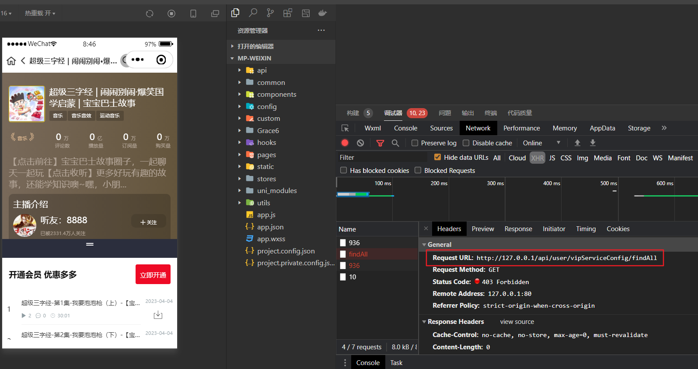

### 获取vip服务配置信息

在service-user 微服务模块中的  VipServiceConfigApiController 控制器添加映射路径，返回 VipServiceConfig 实体类的集合数据。也就是查询vip_service_config表中的集合数据。

```java
package com.atguigu.tingshu.user.api;

import com.atguigu.tingshu.common.result.Result;
import com.atguigu.tingshu.model.user.VipServiceConfig;
import com.atguigu.tingshu.user.service.VipServiceConfigService;
import io.swagger.v3.oas.annotations.Operation;
import io.swagger.v3.oas.annotations.tags.Tag;
import org.springframework.beans.factory.annotation.Autowired;
import org.springframework.web.bind.annotation.GetMapping;
import org.springframework.web.bind.annotation.RequestMapping;
import org.springframework.web.bind.annotation.RestController;

import java.util.List;

@Tag(name = "VIP服务配置管理接口")
@RestController
@RequestMapping("api/user/vipServiceConfig")
@SuppressWarnings({"unchecked", "rawtypes"})
public class VipServiceConfigApiController {

	@Autowired
	private VipServiceConfigService vipServiceConfigService;

	@Operation(summary = "获取全部VIP 服务配置信息")
	@GetMapping("findAll")
	public Result<List<VipServiceConfig>> findAll(){
		//	调用服务层方法
		List<VipServiceConfig> list = this.vipServiceConfigService.list();
		return Result.ok(list);
	}
}
```

### 购买vip 与 专辑订单

购买VIP入口：

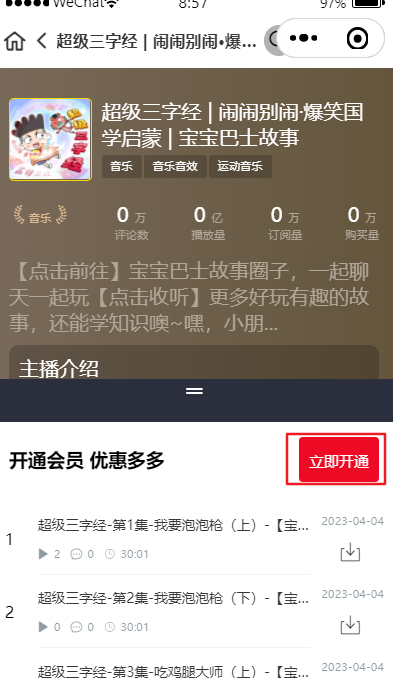

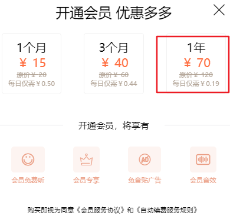

购买专辑入口：**看专辑表的price_type 类型 0201 单独购买声音 0202 只能购买整张专辑**

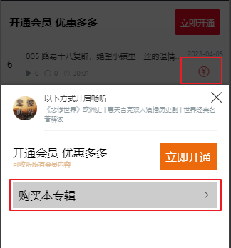

购买声音入口：暂无，有的专辑支持单独购买声音才能看见 购买声音的控制器！

会出现下订单的控制器：http://127.0.0.1/api/order/orderInfo/trade

订单流程图如下：

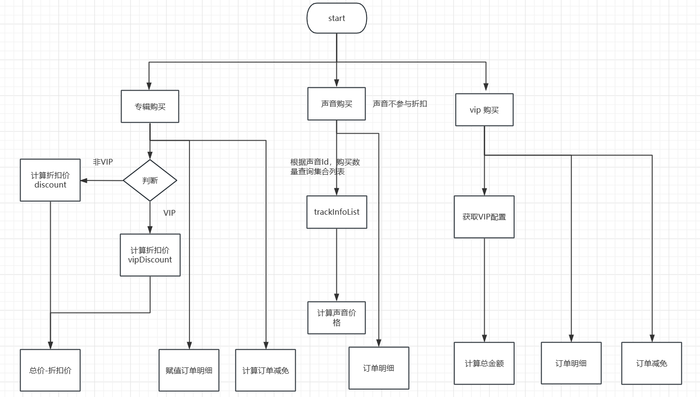

访问订单控制器时，将提交的数据封装到当前实体对象中 TradeVo

```java
@Schema(description = "订单确认对象")
public class TradeVo {

    @NotEmpty(message = "付款项目类型不能为空")
    @Schema(description = "付款项目类型: 1001-专辑 1002-声音 1003-vip会员", required = true)
    private String itemType;

    @Positive(message = "付款项目类型Id不能为空")
    @Schema(description = "付款项目类型Id", required = true)
    private Long itemId;

    @Schema(description = "针对声音购买，购买当前集往后多少集", required = false)
    private Integer trackCount;

}
```

将返回数据封装到OrderInfoVo

```java
package com.atguigu.tingshu.vo.order;

import com.atguigu.tingshu.common.util.Decimal2Serializer;
import com.fasterxml.jackson.databind.annotation.JsonSerialize;
import io.swagger.v3.oas.annotations.media.Schema;
import jakarta.validation.Valid;
import jakarta.validation.constraints.DecimalMax;
import jakarta.validation.constraints.DecimalMin;
import jakarta.validation.constraints.Digits;
import jakarta.validation.constraints.NotEmpty;
import lombok.Data;

import java.math.BigDecimal;
import java.util.List;

@Data
@Schema(description = "订单对象")
public class OrderInfoVo {

    @NotEmpty(message = "交易号不能为空")
    @Schema(description = "交易号", required = true)
    private String tradeNo;

    @NotEmpty(message = "支付方式不能为空")
    @Schema(description = "支付方式：1101-微信 1102-支付宝 1103-账户余额", required = true)
    private String payWay;

    @NotEmpty(message = "付款项目类型不能为空")
    @Schema(description = "付款项目类型: 1001-专辑 1002-声音 1003-vip会员", required = true)
    private String itemType;

    /**
     * value：最小值
     * inclusive：是否可以等于最小值，默认true，>= 最小值
     * message：错误提示（默认有一个错误提示i18n支持中文）
     *
     * @DecimalMax 同上
     * @Digits integer： 整数位最多几位
     * fraction：小数位最多几位
     * message：同上，有默认提示
     */
    @DecimalMin(value = "0.00", inclusive = false, message = "订单原始金额必须大于0.00")
    @DecimalMax(value = "9999.99", inclusive = true, message = "订单原始金额必须大于9999.99")
    @Digits(integer = 4, fraction = 2)
    @Schema(description = "订单原始金额", required = true)
    @JsonSerialize(using = Decimal2Serializer.class)
    private BigDecimal originalAmount;

    @DecimalMin(value = "0.00", inclusive = true, message = "减免总金额必须大于0.00")
    @DecimalMax(value = "9999.99", inclusive = true, message = "减免总金额必须大于9999.99")
    @Digits(integer = 4, fraction = 2)
    @Schema(description = "减免总金额", required = true)
    @JsonSerialize(using = Decimal2Serializer.class)
    private BigDecimal derateAmount;

    @DecimalMin(value = "0.00", inclusive = false, message = "订单总金额必须大于0.00")
    @DecimalMax(value = "9999.99", inclusive = true, message = "订单总金额必须大于9999.99")
    @Digits(integer = 4, fraction = 2)
    @Schema(description = "订单总金额", required = true)
    @JsonSerialize(using = Decimal2Serializer.class)
    private BigDecimal orderAmount;

    @Valid
    @NotEmpty(message = "订单明细列表不能为空")
    @Schema(description = "订单明细列表", required = true)
    private List<OrderDetailVo> orderDetailVoList;

    @Schema(description = "订单减免明细列表")
    private List<OrderDerateVo> orderDerateVoList;

    @Schema(description = "时间戳", required = true)
    private Long timestamp;
    
    @Schema(description = "签名", required = true)
    private String sign;
}
```

#### 控制器

在service-order 微服务中编写确定订单控制器 ，

```java
package com.atguigu.tingshu.order.api;

import com.atguigu.tingshu.common.login.GuiGuLogin;
import com.atguigu.tingshu.common.result.Result;
import com.atguigu.tingshu.common.util.AuthContextHolder;
import com.atguigu.tingshu.order.service.OrderInfoService;
import com.atguigu.tingshu.vo.order.OrderInfoVo;
import com.atguigu.tingshu.vo.order.TradeVo;
import io.swagger.v3.oas.annotations.Operation;
import io.swagger.v3.oas.annotations.tags.Tag;
import org.springframework.beans.factory.annotation.Autowired;
import org.springframework.validation.annotation.Validated;
import org.springframework.web.bind.annotation.PostMapping;
import org.springframework.web.bind.annotation.RequestBody;
import org.springframework.web.bind.annotation.RequestMapping;
import org.springframework.web.bind.annotation.RestController;

@Tag(name = "订单管理")
@RestController
@RequestMapping("api/order/orderInfo")
@SuppressWarnings({"unchecked", "rawtypes"})
public class OrderInfoApiController {

	@Autowired
	private OrderInfoService orderInfoService;

	/**
	 * 确认订单
	 * @param tradeVo
	 * @return
	 */
	@GuiGuLogin
	@Operation(summary = "确认订单")
	@PostMapping("trade")
	public Result<OrderInfoVo> trade(@RequestBody @Validated TradeVo tradeVo) {
		// 获取到用户Id
		Long userId = AuthContextHolder.getUserId();
		//	调用服务层方法
		OrderInfoVo orderInfoVo = orderInfoService.trade(tradeVo, userId);
		//	返回数据
		return Result.ok(orderInfoVo);
	}
}
```

#### 接口

```java
public interface OrderInfoService extends IService<OrderInfo> {
    /**
     * 确定订单
     * @param tradeVo
     * @param userId
     * @return
     */
    OrderInfoVo trade(TradeVo tradeVo, Long userId);
}
```

#### 实现类

思路：

1. 专辑订单

   1. 判断用户是否购买过专辑
      1. 如果已购买抛出异常
      2. 未购买{要给订单明细，减免金额，总金额等属性赋值}
         1. 判断用户是否属于vip
            1. vip  计算订单总价与折扣价 赋值订单明细与减免明细
            2. 非vip 计算订单总价与折扣价 赋值订单明细与减免明细

2. vip 订单

   1. 根据Id 获取到vip 配置信息
   2. 赋值原始金额，减免金额，总金额，订单明细，减免金额

3. 生成一个流水号存储到缓存，防止用户重复提交订单

4. 给OrderInfoVo 实体类赋值

   1. 防止用户非法操作订单金额，将订单对象OrderInfoVo变为字符串，在转换为map。在通过工具类SignHelper将map 变为字符串赋值给签名字段

5. 最后返回OrderInfoVo 对象


```java
@Override
public OrderInfoVo trade(TradeVo tradeVo, Long userId) {
  //获取用户信息
  Result<UserInfoVo> userInfoVoResult = userInfoFeignClient.getUserInfoVo(userId);
  Assert.notNull(userInfoVoResult);
  UserInfoVo userInfoVo = userInfoVoResult.getData();
  Assert.notNull(userInfoVo);
  //  订单原始金额
  BigDecimal originalAmount = new BigDecimal("0.00");
  //  减免总金额
  BigDecimal derateAmount = new BigDecimal("0.00");
  //  订单总价
  BigDecimal orderAmount = new BigDecimal("0.00");
  //  订单明细集合
  List<OrderDetailVo> orderDetailVoList = new ArrayList<>();
  //  订单减免明细列表
  List<OrderDerateVo> orderDerateVoList = new ArrayList<>();
  //  1001 专辑
  if (tradeVo.getItemType().equals(SystemConstant.ORDER_ITEM_TYPE_ALBUM)){
    //  判断用户是否购买过专辑
    Result<Boolean> isPaidAlbumResult = this.userInfoFeignClient.isPaidAlbum(tradeVo.getItemId());
    Assert.notNull(isPaidAlbumResult);
    Boolean isPaidAlbum = isPaidAlbumResult.getData();
    Assert.notNull(isPaidAlbum);
    if (isPaidAlbum){
      throw new GuiguException(ResultCodeEnum.REPEAT_BUY_ERROR);
    }
    //  根据专辑Id 获取到专辑数据
    Result<AlbumInfo> albumInfoResult = albumInfoFeignClient.getAlbumInfo(tradeVo.getItemId());
    Assert.notNull(albumInfoResult,"返回专辑结果集不能为空");
    AlbumInfo albumInfo = albumInfoResult.getData();
    Assert.notNull(albumInfo,"专辑对象不能为空");
    //  判断当前用户是否是vip
    if (userInfoVo.getIsVip().intValue()==0){
      //  非VIP 用户
      originalAmount = albumInfo.getPrice();
      //  判断是否打折 , 不等于-1 就是打折
      if (albumInfo.getDiscount().intValue() != -1){
        //  打折 100 8  100*0.8
        derateAmount = originalAmount.multiply(new BigDecimal("10").subtract(albumInfo.getDiscount())).divide(new BigDecimal(10),2, RoundingMode.HALF_UP);
      }
      //  订单总价
      orderAmount = originalAmount.subtract(derateAmount);
    } else {
      // VIP会员
      originalAmount = albumInfo.getPrice();
      //discount=-1,不打折，折扣如：8折 9.5折
      if (albumInfo.getVipDiscount().intValue() != -1) {
        derateAmount = albumInfo.getPrice().multiply(new BigDecimal(10).subtract(albumInfo.getVipDiscount())).divide(new BigDecimal(10), 2, RoundingMode.HALF_UP);
      }
      //  订单总价
      orderAmount = originalAmount.subtract(derateAmount);
    }                              
    //  订单明细
    OrderDetailVo orderDetailVo = new OrderDetailVo();
    orderDetailVo.setItemId(tradeVo.getItemId());
    orderDetailVo.setItemName(albumInfo.getAlbumTitle());
    orderDetailVo.setItemUrl(albumInfo.getCoverUrl());
    orderDetailVo.setItemPrice(albumInfo.getPrice());
    orderDetailVoList.add(orderDetailVo);

    //  添加订单减免
    if (originalAmount.subtract(orderAmount).doubleValue() != 0) {
      OrderDerateVo orderDerateVo = new OrderDerateVo();
      orderDerateVo.setDerateType(SystemConstant.ORDER_DERATE_ALBUM_DISCOUNT);
      orderDerateVo.setDerateAmount(originalAmount.subtract(orderAmount));
      orderDerateVoList.add(orderDerateVo);
    }
  } else if (tradeVo.getItemType().equals(SystemConstant.ORDER_ITEM_TYPE_VIP)){
    //  根据id 获取VIP 服务配置信息
    Result<VipServiceConfig> vipServiceConfigResult = vipServiceConfigFeignClient.getVipServiceConfig(tradeVo.getItemId());
    Assert.notNull(vipServiceConfigResult,"返回vip配置结果集不能为空");
    VipServiceConfig vipServiceConfig = vipServiceConfigResult.getData();
    Assert.notNull(vipServiceConfig,"返回vip配置对象不能为空");

    originalAmount = vipServiceConfig.getPrice();
    derateAmount = vipServiceConfig.getPrice().subtract(vipServiceConfig.getDiscountPrice());
    orderAmount = originalAmount.subtract(derateAmount);

    //订单明细
    OrderDetailVo orderDetailVo = new OrderDetailVo();
    orderDetailVo.setItemId(tradeVo.getItemId());
    orderDetailVo.setItemName("VIP会员"+vipServiceConfig.getName());
    orderDetailVo.setItemUrl(vipServiceConfig.getImageUrl());
    orderDetailVo.setItemPrice(vipServiceConfig.getDiscountPrice());
    orderDetailVoList.add(orderDetailVo);

    //添加订单减免
    if (originalAmount.subtract(orderAmount).doubleValue() != 0) {
      OrderDerateVo orderDerateVo = new OrderDerateVo();
      orderDerateVo.setDerateType(SystemConstant.ORDER_DERATE_VIP_SERVICE_DISCOUNT);
      orderDerateVo.setDerateAmount(originalAmount.subtract(orderAmount));
      orderDerateVoList.add(orderDerateVo);
    }
  }
  // 防重：生成一个唯一标识，保存到redis中一份
  String tradeNoKey = "user:trade:" + userId;
  // 定义一个流水号
  String tradeNo = UUID.randomUUID().toString().replace("-", "");
  redisTemplate.opsForValue().set(tradeNoKey, tradeNo);

  //构造结果
  OrderInfoVo orderInfoVo = new OrderInfoVo();
  orderInfoVo.setItemType(tradeVo.getItemType());
  orderInfoVo.setOriginalAmount(originalAmount);
  orderInfoVo.setDerateAmount(derateAmount);
  orderInfoVo.setOrderAmount(orderAmount);
  orderInfoVo.setTradeNo(tradeNo);
  orderInfoVo.setOrderDetailVoList(orderDetailVoList);
  orderInfoVo.setOrderDerateVoList(orderDerateVoList);
  orderInfoVo.setTimestamp(SignHelper.getTimestamp());
  //  支付方式默认值 目的是防止用户在前端篡改金额数据
  orderInfoVo.setPayWay(SystemConstant.ORDER_PAY_WAY_WEIXIN);
  //  生成签名
  Map<String, Object> parameterMap = JSON.parseObject(JSON.toJSONString(orderInfoVo), Map.class);
  String sign = SignHelper.getSign(parameterMap);
  orderInfoVo.setSign(sign);
  //  返回对象
  return orderInfoVo;
}
```

### 确定订单远程调用方法

在service-util 微服务中添加远程 feign 远程调用拦截器，来获取token 数据。

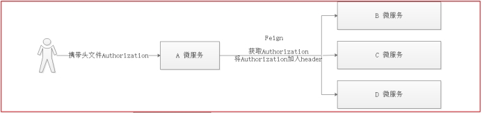

如上图：因为微服务之间并没有传递头文件，所以我们可以定义一个拦截器，每次微服务调用之前都先检查下头文件，将请求的头文件中的用户信息再放入到header中，再调用其他微服务即可。

```java
package com.atguigu.tingshu.common.interceptor;

import feign.RequestInterceptor;
import feign.RequestTemplate;
import jakarta.servlet.http.HttpServletRequest;
import org.springframework.stereotype.Component;
import org.springframework.web.context.request.RequestAttributes;
import org.springframework.web.context.request.RequestContextHolder;
import org.springframework.web.context.request.ServletRequestAttributes;

@Component
public class FeignInterceptor implements RequestInterceptor {

    public void apply(RequestTemplate requestTemplate){
        //  获取请求对象
        RequestAttributes requestAttributes = RequestContextHolder.getRequestAttributes();
        //异步编排 与 MQ消费者端 为 null
        if(null != requestAttributes) {
            ServletRequestAttributes servletRequestAttributes = (ServletRequestAttributes)requestAttributes;
            HttpServletRequest request = servletRequestAttributes.getRequest();
            String token = request.getHeader("token");
            requestTemplate.header("token", token);
        }
    }
}
```


#### 判断用户是否购买过专辑

service-user-client 远程调用 UserInfoFeignClient 添加

```java
/**
 * 判断用户是否购买过专辑
 * @param albumId
 * @return
 */
@GetMapping("api/user/userInfo/isPaidAlbum/{albumId}")
Result<Boolean> isPaidAlbum(@PathVariable("albumId") Long albumId);
```

熔断类：

```java
@Override
public Result<Boolean> isPaidAlbum(Long albumId) {
    return null;
}
```

service-user 微服务的控制器

```java
/**
 * 判断用户是否购买过专辑
 * @param albumId
 * @return
 */
@GuiGuLogin
@Operation(summary = "判断用户是否购买过专辑")
@GetMapping("isPaidAlbum/{albumId}")
public Result<Boolean> isPaidAlbum(@PathVariable Long albumId) {
   // 获取到用户Id
   Long userId = AuthContextHolder.getUserId();
   // 调用服务层方法
   Boolean flag = userInfoService.isPaidAlbum(userId, albumId);
   return Result.ok(flag);
}
```

接口与实现

```java
/**
 * 根据用户Id 与专辑Id 查询结果
 * @param userId
 * @param albumId
 * @return
 */
Boolean isPaidAlbum(Long userId, Long albumId);
```

```java
@Override
public Boolean isPaidAlbum(Long userId, Long albumId) {
   // 根据用户Id 与专辑Id 查询是否有记录
   Long count = userPaidAlbumMapper.selectCount(new LambdaQueryWrapper<UserPaidAlbum>().eq(UserPaidAlbum::getUserId, userId).eq(UserPaidAlbum::getAlbumId, albumId));
   if (count>0){
      return true;
   }
   return false;
}
```


#### 根据Id 获取vip 配置信息

在service-user-client 模块中添加

```java
package com.atguigu.tingshu.album.client;

import com.atguigu.tingshu.album.client.impl.VipServiceConfigDegradeFeignClient;
import com.atguigu.tingshu.common.result.Result;
import com.atguigu.tingshu.model.user.VipServiceConfig;
import org.springframework.cloud.openfeign.FeignClient;
import org.springframework.web.bind.annotation.GetMapping;
import org.springframework.web.bind.annotation.PathVariable;

/**
 * <p>
 * 产品列表API接口
 * </p>
 */
@FeignClient(value = "service-user", fallback = VipServiceConfigDegradeFeignClient.class)
public interface VipServiceConfigFeignClient {

    /**
     * 根据itemId获取VIP服务配置信息
     * @param id
     * @return
     */
    @GetMapping("api/user/vipServiceConfig/getVipServiceConfig/{id}")
    Result<VipServiceConfig> getVipServiceConfig(@PathVariable("id") Long id);
}
```

熔断类：

```java
package com.atguigu.tingshu.album.client.impl;


import com.atguigu.tingshu.album.client.VipServiceConfigFeignClient;
import com.atguigu.tingshu.common.result.Result;
import com.atguigu.tingshu.model.user.VipServiceConfig;
import org.springframework.stereotype.Component;

@Component
public class VipServiceConfigDegradeFeignClient implements VipServiceConfigFeignClient {

    @Override
    public Result<VipServiceConfig> getVipServiceConfig(Long id) {
        return null;
    }
}
```

service-user 微服务模块添加控制器

在VipServiceConfigApiController控制器中添加

```java
/**
 * 根据id获取VIP服务配置信息
 * @param id
 * @return
 */
@Operation(summary = "根据id获取VIP服务配置信息")
@GetMapping("getVipServiceConfig/{id}")
public Result<VipServiceConfig> getVipServiceConfig(@PathVariable Long id) {
  return Result.ok(vipServiceConfigService.getById(id));
}
```

### 获取账户余额

#### 初始化账户

在用户注册的时候，就进行了初始化信息操作！

#### 显示账户的余额

当刷新主页的时候，会加载当前余额数据。

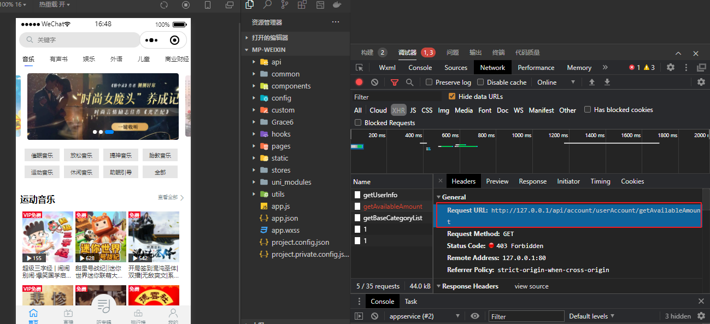

service-account 微服务中UserAccountApiController

控制器

```java
/**
 * 获取账户可用余额
 * @return
 */
@GuiGuLogin
@Operation(summary = "获取账号可用金额")
@GetMapping("getAvailableAmount")
public Result<BigDecimal> getAvailableAmount() {
	//	调用服务层方法
	return Result.ok(userAccountService.getAvailableAmount(AuthContextHolder.getUserId()));
}
```

接口：

```java
 /**
  * 获取账户可用余额
  * @param userId
  * @return
  */
 BigDecimal getAvailableAmount(Long userId);

 /**
  * 根据用户Id 获取到可用余额对象
  * @param userId
  * @return
  */
 UserAccount getUserAccountByUserId(Long userId);
```

实现类：

```java
@Override
public BigDecimal getAvailableAmount(Long userId) {
  //	根据用户Id 获取到用户余额对象
  UserAccount userAccount = this.getUserAccountByUserId(userId);
  return userAccount.getAvailableAmount();
}

@Override
public UserAccount getUserAccountByUserId(Long userId) {
  return this.getOne(new LambdaQueryWrapper<UserAccount>().eq(UserAccount::getUserId, userId));
}
```

### 获取用户声音分集购买支付列表

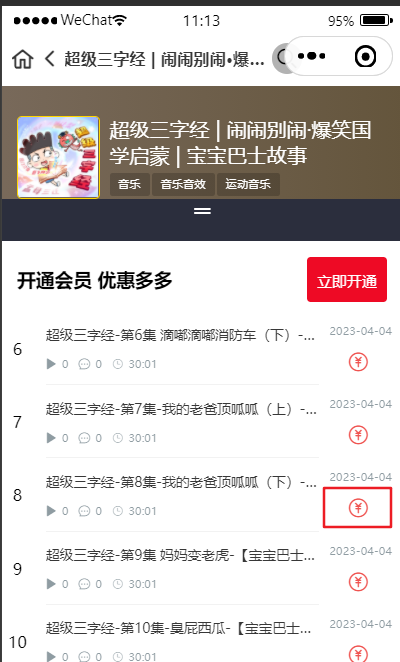

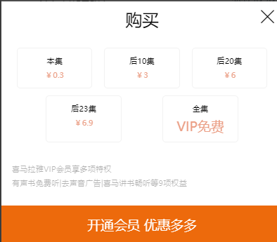

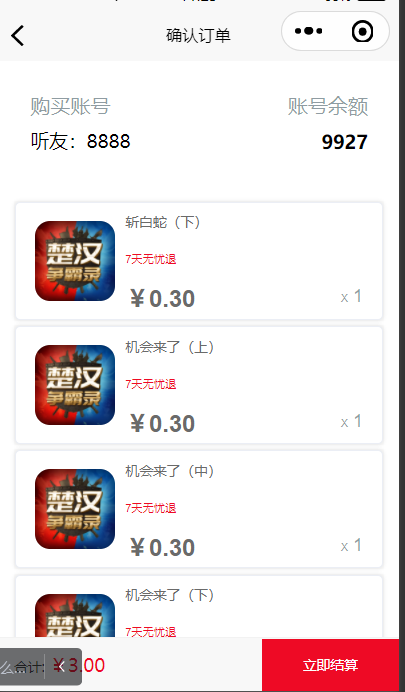

http://127.0.0.1/api/album/trackInfo/findUserTrackPaidList/20759

#### 控制器

TrackInfoApiController 控制器返回数据格式如下： 因为当前专辑只支持单集购买！专辑的价格是 album_info.price --> 当前专辑中的一条声音的价格  **声音总价= album_info.price*trackCount**

album_info 表中 price_type类型分为： **0201-单集** 0202-整专辑 

```java
Map<String, Object> map = new HashMap<>();
map.put("name","本集"); // 显示文本
map.put("price",albumInfo.getPrice()); // 专辑声音对应的价格
map.put("trackCount",0); // 记录购买集数
list.add(map);
```

```java
/**
 * 获取用户声音分集购买支付列表
 * @param trackId
 * @return
 */
@GuiGuLogin
@Operation(summary = "获取用户声音分集购买支付列表")
@GetMapping("findUserTrackPaidList/{trackId}")
public Result<List<Map<String, Object>>> findUserTrackPaidList(@PathVariable Long trackId) {
   // 获取购买记录集合
   List<Map<String,Object>> map = trackInfoService.findUserTrackPaidList(trackId);
   return Result.ok(map);
}
```

#### 接口

```java
/**
 * 根据声音Id 获取购买列表
 * @param trackId
 * @return
 */
List<Map<String, Object>> findUserTrackPaidList(Long trackId);
```

#### 实现类

思路：

1. 先根据专辑Id **{用户Id}**获取到专辑对应的声音Id集合列表
2. 获取到当前专辑{albumId}中大于{orderNum}当前声音Id的集合列表
3. 获取到当前要支付的声音Id列表{ 2 与 1 做一个排除即可 }
4. 构造声音分集购买列表

mybatis-plus 中的一些比较符号含义

lt：[less](https://so.csdn.net/so/search?q=less&spm=1001.2101.3001.7020) than 小于
le：less than or equal to 小于等于
eq：equal to 等于
ne：not equal to 不等于
ge：greater than or equal to 大于等于
gt：greater than 大于

```java
@Override
public List<Map<String, Object>> findUserTrackPaidList(Long trackId) {
   // 获取声音对象
   TrackInfo trackInfo = trackInfoMapper.selectById(trackId);
   // 获取到专辑对象
   AlbumInfo albumInfo = albumInfoService.getById(trackInfo.getAlbumId());
   // 根据专辑Id 获取到声音Id集合
   Result<List<Long>> trackIdListResult = userInfoFeignClient.findUserPaidTrackList(trackInfo.getAlbumId());
   Assert.notNull(trackIdListResult,"专辑Id集合不为空");
   List<Long> trackIdList = trackIdListResult.getData();
   Assert.notNull(trackIdList,"声音专辑Id 不为空");

   // 获取当前专辑并且大于当前声音的全部声音Id
   List<TrackInfo> trackInfoList = trackInfoMapper.selectList(new LambdaQueryWrapper<TrackInfo>().eq(TrackInfo::getAlbumId, trackInfo.getAlbumId()).gt(TrackInfo::getOrderNum, trackInfo.getOrderNum()).select(TrackInfo::getId));
   List<Long> trackIdAllList = trackInfoList.stream().map(TrackInfo::getId).collect(Collectors.toList());
   // 去除已经支付的
   List<Long> trackIdNoReaptList = new ArrayList<>();
   if(CollectionUtils.isEmpty(trackIdList)) {
      trackIdNoReaptList = trackIdAllList;
   } else {
      // 获取没有购买的声音Id
      trackIdNoReaptList = trackIdAllList.stream().filter(itemId -> !trackIdList.contains(itemId)).collect(Collectors.toList());
   }

   // 构造声音分集购买数据列表
   List<Map<String, Object>> list = new ArrayList<>();
   // 需要付款的集数有 19
   // 本集
   if(trackIdNoReaptList.size() >= 0) {
      Map<String, Object> map = new HashMap<>();
      map.put("name", "本集");
      map.put("price", albumInfo.getPrice());
      map.put("trackCount", 0);
      list.add(map);
   }

   //后10集
   if(trackIdNoReaptList.size() > 0 && trackIdNoReaptList.size() <= 10) {
      Map<String, Object> map = new HashMap<>();
      int count = trackIdNoReaptList.size();
      BigDecimal price = albumInfo.getPrice().multiply(new BigDecimal(count));
      map.put("name", "后"+trackIdNoReaptList.size()+"集");
      map.put("price", price);
      map.put("trackCount", count);
      list.add(map);
   }
   // 19
   if(trackIdNoReaptList.size() > 10) {
      Map<String, Object> map = new HashMap<>();
      BigDecimal price = albumInfo.getPrice().multiply(new BigDecimal(10));
      map.put("name", "后10集");
      map.put("price", price);
      map.put("trackCount", 10);
      list.add(map);
   }
   // 后20集
   if(trackIdNoReaptList.size() > 10 && trackIdNoReaptList.size() <= 20) {
      Map<String, Object> map = new HashMap<>();
      int count = trackIdNoReaptList.size();
      BigDecimal price = albumInfo.getPrice().multiply(new BigDecimal(count));
      map.put("name", "后"+count+"集");
      map.put("price", price);
      map.put("trackCount", count);
      list.add(map);
   }
   if(trackIdNoReaptList.size() > 20) {
      Map<String, Object> map = new HashMap<>();
      BigDecimal price = albumInfo.getPrice().multiply(new BigDecimal(20));
      map.put("name", "后20集");
      map.put("price", price);
      map.put("trackCount", 20);
      list.add(map);
   }

   //后30集
   if(trackIdNoReaptList.size() > 20 && trackIdNoReaptList.size() <= 30) {
      Map<String, Object> map = new HashMap<>();
      int count = trackIdNoReaptList.size();
      BigDecimal price = albumInfo.getPrice().multiply(new BigDecimal(count));
      map.put("name", "后"+count+"集");
      map.put("price", price);
      map.put("trackCount", count);
      list.add(map);
   }
   if(trackIdNoReaptList.size() > 30) {
      Map<String, Object> map = new HashMap<>();
      BigDecimal price = albumInfo.getPrice().multiply(new BigDecimal(30));
      map.put("name", "后30集");
      map.put("price", price);
      map.put("trackCount", 30);
      list.add(map);
   }

   //后50集
   if(trackIdNoReaptList.size() > 30 && trackIdNoReaptList.size() <= 50) {
      Map<String, Object> map = new HashMap<>();
      int count = trackIdNoReaptList.size();
      BigDecimal price = albumInfo.getPrice().multiply(new BigDecimal(count));
      map.put("name", "后"+count+"集");
      map.put("price", price);
      map.put("trackCount", count);
      list.add(map);
   }
   // 最多购买50集;
   if(trackIdNoReaptList.size() > 50) {
      Map<String, Object> map = new HashMap<>();
      BigDecimal price = albumInfo.getPrice().multiply(new BigDecimal(50));
      map.put("name", "后50集");
      map.put("price", price);
      map.put("trackCount", 50);
      list.add(map);
   }
   return list;
}
```

##### 根据专辑Id 获取到用户已支付声音Id列表

UserInfoFeignClient

```java
/**
 * 获取专辑已支付的声音Id集合列表
 * @param albumId
 * @return
 */
@GetMapping("api/user/userInfo/findUserPaidTrackList/{albumId}")
Result<List<Long>> findUserPaidTrackList(@PathVariable Long albumId);
```

熔断类

```java
@Override
public Result<List<Long>> findUserPaidTrackList(Long albumId) {
    return null;
}
```

service-user 微服务

###### 控制器

```java
/**
 * 根据专辑Id 获取到用户已支付声音Id列表
 * @param albumId
 * @return
 */
@GuiGuLogin
@Operation(summary = "根据专辑id获取用户支付过的声音id列表")
@GetMapping("findUserPaidTrackList/{albumId}")
public Result findUserPaidTrackList(@PathVariable Long albumId){
   // 获取用户Id
   Long userId = AuthContextHolder.getUserId();
   // 根据用户Id 与 专辑Id 获取到已购买的声音Id 集合列表
   List<Long> trackIdList = this.userInfoService.findUserPaidTrackList(userId,albumId);
   // 返回声音Id 集合数据
   return Result.ok(trackIdList);
}
```

###### 接口与实现类

```java
/**
 * 根据用户Id 与 专辑Id 获取到已购买的声音Id 集合列表
 * @param userId
 * @param albumId
 * @return
 */
List<Long> findUserPaidTrackList(Long userId, Long albumId);
```

实现类

根据用户Id 与专辑Id 查询已购买的声音列表

```java
@Override
public List<Long> findUserPaidTrackList(Long userId, Long albumId) {
   // 根据用户Id 与 专辑Id 获取到已购买的声音集合
   List<UserPaidTrack> userPaidTrackList = userPaidTrackMapper.selectList(new LambdaQueryWrapper<UserPaidTrack>().eq(UserPaidTrack::getUserId, userId).eq(UserPaidTrack::getAlbumId, albumId));
   // 获取到已购买的声音集合Id 列表
   List<Long> trackIdList = userPaidTrackList.stream().map(UserPaidTrack::getTrackId).collect(Collectors.toList());
   // 返回集合数据
   return trackIdList;
}
```

### 购买声音订单

#### 改造下订单方法

思路：

1. 判断当前购买集数如果小于0则直接抛出异常
2. 根据声音Id，购买集数 获取到下单声音列表 -- 详情列表
3. 判断用户是否购买过声音
   1. 购买过：抛出异常信息
   2. 未购买过：计算订单总价，原始价格 与 订单明细

```java
@Override
public OrderInfoVo trade(TradeVo tradeVo, Long userId) {
    //  获取当前用户对象：
    Result<UserInfoVo> userInfoVoResult = userInfoFeignClient.getUserInfoVo(userId);
    UserInfoVo userInfoVo = userInfoVoResult.getData();
    //  计算金额
    //  订单原始金额
    BigDecimal originalAmount = new BigDecimal("0.00");
    BigDecimal derateAmount = new BigDecimal("0.00");
    BigDecimal orderAmount = new BigDecimal("0.00");
    //  订单明细集合
    List<OrderDetailVo> orderDetailVoList = new ArrayList<>();
    //  订单减免明细列表
    List<OrderDerateVo> orderDerateVoList = new ArrayList<>();

    //  判断是否购买专辑 1001
    if (tradeVo.getItemType().equals(SystemConstant.ORDER_ITEM_TYPE_ALBUM)) {
      // 此处代码省略....
      
      //  购买声音
    } else if (tradeVo.getItemType().equals(SystemConstant.ORDER_ITEM_TYPE_TRACK)) {
        //  判断
        if (tradeVo.getTrackCount().intValue() < 0) {
            throw new GuiguException(ResultCodeEnum.ARGUMENT_VALID_ERROR);
        }
        //  获取下单声音列表
        Result<List<TrackInfo>> trackInfoListResult = trackInfoFeignClient.findPaidTrackInfoList(tradeVo.getItemId(), tradeVo.getTrackCount());
        List<TrackInfo> trackInfoList = trackInfoListResult.getData();
        //  购买声音不支持折扣
        Result<AlbumInfo> albumInfoResult = albumInfoFeignClient.getAlbumInfo(trackInfoList.get(0).getAlbumId());
        AlbumInfo albumInfo = albumInfoResult.getData();
        originalAmount = tradeVo.getTrackCount().intValue() > 0 ? albumInfo.getPrice().multiply(new BigDecimal(tradeVo.getTrackCount())) : albumInfo.getPrice();
        //  计算订单总价
        orderAmount = originalAmount;

        //  循环遍历声音集合对象赋值订单明细
        orderDetailVoList = trackInfoList.stream().map(trackInfo -> {
            OrderDetailVo orderDetailVo = new OrderDetailVo();
            orderDetailVo.setItemId(trackInfo.getId());
            orderDetailVo.setItemUrl(trackInfo.getCoverUrl());
            orderDetailVo.setItemPrice(albumInfo.getPrice());
            orderDetailVo.setItemName(trackInfo.getTrackTitle());
            return orderDetailVo;
        }).collect(Collectors.toList());
    } else {
        // 此处代码省略....
      
    }
    // 防重：生成一个唯一标识，保存到redis中一份
    String tradeNoKey = "user:trade:" + userId;
    // 定义一个流水号
    String tradeNo = UUID.randomUUID().toString().replace("-", "");
    redisTemplate.opsForValue().set(tradeNoKey, tradeNo);

    //构造结果
    OrderInfoVo orderInfoVo = new OrderInfoVo();
    orderInfoVo.setItemType(tradeVo.getItemType());
    orderInfoVo.setOriginalAmount(originalAmount);
    orderInfoVo.setDerateAmount(derateAmount);
    orderInfoVo.setOrderAmount(orderAmount);
    orderInfoVo.setTradeNo(tradeNo);
    orderInfoVo.setOrderDetailVoList(orderDetailVoList);
    orderInfoVo.setOrderDerateVoList(orderDerateVoList);
    orderInfoVo.setTimestamp(SignHelper.getTimestamp());
    // 默认选择微信支付
    orderInfoVo.setPayWay(SystemConstant.ORDER_PAY_WAY_WEIXIN);
    Map map = JSON.parseObject(JSON.toJSONString(orderInfoVo), Map.class);
    String sign = SignHelper.getSign(map);
    orderInfoVo.setSign(sign);
    return orderInfoVo;
}
```

#### 远程调用

##### 获取下单声音列表

```java
package com.atguigu.tingshu.album.client;

import com.atguigu.tingshu.album.client.impl.TrackInfoDegradeFeignClient;
import com.atguigu.tingshu.common.result.Result;
import com.atguigu.tingshu.model.album.TrackInfo;
import org.springframework.cloud.openfeign.FeignClient;
import org.springframework.web.bind.annotation.GetMapping;
import org.springframework.web.bind.annotation.PathVariable;

import java.util.List;

/**
 * <p>
 * 产品列表API接口
 * </p>
 */
@FeignClient(value = "service-album", fallback = TrackInfoDegradeFeignClient.class)
public interface TrackInfoFeignClient {

    /**
     * 批量获取下单付费声音列表
     * @param trackId
     * @param trackCount
     * @return
     */
    @GetMapping("api/album/trackInfo/findPaidTrackInfoList/{trackId}/{trackCount}")
    Result<List<TrackInfo>> findPaidTrackInfoList(@PathVariable("trackId") Long trackId, @PathVariable("trackCount") Integer trackCount);

}
```

熔断类：

```java
package com.atguigu.tingshu.album.client.impl;


import com.atguigu.tingshu.album.client.TrackInfoFeignClient;
import com.atguigu.tingshu.common.result.Result;
import com.atguigu.tingshu.model.album.TrackInfo;
import org.springframework.stereotype.Component;

import java.util.List;

@Component
public class TrackInfoDegradeFeignClient implements TrackInfoFeignClient {

    @Override
    public Result<List<TrackInfo>> findPaidTrackInfoList(Long trackId, Integer trackCount) {
        return null;
    }
}
```


###### 控制器

service-album 微服务中的TrackInfoApiController控制器添加代码

```java
/**
  * 批量获取下单付费声音列表
  * @param trackId
  * @param trackCount
  * @return
  */
@Operation(summary = "批量获取下单付费声音列表")
@GetMapping("findPaidTrackInfoList/{trackId}/{trackCount}")
public Result<List<TrackInfo>> findPaidTrackInfoList(@PathVariable Long trackId, @PathVariable Integer trackCount) {
  //	调用服务层方法
  List<TrackInfo> trackInfoList = trackInfoService.findPaidTrackInfoList(trackId, trackCount);
  //	返回数据列表
  return Result.ok(trackInfoList);
}
```

###### 接口实现类

```java
/**
  * 批量获取下单付费声音列表
  * @param trackId
  * @param trackCount
  * @return
  */
List<TrackInfo> findPaidTrackInfoList(Long trackId, Integer trackCount);
```

思路：

1. 根据声音Id 获取到当前声音对象

       	2. 获取已支付的声音Id 列表
       3. 判断购买声音的声音集数是否大于0
             1. 大于0
               1. 查询当前专辑、并且 大于当前声音顺序号的声音、并且要按照序号进行升序排序 ，如果有已支付的声音Id，一定要除去已购买的声音Id 列表 并添加到返回的集合列表中，同时还要添加限制条件。
                2. 等于0
                   1. 将查询的对象直接添加到的集合列表中

```java
@Override
public List<TrackInfo> findPaidTrackInfoList(Long trackId, Integer trackCount) {
   // 根据声音Id 获取到声音对象
   TrackInfo trackInfo = this.getById(trackId);
   Assert.notNull(trackInfo,"声音对象不能为空");

   // 获取已支付的声音id列表
   Result<List<Long>> trackIdListResult = userInfoFeignClient.findUserPaidTrackList(trackInfo.getAlbumId());
   Assert.notNull(trackIdListResult);
   List<Long> trackIdList = trackIdListResult.getData();
   Assert.notNull(trackIdList);
   // 声明一个声音对象集合
   List<TrackInfo> trackInfoList = new ArrayList<>();
   if (trackCount>0){
      // 构建查询条件
      LambdaQueryWrapper<TrackInfo> trackInfoLambdaQueryWrapper = new LambdaQueryWrapper<>();
      trackInfoLambdaQueryWrapper.eq(TrackInfo::getAlbumId,trackInfo.getAlbumId());
      trackInfoLambdaQueryWrapper.gt(TrackInfo::getOrderNum,trackInfo.getOrderNum());
      trackInfoLambdaQueryWrapper.orderByAsc(TrackInfo::getOrderNum);
      if (!CollectionUtils.isEmpty(trackIdList)){
         trackInfoLambdaQueryWrapper.notIn(TrackInfo::getId,trackIdList);
      }
      trackInfoLambdaQueryWrapper.last("limit "+trackCount);
      trackInfoList = this.list(trackInfoLambdaQueryWrapper);
   } else {
      trackInfoList.add(trackInfo);
   }
   // 返回当前集合对象
   return trackInfoList;
}
```


## 提交订单

### submitOrder业务实现

在service-order 微服务中添加提交订单控制器

1. 校验签名
2. 验证交易号，防止重复提交订单
3. 下单
   1. 微信支付
      1. 调用保存订单
   2. 余额支付
      1. 锁定账户可用金额 将锁定数据封装到 AccountLockVo 对象中 
         1. 检查与锁定账户金额
         2. 检查与锁定通过之后保存订单
         3. 发送消息减账户余额
         4. 返回订单号
      2. 如果出现异常，同时发送消息手动解锁账户余额

分集购买声音只支持余额支付

购买vip或专辑分为余额，微信支付

声音购买：


专辑购买：

大自然古琴钵音疗愈|禅意空灵 心生宁静

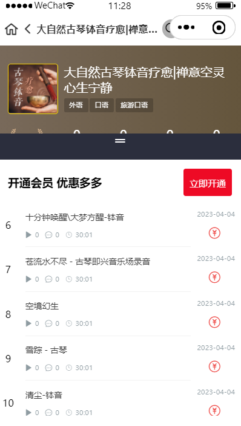

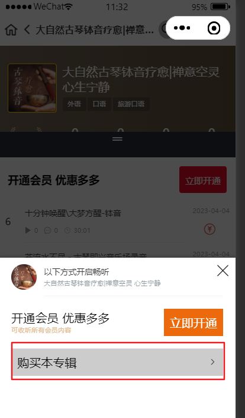

VIP 购买：

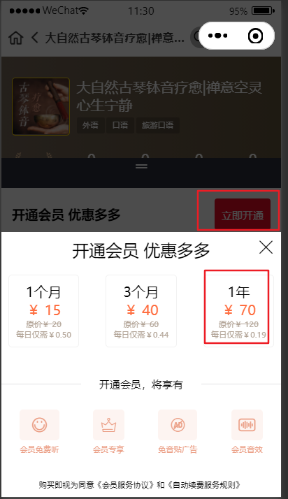

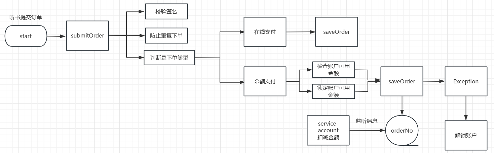

我们将前端页面提交的数据统一封装到实体类**OrderInfoVo**中 

```java
package com.atguigu.tingshu.vo.order;

import com.atguigu.tingshu.common.util.Decimal2Serializer;
import com.fasterxml.jackson.databind.annotation.JsonSerialize;
import io.swagger.v3.oas.annotations.media.Schema;
import jakarta.validation.Valid;
import jakarta.validation.constraints.DecimalMax;
import jakarta.validation.constraints.DecimalMin;
import jakarta.validation.constraints.Digits;
import jakarta.validation.constraints.NotEmpty;
import lombok.Data;

import java.math.BigDecimal;
import java.util.List;

@Data
@Schema(description = "订单对象")
public class OrderInfoVo {

    @NotEmpty(message = "交易号不能为空")
    @Schema(description = "交易号", required = true)
    private String tradeNo;

    @NotEmpty(message = "支付方式不能为空")
    @Schema(description = "支付方式：1101-微信 1102-支付宝 1103-账户余额", required = true)
    private String payWay;

    @NotEmpty(message = "付款项目类型不能为空")
    @Schema(description = "付款项目类型: 1001-专辑 1002-声音 1003-vip会员", required = true)
    private String itemType;

    /**
     * value：最小值
     * inclusive：是否可以等于最小值，默认true，>= 最小值
     * message：错误提示（默认有一个错误提示i18n支持中文）
     *
     * @DecimalMax 同上
     * @Digits integer： 整数位最多几位
     * fraction：小数位最多几位
     * message：同上，有默认提示
     */
    @DecimalMin(value = "0.00", inclusive = false, message = "订单原始金额必须大于0.00")
    @DecimalMax(value = "9999.99", inclusive = true, message = "订单原始金额必须大于9999.99")
    @Digits(integer = 4, fraction = 2)
    @Schema(description = "订单原始金额", required = true)
    @JsonSerialize(using = Decimal2Serializer.class)
    private BigDecimal originalAmount;

    @DecimalMin(value = "0.00", inclusive = true, message = "减免总金额必须大于0.00")
    @DecimalMax(value = "9999.99", inclusive = true, message = "减免总金额必须大于9999.99")
    @Digits(integer = 4, fraction = 2)
    @Schema(description = "减免总金额", required = true)
    @JsonSerialize(using = Decimal2Serializer.class)
    private BigDecimal derateAmount;

    @DecimalMin(value = "0.00", inclusive = false, message = "订单总金额必须大于0.00")
    @DecimalMax(value = "9999.99", inclusive = true, message = "订单总金额必须大于9999.99")
    @Digits(integer = 4, fraction = 2)
    @Schema(description = "订单总金额", required = true)
    @JsonSerialize(using = Decimal2Serializer.class)
    private BigDecimal orderAmount;

    @Valid
    @NotEmpty(message = "订单明细列表不能为空")
    @Schema(description = "订单明细列表", required = true)
    private List<OrderDetailVo> orderDetailVoList;

    @Schema(description = "订单减免明细列表")
    private List<OrderDerateVo> orderDerateVoList;

    @Schema(description = "时间戳", required = true)
    private Long timestamp;
    @Schema(description = "签名", required = true)
    private String sign;
}
```

#### 控制器 OrderInfoApiController 

```java
/**
  * 提交订单
  * @param orderInfoVo
  * @return
  */
@GuiGuLogin
@Operation(summary = "提交订单")
@PostMapping("submitOrder")
public Result<Map<String, Object>> submitOrder(@RequestBody @Validated OrderInfoVo orderInfoVo) {
  //  获取到用户Id
  Long userId = AuthContextHolder.getUserId();
  //  调用服务层方法
  String orderNo = orderInfoService.submitOrder(orderInfoVo, userId);
  Map<String, Object> map = new HashMap();
  map.put("orderNo", orderNo);
  //	返回数据
  return Result.ok(map);
}
```

#### 接口与实现

```java
/**
 * 提交订单
 * @param orderInfoVo
 * @param userId
 * @return
 */
String submitOrder(OrderInfoVo orderInfoVo, Long userId);
```

```java
@Override
public String submitOrder(OrderInfoVo orderInfoVo, Long userId) {
  //  校验签名
  Map map = JSON.parseObject(JSON.toJSONString(orderInfoVo), Map.class);
  map.put("payWay",SystemConstant.ORDER_PAY_WAY_WEIXIN);
  SignHelper.checkSign(map);

  //  验证校验好，防止重复提交订单
  String tradeNo = orderInfoVo.getTradeNo();
  if (StringUtils.isEmpty(tradeNo)){
    //  非法提交
    throw  new GuiguException(ResultCodeEnum.ILLEGAL_REQUEST);
  }
  String tradeNoKey = "user:trade:" + userId;
  String script = "if(redis.call('get', KEYS[1]) == ARGV[1]) then return redis.call('del', KEYS[1]) else return 0 end";
  Boolean flag = (Boolean) redisTemplate.execute(new DefaultRedisScript<>(script, Boolean.class), Arrays.asList(tradeNoKey), tradeNo);
  if (!flag) {
    // 不能重复提交订单！
    throw new GuiguException(ResultCodeEnum.ORDER_SUBMIT_REPEAT);
  }
  //  3.下单
  //  使用交易号座位订单号，或者重新生成订单号
  String orderNo = UUID.randomUUID().toString().replace("-", "");
  //  支付类型
  if (!SystemConstant.ORDER_PAY_ACCOUNT.equals(orderInfoVo.getPayWay())){
    //  在线支付
    this.saveOrder(orderInfoVo,userId,orderNo);
  }else {
    try {
      //  余额支付
      //  锁定账户可用金额
      AccountLockVo accountLockVo = new AccountLockVo();
      accountLockVo.setOrderNo(orderNo);
      accountLockVo.setUserId(userId);
      accountLockVo.setAmount(orderInfoVo.getOrderAmount());
      accountLockVo.setContent(orderInfoVo.getOrderDetailVoList().get(0).getItemName());
      //  检查与锁定账户金额
      Result<AccountLockResultVo> result = userAccountFeignClient.checkAndLock(accountLockVo);
      if (200 != result.getCode()){
        throw  new GuiguException(result.getCode(),result.getMessage());
      }
      //  保存订单
      this.saveOrder(orderInfoVo,userId,orderNo);
      //  支付成功扣减账户金额
      kafkaService.sendMessage(KafkaConstant.QUEUE_ACCOUNT_MINUS, orderNo);
      return orderNo;
    } catch (GuiguException e) {
      e.printStackTrace();
      //抛出异常
      throw new GuiguException(e.getCode(), e.getMessage());
    }  catch (Exception e){
      e.printStackTrace();
      //  异常手动解锁账户
      kafkaService.sendMessage(KafkaConstant.QUEUE_ACCOUNT_UNLOCK, orderNo);
      //抛出异常
      throw new GuiguException(ResultCodeEnum.DATA_ERROR);
    }
  }
  return orderNo;
}
```

#### 保存订单方法saveOrder

业务逻辑

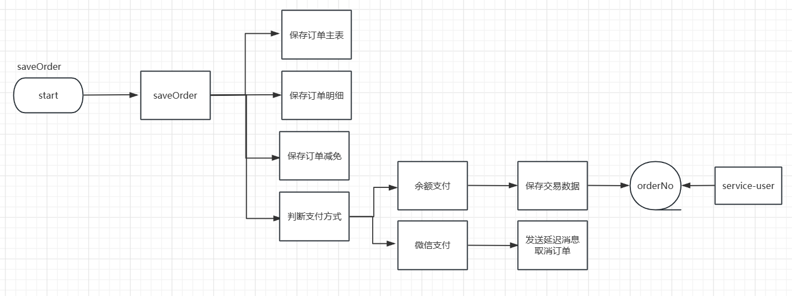

##### 接口与实现类

```java
/**
 * 保存订单
 * @param orderInfoVo
 * @param userId
 * @param orderNo
 */
void saveOrder(OrderInfoVo orderInfoVo, Long userId, String orderNo);
```

```java
@Transactional
@Override
public void saveOrder(OrderInfoVo orderInfoVo, Long userId, String orderNo) {
  //  创建对象对象
  OrderInfo orderInfo = new OrderInfo();
  //  属性拷贝
  BeanUtils.copyProperties(orderInfoVo, orderInfo);
  orderInfo.setOrderNo(orderNo);
  String orderTitle = orderInfoVo.getOrderDetailVoList().get(0).getItemName();
  orderInfo.setOrderTitle(orderTitle);
  orderInfo.setUserId(userId);
  orderInfo.setOrderStatus(SystemConstant.ORDER_STATUS_UNPAID);
  //  保存订单
  orderInfoMapper.insert(orderInfo);

  // 订单明细
  if (!CollectionUtils.isEmpty(orderInfoVo.getOrderDetailVoList())) {
    orderInfoVo.getOrderDetailVoList().forEach(orderDetailVo -> {
      OrderDetail orderDetail = new OrderDetail();
      BeanUtils.copyProperties(orderDetailVo, orderDetail);
      orderDetail.setOrderId(orderInfo.getId());
      orderDetailMapper.insert(orderDetail);
    });
  }

  // 订单减免
  if (!CollectionUtils.isEmpty(orderInfoVo.getOrderDerateVoList())) {
    orderInfoVo.getOrderDerateVoList().forEach(orderDerateVo -> {
      OrderDerate orderDerate = new OrderDerate();
      BeanUtils.copyProperties(orderDerateVo, orderDerate);
      orderDerate.setOrderId(orderInfo.getId());
      orderDerateMapper.insert(orderDerate);
    });
  }

  // 订单支付方式 1101-微信 1102-支付宝 1103-账户余额
  if (SystemConstant.ORDER_PAY_ACCOUNT.equals(orderInfo.getPayWay())) {
    // 余额支付成功保存交易数据
    this.orderPaySuccess(orderNo);
  } else {
    // 发送延迟队列，如果定时未支付，取消订单
    this.sendDelayMessage(orderInfo.getId());
  }
}
```

#### 余额支付成功保存交易数据

##### 实现类

```java
@Override
public void orderPaySuccess(String orderNo) {
  //  根据orderNo 修改订单状态数据
  OrderInfo orderInfoUpt = new OrderInfo();
  orderInfoUpt.setOrderStatus(SystemConstant.ORDER_STATUS_PAID);
  this.update(orderInfoUpt, new LambdaQueryWrapper<OrderInfo>().eq(OrderInfo::getOrderNo, orderNo));

  //  更新用户支付记录
  OrderInfo orderInfo = this.getOrderInfoByOrderNo(orderNo);
  List<Long> itemIdList = orderInfo.getOrderDetailList().stream().map(OrderDetail::getItemId).collect(Collectors.toList());
  UserPaidRecordVo userPaidRecordVo = new UserPaidRecordVo();
  userPaidRecordVo.setOrderNo(orderNo);
  userPaidRecordVo.setUserId(orderInfo.getUserId());
  userPaidRecordVo.setItemType(orderInfo.getItemType());
  userPaidRecordVo.setItemIdList(itemIdList);
  //  发送用户支付成功消息,监听并更新用户支付记录
  kafkaService.sendMessage(KafkaConstant.QUEUE_USER_PAY_RECORD, JSON.toJSONString(userPaidRecordVo));
}
```

根据orderNo 查询订单对象 需要包含订单明细，订单免减明细

```java
/**
  * 根据订单orderNo 获取订单对象
  * @param orderNo
  * @return
  */
public OrderInfo getOrderInfoByOrderNo(String orderNo) {
  //  获取订单对象
  OrderInfo orderInfo = this.getOne(new LambdaQueryWrapper<OrderInfo>().eq(OrderInfo::getOrderNo, orderNo));
  List<OrderDetail> orderDetailList = orderDetailMapper.selectList(new LambdaQueryWrapper<OrderDetail>().eq(OrderDetail::getOrderId, orderInfo.getId()));
  
  List<OrderDerate> orderDerateList = orderDerateMapper.selectList(new LambdaQueryWrapper<OrderDerate>().eq(OrderDerate::getOrderId, orderInfo.getId()));
  // 赋值订单明细
  orderInfo.setOrderDetailList(orderDetailList);
  // 赋值减免金额
  orderInfo.setOrderDerateList(orderDerateList);
  orderInfo.setOrderStatusName(getOrderStatusName(orderInfo.getOrderStatus()));
  orderInfo.setPayWayName(getPayWayName(orderInfo.getPayWay()));
  return orderInfo;
}

/**
  * 根据订单状态获取订单状态名称
  * @param orderStatus
  * @return
  */
private String getOrderStatusName(String orderStatus) {
  String orderStatusName = "";
  if(orderStatus.equals(SystemConstant.ORDER_STATUS_UNPAID)) {
    orderStatusName = "待支付";
  } else if (orderStatus.equals(SystemConstant.ORDER_STATUS_PAID)) {
    orderStatusName = "已支付";
  } else {
    orderStatusName = "已取消";
  }
  return orderStatusName;
}

/**
  * 根据支付方式获取到支付名称
  * @param payWay
  * @return
  */
private String getPayWayName(String payWay) {
  String payWayName = "";
  if(payWay.equals(SystemConstant.ORDER_PAY_WAY_WEIXIN)) {
    payWayName = "微信";
  } else if (payWay.equals(SystemConstant.ORDER_PAY_WAY_ALIPAY)) {
    payWayName = "支付宝";
  } else {
    payWayName = "余额";
  }
  return payWayName;
}
```

#### 监听更新用户支付记录

##### 监听器

在service-user 模块中进行监听

```java
package com.atguigu.tingshu.user.receiver;

import com.alibaba.fastjson.JSON;
import com.atguigu.tingshu.common.constant.KafkaConstant;
import com.atguigu.tingshu.user.service.UserInfoService;
import com.atguigu.tingshu.vo.user.UserPaidRecordVo;
import lombok.extern.slf4j.Slf4j;
import org.apache.kafka.clients.consumer.ConsumerRecord;
import org.springframework.beans.factory.annotation.Autowired;
import org.springframework.kafka.annotation.KafkaListener;
import org.springframework.stereotype.Component;

@Slf4j
@Component
public class UserReceiver {

    @Autowired
    private UserInfoService userInfoService;

    /**
     * 更新用户支付记录
     *
     * @param record
     */
    @KafkaListener(topics = KafkaConstant.QUEUE_USER_PAY_RECORD)
    public void updateUserPaidRecord(ConsumerRecord<String,String> record) {
        UserPaidRecordVo userPaidRecordVo = JSON.parseObject(record.value(), UserPaidRecordVo.class);
        log.info("更新用户支付记录: {}", JSON.toJSONString(userPaidRecordVo));
        //通知更新用户账号
        userInfoService.updateUserPaidRecord(userPaidRecordVo);
    }
}
```

##### 接口与实现

UserInfoService 接口中添加

```java
 /**
  * 更新用户支付记录
  * @param userPaidRecordVo
  */
 void updateUserPaidRecord(UserPaidRecordVo userPaidRecordVo);
```

UserInfoServiceImpl实现类

```java
@Transactional
@Override
public void updateUserPaidRecord(UserPaidRecordVo userPaidRecordVo) {
    // 项目类型 1001-专辑 1002-声音 1003-vip会员
    // 购买专辑
    if (userPaidRecordVo.getItemType().equals(SystemConstant.ORDER_ITEM_TYPE_ALBUM)) {
        // 防止重复消费，如果有记录则直接停止
        long count = userPaidAlbumMapper.selectCount(new LambdaQueryWrapper<UserPaidAlbum>().eq(UserPaidAlbum::getOrderNo, userPaidRecordVo.getOrderNo()));
        if (count > 0) return;
        // 创建用户支付记录对象
        UserPaidAlbum userPaidAlbum = new UserPaidAlbum();
        userPaidAlbum.setUserId(userPaidRecordVo.getUserId());
        userPaidAlbum.setAlbumId(userPaidRecordVo.getItemIdList().get(0));
        userPaidAlbum.setOrderNo(userPaidRecordVo.getOrderNo());
        userPaidAlbumMapper.insert(userPaidAlbum);
        // 购买声音
    } else if (userPaidRecordVo.getItemType().equals(SystemConstant.ORDER_ITEM_TYPE_TRACK)) {
        // 防止重复消费
        long count = userPaidTrackService.count(new LambdaQueryWrapper<UserPaidTrack>().eq(UserPaidTrack::getOrderNo, userPaidRecordVo.getOrderNo()));
        if (count > 0) return;

        Result<TrackInfo> trackInfoResult = trackInfoFeignClient.getTrackInfo(userPaidRecordVo.getItemIdList().get(0));
        Assert.notNull(trackInfoResult, "专辑结果集不能为空");
        TrackInfo trackInfo = trackInfoResult.getData();
        Assert.notNull(trackInfo, "专辑不能为空");
        List<UserPaidTrack> userPaidTrackList = userPaidRecordVo.getItemIdList().stream().map(itemId -> {
            UserPaidTrack userPaidTrack = new UserPaidTrack();
            userPaidTrack.setUserId(userPaidRecordVo.getUserId());
            userPaidTrack.setAlbumId(trackInfo.getAlbumId());
            userPaidTrack.setTrackId(itemId);
            userPaidTrack.setOrderNo(userPaidRecordVo.getOrderNo());
            return userPaidTrack;
        }).collect(Collectors.toList());
        userPaidTrackService.saveBatch(userPaidTrackList);
        // vip 充值购买
    } else if (userPaidRecordVo.getItemType().equals(SystemConstant.ORDER_ITEM_TYPE_VIP)) {
        //防止重复消费
        long count = userVipServiceMapper.selectCount(new LambdaQueryWrapper<UserVipService>().eq(UserVipService::getOrderNo, userPaidRecordVo.getOrderNo()));
        if (count > 0) return;

        Long itemId = userPaidRecordVo.getItemIdList().get(0);
        VipServiceConfig vipServiceConfig = vipServiceConfigMapper.selectById(itemId);
        UserVipService userVipService = new UserVipService();
        userVipService.setUserId(userPaidRecordVo.getUserId());
        userVipService.setOrderNo(userPaidRecordVo.getOrderNo());
        //  获取当前系统时间
        Date startTime = new Date();
        
        //  vip 续期：
        //  获取用户信息
        UserInfo userInfo = this.getById(userPaidRecordVo.getUserId());
        // 当前用户属于vip 并 用户的过期时间大于当前系统时间，则需要重新计算vip 的过期时间。
        if (userInfo.getIsVip().intValue()==1 && userInfo.getVipExpireTime().after(new Date())){
          startTime = userInfo.getVipExpireTime();
        }
        //  获取过期时间
        Date expireTime = new DateTime(startTime).plusMonths(vipServiceConfig.getServiceMonth()).toDate();
        userVipService.setStartTime(new Date());
        userVipService.setExpireTime(expireTime);
        userVipServiceMapper.insert(userVipService);

        //更新用户vip信息
        UserInfo userInfoUpt = new UserInfo();
        userInfoUpt.setId(userPaidRecordVo.getUserId());
        userInfoUpt.setIsVip(1);
        userInfoUpt.setVipExpireTime(expireTime);
        this.updateById(userInfoUpt);
      
        //	最新数据写入缓存.
        UserInfo redisUserInfo = this.userInfoMapper.selectById(userPaidRecordVo.getUserId());
        //	声明到缓存的key
        String userKey = "userInfo:["+redisUserInfo.getId()+"]";
        this.redisTemplate.opsForValue().set(userKey, redisUserInfo,30, TimeUnit.DAYS);
    } else {
        log.info("无该项目类型：{}", JSON.toJSONString(userPaidRecordVo));
    }
}
```

service-track-client 模块中添加远程调用

```java
 /**
  * 获取声音信息
  * @param id
  * @return
  */
 @GetMapping("api/album/trackInfo/getTrackInfo/{id}")
 Result<TrackInfo> getTrackInfo(@PathVariable("id") Long id);
```

熔断类：

```java
@Component
public class TrackInfoDegradeFeignClient implements TrackInfoFeignClient {

    @Override
    public Result<TrackInfo> getTrackInfo(Long id) {
        return null;
    }
}
```

#### 发送延迟消息取消订单

利用redissonClient 发送延迟消息。

redissonClient.getBlockingDeque(): 创建一个阻塞队列

redissonClient.getDelayedQueue(): 获取延迟队列

delayedQueue.offer(): 向队列中存储数据

blockingDeque.take(): 从队列中获取数据

##### 发送消息实现

为了方便测试：设置10秒钟

```java
/**
 * 发送延迟消息
 */
private void sendDelayMessage(Long orderId) {
    try {
        //  创建一个队列
        RBlockingDeque<Object> blockingDeque = redissonClient.getBlockingDeque(KafkaConstant.QUEUE_ORDER_CANCEL);
        //  将队列放入延迟队列中
        RDelayedQueue<Object> delayedQueue = redissonClient.getDelayedQueue(blockingDeque);
        //  发送的内容
        delayedQueue.offer(orderId.toString(), KafkaConstant.DELAY_TIME, TimeUnit.SECONDS);
        log.info("添加延时队列成功 ，延迟时间：{}，订单id：{}", KafkaConstant.DELAY_TIME, orderId);
    } catch (Exception e) {
        log.error("添加延时队列失败 ，延迟时间：{}，订单id：{}", KafkaConstant.DELAY_TIME, orderId);
        e.printStackTrace();
    }
}
```

##### 监听消息

```java
package com.atguigu.tingshu.order.handle;

import com.atguigu.tingshu.common.constant.KafkaConstant;
import com.atguigu.tingshu.order.service.OrderInfoService;
import jakarta.annotation.PostConstruct;
import lombok.extern.slf4j.Slf4j;
import org.redisson.api.RBlockingDeque;
import org.redisson.api.RedissonClient;
import org.springframework.beans.factory.annotation.Autowired;
import org.springframework.stereotype.Component;
import org.springframework.util.StringUtils;


@Slf4j
@Component
public class RedisDelayHandle {

    @Autowired
    private RedissonClient redissonClient;

    @Autowired
    private OrderInfoService orderInfoService;

    @PostConstruct
    public void listener() {
        new Thread(()->{
            while (true){
                // 获取到阻塞队列
                RBlockingDeque<String> blockingDeque = redissonClient.getBlockingDeque(KafkaConstant.QUEUE_ORDER_CANCEL);
                try {
                    // 从阻塞队列中获取到订单Id
                    String orderId = blockingDeque.take();
                    // 订单Id 不为空的时候，调用取消订单方法
                    if(!StringUtils.isEmpty(orderId)) {
                        log.info("接收延时队列成功，订单id：{}", orderId);
                        orderInfoService.orderCancel(Long.parseLong(orderId));
                    }
                } catch (InterruptedException e) {
                    log.error("接收延时队列失败");
                    e.printStackTrace();
                }
            }
        }).start();
    }
}
```

##### 接口与实现类

```java
public interface OrderInfoService extends IService<OrderInfo> {    
	/**
     * 根据订单Id 取消订单
     * @param orderId
     */
    void orderCancel(Long orderId);
}
```


```java
@Override
public void orderCancel(Long orderId) {
  // 设置更新数据
  OrderInfo orderInfoUpt = new OrderInfo();
  orderInfoUpt.setId(orderId);
  orderInfoUpt.setOrderStatus(SystemConstant.ORDER_STATUS_CANCEL);
  // 执行更新方法
  this.updateById(orderInfoUpt);
}
```

#### 锁定账户可用金额

##### 远程调用

service-account-client 模块中添加 远程调用

```java
@FeignClient(value = "service-account", fallback = UserAccountDegradeFeignClient.class)
public interface UserAccountFeignClient {
    /**
     * 检查与锁定账户金额
     * @param accountLockVo
     * @return
     */
    @PostMapping("api/account/userAccount/checkAndLock")
    Result<AccountLockResultVo> checkAndLock(@RequestBody AccountLockVo accountLockVo);
}
```

熔断类：

```java
@Component
public class UserAccountDegradeFeignClient implements UserAccountFeignClient {

    @Override
    public Result<AccountLockResultVo> checkAndLock(AccountLockVo accountLockVo) {
        return null;
    }
}
```

##### 控制器

service-account 微服务控制器

UserAccountApiController 控制器 ，将返回数据封装到 AccountLockResultVo 实体类中

```java
/**
  * 检查锁定账户金额
  * @param accountLockVo
  * @return
  */
@GuiGuLogin
@Operation(summary = "检查与锁定账户金额")
@PostMapping("checkAndLock")
public Result<AccountLockResultVo> checkAndLock(@RequestBody AccountLockVo accountLockVo){
  //	调用服务层方法
  return this.userAccountService.checkAndLock(accountLockVo);
}
```

##### 接口与实现类

```java
public interface UserAccountService extends IService<UserAccount> {

    /**
     * 检查与锁定账户金额
     * @param accountLockVo
     * @return
     */
    Result<AccountLockResultVo> checkAndLock(AccountLockVo accountLockVo);
}
```

实现类

1. 使用 redis-setnx 防止重复请求,如果重复请求了，直接查询缓存数据，并返回。如果缓存没有给用户信息提示。
2. 核对账户可用金额并锁定账户数据(悲观锁)；根据userId,锁定金额 查询账户是否符合要求
   1. 没有符合的用户，则删除锁定key，并返回信息提示
   2. 有符合的用户锁定账户金额并 
      1. 锁定失败，则删除key，并返回信息提示
      2. 锁定成功，添加账户明细，写入user_account_detail 表中
3. 返回锁定对象 AccountLockResultVo，并将对象放入缓存中

```java
@Override
@Transactional
public  Result<AccountLockResultVo> checkAndLock(AccountLockVo accountLockVo) {
  //	检查key
  String key = "checkAndLock:"+accountLockVo.getOrderNo();
  //	数据key
  String dataKey = "account:lock:"+accountLockVo.getOrderNo();
  //	防止重复请求
  boolean isExist = redisTemplate.opsForValue().setIfAbsent(key, accountLockVo.getOrderNo(), 1, TimeUnit.HOURS);
  //	isExist = true; 说明第一次执行，如果 isExist=false; 说明不是第一次执行
  if (!isExist){
    //	获取锁定key对应的数据
    String data = this.redisTemplate.opsForValue().get(dataKey);
    if (!StringUtils.isEmpty(data)){
      //	获取到计算的数据
      AccountLockResultVo accountLockResultVo = JSONObject.parseObject(data, AccountLockResultVo.class);
      return Result.ok(accountLockResultVo);
    }else {
      //还未计算出结果就再次提交
      return Result.build(null, ResultCodeEnum.ACCOUNT_LOCK_REPEAT);
    }
  }

  //	核对账户可用金额并锁定账户数据(悲观锁)；查询返回的是满足要求的账户
  UserAccount userAccount = userAccountMapper.check(accountLockVo.getUserId(),accountLockVo.getAmount());
  //	判断
  if (null == userAccount){
    // 账户可用金额不足
    redisTemplate.delete(key);
    return Result.build(null, ResultCodeEnum.ACCOUNT_LESS);
  }

  //	锁定账户金额
  int lock = userAccountMapper.lock(accountLockVo.getUserId(), accountLockVo.getAmount());
  if(lock == 0) {//锁定失败
    // 解除去重
    this.redisTemplate.delete(key);
    return Result.build(null, ResultCodeEnum.ACCOUNT_LOCK_ERROR);
  }

  //	添加账户明细
  this.log(accountLockVo.getUserId(),"锁定："+accountLockVo.getContent(), SystemConstant.ACCOUNT_TRADE_TYPE_LOCK,accountLockVo.getAmount(), "lock:"+accountLockVo.getOrderNo());

  //返回锁定对象
  AccountLockResultVo accountLockResultVo = new AccountLockResultVo();
  accountLockResultVo.setUserId(accountLockVo.getUserId());
  accountLockResultVo.setAmount(accountLockVo.getAmount());
  accountLockResultVo.setContent(accountLockVo.getContent());
  // 如果账户锁定成功的情况下，需要缓存锁定信息到redis。以方便将来解锁账户金额 或者 减账户金额
  redisTemplate.opsForValue().set(dataKey, JSON.toJSONString(accountLockResultVo), 1, TimeUnit.HOURS);
  //	返回数据
  return Result.ok(accountLockResultVo);
}
```

###### 检查用户是否有足够的可用金额

UserAccountMapper.java

```java
@Mapper
public interface UserAccountMapper extends BaseMapper<UserAccount> {
    /**
     * 获取可用账户
     * @param userId
     * @param amount
     * @return
     */
    UserAccount check(@Param("userId") Long userId, @Param("amount") BigDecimal amount);
 }
```

UserAccountMapper.xml

```xml
<!--查询可用用户-->
<select id="check" resultMap="userAccountMap">
  select * from user_account where user_id = #{userId} and available_amount > #{amount} for update
</select>
```


###### 锁定账户金额

UserAccountMapper.java

```java
@Mapper
public interface UserAccountMapper extends BaseMapper<UserAccount> {
	/**
     * 锁定账户金额
     * @param userId
     * @param amount
     * @return
     */
    Integer lock(@Param("userId") Long userId, @Param("amount") BigDecimal amount);
}
```

UserAccountMapper.xml

```xml
<!--锁定金额-->
  <update id="lock">
		update user_account
		set lock_amount = lock_amount + #{amount}, available_amount = available_amount - #{amount}
         where user_id = #{userId}
</update>
```

###### 添加账户明细

```java
/**
 * 记录账户明细
 * @param userId
 * @param title
 * @param tradeType
 * @param amount
 * @param orderNo
 */
private void log(Long userId, String title, String tradeType, BigDecimal amount, String orderNo) {
	//添加账户明细
	UserAccountDetail userAccountDetail = new UserAccountDetail();
	userAccountDetail.setUserId(userId);
	userAccountDetail.setTitle(title);
	userAccountDetail.setTradeType(tradeType);
	userAccountDetail.setAmount(amount);
	userAccountDetail.setOrderNo(orderNo);
	//	添加数据
	userAccountDetailMapper.insert(userAccountDetail);
}
```

###### 监听扣减金额

在service-account 模块中AccountReceiver类中添加

```java
/**
 * 扣减锁定金额
 *
 * @param record
 */
@KafkaListener(topics = KafkaConstant.QUEUE_ACCOUNT_MINUS)
public void minus(ConsumerRecord<String, String> record) {
    String orderNo = record.value();
    if (StringUtils.isEmpty(orderNo)) {
        return;
    }
    //扣减锁定金额
    userAccountService.minus(orderNo);
}
```

实现类：

1. 声明key 防止重复消费，如果重复消费直接返回
2. 从缓存中获取锁定信息，如果获取失败，则直接返回，如果获取成功并转化为锁定对象AccountLockResultVo
3. 根据用户Id，扣减金额实现扣减账户金额功能，如果扣减失败删除key并给友好信息提示
4. 记录日志信息，并删除数据key。

```java
@Transactional
@Override
public void minus(String orderNo) {
   // 防止重复消费
   String key = "minus:"+orderNo;
   // 数据key
   String dataKey = "account:lock:"+orderNo;

   //业务去重，防止重复消费
   Boolean isExist = redisTemplate.opsForValue().setIfAbsent(key, orderNo, 1, TimeUnit.HOURS);
   if(!isExist) return;

   // 获取锁定库存的缓存信息
   String data = (String)this.redisTemplate.opsForValue().get(dataKey);
   if (StringUtils.isEmpty(data)){
      return ;
   }

   // 扣减账户金额
   AccountLockResultVo accountLockResultVo = JSONObject.parseObject(data, AccountLockResultVo.class);
   int minus = userAccountMapper.minus(accountLockResultVo.getUserId(), accountLockResultVo.getAmount());
   if(minus == 0) {
      //解除去重
      this.redisTemplate.delete(key);
      throw new GuiguException(ResultCodeEnum.ACCOUNT_MINUSLOCK_ERROR);
   }
   //记录日志
   this.log(accountLockResultVo.getUserId(), accountLockResultVo.getContent(), SystemConstant.ACCOUNT_TRADE_TYPE_MINUS, accountLockResultVo.getAmount(), orderNo);

   // 解锁账户金额之后，删除锁定缓存。以防止重复解锁
   this.redisTemplate.delete(dataKey);
}
```

UserAccountMapper.java

```java
/**
 * 解锁账户
 * @param userId
 * @param amount
 * @return
 */
Integer minus(@Param("userId") Long userId, @Param("amount") BigDecimal amount);
```

UserAccountMapper.xml

```xml
<update id="minus">
   update user_account
   set lock_amount = lock_amount - #{amount}, total_amount = total_amount - #{amount}, total_pay_amount = total_pay_amount + #{amount}
   where user_id = #{userId}
</update>
```

#### 监听解锁锁定金额

在service-account 微服务中的AccountReceiver 添加

```java
/**
 * 解锁锁定金额
 *
 * @param record
 */
@KafkaListener(topics = KafkaConstant.QUEUE_ACCOUNT_UNLOCK)
public void unlock(ConsumerRecord<String, String> record) {
    String orderNo = record.value();
    if (StringUtils.isEmpty(orderNo)) {
        return;
    }
    //  调用解除锁定
    userAccountService.unlock(orderNo);
}
```

##### 接口与实现类

```java
/**
 * 解除锁定
 * @param orderNo
 */
void unlock(String orderNo);
```

实现类

1. 声明key 防止重复消费，如果是重复想消费直接返回
2. 根据数据key从缓存中获取数据并转化为AccountLockResultVo 对象，如果获取失败，则直接返回
3. 根据用户Id，解锁金额 调用解锁方法
   1. 解锁失败，则删除锁的key，并给信息提示
   2. 解锁成功，记录日志信息。并删除数据key

```java
@Transactional
@Override
public void unlock(String orderNo) {
   // 防止重复消费
   String key = "unlock:"+orderNo;
   // 数据key
   String dataKey = "account:lock:"+orderNo;

   //业务去重，防止重复消费
   Boolean isExist = redisTemplate.opsForValue().setIfAbsent(key, orderNo, 1, TimeUnit.HOURS);
   if(!isExist) return;

   // 获取锁定库存的缓存信息
   String data = (String)this.redisTemplate.opsForValue().get(dataKey);
   if (StringUtils.isEmpty(data)){
      return ;
   }

   // 解锁账户金额
   AccountLockResultVo accountLockResultVo = JSONObject.parseObject(data, AccountLockResultVo.class);
   // 调用解锁方法
   int unLock = userAccountMapper.unLock(accountLockResultVo.getUserId(), accountLockResultVo.getAmount());
   if(unLock == 0) {
      //解除去重
      this.redisTemplate.delete(key);
      throw new GuiguException(ResultCodeEnum.ACCOUNT_UNLOCK_ERROR);
   }
   //记录日志
   this.log(accountLockResultVo.getUserId(), "解锁："+accountLockResultVo.getContent(), SystemConstant.ACCOUNT_TRADE_TYPE_UNLOCK, accountLockResultVo.getAmount(), "unlock:"+orderNo);

   // 解锁账户金额之后，删除锁定缓存。以防止重复解锁
   this.redisTemplate.delete(dataKey);
}
```

UserAccountMapper.java

```java
/**
 * 调用解除锁定方法.
 * @param userId
 * @param amount
 * @return
 */
int unLock(Long userId, BigDecimal amount);
```

UserAccountMapper.xml

```xml
<update id="unLock">
   update user_account
   set lock_amount = lock_amount - #{amount}, available_amount = available_amount + #{amount}
   where user_id = #{userId}
</update>
```

###根据orderNo查看订单

#### 控制器

当支付成功之后，点击查看订单，直接调用上面写过的getOrderInfoByOrderNo方法即可。

在service-order 微服务中添加

```java
/**
 * 查看我的订单
 * @param orderNo
 * @return
 */
@GuiGuLogin
@Operation(summary = "根据订单号获取订单信息")
@GetMapping("getOrderInfo/{orderNo}")
public Result<OrderInfo> getOrderInfo(@PathVariable String orderNo) {
   OrderInfo orderInfo = orderInfoService.getOrderInfoByOrderNo(orderNo);
   return Result.ok(orderInfo);
}
```

### 查看我的订单

入口：我的-->我的订单

#### 控制器

service-order 的OrderInfoApiController 控制器 添加 直接返回OrderInfo 对象

```java
/**
 * 查看我的订单
 * @param page
 * @param limit
 * @return
 */
@GuiGuLogin
@Operation(summary = "获取用户订单")
@GetMapping("findUserPage/{page}/{limit}")
public Result index(
      @Parameter(name = "page", description = "当前页码", required = true)
      @PathVariable Long page,
      @Parameter(name = "limit", description = "每页记录数", required = true)
      @PathVariable Long limit) {
   // 获取到用户Id
   Long userId = AuthContextHolder.getUserId();
   Page<OrderInfo> pageParam = new Page<>(page, limit);
   // 调用服务层方法
   IPage<OrderInfo> pageModel = orderInfoService.findUserPage(pageParam, userId);
   return Result.ok(pageModel);
}
```

#### 接口与实现类

```java
/**
 * 查看我的订单
 * @param pageParam
 * @param userId
 * @return
 */
IPage<OrderInfo> findUserPage(Page<OrderInfo> pageParam, Long userId);
```

```java
@Override
public IPage<OrderInfo> findUserPage(Page<OrderInfo> pageParam, Long userId) {
    //  调用mapper 层方法
    IPage<OrderInfo> infoIPage = orderInfoMapper.selectUserPage(pageParam,userId);
    infoIPage.getRecords().forEach(item->{
        //  设置状态名
        item.setOrderStatusName(getOrderStatusName(item.getOrderStatus()));
        item.setPayWayName(getPayWayName(item.getPayWay()));
    });
    return infoIPage;
}
```

OrderInfoMapper.java 接口

```java
@Mapper
public interface OrderInfoMapper extends BaseMapper<OrderInfo> {

    /**
     * 查看分页订单列表
     * @param pageParam
     * @param userId
     * @return
     */
    IPage<OrderInfo> selectUserPage(Page<OrderInfo> pageParam, Long userId);
}
```

OrderInfoMapper.xml 映射文件

```xml
<?xml version="1.0" encoding="UTF-8" ?>
<!DOCTYPE mapper
PUBLIC "-//mybatis.org//DTD Mapper 3.0//EN"
"http://mybatis.org/dtd/mybatis-3-mapper.dtd">
<mapper namespace="com.atguigu.tingshu.order.mapper.OrderInfoMapper">

    <resultMap id="orderInfoMap" type="com.atguigu.tingshu.model.order.OrderInfo" autoMapping="true">
        <id property="id" column="id"></id>
        <collection property="orderDetailList" ofType="com.atguigu.tingshu.model.order.OrderDetail" autoMapping="true">
            <id property="id" column="detail_id"></id>
        </collection>
    </resultMap>
    <!-- 用于select查询公用抽取的列 -->
    <sql id="columns">
        oi.id ,
            oi.user_id,
            oi.order_title,
            oi.order_no,
            oi.order_status,
            oi.original_amount,
            oi.derate_amount,
            oi.order_amount,
            oi.item_type,
            oi.pay_way,
            od.id detail_id,
            od.item_id,
            od.item_name,
            od.item_url,
            od.item_price
        </sql>

    <select id="selectUserPage" resultMap="orderInfoMap">
        select
            <include refid="columns"></include>
        from order_info oi inner join order_detail od on oi.id = od.order_id
        where oi.user_id = #{userId}
        order by oi.id desc
    </select>
</mapper>
```


