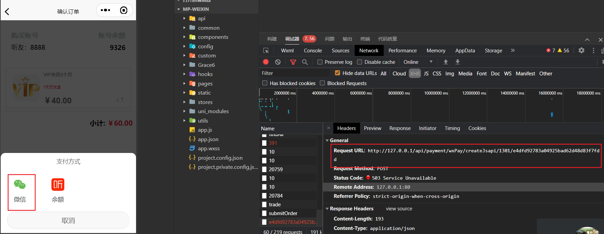
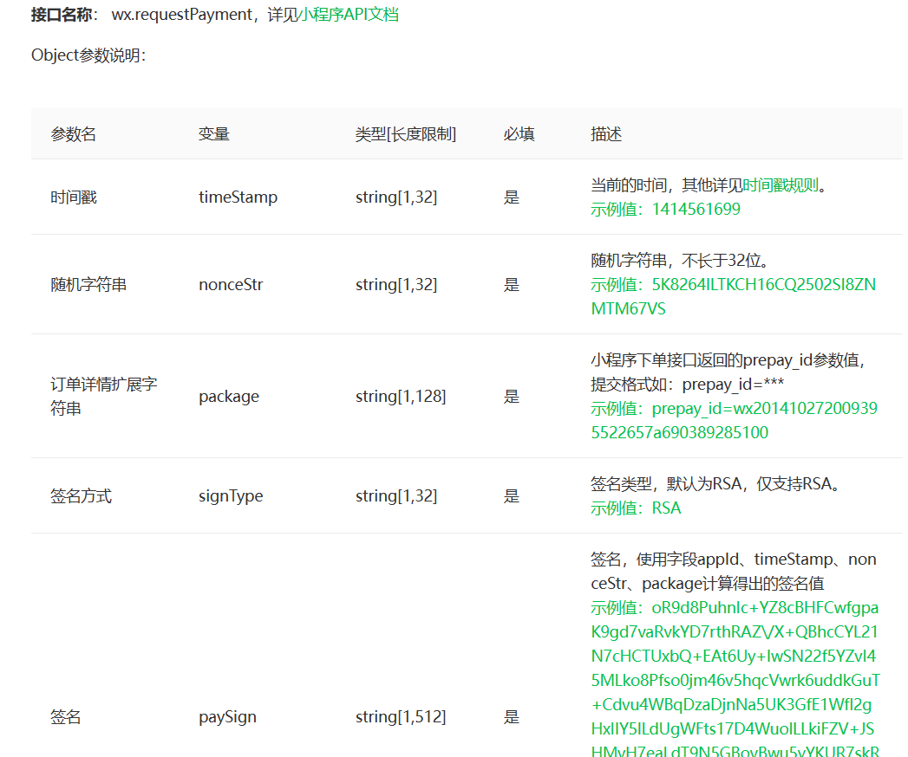
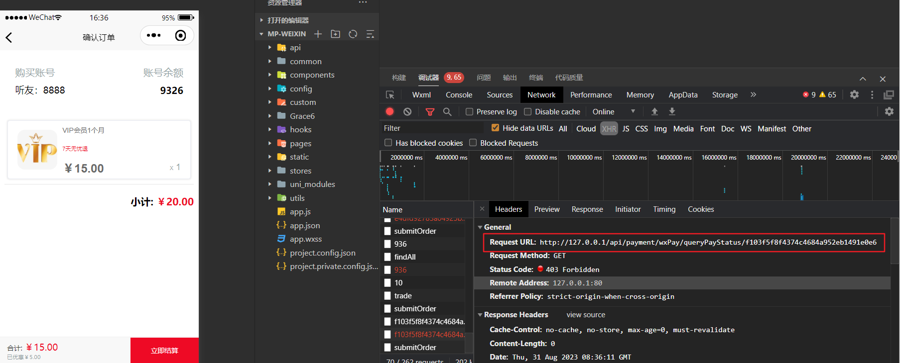
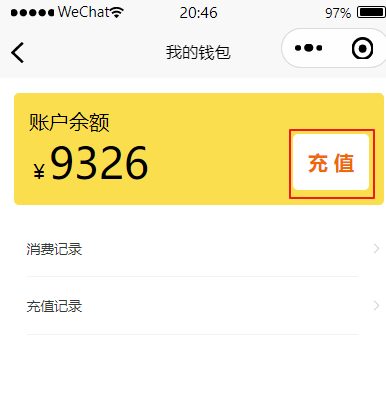
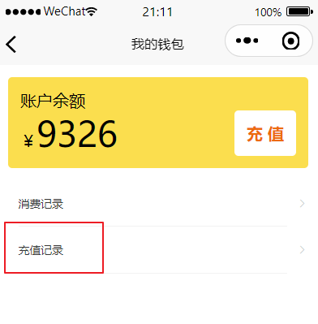
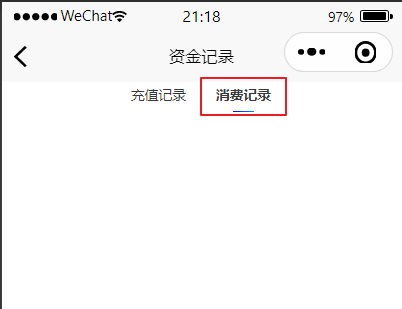
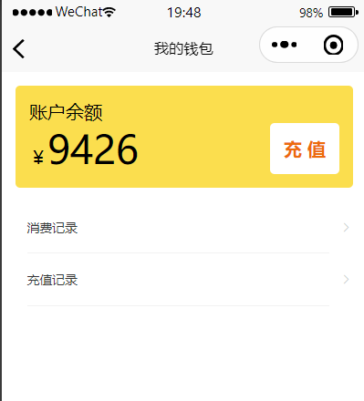
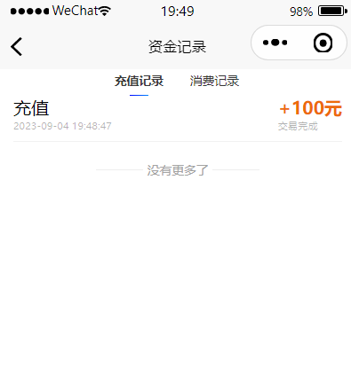

# 谷粒随享

## 微信支付 

接口文档入口：https://developers.weixin.qq.com/miniprogram/dev/api/payment/wx.requestPayment.html



接收前端传递的**支付类型**以及**订单编号**

先在配置文件中添加支付相关信息配置：

```properties
spring.application.name=service-payment
spring.profiles.active=dev
spring.main.allow-bean-definition-overriding=true
spring.cloud.nacos.discovery.server-addr=192.168.200.130:8848
spring.cloud.nacos.config.server-addr=192.168.200.130:8848
spring.cloud.nacos.config.prefix=${spring.application.name}
spring.cloud.nacos.config.file-extension=yaml
wechat.v3pay.appid=wxcc651fcbab275e33
wechat.v3pay.merchantId=1631833859
wechat.v3pay.privateKeyPath=E:\\tingshu\\apiclient_key.pem
wechat.v3pay.merchantSerialNumber=4AE80B52EBEAB2B96F68E02510A42801E952E889
wechat.v3pay.apiV3key=84dba6dd51cdaf779e55bcabae564b53
wechat.v3pay.notifyUrl=http://127.0.0.1/api/payment/wxPay/notify
```

apiclient_key.pem 商户API私钥路径 的私钥要放入指定位置，让程序读取！

### 控制器

微信支付成功之后，需要返回一个 map 集合来存储数据给页面使用.

格式如下：

```java
Map<String, Object> result = new HashMap();
result.put("timeStamp", response.getTimeStamp()); // 时间戳
result.put("nonceStr", response.getNonceStr());   // 随机字符串
result.put("package", response.getPackageVal());  // 订单详情扩展字符串
result.put("signType", response.getSignType());   // 签名方式
result.put("paySign", response.getPaySign());     // 签名
```


```java
/**
  * 微信支付
  * @param paymentType
  * @param orderNo
  * @return
  */
@GuiGuLogin
@Operation(summary = "微信下单")
@Parameters({
  @Parameter(name = "paymentType",description = "支付类型：1301-订单 1302-充值",in = ParameterIn.PATH,required = true),
  @Parameter(name = "orderNo",description = "订单号",required = true,in = ParameterIn.PATH),
})
@PostMapping("/createJsapi/{paymentType}/{orderNo}")
public Result createJsapi(@PathVariable String paymentType, @PathVariable String orderNo) {
  //  调用微信支付方法
  Map map = wxPayService.createJsapi(paymentType, orderNo, AuthContextHolder.getUserId());
  return Result.ok(map);
}
```

### 接口

```java
/**
  * 微信支付
  * @param paymentType
  * @param orderNo
  * @param userId
  * @return
  */
Map createJsapi(String paymentType, String orderNo, Long userId);
```

### 实现类

微信支付：小程序调起支付需要返回的参数



```java
@Autowired
private RSAAutoCertificateConfig rsaAutoCertificateConfig;

//	支付文档入口：https://developers.weixin.qq.com/miniprogram/dev/api/payment/wx.requestPayment.html
//	对接方式：https://github.com/wechatpay-apiv3/wechatpay-java
@Override
public Map createJsapi(String paymentType, String orderNo, Long userId) {
	try {
      	//	根据业务判断类型：
	    //	充值业务不需要判断当前订单是否取消
	    if (!paymentType.equals(SystemConstant.PAYMENT_TYPE_RECHARGE)){
	    	//	查询当前订单状态，如果订单状态已经取消，则不能生成二维码！
	    	Result<OrderInfo> orderInfoResult = this.orderInfoFeignClient.getOrderInfo(orderNo);
	    	OrderInfo orderInfo = orderInfoResult.getData();
	    	if (SystemConstant.ORDER_STATUS_CANCEL.equals(orderInfo.getOrderStatus())){
	    		//	此时订单已取消，不能生成二维码！
	    		return null;
	    	}
	    }
		// 保存支付记录
		PaymentInfo paymentInfo = paymentInfoService.savePaymentInfo(paymentType, orderNo);
		//	构建service
		JsapiServiceExtension service = new JsapiServiceExtension.Builder().config(rsaAutoCertificateConfig).build();
		PrepayRequest request = new PrepayRequest();
        // 注意在这个包下 com.wechat.pay.java.service.payments.jsapi.model.Amount
		Amount amount = new Amount();
		amount.setTotal(1);
		request.setAmount(amount);
		request.setAppid(wxPayV3Config.getAppid());
		request.setMchid(wxPayV3Config.getMerchantId());
		request.setDescription(paymentInfo.getContent());
		request.setNotifyUrl(wxPayV3Config.getNotifyUrl());
		request.setOutTradeNo(paymentInfo.getOrderNo());
		//	获取用户信息
		Result<UserInfoVo> userInfoVoResult = userInfoFeignClient.getUserInfoVo(paymentInfo.getUserId());
		Assert.notNull(userInfoVoResult,"返回用户结果集对象不能为空");
		UserInfoVo userInfoVo = userInfoVoResult.getData();
		Assert.notNull(userInfoVo,"用户对象不能为空");
		String openid = userInfoVo.getWxOpenId();
		Payer payer = new Payer();
		payer.setOpenid(openid);
		request.setPayer(payer);

		// 调用下单方法，得到应答
		// response包含了调起支付所需的所有参数，可直接用于前端调起支付
		PrepayWithRequestPaymentResponse response = service.prepayWithRequestPayment(request);
		log.info("微信支付下单返回参数：{}", JSON.toJSONString(response));
		Map<String, Object> result = new HashMap();
		result.put("timeStamp", response.getTimeStamp());
		result.put("nonceStr", response.getNonceStr());
		result.put("package", response.getPackageVal());
		result.put("signType", response.getSignType());
		result.put("paySign", response.getPaySign());
		//	返回数据
		return result;
	} catch (GuiguException e){
		e.printStackTrace();
		throw  new GuiguException(201,e.getMessage());
	} catch (Exception e){
		e.printStackTrace();
		throw new GuiguException(201,"微信下单异常");
	}
}
```
注意：RSAAutoCertificateConfig 对象必须在配置文件中注入到spring 容器中，不要直接使用原生的，否则会报错！

```java
package com.atguigu.tingshu.payment.config;

import com.wechat.pay.java.core.RSAAutoCertificateConfig;
import lombok.Data;
import org.springframework.boot.context.properties.ConfigurationProperties;
import org.springframework.context.annotation.Bean;
import org.springframework.context.annotation.Configuration;

@Configuration
@ConfigurationProperties(prefix="wechat.v3pay") //读取节点
@Data
public class WxPayV3Config {

    private String appid;
    /** 商户号 */
    public String merchantId;
    /** 商户API私钥路径 */
    public String privateKeyPath;
    /** 商户证书序列号 */
    public String merchantSerialNumber;
    /** 商户APIV3密钥 */
    public String apiV3key;
    /** 回调地址 */
    private String notifyUrl;

    @Bean
    public RSAAutoCertificateConfig rsaAutoCertificateConfig(){
        return new RSAAutoCertificateConfig.Builder()
                .merchantId(this.merchantId)
                .privateKeyFromPath(privateKeyPath)
                .merchantSerialNumber(merchantSerialNumber)
                .apiV3Key(apiV3key)
                .build();
    }
}
```
### 保存交易记录

#### 接口

```java
public interface PaymentInfoService extends IService<PaymentInfo> {

    /**
     * 保存交易记录
     * @param paymentType
     * @param orderNo
     * @return
     */
    PaymentInfo savePaymentInfo(String paymentType, String orderNo);
}
```

#### 实现类

```java
@Override
public PaymentInfo savePaymentInfo(String paymentType, String orderNo) {
  //  获取到交易记录对象
  PaymentInfo paymentInfo = this.getOne(new LambdaQueryWrapper<PaymentInfo>().eq(PaymentInfo::getOrderNo, orderNo));
  if (null == paymentInfo){
    //  创建对象
    paymentInfo = new PaymentInfo();
    //  支付信息
    if(paymentType.equals(SystemConstant.PAYMENT_TYPE_ORDER)){
      //  远程调用获取到订单对象
      Result<OrderInfo> orderInfoResult = orderInfoFeignClient.getOrderInfo(orderNo);
      Assert.notNull(orderInfoResult,"返回订单对象不能为空");
      OrderInfo orderInfo = orderInfoResult.getData();
      paymentInfo.setUserId(orderInfo.getUserId());
      paymentInfo.setContent(orderInfo.getOrderTitle());
      paymentInfo.setAmount(orderInfo.getOrderAmount());
    } else {
      //  充值信息
      Result<RechargeInfo> rechargeInfoResult =  rechargeInfoFeignClient.getRechargeInfo(orderNo);
      Assert.notNull(rechargeInfoResult,"返回充值对象不能不为空");
      RechargeInfo rechargeInfo = rechargeInfoResult.getData();
      paymentInfo.setUserId(rechargeInfo.getUserId());
      paymentInfo.setContent("充值");
      paymentInfo.setAmount(rechargeInfo.getRechargeAmount());
    }
    paymentInfo.setPaymentType(paymentType);
    paymentInfo.setOrderNo(orderNo);
    paymentInfo.setPaymentStatus(SystemConstant.PAYMENT_STATUS_UNPAID);
    this.save(paymentInfo);
  }
  return paymentInfo;
}
```

##### 远程调用获取订单对象

service-order 订单微服务已经有这个方法了，直接编写一个远程调用即可

```java
@FeignClient(value = "service-order", fallback = OrderInfoDegradeFeignClient.class)
public interface OrderInfoFeignClient {
    /**
     * 根据订单号获取订单信息
     * @param orderNo
     * @return
     */
    @GetMapping("api/order/orderInfo/getOrderInfo/{orderNo}")
    Result<OrderInfo> getOrderInfo(@PathVariable("orderNo") String orderNo);
}
```

熔断类：

```java
@Component
public class OrderInfoDegradeFeignClient implements OrderInfoFeignClient {

    @Override
    public Result<OrderInfo> getOrderInfo(String orderNo) {
        return null;
    }
}
```

##### 远程调用获取充值记录信息

```java
@FeignClient(value = "service-account", fallback = RechargeInfoDegradeFeignClient.class)
public interface RechargeInfoFeignClient {

    /**
     * 根据订单号获取充值信息
     * @param orderNo
     * @return
     */
    @GetMapping("api/account/rechargeInfo/getRechargeInfo/{orderNo}")
    Result<RechargeInfo> getRechargeInfo(@PathVariable("orderNo") String orderNo);
}
```

熔断类：

```java
@Component
public class RechargeInfoDegradeFeignClient implements RechargeInfoFeignClient {
    @Override
    public Result<RechargeInfo> getRechargeInfo(String orderNo) {
        return null;
    }
}
```

service-account 微服务控制器中添加

```java
/**
 * 根据订单号获取充值信息
 * @param orderNo
 * @return
 */
@GuiGuLogin
@Operation(summary = "根据订单号获取充值信息")
@GetMapping("/getRechargeInfo/{orderNo}")
public Result<RechargeInfo> getRechargeInfo(@PathVariable("orderNo") String orderNo){
   // 调用服务层方法
   RechargeInfo rechargeInfo = rechargeInfoService.getRechargeInfoByOrderNo(orderNo);
   // 返回对象
   return Result.ok(rechargeInfo);
}
```

接口与实现

```java
public interface RechargeInfoService extends IService<RechargeInfo> {

    /**
     * 根据订单号获取充值信息
     * @param orderNo
     * @return
     */
    RechargeInfo getRechargeInfoByOrderNo(String orderNo);

}
```

```java
package com.atguigu.tingshu.account.service.impl;

import com.atguigu.tingshu.account.mapper.RechargeInfoMapper;
import com.atguigu.tingshu.account.service.RechargeInfoService;
import com.atguigu.tingshu.model.account.RechargeInfo;
import com.baomidou.mybatisplus.core.conditions.query.LambdaQueryWrapper;
import com.baomidou.mybatisplus.extension.service.impl.ServiceImpl;
import org.springframework.beans.factory.annotation.Autowired;
import org.springframework.stereotype.Service;

@Service
@SuppressWarnings({"unchecked", "rawtypes"})
public class RechargeInfoServiceImpl extends ServiceImpl<RechargeInfoMapper, RechargeInfo> implements RechargeInfoService {

   @Autowired
   private RechargeInfoMapper rechargeInfoMapper;
   @Override
   public RechargeInfo getRechargeInfoByOrderNo(String orderNo) {
      // 根据订单号查询对象
      return this.getOne(new LambdaQueryWrapper<RechargeInfo>().eq(RechargeInfo::getOrderNo,orderNo));
   }
}
```

### 查询支付状态

页面有个主动查询支付状态的接口，检查用户是否支付成功

http://127.0.0.1/api/payment/wxPay/queryPayStatus/0d7e74b3a17040adb89dc252e189ed19




#### 控制器

思路：

1. 调用接口查询数据得到Transaction对象{这个对象能够获取到支付状态}
2. 当这个对象不为空的时候并且支付状态是成功时，则调用更新交易状态方法

```java
/**
  * 查询支付状态 https://pay.weixin.qq.com/wiki/doc/apiv3/apis/chapter3_5_2.shtml
  * @param orderNo
  * @return
  */
@Operation(summary = "支付状态查询")
@GetMapping("/queryPayStatus/{orderNo}")
public Result queryPayStatus(@PathVariable String orderNo) {
  try {
    // 调用查询接口 com.wechat.pay.java.service.payments.model.Transaction;
    Transaction transaction = wxPayService.queryPayStatus(orderNo);
    System.out.println("queryPayStatus: "+ JSON.toJSONString(transaction));
    if(null != transaction && transaction.getTradeState() == Transaction.TradeStateEnum.SUCCESS) {
      //更改订单状态
      paymentInfoService.updatePaymentStatus(transaction);
      return Result.ok(true);
    }
  } catch (Exception e) {
    e.printStackTrace();
  }
  return Result.ok(false);
}
```

#### 接口

```java
/**
  * 根据orderNo 查询数据
  * @param orderNo
  * @return
  */
Transaction queryPayStatus(String orderNo);
```

#### 实现类

```java
@Override
public Transaction queryPayStatus(String orderNo) {
  try {
    //	构建service
    JsapiServiceExtension service = new JsapiServiceExtension.Builder().config(rsaAutoCertificateConfig).build();
    QueryOrderByOutTradeNoRequest queryRequest = new QueryOrderByOutTradeNoRequest();
    queryRequest.setMchid(wxPayV3Config.getMerchantId());
    queryRequest.setOutTradeNo(orderNo);

    Transaction result = service.queryOrderByOutTradeNo(queryRequest);
    log.info("Transaction:\t"+JSON.toJSONString(result));
    return result ;
  } catch (ServiceException e){
    // API返回失败, 例如ORDER_NOT_EXISTS
    System.out.printf("code=[%s], message=[%s]\n", e.getErrorCode(), e.getErrorMessage());
    System.out.printf("reponse body=[%s]\n", e.getResponseBody());
    e.printStackTrace();
  }
  return null;
}
```

#### 更新状态接口

```java
/**
 *	更改订单状态
 * @param transaction
 */
void updatePaymentStatus(Transaction transaction);
```

#### 更新状态实现类

```java
@Override
public void updatePaymentStatus(Transaction transaction) {
  PaymentInfo paymentInfo = this.getOne(new LambdaQueryWrapper<PaymentInfo>().eq(PaymentInfo::getOrderNo, transaction.getOutTradeNo()));
  if (paymentInfo.getPaymentStatus() == SystemConstant.PAYMENT_STATUS_PAID) {
    return;
  }

  //更新支付信息
  paymentInfo.setPaymentStatus(SystemConstant.PAYMENT_STATUS_PAID);
  paymentInfo.setOrderNo(transaction.getOutTradeNo());
  paymentInfo.setOutTradeNo(transaction.getTransactionId());
  paymentInfo.setCallbackTime(new Date());
  paymentInfo.setCallbackContent(JSON.toJSONString(transaction));
  this.updateById(paymentInfo);
  // 表示交易成功！

  // 后续更新订单状态！ 使用消息队列！
  String topic = paymentInfo.getPaymentType().equals(SystemConstant.PAYMENT_TYPE_ORDER) ? KafkaConstant.QUEUE_ORDER_PAY_SUCCESS : KafkaConstant.QUEUE_RECHARGE_PAY_SUCCESS;
  //rabbitService.sendMessage(MqConstant.EXCHANGE_PAYMENT, routingKey, paymentInfo.getOrderNo());
  kafkaService.sendMessage(topic, paymentInfo.getOrderNo());
}
```

#### 监听信息修改订单状态

监听支付发送的消息，充值状态监听消息，在后面的充值业务中体现

在这个OrderReceiver类中添加

```java
package com.atguigu.tingshu.order.receiver;

import com.atguigu.tingshu.common.constant.KafkaConstant;
import com.atguigu.tingshu.order.service.OrderInfoService;
import lombok.extern.slf4j.Slf4j;
import org.apache.kafka.clients.consumer.ConsumerRecord;
import org.springframework.beans.factory.annotation.Autowired;
import org.springframework.kafka.annotation.KafkaListener;
import org.springframework.stereotype.Component;

/**
 * @author atguigu-mqx
 * @ClassName OrderReceiver
 * @description: TODO
 * @date 2023年08月31日
 * @version: 1.0
 */
@Component
@Slf4j
public class OrderReceiver {

    @Autowired
    private OrderInfoService orderInfoService;
    /**
     * 订单支付成功通知
     * @param record
     */
    @KafkaListener(topics = KafkaConstant.QUEUE_ORDER_PAY_SUCCESS)
    public void orderPaySuccess(ConsumerRecord<String, String> record) {
        //  获取数据
        String orderNo = record.value();
        if (!StringUtils.isEmpty(orderNo)){
            // 修改订单状态
            orderInfoService.orderPaySuccess(orderNo);
        }
    }
}
```

### 支付异步回调

控制器：

```java
//  https://pay.weixin.qq.com/wiki/doc/apiv3/apis/chapter3_5_5.shtml
/**
  * 异步回调
  * @param request
  * @return
  */
@Operation(summary = "微信支付异步通知接口")
@PostMapping("/notify")
public Map<String,Object> notify(HttpServletRequest request){
  Map<String,Object> result = new HashMap<>();
  try {
    //  调用方法
    wxPayService.wxnotify(request);
    //返回成功
    result.put("code", "SUCCESS");
    result.put("message", "成功");
    return result;
  } catch (Exception e) {
    e.printStackTrace();
  }

  //返回失败
  result.put("code", "FAIL");
  result.put("message", "失败");
  return result;
}
```

接口：

```java
void wxnotify(HttpServletRequest request);
```

实现类：

```java
@Override
public void wxnotify(HttpServletRequest request) {
  //1.回调通知的验签与解密
  //从request头信息获取参数
  //HTTP 头 Wechatpay-Signature
  // HTTP 头 Wechatpay-Nonce
  //HTTP 头 Wechatpay-Timestamp
  //HTTP 头 Wechatpay-Serial
  //HTTP 头 Wechatpay-Signature-Type
  //HTTP 请求体 body。切记使用原始报文，不要用 JSON 对象序列化后的字符串，避免验签的 body 和原文不一致。
  String wechatPaySerial = request.getHeader("Wechatpay-Serial");
  String nonce = request.getHeader("Wechatpay-Nonce");
  String timestamp = request.getHeader("Wechatpay-Timestamp");
  String signature = request.getHeader("Wechatpay-Signature");
  // 调用工具类来获取请求体数据
  String requestBody = PayUtils.readData(request);

  //2.构造 RequestParam
  RequestParam requestParam = new RequestParam.Builder()
    .serialNumber(wechatPaySerial)
    .nonce(nonce)
    .signature(signature)
    .timestamp(timestamp)
    .body(requestBody)
    .build();

  //3.初始化 NotificationParser
  NotificationParser parser = new NotificationParser(rsaAutoCertificateConfig);
  //4.以支付通知回调为例，验签、解密并转换成 Transaction
  Transaction transaction = parser.parse(requestParam, Transaction.class);
  log.info("成功解析：{}", JSON.toJSONString(transaction));
  if(null != transaction && transaction.getTradeState() == Transaction.TradeStateEnum.SUCCESS) {
    // 5.处理支付业务
    paymentInfoService.updatePaymentStatus(transaction);
  }
}
```

## 充值业务

### 业务分析

点击我的---->我的钱包



http://127.0.0.1/api/account/rechargeInfo/submitRecharge

在service-account 模块中添加控制器

#### 控制器

充值时，将前端页面数据封装到 RechargeInfoVo 对象中，充值成功之后保存orderNo 到map 集合中并将map 放入result类中返回

```java
package com.atguigu.tingshu.vo.account;

import io.swagger.v3.oas.annotations.media.Schema;
import lombok.Data;

import java.math.BigDecimal;

@Data
@Schema(description = "充值对象")
public class RechargeInfoVo {

   @Schema(description = "充值金额")
   private BigDecimal amount;

   @Schema(description = "支付方式：1101-微信 1102-支付宝")
   private String payWay;

}
```

RechargeInfoApiController

```java
/**
  * 给用户充值
  * @param rechargeInfoVo
  * @return
  */
@GuiGuLogin
@Operation(summary = "充值")
@PostMapping("submitRecharge")
public Result submitRecharge(@RequestBody RechargeInfoVo rechargeInfoVo){
  //	获取到用户Id
  Long userId = AuthContextHolder.getUserId();
  //	调用充值方法
  String orderNo = this.rechargeInfoService.submitRecharge(rechargeInfoVo,userId);
  //	创建map 集合对象
  HashMap<String, Object> map = new HashMap<>();
  //	存储订单Id
  map.put("orderNo",orderNo);
  //	返回数据
  return Result.ok(map);
}
```

#### 接口

```java
/**
  * 用户充值接口
  * @param rechargeInfoVo
  * @param userId
  * @return
  */
String submitRecharge(RechargeInfoVo rechargeInfoVo, Long userId);
```

#### 实现类

```java
@Override
public String submitRecharge(RechargeInfoVo rechargeInfoVo, Long userId) {
  //	创建对象
  RechargeInfo rechargeInfo = new RechargeInfo();
  //	赋值操作
  rechargeInfo.setUserId(userId);
  rechargeInfo.setRechargeStatus(SystemConstant.ORDER_STATUS_UNPAID);
  rechargeInfo.setRechargeAmount(rechargeInfoVo.getAmount());
  rechargeInfo.setPayWay(rechargeInfoVo.getPayWay());
  rechargeInfo.setOrderNo(UUID.randomUUID().toString().replaceAll("-",""));
  //	插入数据库
  rechargeInfoMapper.insert(rechargeInfo);
  //	返回订单编号
  return rechargeInfo.getOrderNo();
}
```

### 充值成功业务处理

在支付成功之后，会在updatePaymentStatus方法中发送充值成功消息。所以我们要在在service-account 模块添加监听器中

#### 监听信息修改充值状态

在这个AccountReceiver类中添加数据

```java
/**
 * 充值成功通知
 *
 * @param record
 */
@KafkaListener(topics = KafkaConstant.QUEUE_RECHARGE_PAY_SUCCESS)
public void rechargePaySuccess(ConsumerRecord<String, String> record) {
    String orderNo = record.value();
    log.info("充值成功通知: {}", orderNo);
    //通知更新用户账号
    rechargeInfoService.rechargePaySuccess(orderNo);
}
```

#### 接口与实现

```java
/**
 * 充值成功
 * @param orderNo
 */
void rechargePaySuccess(String orderNo);
```

```java
@Override
@Transactional
public void rechargePaySuccess(String orderNo) {
   // 获取到充值信息对象
   RechargeInfo rechargeInfo = this.getRechargeInfoByOrderNo(orderNo);
   // 如果当前状态是已支付，则直接返回
   if (SystemConstant.ORDER_STATUS_PAID.equals(rechargeInfo.getRechargeStatus())) return;
   // 否则赋值为已支付状态
   rechargeInfo.setRechargeStatus(SystemConstant.ORDER_STATUS_PAID);
   // 更新数据
   this.updateById(rechargeInfo);
   // 更新余额
  userAccountService.add(rechargeInfo.getUserId(),rechargeInfo.getRechargeAmount(),rechargeInfo.getOrderNo(),SystemConstant.ACCOUNT_TRADE_TYPE_DEPOSIT,"充值");
}
```

新增 user_account 与 user_account_detail 表数据

```java
/**
 * 充值
 * @param userId
 * @param amount
 * @param orderNo
 * @param tradeType
 * @param title
 */
void add(Long userId, BigDecimal amount, String orderNo, String tradeType, String title);
```

```java
@Override
public void add(Long userId, BigDecimal amount, String orderNo, String tradeType, String title) {
   // 查看是否有当前对象
   long count = userAccountDetailMapper.selectCount(new LambdaQueryWrapper<UserAccountDetail>().eq(UserAccountDetail::getOrderNo, orderNo));
   if(count > 0) return;
   //添加账号金额
   userAccountMapper.add(userId, amount);
   //添加账户明细
   this.log(userId, title, tradeType, amount, orderNo);
}
```

UserAccountMapper.java

```java
/**
 * 充值
 * @param userId
 * @param amount
 */
Integer add(@Param("userId") Long userId, @Param("amount") BigDecimal amount);
```

UserAccountMapper.xml

```xml
<update id="add">
   update user_account
   set total_amount = total_amount + #{amount}, available_amount = available_amount + #{amount}, total_income_amount = total_income_amount + #{amount}
   where user_id = #{userId}
</update>
```

### 充值记录



http://127.0.0.1/api/account/userAccount/findUserRechargePage/1/10

#### 控制器

用户充值记录回显信息保存到实体类：

```java
package com.atguigu.tingshu.model.account;

import com.atguigu.tingshu.model.base.BaseEntity;
import com.baomidou.mybatisplus.annotation.TableField;
import com.baomidou.mybatisplus.annotation.TableName;
import io.swagger.v3.oas.annotations.media.Schema;
import lombok.Data;

import java.math.BigDecimal;

@Data
@Schema(description = "UserAccountDetail")
@TableName("user_account_detail")
public class UserAccountDetail extends BaseEntity {

   private static final long serialVersionUID = 1L;

   @Schema(description = "用户id")
   @TableField("user_id")
   private Long userId;

   @Schema(description = "交易标题")
   @TableField("title")
   private String title;

   @Schema(description = "交易类型：1201-充值 1202-锁定 1203-解锁 1204-消费")
   @TableField("trade_type")
   private String tradeType;

   @Schema(description = "金额")
   @TableField("amount")
   private BigDecimal amount;

   @Schema(description = "订单编号")
   @TableField("order_no")
   private String orderNo;

}
```


在service-account 微服务 UserAccountApiController 控制器添加

```java
/**
 * 用户充值记录
 * @param page
 * @param limit
 * @return
 */
@GuiGuLogin
@Operation(summary = "获取用户充值记录")
@GetMapping("/findUserRechargePage/{page}/{limit}")
public Result findUserRechargePage(
      @Parameter(name = "page", description = "当前页码", required = true)
      @PathVariable Long page,

      @Parameter(name = "limit", description = "每页记录数", required = true)
      @PathVariable Long limit) {
   // 获取到用户Id
   Long userId = AuthContextHolder.getUserId();
   // 构建Page对象
   Page<UserAccountDetail> pageParam = new Page<>(page, limit);
   // 调用服务层方法
   IPage<UserAccountDetail> pageModel = userAccountService.findUserRechargePage(pageParam, userId);
   // 返回数据
   return Result.ok(pageModel);
}
```

#### 接口

```java
/**
 * 查看用户充值记录
 * @param pageParam
 * @param userId
 * @return
 */
IPage<UserAccountDetail> findUserRechargePage(Page<UserAccountDetail> pageParam, Long userId);
```

#### 实现类

```java
@Override
public IPage<UserAccountDetail> findUserRechargePage(Page<UserAccountDetail> pageParam, Long userId) {
   // 调用mapper 方法
   return userAccountDetailMapper.selectUserRechargePage(pageParam,userId);
}
```

UserAccountDetailMapper.java

```java
@Mapper
public interface UserAccountDetailMapper extends BaseMapper<UserAccountDetail> {
    /**
     *
     * @param pageParam
     * @param userId
     * @return
     */
    IPage<UserAccountDetail> selectUserRechargePage(Page<UserAccountDetail> pageParam, Long userId);
}
```

UserAccountDetailMapper.xml

```xml
<!--
   充值记录类型 固定1201
-->
<select id="selectUserRechargePage" resultMap="RechargeInfoMap">
   select <include refid="columns" />
   from user_account_detail
   where user_id = #{userId} and trade_type = '1201'
   and is_deleted = 0
   order by id desc
</select>
```

### 消费记录



消费记录

http://127.0.0.1/api/account/userAccount/findUserConsumePage/1/10

#### 控制器

返回消费记录的时候，也是将数据封装到 UserAccountDetail 对象中！

在service-account 微服务中添加

```java
@GuiGuLogin
@Operation(summary = "获取用户消费记录")
@GetMapping("findUserConsumePage/{page}/{limit}")
public Result findUserConsumePage(
      @Parameter(name = "page", description = "当前页码", required = true)
      @PathVariable Long page,

      @Parameter(name = "limit", description = "每页记录数", required = true)
      @PathVariable Long limit) {
   // 获取到用户Id
   Long userId = AuthContextHolder.getUserId();
   Page<UserAccountDetail> pageParam = new Page<>(page, limit);
   IPage<UserAccountDetail> pageModel = userAccountService.findUserConsumePage(pageParam, userId);
   return Result.ok(pageModel);
}
```

#### 接口

```java
/**
 * 消费记录
 * @param pageParam
 * @param userId
 * @return
 */
IPage<UserAccountDetail> findUserConsumePage(Page<UserAccountDetail> pageParam, Long userId);
```

#### 实现类

```java
@Override
public IPage<UserAccountDetail> findUserConsumePage(Page<UserAccountDetail> pageParam, Long userId) {
   // 调用mapper 层方法
   return userAccountDetailMapper.selectUserConsumePage(pageParam, userId);
}
```

UserAccountDetailMapper.java

```java
/**
 * 消费记录
 * @param pageParam
 * @param userId
 * @return
 */
IPage<UserAccountDetail> selectUserConsumePage(Page<UserAccountDetail> pageParam, Long userId);
```

UserAccountDetailMapper.xml

```xml
<select id="selectUserConsumePage" resultMap="RechargeInfoMap">
   select <include refid="columns" />
   from user_account_detail
   where user_id = #{userId} and trade_type = '1204'
   and is_deleted = 0
   order by id desc
</select>
```


测试：充值一百元之后，查看余额与




充值记录：



总结：

​	优化将查询充值记录与消费记录合并：

http://127.0.0.1/api/account/userAccount/findUserConsumePage/1/10/1201

http://127.0.0.1/api/account/userAccount/findUserConsumePage/1/10/1204


控制器：

```java
@GuiGuLogin
@Operation(summary = "查看消费记录")
@GetMapping("findUserConsumePage/{page}/{limit}/{tradeType}")
public Result findUserConsumePage(@PathVariable Long page,
                                  @PathVariable Long limit,
                                  @PathVariable String tradeType){
   // 获取用户Id
   Long userId = AuthContextHolder.getUserId();
   // 创建Page 对象
   Page<UserAccountDetail> userAccountDetailPage = new Page<>(page,limit);
   // 调用服务层方法.
   IPage<UserAccountDetail> iPage = this.userAccountService.findUserConsumePage(userAccountDetailPage,userId);
   // 返回数据
   return Result.ok(iPage);

}
```

```sql
select * from user_account_detail uad where uad.user_id = 19 and uad.trade_type = ? and is_deleted = 0 order by uad.id desc;
```

