# 1 定时任务框架

## 1.1 单机

- Timer：这是 java 自带的 java.util.Timer 类，这个类允许你调度一个 java.util.TimerTask 任务。使用这种方式可以让你的程序按照某一个频度执行，但不能在指定时间运行。一般用的较少。
- ScheduledExecutorService：也 jdk 自带的一个类；是基于线程池设计的定时任务类，每个调度任务都会分配到线程池中的一个线程去执行，也就是说，任务是并发执行，互不影响。
- Spring Task：Spring3.0 以后自带的 task，配置简单功能较多，如果系统使用单机的话可以优先考虑spring定时器。

## 1.2 分布式

- Quartz：Java事实上的定时任务标准。但Quartz关注点在于定时任务而非数据，并无一套根据数据处理而定制化的流程。虽然Quartz可以基于数据库实现作业的高可用，但缺少分布式并行调度的功能。
- TBSchedule：阿里早期开源的分布式任务调度系统。代码略陈旧，使用timer而非线程池执行任务调度。众所周知，timer在处理异常状况时是有缺陷的。而且TBSchedule作业类型较为单一，只能是获取/处理数据一种模式。还有就是文档缺失比较严重。
- elastic-job：当当开发的弹性分布式任务调度系统，功能丰富强大，采用zookeeper实现分布式协调，实现任务高可用以及分片，并且可以支持云开发。
- Saturn：是唯品会自主研发的分布式的定时任务的调度平台，基于当当的elastic-job 版本1开发，并且可以很好的部署到docker容器上。
- xxl-job: 是大众点评员工徐雪里于2015年发布的分布式任务调度平台，是一个轻量级分布式任务调度框架，其核心设计目标是开发迅速、学习简单、轻量级、易扩展，其在唯品会内部已经发部署350+个节点，每天任务调度4000多万次。同时，管理和统计也是它的亮点。使用案例 大众点评、易信(IM)、京东(电商系统)、360金融(金融系统)、易企秀、随行付(支付系统)、优信二手车。

我们项目选择：XXL-JOB

# 2 分布式任务调度平台XXL-JOB

官方文档：https://www.xuxueli.com/xxl-job/

## 2.1 概述

XXL-JOB是一个分布式任务调度平台，其核心设计目标是开发迅速、学习简单、轻量级、易扩展。现已开放源代码并接入多家公司线上产品线，开箱即用。

## 2.2 特性（仅了解）

- 1、简单：支持通过Web页面对任务进行CRUD操作，操作简单，一分钟上手；
- 2、动态：支持动态修改任务状态、启动/停止任务，以及终止运行中任务，即时生效；
- 3、调度中心HA（中心式）：调度采用中心式设计，“调度中心”自研调度组件并支持集群部署，可保证调度中心HA；
- 4、执行器HA（分布式）：任务分布式执行，任务”执行器”支持集群部署，可保证任务执行HA；
- 5、注册中心: 执行器会周期性自动注册任务, 调度中心将会自动发现注册的任务并触发执行。同时，也支持手动录入执行器地址；
- 6、弹性扩容缩容：一旦有新执行器机器上线或者下线，下次调度时将会重新分配任务；
- 7、触发策略：提供丰富的任务触发策略，包括：Cron触发、固定间隔触发、固定延时触发、API（事件）触发、人工触发、父子任务触发；
- 8、调度过期策略：调度中心错过调度时间的补偿处理策略，包括：忽略、立即补偿触发一次等；
- 9、阻塞处理策略：调度过于密集执行器来不及处理时的处理策略，策略包括：单机串行（默认）、丢弃后续调度、覆盖之前调度；
- 10、任务超时控制：支持自定义任务超时时间，任务运行超时将会主动中断任务；
- 11、任务失败重试：支持自定义任务失败重试次数，当任务失败时将会按照预设的失败重试次数主动进行重试；其中分片任务支持分片粒度的失败重试；
- 12、任务失败告警；默认提供邮件方式失败告警，同时预留扩展接口，可方便的扩展短信、钉钉等告警方式；
- 13、路由策略：执行器集群部署时提供丰富的路由策略，包括：第一个、最后一个、轮询、随机、一致性HASH、最不经常使用、最近最久未使用、故障转移、忙碌转移等；
- 14、分片广播任务：执行器集群部署时，任务路由策略选择”分片广播”情况下，一次任务调度将会广播触发集群中所有执行器执行一次任务，可根据分片参数开发分片任务；
- 15、动态分片：分片广播任务以执行器为维度进行分片，支持动态扩容执行器集群从而动态增加分片数量，协同进行业务处理；在进行大数据量业务操作时可显著提升任务处理能力和速度。
- 16、故障转移：任务路由策略选择”故障转移”情况下，如果执行器集群中某一台机器故障，将会自动Failover切换到一台正常的执行器发送调度请求。
- 17、任务进度监控：支持实时监控任务进度；
- 18、Rolling实时日志：支持在线查看调度结果，并且支持以Rolling方式实时查看执行器输出的完整的执行日志；
- 19、GLUE：提供Web IDE，支持在线开发任务逻辑代码，动态发布，实时编译生效，省略部署上线的过程。支持30个版本的历史版本回溯。
- 20、脚本任务：支持以GLUE模式开发和运行脚本任务，包括Shell、Python、NodeJS、PHP、PowerShell等类型脚本;
- 21、命令行任务：原生提供通用命令行任务Handler（Bean任务，”CommandJobHandler”）；业务方只需要提供命令行即可；
- 22、任务依赖：支持配置子任务依赖，当父任务执行结束且执行成功后将会主动触发一次子任务的执行, 多个子任务用逗号分隔；
- 23、一致性：“调度中心”通过DB锁保证集群分布式调度的一致性, 一次任务调度只会触发一次执行；
- 24、自定义任务参数：支持在线配置调度任务入参，即时生效；
- 25、调度线程池：调度系统多线程触发调度运行，确保调度精确执行，不被堵塞；
- 26、数据加密：调度中心和执行器之间的通讯进行数据加密，提升调度信息安全性；
- 27、邮件报警：任务失败时支持邮件报警，支持配置多邮件地址群发报警邮件；
- 28、推送maven中央仓库: 将会把最新稳定版推送到maven中央仓库, 方便用户接入和使用;
- 29、运行报表：支持实时查看运行数据，如任务数量、调度次数、执行器数量等；以及调度报表，如调度日期分布图，调度成功分布图等；
- 30、全异步：任务调度流程全异步化设计实现，如异步调度、异步运行、异步回调等，有效对密集调度进行流量削峰，理论上支持任意时长任务的运行；
- 31、跨语言：调度中心与执行器提供语言无关的 RESTful API 服务，第三方任意语言可据此对接调度中心或者实现执行器。除此之外，还提供了 “多任务模式”和“httpJobHandler”等其他跨语言方案；
- 32、国际化：调度中心支持国际化设置，提供中文、英文两种可选语言，默认为中文；
- 33、容器化：提供官方docker镜像，并实时更新推送dockerhub，进一步实现产品开箱即用；
- 34、线程池隔离：调度线程池进行隔离拆分，慢任务自动降级进入”Slow”线程池，避免耗尽调度线程，提高系统稳定性；
- 35、用户管理：支持在线管理系统用户，存在管理员、普通用户两种角色；
- 36、权限控制：执行器维度进行权限控制，管理员拥有全量权限，普通用户需要分配执行器权限后才允许相关操作；

## 2.3 下载

#### 文档地址

- [中文文档](https://www.xuxueli.com/xxl-job/)
- [English Documentation](https://www.xuxueli.com/xxl-job/en/)

#### 源码仓库地址

| 源码仓库地址                                 | Release Download                         |
| -------------------------------------- | ---------------------------------------- |
| <https://github.com/xuxueli/xxl-job>   | [Download](https://github.com/xuxueli/xxl-job/releases) |
| <http://gitee.com/xuxueli0323/xxl-job> | [Download](http://gitee.com/xuxueli0323/xxl-job/releases) |

#### 中央仓库地址

当前项目使用版本：2.4.1-SNAPSHOT

注：为了统一版本，已统一下载，在资料中获取：xxl-job-master.zip

```xml
<dependency>
    <groupId>com.xuxueli</groupId>
    <artifactId>xxl-job-core</artifactId>
    <version>${最新稳定版本}</version>
</dependency>
```

## 2.4 快速入门

### 2.4.1 导入项目到idea

解压：xxl-job-master.zip，导入idea，如图：

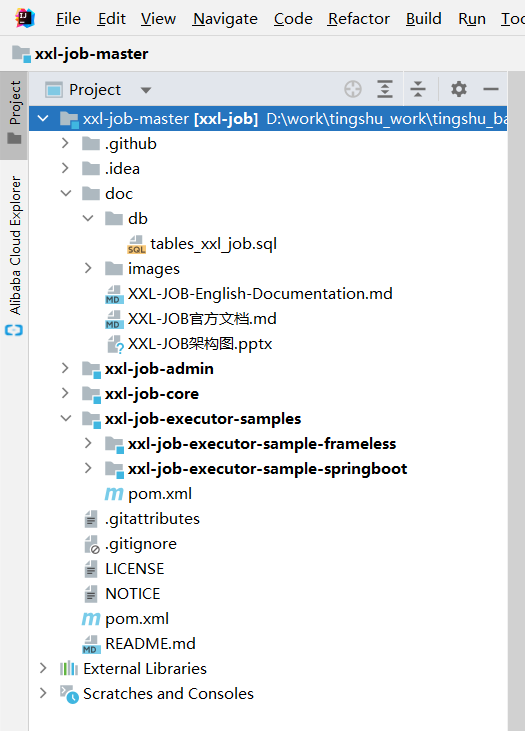

项目结构说明：

```yaml
xxl-job-master：
    xxl-job-admin：调度中心
    xxl-job-core：公共依赖
    xxl-job-executor-samples：执行器Sample示例（选择合适的版本执行器，可直接使用，也可以参考其并将现有项目改造成执行器）
        xxl-job-executor-sample-springboot：Springboot版本，通过Springboot管理执行器，推荐这种方式；
        xxl-job-executor-sample-frameless：无框架版本；
```

### 2.4.2 初始化“调度数据库”

获取 “调度数据库初始化SQL脚本” 并执行即可。

调度数据库初始化SQL脚本” 位置为：

```
/xxl-job-master/doc/db/tables_xxl_job.sql
```

### 2.4.3 部署”调度中心“

```
调度中心项目：xxl-job-admin
作用：统一管理任务调度平台上调度任务，负责触发调度执行，并且提供任务管理平台。     
```

#### 步骤一：修改数据库连接

```properties
### xxl-job, datasource
spring.datasource.url=jdbc:mysql://localhost:3306/xxl_job?useUnicode=true&characterEncoding=UTF-8&autoReconnect=true&serverTimezone=Asia/Shanghai
spring.datasource.username=root
spring.datasource.password=root
spring.datasource.driver-class-name=com.mysql.cj.jdbc.Driver
```

#### 步骤二：启动项目

调度中心访问地址：<http://localhost:8080/xxl-job-admin> 

默认登录账号 “admin/123456”, 登录后运行界面如下图所示：

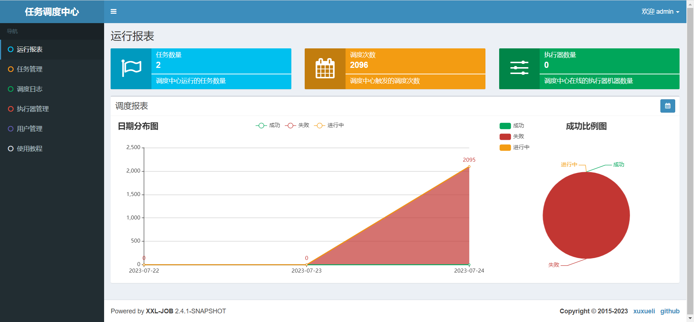

#### 步骤三：调度中心集群部署（可选）

调度中心支持集群部署，提升调度系统容灾和可用性。

调度中心集群部署时，几点要求和建议：

- DB配置保持一致；
- 集群机器时钟保持一致（单机集群忽视）；
- 建议：推荐通过nginx为调度中心集群做负载均衡，分配域名。调度中心访问、执行器回调配置、调用API服务等操作均通过该域名进行。

### 2.4.4 配置部署“执行器项目”

```
“执行器”项目：xxl-job-executor-sample-springboot (提供多种版本执行器供选择，现以 springboot 版本为例，可直接使用，也可以参考其并将现有项目改造成执行器)
作用：负责接收“调度中心”的调度并执行；可直接部署执行器，也可以将执行器集成到现有业务项目中。
```

#### 步骤一：maven依赖

确认pom文件中引入了 “xxl-job-core” 的maven依赖；

```xml
<!-- xxl-job-core -->
<dependency>
    <groupId>com.xuxueli</groupId>
    <artifactId>xxl-job-core</artifactId>
    <version>2.4.1-SNAPSHOT</version>
</dependency>
```

#### 步骤二：执行器配置

执行器配置，配置内容说明：

```properties
### 调度中心部署根地址 [选填]：如调度中心集群部署存在多个地址则用逗号分隔。执行器将会使用该地址进行"执行器心跳注册"和"任务结果回调"；为空则关闭自动注册；
xxl.job.admin.addresses=http://127.0.0.1:8080/xxl-job-admin
### 执行器通讯TOKEN [选填]：非空时启用；
xxl.job.accessToken=
### 执行器AppName [选填]：执行器心跳注册分组依据；为空则关闭自动注册
xxl.job.executor.appname=xxl-job-executor-sample
### 执行器注册 [选填]：优先使用该配置作为注册地址，为空时使用内嵌服务 ”IP:PORT“ 作为注册地址。从而更灵活的支持容器类型执行器动态IP和动态映射端口问题。
xxl.job.executor.address=
### 执行器IP [选填]：默认为空表示自动获取IP，多网卡时可手动设置指定IP，该IP不会绑定Host仅作为通讯实用；地址信息用于 "执行器注册" 和 "调度中心请求并触发任务"；
xxl.job.executor.ip=
### 执行器端口号 [选填]：小于等于0则自动获取；默认端口为9999，单机部署多个执行器时，注意要配置不同执行器端口；
xxl.job.executor.port=9999
### 执行器运行日志文件存储磁盘路径 [选填] ：需要对该路径拥有读写权限；为空则使用默认路径；
xxl.job.executor.logpath=/data/applogs/xxl-job/jobhandler
### 执行器日志文件保存天数 [选填] ： 过期日志自动清理, 限制值大于等于3时生效; 否则, 如-1, 关闭自动清理功能；
xxl.job.executor.logretentiondays=30
```

#### 步骤三：执行器组件配置

执行器组件，配置内容说明：

```java
package com.xxl.job.executor.core.config;

import com.xxl.job.core.executor.impl.XxlJobSpringExecutor;
import org.slf4j.Logger;
import org.slf4j.LoggerFactory;
import org.springframework.beans.factory.annotation.Value;
import org.springframework.context.annotation.Bean;
import org.springframework.context.annotation.Configuration;

/**
 * xxl-job config
 *
 * @author xuxueli 2017-04-28
 */
@Configuration
public class XxlJobConfig {
    private Logger logger = LoggerFactory.getLogger(XxlJobConfig.class);

    @Value("${xxl.job.admin.addresses}")
    private String adminAddresses;

    @Value("${xxl.job.accessToken}")
    private String accessToken;

    @Value("${xxl.job.executor.appname}")
    private String appname;

    @Value("${xxl.job.executor.address}")
    private String address;

    @Value("${xxl.job.executor.ip}")
    private String ip;

    @Value("${xxl.job.executor.port}")
    private int port;

    @Value("${xxl.job.executor.logpath}")
    private String logPath;

    @Value("${xxl.job.executor.logretentiondays}")
    private int logRetentionDays;


    @Bean
    public XxlJobSpringExecutor xxlJobExecutor() {
        logger.info(">>>>>>>>>>> xxl-job config init.");
        XxlJobSpringExecutor xxlJobSpringExecutor = new XxlJobSpringExecutor();
        xxlJobSpringExecutor.setAdminAddresses(adminAddresses);
        xxlJobSpringExecutor.setAppname(appname);
        xxlJobSpringExecutor.setAddress(address);
        xxlJobSpringExecutor.setIp(ip);
        xxlJobSpringExecutor.setPort(port);
        xxlJobSpringExecutor.setAccessToken(accessToken);
        xxlJobSpringExecutor.setLogPath(logPath);
        xxlJobSpringExecutor.setLogRetentionDays(logRetentionDays);

        return xxlJobSpringExecutor;
    }

    /**
     * 针对多网卡、容器内部署等情况，可借助 "spring-cloud-commons" 提供的 "InetUtils" 组件灵活定制注册IP；
     *
     *      1、引入依赖：
     *          <dependency>
     *             <groupId>org.springframework.cloud</groupId>
     *             <artifactId>spring-cloud-commons</artifactId>
     *             <version>${version}</version>
     *         </dependency>
     *
     *      2、配置文件，或者容器启动变量
     *          spring.cloud.inetutils.preferred-networks: 'xxx.xxx.xxx.'
     *
     *      3、获取IP
     *          String ip_ = inetUtils.findFirstNonLoopbackHostInfo().getIpAddress();
     */


}
```

#### 步骤四：启动执行器项目：

启动：xxl-job-executor-sample-springboot

#### 步骤五：执行器集群（可选）：

执行器支持集群部署，提升调度系统可用性，同时提升任务处理能力。

执行器集群部署时，几点要求和建议：

- 执行器回调地址（xxl.job.admin.addresses）需要保持一致；执行器根据该配置进行执行器自动注册等操作。
- 同一个执行器集群内AppName（xxl.job.executor.appname）需要保持一致；调度中心根据该配置动态发现不同集群的在线执行器列表。

### 2.4.5 第一个任务调度

#### 步骤一：配置执行器

点击进入”执行器管理”界面, 如下图:

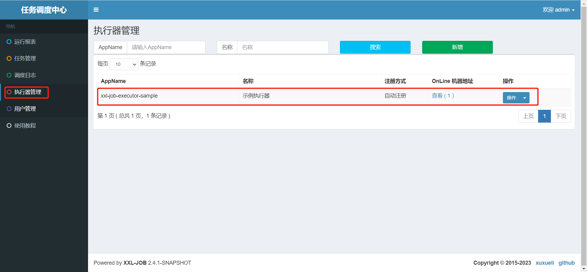

上面我们启动了xxl-job-executor-sample-springboot 执行器项目，当前已注册上来，我们执行使用改执行器。

执行器属性说明：

```
AppName: 是每个执行器集群的唯一标示AppName, 执行器会周期性以AppName为对象进行自动注册。可通过该配置自动发现注册成功的执行器, 供任务调度时使用;
名称: 执行器的名称, 因为AppName限制字母数字等组成,可读性不强, 名称为了提高执行器的可读性;排序: 执行器的排序, 系统中需要执行器的地方,如任务新增, 将会按照该排序读取可用的执行器列表;
注册方式：调度中心获取执行器地址的方式；    
	自动注册：执行器自动进行执行器注册，调度中心通过底层注册表可以动态发现执行器机器地址；    
	手动录入：人工手动录入执行器的地址信息，多地址逗号分隔，供调度中心使用；
机器地址："注册方式"为"手动录入"时有效，支持人工维护执行器的地址信息；
```

#### 步骤二：新建任务：

登录调度中心：<http://localhost:8080/xxl-job-admin> 

默认登录账号 “admin/123456”

任务管理 ==》 新增

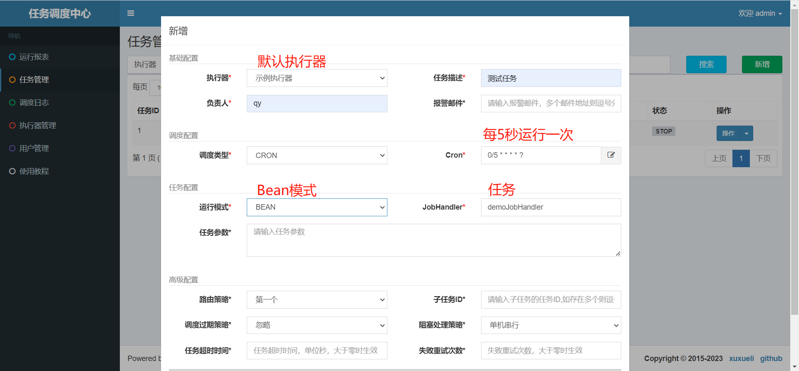

添加成功，如图：

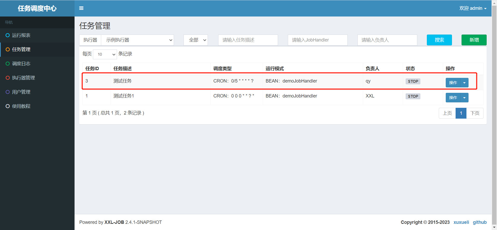

#### 步骤三：执行器项目开发job方法

使用xxl-job-executor-sample-springboot项目job实例，与步骤二的JobHandler配置一致

```java
/**
 * 1、简单任务示例（Bean模式）
 */
@XxlJob("demoJobHandler")
public void demoJobHandler() throws Exception {
    XxlJobHelper.log("XXL-JOB, Hello World.");

    for (int i = 0; i < 5; i++) {
        XxlJobHelper.log("beat at:" + i);
        TimeUnit.SECONDS.sleep(2);
    }
    // default success
}
```

#### 步骤四：启动任务

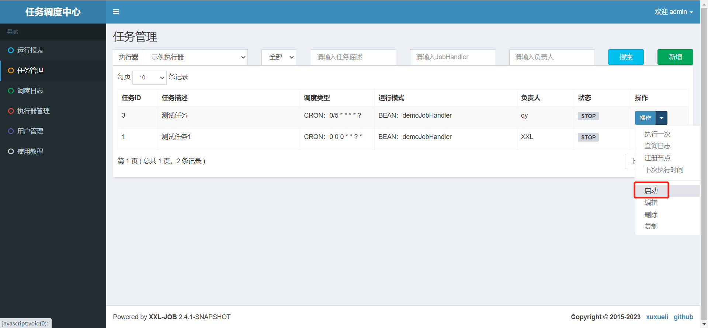

任务列表状态改变，如图：

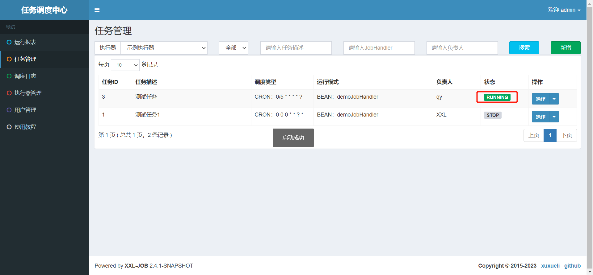

设置断点，执行结果：

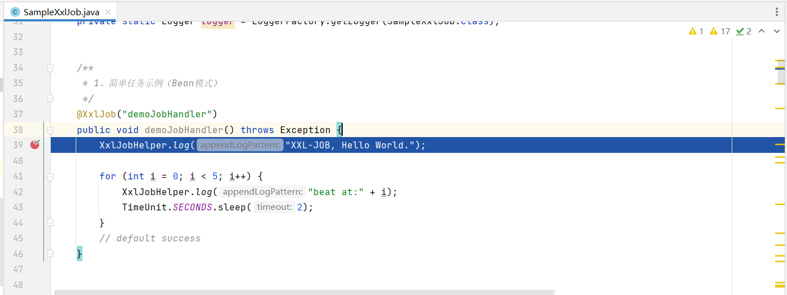

查看调度日志：

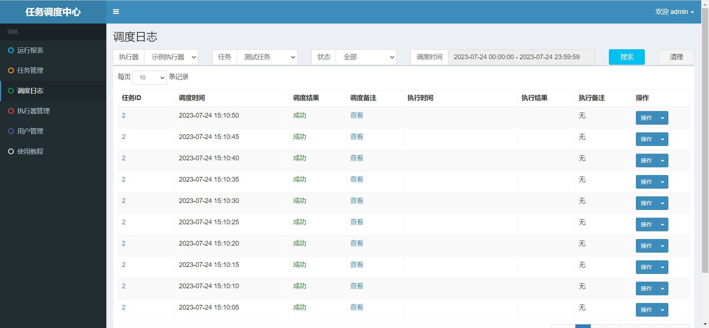

# 3 项目使用XXL-JOB

我们使用单独的一个微服务模块service-dispatch集成XXL-JOB执行器

## 3.1 集成XXL-JOB

该过程与2.4.4 配置部署“执行器项目类似

### 3.1.1 maven依赖

已引入，就忽略

```xml
<!-- xxl-job-core -->
<dependency>
    <groupId>com.xuxueli</groupId>
    <artifactId>xxl-job-core</artifactId>
    <version>2.4.0</version>
</dependency>
```

注：当前远程maven仓库只更新到2.4.0，也可以把上面项目包安装到本地仓库，对于当前项目使用这两个版本无差异

### 3.1.2 执行器配置

application.yaml 格式：

```yaml
xxl:
  job:
    admin:
      # 调度中心部署跟地址 [选填]：如调度中心集群部署存在多个地址则用逗号分隔。执行器将会使用该地址进行"执行器心跳注册"和"任务结果回调"；为空则关闭自动注册
      addresses: http://localhost:8080/xxl-job-admin
      # 执行器通讯TOKEN [选填]：非空时启用
    accessToken: default_token

    executor:
      # 执行器AppName [选填]：执行器心跳注册分组依据；为空则关闭自动注册
      appname: xxl-job-executor-sample
      # 执行器注册 [选填]：优先使用该配置作为注册地址，为空时使用内嵌服务 ”IP:PORT“ 作为注册地址。从而更灵活的支持容器类型执行器动态IP和动态映射端口问题。
      address:
      # 执行器IP [选填]：默认为空表示自动获取IP，多网卡时可手动设置指定IP，该IP不会绑定Host仅作为通讯实用；地址信息用于 "执行器注册" 和 "调度中心请求并触发任务"；
      ip:
      # 执行器端口号 [选填]：小于等于0则自动获取；默认端口为9999，单机部署多个执行器时，注意要配置不同执行器端口；
      port: 9999
      # 执行器运行日志文件存储磁盘路径 [选填] ：需要对该路径拥有读写权限；为空则使用默认路径；
      logpath: /data/applogs/xxl-job/jobhandler
      # 执行器日志文件保存天数 [选填] ： 过期日志自动清理, 限制值大于等于3时生效; 否则, 如-1, 关闭自动清理功能；
      logretentiondays: 30
```

直接放入application.properties 配置文件中即可

```properties
# log config
xxl.job.admin.addresses=http://127.0.0.1:8080/xxl-job-admin
xxl.job.accessToken=
xxl.job.executor.appname=xxl-job-executor-sample
xxl.job.executor.address=
xxl.job.executor.ip=
xxl.job.executor.port=9999
xxl.job.executor.logpath=/data/applogs/xxl-job/jobhandler
xxl.job.executor.logretentiondays=30
```


注：如果已配置，忽略

### 3.1.3 执行器组件配置

将xxl-job-executor-sample-springboot 执行器项目的XxlJobConfig类复制过来

```java
package com.atguigu.tingshu.dispatch.config;

import com.xxl.job.core.executor.impl.XxlJobSpringExecutor;
import org.slf4j.Logger;
import org.slf4j.LoggerFactory;
import org.springframework.beans.factory.annotation.Value;
import org.springframework.context.annotation.Bean;
import org.springframework.context.annotation.Configuration;

/**
 * xxl-job config
 *
 */
@Configuration
public class XxlJobConfig {
    private Logger logger = LoggerFactory.getLogger(XxlJobConfig.class);

    @Value("${xxl.job.admin.addresses}")
    private String adminAddresses;

    @Value("${xxl.job.accessToken}")
    private String accessToken;

    @Value("${xxl.job.executor.appname}")
    private String appname;

    @Value("${xxl.job.executor.address}")
    private String address;

    @Value("${xxl.job.executor.ip}")
    private String ip;

    @Value("${xxl.job.executor.port}")
    private int port;

    @Value("${xxl.job.executor.logpath}")
    private String logPath;

    @Value("${xxl.job.executor.logretentiondays}")
    private int logRetentionDays;


    @Bean
    public XxlJobSpringExecutor xxlJobExecutor() {
        logger.info(">>>>>>>>>>> xxl-job config init.");
        XxlJobSpringExecutor xxlJobSpringExecutor = new XxlJobSpringExecutor();
        xxlJobSpringExecutor.setAdminAddresses(adminAddresses);
        xxlJobSpringExecutor.setAppname(appname);
        xxlJobSpringExecutor.setAddress(address);
        xxlJobSpringExecutor.setIp(ip);
        xxlJobSpringExecutor.setPort(port);
        xxlJobSpringExecutor.setAccessToken(accessToken);
        xxlJobSpringExecutor.setLogPath(logPath);
        xxlJobSpringExecutor.setLogRetentionDays(logRetentionDays);

        return xxlJobSpringExecutor;
    }

    /**
     * 针对多网卡、容器内部署等情况，可借助 "spring-cloud-commons" 提供的 "InetUtils" 组件灵活定制注册IP；
     *
     *      1、引入依赖：
     *          <dependency>
     *             <groupId>org.springframework.cloud</groupId>
     *             <artifactId>spring-cloud-commons</artifactId>
     *             <version>${version}</version>
     *         </dependency>
     *
     *      2、配置文件，或者容器启动变量
     *          spring.cloud.inetutils.preferred-networks: 'xxx.xxx.xxx.'
     *
     *      3、获取IP
     *          String ip_ = inetUtils.findFirstNonLoopbackHostInfo().getIpAddress();
     */

}
```

到处，我们已经将XXL-JOB集成到项目中了

### 3.1.4 测试任务

编写测试任务

```java
package com.atguigu.tingshu.dispatch.job;

import com.xxl.job.core.handler.annotation.XxlJob;
import lombok.extern.slf4j.Slf4j;
import org.springframework.stereotype.Component;


@Slf4j
@Component
public class DispatchJobHandler {

    @XxlJob("firstJobHandler")
    public void firstJobHandler() {
        log.info("xxl-job项目集成测试");
    }
}
```

在调度中心配置任务

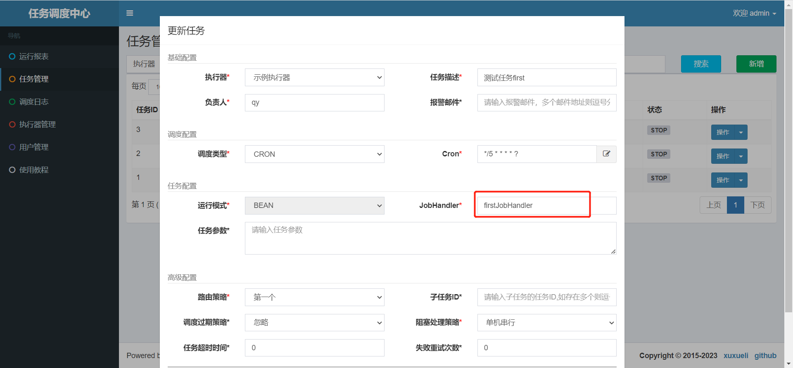

启动任务，测试

## 3.2 更新排行榜

前面我们讲过排行榜，为了减轻服务器压力，排行榜的数据要求不需要实时，我们可以1个小时或者1天更新一次排行榜都可以，当前以1个小时更新一次排行榜为例。

### 3.2.1 编写更新排行榜Feign接口

前面在service-search模块已提供更新排行榜接口，在此直接写远程调用的feign接口即可

操作模块：service-search-client

#### SearchFeignClient

远程调用Feign接口

```java
/**
 * 更新排行榜
 * @return
 */
@GetMapping("api/search/albumInfo/updateLatelyAlbumRanking")
Result updateLatelyAlbumRanking();
```

#### SearchDegradeFeignClient

远程调用服务降级容错类

```java
@Override
public Result updateLatelyAlbumRanking() {
    return null;
}
```

### 3.2.2 编写JobHandler任务

在DispatchJobHandler类编写任务

```java
@Autowired
private XxlJobLogMapper xxlJobLogMapper;

@Autowired
private SearchFeignClient searchFeignClient;

/**
 * 更新排行榜
 */
@XxlJob("updateLatelyAlbumRankingJob")
public void updateLatelyAlbumRankingJob() {
    log.info("更新排行榜：{}", XxlJobHelper.getJobId());

    // 记录定时任务相关的日志信息
    // 封装日志对象
    XxlJobLog xxlJobLog = new XxlJobLog();
    xxlJobLog.setJobId(XxlJobHelper.getJobId());
    long startTime = System.currentTimeMillis();
    try {
        searchFeignClient.updateLatelyAlbumRanking();

        xxlJobLog.setStatus(1);//成功
    } catch (Exception e) {
        xxlJobLog.setStatus(0);//失败
        xxlJobLog.setError(ExceptionUtil.getErrorMessage(e));
        log.error("定时任务执行失败，任务id为：{}", XxlJobHelper.getJobId());
        e.printStackTrace();
    } finally {
        //耗时
        int times = (int) (System.currentTimeMillis() - startTime);
        xxlJobLog.setTimes(times);
        xxlJobLogMapper.insert(xxlJobLog);
    }
}
```

### 3.2.3 配置任务

**每1小时执行1次的Cron表达式：0 0 0/1 * * ?**

**JobHandler：updateLatelyAlbumRankingJob**

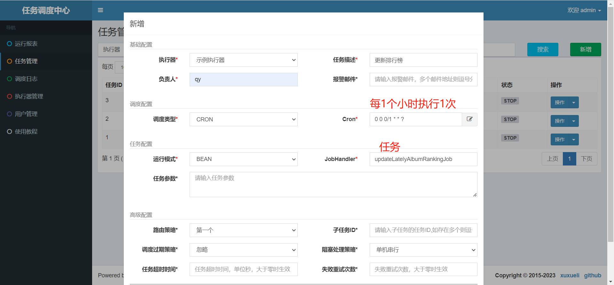


## 3.3 更新Vip到期失效状态

购买VIP会员服务，到期后我们要更新状态，前面判断VIP服务的时候，我们不仅判断了vip状态值，还判断了VIP失效时间，这样即使vip过期了后状态还没改变，通过vip过期时间它也不能享受VIP服务了，为了减轻服务器压力，每天凌晨更新前一天到期的vip会员状态

### 3.3.1 封装更新Vip到期失效状态接口

#### UserInfoApiController

定义controller接口

```java
@Operation(summary = "更新Vip到期失效状态")
@GetMapping("updateVipExpireStatus")
public Result updateVipExpireStatus() {
   userInfoService.updateVipExpireStatus();
   return Result.ok();
}
```

#### UserInfoService

定义service接口

```java
void updateVipExpireStatus();
```

#### UserInfoServiceImpl

接口实现

```java
@Override
public void updateVipExpireStatus() {
  //	获取到当前时间
  LocalDate localDate = LocalDate.now();
  LocalDateTime localDateTime = LocalDateTime.of(localDate, LocalTime.MIN);
  //	localDateTime 与 Date 转换
  Instant instant = localDateTime.atZone(ZoneId.systemDefault()).toInstant();
  Date date = Date.from(instant);
  LambdaQueryWrapper<UserInfo> wrapper = new LambdaQueryWrapper<>();
  wrapper.eq(UserInfo::getIsVip,1);
  wrapper.select(UserInfo::getId);
  wrapper.lt(UserInfo::getVipExpireTime,date);
  //	查询到当前过期用户列表
  List<UserInfo> userInfoList = this.list(wrapper);
  //	判断当前集合不为空
  if (!CollectionUtils.isEmpty(userInfoList)){
    for (UserInfo userInfo : userInfoList) {
      userInfo.setIsVip(0);
    }2
    //	批量更新
    this.saveOrUpdateBatch(userInfoList);
  }
}
```

### 3.3.2 封装Feign接口

#### UserInfoFeignClient

远程调用Feign接口

```java
/**
 * 更新Vip到期失效状态
 * @return
 */
@GetMapping("api/user/userInfo/updateVipExpireStatus")
Result updateVipExpireStatus();
```

#### UserInfoDegradeFeignClient

远程调用服务降级容错类

```java
@Override
public Result<UserInfoVo> getUserInfoVo(Long userId) {
    return null;
}
```

### 3.3.3 编写JobHandler任务

在DispatchJobHandler类编写任务

```java
@Autowired
private UserInfoFeignClient userInfoFeignClient;

/**
 * 更新Vip到期失效状态
 */
@XxlJob("updateVipExpireStatusJob")
public void updateVipExpireStatusJob() {
    log.info("更新Vip到期失效状态：{}", XxlJobHelper.getJobId());

    //记录定时任务相关的日志信息
    //封装日志对象
    XxlJobLog xxlJobLog = new XxlJobLog();
    xxlJobLog.setJobId(XxlJobHelper.getJobId());
    long startTime = System.currentTimeMillis();
    try {
        userInfoFeignClient.updateVipExpireStatus();

        xxlJobLog.setStatus(1);//成功
    } catch (Exception e) {
        xxlJobLog.setStatus(0);//失败
        xxlJobLog.setError(ExceptionUtil.getErrorMessage(e));
        log.error("定时任务执行失败，任务id为：{}", XxlJobHelper.getJobId());
        e.printStackTrace();
    } finally {
        //耗时
        int times = (int) (System.currentTimeMillis() - startTime);
        xxlJobLog.setTimes(times);
        xxlJobLogMapper.insert(xxlJobLog);
    }
}
```

### 3.2.4 配置任务

配置方式如上，重要参数如下：

**每天0点执行1次的Cron表达式：0 0 0 * * ?**

**JobHandler：updateVipExpireStatusJob**


### 更新排行榜

手动调用一次更新，查看排行榜。后续会整合 xxl-job 分布式定时任务调度框架做定时调用。

排行榜：热度评分

#### 控制器

在SearchApiController 中添加控制器

```java
/**
  * 更新排行榜
  * @return
  */
@SneakyThrows
@Operation(summary = "更新排行榜")
@GetMapping("updateLatelyAlbumRanking")
public Result updateLatelyAlbumRanking() {
  //  调用服务层方法
  searchService.updateLatelyAlbumRanking();
  //  默认返回
  return Result.ok();
}
```

#### 接口

```java
/**
  * 更新排行榜
  */
void updateLatelyAlbumRanking();
```

#### 实现类

思路：

    1. 先查询所有一级分类数据
    2. 按照每个维度来统计排行 热度:hotScore、播放量:playStatNum、订阅量:subscribeStatNum、购买量:buyStatNum、评论数:commentStatNum
    3. 从es中重新获取排序之后的专辑信息，并写入缓存中

```java
@SneakyThrows
@Override
public void updateLatelyAlbumRanking() {
  //  排行榜，按分类维度统计, 先获取分类数据
  Result<List<BaseCategory1>> baseCategory1Result = categoryFeignClient.findAllCategory1();
  Assert.notNull(baseCategory1Result,"对象不能为空");
  List<BaseCategory1> baseCategory1List = baseCategory1Result.getData();
  if (!CollectionUtils.isEmpty(baseCategory1List)){
    //  循环遍历
    for (BaseCategory1 baseCategory1 : baseCategory1List) {
      // 统计维度：热度:hotScore、播放量:playStatNum、订阅量:subscribeStatNum、购买量:buyStatNum、评论数:commentStatNum
      String[] rankingDimensionArray = new String[]{"hotScore", "playStatNum", "subscribeStatNum", "buyStatNum", "commentStatNum"};
      for (String rankingDimension : rankingDimensionArray) {
        SearchResponse<AlbumInfoIndex> response = elasticsearchClient.search(s -> s
                                                                             .index("albuminfo")
                                                                             .size(10)
                                                                             .sort(t -> t.field(f -> f.field(rankingDimension).order(SortOrder.Desc))), AlbumInfoIndex.class);
        //  解析查询列表
        List<AlbumInfoIndex> albumInfoIndexList = searchResponse.hits().hits().stream().map(Hit::source).collect(Collectors.toList());
        //  将排行榜数据更新到缓存中
 this.redisTemplate.boundHashOps(RedisConstant.RANKING_KEY_PREFIX+baseCategory1.getId()).put(rankingDimension,albumInfoIndexList);
      }
    }
  }
}
```

获取全部一级分类

```java
@FeignClient(value = "service-album", fallback = CategoryDegradeFeignClient.class)
public interface CategoryFeignClient {
	/**
     * 获取全部一级分类
     * @return
     */
    @GetMapping("api/album/category/findAllCategory1")
    Result<List<BaseCategory1>> findAllCategory1();
}
```

熔断类：

```java
@Component
public class CategoryDegradeFeignClient implements CategoryFeignClient {
    @Override
    public Result<List<BaseCategory1>> findAllCategory1() {
        return null;
    }
}
```

service-album 微服务中BaseCategoryApiController控制器中添加

```java
/**
 * 查询所有的一级分类数据
 * @return
 */
@Operation(summary = "查询所有的一级分类信息")
@GetMapping("findAllCategory1")
public Result<List<BaseCategory1>> findAllCategory1() {
	//	获取所有的一级分类数据
	List<BaseCategory1> baseCategory1List = baseCategoryService.findAllCategory1();
	return Result.ok(baseCategory1List);
}
```

接口：

```java
/**
  * 获取所有一级分类数据
  * @return
  */
List<BaseCategory1> findAllCategory1();
```

实现类：

```java
@Override
public List<BaseCategory1> findAllCategory1() {
  return baseCategory1Mapper.selectList(new LambdaQueryWrapper<BaseCategory1>().orderByAsc(BaseCategory1::getOrderNum));
}
```

### 获取排行榜

点击排行榜的时候，能看到获取排行榜的地址

排行榜：key=ranking:category1Id  field = hotScore 或 playStatNum 或 subscribeStatNum 或 buyStatNum 或albumCommentStatNum value=List\<AlbumInfoIndexVo\>

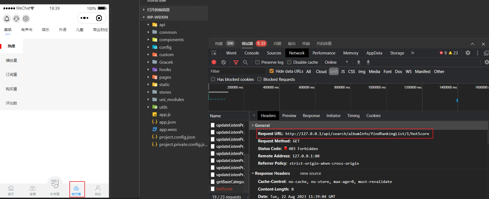

#### 控制器

SearchApiController 控制器中添加

```java
/**
  * 获取排行榜列表
  * @param category1Id
  * @param dimension
  * @return
  */
@Operation(summary = "获取排行榜列表")
@Parameters({
  @Parameter(name = "category1Id",description = "一级分类",in = ParameterIn.PATH,required = true),
  @Parameter(name = "dimension",description = "热度:hotScore、播放量:playStatNum、订阅量:subscribeStatNum、购买量:buyStatNum、评论数:albumCommentStatNum",required = true,in = ParameterIn.PATH),
})
@GetMapping("findRankingList/{category1Id}/{dimension}")
public Result<List<AlbumInfoIndexVo>> findRankingList(@PathVariable Long category1Id, @PathVariable String dimension) {
  //  调用服务层方法
  List<AlbumInfoIndexVo> infoIndexVoList = searchService.findRankingList(category1Id, dimension);
  //  返回结果集
  return Result.ok(infoIndexVoList);
}
```

#### 接口

```java
/**
  * 获取排行榜列表
  * @param category1Id
  * @param dimension
  * @return
  */
List<AlbumInfoIndexVo> findRankingList(Long category1Id, String dimension);
```

#### 实现类

```java
@Override
public List<AlbumInfoIndexVo> findRankingList(Long category1Id, String dimension) {
	return (List<AlbumInfoIndexVo>) redisTemplate.boundHashOps(RedisConstant.RANKING_KEY_PREFIX + category1Id).get(dimension);
}
```

### 听专辑：播放最近一次播放记录

#### 控制器

 UserListenProcessApiController 

我们需要根据用户Id 来获取播放记录 ，需要获取到专辑Id 与声音Id 封装到map中然后返回数据即可！

如何知道最近播放的记录？ 是通过MongoDB中存储声音记录去查询！{按照 userId, updateTime 排序 取出 albumId,trackId}

```java
/**
 * 获取最近一次播放声音
 * @return
 */
@GuiGuLogin
@Operation(summary = "获取最近一次播放声音")
@GetMapping("/getLatelyTrack")
public Result<Map<String,Object>> getLatelyTrack() {
   // 获取用户Id
   Long userId = AuthContextHolder.getUserId();
   // 获取播放记录
   Map<String,Object> map = userListenProcessService.getLatelyTrack(userId);
   // 返回数据
   return Result.ok(map);
}
```

#### 接口

```java
/**
 * 获取播放记录
 * @param userId
 * @return
 */
Map<String, Object> getLatelyTrack(Long userId);
```

#### 实现类

```java
@Override
public Map<String, Object> getLatelyTrack(Long userId) {
   Query query = Query.query(Criteria.where("userId").is(userId));
   Sort sort = Sort.by(Sort.Direction.DESC, "updateTime");
   query.with(sort);
   UserListenProcess userListenProcess = mongoTemplate.findOne(query, UserListenProcess.class, MongoUtil.getCollectionName(MongoUtil.MongoCollectionEnum.USER_LISTEN_PROCESS, userId));
   if(null == userListenProcess) {
      return null;
   }
   Map<String, Object> map = new HashMap<>();
   map.put("albumId", userListenProcess.getAlbumId());
   map.put("trackId", userListenProcess.getTrackId());
   return map;
}
```

